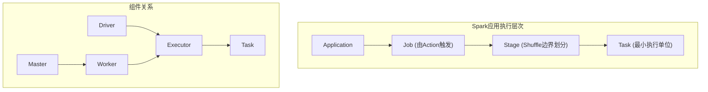
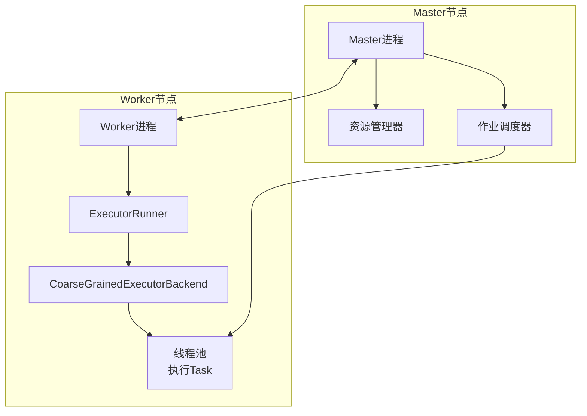
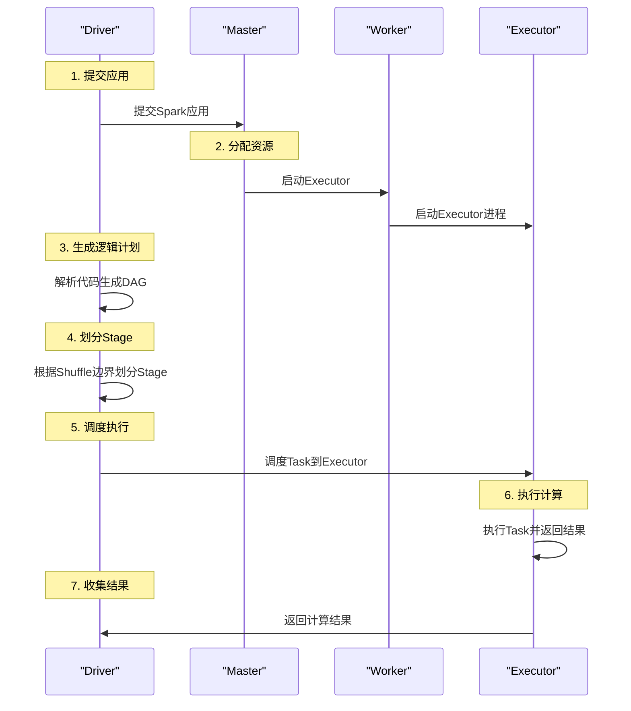
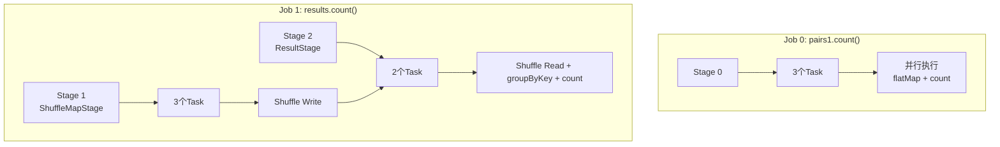

## 导语：理解Spark的基石

Apache Spark作为当今大数据处理领域的核心技术之一，其设计理念和架构模型深刻影响了分布式计算的发展。要真正掌握Spark，必须从理解其核心概念和系统架构开始。这就像学习一门新语言前，必须先掌握其语法和词汇一样重要。本文将深入剖析Spark的关键概念、系统架构和工作原理，为您构建坚实的Spark知识基础。

## 一、Spark核心概念体系

### 1.1 集群管理角色

#### Master（Cluster Manager）
**Master**是Spark集群的领导者，类似于Hadoop中的NameNode。它负责：
- 管理集群资源分配
- 接收Client提交的作业
- 向Worker节点发送执行命令
- 监控集群运行状态

#### Worker（Worker Node）
**Worker**是集群中的工作节点，执行Master的指令：
- 分配计算资源
- 执行具体的计算任务
- 监控任务运行状态

### 1.2 作业执行组件

#### Driver
**Driver**是Spark作业运行时的主进程，负责：
- 解析作业逻辑
- 生成执行计划（DAG）
- 调度Task到Executor
- 收集计算结果

#### Executor
**Executor**是实际执行计算任务的地方：
- 分布在集群的Worker节点上
- 每个Executor是一个JVM进程
- 可以并行执行多个Task
- 接收Driver的命令加载和运行Task

#### Task
**Task**是Spark中最小的计算单位：
- 以线程方式运行在Executor中
- 每个Task对应RDD的一个partition
- 执行具体的计算操作（如map、reduce等）

### 1.3 调度与优化组件

#### SparkContext
**SparkContext**是程序运行调度的核心，包含：
- **DAGScheduler**：高层调度器，划分Stage并生成有向无环图
- **TaskScheduler**：底层调度器，负责具体Task的调度和容错
- **SchedulerBackend**：管理集群中为程序分配的计算资源

#### RDD（Resilient Distributed Dataset）
**RDD**是Spark的核心数据抽象，具有以下特性：
- **不可变**（Immutable）：一旦创建就不能修改
- **惰性计算**（Lazy）：只有遇到Action算子才触发计算
- **粗粒度操作**：数据集级别而非单个数据级别的操作
- **容错性**：通过lineage信息可以重新计算丢失的数据

```scala
// RDD创建示例
val rdd = sparkContext.parallelize(Seq(1, 2, 3, 4, 5))
```

### 1.4 作业执行层次结构



## 二、Spark系统架构详解

### 2.1 部署模式对比

| 部署模式       | 资源管理         | 任务调度                 | 适用场景        |
| ---------- | ------------ | -------------------- | ----------- |
| Standalone | Spark自身      | Spark自身              | 学习、测试、小规模集群 |
| YARN       | Hadoop YARN  | YARN ResourceManager | Hadoop生态集成  |
| Mesos      | Apache Mesos | Mesos Master         | 多框架资源共享     |
| Kubernetes | Kubernetes   | Kubernetes Scheduler | 云原生部署       |

### 2.2 Standalone架构详解



#### Master节点职责
- 常驻Master进程
- 管理所有Worker节点
- 分配Spark任务给Worker
- 收集任务运行信息
- 监控Worker存活状态

#### Worker节点职责
- 常驻Worker进程
- 与Master通信
- 启动和管理Executor
- 监控任务运行状态

### 2.3 线程vs进程执行模型对比

**Hadoop MapReduce采用进程模型：**
- 每个map/reduce task作为一个独立的JVM进程运行
- **优点**：task相互独立，资源独享，便于监控
- **缺点**：进程启停开销大，数据共享困难，内存重复加载

**Spark采用线程模型：**
- Task以线程方式在Executor JVM中运行
- **优点**：启动快速，数据共享方便，内存利用率高
- **缺点**：线程间资源竞争，日志混合，容错复杂

```scala
// Spark任务提交示例
spark-submit \
  --master spark://master:7077 \
  --class com.example.GroupByTest \
  --executor-memory 4G \
  --total-executor-cores 8 \
  /path/to/application.jar \
  --num-mappers 3 \
  --num-kv-pairs 4 \
  --val-size 1000 \
  --num-reducers 2
```

## 三、Spark应用执行流程剖析

### 3.1 示例应用：GroupByTest

#### 代码逻辑分析

```scala
// GroupByTest简化代码
object GroupByTest {
  def main(args: Array[String]): Unit = {
    // 1. 初始化SparkSession
    val spark = SparkSession.builder()
      .appName("GroupByTest")
      .getOrCreate()
    
    // 2. 设置参数
    val numMappers = 3
    val numKVPairs = 4
    val valSize = 1000
    val numReducers = 2
    
    // 3. 生成测试数据
    val pairs1 = spark.sparkContext.parallelize(
      0 until numMappers, 
      numMappers
    ).flatMap { p =>
      val arr1 = new Array[(Int, Array[Byte])](numKVPairs)
      // 生成随机数据
      arr1
    }
    
    // 4. 缓存数据并执行第一个Action
    pairs1.cache()
    val count1 = pairs1.count()  // 触发第一个Job
    
    // 5. 执行groupByKey操作
    val results = pairs1.groupByKey(numReducers)
    
    // 6. 执行第二个Action
    val count2 = results.count()  // 触发第二个Job
    
    println(s"Count1: $count1, Count2: $count2")
  }
}
```

#### 执行流程分析



### 3.2 逻辑处理流程（Logical Plan）

#### Job 0：pairs1.count()的逻辑流程

```
ParallelCollectionRDD[0]
  |
  | flatMap()
  |
MapPartitionsRDD[1] (3 partitions, cached)
  |
  | count()
  |
Result: 12
```

#### Job 1：results.count()的逻辑流程

```
MapPartitionsRDD[1] (cached)
  |
  | groupByKey()
  |
ShuffledRDD[2] (2 partitions)
  |
  | count()
  |
Result: 4
```

### 3.3 物理执行计划（Physical Plan）

#### Stage划分原理

**Stage划分的关键原则：**
1. **Shuffle边界划分**：每个Shuffle操作产生新的Stage
2. **窄依赖合并**：窄依赖（Narrow Dependency）的操作可以合并到同一个Stage
3. **宽依赖分割**：宽依赖（Wide Dependency/Shuffle Dependency）必须划分Stage边界

#### GroupByTest的Stage划分



### 3.4 Spark UI可视化分析

#### Job监控界面

| 属性 | 说明 | 示例值 |
|------|------|--------|
| Job ID | 作业唯一标识 | 0, 1 |
| Description | 作业描述 | count at GroupByTest.scala:52 |
| Submitted | 提交时间 | 2023-10-01 10:00:00 |
| Duration | 执行时长 | 1.5s |
| Stages | 包含的Stage | Succeeded: 2 |

#### Stage详细信息

**Stage 0（Job 0）：**
- **操作**：parallelize() → flatMap() → count()
- **Task数量**：3个
- **数据源**：内存数组生成
- **输出**：直接返回Driver，无Shuffle

**Stage 1（Job 1 - ShuffleMapStage）：**
- **操作**：从缓存读取 → Shuffle Write
- **Task数量**：3个
- **输入**：缓存的MapPartitionsRDD
- **输出**：Shuffle数据写入磁盘

**Stage 2（Job 1 - ResultStage）：**
- **操作**：Shuffle Read → groupByKey() → count()
- **Task数量**：2个
- **输入**：Stage 1的Shuffle输出
- **输出**：聚合结果返回Driver

## 四、Spark编程模型演进

### 4.1 大数据编程模型发展

#### MapReduce模型（2004）
```java
// 典型的MapReduce编程
map(String key, String value):
    // 处理输入数据
    emit(intermediate_key, intermediate_value)

reduce(String key, Iterator values):
    // 聚合中间结果
    emit(output_key, output_value)
```

**局限性：**
- 编程模型固定（map-reduce两阶段）
- 复杂workflow实现困难
- 需要手动管理job间数据传递
- 学习曲线陡峭

#### 高层抽象模型

**FlumeJava（Google）：**
- 提供PCollection<T>、PTable<K,V>等数据结构
- 支持parallelDo()、groupByKey()、join()等操作
- 自动优化执行计划

**DryadLINQ（Microsoft）：**
- 提供IEnumerable<T>、DryadTable<T>等
- SQL-like操作：select()、groupBy()、join()
- 查询优化和并行执行

### 4.2 Spark RDD编程模型

#### RDD核心特性

**1. 不可变性（Immutable）**
```scala
val rdd1 = sc.parallelize(Seq(1, 2, 3))
val rdd2 = rdd1.map(_ * 2)  // 创建新的RDD，不修改原RDD
```

**2. 惰性计算（Lazy Evaluation）**
```scala
// Transformation操作不会立即执行
val mapped = rdd.map(_ * 2)        // 不会触发计算
val filtered = mapped.filter(_ > 3) // 不会触发计算
val result = filtered.count()       // Action操作触发实际计算
```

**3. 容错性（Fault Tolerance）**
```scala
// Lineage信息记录
val rdd1 = sc.textFile("input.txt")          // Lineage: textFile
val rdd2 = rdd1.flatMap(_.split(" "))       // Lineage: textFile → flatMap
val rdd3 = rdd2.map((_, 1))                 // Lineage: textFile → flatMap → map
val rdd4 = rdd3.reduceByKey(_ + _)          // Lineage: textFile → flatMap → map → reduceByKey

// 如果rdd4分区丢失，可以从头重新计算
```

#### 算子分类

**Transformation算子（惰性）：**
- `map()`、`flatMap()`、`filter()`
- `groupByKey()`、`reduceByKey()`
- `union()`、`join()`、`cogroup()`
- `repartition()`、`coalesce()`

**Action算子（触发计算）：**
- `count()`、`collect()`、`take()`
- `saveAsTextFile()`、`saveAsSequenceFile()`
- `foreach()`、`reduce()`、`aggregate()`

### 4.3 DataFrame和DataSet API

#### DataFrame（无类型）
```scala
// 创建DataFrame
val df = spark.read.json("people.json")

// 类SQL操作
df.select("name", "age")
  .filter($"age" > 21)
  .groupBy("age")
  .count()
  .show()
```

**特点：**
- 带有schema元信息（列名和类型）
- 基于RDD的分布式数据集
- Catalyst优化器自动优化
- 学习门槛较低

#### DataSet（强类型）
```scala
case class Person(name: String, age: Int)

// 创建DataSet
val ds = spark.read.json("people.json").as[Person]

// 类型安全的操作
ds.filter(_.age > 21)
  .map(_.name)
  .show()
```

**特点：**
- 编译时类型检查
- DataSet[Row]就是DataFrame
- 结合了RDD和DataFrame的优点
- 更好的性能优化

#### 缓存策略对比

| 数据类型 | cache()方法等价于 | 说明 |
|---------|------------------|------|
| RDD | persist(StorageLevel.MEMORY_ONLY) | 只缓存到内存，内存不足时重新计算 |
| DataSet | persist(StorageLevel.MEMORY_AND_DISK) | 优先内存，不足时溢写到磁盘 |

**源码对比：**
```scala
// RDD.scala中的cache方法
def cache(): this.type = persist()

// Dataset.scala中的cache方法  
def cache(): this.type = persist()
```

## 五、Spark应用开发实践

### 5.1 开发环境配置

#### 集群部署（Standalone）
```bash
# 1. 下载Spark
wget https://archive.apache.org/dist/spark/spark-2.4.3/spark-2.4.3-bin-hadoop2.7.tgz

# 2. 解压安装
tar -xzf spark-2.4.3-bin-hadoop2.7.tgz
cd spark-2.4.3-bin-hadoop2.7

# 3. 配置环境变量
export SPARK_HOME=/path/to/spark
export PATH=$SPARK_HOME/bin:$PATH

# 4. 配置集群
cp conf/slaves.template conf/slaves
echo "worker1" >> conf/slaves
echo "worker2" >> conf/slaves

# 5. 启动集群
sbin/start-all.sh
```

#### 本地开发（IntelliJ IDEA）
1. **创建Maven项目**
2. **添加Spark依赖**：
```xml
<dependency>
    <groupId>org.apache.spark</groupId>
    <artifactId>spark-core_2.12</artifactId>
    <version>2.4.3</version>
</dependency>
```
3. **编写本地测试代码**：
```scala
object LocalSparkTest {
  def main(args: Array[String]): Unit = {
    val conf = new SparkConf()
      .setAppName("LocalTest")
      .setMaster("local[2]")  // 本地模式，2个线程
    
    val sc = new SparkContext(conf)
    
    // 本地测试代码
    val data = Array(1, 2, 3, 4, 5)
    val rdd = sc.parallelize(data)
    val result = rdd.map(_ * 2).collect()
    
    println(result.mkString(", "))
    sc.stop()
  }
}
```

### 5.2 性能优化建议

#### 1. 合理设置分区数
```scala
// 根据数据大小设置合理分区
val inputRDD = sc.textFile("largefile.txt", 100)  // 100个分区

// 重分区优化
val optimizedRDD = rdd.repartition(200)  // 增加分区提高并行度
val coalescedRDD = rdd.coalesce(50)     // 减少分区减少shuffle
```

#### 2. 有效使用缓存
```scala
// 缓存策略选择
rdd.persist(StorageLevel.MEMORY_ONLY)           // 只缓存到内存
rdd.persist(StorageLevel.MEMORY_AND_DISK)       // 内存+磁盘
rdd.persist(StorageLevel.MEMORY_ONLY_SER)       // 序列化缓存
rdd.persist(StorageLevel.DISK_ONLY)             // 只缓存到磁盘

// 及时释放缓存
rdd.unpersist()  // 不再需要时及时释放
```

#### 3. 减少Shuffle操作
```scala
// 避免不必要的Shuffle
// 不推荐：产生Shuffle
val bad = rdd1.groupByKey().mapValues(_.sum)

// 推荐：使用reduceByKey减少Shuffle数据量
val good = rdd1.reduceByKey(_ + _)

// 使用广播变量减少数据传输
val broadcastVar = sc.broadcast(largeLookupTable)
rdd.map(x => broadcastVar.value.get(x))
```

### 5.3 调试与监控

#### 查看执行计划
```scala
// 查看逻辑计划
df.explain()

// 查看物理计划  
df.explain(true)

// 查看RDD依赖关系
rdd.toDebugString

// 查看Stage划分
println(rdd.dependencies)
```

#### Spark UI使用技巧

**关键监控指标：**
1. **Job进度**：监控各Stage完成情况
2. **Task统计**：查看Task执行时间和数据量
3. **存储信息**：监控缓存使用情况
4. **环境配置**：检查Spark配置参数
5. **Executor状态**：监控Executor资源使用

**常见问题排查：**
- **数据倾斜**：查看Task输入数据量是否均匀
- **内存不足**：监控GC时间和存储内存使用
- **网络瓶颈**：查看Shuffle读写时间
- **调度延迟**：检查Task调度时间和本地性

## 六、总结与展望

### 6.1 核心要点总结

1. **架构理解**：掌握Master-Worker架构，理解Driver-Executor执行模型
2. **概念体系**：清楚RDD、DataFrame、DataSet的区别和适用场景
3. **执行流程**：理解从逻辑计划到物理计划的转换过程
4. **Stage划分**：掌握Shuffle边界划分Stage的原则
5. **优化策略**：学会根据数据特性选择合适的缓存和分区策略

### 6.2 Spark演进趋势

**当前版本特性：**
- **结构化API**：DataFrame/DataSet成为主流编程接口
- **Catalyst优化器**：基于规则的查询优化
- **Tungsten引擎**：内存管理和代码生成优化
- **Structured Streaming**：统一的流批处理API

**未来发展方向：**
1. **性能优化**：继续提升Tungsten引擎效率
2. **生态整合**：更好地与AI、图计算等框架集成
3. **云原生**：优化Kubernetes部署和资源调度
4. **自动化调优**：基于机器学习的自动参数优化

### 6.3 学习建议

**入门阶段：**
1. 从RDD API开始，理解核心概念
2. 掌握常用的Transformation和Action算子
3. 学习使用Spark Shell进行交互式开发

**进阶阶段：**
1. 深入理解Spark内部原理和执行机制
2. 掌握性能调优和故障排查技巧
3. 学习Structured Streaming和MLlib等高级模块

**生产实践：**
1. 关注集群部署和运维监控
2. 学习与其他大数据组件（如Hadoop、Hive）集成
3. 掌握企业级应用开发的最佳实践

---

## 补充说明

本文基于Spark 2.4版本进行讲解，虽然Spark版本在不断更新，但核心设计原理变化不大。对于更新的Spark 3.x版本，主要变化包括：

1. **Adaptive Query Execution**：自适应查询执行优化
2. **Dynamic Partition Pruning**：动态分区裁剪
3. **ANSI SQL兼容性**：更好的SQL标准支持
4. **Pandas API增强**：更好的Python集成

建议读者在学习基本原理后，参考官方文档了解最新版本特性。Spark的强大之处不仅在于其技术设计，更在于其活跃的社区和持续的创新，这使得Spark能够不断适应大数据处理的新需求和新挑战。

下一篇：[[2. Spark的灵魂_深入理解RDD与DataSet]]