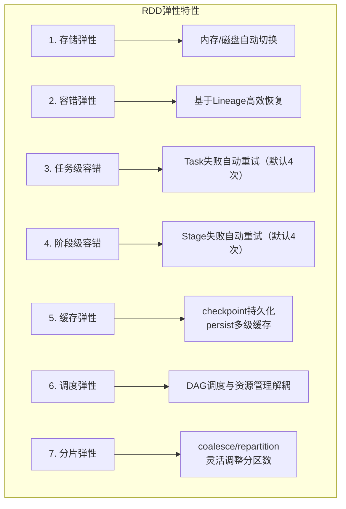
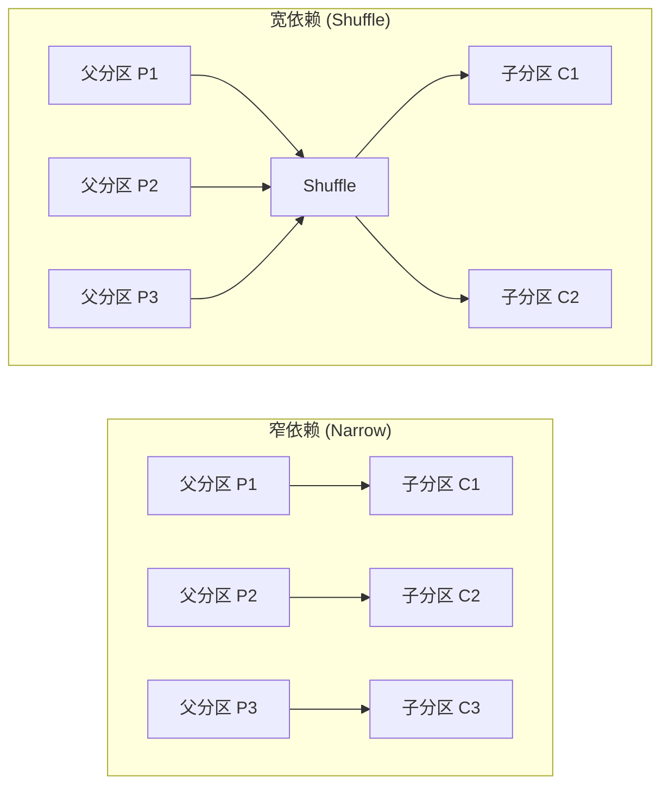

在大数据处理的星空中，Apache Spark以其卓越的性能和灵活的计算模型脱颖而出。其成功的核心，在于两个精妙设计的抽象：**弹性分布式数据集（RDD）** 和**数据集（DataSet）**。它们不仅是Spark实现高效、容错、一体化计算的基础，更是Spark区别于传统MapReduce框架的灵魂所在。理解它们，是掌握Spark的关键。

## 1. RDD：分布式内存的抽象核心

RDD是Spark最核心的数据结构，代表一个**不可变、可分区、内部元素可并行计算**的集合。它提供了一个高度受限但高效的共享内存模型，是Spark所有高级API（如DataFrame、DataSet）的基石。

### 1.1 RDD的五大特性剖析

RDD的设计理念体现在其五大核心特性上，这些特性共同保障了其弹性、高效和容错能力。

#### 特性一：分区列表 (A List of Partitions)
RDD由多个分区（Partition）组成，每个分区都是数据集的一个逻辑片段。分区是Spark进行并行计算的基本单位。
*   **分区数量决定并行度**：分区数决定了任务（Task）的数量，直接影响并行计算的能力。
*   **默认分区策略**：
    *   从集合创建时，默认分区数为程序分配到的CPU核心数（每个Core承载2-4个Partition）。
    *   从HDFS文件创建时，默认分区数等于文件的块（Block）数。

#### 特性二：每个分区的计算函数 (A Function for Computing Each Split)
每个RDD都包含一个`compute`函数，用于计算该RDD的每一个分区。这个函数定义了如何从父RDD（或数据源）的数据中计算出当前RDD分区的数据。计算是以分区为粒度进行的，实现了真正的分布式并行计算。

#### 特性三：依赖关系列表 (A List of Dependencies on Other RDDs)
RDD通过一系列转换（Transformation）操作生成新的RDD，从而形成**血统关系（Lineage）**。这种依赖关系是Spark实现容错机制的关键。依赖分为两种：
*   **窄依赖 (Narrow Dependency)**：父RDD的每个分区最多被子RDD的一个分区使用（如`map`、`filter`）。窄依赖允许在单个节点上以流水线（Pipeline）方式执行。
*   **宽依赖 (Wide Dependency / Shuffle Dependency)**：父RDD的一个分区会被子RDD的多个分区使用（如`groupByKey`、`reduceByKey`）。宽依赖意味着需要**Shuffle**操作，它是Spark划分任务阶段（Stage）的边界依据。

#### 特性四：键值对RDD的分区器 (Optionally, a Partitioner for Key-Value RDDs)
对于键值对（Key-Value）类型的RDD，可以有一个分区器（Partitioner），它决定了数据在不同节点上的分布策略（如按Key的哈希值分区）。常见的分区器有`HashPartitioner`和`RangePartitioner`。

#### 特性五：每个分区的优先位置列表 (Optionally, a List of Preferred Locations)
RDD会记录每个分区数据的**最佳计算位置**（例如，对于HDFS文件，就是数据块所在的节点）。Spark调度器会尽可能地将任务分配到其所需数据所在的节点上执行，遵循“**数据不动代码动**”的大数据计算理想，最大限度地减少网络传输开销。

这五大特性在RDD源码中由四个方法和一个属性体现：

```scala
// RDD.scala 中的关键定义
abstract class RDD[T: ClassTag](
    @transient private var _sc: SparkContext,
    @transient private var deps: Seq[Dependency[_]]
) extends Serializable with Logging {

    protected def getPartitions: Array[Partition] // 对应特性一
    protected def compute(split: Partition, context: TaskContext): Iterator[T] // 对应特性二
    protected def getDependencies: Seq[Dependency[_]] = deps // 对应特性三
    protected def getPreferredLocations(split: Partition): Seq[String] = Nil // 对应特性五
    @transient val partitioner: Option[Partitioner] = None // 对应特性四
}
```

### 1.2 RDD的物理存储与弹性解析

RDD是一个逻辑概念，其物理数据由**BlockManager**管理。每个分区（逻辑块）对应一个物理存储块（Block），可以存储在内存或磁盘上。Driver节点的`BlockManagerMaster`负责管理所有Block的元数据，Executor节点的`BlockManagerSlave`负责管理本地Block。

RDD的“弹性”具体体现在以下七个方面：



1.  **自动进行内存和磁盘数据存储的切换**：Spark优先使用内存，内存不足时自动将数据溢写到磁盘。
2.  **基于Lineage的高效容错机制**：RDD不可变且记录血统关系。当某个分区数据丢失时，只需根据Lineage重新计算该分区，无需回滚整个程序，开销极低。
3.  **Task失败自动重试**：默认重试4次（通过`spark.task.maxFailures`配置）。
4.  **Stage失败自动重试**：默认同样重试4次（通过`spark.stage.maxConsecutiveAttempts`配置）。
5.  **检查点（Checkpoint）和持久化（Persist）**：
    *   `persist()`/`cache()`：将RDD持久化到内存或磁盘，供后续操作重用，是性能优化的关键手段。缓存级别丰富（如`MEMORY_ONLY`, `MEMORY_AND_DISK_SER`, `OFF_HEAP`等）。
    *   `checkpoint()`：将RDD物化到可靠的分布式存储（如HDFS），并切断其Lineage。用于血统过长时的容错优化。
6.  **数据调度弹性**：DAGScheduler将作业（Job）分解为基于宽依赖的Stage，形成有向无环图（DAG）。这种调度模型与底层资源管理器（YARN, Mesos, Standalone）无关，提高了灵活性和容错性。
7.  **数据分片的高度弹性**：可以通过`coalesce`（减少分区，避免Shuffle）或`repartition`（增加分区，会引起Shuffle）灵活调整RDD的分区数量，以适应不同的数据量和计算需求。

## 2. DataSet：类型安全的结构化API

DataSet是Spark 1.6之后引入的API，它扩展了RDD的概念，为**强类型**的结构化数据提供了面向对象（Scala/Java）的编程接口。`DataFrame`是`DataSet[Row]`的别名，即非类型化的DataSet。

### 2.1 DataSet的核心特性

*   **强类型与类型安全**：在Scala和Java中，DataSet API支持编译时类型检查，避免运行时错误。
*   **优化执行引擎**：与DataFrame一样，DataSet也利用Catalyst优化器进行逻辑优化，并生成高效的字节码（Whole-Stage Code Generation）执行。
*   **编码器（Encoder）**：Encoder是Spark内部用于将JVM对象（如Scala case class或Java Bean）与Spark内部二进制格式进行高效转换的机制。它支持无需反序列化即可进行列式操作，并显著减少了内存占用和GC开销。
*   **懒加载（Lazy Evaluation）**：与RDD相同，DataSet的转换操作（Transformation）也是懒执行的，只有触发行动操作（Action）时才会真正计算。

### 2.2 DataSet的创建与操作

**创建DataSet的常见方法：**

```scala
// 方法一：从外部存储读取（例如 Parquet 文件）
import spark.implicits._
case class Person(name: String, age: Int)
val peopleDS = spark.read.parquet("path/to/file").as[Person] // Scala

// 方法二：通过现有DataSet转换
val namesDS = peopleDS.map(_.name) // 生成新的 DataSet[String]
```

**DataSet操作示例：**

以下示例展示了使用DataSet API进行过滤、连接、分组和聚合的完整流程。

```scala
// Scala 示例
case class Employee(name: String, deptId: Int, salary: Double, age: Int)
case class Department(id: Int, name: String)

val employees = spark.read.parquet("...").as[Employee]
val departments = spark.read.parquet("...").as[Department]

import org.apache.spark.sql.functions._

val result = employees.filter($"age" > 30)
  .join(departments, employees("deptId") === departments("id"))
  .groupBy(departments("name"), employees("gender"))
  .agg(
    avg(employees("salary")).as("avg_salary"),
    max(employees("age")).as("max_age")
  )

result.show()
```

## 3. RDD依赖关系详解

依赖关系是理解Spark执行计划和性能调优的基础。

### 3.1 窄依赖 (Narrow Dependency)

窄依赖中，父RDD的每个分区最多被一个子RDD分区消费。这允许在单个任务中完成计算，效率极高。

*   **OneToOneDependency**：一对一依赖，如`map`、`filter`操作。
    ```scala
    val rdd = sc.parallelize(Array(1, 2, 3))
    val mappedRdd = rdd.map(_ * 2) // OneToOneDependency
    // 输出: 2, 4, 6
    ```
*   **RangeDependency**：范围依赖，如`union`操作，将多个父RDD的分区按顺序合并到子RDD中。
    ```scala
    val rdd1 = sc.parallelize(Array("a", "b"))
    val rdd2 = sc.parallelize(Array("c", "d"))
    val unionRdd = rdd1.union(rdd2) // RangeDependency
    // 输出: a, b, c, d
    ```

### 3.2 宽依赖 (Shuffle Dependency)

宽依赖中，父RDD的一个分区数据会被分发到子RDD的多个分区中，这个过程称为**Shuffle**。它是划分Stage的依据，也是性能开销的主要来源。

*   **典型操作**：`groupByKey`、`reduceByKey`、`join`（非相同分区器时）等。
*   **示例**：`groupByKey`操作会产生宽依赖，将相同Key的数据聚合到一起。
    ```scala
    val pairs = sc.parallelize(Seq(("a", 1), ("b", 2), ("a", 3)))
    val grouped = pairs.groupByKey() // ShuffleDependency
    // 输出: (a, CompactBuffer(1, 3)), (b, CompactBuffer(2))
    ```



## 总结与应用场景

RDD和DataSet共同构成了Spark强大的计算模型：
*   **RDD**提供了最基础、最灵活的分布式数据抽象，适合需要**精细控制**计算过程、处理**非结构化数据**或实现复杂算法的场景。
*   **DataSet/DataFrame**在RDD之上提供了**高级的、声明式**的API，通过Catalyst优化器和Tungsten执行引擎，在**结构化/半结构化数据**的处理上（如ETL、数据分析、机器学习特征工程）能获得远超原生RDD API的性能和更简洁的代码。

**选择建议**：
- 对于ETL、数据分析和SQL查询，优先使用**DataFrame/DataSet API**。
- 当需要极致的控制力或处理自定义的非结构化数据时，使用**RDD API**。
- 在Scala/Java中，需要类型安全且利用优化时，使用**DataSet API**。

它们相辅相成，使得Spark能够为批处理、流处理、机器学习和图计算提供一体化、高性能的解决方案，极大地简化了大数据应用的开发和维护。