## 引言

在Spark编程中，**Transformation操作**是构建数据处理流水线的核心。这些操作通过对RDD（弹性分布式数据集）进行转换，生成新的RDD，形成有向无环图（DAG）的计算逻辑。理解各种Transformation操作的语义、实现机制和性能特性，对于编写高效、可扩展的Spark应用至关重要。

本笔记将系统梳理Spark中常用的Transformation操作，从简单的映射过滤到复杂的聚合连接，深入分析每个操作的逻辑处理流程、数据依赖关系和适用场景。

---

## 一、基础映射与过滤操作

### 1.1 map()和mapValues()操作

**语义**：对RDD中的每个元素应用函数转换。

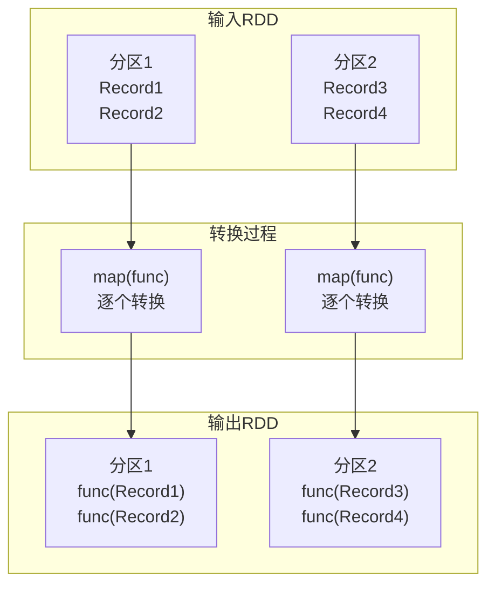

**关键特性**：
- 生成`MapPartitionsRDD`
- 数据依赖关系：`OneToOneDependency`（窄依赖）
- 输入输出一一对应，不改变分区结构

**示例代码**：
```scala
// map()示例：将每个元素乘以2
val rdd1 = sc.parallelize(List(1, 2, 3, 4))
val rdd2 = rdd1.map(x => x * 2)
// 结果：List(2, 4, 6, 8)

// mapValues()示例：对键值对的Value部分进行转换
val kvRDD = sc.parallelize(List(("a", 1), ("b", 2), ("c", 3)))
val result = kvRDD.mapValues(x => x * 10)
// 结果：List(("a", 10), ("b", 20), ("c", 30))
```

### 1.2 filter()和filterByRange()操作

**语义**：根据条件筛选RDD中的元素。

```mermaid
flowchart TD
    subgraph "输入RDD"
        P1["分区1<br>(1,"a")<br>(2,"b")<br>(3,"c")"]
        P2["分区2<br>(4,"d")<br>(5,"e")<br>(6,"f")"]
    end
    
    subgraph "过滤过程"
        P1 --> F1["filter(条件)<br>逐条判断"]
        P2 --> F2["filter(条件)<br>逐条判断"]
    end
    
    subgraph "输出RDD"
        R1["分区1<br>符合条件的记录"]
        R2["分区2<br>符合条件的记录"]
    end
    
    F1 --> R1
    F2 --> R2
```

**关键特性**：
- 生成`MapPartitionsRDD`
- 数据依赖关系：`OneToOneDependency`
- 可能减少数据量，但分区数量不变

**示例代码**：
```scala
// filter()示例：筛选Key为偶数的记录
val rdd1 = sc.parallelize(List((1,"a"), (2,"b"), (3,"c"), (4,"d"), (5,"e")))
val rdd2 = rdd1.filter{case (k, v) => k % 2 == 0}
// 结果：List((2,"b"), (4,"d"))

// filterByRange()示例：筛选Key在[2,4]范围内的记录
val rdd3 = rdd1.filterByRange(2, 4)
// 结果：List((2,"b"), (3,"c"), (4,"d"))
```

### 1.3 flatMap()和flatMapValues()操作

**语义**：将每个输入元素映射为多个输出元素（"展平"操作）。

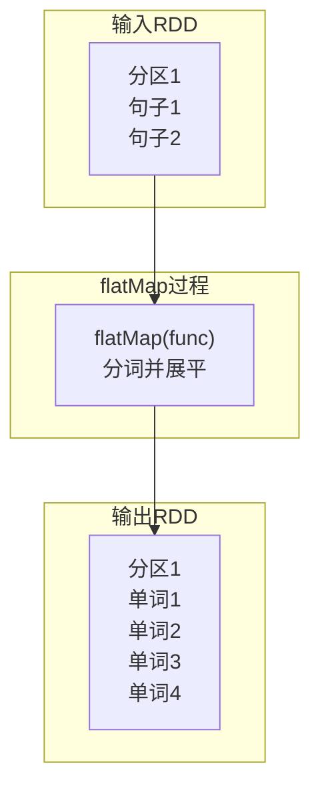

**关键特性**：
- 生成`MapPartitionsRDD`
- 数据依赖关系：`OneToOneDependency`
- 可以改变数据条数，常用于文本分词、数据展开等场景

**示例代码**：
```scala
// flatMap()示例：分词程序
val textRDD = sc.parallelize(List("Hello World", "Spark Programming"))
val wordsRDD = textRDD.flatMap(line => line.split(" "))
// 结果：List("Hello", "World", "Spark", "Programming")

// flatMapValues()示例：对Value进行展开
val kvRDD = sc.parallelize(List(("a", List(1,2)), ("b", List(3,4))))
val result = kvRDD.flatMapValues(list => list)
// 结果：List(("a",1), ("a",2), ("b",3), ("b",4))
```

---

## 二、采样操作

### 2.1 sample()操作

**语义**：对RDD进行随机采样。

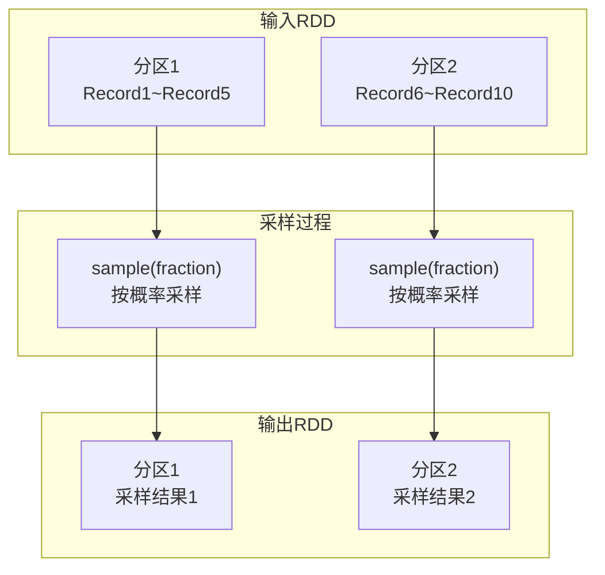

**关键特性**：
- 生成`PartitionwiseSampledRDD`
- 数据依赖关系：`OneToOneDependency`
- 两种采样模式：
  - `sample(false, fraction)`：伯努利抽样，每个元素以fraction概率被选中
  - `sample(true, fraction)`：泊松分布抽样，可能产生比原始数据更多的样本

**示例代码**：
```scala
val data = sc.parallelize(1 to 100)

// 无放回抽样：每个元素有20%的概率被选中
val sampled1 = data.sample(false, 0.2)

// 有放回抽样：使用泊松分布
val sampled2 = data.sample(true, 0.3)

// 获取约10%的数据作为训练集
val training = data.sample(false, 0.1)
```

### 2.2 sampleByKey()操作

**语义**：根据不同的Key设置不同的采样概率。

**关键特性**：
- 生成`MapPartitionsRDD`
- 数据依赖关系：`OneToOneDependency`
- 可以为每个Key指定不同的采样概率，适用于类别不平衡的数据集

**示例代码**：
```scala
val data = sc.parallelize(List(
    (1, "a"), (1, "b"), (1, "c"), (1, "d"),
    (2, "e"), (2, "f"), (2, "g")
))

// 定义每个Key的采样概率
val fractions = Map(1 -> 0.5, 2 -> 0.8)

// 无放回模式
val sampled1 = data.sampleByKey(false, fractions)

// 有放回模式
val sampled2 = data.sampleByKey(true, fractions)
```

---

## 三、分区级操作

### 3.1 mapPartitions()和mapPartitionsWithIndex()操作

**语义**：对整个分区进行操作，而不是单个元素。

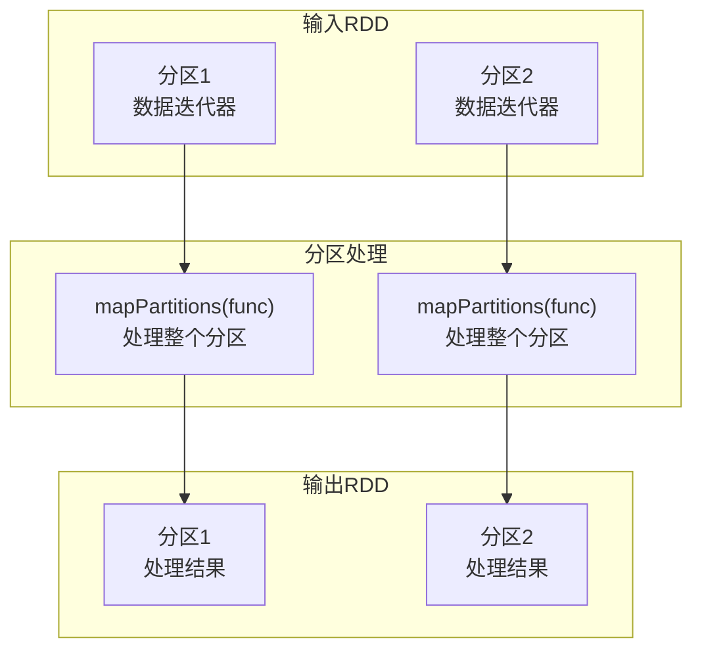

**关键特性**：
- 生成`MapPartitionsRDD`
- 数据依赖关系：`OneToOneDependency`
- **适用场景**：
  - 需要跨元素共享资源（如数据库连接、文件句柄）
  - 需要维护中间状态的处理
  - 批量操作比逐元素操作更高效的情况

**示例代码**：
```scala
// mapPartitions()示例：计算每个分区中奇数和偶数的和
val data = sc.parallelize(1 to 10, 3)

val result = data.mapPartitions { iter =>
    var (oddSum, evenSum) = (0, 0)
    while (iter.hasNext) {
        val num = iter.next()
        if (num % 2 == 0) evenSum += num
        else oddSum += num
    }
    Iterator((oddSum, evenSum))
}
// 结果：每个分区输出(奇数之和, 偶数之和)

// mapPartitionsWithIndex()示例：查看分区信息
val data2 = sc.parallelize(List("a", "b", "c", "d", "e"), 2)

val withIndex = data2.mapPartitionsWithIndex { (index, iter) =>
    iter.map(value => s"分区$index: $value")
}
// 结果：List("分区0: a", "分区0: b", "分区0: c", "分区1: d", "分区1: e")

// 数据库操作示例（高效方式）
val dbData = data.mapPartitions { iter =>
    // 每个分区只建立一次数据库连接
    val connection = createDatabaseConnection()
    val result = new ArrayBuffer[String]
    
    while (iter.hasNext) {
        val record = iter.next()
        // 处理并插入数据库
        insertToDatabase(connection, record)
        result += s"已处理: $record"
    }
    
    connection.close()
    result.iterator
}
```

### 3.2 partitionBy()操作

**语义**：按照指定的分区器对RDD重新分区。

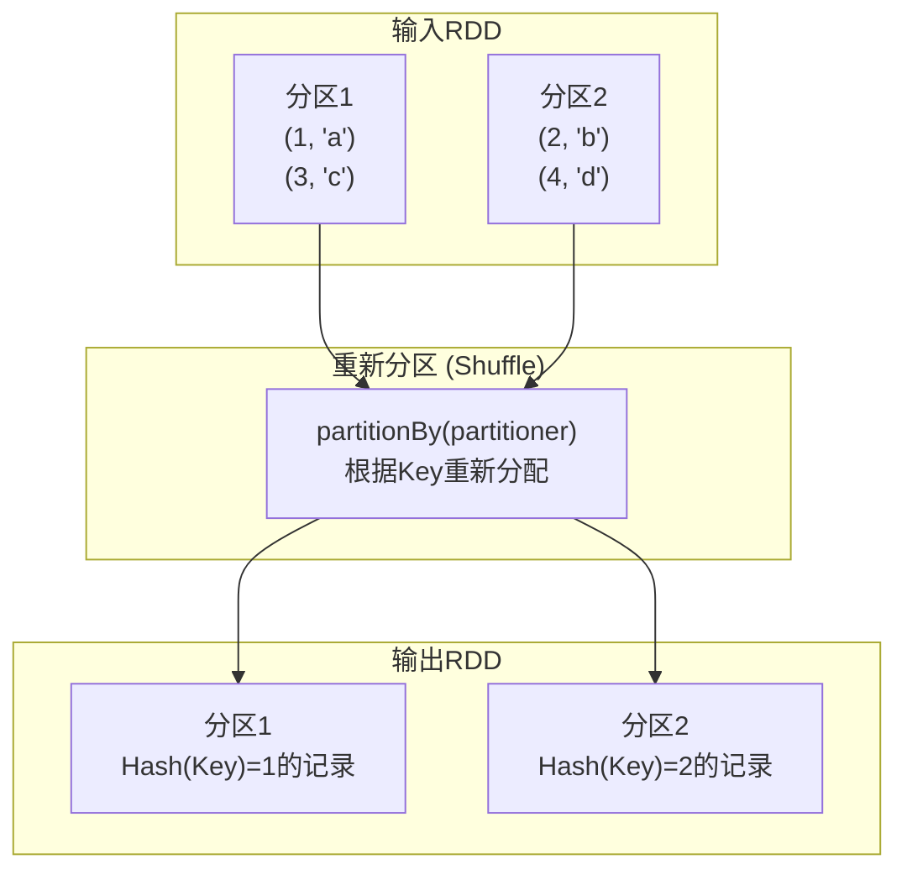

**关键特性**：
- 改变数据分布，可能产生Shuffle
- 常用分区器：
  - `HashPartitioner`：基于Key的哈希值分区
  - `RangePartitioner`：基于Key的范围分区（用于排序）
- `RangePartitioner`不保证分区内数据有序

**示例代码**：
```scala
val data = sc.parallelize(List(
    (1, "a"), (2, "b"), (3, "c"), (4, "d")
))

// 使用HashPartitioner重新分区
val hashPartitioned = data.partitionBy(new HashPartitioner(2))

// 使用RangePartitioner重新分区
val rangePartitioned = data.partitionBy(new RangePartitioner(2, data))

// 查看分区后的数据分布
rangePartitioned.mapPartitionsWithIndex { (index, iter) =>
    Iterator(s"分区$index: ${iter.toList}")
}.collect()
```

---

## 四、聚合操作

### 4.1 groupByKey()操作

**语义**：将相同Key的Value聚合到一起。

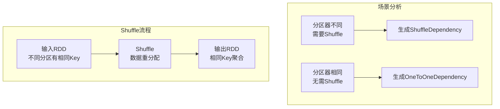

**关键特性**：
- 可能产生`ShuffleDependency`（宽依赖）
- 当child和parent RDD的partitioner相同且分区数一致时，使用`OneToOneDependency`
- **缺点**：Shuffle时产生大量中间数据，内存占用大

**示例代码**：
```scala
val data = sc.parallelize(List(
    ("apple", 1), ("banana", 2), ("apple", 3),
    ("banana", 4), ("orange", 5)
))

// 普通groupByKey（可能产生Shuffle）
val grouped1 = data.groupByKey()
// 结果：Map("apple" -> [1,3], "banana" -> [2,4], "orange" -> [5])

// 无Shuffle的groupByKey（当数据已预先分区好时）
val partitionedData = data.partitionBy(new HashPartitioner(3))
val grouped2 = partitionedData.groupByKey()
```

**性能建议**：在多数情况下，优先考虑使用`reduceByKey()`，因为它在Shuffle前会先在map端进行combine，减少数据传输量。

### 4.2 reduceByKey()操作

**语义**：对相同Key的Value使用指定函数进行归约。

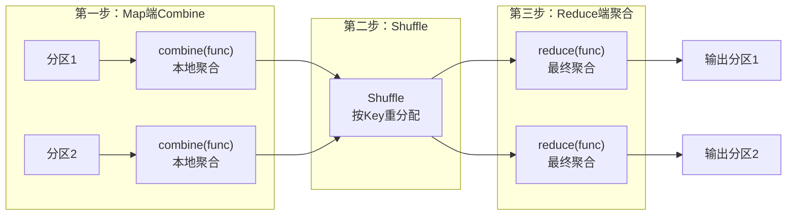

**关键特性**：
1. **两阶段聚合**：
   - Map端combine：先在每个分区内进行本地聚合
   - Reduce端reduce：Shuffle后进行全局聚合
2. **函数要求**：func必须满足**交换律**和**结合律**（因为Shuffle不保证数据到达顺序）
3. **性能优势**：相比`groupByKey()`，减少了数据传输量和内存使用

**示例代码**：
```scala
val data = sc.parallelize(List(
    ("a", 1), ("b", 2), ("a", 3),
    ("b", 4), ("c", 5)
))

// 求和操作
val sumByKey = data.reduceByKey(_ + _)
// 结果：Map("a"->4, "b"->6, "c"->5)

// 求最大值
val maxByKey = data.reduceByKey(math.max)
// 结果：Map("a"->3, "b"->4, "c"->5)

// 连接字符串（注意：需要满足结合律的实现）
val concatByKey = data.reduceByKey((x, y) => x + "," + y)
```

**适用场景**：
- 统计求和、计数、平均值等聚合操作
- 数据压缩，减少存储空间
- 流处理中的窗口聚合

### 4.3 aggregateByKey()操作

**语义**：更灵活的聚合操作，允许指定初始值和不同的聚合函数。

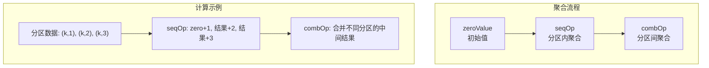

**关键特性**：
1. **三个参数**：
   - `zeroValue`：聚合初始值
   - `seqOp`：分区内聚合函数 `(U, V) => U`
   - `combOp`：分区间合并函数 `(U, U) => U`
2. **灵活性**：
   - seqOp和combOp可以使用不同的逻辑
   - zeroValue和record可以是不同类型
3. **与reduceByKey关系**：`reduceByKey()`是`aggregateByKey()`的特殊情况（seqOp=combOp）

**示例代码**：
```scala
val data = sc.parallelize(List(
    ("a", 1), ("a", 2), ("b", 3),
    ("b", 4), ("b", 5)
))

// 示例1：计算每个key的平均值（避免溢出）
val avgByKey = data.aggregateByKey((0.0, 0))(
    // seqOp: 分区内累加和计数
    (acc, value) => (acc._1 + value, acc._2 + 1),
    // combOp: 合并不同分区的结果
    (acc1, acc2) => (acc1._1 + acc2._1, acc1._2 + acc2._2)
  ).mapValues { case (sum, count) => sum / count }
// 结果：Map("a"->1.5, "b"->4.0)

// 示例2：字符串连接（使用不同分隔符）
val concatResult = data.aggregateByKey("")(
    // 分区内用"_"连接
    (str, num) => if (str.isEmpty) num.toString else str + "_" + num,
    // 分区间用"@"连接
    (str1, str2) => str1 + "@" + str2
)
```

**实际应用**（Spark MLlib中的使用）：
```scala
// FPGrowth算法中使用aggregateByKey统计频繁项
val transactions = sc.parallelize(Seq(
    Seq("a", "b", "c"),
    Seq("a", "b"),
    Seq("b", "c")
))

val itemCounts = transactions.flatMap(items => items.map(_ -> 1))
  .aggregateByKey(0)(_ + _, _ + _)

// NaiveBayes中使用aggregateByKey统计类别特征
val labeledData = sc.parallelize(Seq(
    (0, ("feature1", 1.0)),
    (1, ("feature1", 2.0)),
    (0, ("feature2", 1.5))
))

val aggregated = labeledData.aggregateByKey(Map[String, Double]())(
    // 分区内合并特征
    (map, (feature, value)) => map + (feature -> (map.getOrElse(feature, 0.0) + value)),
    // 分区间合并结果
    (map1, map2) => map1 ++ map2.map { case (k, v) => k -> (v + map1.getOrElse(k, 0.0)) }
)
```

### 4.4 combineByKey()操作

**语义**：最底层的聚合操作，提供最大的灵活性。

**关键特性**：
1. **三个函数参数**：
   - `createCombiner: V => C`：为每个Key创建初始累加器
   - `mergeValue: (C, V) => C`：将Value合并到累加器
   - `mergeCombiners: (C, C) => C`：合并不同分区的累加器
2. **与aggregateByKey关系**：
   - `aggregateByKey()`是基于`combineByKey()`实现的
   - `createCombiner`对应`zeroValue`，但前者是函数，后者是固定值
   - `mergeValue`对应`seqOp`
   - `mergeCombiners`对应`combOp`

**示例代码**：
```scala
val data = sc.parallelize(List(
    ("math", 85), ("math", 90), ("english", 88),
    ("math", 92), ("english", 95)
))

// 计算每科最高分和最低分
val scoreStats = data.combineByKey(
    // createCombiner: 创建初始值（分数，分数）
    score => (score, score),
    // mergeValue: 更新最高分和最低分
    (acc: (Int, Int), score: Int) => (math.max(acc._1, score), math.min(acc._2, score)),
    // mergeCombiners: 合并不同分区的结果
    (acc1: (Int, Int), acc2: (Int, Int)) => 
      (math.max(acc1._1, acc2._1), math.min(acc1._2, acc2._2))
)
// 结果：Map("math"->(92,85), "english"->(95,88))
```

### 4.5 foldByKey()操作

**语义**：带有初始值的reduceByKey。

**关键特性**：
- 介于`reduceByKey()`和`aggregateByKey()`之间
- 相比`reduceByKey()`：多了初始值zeroValue
- 相比`aggregateByKey()`：seqOp和combOp使用相同的func
- 基于`aggregateByKey()`实现

**示例代码**：
```scala
val data = sc.parallelize(List(
    ("a", 1), ("a", 2), ("b", 3),
    ("b", 4), ("c", 5)
))

// 使用foldByKey计算乘积（初始值为1）
val productByKey = data.foldByKey(1)(_ * _)
// 结果：Map("a"->2, "b"->12, "c"->5)

// 字符串连接
val concatByKey = data.foldByKey("")((str, num) => str + num.toString)
// 结果：Map("a"->"12", "b"->"34", "c"->"5")
```

---

## 五、连接与集合操作

### 5.1 cogroup()/groupWith()操作

**语义**：将多个RDD按Key进行分组聚合。

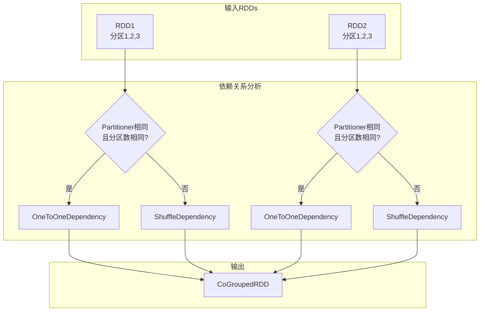

**关键特性**：
1. **多RDD聚合**：最多支持4个RDD同时cogroup
2. **智能依赖选择**：
   - 当parent和child RDD的partitioner相同且分区数一致时，使用`OneToOneDependency`
   - 否则使用`ShuffleDependency`
3. **输出结构**：
   - 生成`CoGroupedRDD`（聚合数据）
   - 生成`MapPartitionsRDD`（转换数据类型为`CompactBuffer`）

**示例代码**：
```scala
val rdd1 = sc.parallelize(List((1, "a"), (2, "b"), (3, "c")))
val rdd2 = sc.parallelize(List((1, "x"), (2, "y"), (4, "z")))

// 基本cogroup
val cogrouped = rdd1.cogroup(rdd2)
/* 结果：
   1 -> (CompactBuffer("a"), CompactBuffer("x"))
   2 -> (CompactBuffer("b"), CompactBuffer("y"))
   3 -> (CompactBuffer("c"), CompactBuffer())
   4 -> (CompactBuffer(), CompactBuffer("z"))
*/

// 无Shuffle的cogroup（当数据已预先分区好时）
val partitioned1 = rdd1.partitionBy(new HashPartitioner(2))
val partitioned2 = rdd2.partitionBy(new HashPartitioner(2))
val efficientCogroup = partitioned1.cogroup(partitioned2)

// 多RDD cogroup
val rdd3 = sc.parallelize(List((1, "m"), (3, "n")))
val multiCogroup = rdd1.cogroup(rdd2, rdd3)
```

### 5.2 join()操作

**语义**：基于Key连接两个RDD。

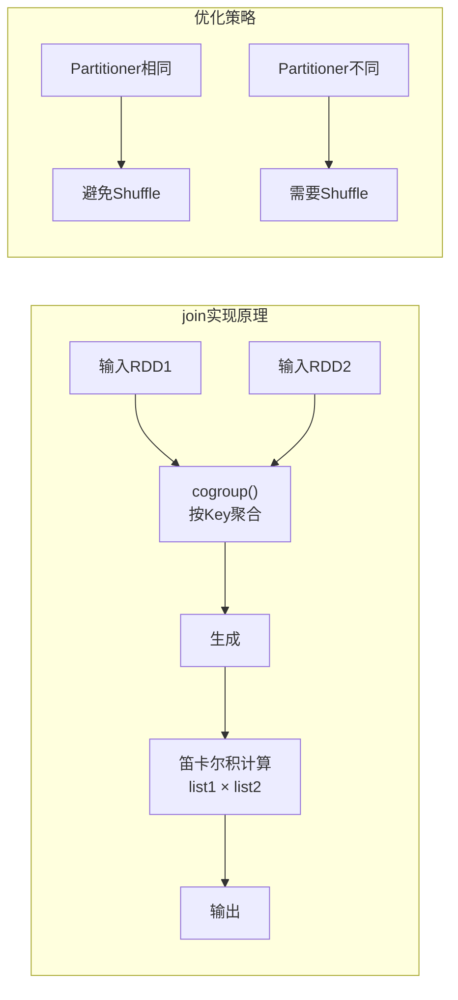

**关键特性**：
1. **基于cogroup实现**：
   - 先用cogroup聚合相同Key的数据
   - 然后对两个list做笛卡尔积
2. **四种执行计划**（取决于partitioner）：
   ```scala
   // 情况1：都需要Shuffle（默认）
   val result1 = rdd1.join(rdd2)
   
   // 情况2：rdd1已分区，避免Shuffle
   val partitioned1 = rdd1.partitionBy(new HashPartitioner(3))
   val result2 = partitioned1.join(rdd2)
   
   // 情况3：rdd2已分区，避免Shuffle
   val partitioned2 = rdd2.partitionBy(new HashPartitioner(3))
   val result3 = rdd1.join(partitioned2)
   
   // 情况4：都已分区，完全无Shuffle
   val result4 = partitioned1.join(partitioned2)
   ```
3. **输出类型**：`<K, (V, W)>`

**示例代码**：
```scala
val users = sc.parallelize(List(
    (1, "Alice"), (2, "Bob"), (3, "Charlie")
))

val orders = sc.parallelize(List(
    (1, "Order1"), (1, "Order2"), (2, "Order3"),
    (4, "Order4")
))

// 内连接
val userOrders = users.join(orders)
/* 结果：
   (1, ("Alice", "Order1"))
   (1, ("Alice", "Order2"))
   (2, ("Bob", "Order3"))
*/

// 左外连接（使用cogroup实现）
val leftJoin = users.leftOuterJoin(orders)
/* 结果：
   (1, ("Alice", Some("Order1")))
   (1, ("Alice", Some("Order2")))
   (2, ("Bob", Some("Order3")))
   (3, ("Charlie", None))
*/

// 右外连接
val rightJoin = users.rightOuterJoin(orders)

// 全外连接
val fullJoin = users.fullOuterJoin(orders)
```

### 5.3 cartesian()操作

**语义**：计算两个RDD的笛卡尔积。

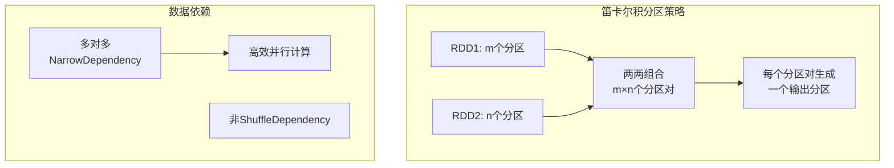

**关键特性**：
- 生成m×n个分区（m为rdd1分区数，n为rdd2分区数）
- 数据依赖：多对多的`NarrowDependency`（非Shuffle）
- 输出分区数据 = 对应两个输入分区数据的笛卡尔积

**示例代码**：
```scala
val rdd1 = sc.parallelize(List(1, 2, 3), 2)
val rdd2 = sc.parallelize(List("a", "b"), 2)

val cartesian = rdd1.cartesian(rdd2)
/* 结果：
   (1,"a"), (1,"b"), (2,"a"), (2,"b"), (3,"a"), (3,"b")
*/

// 应用场景：网格搜索参数
val params1 = sc.parallelize(List(0.1, 0.01, 0.001))
val params2 = sc.parallelize(List(10, 50, 100))

val paramGrid = params1.cartesian(params2)
// 结果：所有参数组合
```

### 5.4 sortByKey()操作

**语义**：按照Key对RDD进行排序。

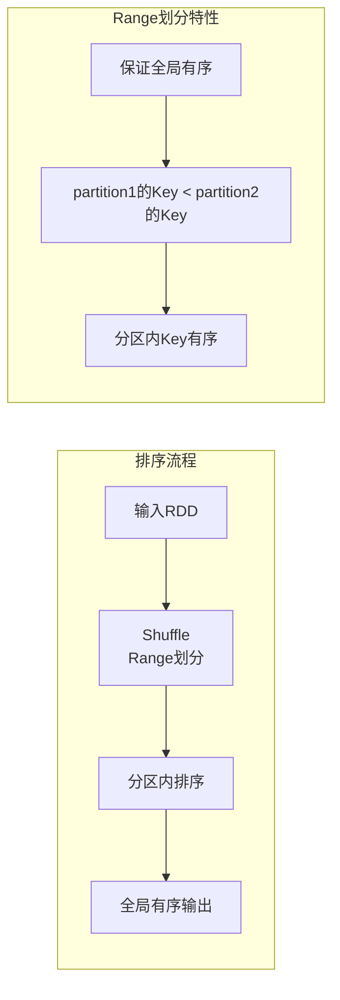

**关键特性**：
1. **使用RangePartitioner**：保证全局有序
2. **Shuffle操作**：产生`ShuffleDependency`
3. **排序范围**：
   - Key全局有序
   - 相同Key的Value无序
4. **无map端combine**

**示例代码**：
```scala
val data = sc.parallelize(List(
    (3, "c"), (1, "a"), (4, "d"), (2, "b")
))

// 升序排序
val sortedAsc = data.sortByKey()
// 结果：List((1,"a"), (2,"b"), (3,"c"), (4,"d"))

// 降序排序
val sortedDesc = data.sortByKey(false)
// 结果：List((4,"d"), (3,"c"), (2,"b"), (1,"a"))

// 自定义排序（Secondary Sort方案）
case class CompositeKey(primary: Int, secondary: String) 
  extends Ordered[CompositeKey] {
  def compare(that: CompositeKey): Int = {
    val primaryCompare = this.primary.compareTo(that.primary)
    if (primaryCompare != 0) primaryCompare
    else this.secondary.compareTo(that.secondary)
  }
}

// 方法1：使用Secondary Sort
val secondarySorted = data.map { case (k, v) => 
  (CompositeKey(k, v), null)
}.sortByKey().map(_._1)

// 方法2：先groupByKey再排序Value
val groupAndSort = data.groupByKey()
  .mapValues(values => values.toList.sorted)
  .flatMap { case (k, vs) => vs.map(v => (k, v)) }
```

---

## 六、分区调整操作

### 6.1 coalesce()操作

**语义**：调整RDD的分区数量。

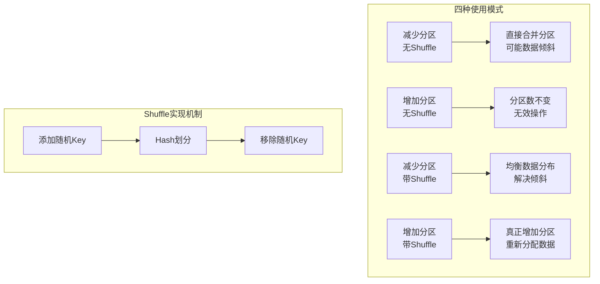

**四种使用场景**：

| 场景 | 参数 | 效果 | 依赖关系 |
|------|------|------|----------|
| 减少分区（默认） | `coalesce(N)` | 直接合并相邻分区 | NarrowDependency |
| 增加分区（默认） | `coalesce(M)` M>原分区数 | 无效，分区数不变 | NarrowDependency |
| 减少分区（带Shuffle） | `coalesce(N, shuffle=true)` | 均衡减少分区 | ShuffleDependency |
| 增加分区（带Shuffle） | `coalesce(M, shuffle=true)` M>原分区数 | 真正增加分区 | ShuffleDependency |

**示例代码**：
```scala
val rdd = sc.parallelize(1 to 100, 5)  // 5个分区

// 场景1：减少分区到2个（无Shuffle）
val coalesced1 = rdd.coalesce(2)
println(s"分区数: ${coalesced1.getNumPartitions}")  // 输出: 2

// 场景2：增加分区到6个（无Shuffle，无效）
val coalesced2 = rdd.coalesce(6)
println(s"分区数: ${coalesced2.getNumPartitions}")  // 输出: 5

// 场景3：减少分区到2个（带Shuffle，均衡）
val coalesced3 = rdd.coalesce(2, shuffle = true)

// 场景4：增加分区到6个（带Shuffle，有效）
val coalesced4 = rdd.coalesce(6, shuffle = true)
println(s"分区数: ${coalesced4.getNumPartitions}")  // 输出: 6

// 查看数据分布
coalesced4.mapPartitionsWithIndex { (index, iter) =>
  Iterator(s"分区$index: ${iter.size}个元素")
}.collect()
```

### 6.2 repartition()操作

**语义**：重新分区，总是使用Shuffle。

**关键特性**：
- 相当于`coalesce(numPartitions, shuffle = true)`
- 可以增加或减少分区
- 重新均衡数据分布

**示例代码**：
```scala
val rdd = sc.parallelize(1 to 100, 3)

// 增加分区
val repartitioned1 = rdd.repartition(6)
println(s"分区数: ${repartitioned1.getNumPartitions}")  // 输出: 6

// 减少分区
val repartitioned2 = rdd.repartition(2)
println(s"分区数: ${repartitioned2.getNumPartitions}")  // 输出: 2

// 应用场景：解决数据倾斜
val skewedData = sc.parallelize(
  List.fill(90)(1) ++ List.fill(5)(2) ++ List.fill(5)(3), 3
)

// 重新分区以均衡负载
val balancedData = skewedData.repartition(10)
```
