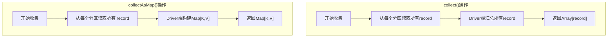
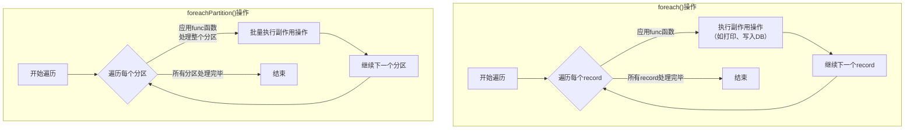
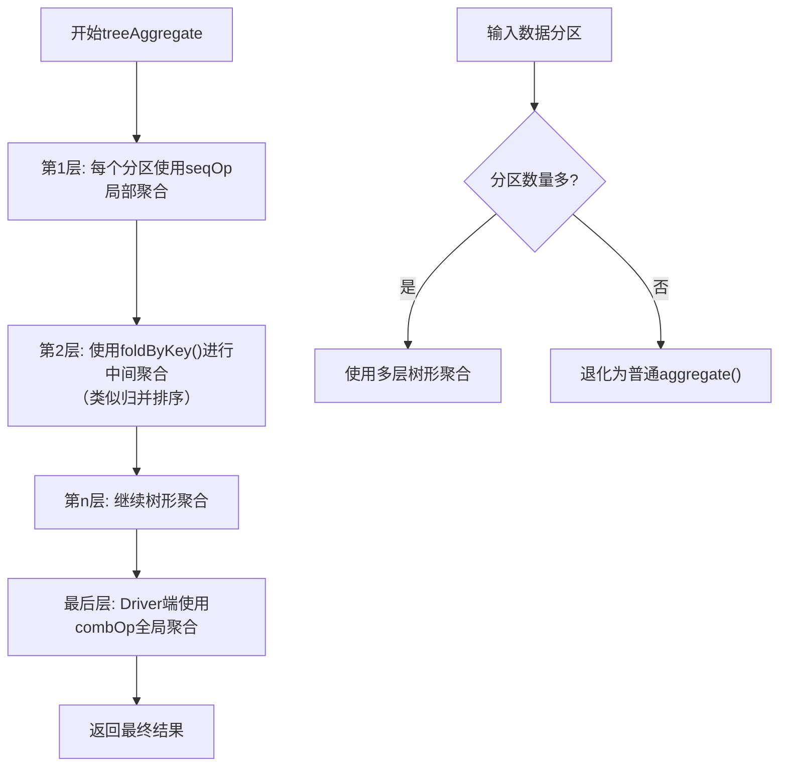
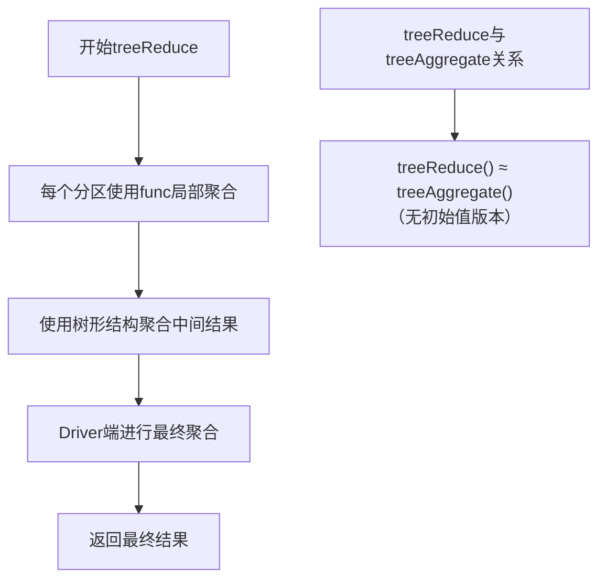
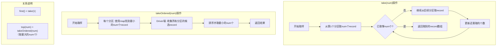
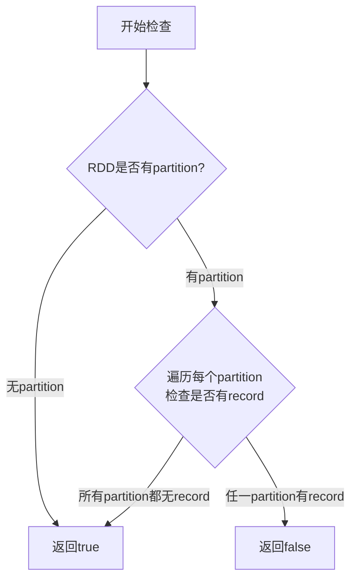
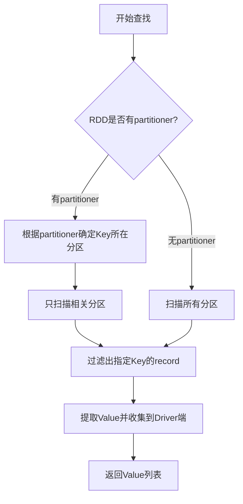
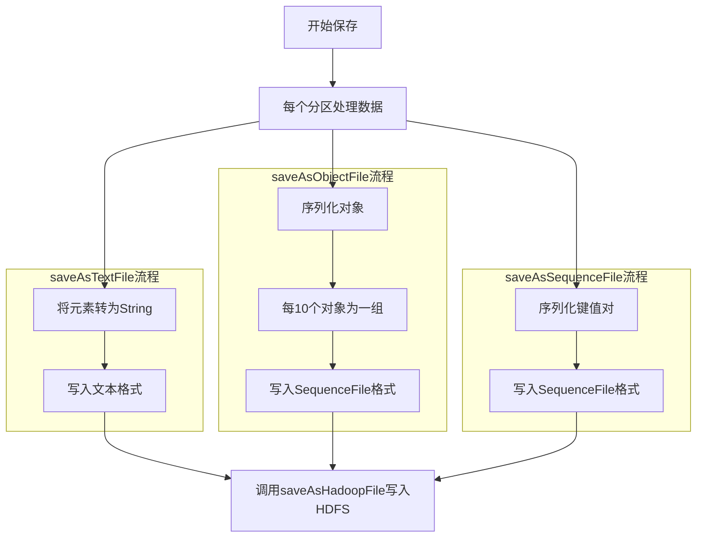

```mermaid
flowchart TD
    subgraph "fold(zeroValue)(func)操作"
        A["开始聚合"] --> B["每个分区: 使用zeroValue初始值<br>应用func进行局部聚合"]
        B --> C["Driver端: 使用zeroValue初始值<br>聚合所有分区结果"]
        C --> D["返回最终聚合结果"]
    end
    
    subgraph "reduce(func)操作"
        E["开始聚合"] --> F["每个分区: 应用func进行局部聚合<br>（无初始值）"]
        F --> G["Driver端: 聚合所有分区结果<br>（无初始值）"]
        G --> H["返回最终聚合结果"]
    end
    
    subgraph "aggregate(zeroValue)(seqOp, combOp)操作"
        I["开始聚合"] --> J["每个分区: 使用zeroValue初始值<br>应用seqOp进行局部聚合"]
        J --> K["Driver端: 使用zeroValue初始值<br>应用combOp聚合分区结果"]
        K --> L["返回最终聚合结果"]
    end
```

## 导语

在Spark编程中，RDD操作分为两类：**Transformation**（转换）和**Action**（动作）。Transformation操作是惰性的，它们只是定义了计算逻辑而不立即执行；而Action操作才是真正触发计算并返回结果或输出数据的操作。理解各种Action操作的工作原理、适用场景和性能特点，对于编写高效、可靠的Spark应用程序至关重要。

本文将深入解析Spark中常用的Action操作，通过逻辑流程图和代码示例，帮助你全面掌握这些核心操作的内部机制。

---

## 一、Action操作的核心特征

**判断依据**：区分Transformation和Action操作的最简单方法是**看返回值类型**：
- **Transformation操作**：通常返回一个新的`RDD`类型
- **Action操作**：通常返回数值、集合数据结构（如`Map`、`List`），或者不返回值（如写入文件）

## 二、统计类Action操作

### 2.1 `count()` / `countByKey()` / `countByValue()`

这些操作用于统计RDD中的元素数量，但统计的粒度不同。

#### 逻辑处理流程



```mermaid
flowchart TD
    subgraph "count()操作"
        A["开始统计"] --> B["计算每个分区的record数量"]
        B --> C["Driver端汇总所有分区结果"]
        C --> D["返回总数"]
    end
    
    subgraph "countByKey()操作"
        E["开始统计"] --> F["mapValues: 将<K,V>转为<K,1>"]
        F --> G["reduceByKey: 分区内聚合"]
        G --> H["Driver端汇总形成Map<K,Int>"]
        H --> I["返回统计结果"]
    end
    
    subgraph "countByValue()操作"
        J["开始统计"] --> K["map: 将record转为<record,null>"]
        K --> L["reduceByKey: 统计每个record出现次数"]
        L --> M["Driver端汇总形成Map[record,Int]"]
        M --> N["返回统计结果"]
    end
```

#### 核心特点对比

| 操作 | 统计对象 | 返回值类型 | 内存风险 |
|------|----------|------------|----------|
| `count()` | 所有元素数量 | `Long` | 低 |
| `countByKey()` | 每个Key出现的次数 | `Map[K, Long]` | **高**（Driver端存放Map） |
| `countByValue()` | 每个值出现的次数 | `Map[T, Long]` | **高**（Driver端存放Map） |

#### 示例代码

```scala
// 创建测试RDD
val rdd = sc.parallelize(Seq(("a", 1), ("b", 2), ("a", 3), ("c", 4), ("b", 5)))

// count() - 统计总元素数
val totalCount = rdd.count()  // 返回: 5

// countByKey() - 按Key统计
val keyCounts = rdd.countByKey()  // 返回: Map("a" -> 2, "b" -> 2, "c" -> 1)

// countByValue() - 按Value统计（需要先提取值）
val valueCounts = rdd.values.countByValue()  // 返回: Map(1 -> 1, 2 -> 1, 3 -> 1, 4 -> 1, 5 -> 1)
```

#### ⚠️ 重要注意事项

**大数据量下的优化策略**：
当数据量较大时，`countByKey()`和`countByValue()`会在Driver端生成一个巨大的Map，可能导致Driver内存溢出。推荐的做法是：

```scala
// 不推荐：大数据量下可能导致Driver OOM
// val result = rdd.countByKey()

// 推荐：使用reduceByKey进行分布式统计，然后写入文件系统
val safeCounts = rdd
  .mapValues(_ => 1L)  // 将每个元素映射为1
  .reduceByKey(_ + _)   // 分布式聚合
  .collectAsMap()       // 只在确定结果不大时使用，或直接保存到文件

// 更安全的做法：直接保存到分布式文件系统
rdd.mapValues(_ => 1L)
   .reduceByKey(_ + _)
   .saveAsTextFile("hdfs://path/to/counts")
```

---

## 三、收集类Action操作

### 3.1 `collect()` 和 `collectAsMap()`

这两个操作将RDD中的所有数据收集到Driver端，是**最危险**的Action操作之一。

#### 核心特点

| 操作 | 适用RDD类型 | 返回值类型 | 内存风险 |
|------|-------------|------------|----------|
| `collect()` | 任意RDD | `Array[T]` | **极高**（收集所有数据到Driver） |
| `collectAsMap()` | `RDD[(K, V)]` | `Map[K, V]` | **极高**（收集所有键值对到Driver） |

#### 逻辑处理流程



#### 示例代码

```scala
val rdd = sc.parallelize(Seq(1, 2, 3, 4, 5))

// collect() - 收集所有元素到Driver
val allData = rdd.collect()  // 返回: Array(1, 2, 3, 4, 5)

val kvRDD = sc.parallelize(Seq(("a", 1), ("b", 2), ("c", 3)))

// collectAsMap() - 收集为Map
val kvMap = kvRDD.collectAsMap()  // 返回: Map("a" -> 1, "b" -> 2, "c" -> 3)
```

#### ⚠️ 使用警告

**永远不要在大数据集上使用collect()**：
- 如果RDD有100GB数据，`collect()`会尝试将所有数据拉取到Driver内存
- 必然导致Driver内存溢出（OOM）
- 替代方案：使用`take(n)`查看样本，或写入分布式文件系统

---

## 四、遍历类Action操作

### 4.1 `foreach()` 和 `foreachPartition()`

这两个操作用于对RDD中的每个元素执行副作用操作（如写入数据库、发送消息），**不返回新RDD**。

#### 逻辑处理流程



#### 核心区别

| 操作 | 调用粒度 | 适用场景 | 性能特点 |
|------|----------|----------|----------|
| `foreach()` | 元素级别 | 对每个元素进行独立操作 | 连接开销大（如每个元素建立DB连接） |
| `foreachPartition()` | 分区级别 | 批量操作 | **性能更高**（如整个分区共享DB连接） |

#### 示例代码

```scala
val rdd = sc.parallelize(Seq(1, 2, 3, 4, 5), 2)

// foreach() - 对每个元素操作
rdd.foreach { x =>
  // 模拟写入数据库
  println(s"Processing element: $x")
  // database.insert(x)  // 实际场景可能是写入数据库
}

// foreachPartition() - 对整个分区批量操作
rdd.foreachPartition { partition =>
  // 整个分区共享一个数据库连接
  // val conn = database.getConnection()
  println("Starting partition processing")
  partition.foreach { x =>
    println(s"Processing in batch: $x")
    // conn.insert(x)
  }
  // conn.close()
  println("Finished partition processing")
}

// 实际应用：过滤并输出满足条件的元素
val filteredRDD = sc.parallelize(Seq(("a", 1), ("b", 2), ("c", 3), ("d", 4), ("e", 5)))

// 只输出Key >= "c"的记录
filteredRDD.foreach { case (key, value) =>
  if (key >= "c") {
    println(s"Key $key with value $value meets condition")
  }
}
```

---

## 五、聚合类Action操作

### 5.1 `fold()` / `reduce()` / `aggregate()`

这些操作对RDD中的所有元素进行全局聚合。

#### 逻辑处理流程



#### 核心区别

| 操作 | 初始值 | 聚合函数 | 与ByKey版本的区别 |
|------|--------|----------|-------------------|
| `fold(zeroValue)(func)` | 有（zeroValue） | 一个函数（func） | `fold()`返回单个值，`foldByKey()`返回RDD |
| `reduce(func)` | 无 | 一个函数（func） | `reduce()`返回单个值，`reduceByKey()`返回RDD |
| `aggregate(zeroValue)(seqOp, combOp)` | 有（zeroValue） | 两个函数（seqOp, combOp） | `aggregate()`返回单个值，`aggregateByKey()`返回RDD |

#### 数学关系

- `reduce(func)` ≈ `fold(zeroValue)(func)`（当zeroValue是func的单位元时）
- `reduce(func)` ≈ `aggregate(zeroValue)(seqOp, combOp)`（当seqOp=combOp=func且zeroValue是func的单位元时）

#### 示例代码

```scala
val rdd = sc.parallelize(Seq(1, 2, 3, 4, 5), 3)

// 1. fold() - 带初始值的聚合
// 计算: ((0+1+2) + (0+3) + (0+4+5)) = 15
val foldResult = rdd.fold(0)(_ + _)  // 返回: 15

// 2. reduce() - 不带初始值的聚合
// 计算: (1+2)+(3)+(4+5) = 15
val reduceResult = rdd.reduce(_ + _)  // 返回: 15

// 3. aggregate() - 更灵活的聚合（可以改变返回类型）
// 目标：同时计算总和与元素个数
val aggregateResult = rdd.aggregate((0, 0))(
  // seqOp: 分区内聚合 (sum, count)
  (acc, value) => (acc._1 + value, acc._2 + 1),
  // combOp: 分区间聚合
  (acc1, acc2) => (acc1._1 + acc2._1, acc1._2 + acc2._2)
)  // 返回: (15, 5) - (总和, 元素个数)

println(s"总和: ${aggregateResult._1}, 元素个数: ${aggregateResult._2}")
```

#### 为什么需要全局聚合操作？

虽然`reduceByKey()`、`aggregateByKey()`等操作可以在分区内和跨分区聚合相同Key的数据，但它们是**部分聚合**：
- 输入：`RDD[(K, V)]`
- 输出：`RDD[(K, func(list(V)))]`（每个Key的聚合结果）

而`reduce()`、`aggregate()`等提供的是**全局聚合**：
- 输入：`RDD[T]`
- 输出：`func(list(T))`（所有元素的聚合结果）

#### 性能问题与优化

**问题**：
- 全局聚合需要将所有分区的中间结果传输到Driver端
- Driver是单点聚合，存在效率和内存瓶颈

**解决方案**：使用树形聚合优化

---

### 5.2 `treeAggregate()` 和 `treeReduce()`

树形聚合通过多级聚合减少Driver端的压力。

#### `treeAggregate()` 逻辑流程



#### `treeReduce()` 逻辑流程



#### 示例代码

```scala
val rdd = sc.parallelize(1 to 1000000, 100)  // 100个分区

// 普通aggregate() - Driver压力大
// val result1 = rdd.aggregate(0)(_ + _, _ + _)

// treeAggregate() - 树形聚合，减轻Driver压力
// depth参数控制聚合层数
val treeResult = rdd.treeAggregate(0)(
  seqOp = (acc, value) => acc + value,
  combOp = (acc1, acc2) => acc1 + acc2,
  depth = 3  // 聚合深度
)

// treeReduce() - 无初始值的树形聚合
val treeReduceResult = rdd.treeReduce(_ + _, depth = 3)

println(s"树形聚合结果: $treeResult")
println(s"树形Reduce结果: $treeReduceResult")
```

#### 性能对比

| 场景 | 普通聚合 | 树形聚合 | 优势 |
|------|----------|----------|------|
| 分区数多 | Driver单点聚合压力大 | 多层中间聚合 | **减少数据传输量** |
| 数据量大 | 可能Driver OOM | 分散聚合压力 | **降低内存风险** |
| 网络带宽有限 | 所有数据流向Driver | 数据在Executor间聚合 | **减少网络瓶颈** |

---

## 六、取样类Action操作

### 6.1 `take()` / `first()` / `takeOrdered()` / `top()`

这些操作用于从RDD中获取部分元素，避免了`collect()`的全部数据收集。

#### 逻辑处理流程



#### 核心特点

| 操作 | 功能 | 返回值类型 | 适用场景 |
|------|------|------------|----------|
| `take(num)` | 取前num个元素 | `Array[T]` | 快速查看数据样本 |
| `first()` | 取第1个元素 | `T` | 查看RDD的第一个元素 |
| `takeOrdered(num)` | 取最小的num个元素 | `Array[T]` | 需要Top-N最小值 |
| `top(num)` | 取最大的num个元素 | `Array[T]` | 需要Top-N最大值 |

#### 示例代码

```scala
val rdd = sc.parallelize(Seq(10, 5, 8, 3, 1, 9, 2, 7, 4, 6))

// take() - 取前n个元素（按分区顺序）
val firstThree = rdd.take(3)  // 返回: Array(10, 5, 8)

// first() - 取第一个元素
val firstElement = rdd.first()  // 返回: 10

// takeOrdered() - 取最小的n个元素（需要Ordering）
val smallestThree = rdd.takeOrdered(3)  // 返回: Array(1, 2, 3)

// top() - 取最大的n个元素（需要Ordering）
val largestThree = rdd.top(3)  // 返回: Array(10, 9, 8)

// 自定义排序规则
case class Person(name: String, age: Int)
val peopleRDD = sc.parallelize(Seq(
  Person("Alice", 25),
  Person("Bob", 30),
  Person("Charlie", 20),
  Person("David", 35)
))

// 按年龄取最小的2个
val youngestTwo = peopleRDD.takeOrdered(2)(Ordering.by(_.age))
// 返回: Array(Person("Charlie",20), Person("Alice",25))
```

#### ⚠️ 使用限制

虽然这些操作比`collect()`安全，但仍有注意事项：
- `takeOrdered()`和`top()`需要将每个分区的候选元素收集到Driver端排序
- 当`num`较大时，Driver端仍需处理大量数据
- 建议`num`不要超过Driver内存能容纳的大小

---

## 七、其他常用Action操作

### 7.1 `max()` 和 `min()`

这两个操作基于`reduce()`实现，用于查找最大/最小值。

```scala
val rdd = sc.parallelize(Seq(1, 5, 3, 9, 2, 7))

val maxValue = rdd.max()  // 返回: 9
val minValue = rdd.min()  // 返回: 1

// 等价于使用reduce()
val maxByReduce = rdd.reduce((a, b) => if (a > b) a else b)
val minByReduce = rdd.reduce((a, b) => if (a < b) a else b)
```

### 7.2 `isEmpty()`

检查RDD是否为空，可用于提前终止不必要的计算。



```scala
val emptyRDD = sc.parallelize(Seq.empty[Int])
val nonEmptyRDD = sc.parallelize(Seq(1, 2, 3))

println(s"emptyRDD是否为空: ${emptyRDD.isEmpty()}")  // true
println(s"nonEmptyRDD是否为空: ${nonEmptyRDD.isEmpty()}")  // false

// 实际应用：避免对空RDD执行计算
val filteredRDD = rdd.filter(_ > 100)
if (!filteredRDD.isEmpty()) {
  // 只有非空时才执行后续计算
  val result = filteredRDD.count()
  println(s"过滤后元素数量: $result")
} else {
  println("过滤后无数据，跳过后续计算")
}
```

### 7.3 `lookup(key)`

在键值对RDD中查找特定Key的所有Value。



```scala
val kvRDD = sc.parallelize(Seq(
  ("apple", 10),
  ("banana", 20),
  ("apple", 30),
  ("orange", 40),
  ("apple", 50)
))

// 查找特定Key的所有Value
val appleValues = kvRDD.lookup("apple")  // 返回: Seq(10, 30, 50)
val bananaValues = kvRDD.lookup("banana") // 返回: Seq(20)
val grapeValues = kvRDD.lookup("grape")   // 返回: Seq() （空序列）

println(s"apple的数量: ${appleValues}")  // [10, 30, 50]
println(s"banana的数量: ${bananaValues}") // [20]
println(s"grape的数量: ${grapeValues}")   // []

// 性能优化：使用partitioner
val partitionedRDD = kvRDD.partitionBy(new HashPartitioner(3)).persist()

// 有partitioner时，lookup()效率更高
val optimizedLookup = partitionedRDD.lookup("apple")
```

---

## 八、输出类Action操作

### 8.1 文件输出操作

这些操作将RDD数据写入分布式文件系统，是生产环境中最常用的Action操作。

#### 常用输出操作对比

| 操作 | 适用数据类型 | 输出格式 | 底层实现 |
|------|-------------|----------|----------|
| `saveAsTextFile(path)` | 文本数据 | 文本文件（每行一个元素） | 基于Hadoop TextOutputFormat |
| `saveAsObjectFile(path)` | 任意对象 | 序列化对象文件 | 序列化为SequenceFile格式 |
| `saveAsSequenceFile(path)` | 键值对数据 | Hadoop SequenceFile | 使用Hadoop SequenceFileOutputFormat |
| `saveAsHadoopFile(path)` | 任意Hadoop格式 | 自定义Hadoop格式 | 通用Hadoop文件输出 |

#### 逻辑处理流程



#### 示例代码

```scala
val rdd = sc.parallelize(Seq(1, 2, 3, 4, 5))

// 1. saveAsTextFile - 保存为文本文件
rdd.saveAsTextFile("hdfs://path/to/text-output")
// 输出文件内容:
// part-00000: 1\n2\n3
// part-00001: 4\n5

// 2. saveAsObjectFile - 保存序列化对象
case class Person(name: String, age: Int)
val peopleRDD = sc.parallelize(Seq(
  Person("Alice", 25),
  Person("Bob", 30)
))
peopleRDD.saveAsObjectFile("hdfs://path/to/object-output")

// 3. saveAsSequenceFile - 保存键值对（需要键值对RDD）
val kvRDD = sc.parallelize(Seq(
  ("key1", "value1"),
  ("key2", "value2")
))
// 需要将键值对转为Writable类型
import org.apache.hadoop.io._
val writableRDD = kvRDD.map { case (k, v) =>
  (new Text(k), new Text(v))
}
writableRDD.saveAsSequenceFile("hdfs://path/to/seq-output")
```

#### 文件输出注意事项

1. **输出目录不能已存在**：Spark会创建输出目录，如果目录已存在会报错
2. **输出文件数量**：每个分区生成一个part文件
3. **数据一致性**：输出操作是原子的，要么全部成功，要么全部失败
4. **压缩支持**：可以通过Hadoop配置启用压缩

```scala
// 启用压缩的示例
val conf = new Configuration()
conf.set("mapreduce.output.fileoutputformat.compress", "true")
conf.set("mapreduce.output.fileoutputformat.compress.codec", "org.apache.hadoop.io.compress.GzipCodec")

rdd.saveAsHadoopFile(
  "hdfs://path/to/compressed-output",
  classOf[Text],
  classOf[IntWritable],
  classOf[TextOutputFormat[Text, IntWritable]],
  conf
)
```

---

## 九、Action操作性能优化指南

### 9.1 避免Driver端瓶颈

| 问题操作 | 风险 | 优化方案 |
|----------|------|----------|
| `collect()` | Driver OOM | 使用`take(n)`或写入文件系统 |
| `countByKey()` | Driver OOM | 使用`reduceByKey().saveAsTextFile()` |
| `takeOrdered(n)` | n过大时Driver OOM | 限制n的大小，或使用`sortBy().take(n)` |

### 9.2 合理使用聚合操作

| 场景 | 推荐操作 | 原因 |
|------|----------|------|
| 全局聚合，数据量大 | `treeAggregate()` | 减少Driver压力 |
| 按Key聚合，需要全局结果 | `reduceByKey()` + `collect()` | 分布式聚合后再收集 |
| 简单的最大值/最小值 | `reduce()` | 直接全局聚合 |

### 9.3 输出优化策略

1. **控制输出文件数量**：通过`repartition()`调整分区数
2. **启用压缩**：减少存储空间和网络传输
3. **选择合适的输出格式**：
   - 文本数据：`saveAsTextFile()`
   - 结构化数据：`saveAsParquetFile()`（Spark SQL）
   - 中间结果：`saveAsObjectFile()`

```scala
// 优化示例：控制输出文件数量
val largeRDD = sc.textFile("hdfs://input/large-file")

// 重新分区，控制输出文件数
val repartitioned = largeRDD.repartition(10)  // 输出10个文件

// 启用压缩
val hadoopConf = sc.hadoopConfiguration
hadoopConf.set("mapreduce.output.fileoutputformat.compress", "true")
hadoopConf.set("mapreduce.output.fileoutputformat.compress.codec", "org.apache.hadoop.io.compress.GzipCodec")

repartitioned.saveAsTextFile("hdfs://output/optimized")
```

---

## 十、总结与最佳实践

### 10.1 核心要点总结

1. **Action操作触发计算**：只有遇到Action操作时，Spark才会真正执行计算
2. **返回值决定操作类型**：Transformation返回RDD，Action返回具体值或不返回
3. **Driver端操作需谨慎**：`collect()`、`countByKey()`等操作可能引发OOM
4. **树形聚合优化全局计算**：`treeAggregate()`和`treeReduce()`可减轻Driver压力
5. **文件输出是生产首选**：大数据场景下应优先使用文件输出而非收集到Driver

### 10.2 最佳实践清单

✅ **应该做的**：
- 使用`take(n)`而不是`collect()`查看数据
- 大数据集使用`treeAggregate()`而非普通聚合
- 输出结果到分布式文件系统
- 使用`foreachPartition()`而非`foreach()`进行批量操作
- 提前使用`isEmpty()`检查避免无效计算

❌ **应该避免的**：
- 在大数据集上使用`collect()`
- 在未限制大小的情况下使用`takeOrdered(n)`
- 频繁使用`countByKey()`统计大数据
- 在循环中重复调用Action操作
- 忽视分区数量对输出文件数的影响

### 10.3 性能调优检查表

| 检查项 | 达标标准 | 调优方法 |
|--------|----------|----------|
| Driver内存使用 | < 70% 使用率 | 减少`collect()`类操作 |
| 网络传输量 | 最小化 | 使用树形聚合，合理分区 |
| 输出文件数量 | 与分区数匹配 | 使用`repartition()`调整 |
| 聚合效率 | 使用合适聚合操作 | 大数据用`treeAggregate()` |
| 数据倾斜 | 各分区处理时间均衡 | 使用`salting`技术或自定义分区器 |

通过深入理解各种Action操作的内部机制和适用场景，你可以编写出更加高效、稳定的Spark应用程序，充分发挥分布式计算框架的优势。