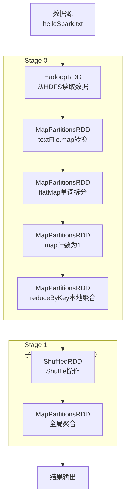
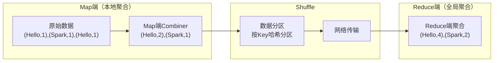
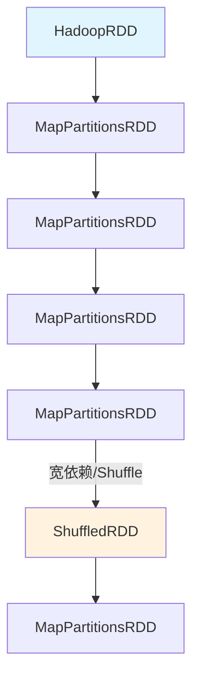
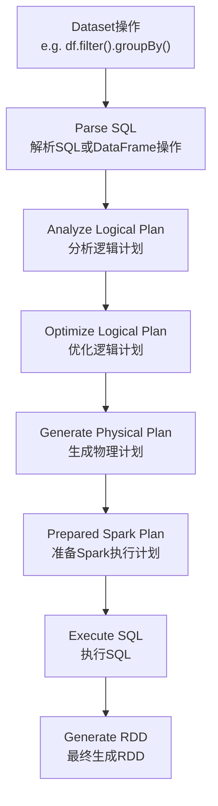

## 引言

Apache Spark作为当今大数据处理领域的主流框架，其核心抽象——弹性分布式数据集（RDD）的设计理念深刻影响着分布式计算的发展。理解RDD的内部工作机制不仅是使用Spark的基础，更是优化Spark应用程序性能的关键。本节通过经典的WordCount示例，从代码实践到源码剖析，全方位揭示RDD的数据流动、依赖关系和执行机制。

## 一、WordCount实战：Spark入门经典

### 1.1 环境准备与数据准备

首先创建一个文本文件`helloSpark.txt`，内容如下：

```
Hello Spark Hello Scala
Hello Hadoop
Hello Flink
Spark is Awesome
```

将文件保存到`data/wordcount/`目录下。

### 1.2 Scala实现WordCount

```scala
package com.dt.spark.sparksql

import org.apache.spark.SparkConf
import org.apache.spark.SparkContext
import org.apache.spark.rdd.RDD

/**
 * 使用Scala开发本地测试的Spark WordCount程序
 * @author DT大数据梦工厂
 * 新浪微博：http://weibo.com/ilovepains/
 */
object WordCount {
  def main(args: Array[String]) {
    
    /**
     * 第1步：创建Spark的配置对象SparkConf
     * 设置Spark程序运行时的配置信息
     */
    val conf = new SparkConf() // 创建SparkConf对象
    conf.setAppName("Wow,My First Spark App!") // 设置应用程序名称
    conf.setMaster("local") // 本地运行模式，无需安装Spark集群
    
    /**
     * 第2步：创建SparkContext对象
     * SparkContext是Spark程序所有功能的唯一入口
     */
    val sc = new SparkContext(conf)
    
    /**
     * 第3步：创建初始RDD
     * 从数据源（本地文件）读取数据并创建RDD
     */
    val lines = sc.textFile("data/wordcount/helloSpark.txt", 1) // 读取本地文件
    
    /**
     * 第4步：Transformation操作
     * 4.1：将每一行拆分成单词
     */
    val words = lines.flatMap { line => line.split(" ") }
    
    /**
     * 4.2：为每个单词计数为1
     */
    val pairs = words.map { word => (word, 1) }
    
    /**
     * 4.3：统计每个单词出现的总次数
     */
    val wordCountsOrdered = pairs.reduceByKey(_+_)
      .map(pair => (pair._2, pair._1))  // 交换key-value用于排序
      .sortByKey(false)                  // 按词频降序排序
      .map(pair => (pair._2, pair._1))  // 恢复原始格式
    
    /**
     * 第5步：Action操作触发计算
     */
    wordCountsOrdered.collect.foreach(wordNumberPair => 
      println(wordNumberPair._1 + " : " + wordCountPair._2))
    
    sc.stop() // 关闭SparkContext
  }
}
```

### 1.3 运行结果

```
17/05/21 21:19:07 INFO DAGScheduler: Job 0 finished: collect at WordCount.scala:60, took 0.957991 s
Hello : 4
Spark : 2
Awesome : 1
Flink : 1
is : 1
Scala : 1
Hadoop : 1
```

## 二、RDD内部机制深度解析

### 2.1 数据流动视角分析

从数据处理的视角来看，WordCount程序经历了以下关键步骤：



### 2.2 RDD依赖关系分析

**Spark中的一切操作都是RDD，后面的RDD对前面的RDD有依赖关系**。在WordCount示例中：

1. **窄依赖（Narrow Dependency）**：
   - `flatMap` → `lines`
   - `map` → `words`
   - 这些操作可以在同一个节点上完成，不需要Shuffle

2. **宽依赖（Wide Dependency/Shuffle Dependency）**：
   - `reduceByKey` → `pairs`
   - 需要跨节点数据重分区，触发Shuffle操作

### 2.3 DAG与Lineage（血统）机制

Spark通过**有向无环图（DAG）** 来表示RDD之间的依赖关系，每个RDD都记录了它的**血统（Lineage）**——即它是如何从其他RDD转换而来的。

**WordCount的DAG结构**：
```
HadoopRDD → MapPartitionsRDD → MapPartitionsRDD → MapPartitionsRDD
        (textFile)       (flatMap)         (map)          (reduceByKey本地)
        
→ ShuffledRDD → MapPartitionsRDD
  (Shuffle)      (reduceByKey全局)
```

## 三、源码级解析：RDD生成机制

### 3.1 从textFile到HadoopRDD

当调用`sc.textFile()`时，Spark内部发生了什么？

```scala
// SparkContext.scala 中的 textFile 方法
def textFile(
  path: String,
  minPartitions: Int = defaultMinPartitions): RDD[String] = withScope {
  assertNotStopped()
  hadoopFile(path, classOf[TextInputFormat], classOf[LongWritable], classOf[Text],
    minPartitions).map(pair => pair._2.toString).setName(path)
}
```

**关键步骤解析**：

1. **创建HadoopRDD**：
   - 通过`hadoopFile`方法创建`HadoopRDD`
   - 从HDFS上读取分布式数据，以数据分片（Partition）形式存在于集群中
   - 默认分片策略：HDFS Block大小决定（通常128MB）

2. **数据分片原理**：
   - 假设有4个节点，数据被分成4个部分
   - 示例数据分布：
     - 机器1：`Hello Spark Hello Scala`
     - 机器2：`Hello Hadoop`
     - 机器3：`Hello Flink`
     - 机器4：`Spark is Awesome`

3. **Map转换生成MapPartitionsRDD**：
   - `map(pair => pair._2.toString)`去掉Hadoop输入格式的Key
   - 只保留每行数据的内容（Value）

### 3.2 Transformation操作的RDD生成

#### flatMap操作

```scala
// RDD.scala 中的 flatMap 方法
def flatMap[U: ClassTag](f: T => TraversableOnce[U]): RDD[U] = withScope {
  val cleanF = sc.clean(f)
  new MapPartitionsRDD[U, T](this, (context, pid, iter) => iter.flatMap(cleanF))
}
```

**执行过程**：
- 对每个Partition的每一行进行单词切分
- 将所有行的拆分结果合并成一个大的单词集合
- 生成新的`MapPartitionsRDD`

#### map操作

```scala
// RDD.scala 中的 map 方法
def map[U: ClassTag](f: T => U): RDD[U] = withScope {
  val cleanF = sc.clean(f)
  new MapPartitionsRDD[U, T](this, (context, pid, iter) => iter.map(cleanF))
}
```

**执行过程**：
- 将单词映射为`(word, 1)`格式
- 例如：`"Hello"` → `("Hello", 1)`

### 3.3 reduceByKey与Shuffle机制

#### reduceByKey源码分析

```scala
// PairRDDFunctions.scala 中的 reduceByKey 方法
def reduceByKey(func: (V, V) => V): RDD[(K, V)] = self.withScope {
  reduceByKey(defaultPartitioner(self), func)
}

// 内部调用 combineByKeyWithClassTag
def combineByKeyWithClassTag[C](
  createCombiner: V => C,
  mergeValue: (C, V) => C,
  mergeCombiners: (C, C) => C,
  partitioner: Partitioner,
  mapSideCombine: Boolean = true,
  serializer: Serializer = null)(implicit ct: ClassTag[C]): RDD[(K, C)] = self.withScope {
  
  // ... 参数校验
  
  val aggregator = new Aggregator[K, V, C](
    self.context.clean(createCombiner),
    self.context.clean(mergeValue),
    self.context.clean(mergeCombiners))
  
  if (self.partitioner == Some(partitioner)) {
    // 如果分区器相同，不需要Shuffle
    self.mapPartitions(iter => {
      val context = TaskContext.get()
      new InterruptibleIterator(context, aggregator.combineValuesByKey(iter, context))
    }, preservesPartitioning = true)
  } else {
    // 需要Shuffle，创建ShuffledRDD
    new ShuffledRDD[K, V, C](self, partitioner)
      .setSerializer(serializer)
      .setAggregator(aggregator)
      .setMapSideCombine(mapSideCombine)
  }
}
```

#### Shuffle过程详解

**Stage划分**：
- **Stage 0（父Stage）**：`reduceByKey`之前的操作都在内存中迭代完成
- **Stage 1（子Stage）**：`ShuffledRDD`需要网络传输，形成新的Stage

**Map端Combiner优化**：


**Shuffle数据流动**：
1. **本地Reduce（Map端Combiner）**：
   - 将`(Hello,1), (Spark,1), (Hello,1), (Scala,1)`聚合为`(Hello,2), (Spark,1), (Scala,1)`
   - 减少网络传输数据量

2. **数据分区与网络传输**：
   - 根据HashCode进行分区（如按3取模）
   - 相同Key的数据发送到同一个Reduce节点

3. **全局Reduce**：
   - 从各节点收集相同Key的数据
   - 例如：从机器1收集`(Hello,2)`，机器2收集`(Hello,1)`，机器3收集`(Hello,1)`
   - 最终聚合为`(Hello,4)`

### 3.4 RDD依赖总结

**WordCount中的RDD依赖链**：



**Stage划分**：
- **Stage 0**：HadoopRDD、MapPartitionsRDD、MapPartitionsRDD、MapPartitionsRDD、MapPartitionsRDD
- **Stage 1**：ShuffledRDD、MapPartitionsRDD

## 四、Dataset到RDD的转换机制

### 4.1 Dataset执行流程

**补充说明**：Dataset是Spark 1.6+引入的高级API，提供了类型安全和优化执行计划。



### 4.2 关键源码分析

#### collect方法触发执行

```scala
// Dataset.scala 中的 collect 方法
def collect(): Array[T] = collect(needCallback = true)

private def collect(needCallback: Boolean): Array[T] = {
  def execute(): Array[T] = withNewExecutionId {
    queryExecution.executedPlan.executeCollect().map(boundEnc.fromRow)
  }
  
  if (needCallback) {
    withCallback("collect", toDF())(_ => execute())
  } else {
    execute()
  }
}
```

#### 执行计划到RDD的转换

```scala
// QueryExecution.scala
class QueryExecution(val sparkSession: SparkSession, val logical: LogicalPlan) {
  // executedPlan仅用于执行，不用于初始化任何SparkPlan
  lazy val executedPlan: SparkPlan = prepareForExecution(sparkPlan)
  
  // 关键转换：SparkPlan -> RDD
  lazy val toRdd: RDD[InternalRow] = executedPlan.execute()
}

// SparkPlan.scala
final def execute(): RDD[InternalRow] = executeQuery {
  doExecute()  // 抽象方法，由具体SparkPlan子类实现
}

protected def doExecute(): RDD[InternalRow]  // 抽象方法
```

#### 最终RDD生成

```scala
// SparkPlan.scala 中的 executeCollect 方法
def executeCollect(): Array[InternalRow] = {
  val byteArrayRdd = getByteArrayRdd()
  
  val results = ArrayBuffer[InternalRow]()
  byteArrayRdd.collect().foreach { bytes =>
    decodeUnsafeRows(bytes).foreach(results.+=)
  }
  results.toArray
}

// RDD.scala 中的 collect 方法
def collect(): Array[T] = withScope {
  val results = sc.runJob(this, (iter: Iterator[T]) => iter.toArray)
  Array.concat(results: _*)
}
```

## 五、核心原理总结与最佳实践

### 5.1 Spark RDD核心特性

1. **分布式内存计算**：
   - 数据分布式存储，计算分布式执行
   - 尽可能在内存中迭代计算，减少磁盘IO

2. **惰性求值（Lazy Evaluation）**：
   - Transformation操作不立即执行
   - 直到Action操作才触发实际计算

3. **容错性（Fault Tolerance）**：
   - 通过Lineage（血统）信息重建丢失的数据分区
   - 无需将数据复制到多个节点

### 5.2 性能优化要点

1. **合理设置分区数**：
   ```scala
   // 根据数据大小和集群资源设置合适的分区数
   val rdd = sc.textFile("data.txt", minPartitions = 10)
   ```

2. **利用Map端Combiner**：
   - `reduceByKey`、`combineByKey`等操作会自动进行Map端聚合
   - 显著减少Shuffle数据量

3. **避免不必要的Shuffle**：
   - 尽量使用窄依赖操作
   - 使用`coalesce`而不是`repartition`（当减少分区数时）

4. **持久化中间结果**：
   ```scala
   val processedRDD = rdd.map(...).filter(...).persist(StorageLevel.MEMORY_ONLY)
   // 后续多次使用processedRDD时，避免重复计算
   ```

### 5.3 实际应用场景

1. **ETL处理**：数据清洗、转换、加载
2. **统计分析**：如WordCount、Top-N分析
3. **机器学习**：特征工程、数据预处理
4. **图计算**：社交网络分析、推荐系统

## 六、扩展思考：Spark执行引擎演进

**补充说明**：从Spark 2.0开始，引入了基于Catalyst优化器和Tungsten执行引擎的重大改进：

1. **Catalyst优化器**：
   - 基于规则的优化（Rule-based Optimization）
   - 基于成本的优化（Cost-based Optimization）
   - 不仅限于SQL，所有Spark子框架都基于Catalyst

2. **Tungsten执行引擎**：
   - 堆外内存管理（Off-heap Memory）
   - 缓存友好的数据结构
   - 代码生成（Code Generation）

3. **Whole-stage Code Generation**：
   - 将多个操作融合为单个函数
   - 减少虚函数调用和中间数据生成

## 结语

通过WordCount这个经典示例，我们深入剖析了Spark RDD的内部工作机制。从简单的单词计数到复杂的分布式计算，理解RDD的数据流动、依赖关系和执行机制是掌握Spark的关键。Spark的强大之处不仅在于其简洁的API，更在于其精心设计的内部架构，使得开发者能够以声明式的方式编写分布式程序，而框架则负责高效的执行和优化。

随着Spark生态的不断发展，Dataset/DataFrame API和结构化流处理（Structured Streaming）等高级特性进一步简化了大数据处理，但RDD作为Spark的基石，其设计理念和核心机制仍然深刻影响着Spark的每一个角落。