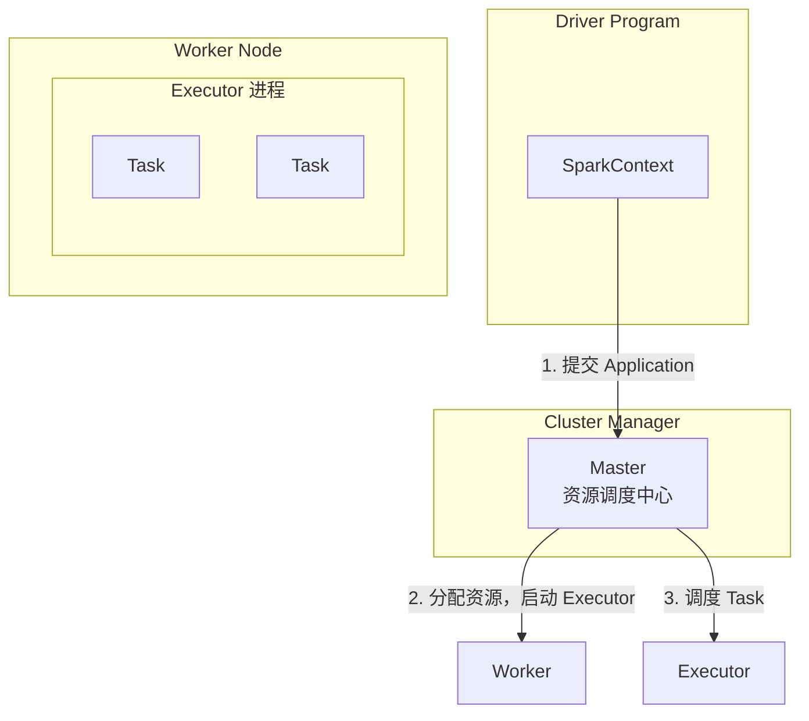
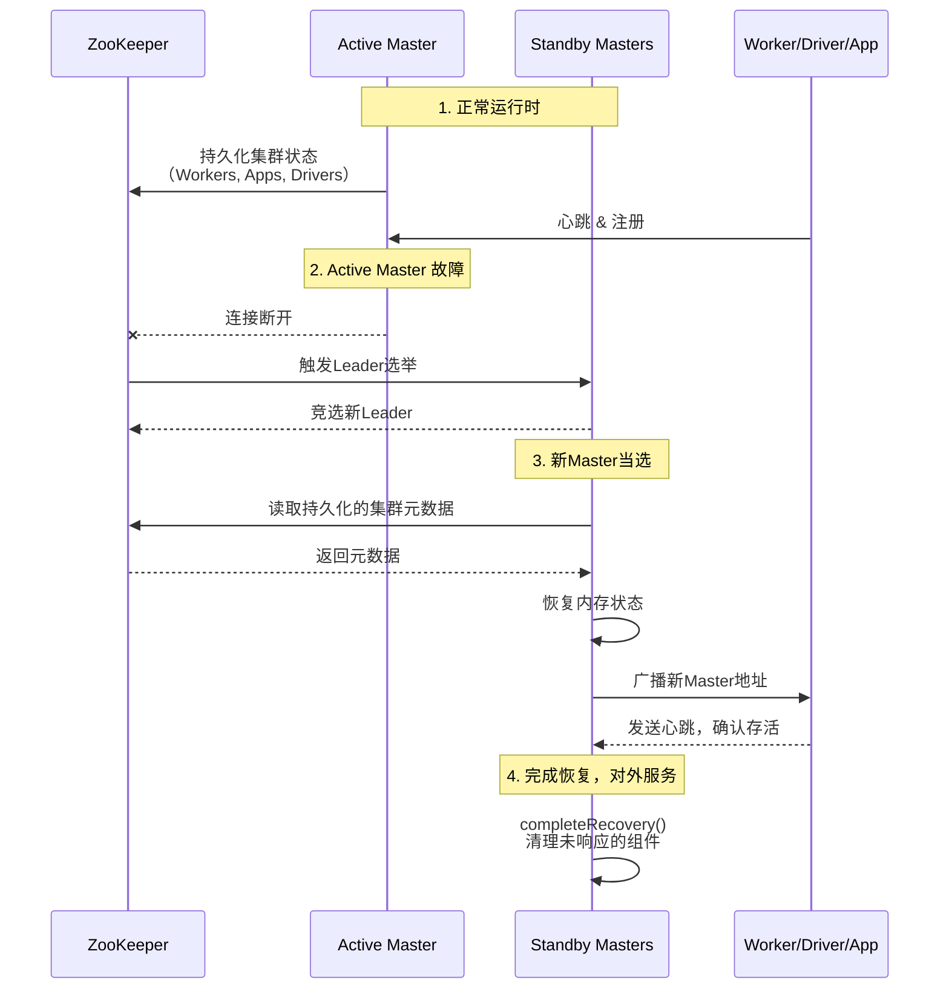

在Spark集群中，Master节点扮演着“大脑”的角色，负责整个集群的资源管理与任务调度。理解Master的启动流程、高可用（HA）机制以及它对Worker、Application等组件的注册管理，是深入掌握Spark架构和进行生产环境运维的关键。本节将从脚本入口开始，深入源码，为您层层揭开Master的核心工作机制。

## 1. Spark 集群架构概览

首先，我们回顾一下Spark集群的核心组件及其关系，这有助于理解Master在整个体系中的位置和作用。



**核心术语解析**:
*   **Driver Program**：包含`main`函数并创建`SparkContext`的应用程序。`SparkContext`是驱动程序的代表，负责与集群通信和任务协调。
*   **Cluster Manager**：集群资源的外部管理服务。Spark支持Standalone（自带）、YARN和Mesos三种模式。**Standalone模式**能满足绝大部分纯Spark计算环境的需求，仅在多框架共存时才建议考虑YARN/Mesos。
*   **Worker Node**：集群中运行应用代码的工作节点，相当于Hadoop的Slave节点。
*   **Executor**：在Worker节点上为特定Application启动的**工作进程**。它负责任务（Task）的执行和内存/磁盘数据存储，内部通过线程池并发处理任务。**每个Application拥有独立的Executor，实现了应用间的隔离**。
*   **Task**：被送到Executor上执行的基本工作单元。通常一个Task处理一个数据分区（Partition）。
*   **Application**：用户创建的Spark程序，包含一个Driver Program和分布在多个Worker上的Executors。
*   **Job**：与Spark的`action`（如`count`、`saveAsTextFile`）对应。每个action触发一个Job。一个Job会被拆分为多个`Stages`，Stage包含一个任务集（TaskSet），最终被调度到Executor上并行执行。

Spark Standalone集群采用经典的**Master/Slave架构**。Master负责全局资源管理与调度，Worker在Master的调度下启动Executor并执行具体任务。

## 2. Master 启动原理与源码详解

### 2.1 启动脚本入口：`start-master.sh`

Master的启动始于shell脚本。`./sbin/start-master.sh`脚本的核心作用是配置环境并以后台守护进程的方式启动Master的JVM进程。

**脚本关键逻辑**：
1.  **环境检查**：设置`SPARK_HOME`路径。
2.  **参数解析**：识别并处理命令行选项（如`--help`、`--with-tachyon`等）。
3.  **默认配置**：设置Master的监听IP、端口（默认7077）和Web UI端口（默认8080）。**注意**：`SPARK_MASTER_IP`默认使用`hostname`而非IP，因为生成的Master URL（供Worker和App注册使用）需要主机名。
4.  **启动进程**：最终调用`spark-daemon.sh`脚本，以`class`模式启动`org.apache.spark.deploy.master.Master`类。

```bash
# 脚本最终的执行命令简化示意
"${SPARK_HOME}/sbin"/spark-daemon.sh start org.apache.spark.deploy.master.Master 1 \
  --ip $SPARK_MASTER_IP --port $SPARK_MASTER_PORT --webui-port $SPARK_MASTER_WEBUI_PORT
```

`spark-daemon.sh`内部会使用`nohup`命令调用`spark-class`脚本，启动一个独立的JVM进程来运行Master的`main`方法。

### 2.2 源码入口：`Master.main()`

Master的入口点是伴生对象`Master`中的`main`方法。

```scala
def main(argStrings: Array[String]) {
  Utils.initDaemon(log)
  val conf = new SparkConf
  // 1. 参数解析
  val args = new MasterArguments(argStrings, conf)
  // 2. 启动RPC环境及Master终端
  val (rpcEnv, _, _) = startRpcEnvAndEndpoint(args.host, args.port, args.webUiPort, conf)
  // 3. 阻塞，等待终止
  rpcEnv.awaitTermination()
}
```

*   **`MasterArguments`**：解析命令行参数和环境变量（如`SPARK_MASTER_HOST`），并加载Spark默认配置。
*   **`startRpcEnvAndEndpoint`**：这是启动的核心方法，它完成两件重要事情：
    1.  创建RPC通信环境（`RpcEnv`）。
    2.  在该环境中注册并启动Master的RPC终端（`RpcEndpoint`），即`Master`类的实例。

### 2.3 核心启动流程：`startRpcEnvAndEndpoint` 与 `onStart()`

`startRpcEnvAndEndpoint`方法创建`Master`实例，并触发其生命周期方法。

```scala
def startRpcEnvAndEndpoint(host: String, port: Int, webUiPort: Int, conf: SparkConf): (RpcEnv, Int, Option[Int]) = {
  val securityMgr = new SecurityManager(conf)
  // 构建RPC环境
  val rpcEnv = RpcEnv.create(SYSTEM_NAME, host, port, conf, securityMgr)
  // 实例化Master，并将其注册为RPC终端
  val masterEndpoint = rpcEnv.setupEndpoint(ENDPOINT_NAME, new Master(rpcEnv, rpcEnv.address, webUiPort, securityMgr, conf))
  // 向自己发送请求，确认启动并获取绑定的端口号（Web UI & REST）
  val portsResponse = masterEndpoint.askSync[BoundPortsResponse](BoundPortsRequest)
  (rpcEnv, portsResponse.webUIPort, portsResponse.restPort)
}
```

当`Master`实例被创建并注册后，其`onStart()`方法会被调用，这是Master初始化的核心。

**`onStart()`方法关键初始化步骤**：
1.  **启动Web UI**：创建并绑定`MasterWebUI`（默认端口8080），提供集群状态监控界面。该界面支持查看活跃的Worker、Application、核心和内存使用情况等。如果配置`spark.ui.killEnabled=true`，甚至可以通过UI终止应用。
2.  **启动定时检查线程**：创建一个守护线程，定期（默认间隔`WORKER_TIMEOUT_MS`）向自己发送`CheckForWorkerTimeOut`消息，用于检查Worker是否超时失联，并进行清理。
3.  **启动REST服务**（可选）：如果启用（`spark.master.rest.port`，默认6066），会创建`StandaloneRestServer`。这允许通过REST API提交和监控应用（Cluster模式），为集群管理提供了另一种接口。
4.  **初始化监控度量系统**：注册并启动Metrics System，将监控数据接入Web UI。
5.  **初始化高可用(HA)组件**：根据配置的`spark.deploy.recoveryMode`（恢复模式），创建持久化引擎（`PersistenceEngine`）和领导选举代理（`LeaderElectionAgent`）。这是实现Master HA的关键，下文将详细展开。

## 3. Master 高可用（HA）机制详解

生产环境中，必须保证Master的高可用，避免单点故障。Spark支持多种HA模式。

### 3.1 HA的四种模式
Master的恢复模式（`RECOVERY_MODE`）在`onStart()`中通过匹配确定：
```scala
val (persistenceEngine_, leaderElectionAgent_) = RECOVERY_MODE match {
  case "ZOOKEEPER" => // 使用ZooKeeper进行自动Leader选举和状态持久化
  case "FILESYSTEM" => // 使用共享文件系统（如NFS）持久化状态，故障后需手动重启Master
  case "CUSTOM" => // 用户自定义实现
  case _ => // 默认为 "NONE"，单点模式，无持久化，宕机后集群元数据丢失
}
```

### 3.2 ZooKeeper HA 工作流程（推荐）

这是最常用的自动HA方案。其基本原理和流程如下图所示：



**详细流程解析**：
1.  **状态持久化**：Active Master通过`ZooKeeperPersistenceEngine`，将集群的元数据（`WorkerInfo`, `ApplicationInfo`, `DriverInfo`）实时持久化到ZooKeeper。
2.  **故障与选举**：当Active Master故障，与ZooKeeper的会话断开。ZooKeeper会通过`ZooKeeperLeaderElectionAgent`通知所有Standby Masters重新进行Leader选举。
3.  **新Master恢复**：新选举出的Master（新的Active）首先从ZooKeeper读取持久化的集群元数据，将其恢复到内存中。
4.  **状态同步与清理**：新Master向所有已注册的Driver和Worker发送其新的领导权信息。这些组件会向新Master重新注册或确认。
    *   随后，新Master调用`completeRecovery()`方法。该方法会：
        *   将一段时间内未响应的`Worker`和`Application`状态标记为`UNKNOWN`，并最终清理。
        *   对于配置了`--supervise`的Driver，如果其Worker已丢失，会尝试重新启动。
        *   完成清理后，Master状态变为`RecoveryState.ALIVE`，开始正常服务。
5.  **资源调度**：Master恢复后，会立即调用`schedule()`方法，为等待中的Applications和Drivers进行资源调度。

**HA切换的影响**：
*   **已运行的任务不受影响**：因为Application在运行前已获得资源，任务执行与Master无关。
*   **唯一影响是提交新任务**：在切换期间和切换完成前，无法提交新的Application或由Action触发的新Job。

## 4. Master 的注册机制与状态管理

Master作为集群管理中心，需要处理来自Worker、Driver和Application的注册，并管理它们的生命周期状态。

### 4.1 Worker 注册流程

Worker启动后，会主动向所有配置的Master地址尝试注册，这使得**动态添加Worker节点成为可能**，无需重启集群。

**注册流程源码追踪**：
1.  **Worker发起注册**：在`Worker.onStart()`中调用`registerWithMaster()`，最终通过线程池向所有Master发送`RegisterWorker`消息。
    ```scala
    // Spark 2.2.0+ 版本
    masterEndpoint.send(RegisterWorker(workerId, host, port, self, cores, memory, workerWebUiUrl, masterAddress))
    ```
2.  **Master处理注册**：Master的`receive`方法处理`RegisterWorker`消息。
    *   检查自身状态（非STANDBY模式）。
    *   检查Worker ID是否重复。
    *   创建`WorkerInfo`对象，并调用`registerWorker(worker)`方法将其加入内存缓存：
        ```scala
        workers += worker // HashSet[WorkerInfo]
        idToWorker(worker.id) = worker // HashMap[String, WorkerInfo]
        addressToWorker(workerAddress) = worker // HashMap[RpcAddress, WorkerInfo]
        ```
    *   **持久化**：调用`persistenceEngine.addWorker(worker)`，将Worker信息持久化到ZooKeeper或文件系统。
    *   **资源调度**：调用`schedule()`，尝试为等待中的应用分配资源。
    *   **回复确认**：向Worker回复`RegisteredWorker`消息，告知注册成功及Master的Web UI地址。

### 4.2 Driver 与 Application 的注册

*   **Driver注册**：当用户通过`spark-submit`提交应用（`--deploy-mode cluster`）时，Driver程序会被提交到Master。Master将其信息存入`drivers`缓存并持久化，然后加入调度队列。
*   **Application注册**：Driver启动后，初始化`SparkContext`，其内部的`StandaloneSchedulerBackend`会通过`StandaloneAppClient`向Master发送`RegisterApplication`消息。Master将其信息存入`idToApp`缓存并持久化，加入等待调度队列。

### 4.3 状态变化处理

Master持续监控Driver和Executor的状态，并进行相应管理。

1.  **Driver状态变化**：当收到`DriverStateChanged`消息，且状态为终止态（ERROR, FINISHED, KILLED, FAILED）时，Master会调用`removeDriver`方法将其从活跃列表移至完成列表，清理持久化数据，并触发新一轮调度`schedule()`。
2.  **Executor状态变化**：当收到`ExecutorStateChanged`消息（例如Executor失败），Master会更新该Executor的状态，并通知对应的Driver。
    *   如果Executor失败（非正常退出），其所属的Application的重试计数器会增加。
    *   **重要机制**：如果Application的Executor失败重试次数超过配置阈值（`spark.deploy.maxExecutorRetries`，默认10次），**并且当前没有正在运行的Executor**，Master会认为该Application失败，并将其移除。这是防止异常应用无限重试的防护机制。

## 5. 总结与要点回顾

1.  **启动链条**：`start-master.sh` -> `spark-daemon.sh` -> `spark-class` -> `Master.main()` -> `onStart()`。核心是初始化RPC环境、Web UI、定时任务、REST服务和HA组件。
2.  **HA是生产必备**：推荐使用**ZooKeeper模式**实现自动故障转移。核心在于通过`PersistenceEngine`持久化集群状态，并通过`LeaderElectionAgent`进行Leader选举。切换期间，运行中的任务不受影响，但无法提交新任务。
3.  **注册机制**：Worker主动注册使集群可动态扩展。Master将注册的组件（Worker、App、Driver）信息保存在内存数据结构中，并通过持久化引擎保存，确保HA恢复。
4.  **状态管理**：Master通过消息驱动的方式管理组件生命周期。对于失败的Executor，关联的Application有重试上限，超过限制且无存活Executor时，Application会被判定为失败，避免资源空耗。

通过对Master源码的剖析，我们不仅理解了其内部运作机制，也为定位和解决Spark集群管理中的实际问题（如Master切换、Worker失联、应用失败等）打下了坚实的基础。