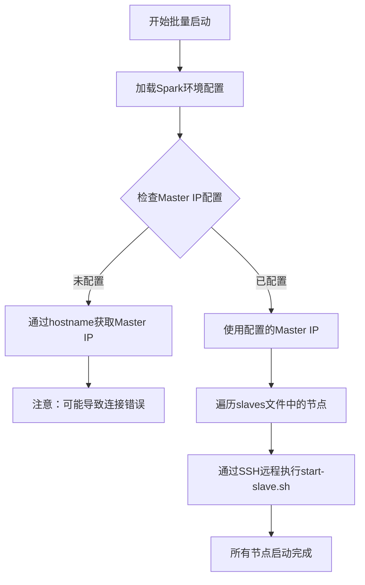
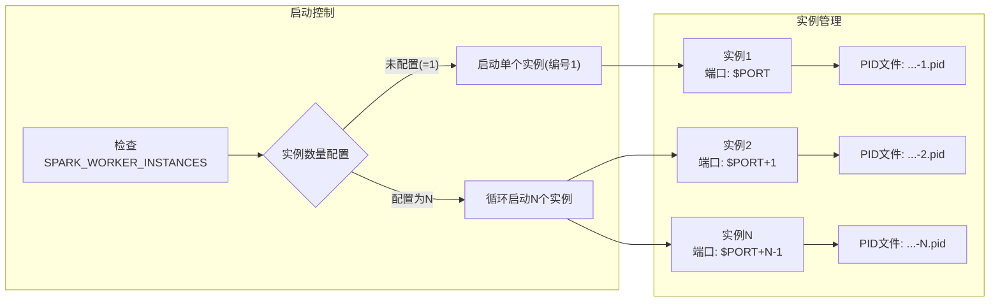
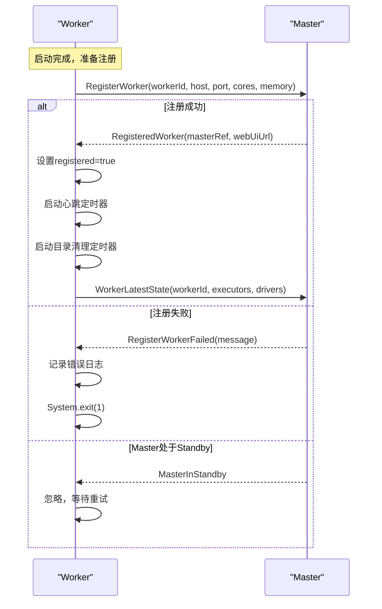
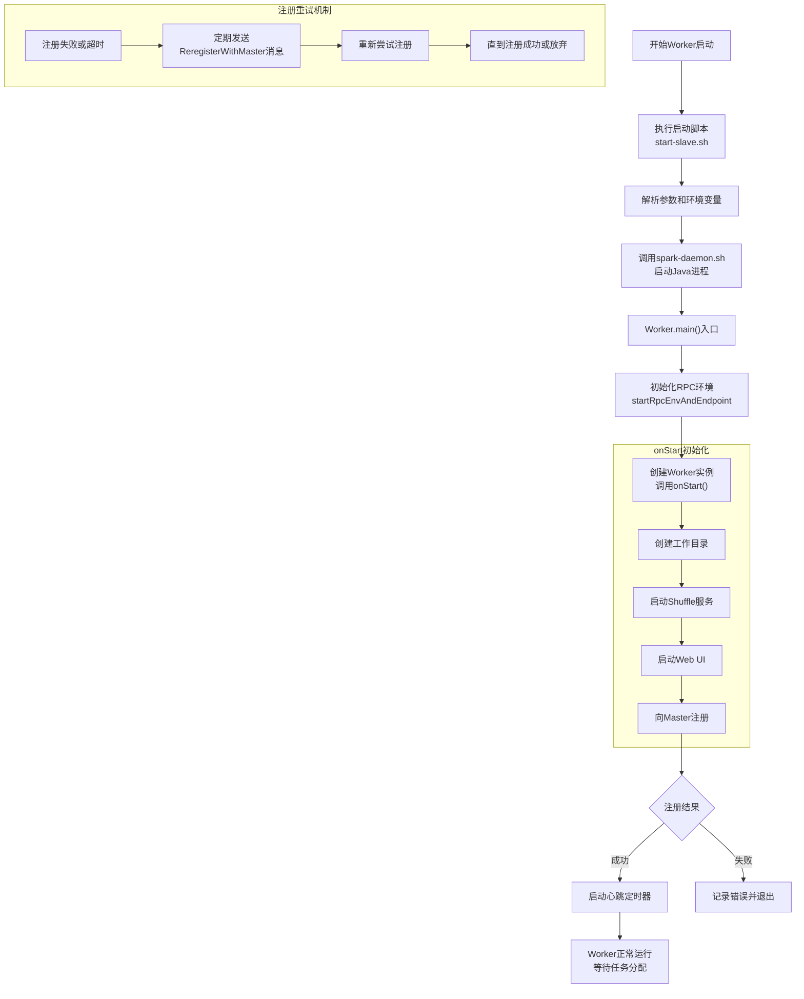

## 引言：Spark集群的基石

在Spark分布式计算框架中，**Worker节点**是整个集群的计算能力承载者。它负责执行具体的任务，管理Executor的生命周期，并提供计算资源给Spark应用。理解Worker的启动原理不仅有助于集群运维，更是深入理解Spark架构设计的关键。本文将深入剖析Worker的启动流程，从脚本到源码，层层递进，揭示其内部工作机制。

## 一、Worker启动的两种模式

Spark提供了两种Worker部署方式，适应不同的集群管理需求：

### 1.1 批量部署模式
适用于已配置好集群节点的情况，通过`conf/slaves`文件一次性启动所有Worker节点。

```bash
# 在Master节点执行，启动所有slaves节点上的Worker
./sbin/start-slaves.sh
```

### 1.2 动态添加模式
适用于集群扩容或动态添加新节点，可在任意节点上启动Worker并注册到现有集群。

```bash
# 在新节点上执行，动态注册到指定Master
./sbin/start-slave.sh spark://master-ip:7077
```

## 二、启动脚本深度解析

### 2.1 start-slaves.sh：批量启动控制器

`start-slaves.sh`脚本是批量部署Worker的核心，其主要职责包括：

```bash
# 关键代码片段分析
if [ "$SPARK_MASTER_IP" = "" ]; then
    SPARK_MASTER_IP="`hostname`"  # 默认使用当前主机名作为Master IP
fi

# 通过slaves.sh脚本在多个节点上并行启动Worker
"${SPARK_HOME}/sbin/slaves.sh" cd "${SPARK_HOME}" \; \
"${SPARK_HOME}/sbin/start-slave.sh" "spark://$SPARK_MASTER_IP:$SPARK_MASTER_PORT"
```

**脚本执行流程**：



### 2.2 start-slave.sh：单个Worker启动器

`start-slave.sh`是实际启动Worker进程的脚本，支持单节点多实例部署：

```bash
# 脚本核心功能：启动Worker实例
function start_instance {
    WORKER_NUM=$1  # Worker实例编号
    shift
    
    # 端口配置：支持多个实例时端口递增
    if [ "$SPARK_WORKER_PORT" = "" ]; then
        PORT_FLAG=
        PORT_NUM=
    else
        PORT_FLAG="--port"
        PORT_NUM=$(( $SPARK_WORKER_PORT + $WORKER_NUM - 1 ))
    fi
    
    WEBUI_PORT=$(( $SPARK_WORKER_WEBUI_PORT + $WORKER_NUM - 1 ))
    
    # 通过spark-daemon.sh启动守护进程
    "${SPARK_HOME}/sbin"/spark-daemon.sh start $CLASS $WORKER_NUM \
        --webui-port "$WEBUI_PORT" $PORT_FLAG $PORT_NUM $MASTER "$@"
}
```

**重要配置参数**：

| 环境变量 | 默认值 | 说明 |
|---------|--------|------|
| `SPARK_WORKER_INSTANCES` | 1 | 单节点Worker实例数量 |
| `SPARK_WORKER_PORT` | 随机 | Worker通信端口 |
| `SPARK_WORKER_WEBUI_PORT` | 8081 | Worker Web UI端口 |
| `SPARK_WORKER_DIR` | $SPARK_HOME/work | 工作目录 |

### 2.3 多实例部署的关键机制

**⚠️ 重要注意事项**：在一个节点上部署多个Worker实例时，必须通过`SPARK_WORKER_INSTANCES`环境变量一次性指定，而不是多次运行启动脚本。

**原因分析**：
```bash
# spark-daemon.sh中的进程检查逻辑
if [ -f "$pid" ]; then
    TARGET_ID="$(cat "$pid")"
    if [[ $(ps -p "$TARGET_ID" -o comm=) =~ "java" ]]; then
        echo "$command running as process $TARGET_ID. Stop it first."
        exit 1  # 进程已存在，启动失败
    fi
fi

# PID文件命名规则：实例编号决定文件名
pid="$SPARK_PID_DIR/spark-$SPARK_IDENT_STRING-$command-$instance.pid"
```

**多实例启动流程**：



## 三、Worker启动源码分析

### 3.1 Worker主入口：main方法

Worker的启动始于伴生对象中的`main`方法，这是Java进程的入口点：

```scala
// Worker.scala
private[deploy] object Worker extends Logging {
    val SYSTEM_NAME = "sparkWorker"
    val ENDPOINT_NAME = "Worker"
    
    def main(argStrings: Array[String]) {
        Utils.initDaemon(log)  // 初始化守护进程日志
        val conf = new SparkConf
        
        // 解析命令行参数
        val args = new WorkerArguments(argStrings, conf)
        
        // 启动RPC环境并创建Worker终端
        val rpcEnv = startRpcEnvAndEndpoint(
            args.host, args.port, args.webUiPort, 
            args.cores, args.memory, args.masters, 
            args.workDir, conf = conf
        )
        
        rpcEnv.awaitTermination()  // 阻塞等待终止
    }
}
```

### 3.2 Worker启动生命周期：onStart方法

Worker实例化后会调用`onStart`方法，完成初始化工作：

```scala
override def onStart() {
    assert(!registered)  // 初始状态：未注册
    
    logInfo(s"Starting Spark worker $host:$port with $cores cores, " +
            s"${Utils.megabytesToString(memory)} RAM")
    
    createWorkDir()          // 创建工作目录
    shuffleService.startIfEnabled()  // 启动Shuffle服务
    webUi = new WorkerWebUI(this, workDir, webUiPort)  // 启动Web UI
    webUi.bind()
    
    workerWebUiUrl = s"http://$publicAddress:${webUi.boundPort}"
    
    registerWithMaster()  // 关键步骤：向Master注册
    
    metricsSystem.registerSource(workerSource)
    metricsSystem.start()
    
    // 将度量系统的Servlet处理器附加到Web UI
    metricsSystem.getServletHandlers.foreach(webUi.attachHandler)
}
```

### 3.3 工作目录创建机制

工作目录是Worker存储应用相关数据的核心位置：

```scala
private def createWorkDir() {
    // 优先级：命令行参数 > 环境变量 > 默认值
    workDir = Option(workDirPath)
        .map(new File(_))
        .getOrElse(new File(sparkHome, "work"))
    
    try {
        workDir.mkdirs()  // 创建目录
        
        // 双重检查：确保目录创建成功
        if (!workDir.exists() || !workDir.isDirectory) {
            logError("Failed to create work directory " + workDir)
            System.exit(1)  // 创建失败，退出进程
        }
        
        assert(workDir.isDirectory)
    } catch {
        case e: Exception =>
            logError("Failed to create work directory " + workDir, e)
            System.exit(1)
    }
}
```

**工作目录配置优先级**：
1. **命令行参数**：`--work-dir` 或 `-d` 选项（最高优先级）
2. **环境变量**：`SPARK_WORKER_DIR`
3. **默认值**：`$SPARK_HOME/work`

### 3.4 向Master注册：集群加入过程

Worker启动后必须向Master注册才能加入集群，这是最关键的一步：

```scala
private def registerWithMaster() {
    // 尝试向所有Master注册（支持高可用）
    registerMasterFutures = tryRegisterAllMasters()
}

private def tryRegisterAllMasters(): Array[JFuture[_]] = {
    // 遍历所有Master地址
    masterAddresses.map { masterAddress =>
        // 异步注册
        masterActorSystem.actorSelection(masterAddress).resolveOne().map { masterRef =>
            // Spark 2.1.1: registerWithMaster(masterRef)
            // Spark 2.2.0+: sendRegisterMessageToMaster(masterRef)
            sendRegisterMessageToMaster(masterRef)
        }
    }
}
```

**注册消息处理流程**：



### 3.5 注册成功后的初始化

成功注册后，Worker会启动两个重要的定时任务：

```scala
case RegisteredWorker(masterRef, masterWebUiUrl) =>
    logInfo("Successfully registered with master " + masterRef.address.toSparkURL)
    registered = true
    changeMaster(masterRef, masterWebUiUrl)
    
    // 1. 启动心跳定时器：定期向Master发送心跳
    forwordMessageScheduler.scheduleAtFixedRate(new Runnable {
        override def run(): Unit = Utils.tryLogNonFatalError {
            self.send(SendHeartbeat)
        }
    }, 0, HEARTBEAT_MILLIS, TimeUnit.MILLISECONDS)
    
    // 2. 启动工作目录清理定时器（默认关闭）
    if (CLEANUP_ENABLED) {
        logInfo(s"Worker cleanup enabled; old application directories will be deleted in: $workDir")
        forwordMessageScheduler.scheduleAtFixedRate(new Runnable {
            override def run(): Unit = Utils.tryLogNonFatalError {
                self.send(WorkDirCleanup)
            }
        }, CLEANUP_INTERVAL_MILLIS, CLEANUP_INTERVAL_MILLIS, TimeUnit.MILLISECONDS)
    }
    
    // 3. 向Master报告当前状态
    val execs = executors.values.map { e =>
        new ExecutorDescription(e.appId, e.execId, e.cores, e.state)
    }
    masterRef.send(WorkerLatestState(workerId, execs.toList, drivers.keys.toSeq))
```

**关键配置项**：

| 配置属性 | 默认值 | 说明 |
|---------|--------|------|
| `spark.worker.cleanup.enabled` | false | 是否启用工作目录自动清理 |
| `spark.worker.cleanup.interval` | 1800秒 | 清理间隔时间 |
| 心跳间隔 | 内部常量 | Worker定期向Master报告存活状态 |

## 四、Worker启动的完整流程总结



## 五、最佳实践与故障排查

### 5.1 部署最佳实践

1. **配置管理**：
   ```bash
   # 推荐的环境变量配置
   export SPARK_WORKER_DIR=/data/spark/work
   export SPARK_WORKER_INSTANCES=2  # 如需多实例
   export SPARK_WORKER_CORES=16     # 根据实际CPU核心数设置
   export SPARK_WORKER_MEMORY=32g   # 根据实际内存设置
   ```

2. **启动命令优化**：
   ```bash
   # 明确指定所有关键参数
   ./sbin/start-slave.sh \
       --host $(hostname) \
       --port 7078 \
       --webui-port 8082 \
       --work-dir /data/spark/work \
       spark://master-host:7077
   ```

### 5.2 常见问题排查

| 问题现象 | 可能原因 | 解决方案 |
|---------|---------|---------|
| Worker启动后立即退出 | Master连接失败 | 检查网络连通性和防火墙设置 |
| 端口冲突错误 | 端口被占用 | 修改`SPARK_WORKER_PORT`或`SPARK_WORKER_WEBUI_PORT` |
| 无法创建work目录 | 权限不足或磁盘满 | 检查目录权限和磁盘空间 |
| 注册超时 | Master未启动或网络延迟 | 确认Master状态，增加超时配置 |

### 5.3 监控与调试

1. **日志查看**：
   ```bash
   # Worker日志默认位置
   tail -f $SPARK_HOME/logs/spark-$USER-worker-$HOSTNAME.log
   ```

2. **Web UI监控**：
   - 访问地址：`http://worker-host:8081`
   - 查看信息：Worker状态、运行中的应用、资源使用情况

3. **进程状态检查**：
   ```bash
   # 检查Worker进程
   jps | grep Worker
   
   # 查看详细的Java进程信息
   ps aux | grep spark.deploy.worker.Worker
   ```

## 六、总结与展望

Worker作为Spark集群的计算节点，其启动过程体现了Spark设计的几个重要特点：

1. **去中心化注册**：Worker主动向Master注册，支持动态扩缩容
2. **多实例支持**：单节点可运行多个Worker实例，提高资源利用率
3. **容错机制**：包含注册重试、心跳检测等健壮性设计
4. **资源隔离**：通过工作目录隔离不同应用的数据

理解Worker启动原理对于Spark集群的运维、性能调优和故障排查都至关重要。随着Spark版本的演进，Worker的启动机制也在不断优化，但核心的设计理念始终保持一致：**简单、可靠、可扩展**。

通过本文的分析，我们不仅掌握了Worker启动的技术细节，更重要的是理解了Spark如何通过简洁的设计实现复杂的分布式计算管理。这种设计思想值得在构建其他分布式系统时借鉴和学习。