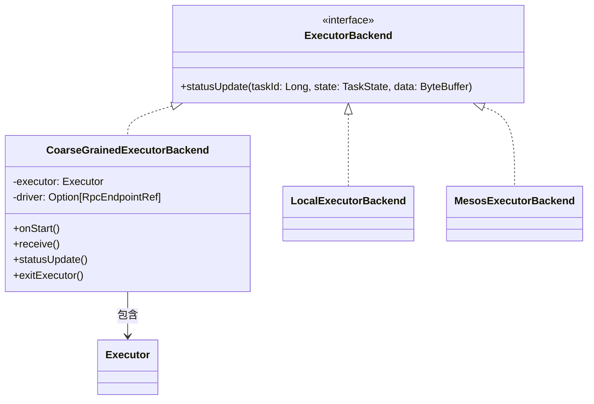
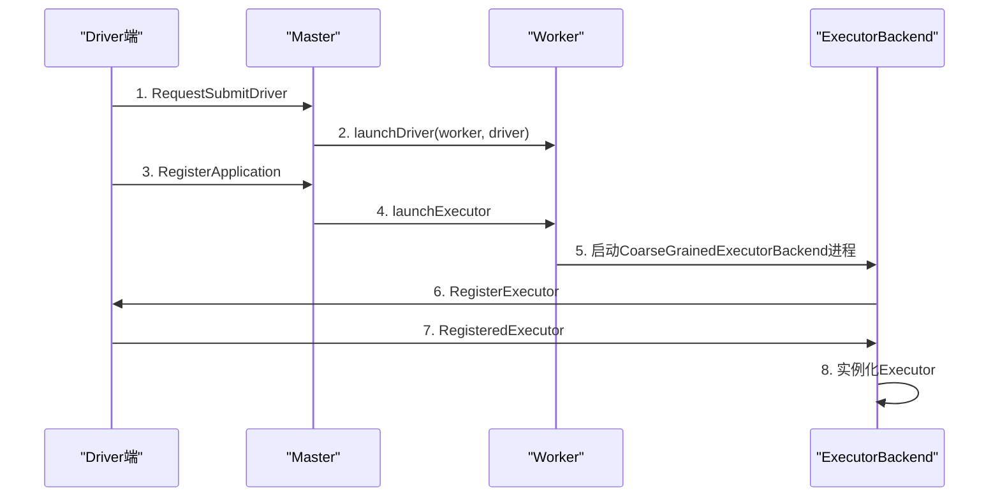
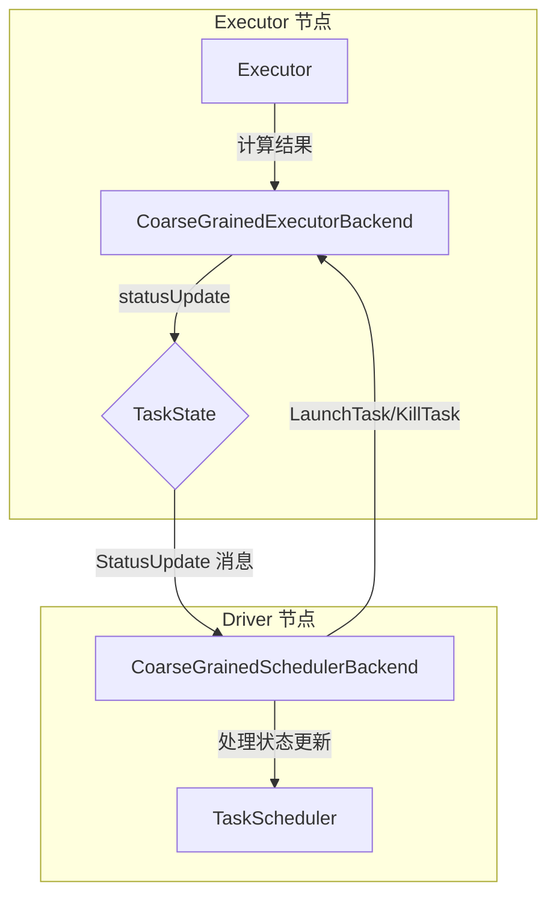

## 1. 概述

ExecutorBackend 是 Spark 执行体系中的关键组件，它充当 Executor 与集群通信的桥梁。作为**可插拔的接口**，ExecutorBackend 允许 Spark 在不同调度模式下使用不同的实现，从而实现了调度系统的灵活性和可扩展性。

## 2. ExecutorBackend 的核心角色

### 2.1 基本定义

ExecutorBackend 是 **Executor 向集群发送更新消息的可插拔接口**，主要负责：
- 与 Driver 通信，报告任务状态
- 处理集群级别的消息交互
- 在不同调度模式下提供适配实现

### 2.2 与 Executor 的关系

ExecutorBackend 和 Executor 之间是 **一对一的协作关系**，但职责分工明确：

| 组件 | 主要职责 | 生命周期 |
|------|----------|----------|
| ExecutorBackend | 集群通信、消息转发、异常处理 | 先实例化 |
| Executor | 任务计算、数据处理、资源管理 | 后实例化 |

**核心原则**：通信在前，计算在后。ExecutorBackend 建立通信桥梁后，Executor 才能开始执行计算任务。

## 3. ExecutorBackend 的实现类

### 3.1 不同调度模式下的实现

ExecutorBackend 根据 Spark 的调度模式有不同的实现：

| 调度模式 | 实现类 | 启动进程 |
|----------|--------|----------|
| Standalone | `CoarseGrainedExecutorBackend` | `org.apache.spark.executor.CoarseGrainedExecutorBackend` |
| Local | `LocalExecutorBackend` | `org.apache.spark.executor.LocalExecutorBackend` |
| Mesos | `MesosExecutorBackend` | `org.apache.spark.executor.MesosExecutorBackend` |

### 3.2 类图关系



## 4. Standalone 模式下的启动流程

### 4.1 整体启动流程



### 4.2 详细启动步骤

#### 步骤1：Driver 提交到 Master

在 Standalone 模式下，启动 `org.apache.spark.deploy.Client` 类，向 Master 发送 `RequestSubmitDriver` 消息：

```scala
// Master.scala - receiveAndReply 方法片段
case RequestSubmitDriver(description) =>
  if (state != RecoveryState.ALIVE) {
    // 非 ALIVE 状态直接返回失败
    context.reply(SubmitDriverResponse(self, false, None, msg))
  } else {
    logInfo("Driver submitted " + description.command.mainClass)
    val driver = createDriver(description)
    persistenceEngine.addDriver(driver)
    waitingDrivers += driver
    drivers.add(driver)
    schedule()  // 调用调度方法
    context.reply(SubmitDriverResponse(self, true, Some(driver.id),
      s"Driver successfully submitted as ${driver.id}"))
  }
```

#### 步骤2：Master 调度资源

Master 收到请求后调用 `schedule()` 方法分配资源：

```scala
// Master.scala - schedule 方法片段
private def schedule(): Unit = {
  if (state != RecoveryState.ALIVE) return
  
  // Drivers 优先于 executors
  val shuffledAliveWorkers = Random.shuffle(workers.toSeq.filter(_.state == WorkerState.ALIVE))
  val numWorkersAlive = shuffledAliveWorkers.size
  var curPos = 0
  
  for (driver <- waitingDrivers.toList) {
    var launched = false
    var numWorkersVisited = 0
    while (numWorkersVisited < numWorkersAlive && !launched) {
      val worker = shuffledAliveWorkers(curPos)
      numWorkersVisited += 1
      // 检查 Worker 资源是否满足 Driver 需求
      if (worker.memoryFree >= driver.desc.mem && worker.coresFree >= driver.desc.cores) {
        launchDriver(worker, driver)  // 在选中的 Worker 上启动 Driver
        waitingDrivers -= driver
        launched = true
      }
      curPos = (curPos + 1) % numWorkersAlive
    }
  }
  startExecutorsOnWorkers()  // 为 Application 启动 Executor
}
```

#### 步骤3：启动 ExecutorBackend

在 `StandaloneSchedulerBackend` 的 `start()` 方法中构建 Command 对象，指定要启动的进程主类：

```scala
// StandaloneSchedulerBackend.scala - start 方法（简化）
def start() {
  val command = Command(
    "org.apache.spark.executor.CoarseGrainedExecutorBackend",  // mainClass
    Seq.empty[String],  // arguments
    Map.empty[String, String],  // environment
    classPathEntries,  // classPathEntries
    libraryPathEntries,  // libraryPathEntries
    javaOpts  // javaOpts
  )
  
  // 将 command 传入 StandaloneAppClient 构造函数
  val appClient = new StandaloneAppClient(sc.env.rpcEnv, masters, appDesc, this, conf)
  appClient.start()
}
```

#### 步骤4：Worker 启动 ExecutorRunner

Master 调用 `launchExecutor` 方法在 Worker 节点启动 `ExecutorRunner`：

```java
// ExecutorRunner 中将通过 CommandUtil 构建 ProcessBuilder
ProcessBuilder builder = CommandUtils.buildProcessBuilder(
    command, 
    memory, 
    sparkHome, 
    substituteVariables);
    
// 启动 CoarseGrainedExecutorBackend 进程
Process process = builder.start();
```

#### 步骤5：CoarseGrainedExecutorBackend 注册

`CoarseGrainedExecutorBackend` 启动后，在 `onStart()` 方法中向 Driver 注册：

```scala
// CoarseGrainedExecutorBackend.scala - onStart 方法
override def onStart() {
  logInfo("Connecting to driver: " + driverUrl)
  rpcEnv.asyncSetupEndpointRefByURI(driverUrl).flatMap { ref =>
    driver = Some(ref)
    // 向 Driver 发送注册请求
    ref.ask[Boolean](RegisterExecutor(executorId, self, hostname, cores, extractLogUrls))
  }(ThreadUtils.sameThread).onComplete {
    case Success(msg) => // 注册成功，通常收到 true
    case Failure(e) =>   // 注册失败，退出 Executor
      exitExecutor(1, s"Cannot register with driver: $driverUrl", e, notifyDriver = false)
  }(ThreadUtils.sameThread)
}
```

#### 步骤6：实例化 Executor

收到 `RegisteredExecutor` 消息后，创建 Executor 实例：

```scala
// CoarseGrainedExecutorBackend.scala - receive 方法
override def receive: PartialFunction[Any, Unit] = {
  case RegisteredExecutor =>
    logInfo("Successfully registered with driver")
    try {
      // 收到注册成功消息，立即创建 Executor
      executor = new Executor(executorId, hostname, env, userClassPath, isLocal = false)
    } catch {
      case NonFatal(e) =>
        exitExecutor(1, "Unable to create executor due to " + e.getMessage, e)
    }
}
```

## 5. ExecutorBackend 的通信机制

### 5.1 通信架构



### 5.2 状态更新机制

Executor 通过 `statusUpdate` 方法向 Driver 报告任务状态：

```scala
// CoarseGrainedExecutorBackend.scala - statusUpdate 方法
override def statusUpdate(taskId: Long, state: TaskState, data: ByteBuffer) {
  val msg = StatusUpdate(executorId, taskId, state, data)
  driver match {
    // 向 Driver 发送 StatusUpdate 消息
    case Some(driverRef) => driverRef.send(msg)
    case None => logWarning(s"Drop $msg because has not yet connected to driver")
  }
}
```

### 5.3 消息处理流程

Driver 端收到 `StatusUpdate` 消息后的处理逻辑：

```scala
// CoarseGrainedSchedulerBackend.scala - receive 方法（简化）
case StatusUpdate(executorId, taskId, state, data) =>
  scheduler.statusUpdate(taskId, state, data.value)
  if (TaskState.isFinished(state)) {
    // 任务完成后的清理工作
    freeResources += executorId
    scheduleTasks()
  }
```

**状态处理规则**：
- `TaskState.FINISHED`：调用 `enqueueSuccessfulTask` 处理成功结果
- `TaskState.FAILED`：标记任务失败，可能重试
- `TaskState.LOST`：移除 Executor，重新调度任务
- `TaskState.KILLED`：任务被显式终止

## 6. 异常处理机制

### 6.1 exitExecutor 方法

当 ExecutorBackend 运行中出现异常时，调用 `exitExecutor` 方法进行处理：

```scala
// CoarseGrainedExecutorBackend.scala - exitExecutor 方法
protected def exitExecutor(code: Int,
                          reason: String,
                          throwable: Throwable = null,
                          notifyDriver: Boolean = true) = {
  val message = "Executor self-exiting due to : " + reason
  if (throwable != null) {
    logError(message, throwable)
  } else {
    logError(message)
  }

  // 如果配置了通知 Driver，则发送 RemoveExecutor 消息
  if (notifyDriver && driver.nonEmpty) {
    driver.get.ask[Boolean](
      RemoveExecutor(executorId, new ExecutorLossReason(reason))
    ).onFailure { case e =>
      logWarning(s"Unable to notify the driver due to " + e.getMessage, e)
    }(ThreadUtils.sameThread)
  }

  System.exit(code)  // 退出进程
}
```

### 6.2 主要异常场景

CoarseGrainedExecutorBackend 可能触发异常处理的场景：

| 异常场景 | 触发条件 | 处理方式 |
|----------|----------|----------|
| 注册失败 | Executor 向 Driver 注册 `RegisterExecutor` 失败 | 调用 `exitExecutor`，退出进程 |
| 创建失败 | 收到 `RegisteredExecutor` 后创建 Executor 实例失败 | 调用 `exitExecutor`，通知 Driver |
| 注册被拒 | Driver 返回 `RegisterExecutorFailed` 消息 | 记录日志，退出进程 |
| 空指针异常 | 收到 `LaunchTask` 消息但 Executor 为 null | 记录警告，不处理任务 |
| 连接丢失 | Executor 和 Driver 失去连接 | 心跳超时，Driver 端移除 Executor |

## 7. 设计精髓与总结

### 7.1 设计模式分析

ExecutorBackend 的设计体现了以下软件设计原则：

1. **单一职责原则**：ExecutorBackend 专注通信，Executor 专注计算
2. **开闭原则**：通过接口抽象，支持不同调度模式的扩展
3. **依赖倒置原则**：高层模块不依赖低层模块，都依赖抽象接口
4. **接口隔离原则**：ExecutorBackend 接口只定义必要的通信方法

### 7.2 实际应用价值

1. **资源管理**：每个 Worker 节点可启动多个 ExecutorBackend 进程，实现细粒度资源控制
2. **故障隔离**：Executor 异常不会直接影响通信层，提高系统稳定性
3. **灵活部署**：不同调度模式只需实现 ExecutorBackend 接口，无需修改核心计算逻辑
4. **监控支持**：通过 statusUpdate 方法实时报告任务状态，支持任务监控和重试

### 7.3 性能优化点

1. **通信优化**：ExecutorBackend 作为专用通信代理，减少 Executor 的通信负担
2. **资源复用**：通信连接可被多个任务复用，减少连接建立开销
3. **异步处理**：使用 Future 和回调处理异步消息，提高并发性能
4. **批量传输**：ByteBuffer 支持批量数据传输，减少序列化开销

---

**补充说明**：在实际生产环境中，理解 ExecutorBackend 的工作原理对于调优 Spark 应用至关重要。特别是在大规模集群部署时，合理配置 ExecutorBackend 的数量和资源分配，可以显著提高作业的执行效率和稳定性。