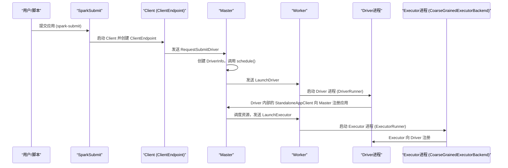

在Spark Standalone集群模式下，Driver的创建、启动以及与Master的交互过程是理解Spark应用提交和资源调度的核心。这个过程涉及从用户提交应用到Driver进程在Worker节点上启动，再到Executor的分配与注册的完整生命周期。本文将深入剖析这一过程的原理与源码实现。

## 1. 核心概念与流程总览

**Driver** 是Spark应用的主控进程，负责解析用户代码、构建DAG、调度任务并与集群管理器通信。在Standalone模式下，Driver可以运行在集群内部（cluster模式）。

其启动与交互的核心流程可以概括为以下几个关键步骤，通过下面的时序图可以直观地理解：



## 2. Driver的诞生：从提交到启动

### 2.1 应用提交与Client启动
用户通过 `spark-submit` 脚本提交应用。脚本最终会执行 `org.apache.spark.deploy.SparkSubmit` 类的 `main` 方法。

**关键代码路径：**
1.  **参数解析**：`SparkSubmitArguments` 解析命令行参数。
2.  **环境准备**：`prepareSubmitEnvironment` 方法根据部署模式准备子进程参数。在Standalone cluster模式下，`childMainClass` 被设置为 `org.apache.spark.deploy.Client`。
3.  **启动Client**：通过反射调用 `Client.main()`。

`Client` 类的主要工作是创建RPC环境，并实例化一个 **`ClientEndpoint`** 消息循环体，这是Driver端与Master通信的第一个端点。

```scala
// Client.scala 简化代码
def main(args: Array[String]) {
  val conf = new SparkConf()
  val driverArgs = new ClientArguments(args)
  val rpcEnv = RpcEnv.create("driverClient", ... , conf)
  // 创建ClientEndpoint，准备向Master提交Driver
  rpcEnv.setupEndpoint("client", new ClientEndpoint(rpcEnv, driverArgs, masterEndpoints, conf))
}
```

### 2.2 向Master提交Driver
`ClientEndpoint` 启动后，在其 `onStart` 方法中会向Master发送 `RequestSubmitDriver` 消息，其中封装了 `DriverDescription`（包含jarUrl、内存、核数、启动命令等信息）。

```scala
// ClientEndpoint.onStart() 片段
val driverDescription = new DriverDescription(
  driverArgs.jarUrl,
  driverArgs.memory,
  driverArgs.cores,
  driverArgs.supervise,
  command)
asyncSendToMasterAndForwardReply[SubmitDriverResponse](
  RequestSubmitDriver(driverDescription))
```

### 2.3 Master调度与Driver启动
Master接收到 `RequestSubmitDriver` 消息后：
1.  **创建并保存Driver信息**：将Driver信息加入 `waitingDrivers` 列表和持久化引擎。
2.  **触发资源调度**：调用 `schedule()` 方法。
3.  **分配资源**：`schedule()` 方法遍历存活的Worker，寻找满足资源需求的节点，然后调用 `launchDriver`。
4.  **发送启动指令**：`launchDriver` 方法向选中的Worker的RPC端点发送 `LaunchDriver(driverId, driverDesc)` 消息。

```scala
// Master.scala - schedule() 和 launchDriver
private def schedule(): Unit = {
  // 检查资源并启动Driver
  if (worker.memoryFree >= driver.desc.mem && worker.coresFree >= driver.desc.cores) {
    launchDriver(worker, driver)
    waitingDrivers -= driver
  }
  // 启动Executor
  startExecutorsOnWorkers()
}

private def launchDriver(worker: WorkerInfo, driver: DriverInfo) {
  worker.endpoint.send(LaunchDriver(driver.id, driver.desc))
  driver.state = DriverState.RUNNING
}
```

### 2.4 Worker启动Driver进程
Worker接收到 `LaunchDriver` 消息后：
1.  **创建驱动运行器**：实例化一个 `DriverRunner` 对象，它是Driver进程的代理。
2.  **启动线程运行Driver**：调用 `driverRunner.start()`。该方法会启动一个新线程来执行 `prepareAndRunDriver`。

```scala
// Worker.scala 处理 LaunchDriver
case LaunchDriver(driverId, driverDesc) =>
  val driver = new DriverRunner(conf, driverId, workDir, sparkHome, driverDesc, self, workerUri, securityMgr)
  drivers(driverId) = driver // 存入管理Map
  driver.start()
  coresUsed += driverDesc.cores // 更新已用资源
  memoryUsed += driverDesc.mem
```

`DriverRunner` 的 `prepareAndRunDriver` 方法负责：
- 创建Driver工作目录。
- 从远程（如HDFS）下载用户Jar包到本地。
- 使用 `CommandUtils.buildProcessBuilder` 构建进程启动命令。
- 最终通过 `ProcessBuilder` 启动一个独立的JVM进程来运行用户指定的主类（即真正的Driver进程）。

**至此，Driver进程在集群的某个Worker节点上被启动起来。**

## 3. Driver与Master的后续交互：应用注册

刚刚启动的Driver进程会初始化 `SparkContext`。在 `SparkContext` 创建 `TaskScheduler` 和 `StandaloneSchedulerBackend` 的过程中，会实例化 `StandaloneAppClient` 并创建另一个核心的消息循环体—— **`StandaloneAppClient.ClientEndpoint`**。

**关键流程：**
1.  `StandaloneSchedulerBackend` 启动时，会调用 `StandaloneAppClient` 的 `start()` 方法。
2.  `start()` 方法创建 `ClientEndpoint`。
3.  `ClientEndpoint` 在其 `onStart()` 方法中，调用 `registerWithMaster()`，向Master发送 `RegisterApplication` 消息，正式注册应用程序。

```scala
// StandaloneAppClient.ClientEndpoint.onStart()
override def onStart(): Unit = {
  try {
    registerWithMaster(1)
  } catch { ... }
}
// registerWithMaster 内部
private def tryRegisterAllMasters(): Array[JFuture[_]] = {
  masterRef.send(RegisterApplication(appDescription, self)) // 发送注册消息
}
```

**Master处理应用注册：**
Master收到 `RegisterApplication` 消息后，将应用信息保存，并再次调用 `schedule()` 方法。这次调度将专注于为这个已注册的应用启动 **Executor**。

```scala
// Master.receive 处理 RegisterApplication
case RegisterApplication(description, driver) =>
  registerApplication(app) // 注册应用
  driver.send(RegisteredApplication(app.id, self)) // 回复ClientEndpoint
  schedule() // 再次调度，启动Executor
```

## 4. Executor的启动与注册

### 4.1 Master调度并启动Executor
在第二次 `schedule()` 调用中，`startExecutorsOnWorkers()` 方法会根据调度算法，为应用分配Worker资源，并调用 `launchExecutor`。

```scala
// Master.scala - launchExecutor
private def launchExecutor(worker: WorkerInfo, exec: ExecutorDesc): Unit = {
  logInfo(s"Launching executor ${exec.fullId} on worker ${worker.id}")
  worker.addExecutor(exec)
  // 1. 通知Worker启动Executor
  worker.endpoint.send(LaunchExecutor(masterUrl, exec.application.id, exec.id, exec.application.desc, exec.cores, exec.memory))
  // 2. 通知Driver，Executor已添加
  exec.application.driver.send(ExecutorAdded(exec.id, worker.id, worker.hostPort, exec.cores, exec.memory))
}
```

### 4.2 Worker启动Executor进程
Worker收到 `LaunchExecutor` 消息后，其处理逻辑与启动Driver类似：
1.  创建 `ExecutorRunner` 对象。
2.  调用 `manager.start()`。内部会启动线程，调用 `fetchAndRunExecutor`。
3.  `fetchAndRunExecutor` 使用 `ProcessBuilder` 启动 `CoarseGrainedExecutorBackend` 进程。

### 4.3 Executor向Driver注册
`CoarseGrainedExecutorBackend` 进程启动后，在其main方法中解析参数（如Driver的URL、Executor ID、核心数等），然后调用其 `run` 方法。在 `run` 方法中，它会建立到Driver的RPC连接，并向 `StandaloneSchedulerBackend` 内部的 `DriverEndpoint` 发送注册消息。

至此，Driver、Master、Worker、Executor之间完成了完整的启动与注册链条。

## 5. 关键交互消息总结

下表概括了Driver（及其相关组件）与Master之间主要的RPC交互消息：

| 发送方 | 接收方 | 消息 | 目的 |
| :--- | :--- | :--- | :--- |
| **ClientEndpoint** | Master | `RequestSubmitDriver` | 提交Driver到集群运行 |
| Master | **ClientEndpoint** | `SubmitDriverResponse` | 回复Driver提交结果 |
| **StandaloneAppClient.ClientEndpoint** | Master | `RegisterApplication` | 注册Spark应用程序 |
| Master | **StandaloneAppClient.ClientEndpoint** | `RegisteredApplication` | 确认应用注册成功 |
| Master | Worker | `LaunchDriver` | 指令Worker启动Driver进程 |
| Master | Worker | `LaunchExecutor` | 指令Worker启动Executor进程 |
| Worker | Master | `DriverStateChanged` | 汇报Driver状态变化（完成/失败/杀死） |
| Worker | Master | `ExecutorStateChanged` | 汇报Executor状态变化 |
| CoarseGrainedExecutorBackend | **DriverEndpoint** (in SchedulerBackend) | `RegisterExecutor` | Executor向Driver注册 |

## 6. 核心要点与总结

1.  **双重角色与端点**：在Cluster模式下，Driver的启动涉及两个通信端点。
    *   **`ClientEndpoint`**：位于 `spark-submit` 触发的 `Client` 进程中，负责向Master提交Driver启动请求。
    *   **`StandaloneAppClient.ClientEndpoint`**：位于集群内启动的Driver进程中，负责向Master注册应用并申请Executor资源。

2.  **进程分离**：
    *   **Driver提交进程** (`Client`) 与 **Driver执行进程** 是分离的。提交进程结束后，Driver在集群中继续运行。
    *   `DriverRunner` 和 `ExecutorRunner` 是Worker进程内的管理组件，它们通过启动子进程（`ProcessBuilder`）的方式分别运行Driver和Executor。

3.  **资源调度与生命周期**：Master是全局资源调度中心。它接收Driver提交请求和Application注册请求，通过 `schedule()` 方法决策资源分配，并通过RPC消息驱动Worker完成Driver和Executor的生命周期管理。

4.  **配置传递**：从 `spark-submit` 命令行参数开始，到 `SparkConf`、`DriverDescription`、`Command`，直至最终启动的Driver和Executor进程，用户指定的配置（如内存、核心数）被贯穿始终地传递。

通过深入理解这一过程，开发者能够更好地进行Spark应用调试、性能调优（如资源分配）以及故障排查（如Driver启动失败、Executor无法注册等问题）。