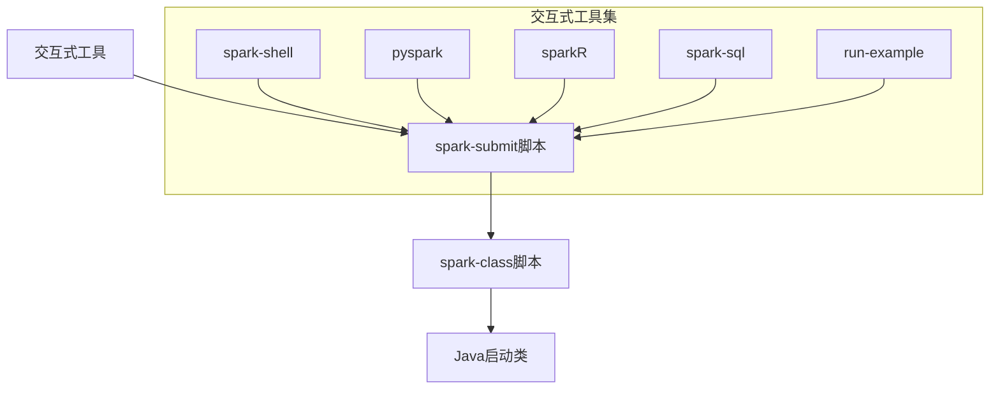
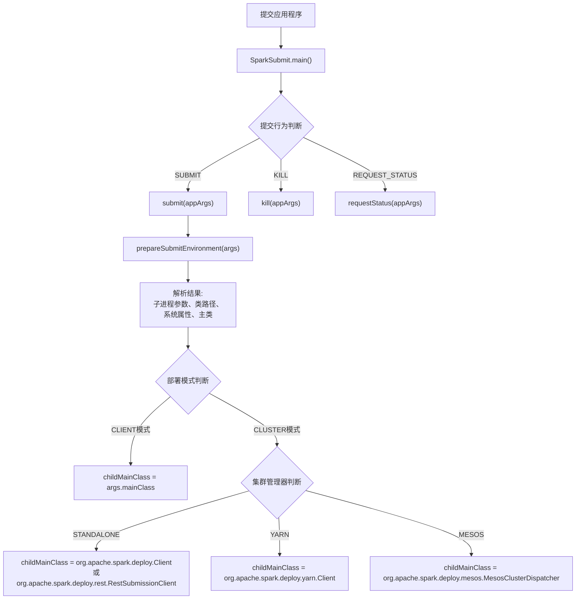

## 引言

Spark作为大数据处理的核心框架，其应用程序的提交过程是整个Spark生态系统的入口。理解Spark Application如何提交给集群，不仅有助于我们更好地使用Spark，还能在遇到问题时快速定位和解决。本文将深入剖析Spark Application的提交机制，从参数配置到源码实现，为您揭开Spark提交过程的神秘面纱。

## 一、Spark Application提交参数详解

### 1.1 spark-submit脚本基础

`spark-submit`是提交Spark应用程序的主要脚本，它负责设置Spark及其依赖的类路径，并支持不同的集群管理器和部署模式。

#### 基本语法格式

```bash
./bin/spark-submit \
  --class <main-class> \
  --master <master-url> \
  --deploy-mode <deploy-mode> \
  --conf <key>=<value> \
  ... # 其他选项
  <application-jar> \
  [application-arguments]
```

### 1.2 关键参数解析

| 参数 | 说明 | 示例 |
|------|------|------|
| `--class` | 应用程序的入口点（主类） | `org.apache.spark.examples.SparkPi` |
| `--master` | 集群的主URL | `spark://23.195.26.187:7077` |
| `--deploy-mode` | Driver部署模式：`cluster`（集群Worker节点）或`client`（本地客户端，默认） | `client` |
| `--conf` | Spark配置属性，key=value格式 | `spark.executor.memory=2g` |
| `<application-jar>` | 应用程序JAR包路径（集群全局可见） | `hdfs://path/to/app.jar` |
| `[application-arguments]` | 传递给主类main方法的参数 | `1000`（计算π的迭代次数） |

### 1.3 支持的集群管理器

Spark目前支持以下三种集群管理器：

1. **Standalone**：Spark原生的简单集群管理器
2. **Apache Mesos**：通用的集群管理器
3. **Hadoop YARN**：Hadoop 2中的资源管理器

此外，Spark还提供了一些方便测试和学习的简单部署模式。

## 二、Spark提交脚本体系分析

### 2.1 脚本调用关系

Spark提供了统一的应用程序提交入口`spark-submit`，其他交互式工具最终都调用该脚本：



### 2.2 各脚本功能解析

#### 2.2.1 spark-shell（Scala交互式界面）

```bash
# 关键执行语句
"${SPARK_HOME}"/bin/spark-submit --class org.apache.spark.repl.Main --name "Spark shell" "$@"
```

#### 2.2.2 pyspark（Python交互式界面）

```bash
# 关键执行语句
exec "${SPARK_HOME}"/bin/spark-submit pyspark-shell-main --name "PySparkShell" "$@"
```

#### 2.2.3 sparkR（R语言交互式界面）

```bash
# 关键执行语句
exec "${SPARK_HOME}"/bin/spark-submit sparkr-shell-main "$@"
```

#### 2.2.4 spark-sql（SQL交互式界面）

```bash
# 关键执行语句
exec "${SPARK_HOME}"/bin/spark-submit --class org.apache.spark.sql.hive.thriftserver.SparkSQLCLIDriver "$@"
```

#### 2.2.5 run-example（运行示例程序）

```bash
# 关键执行语句
exec "${SPARK_HOME}"/bin/spark-submit \
  --master $EXAMPLE_MASTER \
  --class $EXAMPLE_CLASS \
  "$SPARK_EXAMPLES_JAR" \
  "$@"
```

#### 2.2.6 spark-submit（核心提交脚本）

```bash
# 关键执行语句
exec "${SPARK_HOME}"/bin/spark-class org.apache.spark.deploy.SparkSubmit "$@"
```

#### 2.2.7 spark-class（最终Java启动脚本）

```bash
# 关键执行语句（简化版）
CMD=()
while IFS= read -d '' -r ARG; do
    CMD+=("$ARG")
done < <("$RUNNER" -cp "$LAUNCH_CLASSPATH" org.apache.spark.launcher.Main "$@")
exec "${CMD[@]}"
```

## 三、Spark提交机制源码深度解析

### 3.1 启动入口：Main类

`org.apache.spark.launcher.Main`是Spark启动器的命令行接口，在Spark脚本内部使用。它有两种工作模式：

#### 3.1.1 工作模式分类

```java
/**
 * Usage: Main [class] [class args]
 * <p>
 * 命令行界面工作在两种模式下:
 * <ul>
 * <li>"spark-submit": if <i>class</i> is "org.apache.spark.deploy.SparkSubmit",
 *     the {@link SparkLauncher} class is used to launch a Spark application. </li>
 * <li>"spark-class": if another class is provided, an internal Spark class is run.</li>
 * </ul>
 */
```

#### 3.1.2 参数与资源映射关系

| 脚本参数 | 对应主资源 | 说明 |
|---------|-----------|------|
| `pyspark-shell-main` | `PYSPARK_SHELL` | Python交互式Shell |
| `sparkr-shell-main` | `SPARKR_SHELL` | R语言交互式Shell |
| `run-example` | `SPARK_EXAMPLES_JAR` | 示例程序JAR包 |

### 3.2 提交行为定义：SparkSubmitAction

`SparkSubmitAction`定义了提交应用程序的行为类型：

```scala
private[deploy] object SparkSubmitAction extends Enumeration {
  type SparkSubmitAction = Value
  val SUBMIT, KILL, REQUEST_STATUS = Value
}
```

- **SUBMIT**：提交应用程序
- **KILL**：停止应用程序
- **REQUEST_STATUS**：查询应用程序状态

### 3.3 核心提交类：SparkSubmit

`org.apache.spark.deploy.SparkSubmit`是启动Spark应用程序的主入口点，它封装了底层复杂的集群管理器与部署模式的差异。

#### 3.3.1 集群管理器定义

```scala
// 集群管理器
private val YARN = 1
private val STANDALONE = 2
private val MESOS = 4
private val LOCAL = 8
private val ALL_CLUSTER_MGRS = YARN | STANDALONE | MESOS | LOCAL
```

#### 3.3.2 部署模式定义

```scala
// 部署模式
private val CLIENT = 1
private val CLUSTER = 2
private val ALL_DEPLOY_MODES = CLIENT | CLUSTER
```

#### 3.3.3 主入口方法

```scala
def main(args: Array[String]): Unit = {
  val appArgs = new SparkSubmitArguments(args)
  
  // 根据3种行为分别进行处理
  appArgs.action match {
    case SparkSubmitAction.SUBMIT => submit(appArgs)
    case SparkSubmitAction.KILL => kill(appArgs)
    case SparkSubmitAction.REQUEST_STATUS => requestStatus(appArgs)
  }
}
```

#### 3.3.4 提交处理流程



#### 3.3.5 不同部署模式下的主类封装

**CLIENT模式**：
- 直接使用用户指定的主类（`args.mainClass`）
- 在提交节点本地执行

**CLUSTER模式**（根据集群管理器不同）：
- **Standalone**：使用`org.apache.spark.deploy.Client`（传统RPC方式）或`org.apache.spark.deploy.rest.RestSubmissionClient`（REST方式）
- **YARN**：使用`org.apache.spark.deploy.yarn.Client`
- **Mesos**：使用`org.apache.spark.deploy.mesos.MesosClusterDispatcher`

### 3.4 SparkContext：应用程序入口点

`SparkContext`是Spark功能的主入口点，代表了与Spark集群的连接。

#### 3.4.1 集群管理器类型识别

```scala
private object SparkMasterRegex {
  // 本地模式：local[N] 和 local[*]
  val LOCAL_N_REGEX = """local\[([0-9]+|\*)\]""".r
  
  // 本地模式（带重试）：local[N, maxRetries]
  val LOCAL_N_FAILURES_REGEX = """local\[([0-9]+|\*)\s*,\s*([0-9]+)\]""".r
  
  // 本地集群模拟模式：local-cluster[N, cores, memory]
  val LOCAL_CLUSTER_REGEX = """local-cluster\[\s*([0-9]+)\s*,\s*([0-9]+)\s*,\s*([0-9]+)\s*]""".r
  
  // Spark集群连接模式
  val SPARK_REGEX = """spark://(.*)""".r
}
```

#### 3.4.2 SparkContext初始化流程

```scala
// 1. 创建Spark执行环境
_env = createSparkEnv(_conf, isLocal, listenerBus)
SparkEnv.set(_env)

// 2. 创建和启动调度器
val (sched, ts) = SparkContext.createTaskScheduler(this, master)
_schedulerBackend = sched
_taskScheduler = ts

// 3. 创建DAG调度器
_dagScheduler = new DAGScheduler(this)
```

#### 3.4.3 不同集群模式下的调度器实现

| 集群模式 | TaskScheduler实现 | SchedulerBackend实现 |
|---------|------------------|-------------------|
| **Local模式** | `TaskSchedulerImpl` | `LocalBackend` |
| **Standalone模式** | `TaskSchedulerImpl` | `StandaloneSchedulerBackend` |
| **YARN Client模式** | `TaskSchedulerImpl` | `YarnClientSchedulerBackend` |
| **YARN Cluster模式** | `TaskSchedulerImpl` | `YarnClusterSchedulerBackend` |
| **Mesos模式** | `TaskSchedulerImpl` | `MesosSchedulerBackend` |

## 四、提交机制总结与对比

### 4.1 部署模式对比

| 特性 | **Client模式** | **Cluster模式** |
|------|---------------|----------------|
| **Driver位置** | 提交节点本地 | 集群Worker节点 |
| **网络要求** | 提交节点需与集群网络互通 | 仅集群内部通信 |
| **故障恢复** | Driver故障则应用失败 | Driver故障可由集群重启 |
| **资源占用** | 占用提交节点资源 | 占用集群资源 |
| **适用场景** | 开发调试、交互式分析 | 生产环境、长时间运行作业 |

### 4.2 集群管理器特性对比

| 特性 | **Standalone** | **YARN** | **Mesos** |
|------|---------------|----------|-----------|
| **成熟度** | 原生、简单 | 企业级、成熟 | 通用、灵活 |
| **资源隔离** | 较弱 | 强（Container） | 强（Cgroups） |
| **多租户** | 不支持 | 支持 | 支持 |
| **与Hadoop集成** | 需单独配置 | 无缝集成 | 需配置集成 |
| **调度策略** | FIFO、FAIR | Capacity、Fair | Dominant Resource Fairness |

### 4.3 实际应用建议

1. **开发测试环境**：
   - 使用Local模式或Standalone单机模式
   - 部署模式选择Client模式，便于调试

2. **生产环境**：
   - 优先选择YARN（已有Hadoop集群）或Standalone（纯Spark集群）
   - 部署模式选择Cluster模式，提高应用稳定性

3. **参数调优要点**：
   - 根据集群资源合理设置`--executor-memory`、`--executor-cores`
   - 对于大数据量作业，适当增加`--num-executors`
   - 使用`--conf`参数灵活配置Spark属性

## 五、常见问题与解决方案

### 5.1 提交失败常见原因

1. **类路径问题**：
   ```bash
   # 确保JAR包在集群所有节点都可见
   # 错误示例：使用本地文件路径
   --jar file:///home/user/app.jar
   # 正确示例：使用HDFS路径
   --jar hdfs://namenode:9000/apps/spark/app.jar
   ```

2. **权限问题**：
   ```bash
   # 在YARN集群中，确保有足够的资源配额
   # 检查YARN队列配置和用户权限
   ```

3. **网络问题**：
   ```bash
   # Client模式下，确保提交节点能访问集群所有节点
   # 检查防火墙和网络配置
   ```

### 5.2 性能优化建议

1. **序列化优化**：
   ```scala
   // 使用Kryo序列化提高性能
   conf.set("spark.serializer", "org.apache.spark.serializer.KryoSerializer")
   conf.registerKryoClasses(Array(classOf[MyClass1], classOf[MyClass2]))
   ```

2. **内存优化**：
   ```bash
   # 合理设置Executor内存，避免频繁GC
   --executor-memory 4g \
   --conf spark.memory.fraction=0.8 \
   --conf spark.memory.storageFraction=0.3
   ```

3. **并行度优化**：
   ```bash
   # 根据数据量和集群规模设置合适的分区数
   --conf spark.default.parallelism=200 \
   --conf spark.sql.shuffle.partitions=200
   ```

## 结语

Spark Application的提交机制是连接用户代码与分布式计算集群的桥梁。通过深入理解`spark-submit`的工作机制、不同集群管理器的实现差异以及各种部署模式的特点，我们能够：

1. **更高效地使用Spark**：根据实际场景选择最合适的提交方式
2. **更快速地排查问题**：理解提交过程的每个环节，便于定位问题
3. **更优化地配置参数**：基于对底层机制的理解，进行针对性的性能调优

Spark的设计哲学是"让复杂的事情变得简单"，而`spark-submit`正是这一理念的完美体现。它通过统一的接口封装了底层各种集群管理器和部署模式的复杂性，为用户提供了简洁而强大的应用程序提交体验。