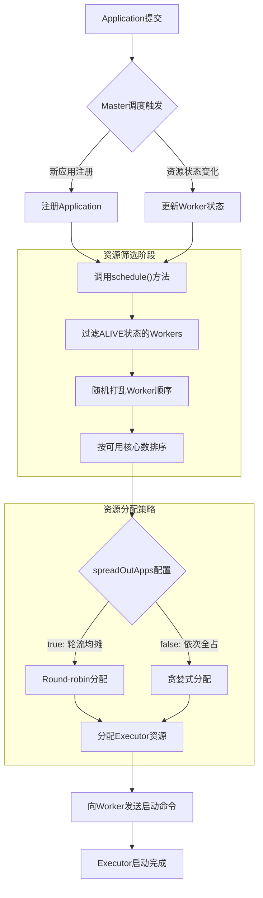
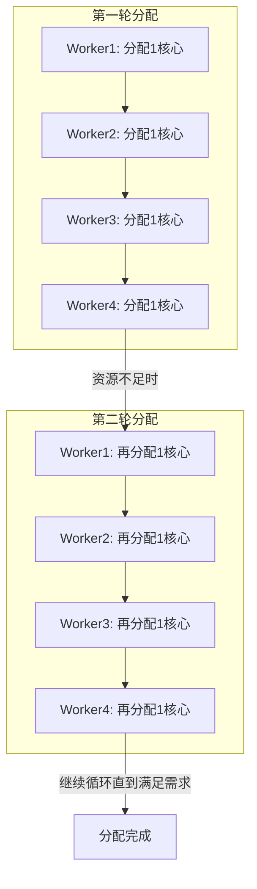
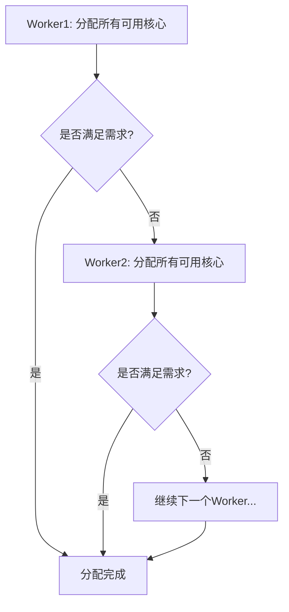

## 引言

Spark作为分布式计算框架的核心优势之一，是其高效、智能的资源管理机制。理解Spark Application如何向集群申请资源，是掌握Spark内部工作原理的关键。这不仅关系到应用程序的性能表现，更直接影响着集群资源的利用效率和成本控制。本文将深入剖析Spark资源调度的核心机制，揭秘Application申请资源的全过程。

## 1. 资源调度概述

### 1.1 资源调度的两种类型

Spark Application向集群申请资源时，主要采用两种策略：

| 策略类型 | 特点 | 适用场景 |
|---------|------|---------|
| **Spread Out模式** | 尽可能在集群的所有Worker上分配Executor | 数据密集型任务，追求更好的数据本地性 |
| **集中模式** | 尝试运行在尽可能少的Worker上 | 计算密集型任务，减少网络开销 |

这两种策略由配置项 `spark.deploy.spreadOut` 控制，默认为 `true`（即Spread Out模式）。

### 1.2 调度触发时机

Master的调度方法 `schedule()` 在以下情况下会被调用：

1. **新应用程序提交** - 当Driver注册新的Application时
2. **集群资源变化** - 包括Executor增加/减少、Worker增加/减少等
3. **资源状态更新** - Worker资源状态发生变化时

## 2. 调度框架与核心概念

### 2.1 调度流程概述



### 2.2 重要概念澄清

**Executor vs Task**：
- **Executor**：集群执行应用程序的单位组件，长期驻留在Worker节点上
- **Task**：具体的计算任务，在Executor中执行

**资源分配单位**：
- 资源是分配给Executor的，不是直接分配给Task
- Executor启动时占用的资源必须满足启动所需的最小条件

## 3. 调度机制详解

### 3.1 调度触发源码分析

当新的Application注册时，Master会执行以下流程：

```scala
case RegisterApplication(description, driver) =>
  if (state == RecoveryState.STANDBY) {
    // 忽略，不要发送响应
  } else {
    logInfo("Registering app " + description.name)
    val app = createApplication(description, driver)
    registerApplication(app)
    logInfo("Registered app " + description.name + " with ID " + app.id)
    persistenceEngine.addApplication(app)
    driver.send(RegisteredApplication(app.id, self))
    schedule()  // 关键：触发资源调度
  }
```

### 3.2 Worker筛选与准备

调度开始前，Master需要筛选出可用的Worker节点：

```scala
// 1. 确保Master处于ALIVE状态
if (state != RecoveryState.ALIVE) {
  return
}

// 2. 过滤ALIVE状态的Worker
val shuffledAliveWorkers = Random.shuffle(
  workers.toSeq.filter(_.state == WorkerState.ALIVE)
)
```

**负载均衡策略**：
- 使用 `Random.shuffle()` 随机打乱Worker顺序
- 避免固定顺序导致的负载不均衡问题
- 打乱算法核心：循环随机交换Worker位置

### 3.3 FIFO调度策略

Spark默认采用FIFO（先进先出）方式为应用程序启动Executor：

```scala
private def startExecutorsOnWorkers(): Unit = {
  // 这是一个非常简单的FIFO调度
  // 我们尝试在队列中推入第一个应用程序，然后推入第二个应用程序等
  for (app <- waitingApps if app.coresLeft > 0) {
    // 筛选出可用的Worker
    val usableWorkers = workers.toArray
      .filter(_.state == WorkerState.ALIVE)
      .filter(worker => 
        worker.memoryFree >= app.desc.memoryPerExecutorMB &&
        worker.coresFree >= coresPerExecutor.getOrElse(1)
      )
      .sortBy(_.coresFree).reverse  // 按可用核心数降序排序
    
    // 分配核心数
    val assignedCores = scheduleExecutorsOnWorkers(
      app, usableWorkers, spreadOutApps
    )
    
    // 分配资源给Executor
    for (pos <- 0 until usableWorkers.length if assignedCores(pos) > 0) {
      allocateWorkerResourceToExecutors(
        app, assignedCores(pos), coresPerExecutor, usableWorkers(pos)
      )
    }
  }
}
```

## 4. 资源分配策略实现

### 4.1 Spread Out模式（轮流均摊）

当 `spreadOutApps = true` 时，采用Round-robin算法：



**算法特点**：
- 每次从可用Worker列表中轮流为每个Worker分配最小核心数
- 直到满足应用程序的资源需求
- 有利于数据本地性，Executor分布在更多节点上

### 4.2 集中模式（依次全占）

当 `spreadOutApps = false` 时，采用贪婪式分配：



**算法特点**：
- 依次从每个Worker上获取该Worker可用的全部资源
- 直到满足应用程序的资源需求
- 减少网络通信开销，适合计算密集型任务

### 4.3 核心分配算法实现

```scala
private def scheduleExecutorsOnWorkers(
  app: ApplicationInfo,
  usableWorkers: Array[WorkerInfo],
  spreadOutApps: Boolean
): Array[Int] = {
  
  val coresPerExecutor = app.desc.coresPerExecutor
  val minCoresPerExecutor = coresPerExecutor.getOrElse(1)
  val oneExecutorPerWorker = coresPerExecutor.isEmpty
  val memoryPerExecutor = app.desc.memoryPerExecutorMB
  
  val numUsable = usableWorkers.length
  val assignedCores = new Array[Int](numUsable)
  val assignedExecutors = new Array[Int](numUsable)
  
  // 计算可分配的核心数
  var coresToAssign = math.min(
    app.coresLeft, 
    usableWorkers.map(_.coresFree).sum
  )
  
  // 获取可用Worker的索引
  val freeWorkers = (0 until numUsable).filter(
    assignedCores(_) == 0
  ).toArray
  
  // 核心分配循环
  while (freeWorkers.nonEmpty) {
    freeWorkers.foreach { pos =>
      var keepScheduling = true
      while (keepScheduling && canLaunchExecutor(pos)) {
        coresToAssign -= minCoresPerExecutor
        assignedCores(pos) += minCoresPerExecutor
        
        // Executor分配逻辑
        if (oneExecutorPerWorker) {
          assignedExecutors(pos) = 1
        } else {
          assignedExecutors(pos) += 1
        }
        
        // Spread Out模式控制
        if (spreadOutApps) {
          keepScheduling = false
        }
      }
    }
  }
  
  assignedCores
}
```

## 5. Executor启动过程

### 5.1 资源分配与Executor创建

```scala
private def allocateWorkerResourceToExecutors(
  app: ApplicationInfo,
  assignedCores: Int,
  coresPerExecutor: Option[Int],
  worker: WorkerInfo
): Unit = {
  
  // 计算Executor数量
  val numExecutors = coresPerExecutor.map { 
    assignedCores / _ 
  }.getOrElse(1)
  
  val coresToAssign = coresPerExecutor.getOrElse(assignedCores)
  
  // 为每个Executor分配资源
  for (i <- 1 to numExecutors) {
    val exec = app.addExecutor(worker, coresToAssign)
    launchExecutor(worker, exec)
    app.state = ApplicationState.RUNNING
  }
}
```

### 5.2 Executor启动通信

```scala
private def launchExecutor(worker: WorkerInfo, exec: ExecutorDesc): Unit = {
  logInfo("Launching executor " + exec.fullId + " on worker " + worker.id)
  
  // 1. 在Worker上注册Executor
  worker.addExecutor(exec)
  
  // 2. 向Worker发送启动命令
  worker.endpoint.send(LaunchExecutor(
    masterUrl,
    exec.application.id,
    exec.id,
    exec.application.desc,
    exec.cores,
    exec.memory
  ))
  
  // 3. 通知Driver
  exec.application.driver.send(
    ExecutorAdded(
      exec.id, 
      worker.id, 
      worker.hostPort, 
      exec.cores, 
      exec.memory
    )
  )
}
```

## 6. 关键配置参数

### 6.1 资源配置参数

| 参数 | 配置方式 | 默认值 | 说明 |
|------|---------|--------|------|
| `--total-executor-cores` | spark-submit参数 | 无 | 所有Executors的总核心数 |
| `--executor-cores` | spark-submit参数 | 1(YARN)或Worker所有核心(Standalone) | 每个Executor的核心数 |
| `spark.deploy.spreadOut` | Spark配置 | true | 资源分配策略 |

### 6.2 配置源码位置

```scala
// 1. 总核心数配置
// SparkSubmitArguments.printUsageAndExit中定义
// --total-executor-cores NUM Total cores for all executors.

// 2. 每个Executor核心数配置
// SparkSubmitArguments.printUsageAndExit中定义
// --executor-cores NUM Number of cores per executor.

// 3. 分配策略配置
private val spreadOutApps = conf.getBoolean("spark.deploy.spreadOut", true)
```

## 7. 实际应用场景分析

### 7.1 数据密集型任务

**场景特点**：
- 数据分布在多个节点上
- 需要频繁读取数据
- 网络传输成本较高

**推荐配置**：
```bash
# 启用Spread Out模式，提高数据本地性
spark.deploy.spreadOut=true
# 较小的Executor核心数，增加Executor数量
--executor-cores 2
```

### 7.2 计算密集型任务

**场景特点**：
- 计算逻辑复杂
- 数据量相对较小
- 需要大量CPU资源

**推荐配置**：
```bash
# 禁用Spread Out模式，减少网络开销
spark.deploy.spreadOut=false
# 较大的Executor核心数，提高计算效率
--executor-cores 8
```

### 7.3 混合型任务

**场景特点**：
- 既有数据读取，又有复杂计算
- 需要平衡本地性和计算效率

**推荐配置**：
```bash
# 根据数据分布情况调整
spark.deploy.spreadOut=true
--executor-cores 4
--total-executor-cores 32
```

## 8. 最佳实践与调优建议

### 8.1 资源分配策略选择

1. **数据本地性优先**：当数据分布在多个节点时，使用Spread Out模式
2. **计算效率优先**：当任务计算密集时，使用集中模式
3. **动态调整**：根据任务特点灵活调整分配策略

### 8.2 Executor配置优化

**原则**：
- Executor数量不宜过多，避免调度开销
- 单个Executor不宜过大，避免GC压力
- 内存与核心比例要合理

**经验值**：
- 每个Executor核心数：2-8个
- Executor内存：4G-16G
- 核心:内存比例 ≈ 1:4GB

### 8.3 监控与调优

1. **监控指标**：
   - Executor启动时间
   - 资源利用率
   - 数据本地性比率

2. **调优步骤**：
   - 基准测试确定最佳配置
   - 逐步调整参数观察效果
   - 记录调优过程和结果

## 总结

Spark的资源调度机制是其分布式计算能力的核心支撑。通过深入理解Master的调度逻辑、资源分配策略以及Executor启动过程，我们可以：

1. **合理配置资源**：根据任务特点选择最佳分配策略
2. **优化性能表现**：提高数据本地性，减少网络开销
3. **提升资源利用率**：避免资源浪费，降低计算成本
4. **解决实际问题**：快速定位和解决资源相关的问题

掌握Spark资源调度的内部机制，不仅有助于编写更高效的Spark应用程序，还能在集群管理和运维中做出更明智的决策。随着Spark生态的不断发展，资源调度机制也在持续优化，但核心原理和设计思想将长期指导我们的实践。