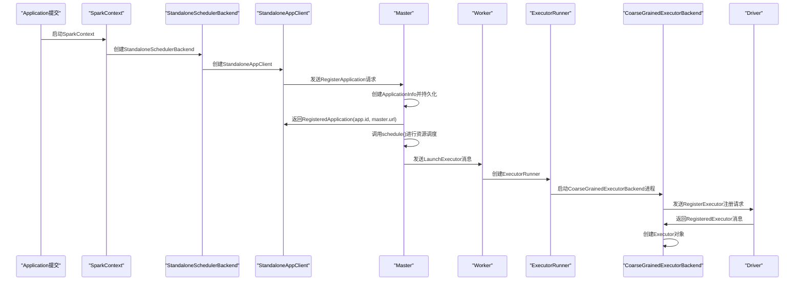
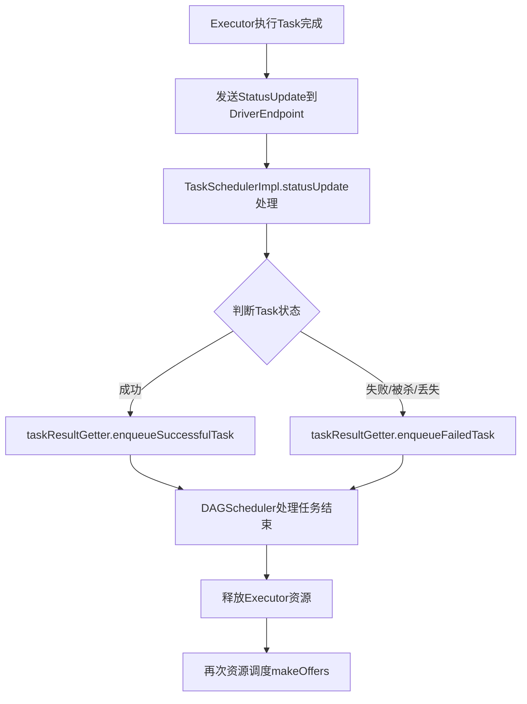

> **核心洞察**：Spark Executor的启动并非在Application提交时立即发生，而是经过复杂的资源调度和RPC通信过程后才真正启动。理解这一机制对于优化Spark应用性能、调试资源分配问题至关重要。

## 1. Executor启动时机：从提交到运行的全过程

Executor的启动是一个**异步、分阶段**的过程，涉及多个组件的协同工作。

### 1.1 启动流程概览



### 1.2 Master端的Application注册

当Application提交后，Driver通过`StandaloneAppClient`向Master发送`RegisterApplication`请求：

```scala
// Master.scala处理RegisterApplication请求
case RegisterApplication(description, driver) =>
  // Master处于STANDBY状态时不处理
  if (state == RecoveryState.STANDBY) {
    // 忽略，不发送响应
  } else {
    logInfo("Registering app " + description.name)
    // 创建ApplicationInfo对象
    val app = createApplication(description, driver)
    registerApplication(app)
    logInfo("Registered app " + description.name + " with ID " + app.id)
    // 持久化以便错误恢复
    persistenceEngine.addApplication(app)
    driver.send(RegisteredApplication(app.id, self))
    // 关键：调用schedule方法启动Executor
    schedule()
  }
```

**关键步骤解析**：
1. **创建ApplicationInfo**：封装应用的基本信息
2. **注册应用**：将应用加入等待调度队列
3. **持久化**：确保Master故障恢复后能重建应用状态
4. **调度执行**：调用`schedule()`启动资源分配

### 1.3 ApplicationInfo的创建

```scala
private def createApplication(desc: ApplicationDescription, driver: RpcEndpointRef): 
  ApplicationInfo = {
  val now = System.currentTimeMillis()
  val date = new Date(now)
  // 生成唯一的appId，格式：app-20160429101010-0001
  val appId = newApplicationId(date)
  // 创建ApplicationInfo对象
  new ApplicationInfo(now, appId, desc, date, driver, defaultCores)
}
```

**appId生成规则**：
```scala
val appId = "app-%s-%04d".format(createDateFormat.format(submitDate), nextAppNumber)
```

### 1.4 应用注册的详细过程

`registerApplication`方法负责将应用信息存储到Master的各种数据结构中：

```scala
private def registerApplication(app: ApplicationInfo): Unit = {
  // 获取Driver地址
  val appAddress = app.driver.address
  
  // 检查是否已注册（避免重复注册）
  if (addressToApp.contains(appAddress)) {
    logInfo("Attempted to re-register application at same address: " + appAddress)
    return
  }
  
  // 向度量系统注册
  applicationMetricsSystem.registerSource(app.appSource)
  
  // 存储到各种数据结构中
  apps += app                    // HashSet保存所有应用
  idToApp(app.id) = app         // id到app的映射
  endpointToApp(app.driver) = app // driver到app的映射
  addressToApp(appAddress) = app  // 地址到app的映射
  waitingApps += app            // 加入等待调度队列
  
  // 如果启用反向代理，添加UI代理目标
  if (reverseProxy) {
    webUi.addProxyTargets(app.id, app.desc.appUiUrl)
  }
}
```

### 1.5 资源调度：schedule方法

`schedule()`方法是Executor启动的核心，负责资源分配：

```scala
private def schedule(): Unit = {
  // 1. 调度Driver（如果有等待的Driver）
  launchDriver(worker, driver)
  
  // 2. 在Worker上启动Executor
  startExecutorsOnWorkers()
}
```

**schedule方法触发时机**：
- 新的Driver注册时
- 新的Application注册时
- 可用资源发生变动时

### 1.6 Executor启动策略

`startExecutorsOnWorkers()`方法采用两种策略分配资源：

| 策略类型 | 特点 | 适用场景 |
|---------|------|----------|
| **轮流均摊策略** | 采用圆桌算法依次轮流均摊资源 | **默认策略**，通常有更好的数据本地性 |
| **依次全占策略** | 依次获取每个Worker上的全部资源 | 资源需求集中，需要快速分配的场景 |

### 1.7 实际资源分配：allocateWorkerResourceToExecutors

逻辑资源分配完成后，需要实际在Worker上启动Executor：

```scala
private def allocateWorkerResourceToExecutors(...) {
  // 实际启动Executor
  launchExecutor(worker, exec)
}
```

`launchExecutor`方法向Worker发送启动指令：

```scala
private def launchExecutor(worker: WorkerInfo, exec: ExecutorDesc): Unit = {
  logInfo("Launching executor " + exec.fullId + " on worker " + worker.id)
  
  // 1. 向WorkerInfo中添加Executor描述
  worker.addExecutor(exec)
  
  // 2. 向Worker发送LaunchExecutor消息
  worker.endpoint.send(LaunchExecutor(
    masterUrl,
    exec.application.id, 
    exec.id, 
    exec.application.desc, 
    exec.cores,
    exec.memory
  ))
  
  // 3. 向Driver反馈Executor已添加
  exec.application.driver.send(
    ExecutorAdded(
      exec.id, 
      worker.id, 
      worker.hostPort, 
      exec.cores, 
      exec.memory
    )
  )
}
```

### 1.8 Worker端的Executor启动

Worker收到`LaunchExecutor`消息后：

1. **验证Master状态**：检查是否为ALIVE状态的Master
2. **创建工作目录**：为Executor准备运行环境
3. **创建ExecutorRunner**：负责管理Executor进程

```scala
// ExecutorRunner.scala - 启动线程
private[worker] def start() {
  // 创建工作线程
  workerThread = new Thread("ExecutorRunner for " + fullId) {
    override def run() { 
      fetchAndRunExecutor()  // 启动Executor进程
    }
  }
  
  // 启动线程
  workerThread.start()
  
  // 注册关闭钩子
  shutdownHook = ShutdownHookManager.addShutdownHook { () =>
    if (state == ExecutorState.RUNNING) {
      state = ExecutorState.FAILED
    }
    killProcess(Some("Worker shutting down")) 
  }
}
```

### 1.9 CoarseGrainedExecutorBackend的启动

`fetchAndRunExecutor()`方法启动`CoarseGrainedExecutorBackend`进程：

```scala
// CoarseGrainedExecutorBackend.scala - 启动时注册
override def onStart() {
  driver = Some(ref)
  // 向Driver发送注册请求
  ref.ask[Boolean](RegisterExecutor(executorId, self, hostname, cores, extractLogUrls))
}
```

### 1.10 Driver端的Executor注册处理

Driver收到`RegisterExecutor`请求后：

```scala
// CoarseGrainedSchedulerBackend.scala
override def receiveAndReply(context: RpcCallContext): PartialFunction[Any, Unit] = {
  case RegisterExecutor(executorId, executorRef, hostname, cores, logUrls) =>
    // ... 处理注册逻辑
    executorRef.send(RegisteredExecutor)  // 返回注册成功消息
}
```

### 1.11 Executor对象的最终创建

`CoarseGrainedExecutorBackend`收到`RegisteredExecutor`消息后创建真正的Executor：

```scala
// CoarseGrainedExecutorBackend.scala
override def receive: PartialFunction[Any, Unit] = {
  case RegisteredExecutor =>
    logInfo("Successfully registered with driver")
    try {
      // 创建Executor对象
      executor = new Executor(executorId, hostname, env, userClassPath, isLocal = false)
    } catch {
      case NonFatal(e) =>
        exitExecutor(1, "Unable to create executor due to " + e.getMessage, e)
    }
}
```

至此，**Executor启动完成**，可以开始执行Task。

## 2. Executor如何把结果交给Application

Executor执行完Task后，需要通过复杂的通信链路将结果返回给Application。

### 2.1 结果传递流程



### 2.2 DriverEndpoint接收状态更新

`CoarseGrainedSchedulerBackend`中的`DriverEndpoint`接收Executor的状态更新：

```scala
override def receive: PartialFunction[Any, Unit] = {
  case StatusUpdate(executorId, taskId, state, data) =>
    // 1. 传递给TaskScheduler处理
    scheduler.statusUpdate(taskId, state, data.value)
    
    // 2. 如果任务完成，释放资源并重新调度
    if (TaskState.isFinished(state)) {
      executorDataMap.get(executorId) match {
        case Some(executorInfo) =>
          // 释放该任务占用的CPU核心
          executorInfo.freeCores += scheduler.CPUS_PER_TASK
          // 重新进行资源调度
          makeOffers(executorId)
        case None =>
          // 忽略未知Executor的更新
          logWarning(s"Ignored task status update ($taskId state $state)" +
            s"from unknown executor with ID $executorId")
      }
    }
}
```

### 2.3 TaskSchedulerImpl的状态更新处理

`TaskSchedulerImpl`的`statusUpdate`方法根据任务状态进行不同处理：

```scala
def statusUpdate(tid: Long, state: TaskState, serializedData: ByteBuffer) {
  state match {
    // 情况1：Executor丢失
    case TaskState.LOST =>
      val reason = "Task " + tid + " was lost."
      // 记录原因并清理Executor
      taskSetManager.handleFailedTask(tid, TaskState.LOST, reason)
      // 清理整个Executor
      cleanupExecutor(executorId)
      
    // 情况2：任务成功完成
    case state if TaskState.isFinished(state) =>
      // 从运行任务集中移除
      taskSetManager.removeRunningTask(tid)
      // 处理成功任务
      taskResultGetter.enqueueSuccessfulTask(taskSetManager, tid, state, serializedData)
      
    // 情况3：任务失败、被杀死或丢失
    case TaskState.FAILED | TaskState.KILLED | TaskState.LOST =>
      // 处理失败任务
      taskResultGetter.enqueueFailedTask(taskSetManager, tid, state, serializedData)
  }
}
```

### 2.4 TaskResultGetter的任务处理

`TaskResultGetter`内部通过不同线程处理成功和失败的任务：

```scala
// 处理成功任务
def enqueueSuccessfulTask(
  taskSetManager: TaskSetManager, 
  tid: Long, 
  state: TaskState, 
  serializedData: ByteBuffer
) {
  // 创建处理线程
  getTaskResultExecutor.execute(new Runnable {
    override def run() {
      try {
        // 反序列化结果
        val result = ser.deserialize[TaskResult[_]](serializedData)
        // 通知TaskSetManager任务成功
        taskSetManager.handleSuccessfulTask(tid, result)
      } catch {
        case e: Exception =>
          // 反序列化失败，按失败处理
          taskSetManager.handleFailedTask(tid, TaskState.FAILED, e.getMessage)
      }
    }
  })
}

// 处理失败任务
def enqueueFailedTask(
  taskSetManager: TaskSetManager, 
  tid: Long, 
  state: TaskState, 
  serializedData: ByteBuffer
) {
  getTaskResultExecutor.execute(new Runnable {
    override def run() {
      val reason = if (serializedData != null && serializedData.limit() > 0) {
        // 从序列化数据中提取失败原因
        ser.deserialize[TaskFailedReason](serializedData)
      } else {
        UnknownReason
      }
      // 通知TaskSetManager任务失败
      taskSetManager.handleFailedTask(tid, state, reason)
    }
  })
}
```

### 2.5 DAGScheduler的最终处理

任务处理结果最终会传递到`DAGScheduler`：

```scala
// TaskSetManager.handleSuccessfulTask调用链
handleSuccessfulTask
  -> taskSucceeded
    -> dagScheduler.taskEnded
      -> eventProcessLoop.post(CompletionEvent)
        -> dagScheduler.handleTaskCompletion
```

在`handleTaskCompletion`方法中，DAGScheduler会根据任务完成情况：
1. **更新Stage状态**
2. **处理Shuffle输出**
3. **调度后续Stage**
4. **清理中间数据**

## 3. 关键机制总结

### 3.1 Executor启动的关键点

| 阶段 | 关键组件 | 作用 |
|------|----------|------|
| **注册阶段** | StandaloneAppClient | 向Master注册Application |
| **调度阶段** | Master.schedule() | 分配资源并决定Executor位置 |
| **启动阶段** | Worker.ExecutorRunner | 启动CoarseGrainedExecutorBackend进程 |
| **注册完成** | CoarseGrainedExecutorBackend | 向Driver注册并创建Executor对象 |

### 3.2 结果传递的关键路径

1. **Executor → Driver**：通过`StatusUpdate`消息
2. **Driver内部处理**：
   - `DriverEndpoint`接收更新
   - `TaskSchedulerImpl`根据状态分发
   - `TaskResultGetter`异步处理结果
3. **最终处理**：
   - `DAGScheduler`更新任务图状态
   - 触发后续Stage调度
   - 释放资源并重新调度

### 3.3 资源管理机制

**动态资源释放**：任务完成后立即释放CPU核心，通过`makeOffers`重新调度，实现**资源的高效复用**。

```scala
// 任务完成后释放资源
executorInfo.freeCores += scheduler.CPUS_PER_TASK
// 立即重新调度
makeOffers(executorId)
```

## 4. 实际应用启示

### 4.1 性能优化建议

1. **减少Executor启动延迟**：
   - 预分配资源池
   - 使用动态分配时设置合理的超时参数

2. **优化结果传递**：
   - 控制Task输出大小，避免序列化开销
   - 使用高效的序列化器（如Kryo）

3. **资源利用率提升**：
   - 合理设置`spark.executor.cores`，避免资源碎片
   - 监控Executor空闲时间，调整动态分配参数

### 4.2 故障排查指南

| 问题现象 | 可能原因 | 排查方向 |
|---------|----------|----------|
| Executor启动失败 | 资源不足、网络问题 | 检查Worker日志、资源监控 |
| 结果传递超时 | 网络延迟、序列化问题 | 检查网络状况、序列化配置 |
| Executor频繁丢失 | 心跳超时、GC暂停 | 调整超时参数、优化GC配置 |

### 4.3 配置建议

```properties
# 核心配置项
spark.executor.instances = 4           # 初始Executor数量
spark.executor.cores = 4               # 每个Executor核心数
spark.executor.memory = 8g             # 每个Executor内存
spark.dynamicAllocation.enabled = true # 启用动态分配
spark.dynamicAllocation.minExecutors = 2 # 最小Executor数
spark.dynamicAllocation.maxExecutors = 10 # 最大Executor数
spark.network.timeout = 120s           # 网络超时时间
```

## 5. 总结

Executor的启动和结果传递机制体现了Spark架构的**异步、事件驱动**设计理念：

1. **启动是异步的**：Application提交后，Executor的启动经过多层调度和通信
2. **资源是动态的**：任务完成后立即释放资源，实现高效复用
3. **通信是可靠的**：通过RPC机制保证消息传递的可靠性
4. **处理是并发的**：TaskResultGetter使用线程池并发处理任务结果

理解这些机制有助于：
- **优化应用性能**：合理配置资源参数
- **排查复杂问题**：定位Executor启动或结果传递故障
- **设计高效应用**：避免阻塞操作，充分利用异步特性

**补充说明**：在实际生产环境中，除了Standalone模式，Spark还支持YARN、Kubernetes等集群管理器，Executor的启动机制在这些环境中有所不同，但基本的设计理念和通信模式是一致的。