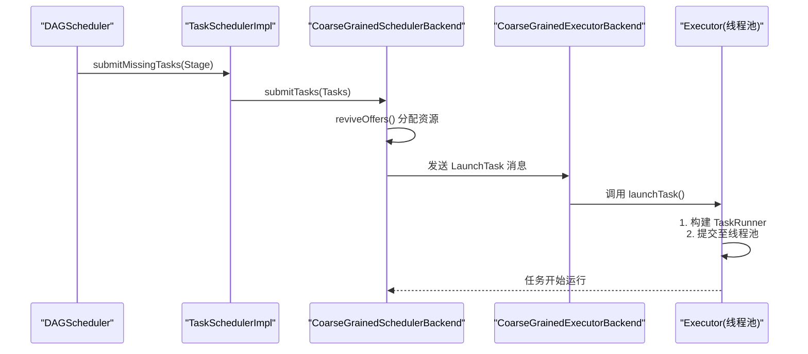
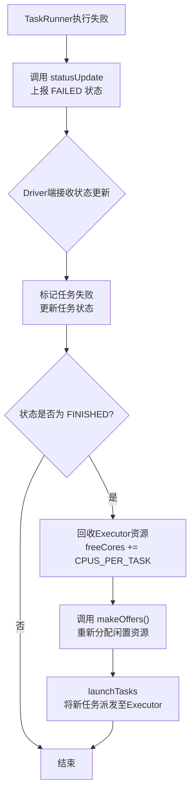

在现代大数据处理框架Spark中，Executor是执行具体计算任务的节点组件。理解Executor如何加载、执行和管理任务，对于掌握Spark运行原理、性能调优和故障排查至关重要。本节将深入剖析Executor内部的任务执行流程，包括任务加载、线程池管理、失败处理以及核心组件TaskRunner的运行内幕。

## 1. Executor 的任务加载流程

Executor是基于线程池的任务执行器，其核心职责是通过`launchTask()`方法加载并执行Driver下发的任务。

### 1.1 任务下发链路
任务并非凭空出现在Executor上，它经历了一个完整的调度与分发链路：
1.  **Stage划分**：DAGScheduler将Job划分为Stage，并通过`submitMissingTasks`方法分配任务。
2.  **任务调度**：TaskSchedulerImpl的`submitTasks`方法将任务加入调度池。
3.  **资源分配**：`CoarseGrainedSchedulerBackend`的`reviveOffers`方法为任务分配资源，指定运行的Executor。
4.  **任务派发**：资源分配后，`CoarseGrainedSchedulerBackend`向目标`CoarseGrainedExecutorBackend`发送`LaunchTask`消息。

### 1.2 Executor端任务接收与启动
当`CoarseGrainedExecutorBackend`接收到`LaunchTask`消息后，会调用其内部`Executor`对象的`launchTask`方法。该方法的核心操作是：
*   **封装任务**：将接收到的任务信息封装成一个`TaskRunner`对象。
*   **提交执行**：将`TaskRunner`对象放入线程池中运行。

至此，任务完成了从Driver到Executor的加载，开始进入执行阶段。



## 2. Executor 的任务线程池

### 2.1 使用线程池的必要性
Executor采用线程池机制来执行任务，主要基于以下两点关键原因：
1.  **降低开销**：Executor端处理的任务通常执行时间较短，但数量巨大。如果为每个任务都创建和销毁一个线程，会产生巨大的系统开销。线程池通过复用线程，显著减少了创建和销毁线程的成本。
2.  **避免资源耗尽**：海量任务如果每个都对应一个线程，会迅速耗尽系统内存，并导致CPU因频繁的线程上下文切换（“过度切换”）而效率低下。

### 2.2 线程池类型与任务提交
Executor内部使用的是`CachedThreadPool`（缓存线程池）。这种线程池的特点是：
*   **弹性伸缩**：当任务增多时，会自动创建新的线程来处理。
*   **资源回收**：当任务减少、线程空闲一段时间后，会自动回收线程，释放资源。

在`launchTask`方法中，新建的`TaskRunner`对象首先被注册到一个名为`runningTasks`的`ConcurrentHashMap`中进行管理，然后通过线程池的`execute()`方法提交执行。`execute()`方法最终会调用`TaskRunner`的`run()`方法，开始执行计算逻辑。

## 3. 任务执行失败处理机制

任务在执行过程中可能遭遇各种异常，如Shuffle数据获取失败、任务被主动杀死、没有HDFS写入权限等。Executor具备完善的失败上报与资源回收机制。

### 3.1 状态上报
在`TaskRunner`的`run()`方法中，通过`try-catch`块捕获执行异常。一旦发生异常，会调用`ExecutorBackend`（即`CoarseGrainedExecutorBackend`）的`statusUpdate`方法，向Driver端的`CoarseGrainedSchedulerBackend`汇报任务状态。

**`statusUpdate`方法核心逻辑：**
```scala
override def statusUpdate(taskId: Long, state: TaskState, data: ByteBuffer) {
  val msg = StatusUpdate(executorId, taskId, state, data)
  driver match {
    case Some(driverRef) => driverRef.send(msg) // 发送状态更新消息给Driver
    case None => logWarning(s"Drop $msg because has not yet connected to driver")
  }
}
```

### 3.2 状态枚举与驱动端处理
任务状态由`TaskState`枚举类定义，包括：
*   `LAUNCHING`（启动中）
*   `RUNNING`（运行中）
*   `FINISHED`（已完成）
*   `FAILED`（失败）
*   `KILLED`（被杀死）
*   `LOST`（丢失）

当`CoarseGrainedSchedulerBackend`收到`StatusUpdate`消息后：
1.  调用`TaskSchedulerImpl.statusUpdate()`更新任务状态。
2.  如果任务状态是`FINISHED`（包括`FAILED`，`KILLED`，`LOST`等终结状态），则进行**资源回收**：
    *   从`executorDataMap`中获取对应Executor的信息。
    *   将该Executor的可用CPU核数（`freeCores`）增加`CPUS_PER_TASK`（每个任务占用的CPU核数，可通过`spark.task.cpus`配置）。
3.  调用`makeOffers()`方法，将回收的闲置CPU资源重新分配给其他等待的任务。

**`makeOffers`方法核心流程（以Spark 2.2.0为例）：**
```scala
private def makeOffers(executorId: String) {
  // 1. 检查Executor是否存活
  if (executorIsAlive(executorId)) {
    val executorData = executorDataMap(executorId)
    val workOffers = IndexedSeq(
      new WorkerOffer(executorId, executorData.executorHost, executorData.freeCores)
    )
    
    // 2. 同步锁保护，防止分配资源时Executor被移除
    val taskDescs = CoarseGrainedSchedulerBackend.this.synchronized {
      if (workOffers.nonEmpty) {
        // 3. 调用调度器为任务分配资源
        scheduler.resourceOffers(workOffers)
      } else {
        Seq.empty
      }
    }
    
    // 4. 如果有任务获得资源，则发送到Executor执行
    if (!taskDescs.isEmpty) {
      launchTasks(taskDescs)
    }
  }
}
```
**流程图解失败处理与资源回收：**


## 4. 核心组件 TaskRunner 揭秘

`TaskRunner`是Executor中真正承载和执行任务的单元。它继承自`Runnable`接口，Driver下发的任务最终都在Executor中被封装成`TaskRunner`对象。

### 4.1 TaskRunner 的构成
其主要成员变量包括：
*   `execBackend: ExecutorBackend`: 用于与SchedulerBackend通信，报告状态。
*   `taskId: Long`: 任务ID，用于内存管理等。
*   `attemptNumber: Int`: 任务尝试执行的次数。
*   `serializedTask: ByteBuffer`: 序列化后的任务数据。
*   （Spark 2.2.0+）`taskDescription: TaskDescription`: 任务描述对象。

### 4.2 TaskRunner 的执行流程 (`run`方法)
当线程池执行`TaskRunner`时，会自动调用其`run()`方法，该方法按顺序完成以下关键步骤：

1.  **状态上报**：首先调用`execBackend.statusUpdate()`，通知Driver任务状态变为`RUNNING`。
2.  **任务反序列化**：使用反序列化工具，从`serializedTask`中还原出具体的`Task`对象（可能是`ResultTask`或`ShuffleMapTask`）以及任务依赖的Jar包。
3.  **执行计算**：调用反序列化得到的`Task`对象的`run()`方法，执行实际的计算逻辑。这里体现了**面向接口编程**的优势：无论具体是哪种Task，都统一通过`Task`接口调用，代码高度复用。
4.  **返回结果**：处理任务运行结果。根据结果大小有三种处理方式：

| 结果大小条件 | 处理方式 | 说明 |
| :--- | :--- | :--- |
| `resultSize > maxResultSize` (默认1GB) | 返回 `IndirectTaskResult` | 结果过大，只返回存储结果的BlockId |
| `resultSize > Akka帧大小` (默认128MB) | 返回 `IndirectTaskResult` | 结果超过网络传输帧限制 |
| `resultSize <= Akka帧大小` | 返回 `DirectTaskResult` | 默认方式，直接返回序列化结果 |

对于`IndirectTaskResult`，Driver端的SchedulerBackend需要通过BlockManager去获取存储在Executor端的实际结果数据。

## 总结与应用启示

通过以上分析，我们可以看到Executor的任务执行机制是一个高效、健壮且资源感知的复杂系统：
*   **资源高效利用**：通过线程池避免线程频繁创建销毁的开销，并通过`makeOffers`机制及时回收和再分配计算资源（CPU核）。
*   **状态驱动**：整个系统由`TaskState`驱动，通过`statusUpdate`进行心跳通信，使得Driver能够全局掌控任务执行状态，并做出调度决策。
*   **容错处理**：完善的状态上报和资源回收机制，确保单个任务的失败不会影响整体作业的进度，资源能够被快速重新利用。
*   **灵活的架构**：`TaskRunner`和`Task`接口的设计，使得不同计算阶段的任务（如`ShuffleMapTask`和`ResultTask`）可以共享同一套执行框架。

**实际应用场景**：
*   **调优**：理解线程池和`CPUS_PER_TASK`有助于调整任务并发度。例如，对于I/O密集型任务，可以适当增加`spark.task.cpus`并配合线程池大小，以提升吞吐。
*   **故障诊断**：当任务失败时，可以根据`TaskState`和状态更新链路，定位问题是出在计算逻辑、资源分配还是网络传输上。
*   **监控**：监控`runningTasks`的数目和线程池活动线程数，可以评估Executor的负载是否均衡，是否存在数据倾斜或资源不足的情况。