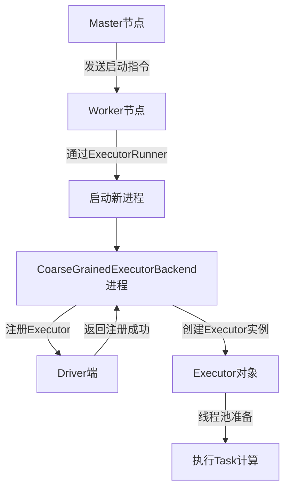
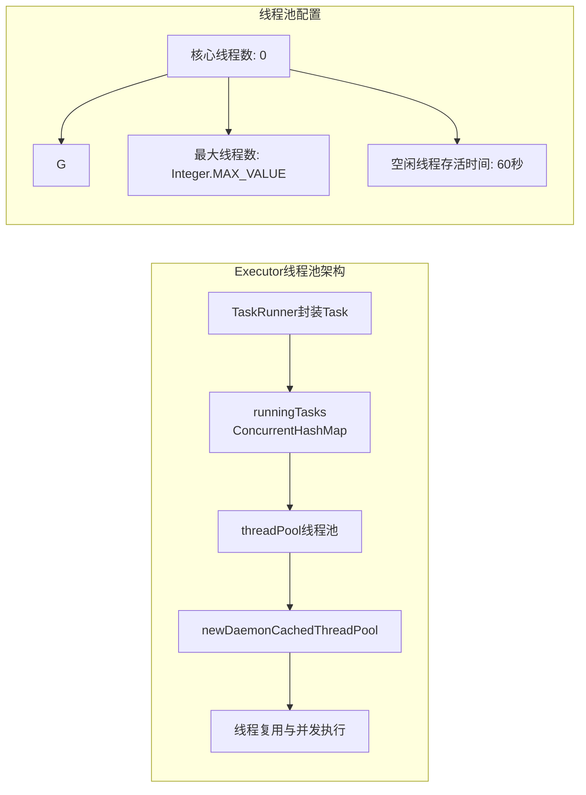
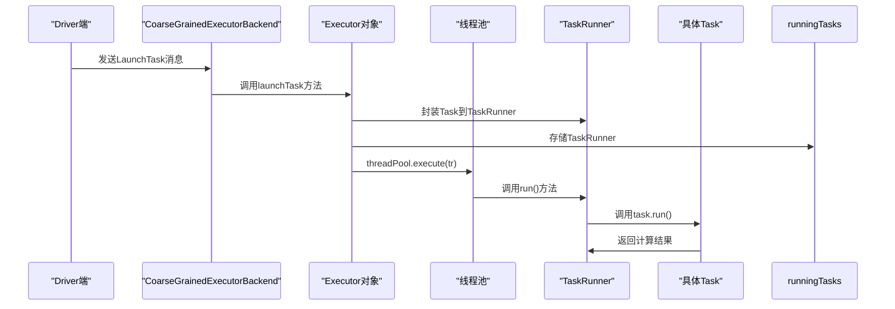

## 引言

在Spark分布式计算框架中，Executor是任务执行的核心组件，负责具体的数据处理和计算工作。理解Executor的启动、注册和工作原理对于深入掌握Spark内部机制至关重要。本文将深入剖析Executor的完整生命周期，从启动到任务执行的每一个环节，揭示Spark分布式计算背后的技术细节。

## 一、Executor的启动与注册流程

### 1.1 整体启动架构

在Standalone模式下，Executor的启动涉及多个组件的协同工作：



### 1.2 启动流程详解

#### 1.2.1 Master与Worker的协作

**Master侧职责**：
- 向Worker发送启动Executor的指令
- 管理集群资源和任务调度

**Worker侧职责**：
- 接收Master指令
- 通过`ExecutorRunner`启动新进程运行Executor
- 管理机器上的资源并向Master汇报

**为什么需要启动独立进程？**
1. **资源隔离**：Worker负责资源管理，不能直接用于计算
2. **容错性**：一个应用程序崩溃不会影响其他程序
3. **资源管理**：便于动态分配和回收计算资源

### 1.3 CoarseGrainedExecutorBackend的角色

`CoarseGrainedExecutorBackend`是Executor运行所在的进程，它本身不进行任务计算，而是作为通信桥梁：

```scala
private[spark] class CoarseGrainedExecutorBackend(
    override val rpcEnv: RpcEnv,
    driverUrl: String,
    executorId: String,
    hostname: String,
    cores: Int,
    userClassPath: Seq[URL],
    env: SparkEnv)
  extends ThreadSafeRpcEndpoint with ExecutorBackend with Logging {
```

**关键特性**：
- 继承自`ThreadSafeRpcEndpoint`，是一个消息通信体
- 可以发送消息给Driver，接收Driver指令
- 与Executor是一一对应关系

### 1.4 注册过程源码分析

#### 1.4.1 向Driver注册

`CoarseGrainedExecutorBackend`启动时通过`onStart()`方法向Driver注册：

```scala
override def onStart() {
  logInfo("Connecting to driver: " + driverUrl)
  rpcEnv.asyncSetupEndpointRefByURI(driverUrl).flatMap { ref =>
    driver = Some(ref)
    ref.ask[Boolean](RegisterExecutor(executorId, self, hostname,
      cores, extractLogUrls))
  }(ThreadUtils.sameThread).onComplete {
    case Success(msg) =>
      // 经常收到true，可忽略
    case Failure(e) =>
      exitExecutor(1, s"Cannot register with driver: $driverUrl", e,
        notifyDriver = false)
  }(ThreadUtils.sameThread)
}
```

#### 1.4.2 RegisterExecutor消息结构

```scala
case class RegisterExecutor(
  executorId: String,
  executorRef: RpcEndpointRef,
  hostname: String,
  cores: Int,
  logUrls: Map[String, String])
extends CoarseGrainedClusterMessage
```

**重要说明**：注册的实际上是`ExecutorBackend`实例，而不是真正工作的`Executor`对象。

## 二、Driver端的处理机制

### 2.1 Driver端关键Endpoint

在Driver进程中有两个至关重要的Endpoint：

| Endpoint名称 | 所在位置 | 主要职责 |
|-------------|---------|---------|
| `ClientEndpoint` | `StandaloneAppClient`内部成员 | 向Master注册当前应用程序 |
| `DriverEndpoint` | `CoarseGrainedSchedulerBackend`内部成员 | 程序运行时的驱动器，处理Executor注册 |

### 2.2 Executor注册数据结构

Driver端使用`executorDataMap`管理注册的Executor信息：

```scala
private val executorDataMap = new HashMap[String, ExecutorData]
```

`ExecutorData`数据结构定义：

```scala
private[cluster] class ExecutorData(
  val executorEndpoint: RpcEndpointRef,  // RpcEndpointRef，代理CoarseGrainedExecutorBackend
  val executorAddress: RpcAddress,
  override val executorHost: String,
  var freeCores: Int,                    // 可用核数
  override val totalCores: Int,          // 总核数
  override val logUrlMap: Map[String, String]
) extends ExecutorInfo(executorHost, totalCores, logUrlMap)
```

### 2.3 注册处理流程

#### 2.3.1 RegisterExecutor处理逻辑（Spark 2.1.1版本）

```scala
override def receiveAndReply(context: RpcCallContext): PartialFunction[Any, Unit] = {
  case RegisterExecutor(executorId, executorRef, hostname, cores, logUrls) =>
    // 检查是否重复注册
    if (executorDataMap.contains(executorId)) {
      executorRef.send(RegisterExecutorFailed("Duplicate executor ID: " + executorId))
      context.reply(true)
    } else {
      // 获取executor地址
      val executorAddress = if (executorRef.address != null) {
        executorRef.address
      } else {
        context.senderAddress
      }
      
      logInfo(s"Registered executor $executorRef ($executorAddress) with ID $executorId")
      
      // 更新数据结构
      addressToExecutorId(executorAddress) = executorId
      totalCoreCount.addAndGet(cores)
      totalRegisteredExecutors.addAndGet(1)
      
      // 创建ExecutorData对象
      val data = new ExecutorData(executorRef, executorRef.address, hostname,
        cores, cores, logUrls)
      
      // 同步代码块，保证并发安全
      CoarseGrainedSchedulerBackend.this.synchronized {
        executorDataMap.put(executorId, data)
        if (currentExecutorIdCounter < executorId.toInt) {
          currentExecutorIdCounter = executorId.toInt
        }
        if (numPendingExecutors > 0) {
          numPendingExecutors -= 1
          logDebug(s"Decremented number of pending executors ($numPendingExecutors left)")
        }
      }
      
      // 回复注册成功
      executorRef.send(RegisteredExecutor)
      context.reply(true)
      listenerBus.post(
        SparkListenerExecutorAdded(System.currentTimeMillis(), executorId, data))
      
      // 调用makeOffers，给Executor发送执行任务
      makeOffers()
    }
}
```

#### 2.3.2 Spark 2.2.0版本新增特性

在Spark 2.2.0中增加了黑名单节点检查：

```scala
} else if (scheduler.nodeBlacklist != null &&
    scheduler.nodeBlacklist.contains(hostname)) {
  // 如果集群管理器分配给我们一个Executor，而这个Executor在黑名单节点列表中
  logInfo(s"Rejecting $executorId as it has been blacklisted.")
  executorRef.send(RegisterExecutorFailed(s"Executor is blacklisted: $executorId"))
  context.reply(true)
```

### 2.4 关键数据结构

| 数据结构 | 类型 | 作用 |
|---------|------|------|
| `addressToExecutorId` | `HashMap[RpcAddress, String]` | RPC地址与ExecutorId的映射关系 |
| `totalCoreCount` | `AtomicInteger` | 集群中的总核数 |
| `totalRegisteredExecutors` | `AtomicInteger` | 当前注册的Executors总数 |

## 三、Executor实例化与初始化

### 3.1 Executor实例创建

当`CoarseGrainedExecutorBackend`收到`RegisteredExecutor`消息后，创建真正的Executor实例：

```scala
override def receive: PartialFunction[Any, Unit] = {
  case RegisteredExecutor =>
    logInfo("Successfully registered with driver")
    try {
      executor = new Executor(executorId, hostname, env, userClassPath, isLocal = false)
    } catch {
      case NonFatal(e) =>
        exitExecutor(1, "Unable to create executor due to " + e.getMessage, e)
    }
}
```

### 3.2 Executor类定义

**Spark 2.1.1版本**：
```scala
private[spark] class Executor(
  executorId: String,
  executorHostname: String,
  env: SparkEnv,
  userClassPath: Seq[URL] = Nil,
  isLocal: Boolean = false)
extends Logging {
```

**Spark 2.2.0版本新增特性**：
```scala
private[spark] class Executor(
  executorId: String,
  executorHostname: String,
  env: SparkEnv,
  userClassPath: Seq[URL] = Nil,
  isLocal: Boolean = false,
  uncaughtExceptionHandler: UncaughtExceptionHandler = SparkUncaughtExceptionHandler)
extends Logging {
```

**新增功能**：`UncaughtExceptionHandler`用于处理未捕获的异常，提高系统的健壮性。

## 四、Executor工作原理详解

### 4.1 线程池初始化

Executor在实例化时会创建线程池来准备Task计算：



#### 4.1.1 线程池创建源码

```scala
// 创建守护线程的缓存线程池
def newDaemonCachedThreadPool(prefix: String): ThreadPoolExecutor = {
  val threadFactory = namedThreadFactory(prefix)
  Executors.newCachedThreadPool(threadFactory).asInstanceOf[ThreadPoolExecutor]
}

// 命名线程工厂
def namedThreadFactory(prefix: String): ThreadFactory = {
  new ThreadFactoryBuilder()
    .setDaemon(true)
    .setNameFormat(prefix + "-%d")
    .build()
}

// JDK原生线程池创建
public static ExecutorService newCachedThreadPool(ThreadFactory threadFactory) {
  return new ThreadPoolExecutor(0, Integer.MAX_VALUE,
    60L, TimeUnit.SECONDS,
    new SynchronousQueue<Runnable>(),
    threadFactory);
}
```

**线程池特点**：
- 核心线程数：0
- 最大线程数：Integer.MAX_VALUE
- 空闲线程存活时间：60秒
- 使用`SynchronousQueue`作为工作队列
- 线程名前缀：`executorId-%d`

### 4.2 Task执行流程

#### 4.2.1 任务接收与分发

任务执行的整体流程：



#### 4.2.2 launchTask方法实现

```scala
def launchTask(context: ExecutorBackend, taskId: Long, 
               attemptNumber: Int, taskName: String, 
               serializedTask: ByteBuffer): Unit = {
  val tr = new TaskRunner(context, taskId, attemptNumber, taskName, serializedTask)
  runningTasks.put(taskId, tr)
  threadPool.execute(tr)
}
```

**关键数据结构**：
```scala
private val runningTasks = new ConcurrentHashMap[Long, TaskRunner]
```

#### 4.2.3 TaskRunner执行流程

**Spark 2.1.1版本**：
```scala
override def run(): Unit = {
  // ...
  var threwException = true
  val value = try {
    val res = task.run(
      taskAttemptId = taskId,
      attemptNumber = attemptNumber,
      metricsSystem = env.metricsSystem)
    threwException = false
    res
  } finally {
    val releasedLocks = env.blockManager.releaseAllLocksForTask(taskId)
    // ...
  }
}
```

**Spark 2.2.0版本调整**：
```scala
override def run(): Unit = {
  // ...
  val res = task.run(
    taskAttemptId = taskId,
    attemptNumber = taskDescription.attemptNumber,  // 参数名调整
    metricsSystem = env.metricsSystem)
  // ...
}
```

#### 4.2.4 Task.run方法调用链

```scala
final def run(
  taskAttemptId: Long,
  attemptNumber: Int,
  metricsSystem: MetricsSystem): T = {
  // ...
  try {
    runTask(context)  // 实际执行任务
  } catch {
    // 异常处理
  }
}
```

**Task类型**：
1. **ShuffleMapTask**：处理shuffle的map阶段任务
2. **ResultTask**：处理最终结果的任务

## 五、关键机制总结

### 5.1 通信机制

1. **RPC通信**：所有组件间通过RPC进行通信
2. **消息驱动**：基于消息的异步通信模式
3. **Endpoint抽象**：通过ThreadSafeRpcEndpoint实现消息处理

### 5.2 并发控制

1. **同步代码块**：使用`synchronized`关键字保证`executorDataMap`的并发安全
2. **线程安全集合**：使用`ConcurrentHashMap`管理运行中的任务
3. **原子操作**：使用`AtomicInteger`管理计数器的并发更新

### 5.3 资源管理

| 资源类型 | 管理方式 | 说明 |
|---------|---------|------|
| CPU核心 | `freeCores`变量 | 动态跟踪Executor可用核心数 |
| 内存 | BlockManager | 通过内存管理器统一管理 |
| 线程 | ThreadPoolExecutor | 线程池管理执行线程 |

### 5.4 容错机制

1. **任务重试**：`attemptNumber`支持任务重试
2. **异常处理**：新增`UncaughtExceptionHandler`处理未捕获异常
3. **黑名单机制**：Spark 2.2.0引入节点黑名单功能

## 六、实际应用场景分析

### 6.1 性能优化建议

1. **线程池调优**：
   - 根据任务特性调整线程池参数
   - 监控线程池使用情况，避免线程过多或过少

2. **资源分配策略**：
   ```scala
   // 合理设置Executor核心数
   spark.executor.cores = 4
   spark.executor.memory = 8g
   ```

3. **任务调度优化**：
   - 合理设置任务并行度
   - 避免小文件过多导致的调度开销

### 6.2 故障排查指南

| 问题现象 | 可能原因 | 排查方法 |
|---------|---------|---------|
| Executor注册失败 | 网络问题、重复ID | 检查网络连接，查看Driver日志 |
| Task执行超时 | 资源不足、数据倾斜 | 监控资源使用，分析数据分布 |
| Executor频繁重启 | 内存溢出、任务异常 | 调整内存配置，查看异常日志 |

### 6.3 监控指标

重要的监控指标包括：
- `totalRegisteredExecutors`：注册Executor总数
- `totalCoreCount`：总核心数
- `runningTasks.size()`：当前运行任务数
- 线程池活跃线程数

## 总结

Executor作为Spark计算的核心执行单元，其设计体现了分布式计算系统的多个重要原则：

1. **职责分离**：CoarseGrainedExecutorBackend负责通信，Executor负责计算
2. **资源隔离**：每个Executor运行在独立进程中，保证容错性
3. **并发高效**：通过线程池实现任务的高效并发执行
4. **通信可靠**：基于RPC的消息机制保证组件间可靠通信

理解Executor的完整生命周期和工作原理，有助于我们更好地优化Spark应用程序，诊断运行时问题，以及设计更高效的分布式计算架构。随着Spark版本的演进，Executor机制也在不断完善，如Spark 2.2.0中新增的异常处理和黑名单机制，进一步提高了系统的稳定性和可靠性。