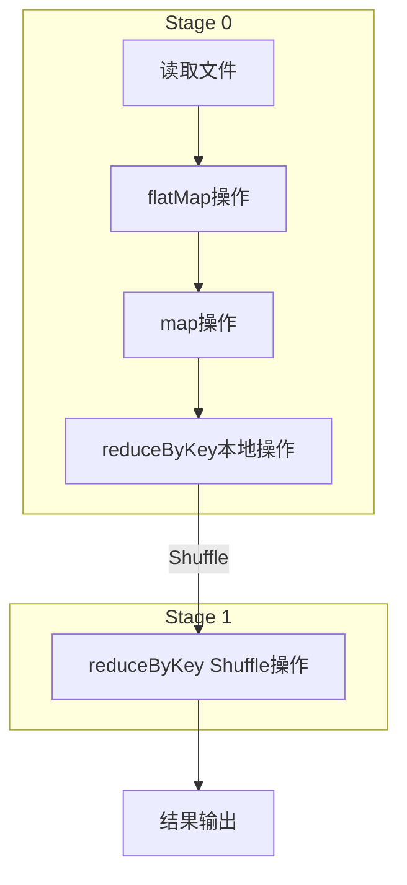
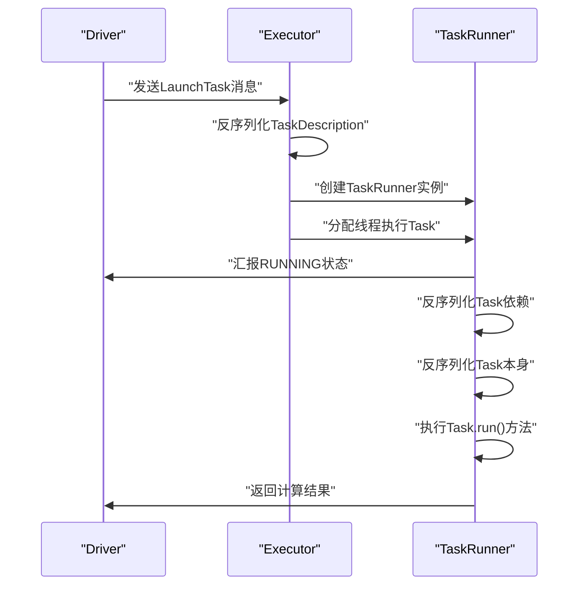
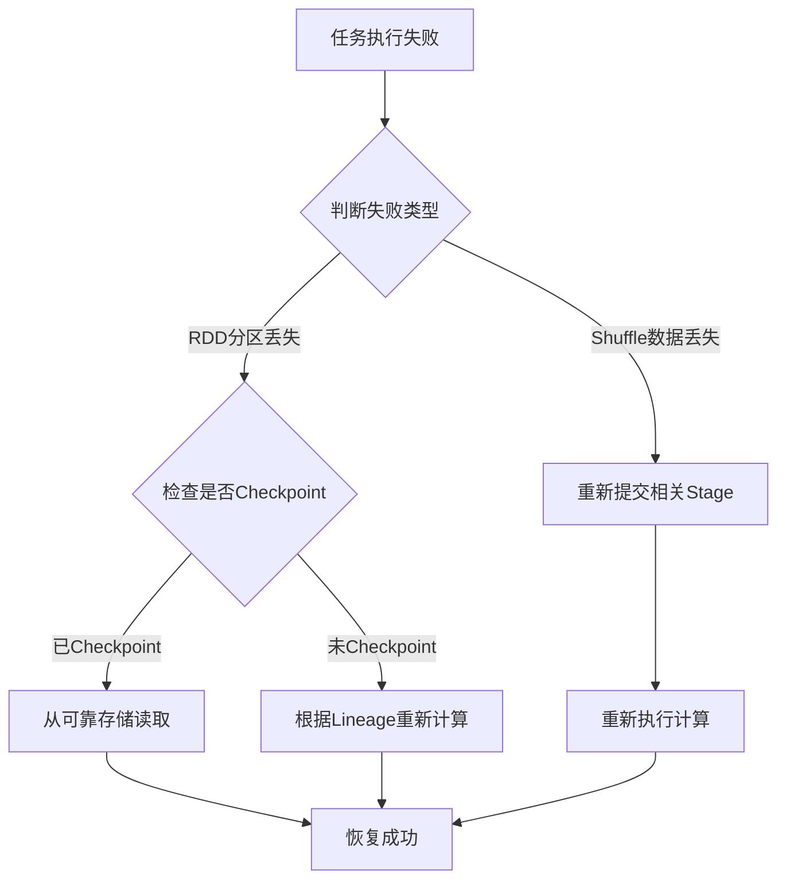

## 导语

在大数据处理领域，Spark以其卓越的性能和易用性成为业界标杆。理解Spark内部的**DAG调度机制**和**容错原理**，是掌握Spark性能调优和故障排查的关键。本文将深入剖析Spark如何通过DAG优化计算流程，以及RDD如何实现高效的容错机制。

## 一、DAG逻辑视图：Spark的计算优化引擎

### 1.1 DAG的基本概念

在Spark中，**有向无环图（DAG）** 是任务调度的核心数据结构。DAG将一个计算作业分解为一系列有依赖关系的任务，每个顶点代表一个任务，每条边代表任务间的依赖约束。



### 1.2 DAG生成机制

#### 1.2.1 Stage划分原理

Spark通过**Stage划分**来优化计算流程，划分依据是RDD的依赖关系：

| 依赖类型 | 特点 | Stage处理方式 |
|---------|------|--------------|
| **窄依赖** | 父RDD的每个分区最多被子RDD的一个分区使用 | 归并到同一个Stage |
| **宽依赖** | 父RDD的分区可能被子RDD的多个分区使用（需要Shuffle） | 在此处切断，形成新的Stage |

**Stage划分算法**（回溯算法）：
1. 初始时将所有RDD视为一个Stage
2. 从最后一个RDD开始向前回溯
3. 遇到**宽依赖**（Shuffle）时切断，形成新的Stage
4. 遇到**窄依赖**时，合并到当前Stage
5. 回溯完成后形成完整的DAG图

#### 1.2.2 源码实现

DAG生成的核心逻辑位于`DAGScheduler.scala`，关键方法`getOrCreateParentStages`：

```scala
private def getOrCreateParentStages(rdd: RDD[_], firstJobId: Int): List[Stage] = {
  getShuffleDependencies(rdd).map { shuffleDep =>
    getOrCreateShuffleMapStage(shuffleDep, firstJobId)
  }.toList
}

private[scheduler] def getShuffleDependencies(
  rdd: RDD[_]): HashSet[ShuffleDependency[_, _, _]] = {
  val parents = new HashSet[ShuffleDependency[_, _, _]]
  val visited = new HashSet[RDD[_]]
  val waitingForVisit = new Stack[RDD[_]]
  waitingForVisit.push(rdd)
  
  while (waitingForVisit.nonEmpty) {
    val toVisit = waitingForVisit.pop()
    if (!visited(toVisit)) {
      visited += toVisit
      toVisit.dependencies.foreach {
        case shuffleDep: ShuffleDependency[_, _, _] =>
          parents += shuffleDep
        case dependency =>
          waitingForVisit.push(dependency.rdd)
      }
    }
  }
  parents
}
```

### 1.3 WordCount案例的DAG生成分析

通过一个具体的WordCount示例，我们可以直观理解DAG的生成过程：

```scala
val conf = new SparkConf()
conf.setAppName("WordCount Example")
conf.setMaster("local")
val sc = new SparkContext(conf)

val lines = sc.textFile("data.txt", 1)
val words = lines.flatMap { line => line.split(" ") }
val pairs = words.map { word => (word, 1) }
val wordCounts = pairs.reduceByKey(_ + _)
wordCounts.collect().foreach(println)
sc.stop()
```

**DAG生成流程**：
1. **初始状态**：整个流程被视为一个Stage，包含5个RDD
2. **第一次回溯**：在ShuffleRDD与MapPartitionRDD（reduceByKey本地操作）之间发现Shuffle操作，在此切断形成两个Stage
3. **继续回溯**：MapPartitionRDD（reduceByKey本地操作）与MapPartitionRDD（map操作）之间是窄依赖，合并到同一个Stage
4. **最终结果**：形成两个Stage
   - **Stage 0**：文件读取 → flatMap → map → reduceByKey本地操作
   - **Stage 1**：reduceByKey Shuffle操作

## 二、RDD内部计算机制

### 2.1 Task类型与分配

Task是Spark计算的基本单位，负责处理RDD的一个Partition：

| Task类型 | 所处Stage位置 | 主要功能 |
|---------|--------------|---------|
| **ShuffleMapTask** | 非最后一个Stage | 计算结果通过Shuffle传递给下一个Stage |
| **ResultTask** | 最后一个Stage | 计算结果输出，计算结束 |

**Task分配原则**：Task数量 = Stage中最后一个RDD的Partition数量

### 2.2 计算过程深度解析

#### 2.2.1 Task执行流程



#### 2.2.2 关键源码分析

**Task启动过程**（Spark 2.2.0版本）：
```scala
// Executor.scala - launchTask方法
def launchTask(context: ExecutorBackend, taskDescription: TaskDescription): Unit = {
  val tr = new TaskRunner(context, taskDescription)
  runningTasks.put(taskDescription.taskId, tr)
  threadPool.execute(tr)
}
```

**Task执行核心逻辑**：
```scala
// TaskRunner的run方法
override def run(): Unit = {
  // 汇报运行状态
  execBackend.statusUpdate(taskId, TaskState.RUNNING, EMPTY_BYTE_BUFFER)
  
  // 准备依赖
  Executor.taskDeserializationProps.set(taskDescription.properties)
  updateDependencies(taskDescription.addedFiles, taskDescription.addedJars)
  
  // 反序列化Task
  task = ser.deserialize[Task[Any]](
    taskDescription.serializedTask, 
    Thread.currentThread.getContextClassLoader
  )
  
  // 执行Task
  val res: Any = task.run(
    taskAttemptId = taskId,
    attemptNumber = taskDescription.attemptNumber,
    metricsSystem = env.metricsSystem
  )
}
```

### 2.3 两种Task的具体实现

#### 2.3.1 ShuffleMapTask

ShuffleMapTask负责中间结果的Shuffle写入：

```scala
override def runTask(context: TaskContext): MapStatus = {
  // 反序列化RDD和依赖
  val (rdd, dep) = ser.deserialize[(RDD[_], ShuffleDependency[_, _, _])](
    ByteBuffer.wrap(taskBinary.value), 
    Thread.currentThread.getContextClassLoader
  )
  
  // 获取ShuffleWriter并写入结果
  val manager = SparkEnv.get.shuffleManager
  val writer = manager.getWriter[Any, Any](dep.shuffleHandle, partitionId, context)
  writer.write(rdd.iterator(partition, context).asInstanceOf[Iterator[_ <: Product2[Any, Any]]])
  
  writer.stop(success = true).get
}
```

#### 2.3.2 ResultTask

ResultTask负责最终结果的生成：

```scala
override def runTask(context: TaskContext): U = {
  // 反序列化RDD和处理函数
  val (rdd, func) = ser.deserialize[(RDD[T], (TaskContext, Iterator[T]) => U)](
    ByteBuffer.wrap(taskBinary.value), 
    Thread.currentThread.getContextClassLoader
  )
  
  // 执行计算函数
  func(context, rdd.iterator(partition, context))
}
```

### 2.4 RDD计算链的形成

RDD的计算通过**迭代器模式**实现，形成了高效的计算流水线：

```scala
// MapPartitionsRDD的compute方法
override def compute(split: Partition, context: TaskContext): Iterator[U] =
  f(context, split.index, firstParent[T].iterator(split, context))
```

**计算链原理**：
1. 每个RDD的`compute`方法接收父RDD的迭代器
2. 通过函数转换生成新的迭代器
3. 形成**惰性计算链**，直到遇到Action操作才触发实际计算

## 三、Spark RDD容错原理

### 3.1 容错的三大层面

Spark通过三个层面实现高效的容错机制：

| 容错层面 | 实现机制 | 主要作用 |
|---------|---------|---------|
| **调度层** | DAG调度器重新提交失败的Stage | 重新执行失败的计算任务 |
| **RDD血统层** | Lineage信息记录RDD的生成过程 | 通过重新计算恢复丢失的数据 |
| **Checkpoint层** | 将RDD持久化到可靠存储 | 切断过长的血统链，减少恢复成本 |

### 3.2 RDD容错四大核心要点

#### 3.2.1 依赖关系与容错

**窄依赖的容错优势**：
- 父RDD分区丢失时，只需重新计算该分区
- 恢复成本低，不需要全局重算
- 支持流水线优化

**宽依赖的容错挑战**：
- 父RDD分区丢失可能影响多个子RDD分区
- 可能需要重新Shuffle
- 恢复成本相对较高

#### 3.2.2 血统（Lineage）机制

每个RDD都记录了自己的**血统信息**：
- 父RDD的引用
- 生成该RDD的转换函数
- 分区信息

当某个RDD分区丢失时，Spark可以根据血统信息重新计算该分区。

#### 3.2.3 Checkpoint机制

对于血统链过长的RDD，Checkpoint提供了优化方案：

```scala
// 设置Checkpoint目录
sc.setCheckpointDir("hdfs://path/to/checkpoint")

// 对RDD进行Checkpoint
rdd.checkpoint()
rdd.count()  // Action操作触发实际Checkpoint
```

**Checkpoint vs 持久化**：
| 特性 | Checkpoint | 持久化（persist） |
|------|-----------|------------------|
| 存储位置 | 可靠存储（HDFS等） | 内存或磁盘 |
| 血统切断 | 是 | 否 |
| 恢复方式 | 直接读取 | 重新计算 |
| 主要用途 | 切断长血统链 | 重用中间结果 |

#### 3.2.4 任务重试与推测执行

**任务重试机制**：
- 失败的任务会被重新调度执行
- 默认重试次数为4次
- 可通过`spark.task.maxFailures`配置

**推测执行**：
- 针对慢任务启动备份任务
- 哪个任务先完成就采用哪个结果
- 避免单个慢任务拖慢整个作业

### 3.3 容错流程示例



## 四、性能优化实践建议

### 4.1 DAG优化策略

1. **减少Shuffle操作**
   - 尽量使用窄依赖转换
   - 合理使用`coalesce`替代`repartition`
   - 使用`broadcast`避免大表Join的Shuffle

2. **优化Stage划分**
   - 通过`cache()`或`persist()`重用中间结果
   - 合理设置并行度，避免过多小任务

### 4.2 容错优化建议

1. **合理使用Checkpoint**
   - 对血统链超过10个RDD的中间结果进行Checkpoint
   - 迭代算法中定期Checkpoint

2. **配置优化**
   ```scala
   // 调整重试策略
   conf.set("spark.task.maxFailures", "8")
   
   // 启用推测执行
   conf.set("spark.speculation", "true")
   conf.set("spark.speculation.multiplier", "1.5")
   ```

## 五、总结

Spark的**DAG调度机制**和**容错原理**是其高性能和高可靠性的基石：

1. **DAG调度**通过Stage划分优化计算流程，减少不必要的Shuffle和数据传输
2. **Task执行**通过迭代器模式形成计算流水线，实现高效的内存计算
3. **容错机制**基于RDD的血统信息，结合Checkpoint提供灵活的数据恢复策略
4. **性能优化**需要深入理解DAG生成原理和容错机制，针对具体场景进行调优

理解这些核心原理，能够帮助开发者编写更高效的Spark程序，并在生产环境中更好地进行故障排查和性能调优。

---
**补充说明**：本文基于Spark 2.x版本的分析，Spark 3.x在调度和容错方面有进一步优化，但核心原理保持一致。实际使用时请参考对应版本的官方文档。