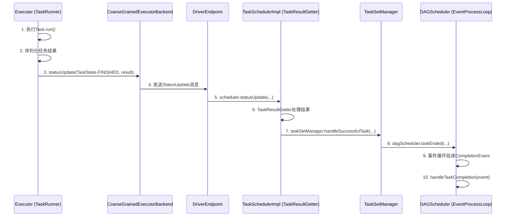

在Spark分布式计算框架中，任务的执行分布在多个Executor上，而其调度、状态跟踪和最终结果的收集则由位于Driver节点的核心组件统一管理。理解ShuffleMapTask和ResultTask这两种不同类型的任务如何将结果汇报给Driver，是掌握Spark内部运作原理的关键。

简单来说，可以将一个Spark Job的DAG（有向无环图）视为一个管道流水线。**ShuffleMapTask** 就像是流水线上的中间加工环节，它生产出的“半成品”（Map输出）需要经过Shuffle（类似传送带）传递给下一个环节。而 **ResultTask** 则是流水线的最后一道工序，负责产出最终的“成品”（如计算结果、保存到文件等）。Driver就是这个流水线的总控中心，它需要知道每个环节是否完成，以及产出的“半成品”存放在哪里，以便指导后续环节的工作。

## 一、Task类型定义

根据Task在Stage DAG中所处的位置，Spark将Task分为两类：

| 任务类型 | 所处Stage位置 | 作用 | 类比 |
| :--- | :--- | :--- | :--- |
| **ShuffleMapTask** | 非最后一个Stage（即中间Stage） | 计算结果不会直接输出，而是通过Shuffle传递给下一个Stage作为输入。 | 流水线的中间加工环节，产出半成品。 |
| **ResultTask** | DAG中的最后一个Stage | 计算结果需要进行最终输出（如`collect()`, `saveAsTextFile()`等操作），计算到此结束。 | 流水线的最终装配环节，产出成品。 |

**简单总结**：在一个Spark Job中，除了最后一个Stage的Task是ResultTask，其他所有Stage的Task都是ShuffleMapTask。

## 二、Task执行结果上报的通用流程

无论是ShuffleMapTask还是ResultTask，其执行结果上报给Driver的底层通信路径是相似的。下图概括了这一核心流程：



### 流程步骤详解：

1.  **Executor端执行与序列化**：
    *   Driver通过`CoarseGrainedSchedulerBackend`向Executor发送`LaunchTask`指令。
    *   Executor创建`TaskRunner`，在子线程中执行`Task.run()`方法。
    *   任务执行完毕后，结果被序列化。根据结果大小，分为三种处理策略（代码位于`Executor.scala`）：
        *   **> 1GB**：记录警告，结果过大被丢弃，仅返回元数据`IndirectTaskResult`。
        *   **128MB ~ 1GB**：将结果存入BlockManager，返回包含BlockId的`IndirectTaskResult`元数据。
        *   **< 128MB**：直接序列化结果，准备发回Driver。

2.  **结果上报至Driver**：
    *   `TaskRunner`调用`execBackend.statusUpdate(taskId, TaskState.FINISHED, serializedResult)`。
    *   `CoarseGrainedExecutorBackend`将`StatusUpdate`消息发送给Driver端的`DriverEndpoint`。

3.  **Driver端处理与传递**：
    *   `DriverEndpoint`收到消息后，调用`TaskSchedulerImpl.statusUpdate()`。
    *   `TaskSchedulerImpl`将成功任务的结果交由`TaskResultGetter`处理，最终调用`TaskSetManager.handleSuccessfulTask()`。
    *   `TaskSetManager`调用`DAGScheduler.taskEnded()`，该方法将`CompletionEvent`事件投递到DAGScheduler的事件处理循环`EventProcessLoop`中。
    *   事件循环线程处理`CompletionEvent`，触发`DAGScheduler.handleTaskCompletion(completion)`方法。**至此，两种Task的处理开始分道扬镳。**

## 三、ShuffleMapTask结果处理详解

`ShuffleMapTask`的核心产出是`MapStatus`，它包含了该Task输出的数据位置（哪个Executor的BlockManager）和每个分区的大小信息。Driver需要收集这些信息，以供后续的Shuffle读取阶段使用。

### 3.1 Executor端执行过程

`ShuffleMapTask.runTask()`的核心工作是调用ShuffleWriter将RDD分区的计算结果写入磁盘（或内存），并返回`MapStatus`。

```scala
// ShuffleMapTask.scala 简化逻辑
override def runTask(context: TaskContext): MapStatus = {
  // ... 反序列化得到RDD和ShuffleDependency
  val manager = SparkEnv.get.shuffleManager
  val writer = manager.getWriter[Any, Any](dep.shuffleHandle, partitionId, context)
  // 计算RDD分区并写入
  writer.write(rdd.iterator(partition, context).asInstanceOf[Iterator[_ <: Product2[Any, Any]]])
  // 停止writer，如果成功则返回MapStatus
  writer.stop(success = true).get
}
```

在`SortShuffleWriter.write()`方法中，最终会生成`MapStatus`对象，其中包含`BlockManagerId`和每个输出分区长度的数组。

### 3.2 Driver端处理逻辑

在`DAGScheduler.handleTaskCompletion()`方法中，对`ShuffleMapTask`的处理是关键：

```scala
// DAGScheduler.scala (基于源码逻辑整理)
private[scheduler] def handleTaskCompletion(event: CompletionEvent) {
  // ...
  event.reason match {
    case Success =>
      task match {
        case smt: ShuffleMapTask =>
          val shuffleStage = stage.asInstanceOf[ShuffleMapStage]
          val status = event.result.asInstanceOf[MapStatus] // 获取MapStatus
          val execId = status.location.executorId

          // 关键步骤：将MapStatus添加到对应的ShuffleMapStage中
          shuffleStage.addOutputLoc(smt.partitionId, status)

          // 如果该Stage所有分区都计算完成
          if (runningStages.contains(shuffleStage) && shuffleStage.pendingPartitions.isEmpty) {
            markStageAsFinished(shuffleStage)
            // 将本Stage所有Task的输出位置（MapStatus）注册到MapOutputTrackerMaster
            mapOutputTracker.registerMapOutputs(
              shuffleStage.shuffleDep.shuffleId,
              shuffleStage.outputLocInMapOutputTrackerFormat(),
              changeEpoch = true
            )
            // 清理缓存位置，并尝试提交后续的子Stage
            clearCacheLocs()
            submitWaitingChildStages(shuffleStage)
          }
        // ... ResultTask 处理分支
      }
  }
}
```

**核心要点**：
1.  **收集位置信息**：`shuffleStage.addOutputLoc`将每个分区对应的`MapStatus`（包含数据所在Executor和大小）记录到`ShuffleMapStage`中。
2.  **注册全局元数据**：当一个`ShuffleMapStage`的所有Task都完成后，通过`MapOutputTracker.registerMapOutputs`将本次Shuffle的所有输出位置信息注册到Driver的全局 tracker (`MapOutputTrackerMaster`) 中。后续的Shuffle读取阶段（如`ResultTask`）会向它查询数据位置。
3.  **触发后续Stage**：`submitWaitingChildStages(shuffleStage)`会检查并提交那些依赖于此Stage且所有父依赖都已完成的后续Stage。

**补充说明：版本差异**
在Spark 2.2.0+版本中，对`pendingPartitions`（记录未完成分区）的更新逻辑增加了更严格的检查（判断attemptId），以避免在异常情况下错误地更新状态，提高了容错性。

## 四、ResultTask结果处理详解

`ResultTask`是最终产出结果的Task，其结果就是最终用户需要的数据（如数组、写入文件的操作状态等）。

### 4.1 Executor端执行过程

`ResultTask.runTask()`相对直接：反序列化得到RDD和用户函数`func`，然后对RDD分区应用该函数得到最终结果。

```scala
// ResultTask.scala 简化逻辑
override def runTask(context: TaskContext): U = {
  // 反序列化得到RDD和最终处理函数func
  val (rdd, func) = ser.deserialize[(RDD[T], (TaskContext, Iterator[T]) => U)](...)
  // 应用func，得到最终结果
  func(context, rdd.iterator(partition, context))
}
```

### 4.2 Driver端处理逻辑

在`DAGScheduler.handleTaskCompletion()`中，对`ResultTask`的处理聚焦于作业的最终完成：

```scala
// DAGScheduler.scala (基于源码逻辑整理)
private[scheduler] def handleTaskCompletion(event: CompletionEvent) {
  // ...
  event.reason match {
    case Success =>
      task match {
        case rt: ResultTask[_, _] =>
          val resultStage = stage.asInstanceOf[ResultStage]
          resultStage.activeJob match {
            case Some(job) =>
              if (!job.finished(rt.outputId)) {
                updateAccumulators(event)
                job.finished(rt.outputId) = true
                job.numFinished += 1
                // 关键判断：如果作业的所有分区（Task）都完成了
                if (job.numFinished == job.numPartitions) {
                  markStageAsFinished(resultStage)
                  cleanupStateForJobAndIndependentStages(job) // 清理作业相关状态
                  // 发送作业成功的事件
                  listenerBus.post(SparkListenerJobEnd(job.jobId, clock.getTimeMillis(), JobSucceeded))
                }
                // 回调用户定义的JobListener（例如AsyncRDDActions中的）
                try {
                  job.listener.taskSucceeded(rt.outputId, event.result)
                } catch {
                  case e: Exception =>
                    job.listener.jobFailed(new SparkDriverExecutionException(e))
                }
              }
            case None =>
              logInfo("Ignoring result from " + rt + " because its job has finished")
          }
        // ... ShuffleMapTask 处理分支
      }
  }
}
```

**核心要点**：
1.  **作业完成判断**：Driver维护了作业（Job）的完成状态。每完成一个`ResultTask`，计数器`job.numFinished`增加。当所有`ResultTask`（即所有最终分区）都完成时，标志着**整个Spark Job执行成功**。
2.  **状态清理与通知**：作业完成后，Driver会清理该作业及其相关Stage在内存中的状态，并通过`listenerBus`发送`SparkListenerJobEnd`事件，这会被监听器捕获（例如Spark UI用于更新界面）。
3.  **用户回调**：最后，调用`job.listener.taskSucceeded`将每个分区的结果传递回去。对于像`collect()`这样的Action，这个监听器负责将各个分区的结果收集到Driver端并组合成最终结果。

## 五、总结与对比

| 方面 | ShuffleMapTask | ResultTask |
| :--- | :--- | :--- |
| **执行目的** | 生成中间Shuffle数据，供下游Stage使用。 | 生成最终结果，完成用户Action。 |
| **返回结果** | `MapStatus`对象，包含数据位置和大小。 | 用户定义函数的返回值，即最终数据。 |
| **Driver端处理核心** | 1. 收集`MapStatus`到`ShuffleMapStage`。<br>2. Stage完成后，向`MapOutputTracker`注册所有输出位置。<br>3. 触发后续子Stage的提交。 | 1. 累加作业完成计数器。<br>2. 所有Task完成后，标记作业成功，清理状态，发送事件。<br>3. 通过监听器将结果返回给用户程序。 |
| **依赖关系** | 其输出被`MapOutputTracker`管理，下游Stage的Task通过它定位输入数据。 | 依赖上游所有Stage（包括ShuffleMapStage）的完成，并获取其Shuffle后的数据。 |

通过上述分析可以看出，Driver通过`DAGScheduler`、`TaskSchedulerImpl`、`MapOutputTrackerMaster`等组件的协同工作，精细地管理着分布式集群中每一个Task的生命周期和产出，确保了数据依赖的正确性和计算流程的有序推进，最终将分散的计算结果汇总或输出，完成用户的计算任务。