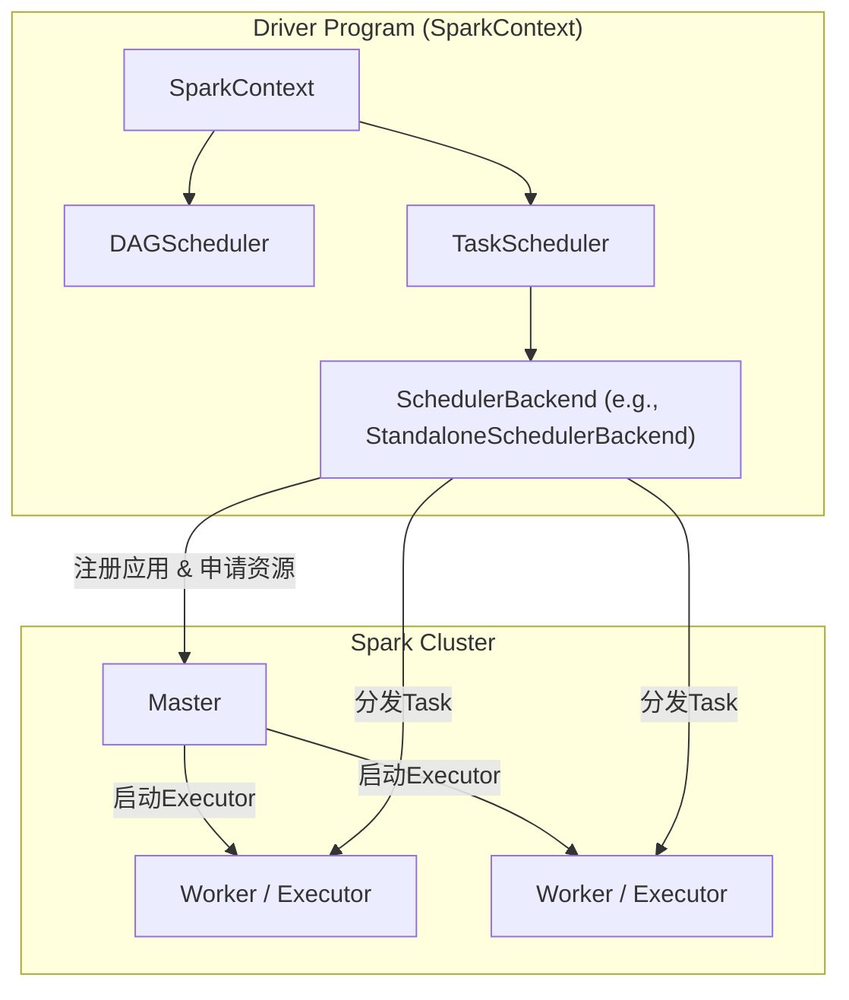
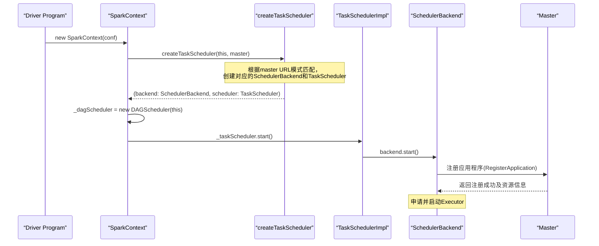

## 引言
在Spark的世界里，如果说分布式计算是一场交响乐，那么`SparkContext`就是这场演出的总指挥。它是整个Spark应用程序的起点和终点，是连接开发者与Spark集群的唯一桥梁。理解`SparkContext`的内部机制，对于掌握Spark运行原理、进行性能调优和解决复杂问题至关重要。本文将深入剖析`SparkContext`的职责、核心组件及其在Spark应用程序生命周期中的关键作用。

## 一、SparkContext与Driver Program

### 1.1 核心角色定义
*   **SparkContext**: 是通往Spark集群的唯一入口，负责初始化应用程序运行环境、与集群通信、资源申请、任务分配与监控等核心功能。它是整个Application运行调度的核心（非资源调度）。
*   **Driver Program**: 指的是包含`main`函数并创建`SparkContext`实例的程序。通常，`SparkContext`的实例（`sc`）就代表了驱动程序（Driver）。

### 1.2 核心职责总览
`SparkContext`在Spark应用程序中扮演着至关重要的角色，其核心职责包括：
1.  **创建核心数据结构**：用于在集群中创建RDDs、累加器（Accumulators）和广播变量（Broadcast Variables）。
2.  **初始化核心调度组件**：包括高层调度器（DAGScheduler）、底层调度器（TaskScheduler）和调度器后端（SchedulerBackend）。
3.  **程序注册与资源管理**：负责Spark程序向Master注册，并通过`SchedulerBackend`管理集群为当前Application分配的计算资源（Executor）。
4.  **作业生命周期管理**：当RDD的action触发作业（Job）后，`SparkContext`会协调`DAGScheduler`将Job划分为多个Stage，并由`TaskScheduler`调度Task执行。
5.  **程序终结**：当所有任务执行完毕或程序结束时，`SparkContext`负责关闭自身，此时整个Spark程序也随之结束。

> **类比理解**：如果将Spark Application比作一辆汽车，那么`SparkContext`就是引擎，而`SparkConf`则是关于引擎的配置参数。

> **重要限制**：在一个JVM进程中，同一时间只能有一个`SparkContext`实例运行。创建新的`SparkContext`前，必须调用`stop()`方法停止当前的实例。

## 二、SparkContext核心架构

`SparkContext`在实例化过程中，会构建并启动三大核心调度组件，它们共同协作，驱动整个Spark作业的执行。



**图：SparkContext核心组件与集群交互图**

### 2.1 三大核心组件详解
| 组件 | 角色 | 主要职责 | 典型实现（Standalone模式） |
| :--- | :--- | :--- | :--- |
| **DAGScheduler** | 高层调度器 | 面向Job，负责将Job根据RDD的依赖关系（宽窄依赖）划分成多个Stage（DAG图），并提交Stage给TaskScheduler。 | `DAGScheduler` |
| **TaskScheduler** | 底层调度器 | 接口，负责接收来自DAGScheduler的TaskSet（一组Task），并将其提交到集群上运行。管理任务的生命周期（提交、执行、重试等）。 | `TaskSchedulerImpl` |
| **SchedulerBackend** | 调度器后端 | 接口，负责与具体的集群资源管理器（Cluster Manager）通信，为应用程序申请资源（Executor），并管理这些资源。 | `StandaloneSchedulerBackend` |

### 2.2 StandaloneSchedulerBackend的三大功能
在Standalone集群模式下，`StandaloneSchedulerBackend`承担着至关重要的桥梁作用：
1.  **连接与注册**：负责与Master连接，注册当前应用程序（`RegisterWithMaster`）。
2.  **资源管理**：接收集群中为当前应用程序分配的Executor的注册，并管理这些Executors的生命周期。
3.  **任务分发**：负责将具体的Task发送到对应的Executor上执行。

## 三、源码级启动流程剖析

下面我们通过一个经典的WordCount示例，并结合源码，追踪`SparkContext`的启动过程。

### 3.1 应用程序入口示例
```scala
import org.apache.spark.{SparkConf, SparkContext}

object WordCount {
  def main(args: Array[String]): Unit = {
    // 1. 创建SparkConf，配置应用参数
    val conf = new SparkConf()
      .setAppName("WordCountDemo")
      .setMaster("local[*]") // 本地模式，使用所有核心

    // 2. 创建SparkContext（天堂之门开启）
    val sc = new SparkContext(conf)

    // 3. 业务逻辑：创建RDD，进行转换和行动操作
    val lines = sc.textFile("data/input.txt")
    val wordCounts = lines
      .flatMap(_.split(" "))
      .map(word => (word, 1))
      .reduceByKey(_ + _)

    wordCounts.saveAsTextFile("data/output")

    // 4. 关闭SparkContext（天堂之门关闭）
    sc.stop()
  }
}
```

### 3.2 SparkContext初始化核心步骤

`SparkContext`主构造函数的执行是其初始化的核心，流程如下：



**步骤分解与源码解析：**

1.  **调用`createTaskScheduler`方法**：
    此方法是**策略模式**的典型应用，根据传入的`master`字符串（如`"local[*]"`, `"spark://host:7077"`）创建不同的`SchedulerBackend`和`TaskScheduler`组合。
    ```scala
    // SparkContext.scala 片段 (简化)
    private def createTaskScheduler(sc: SparkContext, master: String): (SchedulerBackend, TaskScheduler) = {
      master match {
        case "local" =>
          val scheduler = new TaskSchedulerImpl(sc, ...)
          val backend = new LocalSchedulerBackend(...)
          scheduler.initialize(backend)
          (backend, scheduler)
        case SPARK_REGEX(sparkUrl) => // 匹配 spark://
          val scheduler = new TaskSchedulerImpl(sc)
          val masterUrls = sparkUrl.split(",").map("spark://" + _)
          // 生产环境常用：创建Standalone集群后端
          val backend = new StandaloneSchedulerBackend(scheduler, sc, masterUrls)
          scheduler.initialize(backend)
          (backend, scheduler)
        // ... 其他模式（如YARN, Mesos）的处理
      }
    }
    ```

2.  **创建DAGScheduler**：使用上一步返回的`TaskScheduler`实例和`SparkContext`自身来创建`DAGScheduler`。

3.  **启动TaskScheduler**：调用`taskScheduler.start()`。这实际上是调用`TaskSchedulerImpl.start()`。
    *   该方法内部会调用`backend.start()`，即启动`StandaloneSchedulerBackend`。
    *   `StandaloneSchedulerBackend.start()`会创建一个`StandaloneAppClient`，并通过其`ClientEndpoint`向Master发送`RegisterApplication`消息进行应用注册。

4.  **应用注册与资源分配**：
    *   Master收到注册消息后，将应用信息持久化，并回复`RegisteredApplication`。
    *   随后Master调用`schedule()`方法，开始为应用调度资源，向Worker节点发送指令启动`CoarseGrainedExecutorBackend`进程。
    *   `CoarseGrainedExecutorBackend`在启动后，会与Driver端的`SchedulerBackend`建立RPC连接，注册并创建真正的`Executor`实例，准备执行任务。

### 3.3 调度模式（Scheduling Mode）
`TaskSchedulerImpl`在初始化时会根据配置确定资源调度池的模式。
*   **配置项**：`spark.scheduler.mode`
*   **可选值**：
    *   `FIFO`（默认）：先进先出。所有作业按提交顺序排队，前面的作业优先获得所有资源。
    *   `FAIR`：公平调度。作业在可配置的调度池（Pool）中共享资源，支持权重、最小资源保障等。
*   **源码体现**：初始化时会创建`rootPool`，并根据模式选择`FIFOSchedulableBuilder`或`FairSchedulableBuilder`来构建调度池。

## 四、总结与核心比喻

`SparkContext`贯穿了Spark应用程序的整个生命周期，我们可以用“天堂之门”的比喻来概括其核心地位：

1.  **开启天堂之门**：Spark程序只有通过`SparkContext`才能发布到Spark集群。它完成了从程序代码到分布式计算任务的“翻译”和“提交”工作。
2.  **导演天堂世界**：Spark程序运行时的所有调度指挥（DAG划分、Task调度、故障重试、数据 shuffle 协调）都是以`SparkContext`为核心进行的。它是整个分布式计算过程的“总导演”。
3.  **关闭天堂之门**：`SparkContext`崩溃或主动调用`stop()`方法结束之时，也就是整个Spark程序生命周期的终点。它会确保所有资源被释放，连接被关闭。

**补充说明**：在实际开发中，Spark SQL、Spark Streaming等高层API会在底层创建或复用`SparkContext`（如`SparkSession`封装了`SparkContext`），但其核心引擎的地位从未改变。深入理解`SparkContext`，是掌握Spark内核、进行高效开发和运维的基石。