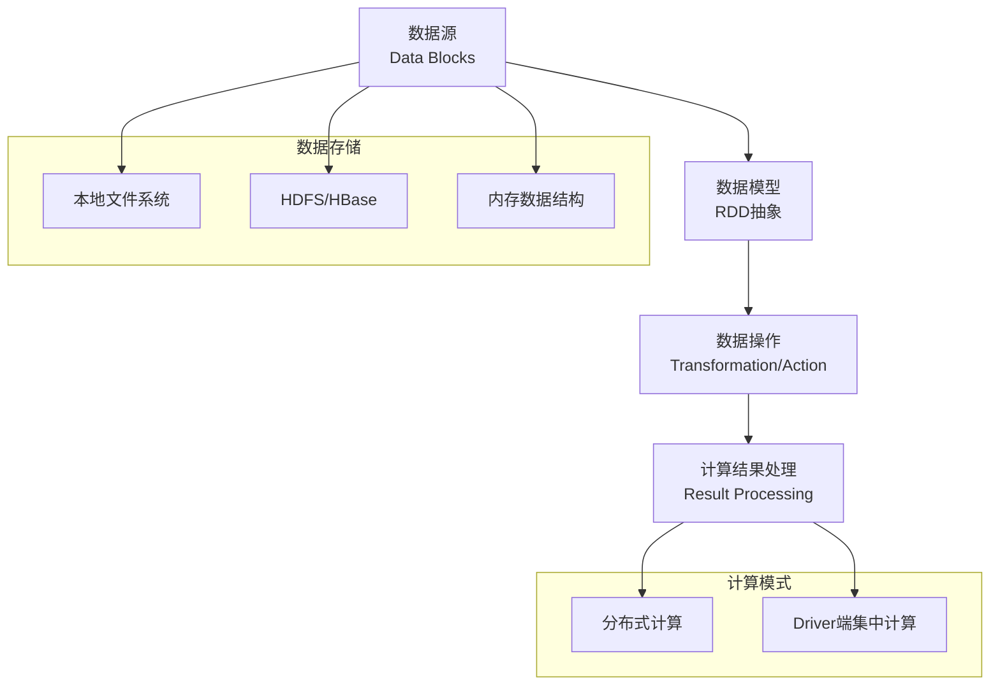
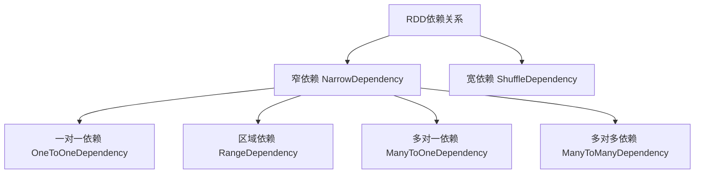
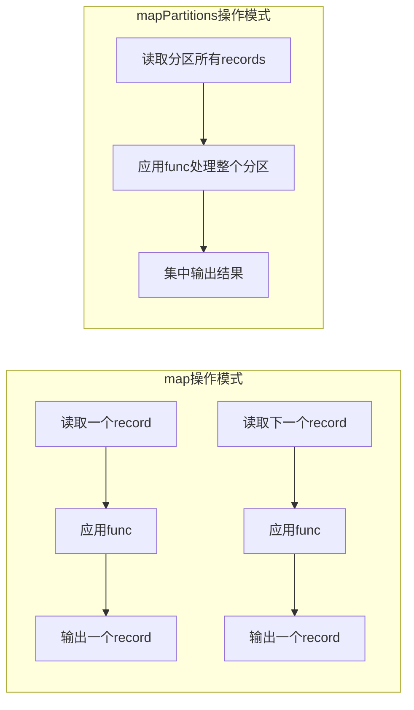

## 引言

Apache Spark作为现代大数据处理的核心引擎，其强大的分布式计算能力源于其独特的**弹性分布式数据集（RDD）** 抽象和高效的**逻辑处理流程**。理解Spark如何将应用程序转化为逻辑执行计划，是深入掌握Spark内部机制、进行性能调优和应用开发的关键。本章将详细解析Spark逻辑处理流程的构成、生成机制和数据依赖关系，为你揭开Spark高效处理大数据的秘密。

## 一、Spark逻辑处理流程概览

Spark在执行应用程序前，首先需要将应用程序转化为**逻辑处理流程（Logical Plan）**。这个流程描述了从数据源到最终结果的完整数据处理路径，包括数据转换、依赖关系和计算逻辑。

### 1.1 逻辑处理流程的四个核心组件



#### （1）数据源（Data Blocks）

数据源表示原始数据的存储位置，支持多种存储系统：

- **本地文件系统**：适用于单机测试和小规模数据处理
- **分布式文件系统**：
  - HDFS（Hadoop Distributed File System）
  - 分布式Key-Value数据库（如HBase）
- **内存数据结构**：在IntelliJ IDEA等开发环境中进行单机测试时使用，如`List(1, 2, 3, 4, 5)`
- **网络流**：适用于流式处理场景（本章主要讨论批处理）

> **注意**：本章主要讨论**批处理（Batch Processing）**，因此数据源限定为静态数据。

#### （2）数据模型：RDD抽象

Spark将输入数据、中间数据和输出数据统一抽象为**弹性分布式数据集（Resilient Distributed Datasets，RDD）**。

**RDD与传统数据模型的对比：**

| 特性 | 传统面向对象程序 | Hadoop MapReduce | Spark RDD |
|------|----------------|-----------------|-----------|
| 数据抽象 | 对象（Object） | `<K, V>` Record | RDD |
| 操作方式 | 对象方法调用 | 固定的map/reduce函数 | Transformation/Action操作 |
| 粒度控制 | 细粒度，可修改单个元素 | 粗粒度，record级别 | 不可变的数据集合 |
| 存储特性 | 常驻内存 | 中间结果写入磁盘 | 计算时产生，计算后消失 |

**RDD的核心特性：**

1. **逻辑概念**：RDD在内存中不会真正分配存储空间（除非显式缓存），数据只在计算过程中产生
2. **分区特性**：RDD可以包含多个数据分区，不同分区可以由不同的任务在不同节点上并行处理
3. **不可变性**：RDD一旦创建就不能被修改，所有转换操作都会生成新的RDD

#### （3）数据操作：Transformation和Action

Spark将数据操作分为两种类型：

| 操作类型 | 特点 | 示例 | 返回值 |
|----------|------|------|--------|
| **Transformation** | 惰性操作，不立即执行 | `rdd2 = rdd1.map(func)` | 新的RDD |
| **Action** | 触发实际计算 | `rdd1.count()` | 非RDD类型的结果 |

**Transformation操作的特点：**
- 单向操作，生成新的RDD而不修改原始RDD
- 支持链式调用，形成数据处理流水线
- 常见的Transformation包括：`map()`、`filter()`、`reduceByKey()`、`join()`等

**Action操作的特点：**
- 触发Spark提交Job并开始实际计算
- 对计算结果进行后处理，产生最终输出
- 常见的Action包括：`count()`、`collect()`、`save()`等

#### （4）计算结果处理

根据计算需求的不同，Spark支持两种结果处理方式：

1. **分布式存储**：直接将计算结果保存到分布式文件系统
   ```scala
   rdd.save("hdfs://file_location")
   ```
   这种方式不需要Driver端进行集中计算。

2. **Driver端集中计算**：将计算结果汇集到Driver节点进行最终处理
   ```scala
   val result = rdd.collect()  // 将所有元素汇集到Driver
   val count = rdd.count()     // 统计元素个数（先在各个分区统计，再到Driver汇总）
   ```

## 二、逻辑处理流程生成机制

Spark需要将用户编写的应用程序自动转化为确定性的逻辑处理流程，这需要解决三个核心问题：

### 2.1 RDD生成机制

#### 问题：如何根据应用程序产生RDD？产生什么样的RDD？

**简单场景：一元操作**
对于简单的Transformation操作，如`map()`、`filter()`，每个操作生成一个新的RDD：
```scala
val rdd2 = rdd1.map(func)  // 生成一个MapPartitionsRDD
```

**复杂场景：多步操作**
对于复杂的Transformation操作，如`join()`、`distinct()`，一个操作可能生成多个RDD：
```scala
val rdd3 = rdd1.join(rdd2)
// 实际执行过程可能生成多个中间RDD：
// 1. 对rdd1和rdd2进行预处理
// 2. 执行笛卡尔积操作
// 3. 生成最终结果
// Spark将这些RDD串联，只返回最后一个给用户
```

**RDD类型多样性**
Spark支持多种RDD类型，每种类型对应不同的数据来源和计算逻辑：

| RDD类型 | 用途 | 示例 |
|---------|------|------|
| ParallelCollectionRDD | 并行化集合 | `sc.parallelize(List(1,2,3))` |
| MapPartitionsRDD | 分区级别的map操作 | `rdd.map(func)` |
| ShuffledRDD | 需要Shuffle的操作 | `rdd.reduceByKey(func)` |
| CoGroupedRDD | 多RDD的cogroup操作 | `rdd1.cogroup(rdd2)` |

### 2.2 RDD数据依赖关系建立

建立RDD之间的数据依赖关系需要解决三个子问题：

#### （1）RDD级依赖关系
- **一元操作**：`rdd2 = rdd1.transformation()` → `rdd1 => rdd2`
- **二元操作**：`rdd3 = rdd1.join(rdd2)` → `(rdd1, rdd2) => rdd3`

#### （2）分区个数确定
新生成的RDD分区个数由以下因素决定：
- **用户指定**：部分操作允许用户指定分区数
- **继承父RDD**：如`map()`操作，分区数与父RDD相同
- **取最大值**：如`join()`操作，默认取父RDD分区数的最大值

#### （3）分区间依赖关系
这是最复杂的问题，Spark通过**依赖分类**来解决：



##### 窄依赖（NarrowDependency）
**定义**：子RDD的每个分区只依赖父RDD的少量分区

**类型细分：**
1. **一对一依赖（OneToOneDependency）**
   - 子RDD和父RDD分区一一对应
   - 典型操作：`map()`、`filter()`
   - 特点：允许流水线执行，无需Shuffle

2. **区域依赖（RangeDependency）**
   - 分区经过区域化后一一对应
   - 典型操作：`union()`

3. **多对一依赖（ManyToOneDependency）**
   - 子RDD的一个分区依赖多个父RDD的分区
   - 典型操作：具有特殊性质的`cogroup()`、`join()`

4. **多对多依赖（ManyToManyDependency）**
   - 子RDD分区依赖多个父RDD分区，父RDD分区被多个子RDD分区依赖
   - 典型操作：`cartesian()`

##### 宽依赖（ShuffleDependency）
**定义**：子RDD的每个分区依赖父RDD的所有分区的一部分数据

**特点：**
- 需要Shuffle操作，数据需要在节点间重新分布
- 用红色箭头在图中表示（窄依赖用黑色箭头）
- 典型操作：`reduceByKey()`、`groupByKey()`

**窄依赖 vs 宽依赖的关键区别：**
- 窄依赖：父RDD分区的数据**全部**流入子RDD的一个或多个分区
- 宽依赖：父RDD分区的数据被**拆分**流入子RDD的不同分区

**依赖分类的意义：**
1. **执行优化**：窄依赖支持流水线执行，宽依赖需要Shuffle
2. **容错恢复**：窄依赖的恢复更简单，只需重新计算父RDD的少量分区
3. **调度优化**：窄依赖的任务可以在同一阶段执行

### 2.3 数据分区方法（Partitioner）

Spark支持三种主要的数据分区方法：

| 分区方法 | 原理 | 适用场景 | 示例 |
|----------|------|----------|------|
| **水平划分** | 按照record索引划分 | 输入数据划分 | `sc.parallelize(list, 3)` |
| **Hash划分** | 使用record的Hash值 | Shuffle阶段 | `rdd.partitionBy(new HashPartitioner(10))` |
| **Range划分** | 按照元素大小关系划分 | 排序任务 | `rdd.partitionBy(new RangePartitioner(10, rdd))` |

**详细说明：**

1. **水平划分（Horizontal Partitioning）**
   - 按元素下标顺序划分
   - 常用于输入数据的初始划分
   - HDFS默认按128MB为单位划分数据块

2. **Hash划分（HashPartitioner）**
   - 根据元素的Hash值确定分区
   - 保证相同key的元素进入同一分区
   - 分区公式：`partition = key.hashCode() % numPartitions`

3. **Range划分（RangePartitioner）**
   - 适用于排序任务
   - 需要提前确定数据范围边界
   - 使用抽样方法估算边界，避免全量统计

### 2.4 RDD数据计算机制

确定了数据依赖关系后，Spark需要计算RDD中每个分区的数据。计算方式取决于Transformation的操作语义：

#### 两种计算模式对比



**1. map(func)的计算逻辑**
- 逐个处理分区中的每个元素
- 每处理一个元素就输出一个结果
- 类似数学中的映射函数

**示例代码：**
```scala
// rdd1的分区数据: [1, 2, 3, 4, 5]
val rdd2 = rdd1.map(x => x * 2)
// 计算过程:
// 读取1 -> 计算1*2=2 -> 输出2
// 读取2 -> 计算2*2=4 -> 输出4
// ...
// 最终结果: [2, 4, 6, 8, 10]
```

**2. mapPartitions(func)的计算逻辑**
- 一次性处理整个分区的所有数据
- 可以对分区数据进行多次操作后再输出
- 更接近Hadoop MapReduce的map()+cleanup()模式

**示例代码：**
```scala
// rdd1的分区数据: [1, 2, 3, 4, 5]
val rdd2 = rdd1.mapPartitions(iter => {
  // 处理整个分区
  val list = iter.toList
  val sum = list.sum
  val avg = sum / list.length
  
  // 输出统计结果
  List(avg).iterator
})
// 计算过程:
// 读取整个分区数据 -> 计算总和 -> 计算平均值 -> 输出平均值
// 最终结果: [3] (平均值)
```

**两种模式的选择：**
- `map()`：适合简单的元素级转换，内存消耗小
- `mapPartitions()`：适合需要访问整个分区数据的复杂操作，如数据库连接、文件写入等

## 三、实际应用与性能调优建议

### 3.1 理解Transformation的语义

开发Spark应用时，理解每个Transformation操作的语义至关重要：

1. **操作复杂度**：简单操作（如`map()`）生成一个RDD，复杂操作（如`join()`）可能生成多个RDD
2. **数据依赖**：窄依赖操作支持流水线执行，宽依赖操作需要Shuffle
3. **分区影响**：操作可能改变分区数和数据分布

### 3.2 性能调优关键点

1. **尽量减少Shuffle操作**
   - 宽依赖（ShuffleDependency）是性能瓶颈
   - 尝试使用窄依赖的替代方案
   - 如：使用`reduceByKey()`替代`groupByKey().mapValues()`

2. **合理设置分区数**
   - 分区太少：无法充分利用集群资源
   - 分区太多：任务调度开销大
   - 经验值：每个CPU核心2-3个任务

3. **选择合适的数据分区方法**
   - 数据倾斜时考虑使用RangePartitioner
   - Join操作前确保两个RDD使用相同的Partitioner

### 3.3 开发最佳实践

1. **链式操作优化**
   ```scala
   // 不推荐：多次Shuffle
   rdd.groupByKey().mapValues(_.sum)
   
   // 推荐：一次Shuffle
   rdd.reduceByKey(_ + _)
   ```

2. **合理使用缓存**
   ```scala
   // 多次使用的RDD应该缓存
   val processedRDD = rdd.map(...).filter(...).cache()
   
   // 第一次Action触发计算并缓存
   val count1 = processedRDD.count()
   
   // 第二次Action直接使用缓存
   val count2 = processedRDD.filter(...).count()
   ```

3. **避免Driver端数据倾斜**
   ```scala
   // 危险：可能将大量数据拉到Driver
   val data = rdd.collect()
   
   // 安全：使用take或采样
   val sample = rdd.take(1000)
   ```

## 总结

Spark的逻辑处理流程是其高效执行分布式计算的核心机制。通过理解：

1. **RDD的抽象模型**：不可变、分区的数据集合
2. **依赖关系分类**：窄依赖支持流水线，宽依赖需要Shuffle
3. **数据分区策略**：水平、Hash、Range三种划分方法
4. **计算执行模式**：`map()`和`mapPartitions()`的不同处理方式

开发者可以更好地编写高效的Spark应用程序，进行有效的性能调优，并深入理解Spark的内部工作原理。这些知识不仅是使用Spark的基础，也是解决大数据处理中各种复杂问题的关键。