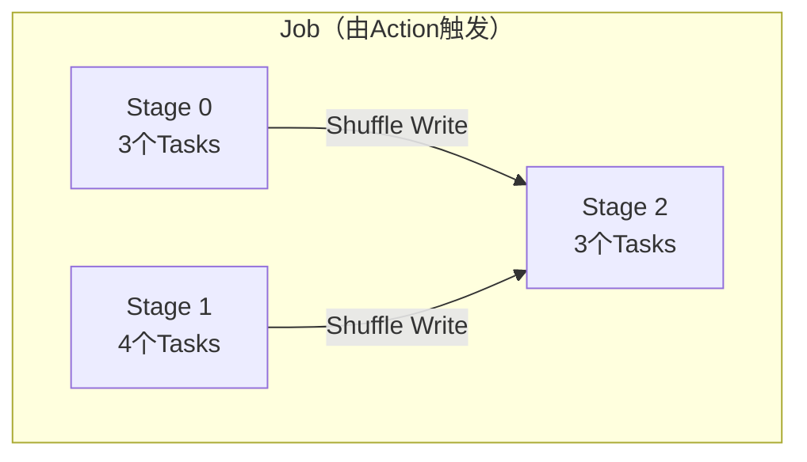
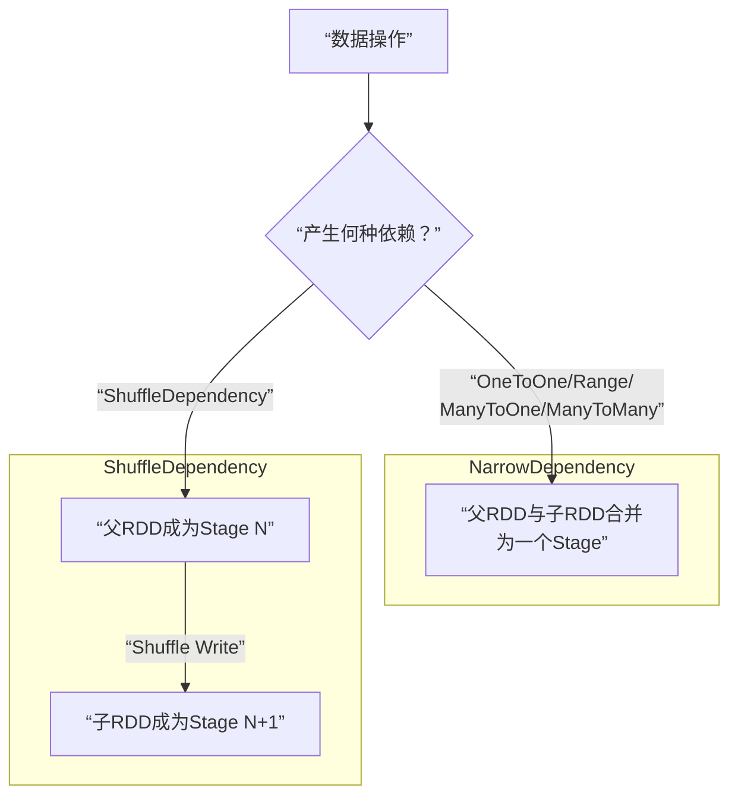

Spark的核心魅力在于其能够将用户定义的、看似复杂的逻辑处理流程，自动转化为可以在分布式集群上高效执行的物理计划。本章将深入剖析这一转化过程，理解Spark如何将一个应用拆解成可并行执行的任务单元，以及其中蕴含的性能优化思想。

## 物理执行计划概览：一个核心挑战

在上一章，我们详细讨论了Spark应用生成的**逻辑处理流程**（Logical Plan）。本章的核心问题是：如何将这个逻辑流程转化为可以被集群分布式执行的**物理执行计划**（Physical Plan）？

以一个包含`map()`、`partitionBy()`、`union()`和`join()`等多种操作的`ComplexApplication`应用为例，其逻辑处理流程（如图4.1所示）较为复杂。面对这样的流程，Spark如何将其拆分为小的执行任务呢？

### 三种划分思想的演进

为了理解Spark的设计思路，我们先探讨几种可能的任务划分方案：

**想法1：按RDD逐个划分**
*   **方案**：将每个RDD转换操作（图中的箭头）都作为一个独立的任务（Task）。
*   **问题**：会产生大量任务（示例中可能多达21个），导致调度开销巨大。更严重的是，每个任务都需要将中间结果（RDD数据）存储下来供下游任务读取，造成海量的中间数据存储，效率极低。

**想法2：按分区串联操作**
*   **方案**：将作用于同一个分区的多个连续操作串联成一个任务，从最终的RDD分区向前回溯，将所有依赖的操作纳入一个任务。
*   **优点**：减少了任务数量，中间数据在内存中被流水线处理完后可及时回收，降低了内存消耗。
*   **缺点**：当遇到**ShuffleDependency**（宽依赖）时，任务会变得异常庞大且包含大量重复计算。例如，上游的RDD数据可能被下游多个任务重复读取和计算，破坏了并行性。

**想法3：在Shuffle边界处划分（Spark采用方案）**
*   **核心洞察**：`ShuffleDependency`是复杂的“多对多”依赖关系，是任务划分的天然边界。在此处将计算逻辑分开，可以避免任务过大和重复计算。
*   **Spark方案**：基于此思想，以`ShuffleDependency`为界，将逻辑流程划分为不同的**执行阶段（Stage）**，阶段内则采用想法2的“分区串联”策略生成任务。这既保证了任务粒度适中，又维持了高并行度。

##  Spark物理执行计划的生成方法

Spark采用一个清晰的三步法来生成物理执行计划：

### 1. 执行步骤

#### 步骤一：根据Action操作划分作业（Job）
*   **触发时机**：每当应用程序调用一个**Action**操作（如`collect()`, `count()`, `saveAsTextFile()`）时，Spark就会触发一个Job的提交。
*   **Job内容**：该Job的逻辑处理流程是从最初的输入数据（或缓存数据）开始，一直到触发该Action操作的RDD为止的完整计算链。
*   **顺序执行**：如果应用中有多个Action，Spark会按照代码中的调用顺序依次为每个Action生成一个Job。

#### 步骤二：根据Shuffle依赖划分执行阶段（Stage）
*   **划分原则**：对于每个Job，从其最后的RDD开始，**向前回溯**逻辑依赖图。
    *   如果遇到**NarrowDependency**（窄依赖），则将当前RDD及其父RDD纳入同一个Stage，并继续向前回溯。
    *   如果遇到**ShuffleDependency**（宽依赖），则**在此处划断**。将当前已纳入的所有RDD组成一个Stage，然后从这个ShuffleDependency的父RDD开始，开启一个新的Stage继续向前回溯。
*   **结果**：一个Job被划分为多个Stage，Stage之间通过Shuffle依赖连接。Stage内部都是NarrowDependency，可以进行流水线优化。

#### 步骤三：根据分区数划分计算任务（Task）
*   **生成规则**：Stage内部，由于每个分区的计算逻辑相同且独立，Spark会为**Stage中最后一个RDD的每个分区**创建一个**Task**。
*   **Task职责**：每个Task负责计算该分区数据，它会沿着Stage内的RDD依赖链，从最上游的数据源（或上一Stage的输出）读取数据，并依次应用所有的转换操作。

*图：一个包含Shuffle的Job被划分为多个Stage，Stage间通过Shuffle传递数据，Stage内并行执行多个Task。*

### 2. 关键执行问题

生成计划后，还需解决三个关键的执行问题：

#### （1）Job、Stage、Task的执行顺序
*   **Job**：按Action调用顺序提交和执行。
*   **Stage**：依赖关系构成一个有向无环图（DAG）。**没有依赖关系的Stage可以并行执行**，有依赖关系的Stage必须等所有父Stage执行完成后才能开始。
*   **Task**：同一个Stage内的所有Task相互独立，可以完全并行执行。

#### （2）Task内部数据的存储与计算：流水线（Pipelining）
为了减少内存占用，Spark在Stage内部（即NarrowDependency链中）会尽可能采用**流水线计算**。
*   **理想情况**：对于`map()->filter()`这样的操作，数据记录（Record）可以像流水线一样被处理。读取一条Record，经过所有操作变换后直接输出结果，**内存中只需要保存当前正在处理的一条Record**。
*   **受限情况**：对于需要聚合整个分区数据的操作（如`mapPartitions`中计算最大值），则需要在内存中缓存部分或全部分区数据，无法实现完全的记录级流水线。

Spark通过流水线技术，极大地减少了中间数据的落地，这也是其内存计算高性能的关键之一。

#### （3）Stage间的数据传递：Shuffle机制
Stage之间通过`ShuffleDependency`连接，数据传递过程分为两部分：
*   **Shuffle Write**：上游Stage的每个Task，按照下游Stage要求的分区规则（如Hash、Range），将自己的输出数据划分为多个部分，并写入本地磁盘或内存。
*   **Shuffle Read**：下游Stage的每个Task，通过网络从上游**所有Task**的输出中，读取属于自己的那部分数据，然后进行后续计算。

### 3. Stage与Task的命名
*   **Stage**：Spark中通常直接用`Stage 0`、`Stage 1`...来命名，不区分Map/Reduce。只有当流程类似MapReduce的两阶段模型时，才会依习惯称为Map Stage/Reduce Stage。
*   **Task**：根据其输出用途有两种命名：
    *   **ShuffleMapTask**：其输出结果会进行Shuffle Write，供下游Stage读取。
    *   **ResultTask**：其输出结果直接返回给Driver程序或写入最终存储系统（如HDFS）。

##  常用数据操作的物理执行计划分析

基于`NarrowDependency`和`ShuffleDependency`的划分原则，我们可以分析常见操作的物理计划形态。

| 依赖类型 | 代表性操作 | Stage划分 | Task特点 | 图示 |
| :--- | :--- | :--- | :--- | :--- |
| **OneToOneDependency** | `map()`, `flatMap()`, `filter()` | 与父RDD合并为一个Stage | 一对一处理分区，流水线计算 | 图4.14 |
| **RangeDependency** | `union()` (一般情况) | 与父RDD合并为一个Stage | 一对一处理分区，数据来自指定父RDD分区 | 图4.15 |
| **ManyToOneDependency** | `coalesce(shuffle=false)`, `union()` (特殊) | 与父RDD合并为一个Stage | 一个Task需读取父RDD中**多个分区**的全部数据 | 图4.16 |
| **ManyToManyDependency** | `cartesian()` (笛卡尔积) | 与父RDD合并为一个Stage | 一个Task需从**多个父RDD**中读取分区全部数据 | 图4.17 |
| **单一ShuffleDependency** | `reduceByKey()`, `groupByKey()`, `sortByKey()` | 父RDD和子RDD被划分为**两个Stage** | Stage间通过Shuffle传递**部分数据** | 图4.18 |
| **多ShuffleDependency** | `join()` (无相同分区器时) | 根据Shuffle数量划分**多个Stage** | 下游Stage需等待上游完成，并进行Shuffle Read | 图4.19(a) |

*图：Spark Stage划分的核心决策逻辑。遇到窄依赖则合并Stage，遇到宽依赖则划分Stage。*

##  本章小结与扩展阅读

### 小结
本章系统阐述了Spark将**逻辑处理流程**转化为**物理执行计划**的核心机制：
1.  **触发**：由Action操作触发Job。
2.  **划分**：以ShuffleDependency为边界，将Job划分为多个Stage。
3.  **并行化**：根据Stage末RDD的分区数，生成并行Task。
4.  **优化**：Stage内部采用流水线计算减少内存开销；Stage间通过Shuffle机制传递数据。

理解这一过程，是分析Spark应用性能、进行调优的基础。

### 扩展阅读：查询优化
本章描述的逻辑到物理的转化，是完全按照用户代码顺序进行的。然而，用户定义的流程未必最优。例如，调整操作顺序、提前进行分区等，都可能大幅提升性能。

为此，Spark在更高级的模块（如**Spark SQL**）中引入了丰富的查询优化技术：
*   **基于规则的优化**：如谓词下推、列裁剪、常量折叠等，在逻辑计划层面进行等价变换。
*   **基于代价的优化**：通过数据统计信息估算不同物理计划的执行代价，选择最优计划。
*   **自适应查询执行**：在运行时根据实际数据特征动态调整执行策略，如自动处理数据倾斜、动态调整Shuffle分区数。

这些优化技术使得Spark能够智能地生成更高效的物理执行计划，超越了用户手动编写的代码效率。