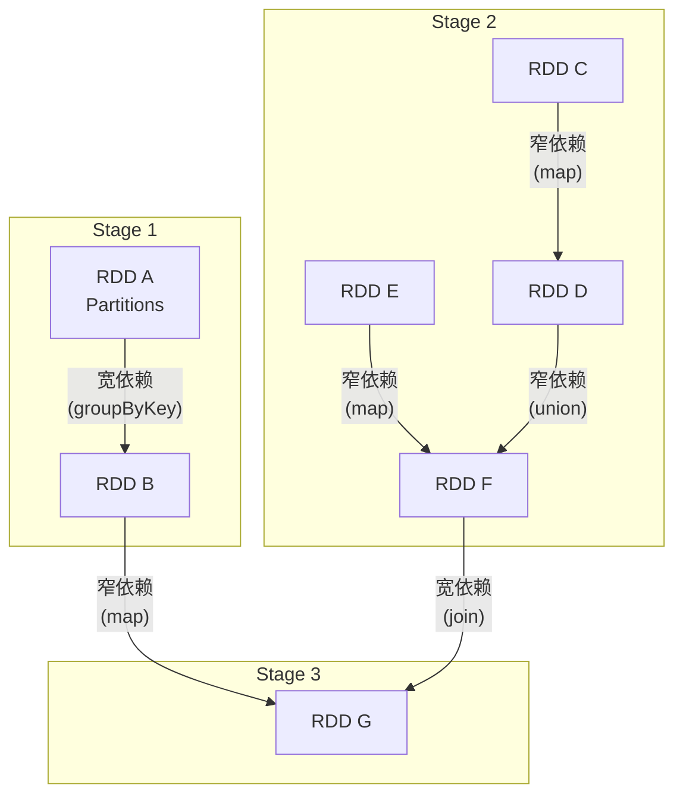
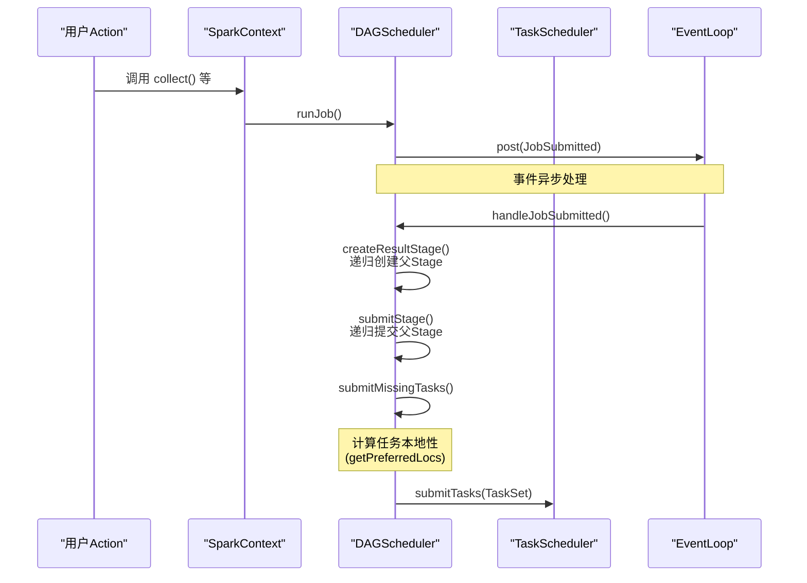

在Spark的核心调度架构中，**DAGScheduler** 扮演着“总设计师”的角色。它负责将用户逻辑（RDD依赖关系）翻译成物理执行计划，将复杂的计算图（DAG）拆分为可并行执行的阶段（Stage），并智能地将任务（Task）调度到最合适的位置，以最大化数据本地性，从而驱动整个Spark作业高效运行。理解DAGScheduler是深入掌握Spark内部工作原理的关键。

## 1. 核心概念与定义

为了更好地理解DAGScheduler，我们需要明确几个核心概念及其关系：

*   **DAG（有向无环图）**： 由RDD之间的依赖关系构成的计算逻辑图。
*   **Stage（阶段）**： DAGScheduler对DAG的物理划分单元。一个Job会被拆分成多个Stage来执行。
*   **TaskSet（任务集）**： 一个Stage封装为一个TaskSet，包含多个可以并行执行的Task。
*   **Task（任务）**： 最小的独立工作单元，负责处理一个RDD Partition的数据。根据Stage类型，Task分为：
    *   **ShuffleMapTask**： 负责Stage中间数据的计算和Shuffle输出。
    *   **ResultTask**： 负责最终结果的输出（通常对应最后一个Stage）。

**DAGScheduler的核心职责**：
1.  **Stage划分**： 以Shuffle为边界，将DAG反向解析，拆分成多个Stage。
2.  **任务提交**： 将每个Stage封装成TaskSet，提交给底层的TaskScheduler执行。
3.  **数据本地性优化**： 记录RDD物化信息，为Task寻求最优的计算位置（如优先调度到数据所在的节点）。
4.  **容错处理**： 监控Stage执行状态，处理因Shuffle输出失败等原因导致的Stage失败，并负责重新提交。

## 2. DAGScheduler的实例化

DAGScheduler是Spark Application的高层调度入口，在`SparkContext`初始化过程中被创建。

```scala
// SparkContext.scala 中的关键代码片段
class SparkContext(config: SparkConf) extends Logging {
  // 1. 创建TaskScheduler和SchedulerBackend
  val (sched, ts) = SparkContext.createTaskScheduler(this, master, deployMode)
  _schedulerBackend = sched
  _taskScheduler = ts

  // 2. 实例化DAGScheduler，传入当前SparkContext
  _dagScheduler = new DAGScheduler(this)

  // 3. 启动TaskScheduler
  _taskScheduler.start()
}
```

DAGScheduler的构造函数依赖于`SparkContext`和`TaskScheduler`，这种设计遵循了**依赖抽象**的原则，使得底层资源调度器（Standalone, YARN, Mesos等）可以灵活插拔。

```scala
// DAGScheduler.scala 中的构造函数
class DAGScheduler(
    private[scheduler] val sc: SparkContext,
    private[scheduler] val taskScheduler: TaskScheduler,
    ... // 其他组件
) extends Logging {
  // ...
}
```

## 3. Stage划分原理

Stage的划分是DAGScheduler工作的核心，其根本依据是RDD之间的依赖类型。

### 3.1 划分边界：宽依赖（Shuffle Dependency）

Spark根据是否需要经过**Shuffle过程**来划分Stage。每当遇到一个**宽依赖**（Shuffle Dependency），就会产生一个新的Stage。

*   **窄依赖（Narrow Dependency）**： 子RDD的每个分区只依赖于父RDD的一个分区。例如：`map`、`filter`、`union`。
*   **宽依赖（Shuffle Dependency）**： 子RDD的每个分区依赖于父RDD的多个分区，需要经过Shuffle。例如：`groupByKey`、`reduceByKey`、`join`（未经分区优化的）。

### 3.2 划分过程图解



**图解说明**：
1.  RDD A到RDD B是宽依赖，因此RDD A被划分为**Stage 1**。
2.  RDD C到D、E到F、D到F都是窄依赖，它们被划分到同一个**Stage 2**。
3.  RDD B到G是窄依赖，RDD F到G是宽依赖。因此，RDD G和RDD B属于同一个**Stage 3**，而RDD F则成为Stage 2和Stage 3的划分点。
4.  **执行顺序**： Stage 1和Stage 2相互独立，可以**并发执行**。Stage 3依赖于前两个Stage的结果，因此**最后执行**。

## 4. Stage划分算法源码追踪

当用户调用一个Action（如`collect()`）时，会触发整个调度流程。我们以`collect()`为例，追踪Stage的创建过程。

### 4.1 从Action到JobSubmitted事件

1.  `RDD.collect()` -> `SparkContext.runJob()` -> `DAGScheduler.runJob()` -> `DAGScheduler.submitJob()`
2.  在`submitJob()`方法中，会创建一个`JobSubmitted`事件，并发送到`eventProcessLoop`（一个事件处理循环线程）。

```scala
// DAGScheduler.submitJob 关键代码
val waiter = new JobWaiter(this, jobId, partitions.size, resultHandler)
eventProcessLoop.post(JobSubmitted( // 发送事件
  jobId, finalRDD, func, partitions.toArray, callSite, waiter, properties))
```

### 4.2 事件处理与Stage创建

`eventProcessLoop`线程接收到`JobSubmitted`事件后，调用`DAGScheduler.handleJobSubmitted()`方法。

```scala
// DAGSchedulerEventProcessLoop.doOnReceive
case JobSubmitted(jobId, rdd, func, partitions, callSite, listener, properties) =>
  dagScheduler.handleJobSubmitted(jobId, rdd, func, partitions, callSite, listener, properties)
```

在`handleJobSubmitted`中，首先为最终的RDD创建最后一个Stage——`ResultStage`。

```scala
private[scheduler] def handleJobSubmitted(jobId: Int, finalRDD: RDD[_], ...) {
  // 创建最终的ResultStage
  finalStage = createResultStage(finalRDD, func, partitions, jobId, callSite)
  // ... 记录Job信息
  submitStage(finalStage) // 提交Stage
}
```

`createResultStage`会递归地为当前RDD创建或获取其所有的父`ShuffleMapStage`。

```scala
private def createResultStage(rdd: RDD[_], ...): ResultStage = {
  // 获取或创建父Stages列表
  val parents = getOrCreateParentStages(rdd, jobId)
  val id = nextStageId.getAndIncrement()
  // 实例化ResultStage
  val stage = new ResultStage(id, rdd, func, partitions, parents, jobId, callSite)
  // ...
}
```

`getOrCreateParentStages`方法是关键，它通过`getShuffleDependencies`找出当前RDD的所有直接宽依赖，然后为每个宽依赖创建对应的`ShuffleMapStage`。

```scala
private def getOrCreateParentStages(rdd: RDD[_], firstJobId: Int): List[Stage] = {
  // 1. 找到所有直接的Shuffle依赖
  getShuffleDependencies(rdd).map { shuffleDep =>
    // 2. 为每个Shuffle依赖获取或创建ShuffleMapStage
    getOrCreateShuffleMapStage(shuffleDep, firstJobId)
  }.toList
}
```

`getShuffleDependencies`算法使用栈（Stack）进行深度优先遍历，直到遇到宽依赖并将其加入结果集，遇到窄依赖则继续深入。

### 4.3 递归提交Stage

创建好最终的`ResultStage`后，`handleJobSubmitted`会调用`submitStage(finalStage)`。

`submitStage`方法的核心逻辑是**递归地、从后往前**提交Stage：
1.  检查当前Stage是否有未计算的父Stage（`getMissingParentStages`）。
2.  如果没有缺失的父Stage，则调用`submitMissingTasks`，将当前Stage的Task提交给`TaskScheduler`执行。
3.  如果存在缺失的父Stage，则先递归调用`submitStage`提交这些父Stage，并将当前Stage加入等待队列。

```scala
private def submitStage(stage: Stage) {
  val missing = getMissingParentStages(stage).sortBy(_.id) // 获取缺失的父Stage
  if (missing.isEmpty) {
    submitMissingTasks(stage, jobId.get) // 没有父Stage，直接提交任务
  } else {
    for (parent <- missing) { // 先递归提交所有父Stage
      submitStage(parent)
    }
    waitingStages += stage // 当前Stage进入等待队列
  }
}
```

**这个过程保证了Stage之间的依赖关系**：只有所有父Stage都计算完成，子Stage才会开始执行。

## 5. 任务（Task）数据本地性算法

在`submitMissingTasks`方法中，DAGScheduler会为Stage中的每个需要计算的分区（Partition）确定最佳的**任务位置（TaskLocation）**，以追求“数据不动，计算动”的本地性优化。

### 5.1 本地性优先级

任务本地性决策遵循以下优先级（在`getPreferredLocsInternal`方法中实现）：

1.  **缓存本地性**： 分区数据是否已被缓存（`persist`/`cache`）在某个Executor的内存或磁盘中。如果已缓存，则优先调度到该节点。这是最高优先级。
2.  **RDD首选位置**： 如果未缓存，则查看RDD自身的`getPreferredLocations`方法。对于`HadoopRDD`（读取HDFS文件），这会返回数据块的存储位置；对于自定义RDD，开发者可以重写此方法提供位置信息。
3.  **窄依赖传播**： 如果以上都未提供位置，则会递归地向其**窄依赖的父RDD**寻找首选位置。这体现了“移动计算而非数据”的思想。

### 5.2 算法实现

```scala
private def getPreferredLocsInternal(rdd: RDD[_], partition: Int, visited: HashSet[(RDD[_], Int)]): Seq[TaskLocation] = {
  // 1. 检查是否已访问，避免循环
  if (!visited.add((rdd, partition))) return Nil

  // 2. 最高优先级：检查缓存位置
  val cached = getCacheLocs(rdd)(partition)
  if (cached.nonEmpty) return cached

  // 3. 次优先级：RDD自身的首选位置（如HDFS块位置）
  val rddPrefs = rdd.preferredLocations(rdd.partitions(partition)).toList
  if (rddPrefs.nonEmpty) return rddPrefs.map(TaskLocation(_))

  // 4. 最后：递归地从窄依赖的父RDD寻找位置
  rdd.dependencies.foreach {
    case n: NarrowDependency[_] =>
      for (inPart <- n.getParents(partition)) {
        val locs = getPreferredLocsInternal(n.rdd, inPart, visited)
        if (locs != Nil) return locs // 找到一个就返回
      }
    case _ => // 宽依赖不传播本地性
  }
  Nil // 未找到任何首选位置
}
```

**补充说明**：`getCacheLocs`方法会查询`BlockManagerMaster`，获取某个RDD分区被缓存的所有副本的位置。这确保了如果数据有多个缓存副本，任务可以有多个备选位置，提高了调度灵活性。

## 6. 总结与应用启示

通过以上分析，我们可以总结DAGScheduler的核心工作流：



**对开发者的启示**：
1.  **理解Shuffle代价**： 宽依赖意味着Shuffle和新的Stage，这是Spark作业中最昂贵的操作之一。优化作业的关键在于**尽量减少不必要的Shuffle**（例如，使用`reduceByKey`替代`groupByKey`+`map`，使用广播变量等）。
2.  **利用数据本地性**： 对于自定义数据源的RDD，**务必实现`getPreferredLocations`方法**，这能极大提升任务调度效率，避免数据网络传输。
3.  **利用缓存**： 将频繁使用的RDD进行`persist`/`cache`，不仅加速计算，也为DAGScheduler提供了更强的本地性调度依据。
4.  **Stage视图调试**： 通过Spark UI的Stage视图，可以直观看到作业的Stage划分、依赖关系和每个Stage的Task本地性情况，是性能调优的重要工具。

DAGScheduler作为Spark的“大脑”，巧妙地将用户逻辑、数据分布和集群资源结合起来，其Stage划分和本地性调度算法是Spark能够高效处理海量数据的基石。