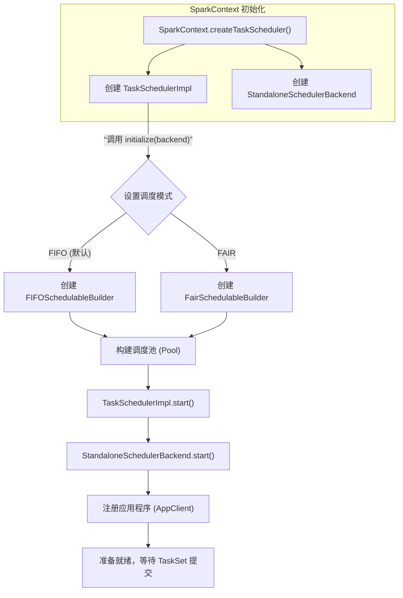
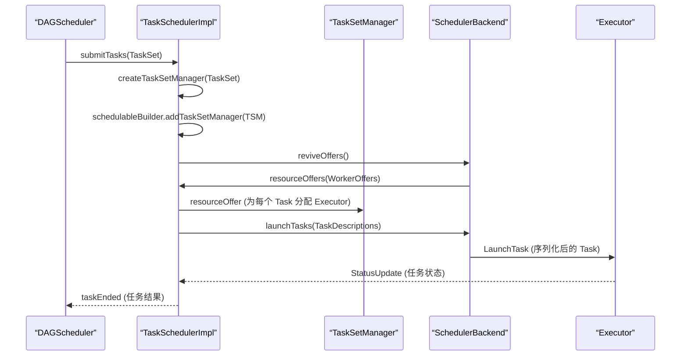

在 Spark 的执行引擎中，DAGScheduler 负责高层次的任务划分（Stage），而真正的任务（Task）调度、资源分配和生命周期管理，则是由底层的 **TaskScheduler** 来完成。它作为连接高层逻辑调度与底层计算资源的桥梁，是 Spark 能够高效并行执行作业的关键组件。理解 TaskScheduler 的工作原理，对于性能调优和问题诊断至关重要。

## 1. TaskScheduler 的核心职责

TaskScheduler 主要负责接收来自 DAGScheduler 的 `TaskSet`，并将其提交到集群进行计算，同时监控任务的执行状态并汇报结果。具体任务包括：
1.  **TaskSet 管理**：为每个 `TaskSet` 创建并维护一个 `TaskSetManager`，用于追踪任务的本地性偏好、错误信息及执行状态。
2.  **推测执行**：处理执行缓慢的任务（Straggle Task），将其副本调度到其他节点进行重试，以优化整体执行时间。
3.  **状态汇报**：向 DAGScheduler 汇报任务的执行结果。例如，当 Shuffle 输出丢失时，报告 `fetch failed` 错误，触发相应的容错处理。

## 2. 原理剖析：TaskScheduler 的生命周期

DAGScheduler 将划分好的 Stage（每个 Stage 封装为一个 `TaskSet`），按照依赖顺序依次提交给底层的 TaskScheduler 执行。

### 2.1 初始化与启动

虽然 Spark 支持多种部署模式（Local, Standalone, YARN, Mesos），但底层调度器的实现类始终是 `TaskSchedulerImpl`。以 Standalone 模式为例，其初始化流程如下：



**关键步骤解析**：
*   **调度模式**：`TaskSchedulerImpl` 在 `initialize` 方法中，会根据配置的 `spark.scheduler.mode`（`FIFO` 或 `FAIR`）创建对应的 `SchedulerBuilder`（`FIFOSchedulableBuilder` 或 `FairSchedulableBuilder`）。`SchedulerBuilder` 负责构建调度树，管理 `TaskSetManager`。
*   **启动**：`TaskSchedulerImpl` 的 `start` 方法会启动底层的 `SchedulerBackend`（如 `StandaloneSchedulerBackend`），完成向集群 Master 的注册，并开始监听计算资源。

### 2.2 接收与调度 TaskSet

当 `TaskSchedulerImpl` 启动后，便可以接收来自 `DAGScheduler.submitMissingTasks` 方法提交的 `TaskSet`。



**详细流程**：
1.  **提交 TaskSet**：`DAGScheduler` 调用 `taskScheduler.submitTasks(new TaskSet(...))`。
2.  **创建管理器**：`TaskSchedulerImpl.submitTasks` 方法中，会为传入的 `TaskSet` 创建一个 `TaskSetManager`，并将其加入到 `SchedulableBuilder` 管理的调度池中，以确定其调度优先级。
3.  **触发资源调度**：调用 `backend.reviveOffers()`。这会向 `CoarseGrainedSchedulerBackend` 的 `DriverEndpoint` 发送一个 `ReviveOffers` 消息。
4.  **分配资源**：`DriverEndpoint` 收到 `ReviveOffers` 后，调用 `makeOffers()` 方法。该方法首先获取所有活跃的 Executor 资源（`WorkerOffer`），然后调用 `TaskSchedulerImpl.resourceOffers(workOffers)`。
5.  **任务与资源匹配**：`resourceOffers` 方法是核心，它决定了每个 Task 最终运行在哪个 Executor 上。其核心策略包括：
    *   **负载均衡**：将可用的 `WorkerOffer` 随机打乱 (`shuffle`)，避免所有任务集中在部分节点。
    *   **本地性优先**：按照 `PROCESS_LOCAL` -> `NODE_LOCAL` -> `NO_PREF` -> `RACK_LOCAL` -> `ANY` 的优先级顺序，尽可能将 Task 调度到其数据所在的节点或机架上。
    *   **调用 `TaskSetManager.resourceOffer`**：最终由 `TaskSetManager` 根据本地性级别和等待时间，从待执行任务队列中取出一个 Task，并封装成 `TaskDescription`。
6.  **启动任务**：`CoarseGrainedSchedulerBackend.launchTasks` 将序列化后的 `TaskDescription` 发送给对应的 Executor。Executor 接收后反序列化并执行 `Task.run()`。

### 2.3 任务状态反馈与容错

任务执行结束后，结果或状态会通过一条链路由 Executor 反馈回 DAGScheduler。

```
(1) Executor.run
(2) CoarseGrainedExecutorBackend.statusUpdate (发送 StatusUpdate 消息)
(3) CoarseGrainedSchedulerBackend.receive (处理 StatusUpdate 消息)
(4) TaskSchedulerImpl.statusUpdate
(5) TaskResultGetter.enqueueSuccessfulTask / enqueueFailedTask
(6) TaskSchedulerImpl.handleSuccessfulTask / handleFailedTask
(7) TaskSetManager.handleSuccessfulTask / handleFailedTask
(8) DAGScheduler.taskEnded
(9) DAGScheduler.handleTaskCompletion
```

**关键容错机制**：
*   **任务重试**：在第 (7) 步，`TaskSetManager.handleFailedTask` 会将失败的任务重新放回待执行队列。Spark 默认允许任务失败重试 4 次（可通过 `spark.task.maxFailures` 配置）。
*   **重新调度**：在第 (6) 步，`TaskSchedulerImpl.handleFailedTask` 在处理完失败后，会再次调用 `backend.reviveOffers()` 为需要重试的任务申请资源。

## 3. 核心类与数据结构解析

### 3.1 TaskSet

`TaskSet` 是高层调度器（DAGScheduler）提交给底层调度器（TaskScheduler）的一个任务集合单元。

```scala
private[spark] class TaskSet(
    val tasks: Array[Task[_]], // 任务数组
    val stageId: Int,          // 所属 Stage Id
    val stageAttemptId: Int,   // Stage 尝试次数 Id
    val priority: Int,         // 优先级，用于调度排序
    val properties: Properties) {
    val id: String = stageId + "." + stageAttemptId
}
```

### 3.2 TaskSetManager

`TaskSetManager` 负责管理一个 `TaskSet` 的完整生命周期，包括任务调度、本地性追踪、失败重试和推测执行。

```scala
// Spark 2.1.1 版本
private[spark] class TaskSetManager(
    sched: TaskSchedulerImpl,
    val taskSet: TaskSet,
    val maxTaskFailures: Int, // 最大失败重试次数
    clock: Clock = new SystemClock()) extends Schedulable with Logging {

// Spark 2.2.0 版本增加了黑名单跟踪功能
private[spark] class TaskSetManager(
    sched: TaskSchedulerImpl,
    val taskSet: TaskSet,
    val maxTaskFailures: Int,
    clock: Clock = new SystemClock(),
    blacklistTracker: Option[BlacklistTracker] = None) // 新增：黑名单跟踪
```

**主要方法**：
*   `resourceOffer(execId: String, host: String, maxLocality: TaskLocality): Option[TaskDescription]`：根据给定的 Executor、主机和最大本地性级别，决定分配哪个任务，并返回任务描述。
*   `handleFailedTask(tid: Long, state: TaskState, reason: TaskEndReason)`：处理任务失败，可能将任务重新加入待调度队列。
*   `executorAdded()`：当有新的 Executor 加入时，重新计算有效的本地性级别。

### 3.3 WorkerOffer 与 TaskDescription

*   **WorkerOffer**：代表一个可用的计算资源单元（Executor）。
    ```scala
    private[spark] case class WorkerOffer(executorId: String, host: String, cores: Int)
    ```
*   **TaskDescription**：描述一个将要被发送到 Executor 执行的任务。它包含了任务标识、目标 Executor、序列化后的任务字节码等信息。
    ```scala
    // Spark 2.1.1 版本
    private[spark] class TaskDescription(
        val taskId: Long,
        val attemptNumber: Int,
        val executorId: String, // 确定了任务运行的具体位置
        val name: String,
        val index: Int, // 在 TaskSet 中的索引
        _serializedTask: ByteBuffer) extends Serializable

    // Spark 2.2.0+ 版本增加了依赖文件、Jar包和属性信息
    private[spark] class TaskDescription(
        val taskId: Long,
        val attemptNumber: Int,
        val executorId: String,
        val name: String,
        val index: Int,
        val addedFiles: Map[String, Long],
        val addedJars: Map[String, Long],
        val properties: Properties,
        val serializedTask: ByteBuffer)
    ```

## 4. 调度策略详解：resourceOffers 方法

`TaskSchedulerImpl.resourceOffers(offers: IndexedSeq[WorkerOffer]): Seq[Seq[TaskDescription]]` 方法是任务分配的核心算法。

### 4.1 算法步骤

1.  **资源过滤与准备**（Spark 2.2+）：
    *   移除黑名单中过期的节点和 Executor。
    *   过滤掉已被列入黑名单的节点和 Executor 提供的 `WorkerOffer`。
2.  **负载均衡**：将可用的 `WorkerOffer` 随机打乱 (`shuffleOffers`)，防止任务总是集中在同一批 Worker 上。
3.  **初始化任务列表**：为每个 `WorkerOffer` 创建一个 `ArrayBuffer[TaskDescription]`，其容量等于该 Executor 可用的核心数 (`cores`)。这决定了每个 Executor 上可以并行运行多少个 Task。
4.  **获取排序后的 TaskSetManager**：从根调度池 (`rootPool`) 中获取所有 `TaskSetManager`，并按照调度算法（FIFO 或 Fair）进行排序。
5.  **本地性优先的任务分配**：
    *   遍历排序后的 `TaskSetManager`。
    *   对于每个 `TaskSetManager`，按照其有效的本地性级别 (`myLocalityLevels`) 从高到低进行尝试。
    *   在当前最高本地性级别下，循环调用 `resourceOfferSingleTaskSet`，尽可能多地启动任务，直到没有任务能在该级别下启动。
    *   如果某个 `TaskSetManager` 一个任务都没能启动，且其任务已被完全列入黑名单，则中止该 `TaskSet`。

### 4.2 本地性级别计算

`TaskSetManager.myLocalityLevels` 通过 `computeValidLocalityLevels()` 计算得出。其逻辑是检查是否有对应级别的待处理任务，并且对应的 Executor 或主机是存活的。

**优先级顺序（由高到低）**：
1.  **PROCESS_LOCAL**：数据在同一个 Executor 的 JVM 进程中。
2.  **NODE_LOCAL**：数据在同一节点上。
3.  **NO_PREF**：任务对数据位置无偏好。
4.  **RACK_LOCAL**：数据在同一机架的不同节点上。
5.  **ANY**：数据在网络中的任意位置。

## 5. 实际应用与配置

### 5.1 调度模式配置

*   **`spark.scheduler.mode`**：默认 `FIFO`。可设置为 `FAIR` 以启用公平调度器，使多个作业可以更均衡地共享集群资源。
*   **`spark.task.cpus`**：默认 `1`。指定每个 Task 请求的 CPU 核心数。如果 Task 的计算逻辑复杂，可以适当增加此值，但需确保集群资源充足。
*   **`spark.task.maxFailures`**：默认 `4`。任务失败重试的最大次数。在网络不稳定或数据节点易宕机的环境中，可以适当调高此值。

### 5.2 黑名单机制（Spark 2.2+）

从 Spark 2.2 开始，引入了 `BlacklistTracker`。如果某个 Executor 或节点频繁失败任务，它可能会被暂时加入黑名单，新的任务将不会调度到该节点上，直到黑名单超时。这有助于提高作业的整体稳定性。

## 总结

TaskScheduler 是 Spark 执行引擎的“调度中心”。它从 DAGScheduler 接收逻辑任务单元 (`TaskSet`)，通过复杂的本地性感知和负载均衡算法，将具体任务 (`Task`) 匹配到物理计算资源 (`Executor`) 上，并全程管理任务的执行、监控和容错。理解其工作原理，有助于开发者：
*   **优化数据布局**：通过 `persist` 或 `broadcast` 控制数据位置，提高 `PROCESS_LOCAL` 或 `NODE_LOCAL` 级别任务的比例。
*   **合理设置并行度**：理解 `Task` 与 `Executor` `cores` 的关系，避免资源闲置或过度竞争。
*   **诊断执行缓慢问题**：结合日志分析任务调度过程，判断是否由于本地性不佳、数据倾斜或资源不足导致。
*   **调整重试与推测执行策略**：根据集群可靠性调整 `maxFailures`，利用推测执行应对 Straggle Task。

掌握 TaskScheduler 的运作机制，是深入理解 Spark 内核、进行高效大数据应用开发与调优的基石。