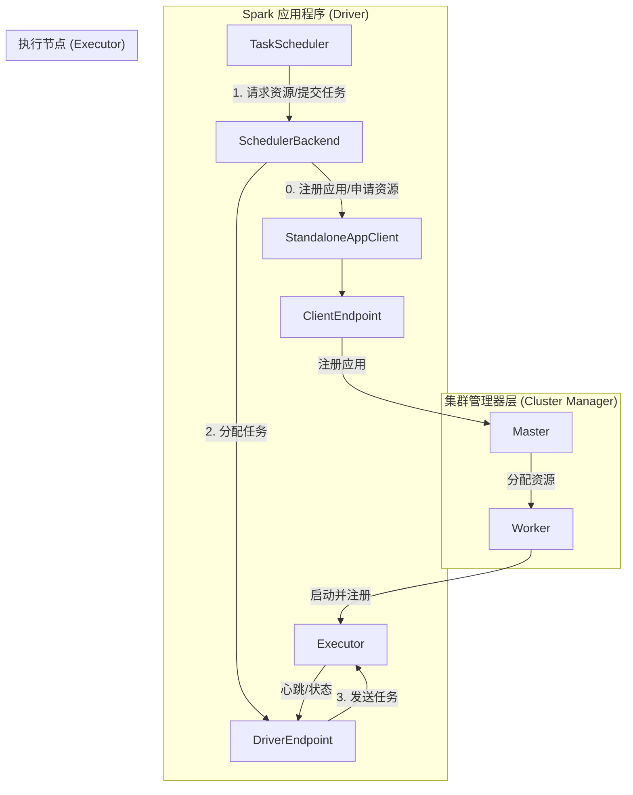

在 Spark 的分布式计算框架中，`SchedulerBackend` 扮演着“资源管家”和“任务调度信使”的关键角色。它负责与底层的集群管理器（如 Standalone、YARN、Mesos）通信，为应用程序申请、管理和跟踪计算资源（Executor），并将高层调度器（TaskScheduler）分配的任务（Task）下发到具体的 Executor 上执行。理解 `SchedulerBackend` 的工作原理，是掌握 Spark 任务从提交到执行全链路的关键。

## 1. SchedulerBackend 核心原理剖析

以 **Spark Standalone** 部署模式为例，`StandaloneSchedulerBackend` 是 `SchedulerBackend` 的具体实现，其工作原理遵循一个清晰的启动和注册流程。

### 1.1 启动与注册流程

当 Spark 应用程序启动时，`StandaloneSchedulerBackend` 会执行以下关键步骤：

1.  **构造客户端**：在其 `start()` 方法中，会创建一个 `StandaloneAppClient` 实例，该客户端负责与 Master 节点通信。
2.  **启动客户端**：调用 `client.start()`。此操作会创建一个 `ClientEndpoint`（一个 RPC 端点，作为消息循环体）。
3.  **向 Master 注册**：`ClientEndpoint` 启动后，其 `onStart()` 方法会被调用，立即向 Master 发送 `RegisterApplication` 消息，完成应用程序的注册。
4.  **实例化 Driver 端点**：`StandaloneSchedulerBackend` 的父类 `CoarseGrainedSchedulerBackend` 在 `start()` 时，会实例化一个 `DriverEndpoint`。**这就是我们常说的 Driver 进程的核心对象之一**，它负责与 Executor 通信。
5.  **资源收集**：当 Worker 节点上的 `CoarseGrainedExecutorBackend` 启动后，会向 `DriverEndpoint` 发送 `RegisteredExecutor` 消息进行注册。至此，`StandaloneSchedulerBackend` 便掌握了应用程序可用的所有 Executor 资源。

**简单来说**：`TaskScheduler` 负责决定“哪个任务在哪个资源上运行”（决策），而 `SchedulerBackend` 则负责“获取资源”并“将决策下发给具体的执行者 Executor”（执行）。下图清晰地展示了这一核心协作关系：



## 2. 源码解析：注册与启动

### 2.1 StandaloneSchedulerBackend 启动

`StandaloneSchedulerBackend` 的 `start()` 方法是整个资源申请链路的起点。

```scala
// StandaloneSchedulerBackend.scala (简化版)
private[spark] class StandaloneSchedulerBackend(...) extends ... {
  override def start() {
    // 1. 构建启动Executor的命令
    val command = Command(
      "org.apache.spark.executor.CoarseGrainedExecutorBackend", // 执行器后端类
      args, sc.executorEnvs, classPathEntries, ...
    )
    // 2. 创建应用描述
    val appDesc = new ApplicationDescription(name, maxCores, memoryPerExecutorMB, command, ...)
    // 3. 创建客户端并启动，开始向Master注册
    client = new StandaloneAppClient(sc.env.rpcEnv, masters, appDesc, this, conf)
    client.start() // 关键：启动注册流程
    // ... (父类CoarseGrainedSchedulerBackend的start也会被调用，创建DriverEndpoint)
  }
}
```

### 2.2 应用程序向 Master 注册

`StandaloneAppClient.start()` 方法创建了负责注册的 `ClientEndpoint`。

```scala
// StandaloneAppClient.scala
def start() {
  // 创建并启动 ClientEndpoint 这个RpcEndpoint
  endpoint.set(rpcEnv.setupEndpoint("AppClient", new ClientEndpoint(rpcEnv)))
}
```

`ClientEndpoint` 在其生命周期开始时 (`onStart`) 立即尝试向 Master 注册。

```scala
// StandaloneAppClient.scala - ClientEndpoint 类内部
override def onStart(): Unit = {
  try {
    registerWithMaster(1) // 开始注册
  } catch { ... }
}

private def registerWithMaster(nthRetry: Int) {
  registerMasterFutures.set(tryRegisterAllMasters()) // 尝试向所有Master注册
}

private def tryRegisterAllMasters(): Array[JFuture[_]] = {
  // 遍历所有Master地址
  masterAddresses.map { masterAddress =>
    // 获取Master的RPC引用
    val masterRef = rpcEnv.setupEndpointRef(masterAddress, Master.ENDPOINT_NAME)
    // 发送注册消息！
    masterRef.send(RegisterApplication(appDescription, self))
  }
}
```

### 2.3 Master 处理注册

Master 也是一个 `RpcEndpoint`，在其 `receive` 方法中处理 `RegisterApplication` 消息。

```scala
// Master.scala
override def receive: PartialFunction[Any, Unit] = {
  case RegisterApplication(description, driver) =>
    // 创建内部Application对象
    val app = createApplication(description, driver)
    // 注册应用
    registerApplication(app)
    // 调度资源（在Worker上启动Executor）
    schedule()
    // 向Driver发送注册成功确认
    driver.send(RegisteredApplication(app.id, self))
  // ... 其他消息处理
}
```

### 2.4 注册完成确认

`ClientEndpoint` 收到 `RegisteredApplication` 消息后，标记注册完成。

```scala
// StandaloneAppClient.scala - ClientEndpoint 类内部
override def receive: PartialFunction[Any, Unit] = {
  case RegisteredApplication(appId_, masterRef) =>
    appId.set(appId_) // 设置应用ID
    registered.set(true) // 标记为已注册
    // ... 其他逻辑
}
```

**至此，Spark 应用程序在 Standalone 集群上的注册流程全部完成。** Master 的 `schedule()` 方法会触发在 Worker 节点上为这个应用启动 Executor 进程。

## 3. 计算资源 (Executor) 的管理与任务下发

TaskScheduler 准备好一个 TaskSet 后，会调用 `SchedulerBackend` 的 `reviveOffers()` 方法来获取资源并运行任务。

### 3.1 触发资源分配

```scala
// CoarseGrainedSchedulerBackend.scala
override def reviveOffers() {
  driverEndpoint.send(ReviveOffers) // 向DriverEndpoint发送消息
}
```

### 3.2 DriverEndpoint 处理资源请求

`DriverEndpoint` 收到 `ReviveOffers` 消息后，调用 `makeOffers()` 方法。

```scala
// CoarseGrainedSchedulerBackend.scala - DriverEndpoint 类内部
override def receive: PartialFunction[Any, Unit] = {
  case ReviveOffers =>
    makeOffers() // 核心方法：制造资源提议
}

private def makeOffers() {
  // 1. 过滤出活跃的Executor
  val activeExecutors = executorDataMap.filterKeys(executorIsAlive)
  // 2. 为每个Executor构建资源描述 WorkerOffer (包含 executorId, host, freeCores)
  val workOffers = activeExecutors.map { case (id, executorData) =>
    new WorkerOffer(id, executorData.executorHost, executorData.freeCores)
  }.toSeq
  
  // 3. 将资源提供给TaskScheduler，让它进行任务分配
  val taskDescs = scheduler.resourceOffers(workOffers)
  
  // 4. 如果分配到了任务，则启动它们
  if (!taskDescs.isEmpty) {
    launchTasks(taskDescs)
  }
}
```

### 3.3 启动任务 (Launch Tasks)

`launchTasks` 方法负责将 `TaskScheduler` 分配好的任务发送到对应的 Executor。

```scala
// CoarseGrainedSchedulerBackend.scala - DriverEndpoint 类内部
private def launchTasks(tasks: Seq[Seq[TaskDescription]]) {
  // 扁平化任务列表
  for (task <- tasks.flatten) {
    // 序列化任务
    val serializedTask = ser.serialize(task)
    // 检查序列化后的大小是否超过网络传输限制
    if (serializedTask.limit >= maxRpcMessageSize) {
      // 如果太大，则终止任务集
      scheduler.taskIdToTaskSetManager.get(task.taskId).foreach { taskSetMgr =>
        taskSetMgr.abort(...)
      }
    } else {
      // 获取任务对应的Executor数据
      val executorData = executorDataMap(task.executorId)
      // 向 CoarseGrainedExecutorBackend 发送 LaunchTask 消息
      executorData.executorEndpoint.send(LaunchTask(new SerializableBuffer(serializedTask)))
    }
  }
}
```

### 3.4 Executor 执行任务

最终，消息被发送到 `CoarseGrainedExecutorBackend`，由其转发给真正的 `Executor` 对象执行。

1.  `CoarseGrainedExecutorBackend` 接收到 `LaunchTask(data)` 消息。
2.  反序列化出 `TaskDescription`。
3.  调用 `Executor.launchTask(thisTask)` 方法，最终由 `TaskRunner` 线程执行具体的任务计算逻辑。

## 4. 总结与核心要点

| 组件 | 角色 | 关键职责 |
| :--- | :--- | :--- |
| **StandaloneSchedulerBackend** | 资源管家 | 1. 向 Master 注册应用。<br>2. 管理应用已获得的 Executor 资源列表。<br>3. 响应 TaskScheduler 的资源请求。 |
| **DriverEndpoint** | 驱动端点 | 1. 接收 Executor 的注册 (`RegisteredExecutor`)。<br>2. 接收 `ReviveOffers` 请求，调用 `makeOffers()`。<br>3. 将序列化后的任务发送给具体的 Executor。 |
| **ClientEndpoint** | 客户端端点 | 1. 负责应用程序级别的注册 (`RegisterApplication`)。<br>2. 处理来自 Master 的注册响应。 |
| **TaskScheduler** | 任务调度器 | 1. 接收 `SchedulerBackend` 提供的资源 (`WorkerOffer`)。<br>2. 根据调度策略决定哪个任务在哪个资源上运行 (`resourceOffers`)。 |

**核心流程再梳理**：
1.  **注册阶段**：`SchedulerBackend` (通过 `ClientEndpoint`) 向集群管理器注册应用，申请资源，并等待 Executor 启动后向 `DriverEndpoint` 注册。
2.  **调度阶段**：`TaskScheduler` 调用 `reviveOffers()`。
3.  **资源提供阶段**：`DriverEndpoint` 的 `makeOffers()` 收集可用资源，交给 `TaskScheduler` 进行分配。
4.  **任务下发阶段**：`DriverEndpoint` 将分配好的任务序列化后，通过 RPC 发送给对应的 `ExecutorBackend` 执行。

通过剖析 `SchedulerBackend`，我们清晰地看到了 Spark 如何将高层次的计算图（DAG）中的任务（Task），与底层的物理计算资源（Executor）高效、可靠地连接起来，这是 Spark 能够实现分布式并行计算的基石。