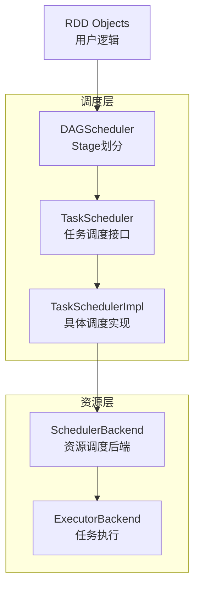
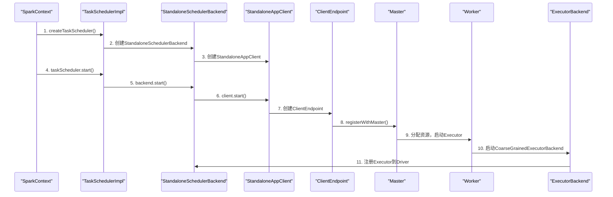
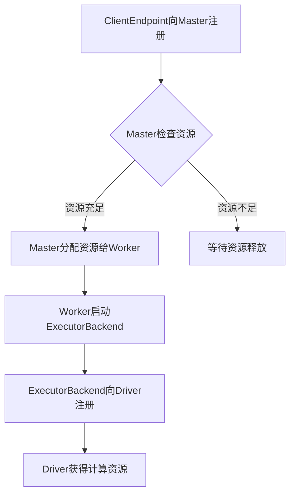

## 引言

Spark作为大数据处理领域的核心计算引擎，其高效的任务调度机制是实现高性能并行计算的关键。理解Spark的任务调度流程，特别是DAGScheduler、TaskScheduler和资源调度器之间的协作关系，对于优化Spark应用性能、排查任务执行问题至关重要。本文将深入剖析Spark任务调度的核心组件和工作流程，揭示Spark如何将用户逻辑转换为分布式任务并在集群中高效执行。

## 一、Spark任务调度总体架构

### 1.1 调度层次划分

Spark的任务调度采用**分层架构**，从高层次到低层次依次为：

1. **DAGScheduler** - 面向Job的Stage划分
2. **TaskScheduler** - 任务集调度接口
3. **SchedulerBackend** - 资源调度后端
4. **ExecutorBackend** - 具体执行器

### 1.2 调度流程图



## 二、DAGScheduler：Stage划分与调度

### 2.1 Stage划分原理

DAGScheduler是Spark调度系统的**核心大脑**，负责将Job分解为可执行的Stage：

- **Stage划分原则**：按照RDD的依赖关系（窄依赖/宽依赖）划分Stage
- **执行顺序**：从后往前划分Stage，从前往后执行Stage
- **并行计算**：每个Stage内部的任务逻辑完全相同，但处理不同数据分区

### 2.2 TaskSet提交机制

DAGScheduler以**TaskSet**的方式将Stage中的所有任务提交给TaskScheduler：

```scala
// TaskSet类定义
private[spark] class TaskSet(
    val tasks: Array[Task[_]],  // 任务数组
    val stageId: Int,           // Stage ID
    val stageAttemptId: Int,    // Stage尝试次数
    val priority: Int,          // 优先级
    val properties: Properties  // 属性
) {
    val id: String = stageId + "." + stageAttemptId
    override def toString: String = "TaskSet " + id
}
```

**设计原则**：DAGScheduler面向TaskScheduler接口提交任务，符合"依赖抽象而不依赖具体"的面向对象原则，实现了底层资源调度器的**可插拔性**。

## 三、TaskScheduler：任务调度接口

### 3.1 TaskScheduler接口设计

TaskScheduler是Spark任务调度的**抽象接口**，允许插入不同的任务调度程序：

```scala
private[spark] trait TaskScheduler {
    // 调度池和调度模式
    def rootPool: Pool
    def schedulingMode: SchedulingMode
    
    // 生命周期管理
    def start(): Unit
    def stop(): Unit
    
    // 任务提交与取消
    def submitTasks(taskSet: TaskSet): Unit
    def cancelTasks(stageId: Int, interruptThread: Boolean): Unit
    
    // 依赖注入
    def setDAGScheduler(dagScheduler: DAGScheduler): Unit
    
    // 资源管理
    def defaultParallelism(): Int
    def executorHeartbeatReceived(...): Boolean
    def executorLost(executorId: String, reason: ExecutorLossReason): Unit
    
    // 应用标识
    def applicationId(): String = appId
    def applicationAttemptId(): Option[String]
}
```

### 3.2 TaskSchedulerImpl：具体实现

TaskSchedulerImpl是TaskScheduler的**主要实现类**，在Standalone模式下使用：

```scala
// 初始化过程
private def createTaskScheduler(
    sc: SparkContext,
    master: String,
    deployMode: String): (SchedulerBackend, TaskScheduler) = {
    
    master match {
        case SPARK_REGEX(sparkUrl) =>
            // 1. 创建TaskSchedulerImpl
            val scheduler = new TaskSchedulerImpl(sc)
            
            // 2. 创建StandaloneSchedulerBackend
            val masterUrls = sparkUrl.split(",").map("spark://" + _)
            val backend = new StandaloneSchedulerBackend(scheduler, sc, masterUrls)
            
            // 3. 初始化调度器
            scheduler.initialize(backend)
            (backend, scheduler)
        // 其他模式处理...
    }
}
```

### 3.3 调度模式支持

TaskSchedulerImpl支持两种调度模式：

1. **FIFO（先进先出）** - 默认模式，任务按提交顺序执行
2. **FAIR（公平调度）** - 支持多用户公平共享资源

通过`SchedulableBuilder`接口实现不同调度策略：

```scala
private[spark] trait SchedulableBuilder {
    def rootPool: Pool
    def buildPools(): Unit
    def addTaskSetManager(manager: Schedulable, properties: Properties): Unit
}
```

## 四、SchedulerBackend：资源调度后端

### 4.1 SchedulerBackend接口

SchedulerBackend是**资源调度的抽象接口**，负责管理Executor资源：

```scala
private[spark] trait SchedulerBackend {
    // 生命周期管理
    def start(): Unit
    def stop(): Unit
    def reviveOffers(): Unit
    
    // 资源管理
    def defaultParallelism(): Int
    
    // 任务管理
    def killTask(taskId: Long, executorId: String, interruptThread: Boolean): Unit
    
    // 应用标识
    def applicationId(): String = appId
    def applicationAttemptId(): Option[String]
    
    // 日志管理
    def getDriverLogUrls: Option[Map[String, String]] = None
}
```

### 4.2 StandaloneSchedulerBackend：独立模式实现

StandaloneSchedulerBackend是Standalone模式下的**具体实现**：

```scala
private[spark] class StandaloneSchedulerBackend(
    scheduler: TaskSchedulerImpl,
    sc: SparkContext,
    masters: Array[String])
extends CoarseGrainedSchedulerBackend(scheduler, sc.env.rpcEnv)
with StandaloneAppClientListener
with Logging {
    
    private var client: StandaloneAppClient = null
    
    override def start() {
        // 创建应用描述
        val appDesc = new ApplicationDescription(
            sc.appName, 
            maxCores, 
            sc.executorMemory, 
            command, 
            webUrl, 
            sc.eventLogDir,
            sc.eventLogCodec,
            coresPerExecutor, 
            initialExecutorLimit
        )
        
        // 创建并启动StandaloneAppClient
        client = new StandaloneAppClient(sc.env.rpcEnv, masters, appDesc, this, conf)
        client.start()
        
        // 状态管理
        launcherBackend.setState(SparkAppHandle.State.SUBMITTED)
        waitForRegistration()
        launcherBackend.setState(SparkAppHandle.State.RUNNING)
    }
}
```

### 4.3 StandaloneAppClient：与集群管理器通信

StandaloneAppClient负责与Spark Standalone集群管理器**通信注册**：

```scala
private[spark] class StandaloneAppClient(
    rpcEnv: RpcEnv,
    masterUrls: Array[String],
    appDescription: ApplicationDescription,
    listener: StandaloneAppClientListener,
    conf: SparkConf
) extends Logging {
    
    // ClientEndpoint：RPC端点，负责向Master注册
    private class ClientEndpoint(override val rpcEnv: RpcEnv) 
        extends ThreadSafeRpcEndpoint with Logging {
        
        override def onStart(): Unit = {
            try {
                registerWithMaster(1)  // 启动时向Master注册
            } catch {
                case e: Exception =>
                    logWarning("Failed to connect to master", e)
                    markDisconnected()
                    stop()
            }
        }
    }
}
```

## 五、任务调度完整流程

### 5.1 组件启动时序图



### 5.2 详细启动流程

#### 步骤1：SparkContext初始化

```scala
class SparkContext(config: SparkConf) extends Logging {
    // 创建调度器
    val (sched, ts) = SparkContext.createTaskScheduler(this, master, deployMode)
    _schedulerBackend = sched
    _taskScheduler = ts
    _dagScheduler = new DAGScheduler(this)
    
    // 启动任务调度器
    _taskScheduler.start()
}
```

#### 步骤2：TaskSchedulerImpl启动

```scala
override def start() {
    // 启动后端资源调度器
    backend.start()
    
    // 启动推测执行机制（如果启用）
    if (!isLocal && conf.getBoolean("spark.speculation", false)) {
        logInfo("Starting speculative execution thread")
        speculationScheduler.scheduleAtFixedRate(new Runnable {
            override def run(): Unit = Utils.tryOrStopSparkContext(sc) {
                checkSpeculatableTasks()
            }
        }, SPECULATION_INTERVAL_MS, SPECULATION_INTERVAL_MS, TimeUnit.MILLISECONDS)
    }
}
```

#### 步骤3：Executor启动与注册

Worker启动Executor时，会创建`CoarseGrainedExecutorBackend`进程：

```scala
// CoarseGrainedExecutorBackend启动入口
def main(args: Array[String]) {
    // 解析参数...
    run(driverUrl, executorId, hostname, cores, appId, workerUrl, userClassPath)
    System.exit(0)
}

private def run(...) {
    // 创建Executor RPC端点
    env.rpcEnv.setupEndpoint("Executor", new CoarseGrainedExecutorBackend(
        env.rpcEnv, driverUrl, executorId, hostname, cores, userClassPath, env
    ))
}
```

## 六、核心设计模式分析

### 6.1 接口与实现分离

Spark调度系统采用**接口与实现分离**的设计模式：

- **TaskScheduler**作为接口，定义了任务调度的标准操作
- **TaskSchedulerImpl**作为具体实现，处理实际调度逻辑
- **SchedulerBackend**作为资源调度接口，支持多种集群管理器

### 6.2 事件驱动架构

Spark调度系统基于**RPC消息驱动**：

1. **DriverEndpoint** - Driver端的消息循环体
2. **ClientEndpoint** - 客户端消息循环体，负责注册应用
3. **CoarseGrainedExecutorBackend** - Executor端的消息循环体

### 6.3 资源管理策略

#### 6.3.1 资源申请流程



#### 6.3.2 容错机制

1. **任务重试**：Task失败时在TaskSetManager中重试
2. **Executor丢失处理**：`executorLost`方法处理Executor异常
3. **推测执行**：慢任务在其他节点并行执行，取先完成的结果

## 七、版本演进差异

### 7.1 Spark 2.1.1 vs 2.2.0

| 版本 | TaskScheduler接口变化 | StandaloneSchedulerBackend变化 |
|------|---------------------|------------------------------|
| 2.1.1 | 无killTaskAttempt方法 | ApplicationDescription第5参数为appUIAddress |
| 2.2.0 | 新增killTaskAttempt方法 | ApplicationDescription第5参数更改为webUrl |

```scala
// Spark 2.2.0新增方法
def killTaskAttempt(taskId: Long, interruptThread: Boolean, reason: String): Boolean
```

### 7.2 Yarn调度器实现

Spark支持多种集群管理器，Yarn模式下的调度器实现：

```scala
private[spark] class YarnScheduler(sc: SparkContext) extends TaskSchedulerImpl(sc) {
    // 机架感知支持
    override def getRackForHost(hostPort: String): Option[String] = {
        val host = Utils.parseHostPort(hostPort)._1
        Option(RackResolver.resolve(sc.hadoopConfiguration, host).getNetworkLocation)
    }
}

private[spark] class YarnClusterScheduler(sc: SparkContext) extends YarnScheduler(sc) {
    override def postStartHook() {
        ApplicationMaster.sparkContextInitialized(sc)
        super.postStartHook()
        logInfo("YarnClusterScheduler.postStartHook done")
    }
}
```

## 八、性能优化要点

### 8.1 调度优化策略

1. **数据本地性优化**：
   - PROCESS_LOCAL > NODE_LOCAL > RACK_LOCAL > ANY
   - TaskScheduler优先调度本地性好的任务

2. **动态资源分配**：
   - 根据负载动态调整Executor数量
   - 避免资源浪费和不足

3. **推测执行配置**：
   ```scala
   conf.set("spark.speculation", "true")
   conf.set("spark.speculation.multiplier", "1.5")  // 任务执行时间中位数的倍数
   conf.set("spark.speculation.quantile", "0.75")   // 任务完成比例阈值
   ```

### 8.2 常见问题排查

1. **任务调度延迟**：
   - 检查DAGScheduler的Stage划分是否合理
   - 检查TaskScheduler的调度队列深度

2. **资源分配失败**：
   - 检查StandaloneSchedulerBackend与Master连接
   - 检查Worker资源是否充足

3. **任务执行失败**：
   - 检查Executor日志
   - 检查数据本地性配置

## 九、总结与最佳实践

### 9.1 核心要点总结

1. **分层调度架构**：DAGScheduler → TaskScheduler → SchedulerBackend → Executor
2. **接口抽象设计**：通过接口实现调度器的可插拔性
3. **事件驱动通信**：基于RPC的消息循环体实现组件间通信
4. **资源动态管理**：支持多种集群管理器，实现资源动态分配

### 9.2 最佳实践建议

1. **合理配置调度模式**：
   - 单用户场景使用FIFO模式
   - 多用户共享集群使用FAIR模式

2. **优化数据本地性**：
   - 使用`persist()`缓存中间结果
   - 合理设计分区策略

3. **监控调度性能**：
   - 关注Stage划分的合理性
   - 监控任务调度延迟指标

4. **版本升级注意**：
   - 注意调度器接口的变化
   - 测试新版本的调度性能

### 9.3 未来演进方向

随着Spark的持续发展，调度系统也在不断优化：

1. **动态资源预测**：基于历史数据预测任务资源需求
2. **异构计算支持**：GPU、FPGA等异构设备调度
3. **跨集群调度**：支持多云、混合云环境调度
4. **智能调度算法**：基于机器学习的调度优化

通过深入理解Spark调度机制，开发者可以更好地优化应用性能，解决生产环境中的调度问题，充分发挥Spark在大数据处理中的威力。