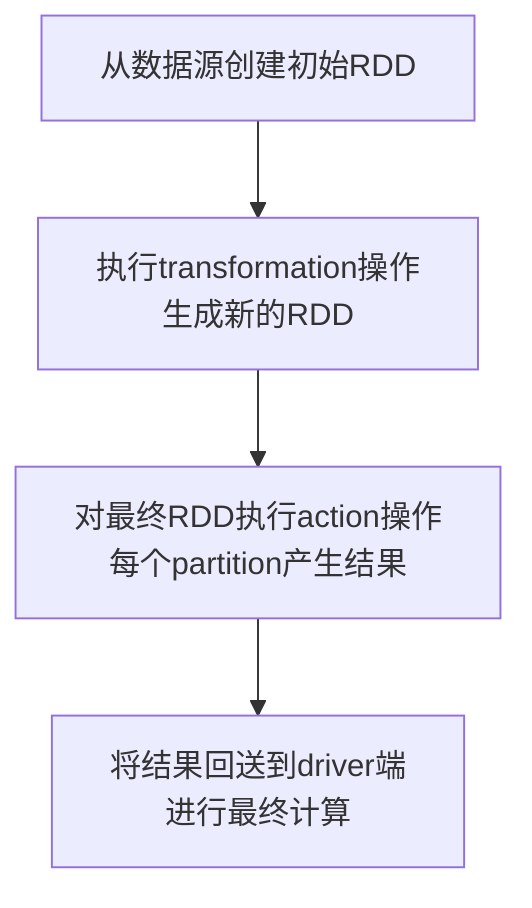
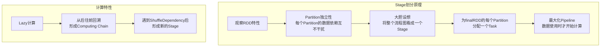
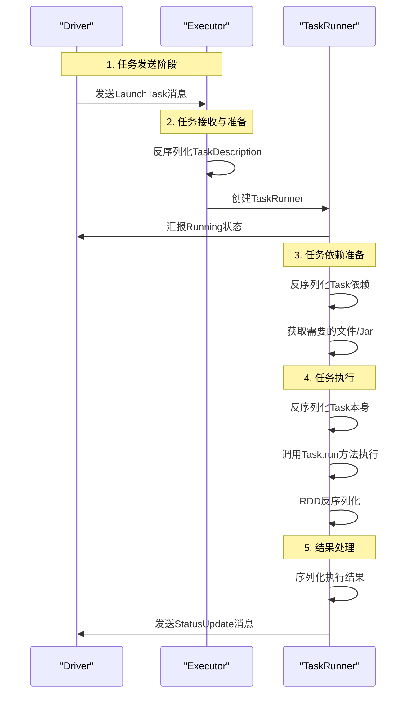
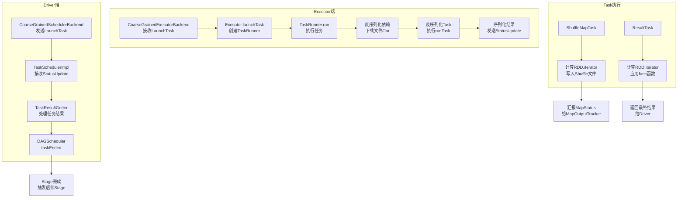

## 引言

在Spark分布式计算框架中，**Job**是用户程序执行的基本单位。理解Job何时产生、如何执行以及Task的生命周期，对于优化Spark应用程序性能、排查问题至关重要。本文将深入探讨Spark Job的触发机制、Stage划分原理以及Task执行的全过程，结合源码解析和实际案例，为你揭开Spark内部执行机制的神秘面纱。

## 一、Job的产生时机与执行流程

### 1.1 Job的逻辑执行图

一个典型的Spark Job执行包含以下四个关键步骤：



**具体执行流程：**

1. **数据源读取**：从本地文件、内存数据结构、HDFS、HBase等数据源读取数据，创建最初的RDD
2. **转换操作**：对RDD进行一系列的`transformation()`操作，每个转换会产生一个或多个包含不同类型T的`RDD[T]`
3. **行动操作**：对最后的final RDD进行`action()`操作，每个partition计算后产生结果result
4. **结果收集**：将result回送到driver端，进行最后的`f(list[result])`计算

### 1.2 RDD的特性

- **缓存机制**：RDD可以被Cache到内存或者checkpoint到磁盘上
- **分区灵活性**：RDD中的partition个数不固定，通常由用户设定
- **依赖关系多样性**：RDD和RDD间的partition依赖关系可以不是1对1，既有1对1关系，也有多对多关系

## 二、Job触发机制源码解析

### 2.1 Action算子触发Job

以RDD的`count()`方法为例，查看Job触发流程：

```scala
/**
 * 返回RDD中元素的数量
 */
def count(): Long = sc.runJob(this, Utils.getIteratorSize _).sum
```

从代码可以看出，`count()`方法触发`SparkContext.runJob`方法的调用，这是所有Action算子的共同入口。

### 2.2 SparkContext.runJob调用链

```scala
// 第一个重载方法
def runJob[T, U: ClassTag](rdd: RDD[T], func: Iterator[T] => U): Array[U] = {
  runJob(rdd, func, 0 until rdd.partitions.length)
}

// 第二个重载方法（带partitions参数）
def runJob[T, U: ClassTag](
  rdd: RDD[T],
  func: Iterator[T] => U,
  partitions: Seq[Int]): Array[U] = {
  val cleanedFunc = clean(func)
  runJob(rdd, (ctx: TaskContext, it: Iterator[T]) => cleanedFunc(it), partitions)
}

// 第三个重载方法（带resultHandler）
def runJob[T, U: ClassTag](
  rdd: RDD[T],
  func: (TaskContext, Iterator[T]) => U,
  partitions: Seq[Int],
  resultHandler: (Int, U) => Unit): Unit = {
  
  if (stopped.get()) {
    throw new IllegalStateException("SparkContext has been shutdown")
  }
  
  val callSite = getCallSite  // 记录方法调用栈
  val cleanedFunc = clean(func)  // 清除闭包，为了函数能够序列化
  
  logInfo("Starting Job: " + callSite.shortForm)
  
  if (conf.getBoolean("spark.logLineage", false)) {
    logInfo("RDD's recursive dependencies:\n" + rdd.toDebugString)
  }
  
  // 向高层调度器（DAGScheduler）提交Job
  dagScheduler.runJob(rdd, cleanedFunc, partitions, callSite, resultHandler, localProperties.get)
  
  progressBar.foreach(_.finishAll())
  rdd.doCheckpoint()
}
```

### 2.3 触发Job的算子案例

- **Spark Application**可以产生一个或多个Job
- `spark-shell`默认启动时内部没有Job，只是作为资源分配程序
- 普通程序中不同的Action一般会触发不同的Job
- 每个Action通常对应一个独立的Job

## 三、Stage划分原理与实现

### 3.1 Stage划分的核心思想

**核心问题**：给定Job的逻辑执行图，如何生成物理执行图（Task的类型和个数）？

**直观但低效的方案**：将前后关联的RDDs组成一个Stage，每个Stage生成一个Task

**存在的问题**：
1. **效率低下**：频繁的Stage切换带来额外开销
2. **存储压力**：大量中间数据需要存储，占用大量空间
3. **资源浪费**：每个RDD的数据都需要存起来

**Spark的优化方案**：最大化Pipeline



### 3.2 依赖类型与Stage划分

#### 3.2.1 窄依赖（Narrow Dependency）
- 一对一依赖
- range级别依赖，依赖固定的个数
- 随着数据规模扩大而改变
- **特点**：Stage内部基于内存迭代，也可以基于磁盘迭代

#### 3.2.2 宽依赖（Shuffle Dependency）
- 依赖很多对象
- 例如：`reduceByKey`、`groupByKey`等算子
- **特点**：DAGScheduler会划分成不同的Stage

### 3.3 Stage划分源码解析

#### 3.3.1 Job提交流程

```scala
// DAGSchedulerEvent.scala
private[scheduler] case class JobSubmitted(
  jobId: Int,
  finalRDD: RDD[_],
  func: (TaskContext, Iterator[_]) => _,
  partitions: Array[Int],
  callSite: CallSite,
  listener: JobListener,
  properties: Properties = null
) extends DAGSchedulerEvent
```

#### 3.3.2 事件处理循环

```scala
// DAGScheduler.scala
private def doOnReceive(event: DAGSchedulerEvent): Unit = event match {
  case JobSubmitted(jobId, rdd, func, partitions, callSite, listener, properties) =>
    dagScheduler.handleJobSubmitted(jobId, rdd, func, partitions, callSite, listener, properties)
    
  case MapStageSubmitted(jobId, dependency, callSite, listener, properties) =>
    dagScheduler.handleMapStageSubmitted(jobId, dependency, callSite, listener, properties)
  // ......
}
```

#### 3.3.3 Stage创建过程

在`handleJobSubmitted`方法中：
1. 首先创建finalStage
2. 创建finalStage时会建立父Stage的依赖链条
3. 根据宽依赖划分Stage边界

## 四、Task全生命周期详解

### 4.1 Task生命过程概述



### 4.2 Task执行详细流程

#### 4.2.1 任务启动阶段

**Driver端**：`CoarseGrainedSchedulerBackend`发送`LaunchTask`消息

**Executor端**：
1. `CoarseGrainedExecutorBackend`收到`LaunchTask`消息
2. 反序列化`TaskDescription`
3. 调用`executor.launchTask`执行Task
4. 创建`TaskRunner`（继承Runnable接口）
5. 在ThreadPool中运行具体的Task

#### 4.2.2 任务状态汇报

```scala
// ExecutorBackend接口定义
private[spark] trait ExecutorBackend {
  def statusUpdate(taskId: Long, state: TaskState, data: ByteBuffer): Unit
}

// CoarseGrainedExecutorBackend实现
override def statusUpdate(taskId: Long, state: TaskState, data: ByteBuffer) {
  val msg = StatusUpdate(executorId, taskId, state, data)
  driver match {
    case Some(driverRef) => driverRef.send(msg)
    case None => logWarning(s"Drop $msg because has not yet connected to driver")
  }
}
```

#### 4.2.3 四次反序列化过程

在执行具体Task的业务逻辑前，会进行四次反序列化：

| 序号 | 反序列化内容 | 说明 |
|------|-------------|------|
| 1 | TaskDescription | 任务描述信息 |
| 2 | Task的依赖 | 任务依赖的文件、Jar等 |
| 3 | Task本身 | 任务执行逻辑 |
| 4 | RDD | 计算数据 |

**源码示例**：
```scala
// Spark 2.2.0版本
val taskDesc = TaskDescription.decode(data.value)  // 第一次反序列化
executor.launchTask(this, taskDesc)

// TaskRunner内部
val (taskFiles, taskJars, taskProps, taskBytes) = 
  Task.deserializeWithDependencies(serializedTask)  // 第二次反序列化

updateDependencies(taskFiles, taskJars)  // 下载依赖

task = ser.deserialize[Task[Any]](taskBytes, Thread.currentThread.getContextClassLoader)  // 第三次反序列化
```

#### 4.2.4 依赖下载机制

```scala
private def updateDependencies(newFiles: Map[String, Long], newJars: Map[String, Long]) {
  lazy val hadoopConf = SparkHadoopUtil.get.newConfiguration(conf)
  synchronized {  // 同步块，多个Task线程共享资源
    for ((name, timestamp) <- newFiles if currentFiles.getOrElse(name, -1L) < timestamp) {
      logInfo("Fetching " + name + " with timestamp " + timestamp)
      Utils.fetchFile(name, new File(SparkFiles.getRootDirectory()), conf,
        env.securityManager, hadoopConf, timestamp, useCache = !isLocal)
      currentFiles(name) = timestamp
    }
    
    for ((name, timestamp) <- newJars) {
      val localName = name.split("/").last
      val currentTimeStamp = currentJars.get(name)
        .orElse(currentJars.get(localName))
        .getOrElse(-1L)
      if (currentTimeStamp < timestamp) {
        logInfo("Fetching " + name + " with timestamp " + timestamp)
        Utils.fetchFile(name, new File(SparkFiles.getRootDirectory()), conf,
          env.securityManager, hadoopConf, timestamp, useCache = !isLocal)
        currentJars(name) = timestamp
        
        // 添加到类加载器
        val url = new File(SparkFiles.getRootDirectory(), localName).toURI.toURL
        if (!urlClassLoader.getURLs().contains(url)) {
          logInfo("Adding " + url + " to class loader")
          urlClassLoader.addURL(url)
        }
      }
    }
  }
}
```

#### 4.2.5 Task执行核心逻辑

**Task.run方法调用链**：
```scala
final def run(
  taskAttemptId: Long,
  attemptNumber: Int,
  metricsSystem: MetricsSystem): T = {
  SparkEnv.get.blockManager.registerTask(taskAttemptId)
  context = new TaskContextImpl(...)
  TaskContext.setTaskContext(context)
  try {
    runTask(context)  // 调用抽象方法
  } finally {
    // 清理资源
  }
}
```

**Task类型与执行差异**：

| Task类型 | 执行逻辑 | 输出结果 |
|---------|---------|---------|
| ShuffleMapTask | 调用RDD.iterator计算，通过ShuffleWriter写入文件 | MapStatus（发送给MapOutputTracker） |
| ResultTask | 调用RDD.iterator计算，直接应用func函数 | 最终计算结果 |

**ShuffleMapTask执行**：
```scala
override def runTask(context: TaskContext): MapStatus = {
  val ser = SparkEnv.get.closureSerializer.newInstance()
  val (rdd, dep) = ser.deserialize[(RDD[_], ShuffleDependency[_, _, _])](...)
  val manager = SparkEnv.get.shuffleManager
  writer = manager.getWriter[Any, Any](dep.shuffleHandle, partitionId, context)
  writer.write(rdd.iterator(partition, context).asInstanceOf[Iterator[_ <: Product2[Any, Any]]])
  writer.stop(success = true).get
}
```

**ResultTask执行**：
```scala
override def runTask(context: TaskContext): U = {
  val ser = SparkEnv.get.closureSerializer.newInstance()
  val (rdd, func) = ser.deserialize[(RDD[T], (TaskContext, Iterator[T]) => U)](...)
  func(context, rdd.iterator(partition, context))
}
```

#### 4.2.6 RDD计算核心

```scala
// RDD.scala的iterator方法
final def iterator(split: Partition, context: TaskContext): Iterator[T] = {
  if (storageLevel != StorageLevel.NONE) {
    getOrCompute(split, context)  // 从存储中获取或计算
  } else {
    computeOrReadCheckpoint(split, context)  // 计算或从checkpoint读取
  }
}

private[spark] def computeOrReadCheckpoint(split: Partition, context: TaskContext): Iterator[T] = {
  if (isCheckpointedAndMaterialized) {
    firstParent[T].iterator(split, context)  // 从checkpoint读取
  } else {
    compute(split, context)  // 实际计算
  }
}
```

**具体RDD的compute方法**（以MapPartitionsRDD为例）：
```scala
override def compute(split: Partition, context: TaskContext): Iterator[U] =
  f(context, split.index, firstParent[T].iterator(split, context))
```

其中`f`就是在当前Stage中计算具体Partition的业务逻辑代码。

#### 4.2.7 结果处理与返回

**结果大小处理策略**：

| 结果大小 | 处理方式 | 说明 |
|---------|---------|------|
| > 1GB | 返回IndirectTaskResult元数据 | 超出最大结果限制 |
| 128MB ~ 1GB | 存入BlockManager，返回IndirectTaskResult | 间接返回 |
| < 128MB | 直接返回序列化结果 | 直接返回 |

**源码实现**：
```scala
val serializedResult: ByteBuffer = {
  if (maxResultSize > 0 && resultSize > maxResultSize) {
    // 结果超过1GB，返回元数据
    ser.serialize(new IndirectTaskResult[Any](TaskResultBlockId(taskId), resultSize))
  } else if (resultSize > maxDirectResultSize) {
    // 结果128MB~1GB，存入BlockManager
    val blockId = TaskResultBlockId(taskId)
    env.blockManager.putBytes(
      blockId,
      new ChunkedByteBuffer(serializedDirectResult.duplicate()),
      StorageLevel.MEMORY_AND_DISK_SER)
    ser.serialize(new IndirectTaskResult[Any](blockId, resultSize))
  } else {
    // 结果小于128MB，直接返回
    serializedDirectResult
  }
}
```

**关键配置参数**：
```scala
// 最大结果大小：默认1GB
private val maxResultSize = Utils.getMaxResultSize(conf)

// 直接返回的最大大小：取spark.task.maxDirectResultSize和128MB的最小值
private val maxDirectResultSize = Math.min(
  conf.getSizeAsBytes("spark.task.maxDirectResultSize", 1L << 20),
  RpcUtils.maxMessageSizeBytes(conf))
```

#### 4.2.8 结果处理流程

**Driver端接收结果**：
```scala
// CoarseGrainedSchedulerBackend.scala - DriverEndpoint
override def receive: PartialFunction[Any, Unit] = {
  case StatusUpdate(executorId, taskId, state, data) =>
    scheduler.statusUpdate(taskId, state, data.value)
    if (TaskState.isFinished(state)) {
      executorDataMap.get(executorId) match {
        case Some(executorInfo) =>
          executorInfo.freeCores += scheduler.CPUS_PER_TASK
          makeOffers(executorId)  // 释放资源，重新调度
        case None =>
          logWarning(s"Ignored task status update ($taskId state $state)" +
            s"from unknown executor with ID $executorId")
      }
    }
}
```

**TaskSchedulerImpl处理结果**：
```scala
def statusUpdate(tid: Long, state: TaskState, serializedData: ByteBuffer) {
  // ... 状态检查
  
  if (TaskState.isFinished(state)) {
    cleanupTaskState(tid)
    taskSet.removeRunningTask(tid)
    if (state == TaskState.FINISHED) {
      taskResultGetter.enqueueSuccessfulTask(taskSet, tid, serializedData)  // 成功任务
    } else if (Set(TaskState.FAILED, TaskState.KILLED, TaskState.LOST).contains(state)) {
      taskResultGetter.enqueueFailedTask(taskSet, tid, state, serializedData)  // 失败任务
    }
  }
}
```

**TaskResultGetter处理成功任务**：
```scala
def enqueueSuccessfulTask(
  taskSetManager: TaskSetManager,
  tid: Long,
  serializedData: ByteBuffer): Unit = {
  getTaskResultExecutor.execute(new Runnable {
    override def run(): Unit = Utils.logUncaughtExceptions {
      try {
        val (result, size) = serializer.get().deserialize[TaskResult[_]](serializedData) match {
          case directResult: DirectTaskResult[_] =>
            // 直接结果处理
            directResult.value(taskResultSerializer.get())
            (directResult, serializedData.limit())
            
          case IndirectTaskResult(blockId, size) =>
            // 间接结果处理：从BlockManager获取
            val serializedTaskResult = sparkEnv.blockManager.getRemoteBytes(blockId)
            if (!serializedTaskResult.isDefined) {
              scheduler.handleFailedTask(taskSetManager, tid, TaskState.FINISHED, TaskResultLost)
              return
            }
            val deserializedResult = serializer.get().deserialize[DirectTaskResult[_]](
              serializedTaskResult.get.toByteBuffer)
            deserializedResult.value(taskResultSerializer.get())
            sparkEnv.blockManager.master.removeBlock(blockId)
            (deserializedResult, size)
        }
        
        // 更新累加器
        result.accumUpdates = result.accumUpdates.map { a =>
          if (a.name == Some(InternalAccumulator.RESULT_SIZE)) {
            val acc = a.asInstanceOf[LongAccumulator]
            assert(acc.sum == 0L, "task result size should not have been set on the executors")
            acc.setValue(size.toLong)
            acc
          } else {
            a
          }
        }
        
        scheduler.handleSuccessfulTask(taskSetManager, tid, result)
      } catch {
        case cnf: ClassNotFoundException =>
          taskSetManager.abort("ClassNotFound with classloader: " + loader)
        case NonFatal(ex) =>
          logError("Exception while getting task result", ex)
          taskSetManager.abort("Exception while getting task result: %s".format(ex))
      }
    }
  })
}
```

#### 4.2.9 任务完成处理

**TaskSetManager.handleSuccessfulTask**：
```scala
def handleSuccessfulTask(tid: Long, result: DirectTaskResult[_]): Unit = {
  val info = taskInfos(tid)
  val index = info.index
  info.markFinished(TaskState.FINISHED, clock.getTimeMillis())
  
  if (speculationEnabled) {
    successfulTaskDurations.insert(info.duration)  // 记录成功任务耗时
  }
  
  removeRunningTask(tid)
  
  // 杀掉同一任务的其他尝试（因为一次尝试成功）
  for (attemptInfo <- taskAttempts(index) if attemptInfo.running) {
    logInfo(s"Killing attempt ${attemptInfo.attemptNumber} for task ${attemptInfo.id} " +
      s"in stage ${taskSet.id} (TID ${attemptInfo.taskId}) on ${attemptInfo.host} " +
      s"as the attempt ${info.attemptNumber} succeeded on ${info.host}")
    sched.backend.killTask(attemptInfo.taskId, attemptInfo.executorId, 
      interruptThread = true, reason = "another attempt succeeded")
  }
  
  if (!successful(index)) {
    tasksSuccessful += 1
    logInfo(s"Finished task ${info.id} in stage ${taskSet.id} (TID ${info.taskId}) in" +
      s" ${info.duration} ms on ${info.host} (executor ${info.executorId})" +
      s" ($tasksSuccessful/$numTasks)")
    
    successful(index) = true
    if (tasksSuccessful == numTasks) {
      isZombie = true
    }
  }
  
  sched.dagScheduler.taskEnded(tasks(index), Success, result.value(), result.accumUpdates, info)
  maybeFinishTaskSet()
}
```

### 4.3 Task执行总结



## 五、部署模式与Stage划分

### 5.1 部署模式对比

| 部署模式 | Driver位置 | 适用场景 | 优缺点 |
|---------|-----------|---------|--------|
| Client模式 | 提交任务的机器 | 开发、测试 | 优点：可以看到详细日志<br>缺点：Driver与Worker网络通信频繁 |
| Cluster模式 | Master分配的Worker | 生产环境 | 优点：Driver在集群内，网络通信高效<br>缺点：日志查看不便 |

**Client模式特点**：
- 专门使用一台机器提交Spark程序
- 配置和普通Worker配置一样
- 必须和Cluster Manager在同样的网络环境中
- Driver频繁和所有Executor交互，网络通信频繁

**Cluster模式特点**：
- 真正的Driver由Master决定在Worker中的某一台机器
- Master分配的第一个Executor就是Driver级别的Executor
- 不推荐学习、开发时使用（无法直接看到日志信息）

### 5.2 Stage划分总结

1. **划分依据**：宽依赖（Shuffle Dependency）
2. **触发条件**：Action算子导致`SparkContext.runJob`执行
3. **执行顺序**：后面的Stage依赖于前面的Stage，只有前面依赖的Stage计算完毕后，后面的Stage才会运行
4. **划分过程**：
   - `DAGScheduler.submitJob`发送`JobSubmitted`对象
   - `eventProcessLoop`处理事件，路由到`handleJobSubmitted`
   - 创建finalStage，建立父Stage依赖链条

## 六、性能优化与最佳实践

### 6.1 最大化Pipeline

**核心思想**：数据被使用的时候才开始计算

**实现方式**：
1. 从数据流动视角：数据流动到计算的位置
2. 从物理执行角度：最为高效地运行
3. 从算法构建角度：算子作用于数据

**关键洞察**：每个Stage中除了最后一个RDD算子是真实的，前面的算子都是"假的"（通过Computing Chain回溯计算）

### 6.2 内存管理优化

**TaskMemoryManager**：负责Task执行期间的内存管理

**关键配置**：
- `spark.driver.maxResultSize`：Driver端最大结果大小（默认1GB）
- `spark.task.maxDirectResultSize`：直接返回的最大结果大小
- `spark.rpc.message.maxSize`：RPC消息最大大小（默认128MB）

### 6.3 推测执行机制

**speculationEnabled**：默认`false`，用于推测执行慢的任务

**工作原理**：
1. 记录成功任务的持续时间（`successfulTaskDurations`）
2. 确定何时启动推测性任务
3. 避免不使用堆时增加堆中的开销

## 七、总结与展望

### 7.1 核心要点回顾

1. **Job触发**：Action算子是Job的触发器，通过`SparkContext.runJob`启动执行流程
2. **Stage划分**：基于宽依赖划分，最大化Pipeline优化
3. **Task生命周期**：从Driver发送到Executor执行，经历四次反序列化和完整计算流程
4. **结果处理**：根据结果大小采用不同策略，保证大数据量下的稳定传输

### 7.2 版本演进注意

从源码分析可以看出，Spark 2.x版本相比1.x版本在Task执行机制上有重要改进：
- 序列化任务大小限制从`akkaFrameSize`调整为`maxRpcMessageSize`
- 任务描述反序列化方式优化
- 推测执行机制更加完善
- 黑名单跟踪机制引入

### 7.3 实际应用建议

1. **开发阶段**：使用Client模式，便于调试和日志查看
2. **生产环境**：考虑Cluster模式，提高网络通信效率
3. **性能调优**：关注Stage划分，避免不必要的Shuffle
4. **内存管理**：合理配置结果大小参数，避免OOM
5. **监控排查**：理解Task生命周期，快速定位执行瓶颈

通过深入理解Spark Job的执行机制，开发者可以更好地优化应用程序，充分利用Spark的分布式计算能力，构建高效、稳定的大数据处理系统。