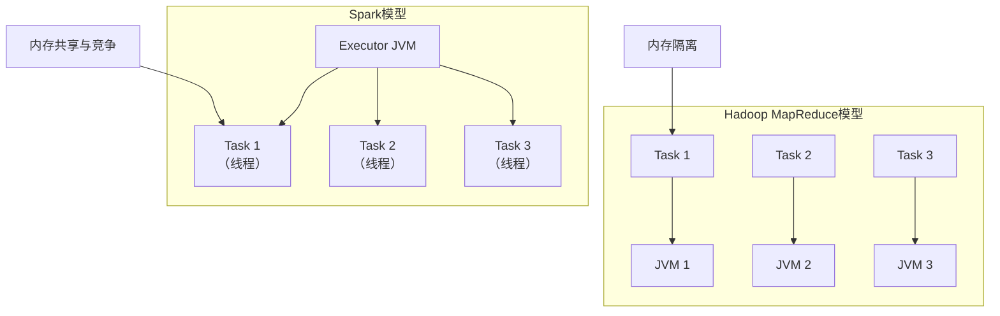
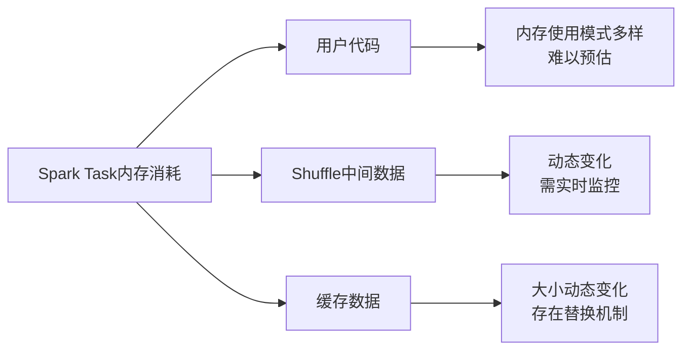
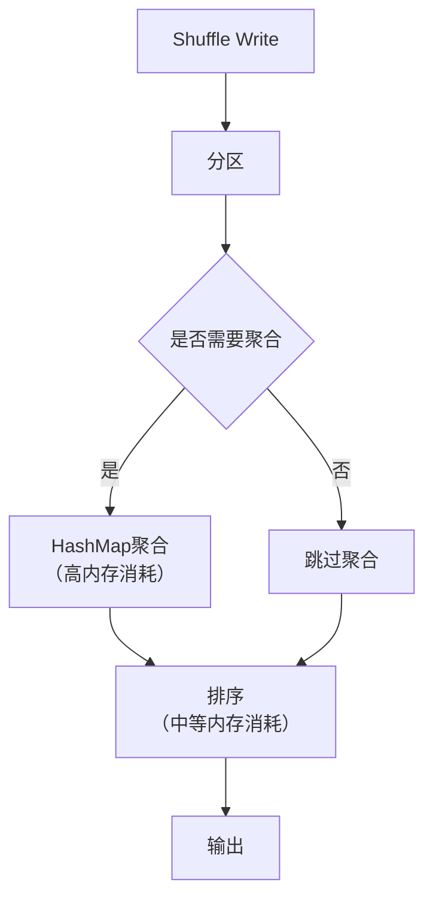
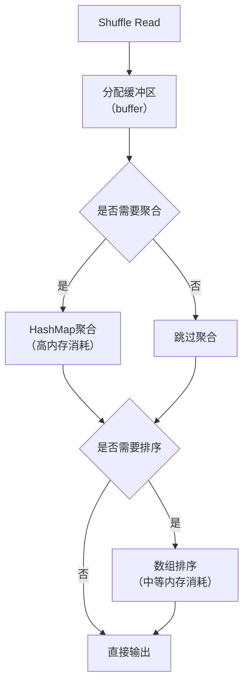
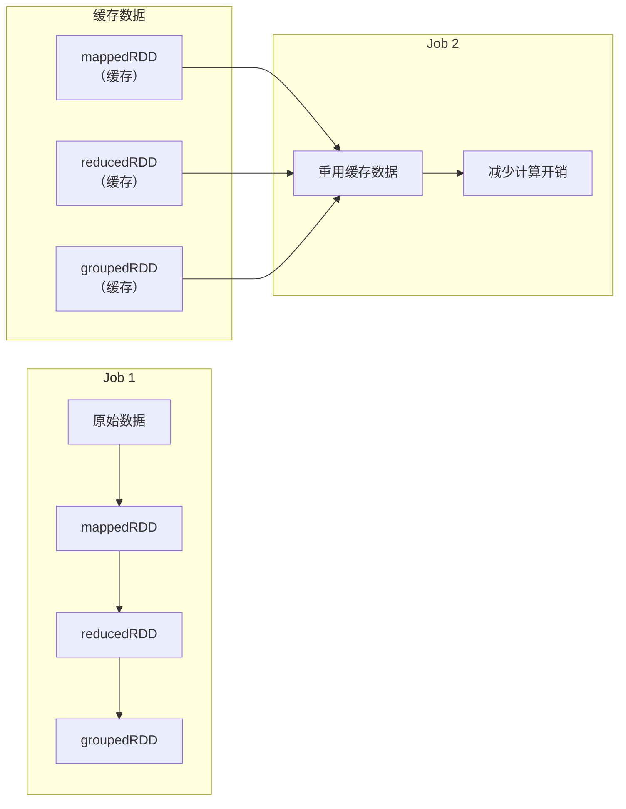

## 引言

在大数据处理领域，**内存管理**是决定系统性能的关键因素之一。与传统软件系统相比，Spark等大数据处理框架需要在内存中处理海量数据，并利用内存缓存来避免重复计算，这使得内存管理面临**前所未有的挑战**。理解这些挑战及其解决方案，对于优化Spark应用性能至关重要。

## 一、Spark内存管理面临的三大挑战

### 1. 内存消耗来源多样化，难以统一管理

Spark运行时内存消耗主要来自三个方面，这些来源**相互竞争**有限的内存资源：

| 内存消耗来源   | 具体内容                                                     | 管理难点         |
| -------- | -------------------------------------------------------- | ------------ |
| **框架处理** | Shuffle Write/Read过程中的聚合、排序数据结构（如HashMap、Array）          | 与用户数据混合，难以隔离 |
| **数据缓存** | 重复使用的RDD缓存，避免重复计算                                        | 需要平衡缓存与计算内存  |
| **用户代码** | 在`reduceByKey(func)`、`mapPartitions(func)`等操作中用户自定义的数据结构 | 内存使用模式不可预测   |

**核心问题**：如何在有限内存空间内，**统一管理**这些不同类型的缓存和计算数据？如何**平衡**数据计算与缓存的内存消耗？

### 2. 内存消耗动态变化，难以预估

Spark内存消耗具有**高度动态性**，为内存分配和回收带来困难：

- **Shuffle内存消耗**：与Shuffle数据量、分区个数、用户自定义聚合函数相关，**难以提前预估**
- **用户代码内存消耗**：与func的计算逻辑、输入数据量有关，**同样难以预估**
- **内存对象生命周期不同**：不同来源的内存对象存活时间差异大，何时回收、如何分配合适大小的内存空间成为挑战

### 3. Task之间共享内存，导致内存竞争

与Hadoop MapReduce不同，Spark采用**线程模型**，多个task运行在同一个Executor JVM中：



**挑战**：如何平衡内存共享带来的性能优势与内存竞争带来的稳定性风险？

## 二、Spark应用内存消耗来源分析

### 内存消耗定义
- **Hadoop MapReduce**：map/reduce task进程的内存消耗
- **Spark**：
  - 微观：task线程的内存消耗
  - 宏观：Executor JVM的内存消耗

### 内存消耗三大来源



### 2.1 用户代码内存消耗

#### 两种内存使用模式

1. **流式处理模式**
   ```scala
   // 示例：filter操作，内存消耗可忽略不计
   val filteredRDD = inputRDD.filter(record => record > 10)
   ```
   - 特点：每读入一条数据，立即处理并输出
   - 内存消耗：极低

2. **中间结果存储模式**
   ```scala
   // 示例：GroupByTest中的flatMap操作
   val arr1 = new ArrayBuffer[String]()  // 中间计算结果存储
   val result = inputRDD.flatMap(line => {
       val arr = line.split(" ")
       for (i <- 0 until arr.length) {
           arr1 += arr(i)  // 中间计算结果存入数组
       }
       arr1
   })
   ```
   - 特点：中间计算结果被存储在内存中
   - 内存消耗：可能较高

#### 影响因素
- **输入数据大小**：决定产生多少中间计算结果
- **func的空间复杂度**：决定多少中间结果被保存在内存中
- **预估难度**：Spark可获取输入数据信息，但中间结果大小由用户代码决定，**难以预先估计**

### 2.2 Shuffle机制中的中间数据内存消耗

#### Shuffle Write阶段内存消耗


- **分区过程**：计算partitionId，内存消耗可忽略
- **聚合过程**：使用HashMap进行聚合，**占用大量内存**
- **排序过程**：使用数组保存record，消耗一定内存

#### Shuffle Read阶段内存消耗


- **数据获取**：分配缓冲区暂存record
- **聚合过程**：使用HashMap聚合，**占用大量内存**
- **排序过程**：建立数组排序，消耗一定内存

#### 影响因素
1. **Shuffle方式**：不同操作使用不同类型Shuffle
   - `sortByKey()`：不需要聚合过程
   - `reduceByKey(func)`：需要聚合过程
2. **Shuffle数据量**：直接影响中间数据大小
3. **聚合函数空间复杂度**：影响中间计算结果大小

**管理策略**：Spark采用**动态监测**方法，监控HashMap等数据结构大小，动态调整长度，内存不足时将数据spill到磁盘。

### 2.3 缓存数据内存消耗

#### 缓存的应用场景
- **迭代型应用**：当前job产生的数据被后续job重用
- **复杂应用**：多个job共享中间结果

#### 示例：复杂应用中的缓存数据


**实际应用示例**：
- **PageRank**：缓存输入图，每轮迭代直接从缓存中计算
- **机器学习**：缓存训练数据，提高迭代读取和训练效率

#### 影响因素
- **需要缓存的RDD大小**
- **缓存级别**（内存、磁盘、序列化等）
- **是否序列化**

**管理难点**：
1. **无法提前预测**缓存数据大小
2. **动态监控**：只能在写入过程中监控当前缓存数据大小
3. **动态变化**：缓存数据存在替换和回收机制，大小动态变化

## 三、Spark内存管理优化方向

### 1. 构建高效可靠的内存管理机制
Spark不断改进内存管理机制，目标是在多样化、动态变化的内存消耗场景下，实现**高效、可靠**的内存管理。

### 2. 优化策略总结
基于上述分析，Spark内存管理机制的优化需要关注：

| 优化方向 | 具体策略 |
|----------|----------|
| **统一管理** | 设计统一的内存管理器，平衡计算与缓存内存 |
| **动态监控** | 实时监控内存使用，动态调整数据结构 |
| **内存隔离** | 在共享内存模型中实现一定程度的task内存隔离 |
| **预测优化** | 基于历史数据预测内存需求，优化分配策略 |

## 总结

Spark内存管理面临的挑战源于其**高性能设计理念**：通过内存计算和缓存加速数据处理。这些挑战的本质是**资源有限性与需求多样性**之间的矛盾。

**关键洞察**：
1. **内存消耗的多样性**要求Spark必须设计灵活的内存分配策略
2. **内存消耗的动态性**要求实时监控和动态调整
3. **内存共享模型**在提升性能的同时引入了竞争风险

理解这些挑战是优化Spark应用性能的第一步。在实际应用中，开发者需要：
- **监控内存使用模式**，识别瓶颈
- **合理配置内存参数**，平衡不同用途的内存分配
- **优化用户代码**，减少不必要的中间结果存储

通过深入理解Spark内存管理机制，开发者可以更好地利用Spark的高性能特性，构建更高效的大数据处理应用。

---
**补充说明**：本文档基于Spark内存管理的基础原理整理，实际应用中还需结合具体版本（如Spark 2.x或3.x）的内存管理实现细节进行调整和优化。