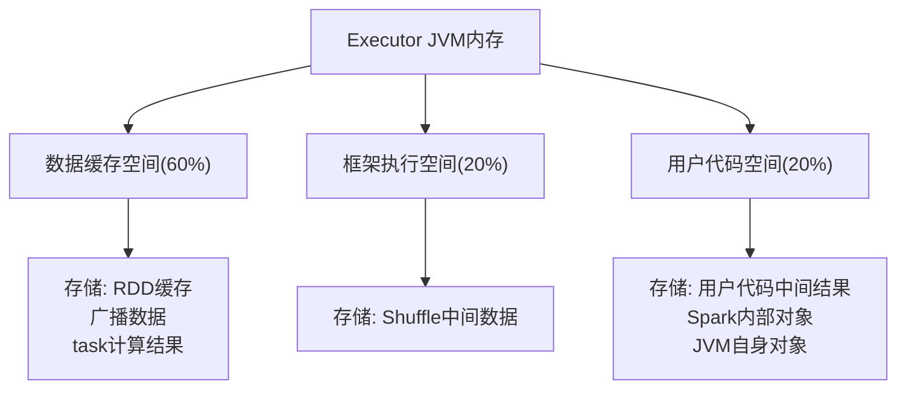
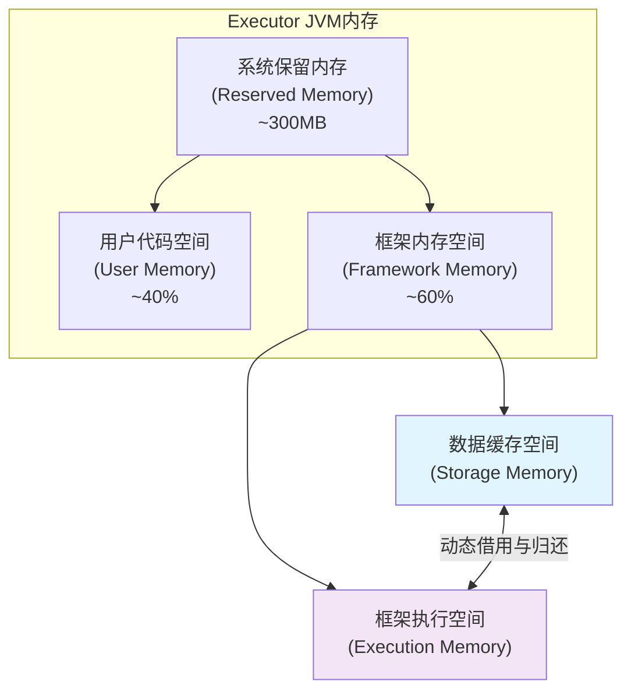
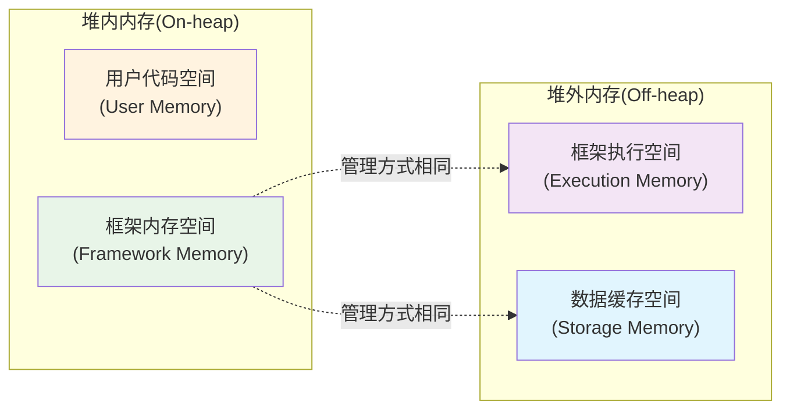
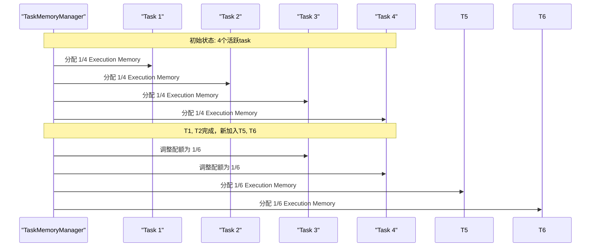
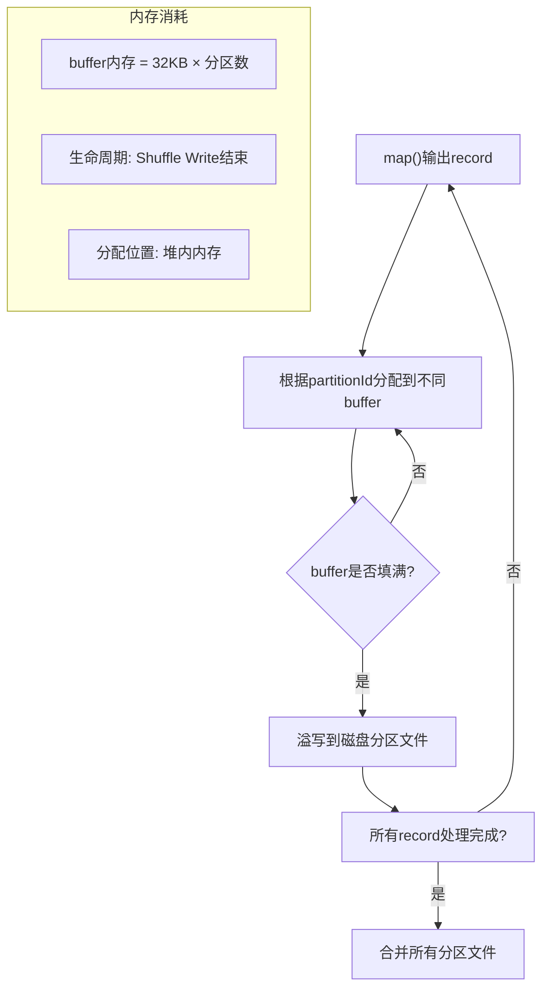
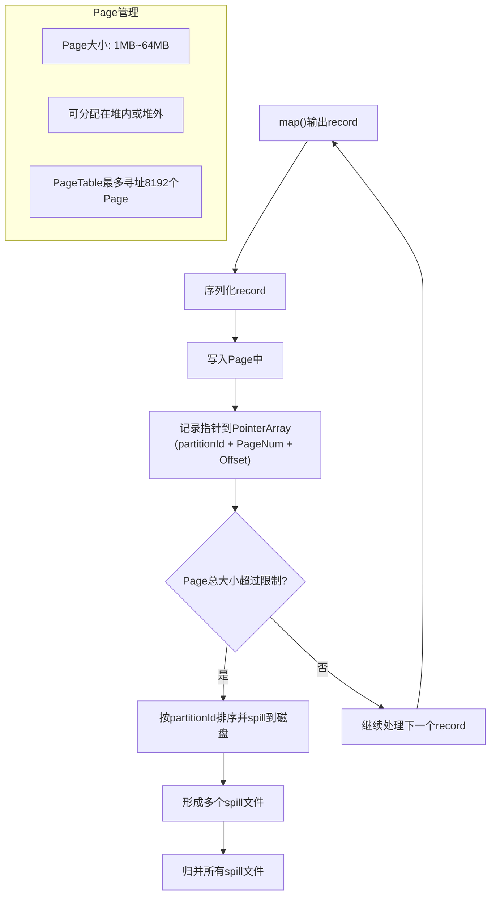
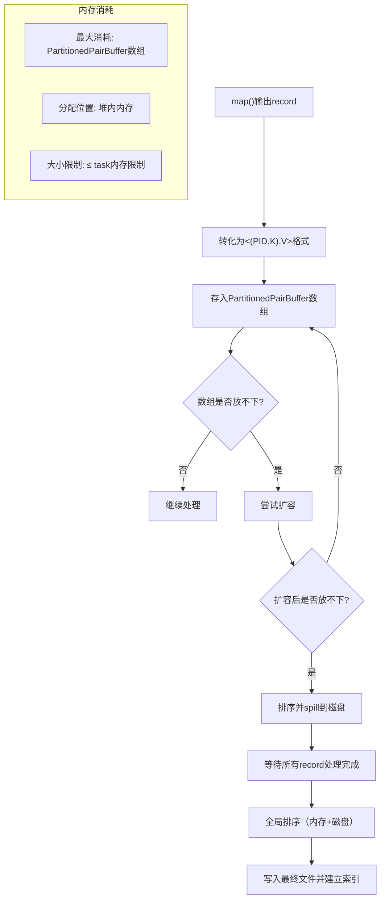
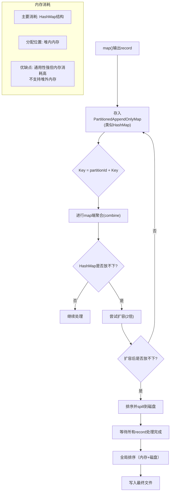
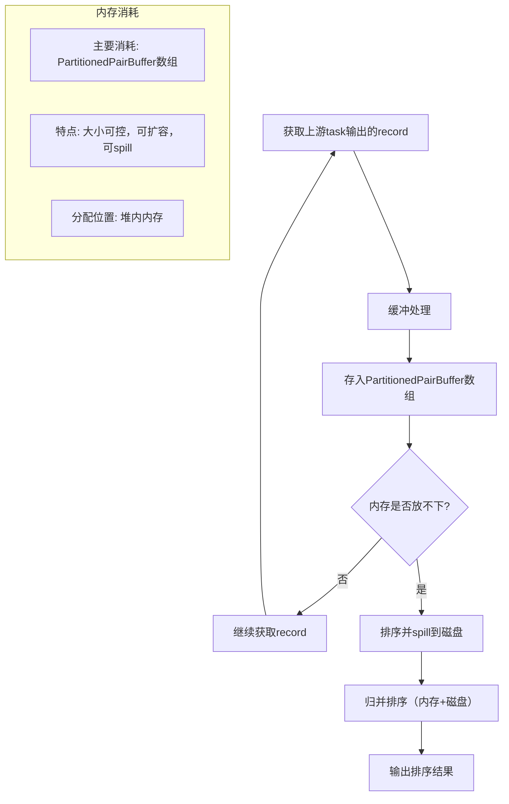
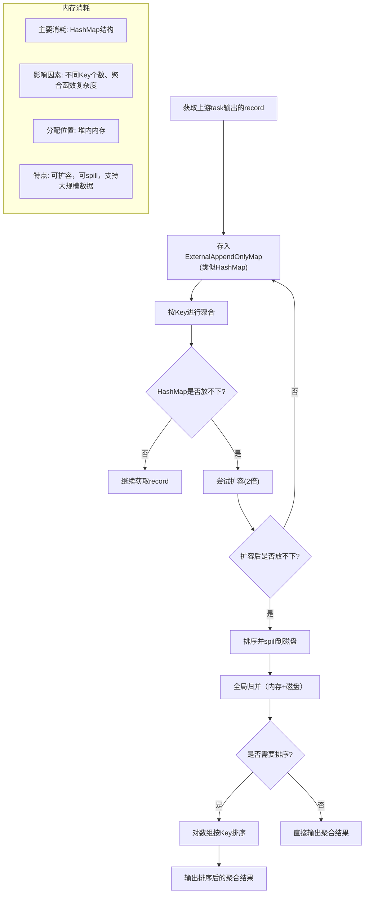

## 引言

在分布式计算框架中，**内存管理**是决定系统性能、稳定性和资源利用率的关键因素。Spark作为内存计算框架的典型代表，其内存管理机制比传统的Hadoop MapReduce更加复杂和精细。理解Spark的内存管理模型，不仅有助于优化应用性能，还能有效避免内存溢出、GC频繁等常见问题，是Spark开发和调优的核心技能。

## 一、Spark内存管理概述

### 1.1 内存管理的挑战

与Hadoop MapReduce不同，Spark中的task是Executor JVM中的一个线程，多个task共享Executor JVM的进程空间。这种架构带来了两个核心挑战：

1. **多源内存消耗平衡**：需要平衡用户代码、Shuffle中间数据、数据缓存等多种来源的内存消耗
2. **task间内存共享与竞争**：多个task共享内存空间，需要公平的资源分配机制

### 1.2 内存消耗的三大来源

| 内存类型 | 主要用途 | 特点 |
|---------|---------|------|
| **数据缓存空间** | 存储RDD缓存数据、广播数据、task计算结果 | 可被监控，可被驱逐 |
| **框架执行空间** | 存储Shuffle机制中的中间数据 | 可被监控，可spill到磁盘 |
| **用户代码空间** | 存储用户代码的中间计算结果、Spark内部对象、JVM自身对象 | 难以监控和估计 |

## 二、Spark内存管理模型演进

### 2.1 静态内存管理模型（Spark 1.6之前）

**核心思想**：将内存空间硬性划分为三个固定比例的分区



**静态内存管理特点**：

- **优点**：角色分明，实现简单
- **缺点**：
  - 分区间存在"硬"界限，难以动态平衡
  - 容易造成内存资源浪费或内存溢出
  - 用户难以确定合适的比例配置
  - 无法适应运行时内存需求的变化

**适用场景限制**：
- GroupBy、join等需要大量Shuffle空间的操作容易受限
- 不需要缓存但用户代码复杂的应用容易内存不足

### 2.2 统一内存管理模型（Spark 1.6+）

**核心创新**：引入"软"界限，动态调整内存配额

#### 2.2.1 内存空间划分



#### 2.2.2 关键配置参数

| 参数 | 默认值 | 说明 |
|------|--------|------|
| `spark.testing.ReservedMemory` | 300MB | 系统保留内存大小 |
| `spark.memory.fraction` | 0.6 | Framework Memory占比 |
| `spark.memory.storageFraction` | 0.5 | Storage Memory初始占比 |
| `spark.memory.offHeap.size` | 0 | 堆外内存大小 |

#### 2.2.3 动态调整机制

1. **数据缓存空间不足时**：
   - 可以向框架执行空间借用空闲空间
   - 当框架执行需要空间时，需要"归还"借用的空间
   - 可能通过移除缓存数据来归还空间

2. **框架执行空间不足时**：
   - 可以向数据缓存空间借用空间
   - 但需保证数据缓存空间至少有50%左右的空间
   - 借走的空间**不会归还**给数据缓存空间（实现难度大）

3. **溢出处理机制**：
   - 框架执行空间不足 → 将Shuffle数据spill到磁盘
   - 数据缓存空间不足 → 进行缓存替换、移除缓存数据

#### 2.2.4 堆外内存支持

**堆外内存特点**：
- 类似C/C++的malloc空间，不受JVM GC管理
- 需要手动释放空间
- 只存储序列化对象数据

**使用场景**：
- 用户通过`spark.memory.offHeap.size`设置堆外内存大小
- SerializedShuffle方式可以利用堆外内存进行Shuffle Write
- 使用`rdd.persist(OFF_HEAP)`可将RDD存储到堆外内存



## 三、内存共享与竞争机制

### 3.1 task内存配额管理

由于Executor中存在多个task，框架执行空间实际上由多个task共享：

**内存分配策略**：
- 每个task可使用的内存空间被均分
- 空间大小控制在 `[1/2N, 1/N] × ExecutorMemory` 内
- 其中N是当前活跃的task数目

**动态调整示例**：


### 3.2 内存使用限制

**重要限制**：
- 该策略同时适用于堆内和堆外内存中的Execution Memory
- 用户代码空间固定大小，无法动态调整
- 用户代码可能超过分配空间，侵占框架内存，导致内存溢出

## 四、Shuffle阶段内存消耗与管理

### 4.1 Shuffle Write阶段内存分析

Shuffle Write的主要操作：partition、sort、merge等，需要buffer、HashMap等数据结构

#### 4.1.1 Shuffle Write方式分类

| 条件 | Shuffle Write方式 | 内存特点 | 适用场景 |
|------|------------------|----------|----------|
| **无map端聚合、无排序**<br>分区数 ≤ 200 | BypassMergeSortShuffleWriter | 堆内buffer，内存消耗：`32KB × 分区数` | 分区数少的情况 |
| **无map端聚合、无排序**<br>分区数 > 200 | SerializedShuffleWriter | 可使用堆外内存，序列化存储，分页管理 | 分区数多，支持序列化重定位 |
| **无map端聚合、需要排序** | SortShuffleWriter<br>(KeyOrdering=true) | 堆内数组(PartitionedPairBuffer) | 需要按Key排序 |
| **需要map端聚合** | SortShuffleWriter<br>(mapSideCombine=true) | 堆内HashMap(PartitionedAppendOnlyMap) | 需要map端聚合 |

#### 4.1.2 各种Shuffle Write方式内存消耗详解

**1. BypassMergeSortShuffleWriter（分区数 ≤ 200）**



**内存消耗特点**：
- 每个分区对应一个32KB的buffer
- 总内存消耗 = 32KB × 分区数 × task数
- 适用于分区数较少的情况（≤200）

**2. SerializedShuffleWriter（分区数 > 200）**



**Serialized Shuffle的优点**：
1. **内存效率高**：序列化record占用空间小
2. **空间利用率高**：分页利用内存碎片，不需要连续空间
3. **排序效率高**：排序元数据而非record本身
4. **GC开销低**：直接操作二进制数据
5. **支持堆外内存**：减少GC压力

**使用条件**：
- 不需要map端聚合和排序
- 序列化类支持序列化Value位置互换（KryoSerializer支持）
- 分区数 < 16,777,216
- 单个序列化record < 128MB

**内存消耗**：
- PointerArray + Page + 排序额外空间 ≤ task内存限制
- **注意**：单个数据结构不能同时使用堆内和堆外内存

**3. SortShuffleWriter（KeyOrdering=true）**



**4. SortShuffleWriter（mapSideCombine=true）**



### 4.2 Shuffle Read阶段内存分析

Shuffle Read需要实现：数据获取 → 聚合 → 排序 的通用框架

#### 4.2.1 Shuffle Read方式分类

| 条件 | Shuffle Read方式 | 主要数据结构 | 适用操作 |
|------|------------------|--------------|----------|
| **无聚合、无排序** | 基于buffer直接处理 | 48MB缓冲区 | `partitionBy()`等 |
| **无聚合、需要排序** | 基于数组排序 | PartitionedPairBuffer数组 | `sortByKey()`等 |
| **有聚合** | 基于HashMap聚合 | ExternalAppendOnlyMap | `reduceByKey()`等 |

#### 4.2.2 各种Shuffle Read方式内存消耗

**1. 无聚合、需要排序的情况**



**2. 有聚合的情况（需要/不需要排序）**



## 五、内存管理最佳实践与调优建议

### 5.1 配置参数调优

```yaml
# 内存配置示例
spark.executor.memory: "8g"                    # Executor总内存
spark.memory.fraction: 0.6                     # Framework Memory占比
spark.memory.storageFraction: 0.5              # Storage Memory初始占比
spark.memory.offHeap.size: "2g"                # 堆外内存大小（可选）
spark.executor.memoryOverhead: "1g"            # 堆外内存开销
spark.shuffle.spill: true                      # 启用spill机制
```

### 5.2 应用开发建议

1. **合理使用缓存**：
   - 频繁使用的RDD进行缓存
   - 根据数据特点选择合适的存储级别
   - 及时释放不再需要的缓存

2. **优化Shuffle操作**：
   - 减少Shuffle数据量（使用map-side reduce）
   - 合理设置分区数
   - 考虑使用Serialized Shuffle（满足条件时）

3. **监控内存使用**：
   - 使用Spark UI监控各内存分区使用情况
   - 关注GC时间和频率
   - 监控spill到磁盘的数据量

### 5.3 常见问题与解决方案

| 问题现象 | 可能原因 | 解决方案 |
|---------|---------|---------|
| **Executor频繁Full GC** | 堆内内存中Java对象过多 | 1. 使用堆外内存<br>2. 使用序列化存储<br>3. 减少小对象创建 |
| **Shuffle spill过多** | Execution Memory不足 | 1. 增加executor内存<br>2. 调整`spark.memory.fraction`<br>3. 减少分区数 |
| **缓存效率低** | Storage Memory不足 | 1. 调整`spark.memory.storageFraction`<br>2. 使用DISK_ONLY或OFF_HEAP存储级别<br>3. 增加总内存 |
| **内存溢出(OOM)** | 用户代码占用过多内存 | 1. 优化用户代码内存使用<br>2. 增加`spark.executor.memory`<br>3. 使用更高效的数据结构 |

## 六、总结与展望

### 6.1 Spark内存管理核心要点

1. **统一内存管理模型**通过"软"界限实现了内存的动态调整，比静态模型更加灵活高效
2. **堆外内存支持**减少了GC开销，特别适合大规模数据处理场景
3. **task间公平共享**机制确保了多任务环境下的资源公平性
4. **spill机制**作为内存不足时的安全网，保证了作业的稳定运行

### 6.2 未来发展方向

1. **更智能的内存预测**：基于机器学习预测内存需求，提前调整配额
2. **细粒度内存管理**：针对不同操作类型提供更精细的内存优化
3. **异构内存支持**：更好地利用NVMe、PMem等新型存储介质
4. **自适应调优**：根据运行时情况自动调整内存相关参数

### 6.3 实际应用场景分析

**场景一：实时推荐系统**
- 特点：需要频繁更新模型，大量Shuffle操作
- 优化重点：增大Execution Memory比例，使用Serialized Shuffle

**场景二：历史数据分析**
- 特点：需要缓存中间结果，减少重复计算
- 优化重点：增大Storage Memory比例，合理设置缓存级别

**场景三：图计算应用**
- 特点：用户代码复杂，产生大量中间对象
- 优化重点：增大User Memory比例，优化数据结构

通过深入理解Spark内存管理模型，开发人员可以更好地设计和优化Spark应用，在保证稳定性的前提下最大化性能，充分发挥Spark作为内存计算框架的优势。