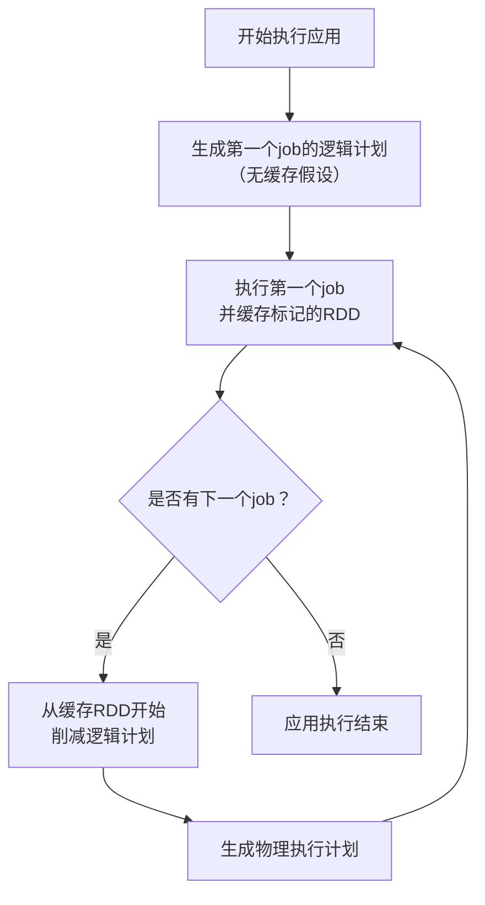
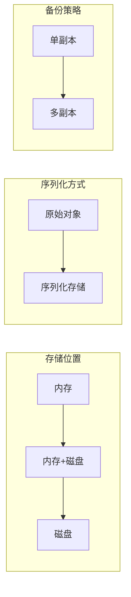
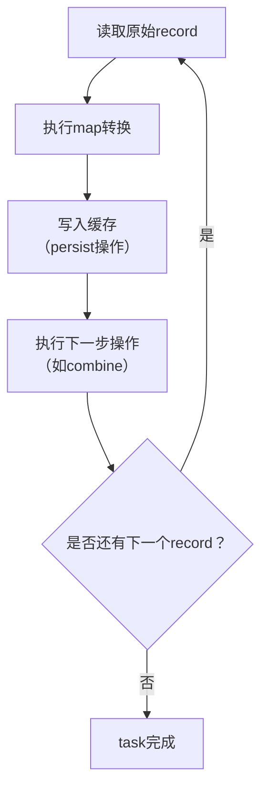
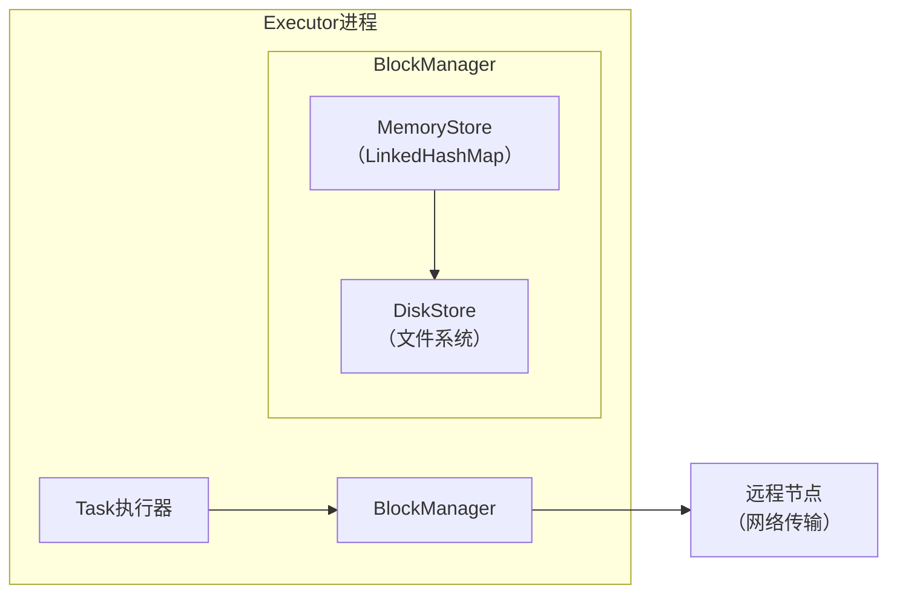
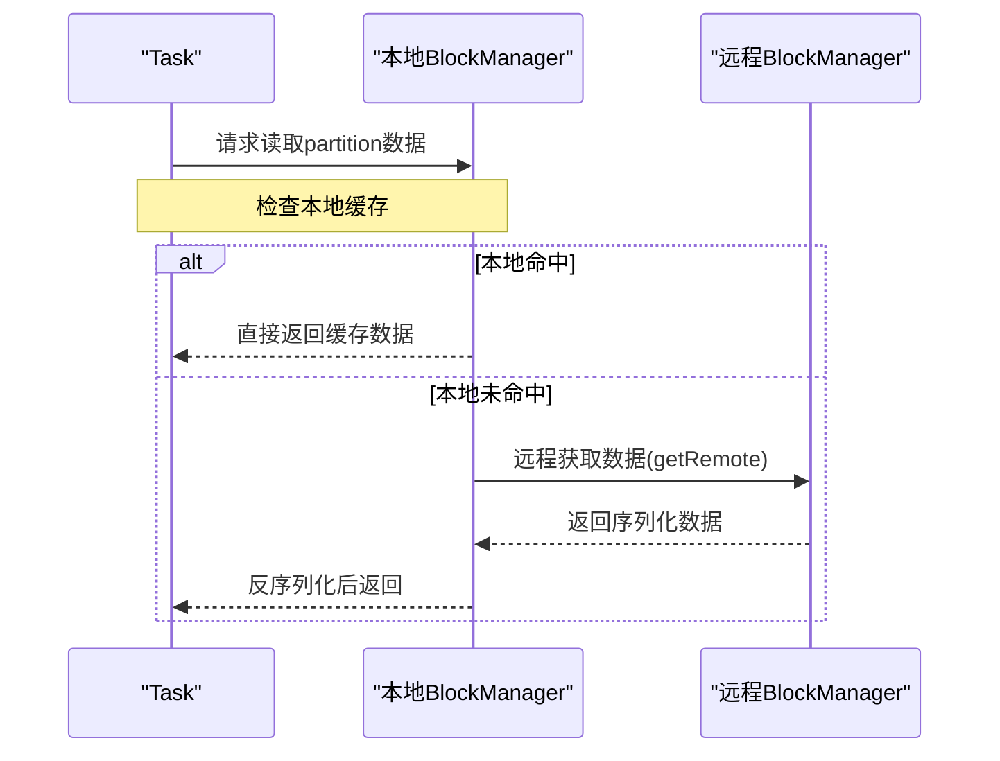
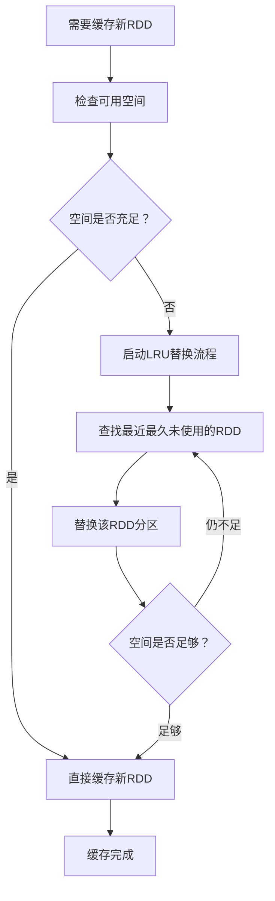

在大数据处理中，计算速度往往受限于数据读取的I/O瓶颈。Spark作为领先的分布式计算框架，其核心优势之一便是**数据缓存机制**。通过将重复使用的中间数据存储在内存或磁盘中，Spark能够显著减少重复计算，从而加速迭代型算法和交互式查询。本章将深入剖析Spark缓存机制的设计原理、实现细节与最佳实践。

## 1. 数据缓存的意义

缓存的核心思想是**以空间换时间**。在计算过程中，某些数据可能被多个作业或任务重复使用。如果每次使用都重新计算或从慢速存储中读取，将造成大量时间浪费。

### 1.1 应用场景

| 场景类型 | 特点 | 缓存价值 |
|---------|------|---------|
| **迭代型应用** | 每轮迭代使用相同的输入数据（如训练数据、图数据） | 避免每轮迭代重新加载数据，大幅减少I/O时间 |
| **交互式应用** | 对同一数据集执行多次不同的查询分析（如交互式SQL） | 加速后续查询，提升用户体验 |
| **共享RDD的应用** | 多个作业共享同一个中间RDD计算结果 | 避免重复计算相同转换逻辑 |

### 1.2 缓存的价值

```scala
// 示例：没有缓存的情况
val inputRDD = sc.textFile("data.txt")
val mappedRDD = inputRDD.map(line => (line.split(",")(0).toInt + 1, line))

// 第一个作业：reduceByKey操作
val reducedRDD = mappedRDD.reduceByKey(_ + _)
reducedRDD.foreach(println)

// 第二个作业：groupByKey操作
val groupedRDD = mappedRDD.groupByKey()
groupedRDD.foreach(println)
```

**问题**：上述代码中，`mappedRDD`被两个作业共享使用，但如果没有缓存，第二个作业仍会从`inputRDD`开始重新计算`map`操作。

## 2. 数据缓存机制的设计原理

### 2.1 决定哪些数据需要被缓存

并非所有数据都适合缓存，选择缓存目标需要考虑三个关键因素：

1. **数据重用频率**：被多个作业共享使用的次数越多，缓存性价比越高
2. **数据大小**：过大的数据会占用大量存储空间，可能导致内存不足
3. **避免重复缓存**：如果缓存了某个RDD，其通过`OneToOneDependency`连接的父RDD就不需要再缓存

**缓存决策的权衡**：
- **计算代价**：重新计算数据的成本
- **存储代价**：缓存数据占用的空间成本

当计算代价很低（如简单的`map`操作）而存储代价很高时，可能不值得缓存。

### 2.2 缓存应用时的处理流程

当应用包含缓存操作时，Spark的处理流程如下：



**规则说明**：
1. 第一个job按正常逻辑生成执行计划
2. 后续job从最近的缓存RDD开始，削减之前的计算依赖
3. 削减后的逻辑计划再转为物理执行计划

### 2.3 缓存级别（Storage Level）

Spark提供了多种缓存级别，从三个维度进行配置：



#### 缓存级别分类表

| 缓存级别 | 存储位置 | 序列化 | 备份 | 适用场景 |
|---------|---------|-------|-----|---------|
| **MEMORY_ONLY** | 内存 | 否 | 否 | 内存充足，数据可完全放入内存 |
| **MEMORY_ONLY_SER** | 内存 | 是 | 否 | 内存有限，需减少存储空间 |
| **MEMORY_AND_DISK** | 内存+磁盘 | 否 | 否 | 数据可能超出内存，允许磁盘溢出 |
| **MEMORY_AND_DISK_SER** | 内存+磁盘 | 是 | 否 | 大数据集，需序列化节省空间 |
| **DISK_ONLY** | 磁盘 | 是 | 否 | 数据量大，内存不足，可接受磁盘I/O |
| **OFF_HEAP** | 堆外内存 | 是 | 否 | 避免GC影响，提高性能 |

**缓存级别选择建议**：
1. **内存充足时**：优先使用`MEMORY_ONLY`，性能最佳
2. **内存有限但数据重要**：使用`MEMORY_AND_DISK`，系统自动处理溢出
3. **数据序列化影响**：序列化可减少存储空间，但增加CPU开销

### 2.4 缓存数据的写入方法

#### 写入时机：Lazy执行
```scala
val rdd = sc.parallelize(1 to 100)
val cachedRDD = rdd.map(_ * 2).cache()  // 此时只是标记，不实际缓存

// 只有触发action操作时，才会实际执行缓存
cachedRDD.count()  // 此时开始计算并缓存数据
```

#### 写入顺序：先缓存后计算
在流水线执行中，每个record的计算和缓存顺序如下：



**关键点**：每个record计算出来后立即缓存，然后再进行后续操作，确保缓存数据不丢失。

#### 写入实现：BlockManager架构


**MemoryStore实现细节**：
- 使用`LinkedHashMap`存储缓存分区
- Key格式：`rddId_partitionId`（如`rdd_1_0`）
- Value：分区中的实际数据
- 基于双向链表实现，天然支持LRU替换策略

### 2.5 缓存数据的读取方法

#### 读取判断机制
当RDD被缓存后，其分区变为`CachedPartitions`。后续作业需要读取时：
1. 检查RDD依赖链中是否有缓存标记
2. 优先从缓存中读取，避免重新计算

#### 读取流程


**读取优化**：
- **本地优先**：Task优先从同一Executor的缓存读取
- **远程读取**：跨节点读取需要序列化/反序列化
- **流水线处理**：远程读取时边读边处理，减少等待时间

### 2.6 用户接口设计

Spark提供了简洁的缓存API：

```scala
// 1. 缓存操作
val rdd = sc.parallelize(1 to 100)

// 缓存到内存（默认）
rdd.cache()

// 指定缓存级别
rdd.persist(StorageLevel.MEMORY_AND_DISK)

// 2. 缓存回收
rdd.unpersist()  // 同步阻塞，默认
rdd.unpersist(blocking = false)  // 异步执行

// 3. 查看缓存信息
println(rdd.getStorageLevel)  // 获取存储级别
println(rdd.toDebugString)    // 查看缓存分区信息
```

**重要限制**：
- 只能对用户程序中显式创建的RDD进行缓存操作
- Spark内部自动生成的中间RDD（如`CoGroupedRDD`）无法直接操作

### 2.7 缓存数据的替换与回收

#### 自动缓存替换（LRU策略）
当内存空间不足时，Spark采用LRU算法进行缓存替换：



**LRU实现特点**：
- 基于`LinkedHashMap`双向链表自动维护访问顺序
- 最近访问的分区移动到链表头部
- 链表尾部的分区最先被替换
- 同一RDD的分区不会相互替换

#### 用户主动回收
用户可以通过`unpersist()`主动回收缓存，但需要注意执行时机：

```scala
// 示例：不同位置的unpersist()产生不同效果

// 情况1：缓存后立即回收，实际没有缓存
val rdd = sc.parallelize(1 to 100).map(_ * 2)
rdd.cache()
rdd.unpersist()  // 立即回收，实际没有缓存效果
rdd.count()      // 重新计算

// 情况2：第一个job使用缓存，第二个job前回收
rdd.cache()
rdd.count()      // 第一个job，使用缓存
rdd.unpersist()  // 回收缓存
rdd.map(_ + 1).count()  // 第二个job，重新计算

// 情况3：所有job完成后回收（推荐）
rdd.cache()
rdd.count()      // 使用缓存
rdd.map(_ + 1).count()  // 使用缓存
rdd.unpersist()  // 最后回收
```

**最佳实践**：
1. 在确认不再需要缓存数据时调用`unpersist()`
2. 避免在action操作前调用`unpersist()`，否则缓存无效
3. 对于长时间运行的应用，及时回收不再需要的缓存

## 3. 缓存机制对比：Spark vs Hadoop MapReduce

| 特性 | Spark缓存机制 | Hadoop MapReduce缓存 |
|------|-------------|-------------------|
| **缓存粒度** | RDD分区级别，细粒度 | 文件级别，粗粒度 |
| **缓存位置** | 内存优先，磁盘溢出 | 主要是磁盘缓存 |
| **缓存管理** | 自动LRU替换 + 用户控制 | 手动管理，无自动替换 |
| **序列化** | 支持多种序列化方式 | 固定序列化格式 |
| **API友好性** | 简单易用的`cache()`/`persist()` | 配置复杂，API不直观 |
| **性能影响** | 显著加速迭代计算 | 对重复作业有一定加速 |

**Spark缓存优势**：
1. **内存优先**：充分利用内存速度优势
2. **细粒度控制**：可精确控制缓存内容和级别
3. **自动化管理**：LRU自动替换减少手动干预
4. **与计算集成**：缓存作为计算流程的自然部分

## 4. 实际应用建议

### 4.1 缓存策略选择

```scala
// 根据数据特征选择缓存级别
def chooseStorageLevel(rdd: RDD[_], isCritical: Boolean): StorageLevel = {
  val sizeEstimate = rdd.count() * 100 // 简单估算，实际需更精确
  
  if (sizeEstimate < 100 * 1024 * 1024) { // 小于100MB
    StorageLevel.MEMORY_ONLY
  } else if (sizeEstimate < 1 * 1024 * 1024 * 1024) { // 小于1GB
    if (isCritical) StorageLevel.MEMORY_AND_DISK
    else StorageLevel.MEMORY_ONLY_SER
  } else { // 大于1GB
    StorageLevel.DISK_ONLY
  }
}
```

### 4.2 监控缓存效果

```scala
// 通过Spark UI监控缓存使用情况
// 1. 缓存命中率
// 2. 缓存数据大小
// 3. 缓存回收情况

// 编程方式获取缓存信息
val rdd = sc.parallelize(1 to 1000).cache()
rdd.count()

// 查看存储信息
println(s"Storage Level: ${rdd.getStorageLevel.description}")
println(s"Is Cached: ${rdd.getStorageLevel != StorageLevel.NONE}")

// 通过SparkContext获取缓存数据统计
val statuses = sc.getExecutorMemoryStatus
statuses.foreach { case (execId, (usedMem, maxMem)) =>
  println(s"Executor $execId: $usedMem/$maxMem MB used")
}
```

### 4.3 常见问题与解决方案

| 问题 | 现象 | 解决方案 |
|------|------|---------|
| **内存不足** | Task失败，OOM错误 | 1. 使用`MEMORY_AND_DISK`级别<br>2. 增加Executor内存<br>3. 使用序列化存储 |
| **缓存未生效** | 作业执行时间没有改善 | 1. 检查`cache()`位置是否在action前<br>2. 确认数据是否真的被重用<br>3. 检查`unpersist()`调用时机 |
| **磁盘I/O瓶颈** | 缓存到磁盘后性能反而下降 | 1. 评估重新计算成本<br>2. 使用SSD磁盘<br>3. 调整序列化方式 |
| **缓存数据丢失** | 节点故障后缓存失效 | 1. 使用带副本的缓存级别<br>2. 实现检查点机制<br>3. 重要数据持久化到可靠存储 |

## 5. 总结

Spark的数据缓存机制是其性能优势的关键所在。通过智能的缓存策略，Spark能够：

1. **显著加速迭代计算**：避免重复计算和I/O开销
2. **提升资源利用率**：合理利用内存和存储资源
3. **简化开发复杂度**：提供简单易用的API接口
4. **自适应不同场景**：支持多种缓存级别和替换策略

**最佳实践要点**：
- 缓存会被多个作业重用的中间数据
- 根据数据大小和重要性选择合适的缓存级别
- 监控缓存效果，及时调整策略
- 合理使用`unpersist()`管理缓存生命周期
- 结合检查点机制保证重要数据的可靠性

缓存机制体现了大数据处理中经典的时空权衡思想，正确使用缓存能够让Spark应用性能得到数量级的提升。在实际开发中，需要结合具体业务场景和数据特征，不断调优缓存策略，以达到最佳的性能表现。