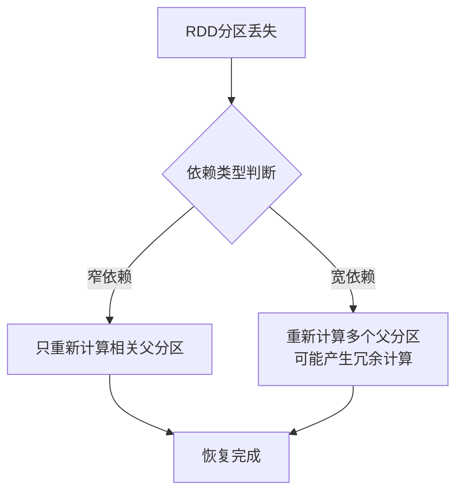
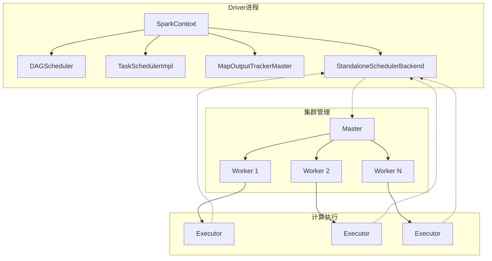
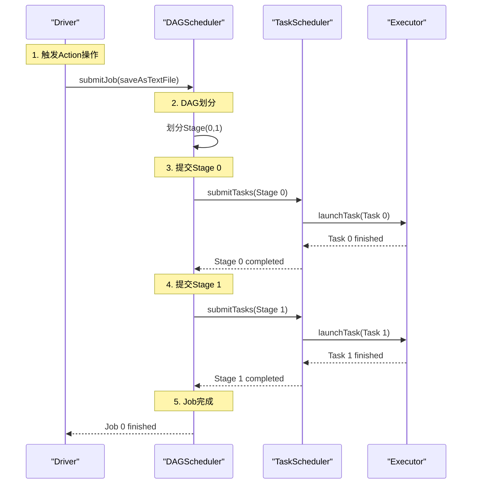

## 导语：Spark的容错艺术

在分布式计算领域，容错机制是系统稳定性的生命线。Apache Spark作为领先的大数据处理框架，其卓越的容错能力是其能够处理PB级数据的关键保障。理解Spark的容错原理和Runtime生命周期，对于构建可靠、高效的大数据应用至关重要。

## 一、RDD容错原理：依赖关系决定恢复策略

### 1.1 RDD依赖关系分类

Spark的容错机制与RDD（弹性分布式数据集）的依赖关系密切相关。RDD之间的依赖关系主要分为两类：

| 依赖类型 | 定义 | 特点 | 容错影响 |
|---------|------|------|---------|
| **窄依赖** | 父RDD的每个分区最多被子RDD的一个分区使用 | 1:1或1:n（n有限）的映射关系 | 局部恢复，高效 |
| **宽依赖** | 父RDD的一个分区被子RDD的多个分区使用 | 1:n的映射关系，涉及Shuffle | 需要全局恢复，代价较高 |

### 1.2 基于依赖关系的容错处理

#### 窄依赖的容错处理
当窄依赖的计算出现错误时，由于子RDD分区**只依赖于父RDD的特定分区**，系统只需重新计算出错分区所依赖的父RDD分区数据。这种局部恢复机制避免了不必要的重复计算，效率极高。

#### 宽依赖的容错处理
宽依赖场景下，子RDD的一个分区丢失可能需要重新计算父RDD的**多个甚至所有分区**，因为父RDD的数据会被多个子RDD分区共享使用。这会导致**冗余计算开销**和性能浪费。



## 二、Spark容错机制的三大层面与四大要点

### 2.1 容错机制的三大层面

Spark的容错机制是一个多层次、全方位的体系，主要分为三个层面：

#### 1. 调度层容错
- **DAG生成层**：Stage输出失败时，上层调度器DAGScheduler进行重试
- **Task计算层**：Task任务失败时，底层调度器进行重试（默认最多4次）

#### 2. RDD Lineage血统层容错
Spark基于RDD的Lineage（血统）实现容错，每个RDD都记录了自己是如何从其他RDD转换而来的。当部分计算结果丢失时，可以根据Lineage重新计算。

#### 3. Checkpoint层容错
通过将RDD写入磁盘作为检查点，为Lineage容错提供辅助支持。当Lineage过长导致容错成本过高时，检查点可以显著减少恢复开销。

### 2.2 容错四大核心要点

1. **Stage输出失败**：上层调度器DAGScheduler重试
2. **Task内部任务失败**：底层调度器重试
3. **RDD Lineage血统计算**：基于窄依赖和宽依赖的恢复策略
4. **Checkpoint缓存**：通过磁盘检查点减少恢复成本

## 三、调度层容错实现细节

### 3.1 DAG生成层容错源码分析

当Stage输出失败时，DAGScheduler的`resubmitFailedStages`方法负责重试失败的Stage：

```scala
private[scheduler] def resubmitFailedStages() {
  // 判断是否存在失败的Stages
  if (failedStages.size > 0) {
    logInfo("Resubmitting failed stages")
    clearCacheLocs()
    
    // 获取所有失败Stage的列表
    val failedStagesCopy = failedStages.toArray
    failedStages.clear()  // 清空failedStages
    
    // 对之前获取的所有失败的Stage，根据jobId排序后逐一重试
    for (stage <- failedStagesCopy.sortBy(_.firstJobId)) {
      submitStage(stage)
    }
  }
}
```

### 3.2 Task计算层容错源码分析

Task任务失败时，TaskSetManager的`handleFailedTask`方法处理失败逻辑：

```scala
def handleFailedTask(tid: Long, state: TaskState, reason: TaskFailedReason) {
  // ...
  if (!isZombie && reason.countTowardsTaskFailures) {
    taskSetBlacklistHelperOpt.foreach(_.updateBlacklistForFailedTask(
      info.host, info.executorId, index))
    assert (null != failureReason)
    
    // 对失败的Task的numFailures进行计数加一
    numFailures(index) += 1
    
    // 判断失败的Task计数是否大于设定的最大失败次数
    if (numFailures(index) >= maxTaskFailures) {
      logError(s"Task $index in stage ${taskSet.id} failed $maxTaskFailures times; aborting job")
      abort(s"Task $index in stage ${taskSet.id} failed $maxTaskFailures times, most recent failure: $failureReason\nDriver stacktrace:", failureException)
      return
    }
  }
  
  // 如果运行的Task为0时，则完成Task步骤
  maybeFinishTaskSet()
}
```

## 四、RDD Lineage血统层容错

### 4.1 Lineage容错原理

Spark采用**高度受限的分布式共享内存**模型，新的RDD只能通过其他RDD上的批量操作创建。这种设计使得RDD的Lineage成为容错的核心：

- **窄依赖恢复优势**：子RDD分区丢失时，只需重算父RDD的对应分区，无冗余计算
- **宽依赖恢复劣势**：子RDD分区丢失可能导致重算多个父RDD分区，产生冗余计算

### 4.2 Lineage容错的实际效益

基于Lineage的容错机制使Spark在迭代计算方面比Hadoop快**20多倍**，同时可以在**5～7秒内**交互式查询TB级别的数据集。

## 五、Checkpoint层容错

### 5.1 Checkpoint的作用机制

Checkpoint通过将RDD写入磁盘作为检查点，为Lineage容错提供辅助支持：

1. **减少恢复开销**：当Lineage过长时，从检查点开始重算比从头开始更高效
2. **避免冗余计算**：在宽依赖上设置检查点可以避免为Lineage重新计算带来的冗余

### 5.2 Checkpoint适用场景

Checkpoint主要适用于以下两种情况：

1. **DAG中的Lineage过长**：如果重算开销太大，如PageRank、ALS等算法
2. **宽依赖场景**：在宽依赖上设置检查点可以避免冗余计算

## 六、Spark Runtime生命周期解析

### 6.1 Runtime架构概览

从Spark Runtime的角度看，系统包含五大核心对象：



**五大核心对象功能**：
1. **Master**：集群资源管理器
2. **Worker**：工作节点，管理计算资源
3. **Executor**：任务执行器
4. **Driver**：应用程序驱动器
5. **CoarseGrainedExecutorBackend**：Executor的后端进程

### 6.2 资源分配策略的权衡

Master的资源分配策略体现了**性能与资源利用率**的权衡：

- **优势**：Master发出分配指令后立即记录，不等待实际分配完成，最大化并行度
- **弊端**：可能导致资源分配后未实际使用，其他程序无法使用这些资源

> **补充说明**：在单Application运行的集群中，这种弊端不明显，因为通常只有一个应用在运行。

### 6.3 WordCount作业的Runtime生命周期示例

#### 6.3.1 示例代码结构

```scala
object WordCountJobRuntime {
  def main(args: Array[String]){
    // 1. 创建SparkConf配置对象
    val conf = new SparkConf()
    conf.setAppName("Wow,WordCountJobRuntime!")
    conf.setMaster("local")
    
    // 2. 创建SparkContext（所有功能的唯一入口）
    val sc = new SparkContext(conf)
    
    // 3. 创建初始RDD
    val lines = sc.textFile("data/wordcount/helloSpark.txt")
    
    // 4. 执行转换操作
    val words = lines.flatMap { line => line.split(" ")}
    val pairs = words.map { word => (word, 1) }
    val wordCountsOrdered = pairs.reduceByKey(_+_).saveAsTextFile("data/wordcount/wordCountResult.log")
    
    sc.stop()
  }
}
```

#### 6.3.2 运行时关键组件初始化

SparkContext实例化时会构造四大核心对象：

| 组件 | 职责 | 容错相关 |
|------|------|---------|
| **StandaloneSchedulerBackend** | 集群计算资源管理和调度 | 资源分配与恢复 |
| **DAGScheduler** | 高层调度（Stage划分、数据本地性） | Stage级容错 |
| **TaskSchedulerImpl** | 具体Task调度 | Task级容错 |
| **MapOutputTrackerMaster** | Shuffle数据输出和读取管理 | Shuffle数据恢复 |

#### 6.3.3 Job执行流程分析

以WordCount作业为例，执行流程如下：



**Stage划分逻辑**：
- **Stage 0**：ShuffleMapStage（包含flatMap和map操作）
- **Stage 1**：ResultStage（包含reduceByKey和saveAsTextFile操作）

#### 6.3.4 Task执行细节

Task在Executor中的执行流程：

```scala
// Executor接收并执行Task的关键代码
def launchTask(context: ExecutorBackend, taskDescription: TaskDescription): Unit = {
  val tr = new TaskRunner(context, taskDescription)
  runningTasks.put(taskDescription.taskId, tr)  // 维护运行任务列表
  threadPool.execute(tr)  // 提交到线程池执行
}

// TaskRunner实现（Spark 2.2.0版本）
class TaskRunner(
  execBackend: ExecutorBackend,
  private val taskDescription: TaskDescription) extends Runnable {
  
  override def run(): Unit = {
    // 任务反序列化、资源下载、实际执行等逻辑
    // ...
  }
}
```

**线程池配置**：Executor使用缓存线程池执行任务，确保高效的任务调度和执行。

## 七、容错机制的实际应用建议

### 7.1 容错策略选择指南

| 场景 | 推荐策略 | 理由 |
|------|---------|------|
| Lineage较短的计算 | 依赖Lineage恢复 | 恢复成本低，无需额外存储 |
| 宽依赖频繁的作业 | 设置Checkpoint | 避免冗余计算，提高恢复效率 |
| 迭代计算（如PageRank） | 定期Checkpoint | 防止Lineage过长导致恢复开销过大 |
| 实时性要求高的作业 | 增加Task重试次数 | 提高任务成功率，减少作业失败 |

### 7.2 性能优化建议

1. **合理设置并行度**：避免过多或过少的分区影响容错效率
2. **监控Shuffle数据**：宽依赖的Shuffle数据量直接影响恢复成本
3. **Checkpoint频率权衡**：频繁Checkpoint增加I/O开销，不频繁则增加恢复成本
4. **内存管理优化**：合理的内存配置可以减少因内存不足导致的Task失败

## 八、总结与展望

### 8.1 核心要点回顾

Spark的容错机制是一个**多层次、智能化的体系**：

1. **依赖关系驱动的恢复策略**：窄依赖局部恢复，宽依赖全局恢复
2. **三级容错体系**：调度层、Lineage层、Checkpoint层协同工作
3. **Runtime生命周期管理**：从Driver到Executor的完整执行链路
4. **智能的资源分配**：在性能和资源利用率间取得平衡

### 8.2 实际应用价值

理解Spark的容错机制对于：

- **系统稳定性保障**：设计可靠的批处理和流处理应用
- **性能优化**：合理配置Checkpoint和并行度参数
- **故障排查**：快速定位和解决分布式计算中的问题
- **资源管理**：优化集群资源配置，提高利用率

### 8.3 未来发展趋势

随着Spark在实时计算、机器学习等领域的深入应用，容错机制将继续演进：

1. **更智能的Checkpoint策略**：基于运行时的动态调整
2. **增量恢复机制**：减少宽依赖场景的冗余计算
3. **跨应用容错**：在多个Spark应用间共享恢复状态
4. **云原生集成**：与Kubernetes等云原生平台的深度整合

通过深入理解Spark的容错原理和Runtime机制，开发者可以构建更健壮、高效的大数据应用，充分发挥Spark在大数据处理领域的强大能力。