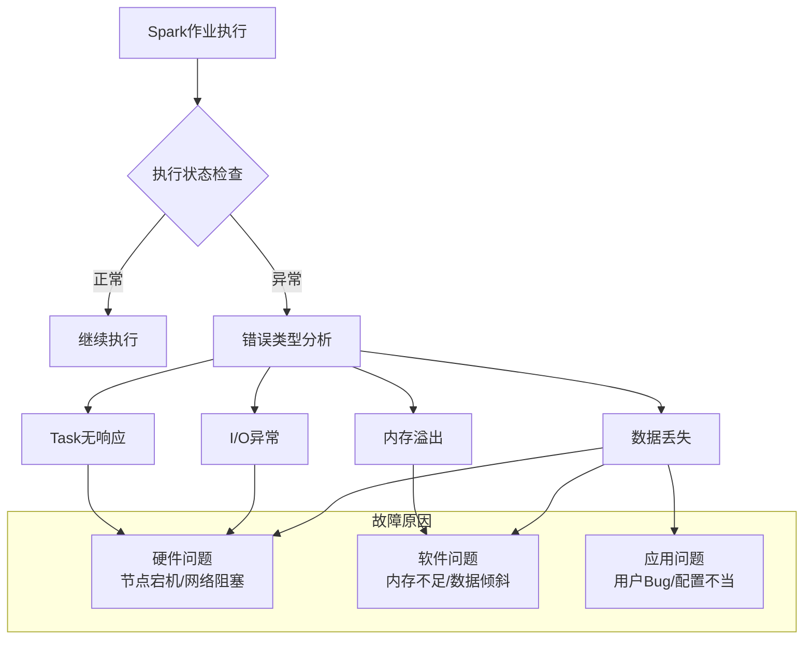
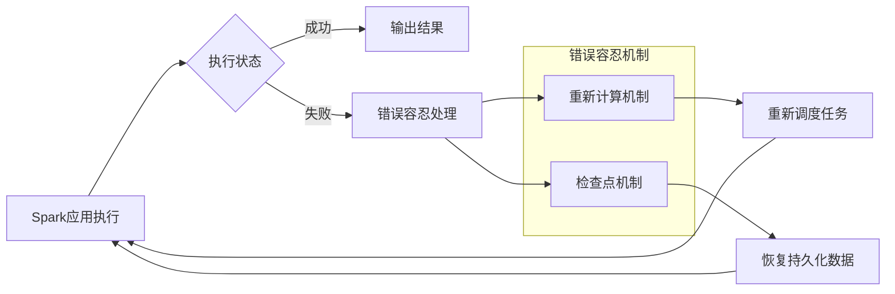
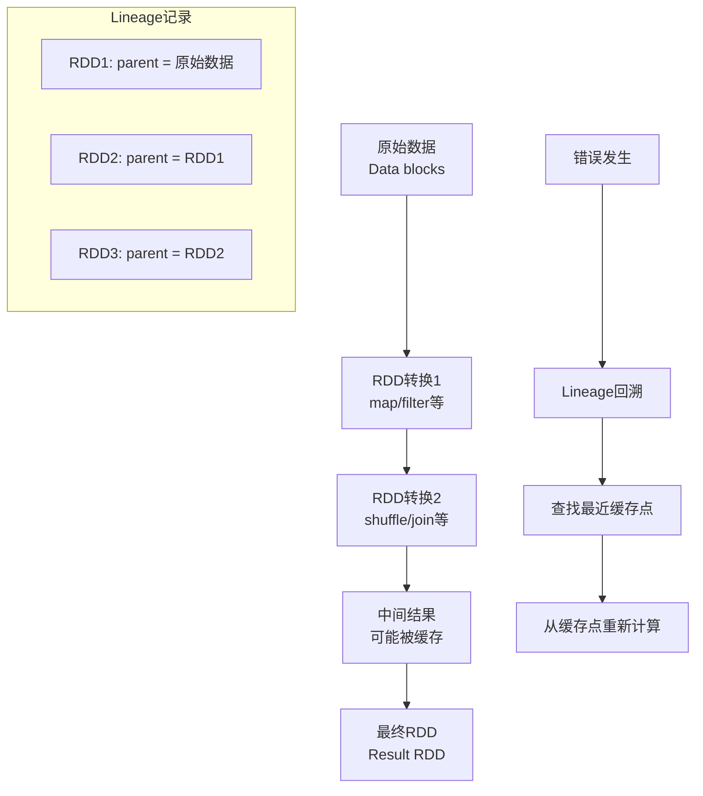

## 引言

在分布式大数据处理环境中，软硬件故障是不可避免的现实。节点宕机、磁盘损坏、网络阻塞、内存溢出等问题随时可能中断长时间运行的计算任务。Spark作为主流的大数据处理框架，其设计的**错误容忍机制**（Fault Tolerance）是确保应用可靠执行的关键技术。本章将深入探讨Spark错误容忍机制的设计思想、实现原理以及实际应用中的挑战。

## 错误容忍机制的意义与挑战

### 为什么需要错误容忍？

在大规模分布式环境中，Spark应用面临多种故障风险：

- **硬件故障**：节点宕机、磁盘损坏、网络阻塞等
- **软件问题**：内存溢出、I/O异常、系统bug等
- **应用问题**：用户代码bug、配置不当、数据倾斜等

如果没有错误容忍机制，应用一旦失败就需要**完全重新运行**。对于需要执行数小时甚至数天的企业级应用来说，这种代价是无法承受的。

### 主要挑战

Spark的错误容忍需要解决两大核心问题：

#### 1. 作业执行失败问题

作业（Job）执行过程中可能因各种原因失败，具体表现包括：
- Task长时间无响应
- 内存溢出（OOM）
- I/O异常
- 数据丢失



#### 2. 数据丢失问题

Spark作业执行涉及多种数据流动：
- **输入数据**：来自分布式文件系统
- **中间数据**：Shuffle过程中的传输数据
- **输出数据**：最终计算结果
- **缓存数据**：RDD持久化数据

当节点宕机时，这些数据都可能丢失，需要相应的恢复机制。

> **术语说明**：本章中"故障"、"错误"、"异常"、"失效"等术语均指代应用不能正常运行时出现的问题，不具体区分其细微差别。

##  错误容忍机制的设计思想

### 核心策略

Spark采用两种互补的策略来实现错误容忍：

#### 1. 重新计算机制（Recomputation）
- **基本思想**：当任务执行失败时，重新调度并执行该任务
- **适用场景**：节点宕机、内存竞争、I/O异常等可恢复故障
- **优势**：简单、自动化、无需复杂诊断

#### 2. 检查点机制（Checkpoint）
- **基本思想**：对重要数据（输入、输出、中间结果）进行持久化
- **适用场景**：防止数据丢失、加速重新计算
- **实现方式**：数据检查点持久化方案



### 设计权衡

Spark没有试图解决所有类型的错误，而是优先处理**可通过重新计算修复的故障**。这种设计权衡基于以下考虑：

1. **错误多样性**：错误原因复杂多样，难以统一诊断
2. **用户无关性**：需要设计通用机制，不依赖具体应用
3. **自动化程度**：尽量减少人工干预，提高系统可靠性

##  重新计算机制详解

###  重新计算的正确性保证

重新计算机制的有效性依赖于三个关键特性：

#### 1. 输入数据一致性
- **Map Task**：输入来自分布式文件系统，数据是静态可靠的
- **Reduce Task**：通过Shuffle获取数据，虽然顺序可能不同，但数据集合一致

#### 2. 计算确定性（Deterministic）
- 相同的输入必须产生相同的输出
- 避免使用随机函数等非确定性操作

#### 3. 计算幂等性（Idempotent）
- 多次执行相同计算得到相同结果
- 特别重要：Shuffle数据无序，需要计算满足交换律和结合律

```python
# 示例：满足幂等性的聚合函数
def safe_aggregate(values):
    """
    满足交换律和结合律的聚合函数
    示例：求和操作
    """
    return sum(values)

# 示例：不满足幂等性的操作（可能导致重新计算结果不一致）
def unsafe_concatenate(values):
    """
    不满足交换律的字符串连接
    输入顺序不同会导致结果不同
    """
    result = ""
    for v in values:
        result += "_" + str(v)
    return result[1:]  # 去掉开头的下划线

# 测试
values = ["1", "2", "3"]
print("安全聚合结果（始终一致）:", safe_aggregate([int(v) for v in values]))
print("危险连接结果1:", unsafe_concatenate(values))
print("危险连接结果2:", unsafe_concatenate(list(reversed(values))))
```

**重要结论**：重新计算机制有效的前提条件是task重新执行时能够读取与上次一致的数据，并且计算逻辑具有**确定性**和**幂等性**。

### 重新计算的起点选择

当任务失败时，需要确定从哪里开始重新计算。Spark通过lineage（血缘关系）机制解决这个问题。

#### 三种典型情况分析

##### 1. 失效task的上游stage是否需要重新执行？
- **解决方案**：Spark采用"延时删除策略"
- Shuffle Write结果写入本地磁盘，job完成后才删除
- 下游task失败时，可直接读取上游的磁盘数据，避免重新计算

##### 2. 一个task连续计算多个RDD，是否需要全部重新计算？
- **取决于缓存状态**：
  - 无缓存：需要重新计算所有RDD
  - 有缓存：从缓存RDD开始计算

##### 3. 缓存数据丢失时从哪里开始计算？
- 根据lineage回溯到缓存数据的源头
- 重新计算生成缓存数据所需的操作链

#### Lineage机制详解

Lineage是Spark错误容忍的核心机制，它记录了RDD的**数据依赖关系**和**计算历史**。



**Lineage的实现细节**：
1. **依赖关系记录**：每个RDD通过`prev`变量记录父RDD
2. **计算函数记录**：每个RDD保存如何从父RDD计算得到当前RDD的函数`f()`
3. **缓存感知**：Lineage知道哪些RDD分区已被缓存

```scala
// 简化的Lineage回溯逻辑（概念代码）
def recomputePartition(rdd: RDD, partitionIndex: Int): PartitionData = {
  // 检查当前RDD分区是否已缓存
  if (rdd.isCached(partitionIndex)) {
    return rdd.getCachedPartition(partitionIndex)
  }
  
  // 如果没有缓存，回溯到父RDD
  val parentRDDs = rdd.getDependencies()
  val parentPartitions = computeParentPartitions(partitionIndex)
  
  // 递归计算父RDD分区
  val parentData = parentRDDs.zip(parentPartitions).map { 
    case (parentRDD, parentPartition) => 
      recomputePartition(parentRDD, parentPartition)
  }
  
  // 使用计算函数f()从父数据计算当前分区
  rdd.computeFunction()(parentData)
}
```

### 重新计算机制总结

Spark的重新计算机制虽然朴素，但在实际应用中非常有效：

1. **前提条件**：task计算逻辑需满足确定性、幂等性
2. **Shuffle处理**：虽然Shuffle Read数据无序，但大多数应用不要求精确顺序
3. **统一解决方案**：Lineage机制统一处理各种重新计算场景
4. **性能考虑**：结合缓存机制，尽量减少重新计算的范围

## 检查点机制（Checkpoint）与数据缓存的区别

### 检查点 vs 缓存

| 特性 | 检查点（Checkpoint） | 缓存（Cache/Persist） |
|------|-------------------|-------------------|
| **主要目的** | 错误容忍、数据持久化 | 性能优化、减少重复计算 |
| **存储位置** | 可靠存储（如HDFS） | 内存或本地磁盘 |
| **数据可靠性** | 高（多副本） | 低（可能丢失） |
| **Lineage切断** | 会切断Lineage | 不会切断Lineage |
| **恢复成本** | 低（直接读取） | 高（需要重新计算） |
| **使用场景** | 重要中间结果、迭代算法 | 频繁访问的中间数据 |

### 检查点的应用场景

1. **迭代算法**：如机器学习训练，避免重复计算整个Lineage
2. **长时间作业**：关键中间结果的持久化备份
3. **Lineage过长**：切断过长的依赖链，减少恢复时间

```scala
// 检查点使用示例
val rdd = sc.textFile("hdfs://data/large-dataset.txt")
  .map(_.split(","))
  .filter(_.length > 5)
  .map(values => (values(0), values(1).toDouble))

// 设置检查点目录
sc.setCheckpointDir("hdfs://checkpoint-dir/")

// 对重要RDD设置检查点
rdd.checkpoint()

// 触发检查点操作（需要action操作）
rdd.count()  // 这会触发检查点持久化
```

## 总结与最佳实践

### 核心要点总结

1. **错误容忍的必要性**：分布式环境下故障不可避免，重新运行代价高昂
2. **双重机制设计**：重新计算 + 检查点 = 完整的错误容忍方案
3. **正确性保证**：确定性、幂等性是重新计算有效的前提
4. **智能恢复**：Lineage机制实现精确、高效的重新计算起点选择

### 实际应用建议

1. **代码设计原则**：
   - 确保所有转换操作都是确定性的
   - 聚合操作满足交换律和结合律
   - 避免在task中使用随机数生成器（除非设置固定种子）

2. **资源配置优化**：
   - 合理设置partition数量，避免数据倾斜
   - 根据数据规模配置足够的内存资源
   - 监控任务执行，及时发现潜在问题

3. **检查点策略**：
   - 对关键路径上的RDD设置检查点
   - 在迭代算法中定期检查点
   - 平衡检查点开销和恢复收益

4. **监控与调优**：
   - 监控Shuffle数据量，优化数据分布
   - 分析任务失败模式，针对性优化
   - 使用Spark UI跟踪Lineage和任务执行情况

### 未来展望

随着Spark生态的发展，错误容忍机制也在不断演进：
- **自适应检查点**：基于执行历史动态决定检查点位置
- **预测性容错**：通过监控指标预测潜在故障并提前采取措施
- **细粒度恢复**：更精确的部分结果恢复，减少重新计算范围

错误容忍不仅是Spark的技术特性，更是构建可靠大数据处理系统的核心设计理念。理解这些机制的原理和应用，对于开发稳定、高效的Spark应用至关重要。