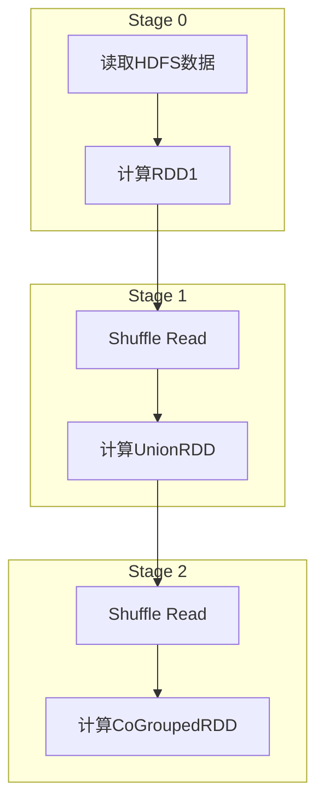
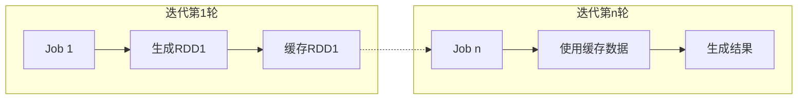
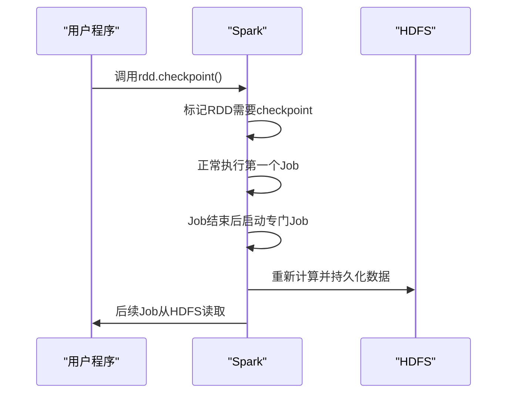
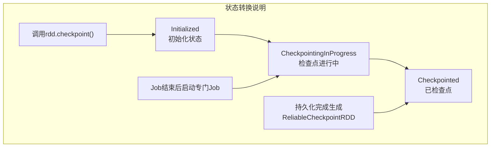

## 引言

在大规模分布式计算中，**数据丢失**和**计算失败**是不可避免的问题。Spark作为主流的大数据处理框架，通过**重新计算机制**（Recomputation）来保证计算的容错性。然而，当计算链过长或迭代次数过多时，重新计算的代价可能变得无法接受。为了解决这一问题，Spark引入了**检查点（Checkpoint）机制**——一种将重要中间数据持久化到可靠存储的策略，从而在故障恢复时避免昂贵的重新计算。

本文将深入探讨Spark Checkpoint机制的设计原理、实现细节以及最佳实践，帮助你理解如何在高可靠性和高性能之间找到平衡点。

---

## 一、Checkpoint机制的核心思想

### 1.1 重新计算机制的局限性

重新计算机制的基本思路是：当数据丢失时，重新执行任务来生成这些数据。这种机制虽然简单有效，但存在一个**致命缺陷**：如果某个RDD的计算链过长，重新计算的开销会变得极高。

> **示例场景**：迭代型应用迭代了100轮才计算出中间数据，如果该数据丢失，重新计算的代价将无法承受。

### 1.2 Checkpoint的解决方案

Checkpoint机制的核心思想是：**将计算过程中的重要数据进行持久化存储**。这样在需要重新执行时，可以从最近的检查点开始计算，而不是从头开始。

**核心优势**：
- 显著减少重新计算的开销
- 提高故障恢复速度
- 适用于计算链长、依赖复杂的数据

---

## 二、哪些数据需要使用Checkpoint？

Checkpoint的目的是对重要数据持久化以减少重新计算时间。直观上来说，应该对**计算耗时较高的数据**进行持久化。

### 2.1 单个Job的情况

考虑一个典型的Spark Job执行计划：



**Checkpoint策略分析**：

| RDD类型 | 计算代价 | Checkpoint建议 | 理由 |
|---------|---------|---------------|------|
| RDD1 | 低 | ❌ 不需要 | 直接从HDFS读取，计算简单 |
| UnionRDD | 中等 | ⚠️ 可考虑 | 需要运行更多task，计算步骤较多 |
| CoGroupedRDD | 高 | ✅ 建议使用 | 依赖数据多，计算复杂耗时 |

**重要观点**：
- CoGroupedRDD虽然可以通过Shuffle Read重新获取，但如果上游节点宕机，Shuffle Write的数据可能丢失
- 对于用户不可见的RDD（如CoGroupedRDD），可以通过对其可见的parent/child RDD进行checkpoint

### 2.2 多个Job的情况（迭代型应用）

迭代型应用的特点是多个Job串联执行，每个Job执行后，Spark会清理上游Stage的Shuffle Write数据以释放磁盘空间。



**风险分析**：
1. 缓存数据可能被替换（LRU策略）
2. 节点宕机导致缓存数据丢失
3. 如果第n轮迭代出错，且前面缓存数据已丢失，需要重新执行第1轮到第n轮

**Checkpoint策略**：
- 每隔几个Job（或每迭代m轮）就对关键中间数据进行checkpoint
- 对每轮迭代都被使用的RDD进行checkpoint（除了缓存）

### 2.3 Checkpoint数据的选择标准

需要被checkpoint的RDD通常具有以下特征：

1. **数据依赖关系复杂**：关联的数据过多，重新计算代价高
2. **计算链过长**：从源头开始重新计算需要大量时间
3. **被多次重复使用**：在多个Job或迭代中被频繁访问
4. **占用空间适中**：checkpoint本身也有存储开销

---

## 三、Checkpoint的实现机制

### 3.1 数据存储位置

Checkpoint数据需要满足两个要求：
1. **可靠性**：节点宕机时数据不丢失
2. **大容量**：可能存储大量数据

**推荐存储方案**：
- **HDFS**：最常用的选择，可靠且容量大
- **Alluxio**：基于内存的分布式文件系统，读写速度快

**接口使用**：
```scala
// 设置checkpoint目录
sparkContext.setCheckpointDir("hdfs://namenode:9000/checkpoint")

// 对RDD启用checkpoint
rdd.checkpoint()
```

### 3.2 Checkpoint时机与计算顺序

#### 问题背景
如果每计算出一个record就立即checkpoint到HDFS，会有以下问题：
- 写入延迟高（需要复制3份）
- 后续读取代价高
- 严重影响Job执行时间

#### Spark的解决方案
Spark采用了一种**简单但有效**的策略：



**执行流程**：
1. 用户调用`rdd.checkpoint()`，Spark仅标记该RDD需要checkpoint
2. 正常执行Job，计算所有数据
3. Job结束后，**重新启动一个专门的Job**，重新计算该RDD并持久化到HDFS
4. 后续Job从HDFS读取checkpoint数据

**为什么需要额外Job？**
- Checkpoint写入HDFS速度慢，如果在原Job中同步执行会显著增加执行时间
- 额外Job虽然增加了计算开销，但避免了阻塞主Job

**优化建议**：
```scala
// 推荐做法：先缓存再checkpoint
rdd.cache()      // 先缓存到内存
rdd.checkpoint() // 再checkpoint到HDFS
```

这样额外Job可以直接读取缓存数据，避免重新计算。

### 3.3 Checkpoint数据的读取

从HDFS读取checkpoint数据与读取普通HDFS数据类似，但有两点不同：

1. **数据格式**：checkpoint数据是序列化的RDD，需要反序列化恢复record
2. **分区信息**：checkpoint时保存了RDD的分区信息（如partitioner），便于恢复数据依赖关系

### 3.4 Checkpoint的实现细节

Checkpoint过程分为三个阶段：



#### 阶段1：Initialized（初始化）
当调用`rdd.checkpoint()`时：
- 为RDD添加`checkpointData`属性
- 保存checkpoint路径
- 状态标记为`Initialized`

#### 阶段2：CheckpointingInProgress（进行中）
当前Job结束后：
- 调用最后一个RDD的`doCheckpoint()`方法
- 回溯扫描计算链，标记需要checkpoint的RDD
- 状态改为`CheckpointingInProgress`
- 启动专门的Job执行持久化

#### 阶段3：Checkpointed（已完成）
持久化完成后：
- 生成`ReliableCheckpointRDD`（表示磁盘上的checkpoint数据）
- **关键操作**：切断lineage（设置`dependencies_ = null`）
- 将新RDD关联到原RDD的`checkpointRDD`属性
- 状态改为`Checkpointed`

**Lineage切断的重要性**：
- Checkpointed RDD已持久化到可靠存储，不再需要保留计算历史
- 减少Job复杂性，特别是对于迭代型应用

---

## 四、Checkpoint使用中的注意事项

### 4.1 Checkpoint多个RDD

```scala
// 示例：checkpoint两个RDD
val pairs = sc.textFile("input.txt").flatMap(_.split(" ")).map((_, 1))
val result = pairs.reduceByKey(_ + _)

pairs.checkpoint()   // checkpoint第一个RDD
result.checkpoint()  // checkpoint第二个RDD

pairs.count()        // 触发第一个checkpoint
result.collect()     // 触发第二个checkpoint
```

**执行效果**：
- 生成两个额外的Job（分别用于checkpoint pairs和result）
- checkpoint文件包含分区信息（如`_partitioner`文件）

### 4.2 Checkpoint语句位置的影响

#### 情况1：放在action之后 ❌
```scala
val pairs = sc.textFile("input.txt").flatMap(_.split(" ")).map((_, 1))
pairs.count()          // action操作
pairs.checkpoint()     // checkpoint放在action之后
pairs.collect()        // 不会触发checkpoint
```
**结果**：不会生成checkpoint Job

#### 情况2：同一个Job中checkpoint多个RDD
```scala
val pairs = sc.textFile("input.txt").flatMap(_.split(" ")).map((_, 1))
val result = pairs.reduceByKey(_ + _)

pairs.checkpoint()
result.checkpoint()

result.collect()  // 只触发result的checkpoint
```
**问题**：只有result被checkpoint，pairs被忽略

**原因**：当前实现从后往前扫描，先遇到result就对其进行checkpoint并切断lineage，导致pairs无法被访问到。

**解决方案**（Spark TODO）：
- 改为从前往后扫描
- 先对parent RDD进行checkpoint

### 4.3 Cache + Checkpoint组合使用

**推荐做法**：先缓存再checkpoint

```scala
val rdd = sc.textFile("input.txt")
rdd.cache()        // 先缓存到内存
rdd.checkpoint()   // 再checkpoint到HDFS

rdd.count()        // 触发checkpoint
```

**优势**：
1. 额外Job可以直接读取缓存数据，避免重新计算
2. 读取时优先使用缓存（更快）
3. checkpoint数据作为备份（更可靠）

**执行流程对比**：


---

## 五、Checkpoint与数据缓存的区别

虽然checkpoint和缓存都涉及数据持久化，但它们在设计目标和实现方式上有本质区别：

| 特性 | 数据缓存（Cache/Persist） | 检查点（Checkpoint） |
|------|--------------------------|---------------------|
| **主要目的** | 加速后续Job的计算 | 故障后快速恢复，避免重新计算 |
| **存储位置** | 内存为主，磁盘为辅 | 分布式文件系统（如HDFS） |
| **可靠性** | 不可靠（可能被替换或丢失） | 可靠（多副本存储） |
| **写入时机** | Job运行时同步写入 | Job结束后启动专门Job写入 |
| **对Lineage影响** | 不影响，保留完整计算历史 | 切断Lineage，简化依赖关系 |
| **读写速度** | 快（内存/本地磁盘） | 慢（网络+磁盘） |
| **适用场景** | 频繁读取、占用空间不大的RDD | 计算链长、重新计算代价高的RDD |

### 5.1 应用场景对比

**适合使用缓存的场景**：
- RDD会被多个操作重复使用
- 数据量适中，可以放入内存
- 需要加速迭代计算

**适合使用checkpoint的场景**：
- 迭代型应用，计算链非常长
- 数据依赖关系复杂，重新计算代价高
- 需要保证故障恢复速度
- 可以接受额外的存储开销

### 5.2 LocalCheckpoint：折中方案

Spark还提供了`localCheckpoint()`方法，它在功能上等价于：
- 数据缓存（存储到本地磁盘）
- checkpoint的lineage切断功能

**特点**：
- 比checkpoint快（本地存储）
- 比缓存更可靠（磁盘存储）
- 适合不需要跨节点可靠性的场景

---

## 六、最佳实践与总结

### 6.1 Checkpoint最佳实践

1. **选择合适的RDD**：
   - 计算链长、依赖复杂的RDD
   - 在迭代型应用中频繁使用的中间数据
   - 重新计算代价明显高于存储代价的数据

2. **合理设置checkpoint频率**：
   - 迭代型应用：每隔m轮迭代checkpoint一次
   - 流式处理：根据业务容忍度设置间隔
   - 批处理：对关键转换结果进行checkpoint

3. **结合缓存使用**：
   ```scala
   // 推荐模式
   rdd.persist(StorageLevel.MEMORY_AND_DISK)
   rdd.checkpoint()
   rdd.count()  // 触发持久化
   ```

4. **监控checkpoint性能**：
   - 关注额外的Job执行时间
   - 监控HDFS存储使用情况
   - 评估checkpoint对整体性能的影响

### 6.2 性能调优建议

| 场景 | 问题 | 解决方案 |
|------|------|---------|
| Checkpoint太频繁 | 额外Job开销大 | 增加checkpoint间隔 |
| Checkpoint数据太大 | HDFS写入慢，存储压力大 | 选择关键RDD，过滤不必要数据 |
| 恢复时间太长 | Checkpoint点太远 | 调整checkpoint位置，选择更近的计算阶段 |
| 内存不足 | Cache+Checkpoint占用过多内存 | 调整存储级别，使用`MEMORY_AND_DISK_SER` |

### 6.3 本章核心要点总结

1. **重新计算机制**是Spark容错的基础，但存在计算链过长时重新计算代价高的问题
2. **Checkpoint机制**通过持久化重要中间数据来解决这一问题
3. **Checkpoint过程**分为三个阶段，最终会切断RDD的lineage
4. **Checkpoint时机**是在原Job结束后启动专门Job进行持久化
5. **Cache+Checkpoint组合**是最佳实践，兼顾性能和可靠性
6. **Checkpoint与缓存**有本质区别：前者侧重可靠性，后者侧重性能

### 6.4 实际应用建议

在实际的Spark应用中，特别是迭代型机器学习算法或复杂ETL流程中：

1. **对于迭代算法**：
   ```scala
   for (i <- 1 to numIterations) {
     // 每10轮迭代checkpoint一次
     if (i % 10 == 0) {
       currentModel.checkpoint()
       currentModel.count()  // 触发checkpoint
     }
     // 继续迭代计算
   }
   ```

2. **对于复杂ETL**：
   ```scala
   // 在关键转换步骤后checkpoint
   val cleanedData = rawData.filter(_.isValid).cache()
   cleanedData.checkpoint()
   cleanedData.count()  // 触发
   
   // 后续操作可以从checkpoint恢复
   val aggregated = cleanedData.groupByKey().reduceByKey(_ + _)
   ```

3. **监控与调优**：
   - 使用Spark UI监控checkpoint Job的执行情况
   - 根据数据量和集群规模调整checkpoint间隔
   - 定期清理旧的checkpoint数据，避免存储浪费

---

## 结语

Checkpoint机制是Spark可靠性保障体系中的重要一环。它通过在可靠存储中保存关键中间数据，在故障恢复和计算效率之间找到了平衡点。理解Checkpoint的设计原理、实现细节和使用场景，对于构建稳定、高效的Spark应用至关重要。

记住，Checkpoint不是万能的——它会带来额外的存储开销和计算延迟。在实际应用中，需要根据业务需求、数据特征和集群资源，在缓存、checkpoint和重新计算之间做出明智的权衡。