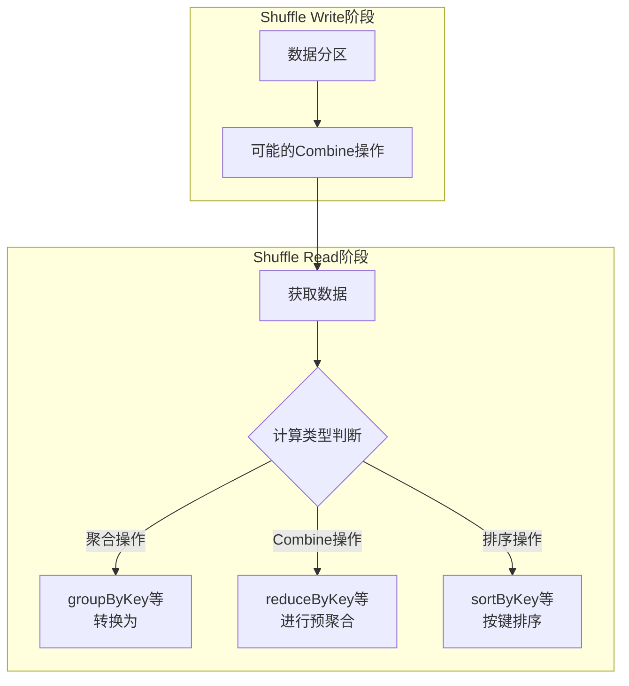
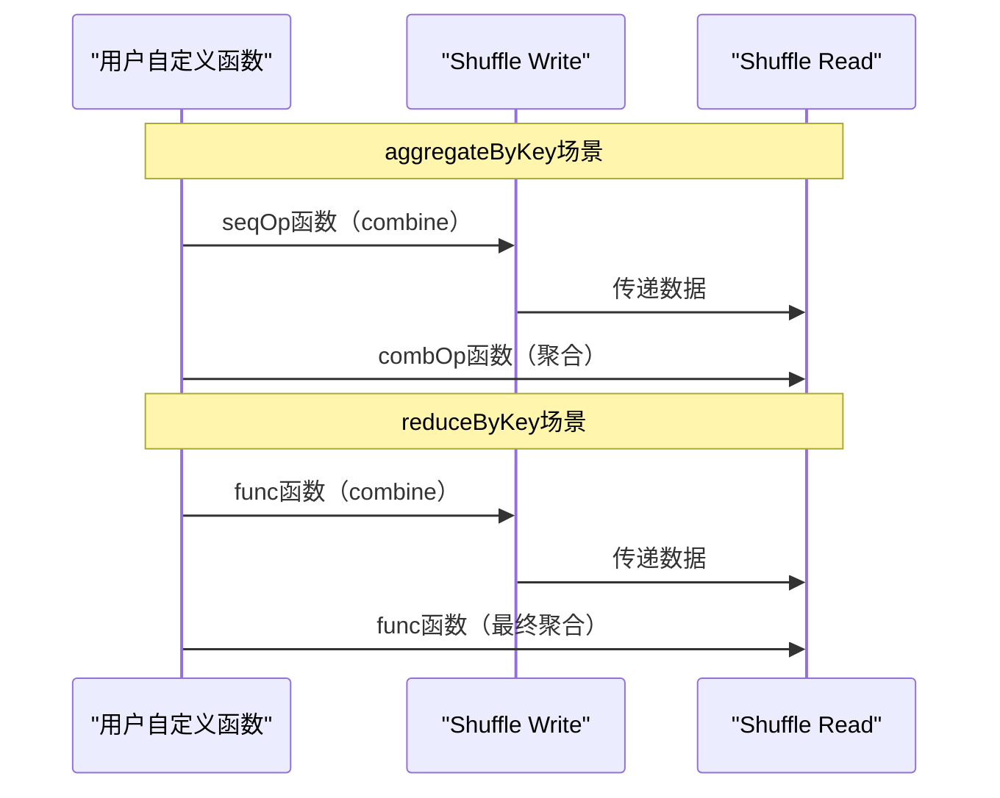
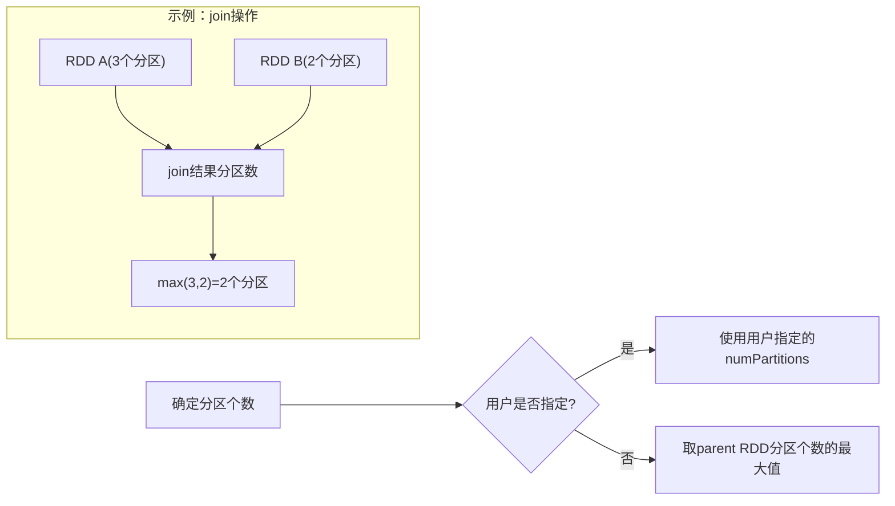
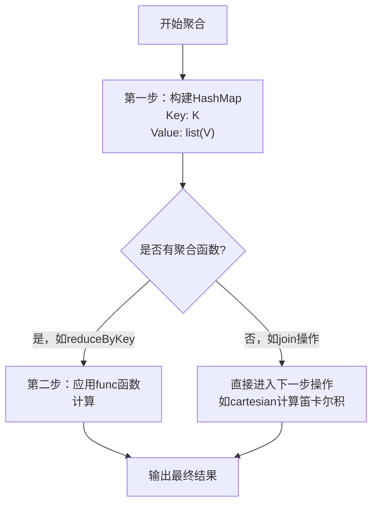
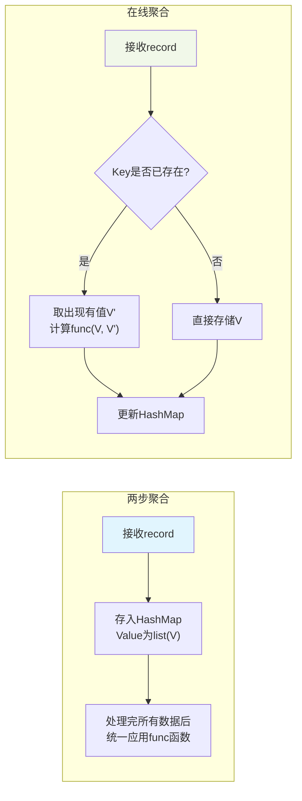
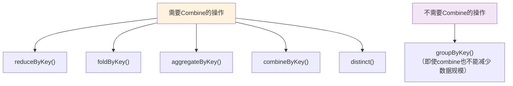
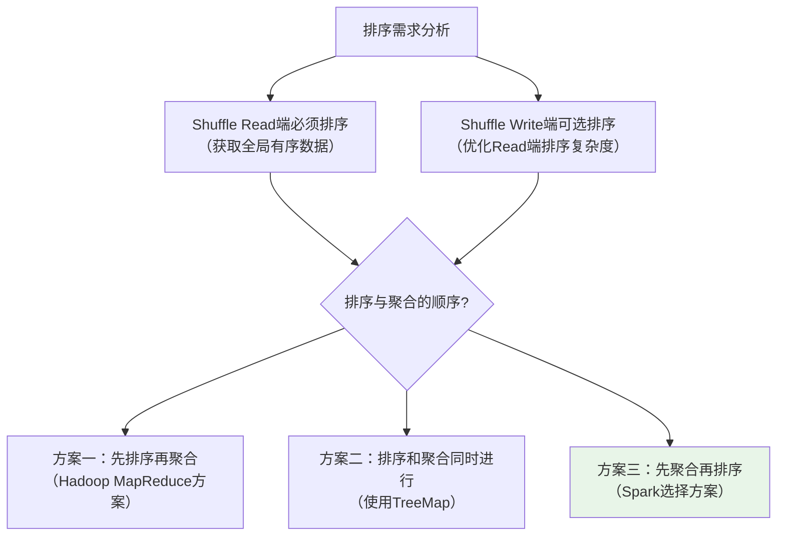
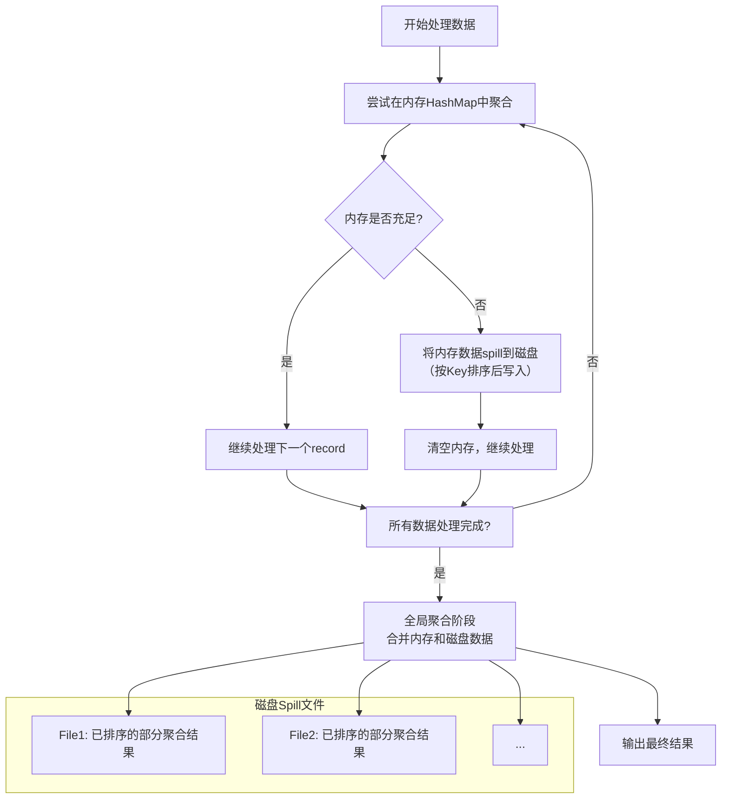

## 引言

在大数据处理框架中，Shuffle是一个核心而复杂的概念。它如同数据处理的"交通枢纽"，负责将上游计算节点的结果重新组织并传递给下游节点。然而，这个看似简单的数据传递过程背后，隐藏着诸多设计挑战和技术难题。理解Spark的Shuffle机制，不仅有助于编写高效的大数据应用，更能让我们深入理解分布式计算的精髓。

## 一、Shuffle的意义与挑战

### 1.1 Shuffle的基本概念

在Spark的执行模型中，Shuffle是**连接不同stage之间数据传递的桥梁**。具体来说：

- **物理执行角度**：Shuffle解决了运行在不同stage、不同节点上的task之间如何进行数据传递的问题
- **数据处理角度**：Shuffle不仅要传递数据，还需要进行各种类型的计算（如聚合、排序）
- **规模特点**：Shuffle处理的数据量通常很大，这对性能和资源管理提出了高要求

### 1.2 Shuffle的架构划分

Shuffle过程分为两个核心阶段：

| 阶段 | 主要任务 | 发生位置 |
|------|---------|---------|
| **Shuffle Write** | 上游stage输出数据的分区处理 | Map Task端 |
| **Shuffle Read** | 下游stage获取并重新组织数据 | Reduce Task端 |

### 1.3 Shuffle设计的主要挑战

#### （1）计算的多样性

Shuffle需要支持多种计算模式，这带来了设计上的复杂性：



**关键问题**：
- 如何建立统一的Shuffle框架支持所有这些操作？
- 如何灵活构建Shuffle Write/Read过程以适应不同操作？
- 如何确定聚合函数、数据分区、数据排序的执行顺序？

#### （2）计算的耦合性

某些操作的用户自定义函数与Shuffle过程紧密耦合：



**设计难题**：
- 何时调用聚合函数？先读取数据再聚合，还是边读取边聚合？
- 如何管理函数执行与数据传递的时序关系？

#### （3）中间数据存储问题

Shuffle过程中的中间数据管理面临挑战：
- 数据表示：如何表示分区、聚合、排序过程中的中间状态？
- 数据组织：如何在内存中高效组织这些数据？
- 内存限制：数据量超过内存容量时如何处理？

## 二、Shuffle的设计思想

### 2.1 基本概念定义

为了方便讨论，我们定义以下术语：

- **Map Stage**：上游stage，包含多个map task
- **Reduce Stage**：下游stage，包含多个reduce task
- **ShuffleDependency**：表示RDD之间的Shuffle依赖关系

> **补充说明**：单个ShuffleDependency的解决方案可以直接推广到多个ShuffleDependency的情况，如join操作中的每个依赖都可以复用单个依赖的解决方案。

### 2.2 解决数据分区问题（Shuffle Write阶段）

数据分区问题的核心是：**如何对map task输出结果进行分区，使得reduce task可以通过网络获取相应的数据？**

#### 2.2.1 分区个数确定

分区个数的确定有两种方式：



**具体规则**：
- 用户可通过参数指定，如 `groupByKey(numPartitions)`
- 未指定时，默认取parent RDD分区个数的最大值

#### 2.2.2 数据分区方法

每个map task输出数据的分配逻辑：

```scala
// 分区计算伪代码
def calculatePartitionId(record: (K, V), numPartitions: Int): Int = {
  val key = record._1
  val hash = key.hashCode()
  Math.abs(hash % numPartitions)  // 确保结果为非负数
}
```

**分区过程**：
1. 对每个输出的`<K, V>` record
2. 根据Key计算partitionId：`partitionId = Hash(Key) % numPartitions`
3. 将record输出到对应的分区文件中

> **局限性**：这种简单方法不支持Shuffle Write端的combine操作。

### 2.3 解决数据聚合问题（Shuffle Read阶段）

数据聚合的本质：**将相同Key的record放在一起，并进行必要的计算**。

#### 2.3.1 两步聚合（Two-Phase Aggregation）



**实现示例**：
```scala
// 两步聚合的简化实现
class TwoPhaseAggregator[K, V](func: (V, V) => V) {
  private val hashMap = new HashMap[K, ListBuffer[V]]
  
  // 第一步：收集数据到HashMap
  def addRecord(key: K, value: V): Unit = {
    val buffer = hashMap.getOrElseUpdate(key, ListBuffer[V]())
    buffer.append(value)
  }
  
  // 第二步：应用聚合函数
  def aggregate(): Map[K, V] = {
    hashMap.map { case (key, values) =>
      val result = values.reduce(func)  // 应用聚合函数
      key -> result
    }.toMap
  }
}
```

**优缺点分析**：
- **优点**：逻辑清晰，易于实现
- **缺点**：占用内存大，效率较低（需要先收集所有数据）

#### 2.3.2 在线聚合（Online Aggregation）优化



**在线聚合的核心逻辑**：
```scala
class OnlineAggregator[K, V](func: (V, V) => V) {
  private val hashMap = new HashMap[K, V]
  
  def addRecord(key: K, value: V): Unit = {
    hashMap.get(key) match {
      case Some(existingValue) =>
        // 已存在：执行在线聚合
        val newValue = func(value, existingValue)
        hashMap.put(key, newValue)
      case None =>
        // 不存在：直接存储
        hashMap.put(key, value)
    }
  }
  
  def getResult: Map[K, V] = hashMap.toMap
}
```

**适用场景分析**：

| 聚合函数类型 | 在线聚合效果 | 示例操作 |
|------------|------------|---------|
| **可合并函数** | 显著减少内存占用 | `sum()`, `max()`, `min()` |
| **列表收集函数** | 无内存优化效果 | `groupByKey()` |
| **复杂聚合函数** | 视函数特性而定 | 自定义聚合函数 |

### 2.4 解决map端Combine问题

#### 2.4.1 需要Combine的操作

只有包含聚合函数的操作才需要进行map端combine：



#### 2.4.2 Combine的实现原理

Combine本质上是**在单个map task内部进行的预聚合**：

```scala
// Combine过程的简化视图
class MapSideCombiner[K, V](func: (V, V) => V) {
  private val combineMap = new HashMap[K, V]
  
  def combine(record: (K, V)): Unit = {
    val (key, value) = record
    combineMap.get(key) match {
      case Some(existing) =>
        combineMap.put(key, func(value, existing))
      case None =>
        combineMap.put(key, value)
    }
  }
  
  // 分区并输出结果
  def writeOutput(partitioner: Partitioner): Map[Int, List[(K, V)]] = {
    val partitions = mutable.Map[Int, ListBuffer[(K, V)]]()
    
    combineMap.foreach { case (key, value) =>
      val partitionId = partitioner.getPartition(key)
      partitions
        .getOrElseUpdate(partitionId, ListBuffer[(K, V)]())
        .append((key, value))
    }
    
    partitions.mapValues(_.toList).toMap
  }
}
```

**Combine与Shuffle Read聚合的对比**：

| 方面       | Combine（Map端）  | Shuffle Read聚合（Reduce端） |
| -------- | -------------- | ----------------------- |
| **数据范围** | 单个map task的输出  | 所有map task的输出           |
| **目的**   | 减少Shuffle数据量   | 完成最终的数据聚合               |
| **实现**   | 基于HashMap的局部聚合 | 基于HashMap的全局聚合          |

### 2.5 解决排序问题

某些操作如`sortByKey()`需要对数据按键排序，这带来了额外的设计考虑。

#### 2.5.1 排序位置的选择



#### 2.5.2 三种排序方案对比

| 方案 | 执行顺序 | 优点 | 缺点 | 适用场景 |
|------|---------|------|------|---------|
| **先排序再聚合** | 排序 → 聚合 | 1. 同时满足排序和聚合需求<br>2. 排序后聚合逻辑简单 | 1. 需要大内存存储线性结构<br>2. 不能在线聚合，效率低 | Hadoop MapReduce |
| **排序聚合同时** | 使用TreeMap同时处理 | 1. 排序聚合一体化<br>2. 内存中完成所有操作 | 1. TreeMap插入复杂度O(nlogn)<br>2. 不适合大规模数据 | 小规模有序数据 |
| **先聚合再排序** | 聚合 → 排序 | 1. 聚合和排序解耦，灵活性高<br>2. 可复用在线聚合方案<br>3. Spark选择此方案 | 1. 需要复制数据或引用<br>2. 空间占用相对较大 | Spark大规模数据处理 |

**Spark的实现策略**：
```scala
// 先聚合再排序的简化示例
class AggregationThenSort[K, V] {
  // 第一步：使用HashMap进行聚合
  private val aggregationMap = new HashMap[K, V]
  
  def aggregate(records: Iterator[(K, V)]): Unit = {
    // 在线聚合逻辑
  }
  
  // 第二步：排序
  def sort(): List[(K, V)] = {
    val aggregated = aggregationMap.toList
    // 按键排序
    aggregated.sortBy(_._1)
  }
}
```

### 2.6 解决内存不足问题

当Shuffle数据量超过内存容量时，需要特殊处理策略。

#### 2.6.1 内存+磁盘混合存储方案



#### 2.6.2 全局聚合的关键优化

为了高效合并内存和磁盘上的部分聚合结果，Spark采用了重要优化：

1. **排序Spill文件**：将数据spill到磁盘时按键排序
2. **归并合并**：全局聚合时使用归并算法合并多个已排序的文件
3. **减少磁盘I/O**：排序后可以减少随机读取，提高合并效率

**实现伪代码**：
```scala
class ExternalAggregator[K, V] {
  private val memoryMap = new HashMap[K, V]
  private val spillFiles = ListBuffer[File]()
  
  def processRecord(record: (K, V)): Unit = {
    // 尝试在内存中聚合
    if (memoryMap.size < memoryThreshold) {
      // 内存聚合逻辑
    } else {
      // Spill内存数据到磁盘
      spillToDisk()
      // 继续处理
      processRecord(record)
    }
  }
  
  private def spillToDisk(): Unit = {
    // 1. 对内存中的数据按键排序
    val sortedEntries = memoryMap.toList.sortBy(_._1)
    
    // 2. 写入磁盘文件
    val spillFile = createTempFile()
    writeSortedEntries(sortedEntries, spillFile)
    
    // 3. 记录spill文件
    spillFiles.append(spillFile)
    
    // 4. 清空内存
    memoryMap.clear()
  }
  
  def finalAggregation(): Iterator[(K, V)] = {
    // 合并所有spill文件和内存中的数据
    val allIterators = spillFiles.map(readSortedFile) :+ memoryMap.toIterator
    mergeSortedIterators(allIterators)
  }
}
```

## 三、总结与实践启示

### 3.1 Shuffle设计的关键要点

通过上述分析，我们可以总结出Spark Shuffle设计的几个核心原则：

1. **分层处理**：将复杂的Shuffle过程分解为Write和Read两个阶段
2. **计算与数据耦合**：允许用户函数与Shuffle过程紧密集成
3. **内存优先，磁盘兜底**：优先使用内存处理，内存不足时优雅降级到磁盘
4. **聚合优化**：通过在线聚合、map端combine等技术减少数据移动
5. **排序策略**：采用先聚合再排序的平衡方案

### 3.2 性能优化建议

基于Shuffle机制的理解，在实际开发中可采取以下优化策略：

| 场景 | 优化建议 | 原理 |
|------|---------|------|
| **大规模聚合操作** | 优先使用`reduceByKey`而非`groupByKey` | 利用map端combine减少Shuffle数据量 |
| **内存敏感场景** | 适当调整`spark.shuffle.spill`参数 | 控制内存使用和磁盘spill的平衡 |
| **需要排序的操作** | 考虑数据分布，避免严重倾斜 | 排序性能受数据分布影响很大 |
| **Join操作优化** | 使用相同分区器，避免Shuffle | 如果两个RDD分区方式相同，可避免Shuffle |

### 3.3 扩展思考

Shuffle机制的设计体现了分布式系统中的一个普遍原则：**在数据局部性和计算效率之间寻找平衡**。Spark的选择（如先聚合再排序、内存+磁盘混合存储）都是在特定约束下的最优权衡。

理解这些权衡不仅有助于使用Spark，更能为我们设计其他分布式系统提供借鉴。在大数据领域，没有完美的解决方案，只有适合特定场景的权衡选择。Spark Shuffle的成功，正是基于对这些权衡的深刻理解和巧妙实现。