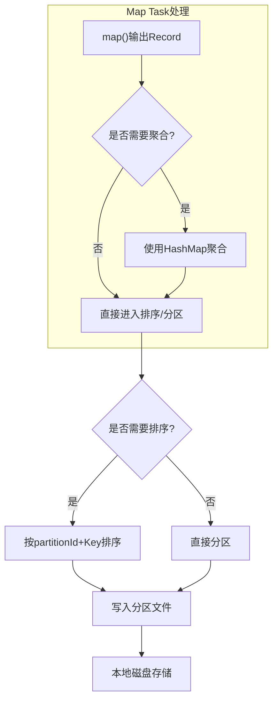
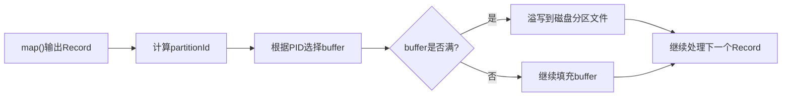
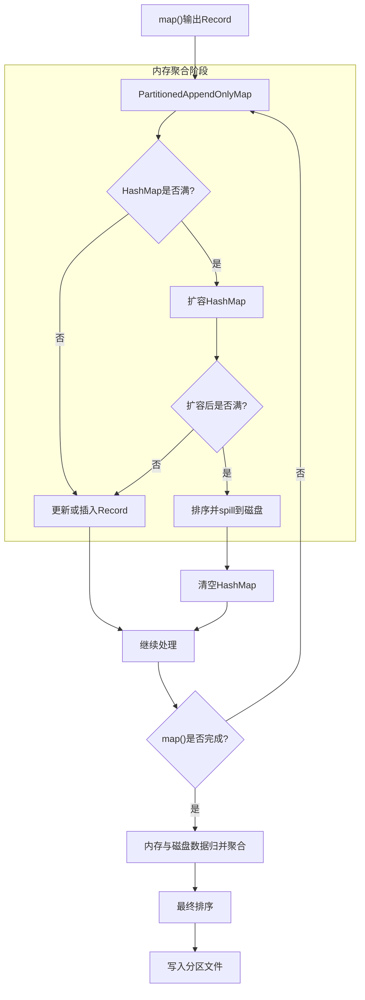
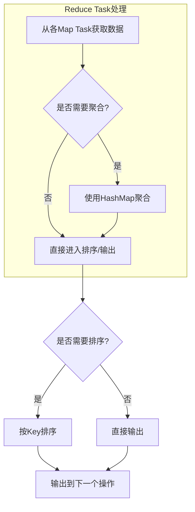
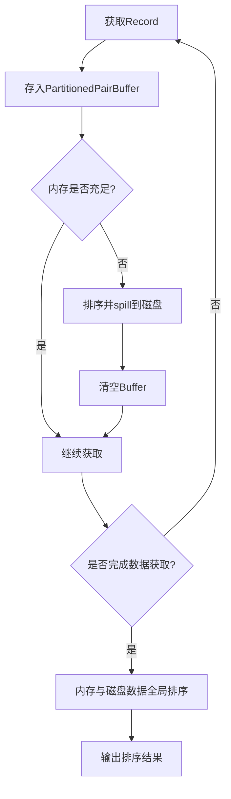
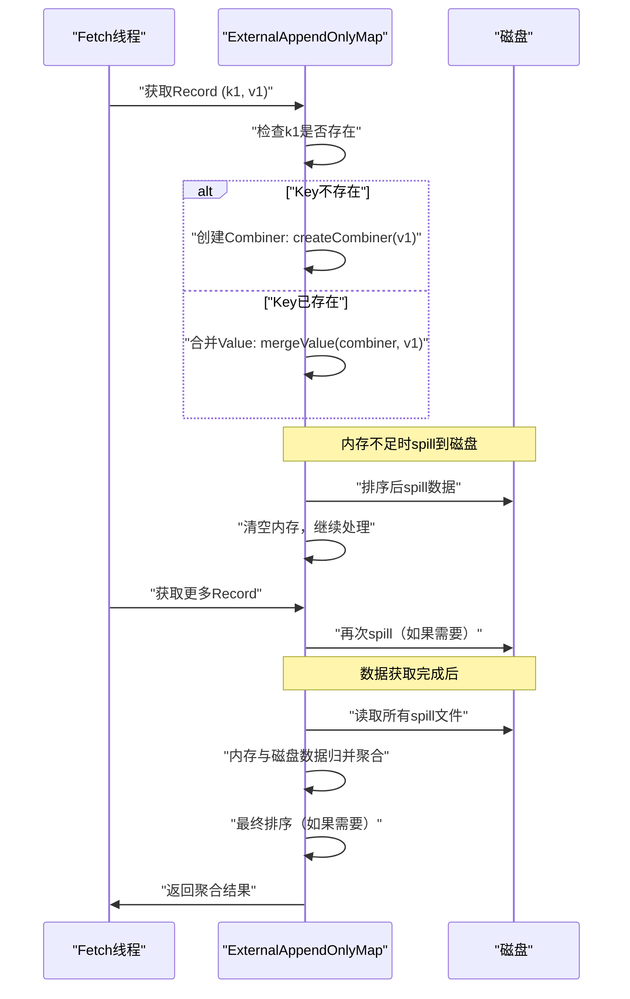
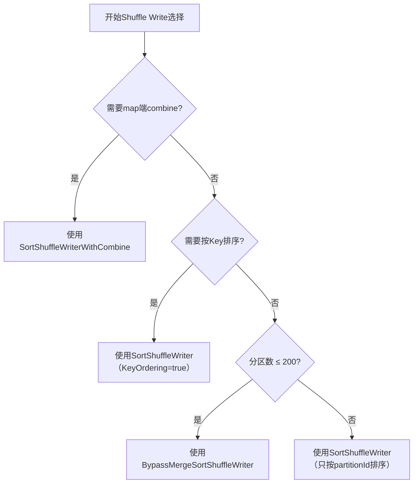

## 概述

在分布式计算中，Shuffle是连接Map阶段和Reduce阶段的关键桥梁，负责跨节点数据重分区、聚合和排序。Spark的Shuffle框架设计巧妙，通过**灵活的组合策略**支持不同数据操作的计算需求，既保证了通用性，又针对特定场景进行了优化。

Shuffle的核心挑战在于平衡**内存使用、磁盘I/O、计算效率**三者之间的关系。Spark通过分层设计，为不同规模的数据和计算需求提供了多种实现方案。

## Shuffle计算需求分析

在Spark中，不同数据操作对Shuffle阶段的功能需求各不相同。以下是典型操作的Shuffle需求总结：

| 操作类型 | Shuffle Write端 | Shuffle Read端 | 典型示例 |
|---------|----------------|---------------|----------|
| 简单重分区 | 分区 | 数据获取 | `partitionBy()` |
| 分组聚合 | 分区（可选聚合） | 聚合（可选排序） | `groupByKey()` |
| 带预聚合的分组 | 分区 + 聚合 | 聚合 | `reduceByKey()` |
| 排序 | 分区 + 排序 | 排序 | `sortByKey()` |

> **注**：Shuffle Write端目前主要支持分区和聚合（combine）功能，排序功能主要在Read端完成。

## Shuffle Write框架设计

### 通用处理流程

Spark的Shuffle Write框架采用统一的"聚合→排序→分区"处理顺序，但每个步骤都是可选的：



### 三种Shuffle Write模式

#### 1. BypassMergeSortShuffleWriter（直接输出模式）

**适用场景**：
- 不需要map端聚合（combine）
- 不需要按Key排序
- 分区数量较少（≤200，默认阈值）

**处理流程**：



**优缺点分析**：
- ✅ **优点**：速度快，直接输出到不同分区文件
- ❌ **缺点**：
  - 内存消耗大（每个分区需要32KB buffer）
  - 文件数过多（每个分区一个文件）
  - 不适合大规模分区场景

**配置参数**：
```scala
// 设置分区阈值，超过此值则使用SortShuffleWriter
spark.shuffle.sort.bypassMergeThreshold = 200

// 控制每个分区的buffer大小
spark.shuffle.file.buffer = 32KB
```

#### 2. SortShuffleWriter（排序模式）

**适用场景**：
- 不需要map端聚合（combine）
- 需要按partitionId或partitionId+Key排序
- 分区数量无限制

**处理流程**：
```scala
// 使用PartitionedPairBuffer存储record
class PartitionedPairBuffer {
  // 存储格式：<（PID，K），V>
  def insert(record: (K, V), partitionId: Int): Unit
  
  // 按partitionId+Key排序
  def sort(): Array[(Int, K, V)]
}
```

**内存管理策略**：
1. **内存充足**：所有record存储在PartitionedPairBuffer中
2. **内存不足**：
   - 先扩容buffer
   - 仍不足则spill到磁盘
   - 最后进行全局归并排序

**优缺点分析**：
- ✅ **优点**：
  - 只需一个Array结构，内存可控
  - 输出单一文件，避免文件数爆炸
  - 支持大规模数据排序
- ❌ **缺点**：排序增加计算时延

#### 3. SortShuffleWriterWithCombine（聚合+排序模式）

**适用场景**：
- 需要map端聚合（combine）
- 需要或不需要按Key排序
- 分区数量无限制

**核心数据结构**：`PartitionedAppendOnlyMap`
- 同时支持聚合和排序功能
- Key格式：`(partitionId, originalKey)`
- Value格式：聚合结果



**聚合函数示例**：
```scala
// reduceByKey操作在map端的聚合
val rdd = sc.parallelize(Seq(("a", 1), ("b", 2), ("a", 3)))
val result = rdd.reduceByKey(_ + _)

// Shuffle Write端的combine过程
// 输入：("a", 1), ("a", 3)
// 输出：("a", 4)
```

**优缺点分析**：
- ✅ **优点**：
  - 减少网络传输（map端预聚合）
  - 支持大规模数据聚合
  - 内存可扩展（支持spill到磁盘）
- ❌ **缺点**：
  - 内存消耗较大
  - spill时需额外聚合操作

## Shuffle Read框架设计

### 通用处理流程

Shuffle Read框架采用"数据获取→聚合→排序"的处理顺序：



### 三种Shuffle Read模式

#### 1. 简单获取模式

**适用场景**：
- 不需要聚合
- 不需要按Key排序
- 如`partitionBy()`操作

**处理流程**：
```scala
// 配置参数：控制每次获取的数据量
spark.reducer.maxSizeInFlight = 48MB

// 处理逻辑
while (hasMoreData) {
  val records = fetchFromMapTasks(bufferSize = 48MB)
  outputBuffer.addAll(records)
}
```

**特点**：
- 实现简单，内存消耗小
- 不支持复杂功能

#### 2. 排序模式

**适用场景**：
- 不需要聚合
- 需要按Key排序
- 如`sortByKey()`操作

**核心数据结构**：`PartitionedPairBuffer`
- 与Write端相同的数据结构
- 按Key进行排序



#### 3. 聚合模式（可选排序）

**适用场景**：
- 需要聚合
- 需要或不需要按Key排序
- 如`reduceByKey()`、`aggregateByKey()`操作

**核心数据结构**：`ExternalAppendOnlyMap`
- 特殊优化的HashMap
- 支持聚合和排序
- 可spill到磁盘

```scala
// ExternalAppendOnlyMap的使用示例
val map = new ExternalAppendOnlyMap[K, V, C](
  createCombiner: V => C,      // 初始化combiner
  mergeValue: (C, V) => C,     // 合并value到combiner
  mergeCombiners: (C, C) => C  // 合并两个combiner
)

// 处理流程
records.foreach { case (k, v) =>
  map.insert(k, v)  // 自动进行聚合
}

// 如果需要排序
val sortedResult = map.iterator.toArray.sortBy(_._1)
```

**聚合过程示例**：


## 性能优化策略

### 1. 内存管理优化

**动态调整策略**：
```scala
// Spark自动管理聚合和排序的内存使用
spark.shuffle.memoryFraction = 0.2  // 默认占用20%的executor内存
spark.shuffle.safetyFraction = 0.8   // 安全系数，避免OOM
```

### 2. 磁盘I/O优化

**合并小文件**：
- SortShuffleWriter只生成一个数据文件和一个索引文件
- 减少文件打开/关闭开销
- 提高磁盘顺序读写性能

### 3. 网络传输优化

**压缩传输**：
```scala
// 启用Shuffle数据压缩
spark.shuffle.compress = true
spark.shuffle.spill.compress = true

// 常用压缩编解码器
spark.io.compression.codec = snappy  // 平衡速度与压缩率
```

### 4. 选择合适的Shuffle模式

**决策流程图**：


## 实际应用建议

### 1. 参数调优指南

```scala
// 针对不同场景的配置建议

// 场景1：内存充足，追求性能
spark.shuffle.file.buffer = 64KB          // 增大buffer提高I/O效率
spark.reducer.maxSizeInFlight = 96MB      // 增大网络传输批次
spark.shuffle.sort.bypassMergeThreshold = 500  // 提高直接输出阈值

// 场景2：内存紧张，避免OOM
spark.shuffle.memoryFraction = 0.1        // 减少Shuffle内存占比
spark.shuffle.spill.compress = true       // 启用spill压缩
spark.shuffle.compress = true             // 启用网络传输压缩

// 场景3：大量小分区
spark.sql.shuffle.partitions = 200        // 控制分区数量
spark.shuffle.service.enabled = true      // 启用外部Shuffle服务
```

### 2. 编程最佳实践

```scala
// 避免不必要的Shuffle
// 错误示例：两次Shuffle
val rdd1 = data.map(x => (x.key, x.value))
val rdd2 = rdd1.groupByKey().mapValues(_.sum)  // 第一次Shuffle
val rdd3 = rdd2.sortByKey()                    // 第二次Shuffle

// 正确示例：合并操作
val result = data.map(x => (x.key, x.value))
  .reduceByKey(_ + _)  // 聚合
  .sortByKey()         // 排序（在Read端完成）
```

### 3. 监控与诊断

**关键监控指标**：
- Shuffle Write时间
- Shuffle Read时间
- Shuffle spill次数
- Shuffle文件大小
- 网络传输量

**诊断命令**：
```bash
# 查看Shuffle统计信息
spark-shell --conf spark.eventLog.enabled=true

# 在Spark UI中查看
# 1. Stages页面：查看Shuffle读写数据量
# 2. Storage页面：查看Shuffle文件存储
# 3. Environment页面：查看Shuffle相关配置
```

## 总结

Spark的Shuffle框架通过**模块化设计**和**灵活组合**，为不同计算需求提供了优化方案：

1. **分层架构**：Write端和Read端解耦，各自优化
2. **内存管理**：支持内存扩展和磁盘spill，平衡性能与资源
3. **算法优化**：特殊数据结构（PartitionedAppendOnlyMap、ExternalAppendOnlyMap）同时支持聚合和排序
4. **配置灵活**：根据数据规模和操作特性自动选择最佳策略

**未来发展方向**：
- 更智能的自适应Shuffle策略
- 基于硬件的优化（SSD、RDMA等）
- 流水线化的Shuffle处理
- 向量化Shuffle操作

通过深入理解Spark Shuffle框架的设计原理，开发者可以更好地调优应用性能，解决大数据处理中的性能瓶颈问题。