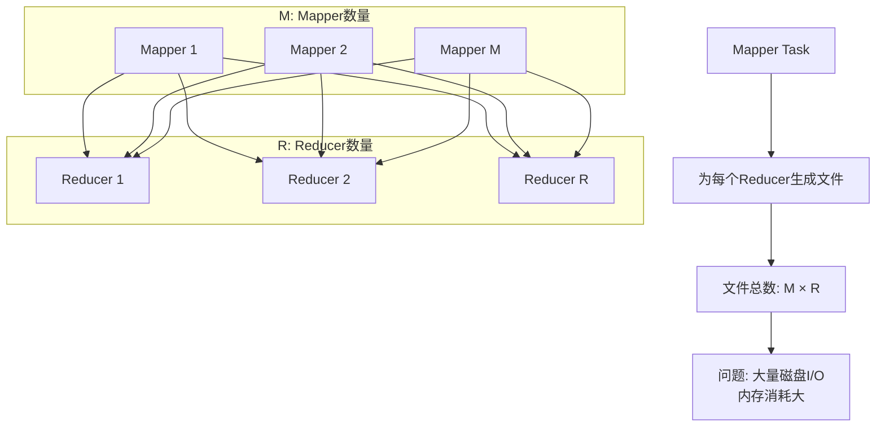
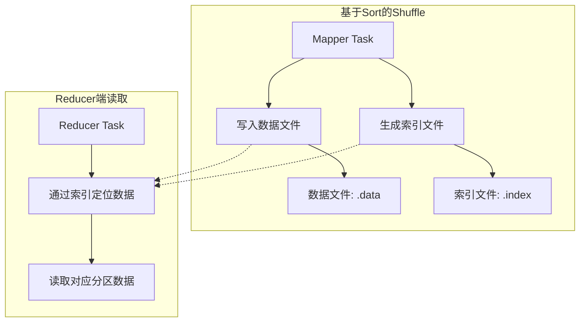
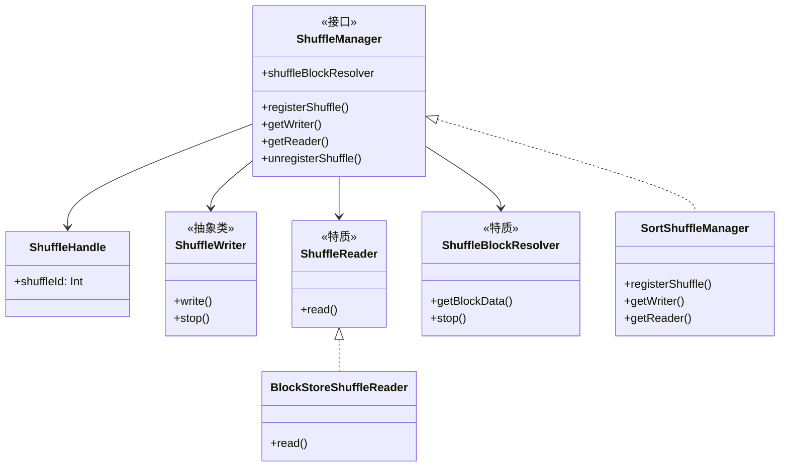
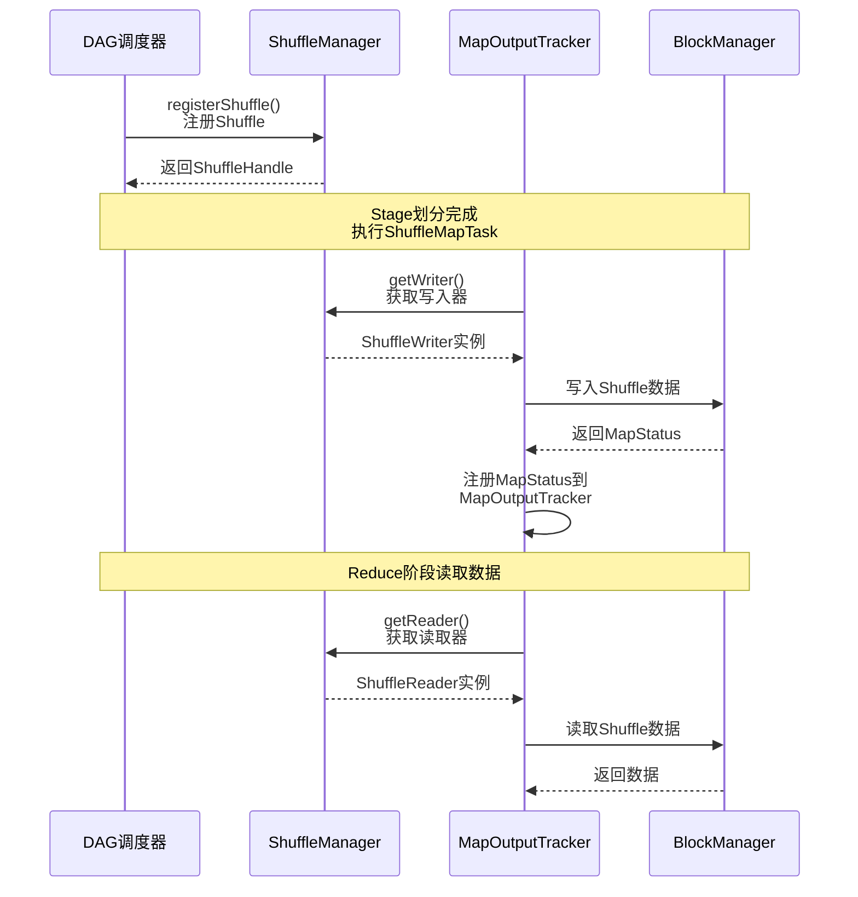

## 引言：Shuffle在Spark中的核心地位

在分布式计算框架中，**Shuffle（洗牌）** 是最核心也是最昂贵的操作之一。它负责在不同计算节点之间重新分配数据，是连接不同Stage（阶段）的桥梁。Spark的Shuffle机制经历了多次重要演进，从最初的简单实现发展到如今的高性能、可插拔式框架。理解Shuffle的演进历程和实现原理，对于优化Spark作业性能、诊断性能瓶颈至关重要。

## 一、Shuffle框架的演进历程

### 1.1 演进的两个维度

Spark Shuffle框架的演进可以从两个维度理解：

| 演进维度 | 主要内容 | 关键版本 |
|---------|---------|---------|
| **框架本身演进** | 面向接口编程，采用Build设计模式，提供可插拔式框架 | Spark 1.1+ |
| **实现机制演进** | Shuffle数据读写方式、数据块解析方式的优化 | 持续演进 |

### 1.2 具体实现机制的演进路径

#### 1.2.1 基于Hash的Shuffle（Spark 1.1之前）

**核心问题：** 产生大量中间文件，导致磁盘I/O和内存开销巨大



**文件数量计算：**
- 原始方案：`M × R` 个文件（M为Mapper数，R为Reducer数）
- 性能瓶颈：大量随机磁盘I/O操作，内存开销巨大

#### 1.2.2 引入Shuffle Consolidate机制（Spark 0.8.1+）

**优化思路：** 合并中间文件，减少文件数量

**配置方式：**
```scala
// 启用文件合并机制
spark.shuffle.consolidateFiles = true
```

**文件数量优化计算：**
```
原始: M × R
优化后: (E × C / T) × R

其中:
E = Executor数量
C = 可用CPU核心数
T = 每个Task分配的核心数（默认1）
```

**局限性：** 文件数量仍然依赖于Reducer数量，无法从根本上解决问题

#### 1.2.3 基于Sort的Shuffle（Spark 1.1+，1.2+默认）

**革命性改进：** 每个Mapper只生成两个文件，彻底解决文件过多问题



**核心优势：**
1. **文件数量大幅减少**：每个Mapper只生成2个文件（1个数据文件 + 1个索引文件）
   - 总文件数：`2 × M`（M为Mapper数）
2. **性能提升**：
   - 减少随机磁盘I/O
   - 降低内存开销
   - 支持更大的分区数

#### 1.2.4 基于Tungsten-Sort的Shuffle（Spark 1.4+）

**Tungsten计划优化：** 通过内存管理和二进制处理优化，极大提升性能

**关键改进：**
- 更合理的内存使用策略
- 引入外部排序机制
- 支持资源动态分配
- 引入外部Shuffle服务

## 二、Shuffle框架内核设计

### 2.1 设计目标：可插拔式架构

Spark从1.1版本开始引入可插拔式Shuffle框架，主要设计目标：

1. **内聚与解耦**：Shuffle模块内聚，与其他模块解耦
2. **可替换性**：方便替换、测试、扩展不同的Shuffle实现
3. **统一接口**：通过ShuffleManager统一管理各种实现

### 2.2 Shuffle框架整体架构



### 2.3 Shuffle执行流程

#### 2.3.1 Stage划分与Shuffle



#### 2.3.2 ShuffleManager核心接口

```scala
// Shuffle系统的可插拔接口，在Driver和每个Executor的SparkEnv实例中创建
private[spark] trait ShuffleManager {
  
  // 在Driver端向ShuffleManager注册一个Shuffle，获取一个Handle
  def registerShuffle[K, V, C](
    shuffleId: Int,
    numMaps: Int,
    dependency: ShuffleDependency[K, V, C]): ShuffleHandle
  
  // 获取对应给定分区使用的ShuffleWriter
  def getWriter[K, V](
    handle: ShuffleHandle, 
    mapId: Int, 
    context: TaskContext): ShuffleWriter[K, V]
  
  // 获取在Reduce阶段读取分区的ShuffleReader
  def getReader[K, C](
    handle: ShuffleHandle,
    startPartition: Int,
    endPartition: Int,
    context: TaskContext): ShuffleReader[K, C]
  
  // 移除ShuffleManager中对应的元数据信息
  def unregisterShuffle(shuffleId: Int): Boolean
  
  // 返回可以基于块坐标获取Shuffle块数据的ShuffleBlockResolver
  def shuffleBlockResolver: ShuffleBlockResolver
  
  // 终止ShuffleManager
  def stop(): Unit
}
```

### 2.4 关键组件详解

#### 2.4.1 ShuffleHandle - Shuffle句柄

```scala
// 记录Task与Shuffle相关的元数据，作为不同Shuffle实现的标志
abstract class ShuffleHandle(val shuffleId: Int) extends Serializable {}
```

#### 2.4.2 ShuffleWriter - 数据写入器

```scala
private[spark] abstract class ShuffleWriter[K, V] {
  // 将记录序列写入此任务的输出
  @throws[IOException]
  def write(records: Iterator[Product2[K, V]]): Unit
  
  // 关闭写入器，传递map是否完成的信息
  def stop(success: Boolean): Option[MapStatus]
}
```

#### 2.4.3 ShuffleReader - 数据读取器

```scala
private[spark] trait ShuffleReader[K, C] {
  // 读取此reduce任务合并的键值对
  def read(): Iterator[Product2[K, C]]
}
```

#### 2.4.4 ShuffleBlockResolver - 块解析器

```scala
// 知道如何通过逻辑Shuffle块标识信息获取块数据
trait ShuffleBlockResolver {
  type ShuffleId = Int
  
  // 获取指定块的数据，如果无法获取则抛出异常
  def getBlockData(blockId: ShuffleBlockId): ManagedBuffer
  
  def stop(): Unit
}
```

## 三、Shuffle框架源码解析

### 3.1 ShuffleManager配置与实例化

Spark通过配置属性`spark.shuffle.manager`指定ShuffleManager实现：

```scala
// SparkEnv.scala中的配置代码（Spark 2.1.1版本）
val shortShuffleMgrNames = Map(
  "sort" -> classOf[org.apache.spark.shuffle.sort.SortShuffleManager].getName,
  "tungsten-sort" -> classOf[org.apache.spark.shuffle.sort.SortShuffleManager].getName
)

// 默认使用"sort"，即SortShuffleManager
val shuffleMgrName = conf.get("spark.shuffle.manager", "sort")
val shuffleMgrClass = shortShuffleMgrNames.getOrElse(
  shuffleMgrName.toLowerCase(Locale.ROOT),  // Spark 2.2.0+添加Locale.ROOT
  shuffleMgrName
)

// 实例化ShuffleManager
val shuffleManager = instantiateClass[ShuffleManager](shuffleMgrClass)
```

**补充说明：**
- Spark 2.0+版本支持`sort`和`tungsten-sort`两种方式
- `Locale.ROOT`区域设置确保在不同语言环境下的一致性

### 3.2 Shuffle数据写入流程

#### 3.2.1 ShuffleMapTask中的写数据

```scala
// ShuffleMapTask.scala - runTask方法
override def runTask(context: TaskContext): MapStatus = {
  // ...
  var writer: ShuffleWriter[Any, Any] = null
  try {
    // 1. 从SparkEnv获取ShuffleManager
    val manager = SparkEnv.get.shuffleManager
    
    // 2. 获取ShuffleWriter
    writer = manager.getWriter[Any, Any](
      dep.shuffleHandle,  // 从ShuffleDependency获取
      partitionId,         // 当前Task对应的分区ID
      context
    )
    
    // 3. 写入当前分区的数据
    writer.write(rdd.iterator(partition, context)
      .asInstanceOf[Iterator[_ <: Product2[Any, Any]]])
    
    // 4. 停止写入器并获取状态
    writer.stop(success = true).get
  } catch {
    // 异常处理...
  }
}
```

**写入流程总结：**
1. 获取ShuffleManager实例
2. 通过ShuffleHandle获取ShuffleWriter
3. 调用write方法写入数据
4. 停止写入器并返回MapStatus

### 3.3 Shuffle数据读取流程

#### 3.3.1 带宽依赖RDD的数据读取

以CoGroupedRDD为例，展示带宽依赖RDD如何读取Shuffle数据：

```scala
// CoGroupedRDD.scala - compute方法（Spark 1.6.0版本）
override def compute(s: Partition, context: TaskContext): 
  Iterator[(K, Array[Iterable[_]])] = {
  
  val split = s.asInstanceOf[CoGroupPartition]
  val numRdds = dependencies.length
  
  val rddIterators = new ArrayBuffer[(Iterator[Product2[K, Any]], Int)]
  
  for ((dep, depNum) <- dependencies.zipWithIndex) dep match {
    // 窄依赖：直接从父RDD读取
    case oneToOneDependency: OneToOneDependency[Product2[K, Any]] @unchecked =>
      val dependencyPartition = split.narrowDeps(depNum).get.split
      val it = oneToOneDependency.rdd.iterator(dependencyPartition, context)
      rddIterators += ((it, depNum))
    
    // 宽依赖：通过ShuffleManager读取Shuffle数据
    case shuffleDependency: ShuffleDependency[_, _, _] =>
      // 获取ShuffleReader读取Shuffle数据
      val it = SparkEnv.get.shuffleManager
        .getReader(
          shuffleDependency.shuffleHandle,  // Shuffle句柄
          split.index,                      // 起始分区
          split.index + 1,                  // 结束分区（左闭右开）
          context
        )
        .read()
      
      rddIterators += ((it, depNum))
  }
  
  // 后续处理：创建外部Map，合并数据...
}
```

#### 3.3.2 BlockStoreShuffleReader数据读取详解

```scala
// BlockStoreShuffleReader.scala - read方法（Spark 2.1.1版本）
override def read(): Iterator[Product2[K, C]] = {
  // 1. 通过ShuffleBlockFetcherIterator获取数据块
  val blockFetcherItr = new ShuffleBlockFetcherIterator(
    context,
    blockManager.shuffleClient,
    blockManager,
    // 获取Map输出的元数据信息
    mapOutputTracker.getMapSizesByExecutorId(
      handle.shuffleId, 
      startPartition, 
      endPartition
    ),
    // 读取数据大小限制：默认48MB
    SparkEnv.get.conf.getSizeAsMb("spark.reducer.maxSizeInFlight", "48m") * 1024 * 1024,
    SparkEnv.get.conf.getInt("spark.reducer.maxReqsInFlight", Int.MaxValue)
  )
  
  // 2. 数据处理流程
  val wrappedStreams = blockFetcherItr.map { case (blockId, inputStream) =>
    serializerManager.wrapStream(blockId, inputStream)
  }
  
  val serializerInstance = dep.serializer.newInstance()
  
  // 3. 为每个流创建键值迭代器
  val recordIter = wrappedStreams.flatMap { wrappedStream =>
    serializerInstance.deserializeStream(wrappedStream).asKeyValueIterator
  }
  
  // 4. 数据聚合处理（如果配置了聚合器）
  val aggregatedIter: Iterator[Product2[K, C]] = if (dep.aggregator.isDefined) {
    if (dep.mapSideCombine) {
      // Map端已做聚合优化
      val combinedKeyValuesIterator = interruptibleIter.asInstanceOf[Iterator[(K, C)]]
      dep.aggregator.get.combineCombinersByKey(combinedKeyValuesIterator, context)
    } else {
      // Map端未做聚合
      val keyValuesIterator = interruptibleIter.asInstanceOf[Iterator[(K, Nothing)]]
      dep.aggregator.get.combineValuesByKey(keyValuesIterator, context)
    }
  } else {
    interruptibleIter.asInstanceOf[Iterator[Product2[K, C]]]
  }
  
  // 5. 数据排序处理（如果配置了排序）
  dep.keyOrdering match {
    case Some(keyOrd: Ordering[K]) =>
      // 使用外部排序器对数据进行排序
      val sorter = new ExternalSorter[K, C, C](
        context, 
        ordering = Some(keyOrd), 
        serializer = dep.serializer
      )
      sorter.insertAll(aggregatedIter)
      CompletionIterator[Product2[K, C], Iterator[Product2[K, C]]](
        sorter.iterator, 
        sorter.stop()
      )
    case None =>
      // 不需要排序，直接返回
      aggregatedIter
  }
}
```

#### 3.3.3 数据块获取策略

```scala
// ShuffleBlockFetcherIterator - initialize方法
private[this] def initialize(): Unit = {
  // 1. 任务完成回调清理
  context.addTaskCompletionListener(_ => cleanup())
  
  // 2. 拆分本地和远程数据块请求
  val remoteRequests = splitLocalRemoteBlocks()
  
  // 3. 随机化远程请求顺序（负载均衡）
  fetchRequests ++= Utils.randomize(remoteRequests)
  
  // 4. 发送数据获取请求
  fetchUpToMaxBytes()
  
  // 5. 获取本地数据块
  fetchLocalBlocks()
}
```

**数据本地性优化：**
- 优先从本地节点读取数据块
- 远程读取时考虑带宽限制和并行度
- 通过`MapOutputTracker`获取数据块位置信息

### 3.4 数据排序机制

当需要对分区内部数据进行排序时，通过`keyOrdering`配置排序算法：

```scala
// OrderedRDDFunctions - sortByKey方法
def sortByKey(
  ascending: Boolean = true, 
  numPartitions: Int = self.partitions.length
): RDD[(K, V)] = self.withScope {
  
  // 1. 使用RangePartitioner（而非HashPartitioner）
  val part = new RangePartitioner(numPartitions, self, ascending)
  
  // 2. 创建ShuffledRDD并设置Key排序算法
  new ShuffledRDD[K, V, V](self, part)
    .setKeyOrdering(if (ascending) ordering else ordering.reverse)
}
```

**排序执行流程：**
1. 在read方法中检查`dep.keyOrdering`配置
2. 如果配置了排序，使用`ExternalSorter`进行外部排序
3. 支持内存不足时spill到磁盘（通过`spark.shuffle.spill`配置）

## 四、Shuffle性能优化实践

### 4.1 关键配置参数

| 配置项 | 默认值 | 说明 | 优化建议 |
|--------|--------|------|----------|
| `spark.shuffle.manager` | `sort` | Shuffle管理器类型 | 生产环境使用`sort`或`tungsten-sort` |
| `spark.shuffle.consolidateFiles` | `false` | 是否合并文件 | 基于Hash的Shuffle可启用 |
| `spark.reducer.maxSizeInFlight` | `48m` | 读取数据大小限制 | 根据网络带宽调整 |
| `spark.shuffle.spill` | `true` | 是否允许spill到磁盘 | 必须开启，避免OOM |
| `spark.shuffle.compress` | `true` | 是否压缩Shuffle数据 | 通常开启以减少网络传输 |

### 4.2 常见性能问题与解决方案

#### 问题1：Shuffle文件过多
- **症状**：磁盘I/O高，任务执行慢
- **解决方案**：
  1. 使用基于Sort的Shuffle
  2. 调整分区数，避免过多分区
  3. 启用`spark.shuffle.consolidateFiles`（如果使用Hash Shuffle）

#### 问题2：Shuffle数据倾斜
- **症状**：某些Task执行时间远长于其他Task
- **解决方案**：
  1. 使用`salting`技术分散热点Key
  2. 调整自定义分区器
  3. 使用`repartition`重新分布数据

#### 问题3：网络传输瓶颈
- **症状**：Shuffle读写时间占比高
- **解决方案**：
  1. 调整`spark.reducer.maxSizeInFlight`
  2. 启用数据压缩（`spark.shuffle.compress`）
  3. 优化数据序列化方式

## 五、总结与展望

### 5.1 演进总结

Spark Shuffle框架经历了从简单到复杂、从固定到可插拔的演进过程：

1. **基于Hash的Shuffle**（原始方案）：简单但性能差
2. **引入Consolidate机制**：优化文件数量，但未根本解决问题
3. **基于Sort的Shuffle**：革命性改进，成为默认方案
4. **Tungsten-Sort优化**：内存和二进制处理优化

### 5.2 架构设计精华

Spark Shuffle框架的可插拔设计体现了优秀的软件工程思想：

1. **接口抽象**：通过`ShuffleManager`统一管理不同实现
2. **组件解耦**：`Writer`、`Reader`、`Resolver`职责分离
3. **扩展性**：支持自定义Shuffle实现
4. **数据本地性**：优先本地读取，减少网络传输

### 5.3 未来发展方向

随着Spark持续演进，Shuffle框架可能在以下方向进一步优化：

1. **更智能的数据分布**：基于数据特征的自动分区优化
2. **硬件感知优化**：针对SSD、NVMe等存储设备的优化
3. **动态资源分配**：根据Shuffle数据量动态调整资源
4. **更高效的序列化**：减少序列化/反序列化开销

### 5.4 实际应用建议

对于Spark开发者，理解Shuffle机制有助于：

1. **性能调优**：识别和解决Shuffle相关性能瓶颈
2. **参数配置**：合理设置Shuffle相关配置参数
3. **代码优化**：编写Shuffle友好的Spark作业
4. **问题诊断**：快速定位Shuffle相关的问题根源

通过深入理解Shuffle框架的演进历程、架构设计和源码实现，开发者可以更好地驾驭Spark这个强大的分布式计算框架，构建高效、稳定的数据处理应用。