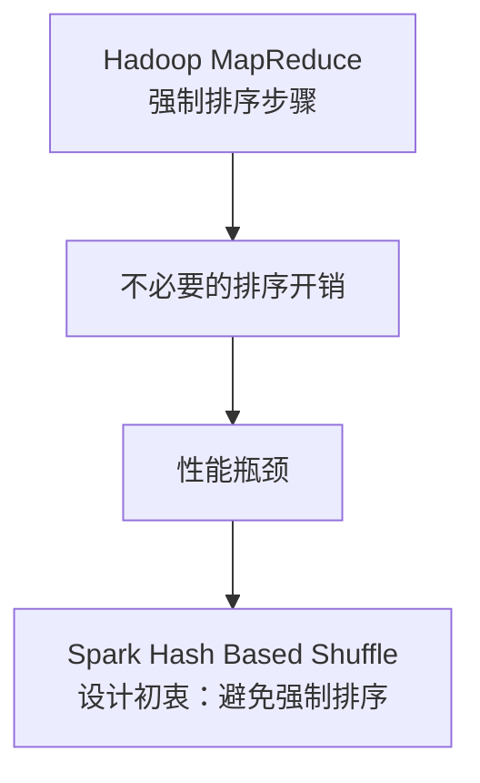
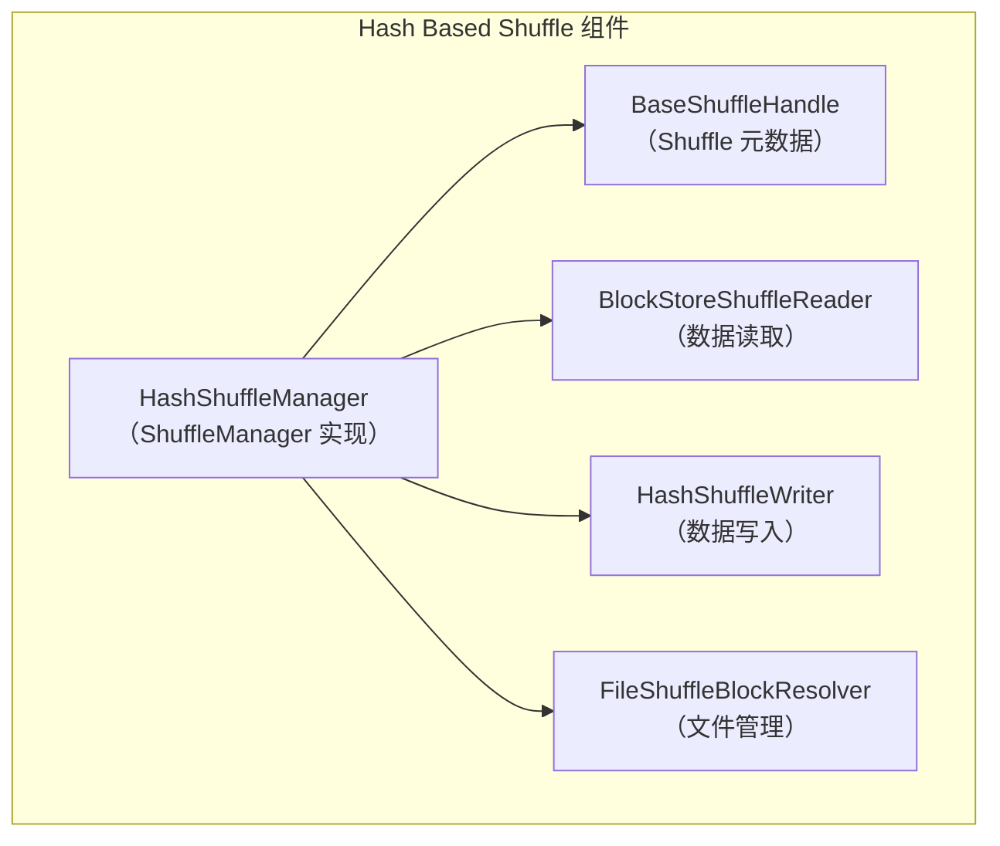
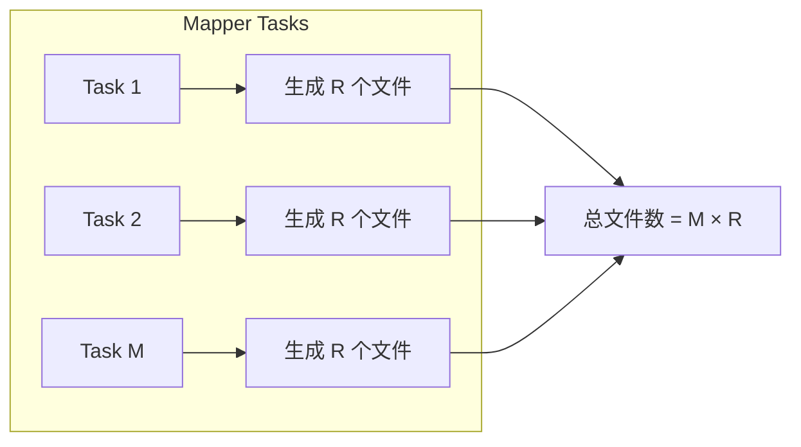
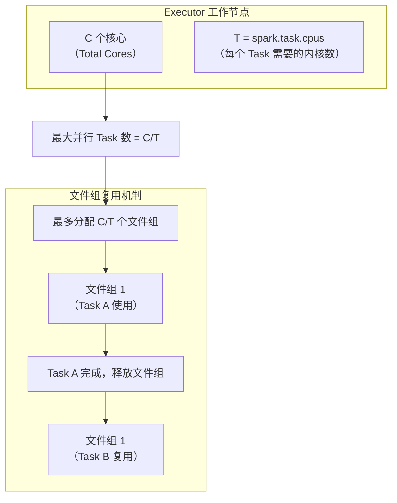

## 概述：Spark Shuffle 的演进之路

在分布式计算框架中，**Shuffle** 是连接 Map 和 Reduce 阶段的关键操作，负责将数据重新分区和重组。Spark 作为现代大数据处理引擎，其 Shuffle 机制的演进反映了对性能和资源利用率的不断优化。

### Spark Shuffle 实现方式的变迁

| 版本 | 默认 Shuffle 方式 | 特点 |
|------|------------------|------|
| Spark 1.1 之前 | Hash Based Shuffle | 唯一实现，避免不必要的排序 |
| Spark 1.1 | 引入 Sort Based Shuffle | 提供另一种选择 |
| Spark 1.2+ | Sort Based Shuffle（默认） | 解决 Hash 方式的文件过多问题 |
| Spark 2.0+ | 完全移除 Hash Based Shuffle | 不再作为可选方案 |

### Hash Based Shuffle 的设计初衷

Spark 最初采用 Hash Based Shuffle 的主要动机是**避免 Hadoop MapReduce 中强制排序带来的不必要开销**。在 Hadoop 中，Sort 是固定步骤，即使应用场景不需要排序，也会产生额外的计算和内存开销。



## Hash Based Shuffle 内核架构

### 核心组件架构

Hash Based Shuffle 的实现基于 `HashShuffleManager` 类，它是 `ShuffleManager` 的具体实现子类。



### 核心组件功能详解

#### 1. BaseShuffleHandle
携带 Shuffle 最基本的元数据信息：
- `shuffleId`：Shuffle 操作的唯一标识符
- `numMaps`：Mapper 端的分区数量
- `dependency`：依赖关系信息

#### 2. BlockStoreShuffleReader
负责从磁盘读取 Shuffle 数据块，处理 Reduce 端的数据获取。

#### 3. FileShuffleBlockResolver
管理基于磁盘的块数据写入器，每个 Shuffle 任务为每个 Reduce 任务分配一个文件。

#### 4. HashShuffleWriter
负责 Shuffle 数据块的写入操作，是 Hash Based Shuffle 的核心写入组件。

## Hash Based Shuffle 的两种实现方式

### 方式一：基本实现（无文件合并）

这是最初的 Hash Based Shuffle 实现，存在明显的性能问题。

#### 文件生成机制
```
Executor-Mapper（Mapper 端工作节点）
├── Task 1
│   ├── 为 Reduce 1 生成文件
│   ├── 为 Reduce 2 生成文件
│   └── ...
│       └── 为 Reduce R 生成文件
├── Task 2
│   ├── 为 Reduce 1 生成文件
│   ├── 为 Reduce 2 生成文件
│   └── ...
│       └── 为 Reduce R 生成文件
└── ...
    └── Task M
        ├── 为 Reduce 1 生成文件
        ├── 为 Reduce 2 生成文件
        └── ...
            └── 为 Reduce R 生成文件
```

**文件命名格式**：`shuffle_shuffleId_mapId_reduceId`
- 示例：`shuffle_1_1_1` 表示 shuffleId=1, mapId=1, reduceId=1

**文件数量计算**：
- M：Mapper 端 Task 数量
- R：Reduce 端 Task 数量
- **总文件数 = M × R**



#### 性能问题分析
这种实现方式的主要问题是**文件数量爆炸式增长**：
- 假设 M=1000，R=1000 → 生成 1,000,000 个文件
- 大量小文件导致：
  - 文件系统压力增大
  - 磁盘 I/O 开销增加
  - 内存缓存空间需求增加

### 方式二：优化实现（带文件合并）

为了解决文件过多的问题，Spark 引入了文件合并机制，通过配置属性 `spark.shuffle.consolidateFiles` 控制。

#### 文件合并机制原理



#### 文件命名格式变化
- **合并前**：`shuffle_shuffleId_mapId_reduceId`
- **合并后**：`merged_shuffle_shuffleId_bucketId_fileId`

**关键变化**：
1. 文件名前缀从 `shuffle` 变为 `merged_shuffle`
2. `mapId` 被替换为 `fileId`（文件组标识）
3. 多个 Mapper Task 共享同一个文件组

#### 文件数量优化计算
```
总文件数 = E × (C/T) × R
其中：
E：工作节点（Executor）数量
C：每个 Executor 的核心数
T：每个 Task 需要的内核数（spark.task.cpus）
R：Reduce 端分区数
```

**优化效果示例**：
- 假设：E=10, C=4, T=1, R=1000
- 基本方式：10 × 1000 × 1000 = 10,000,000 个文件
- 合并方式：10 × (4/1) × 1000 = 40,000 个文件
- **优化比例：250:1**

## Hash Based Shuffle 的优缺点分析

### 优点
1. **避免不必要的排序开销**
   - 不需要像 Hadoop MapReduce 那样强制排序
   - 减少 CPU 计算开销

2. **内存使用更高效**
   - 排序操作需要额外的内存缓冲区
   - Hash 方式可以直接写入文件，内存压力较小

### 缺点
1. **文件数量过多**
   - 基本方式生成 M×R 个文件
   - 对文件系统造成巨大压力

2. **磁盘 I/O 性能问题**
   - 大量小文件随机读写
   - 磁盘寻道时间成为瓶颈

3. **内存压力**
   - 需要缓存大量文件句柄
   - 数据块写入时需要大量缓存空间

> **补充说明**：根据 Spark 创始人之一 Reynold Xin 的性能测试，Sort Based Shuffle 在几乎所有测试场景中都优于 Hash Based Shuffle，具有更低的内存使用和更好的性能表现。相关数据可参考 [SPARK-3280](https://issues.apache.org/jira/browse/SPARK-3280)。

## Hash Based Shuffle 源码解析

### 核心写入逻辑（HashShuffleWriter）

```scala
// Spark 1.6.0 版本的 HashShuffleWriter 核心代码
private[spark] class HashShuffleWriter[K, V](
  shuffleBlockResolver: FileShuffleBlockResolver,
  handle: BaseShuffleHandle[K, V, _],
  mapId: Int,
  context: TaskContext)
  extends ShuffleWriter[K, V] with Logging {

  // 获取分区器确定输出分区数
  private val dep = handle.dependency
  private val numOutputSplits = dep.partitioner.numPartitions

  // 获取数据读写块管理器
  private val blockManager = SparkEnv.get.blockManager
  private val ser = Serializer.getSerializer(dep.serializer.getOrElse(null))

  // 获取 ShuffleWriterGroup 实例
  private val shuffle = shuffleBlockResolver.forMapTask(
    dep.shuffleId, mapId, numOutputSplits, ser, writeMetrics)

  // 数据写入方法
  override def write(records: Iterator[Product2[K, V]]): Unit = {
    // 判断是否需要 Map 端 Combine
    val iter = if (dep.aggregator.isDefined) {
      if (dep.mapSideCombine) {
        // 使用 ExternalAppendOnlyMap 进行聚合
        dep.aggregator.get.combineValuesByKey(records, context)
      } else {
        records
      }
    } else {
      require(!dep.mapSideCombine, "Map-side combine without Aggregator specified!")
      records
    }

    // 根据分区器将记录写入对应的 bucket
    for (elem <- iter) {
      val bucketId = dep.partitioner.getPartition(elem._1)
      shuffle.writers(bucketId).write(elem._1, elem._2)
    }
  }
}
```

### 文件合并机制实现

#### FileShuffleBlockResolver 核心逻辑

```scala
// Spark 1.5.0 版本的文件合并实现
def forMapTask(shuffleId: Int, mapId: Int, numBuckets: Int,
               serializer: Serializer,
               writeMetrics: ShuffleWriteMetrics): ShuffleWriterGroup = {
  new ShuffleWriterGroup {
    // 判断是否启用文件合并
    val writers: Array[DiskBlockObjectWriter] = if (consolidateShuffleFiles) {
      // 获取未使用的文件组
      fileGroup = getUnusedFileGroup()
      Array.tabulate[DiskBlockObjectWriter](numBuckets) { bucketId =>
        val blockId = ShuffleBlockId(shuffleId, mapId, bucketId)
        // 复用文件组中的文件
        blockManager.getDiskWriter(
          blockId, fileGroup(bucketId), serializerInstance, bufferSize, writeMetrics)
      }
    } else {
      // 基本方式：每个 Task 创建新文件
      Array.tabulate[DiskBlockObjectWriter](numBuckets) { bucketId =>
        val blockId = ShuffleBlockId(shuffleId, mapId, bucketId)
        val blockFile = blockManager.diskBlockManager.getFile(blockId)
        val tmp = Utils.tempFileWith(blockFile)
        blockManager.getDiskWriter(
          blockId, tmp, serializerInstance, bufferSize, writeMetrics)
      }
    }

    // 释放写入器时的处理
    override def releaseWriters(success: Boolean) {
      if (consolidateShuffleFiles) {
        if (success) {
          // 记录 Map 输出的偏移量和长度
          val offsets = writers.map(_.fileSegment().offset)
          val lengths = writers.map(_.fileSegment().length)
          fileGroup.recordMapOutput(mapId, offsets, lengths)
        }
        // 回收文件组供后续复用
        recycleFileGroup(fileGroup)
      } else {
        shuffleState.completedMapTasks.add(mapId)
      }
    }
  }
}
```

#### 文件组管理机制

```scala
// 获取未使用的文件组
private def getUnusedFileGroup(): ShuffleFileGroup = {
  // 从队列中获取已释放的文件组
  val fileGroup = shuffleState.unusedFileGroups.poll()
  if (fileGroup != null) fileGroup else newFileGroup()
}

// 创建新的文件组
private def newFileGroup(): ShuffleFileGroup = {
  // 文件编号递增，用于文件名
  val fileId = shuffleState.nextFileId.getAndIncrement()
  val files = Array.tabulate[File](numBuckets) { bucketId =>
    // 生成物理文件名
    val filename = physicalFileName(shuffleId, bucketId, fileId)
    blockManager.diskBlockManager.getFile(filename)
  }
  // 创建并注册文件组
  val fileGroup = new ShuffleFileGroup(shuffleId, fileId, files)
  shuffleState.allFileGroups.add(fileGroup)
  fileGroup
}

// 生成物理文件名
private def physicalFileName(shuffleId: Int, bucketId: Int, fileId: Int) = {
  "merged_shuffle_%d_%d_%d".format(shuffleId, bucketId, fileId)
}
```

### Task 调度与并行度控制

```scala
// TaskSchedulerImpl 中的资源分配逻辑
private def resourceOfferSingleTaskSet(
  taskSet: TaskSetManager,
  maxLocality: TaskLocality,
  shuffledOffers: Seq[WorkerOffer],
  availableCpus: Array[Int],
  tasks: Seq[ArrayBuffer[TaskDescription]]): Boolean = {
  
  var launchedTask = false
  for (i <- 0 until shuffledOffers.size) {
    val execId = shuffledOffers(i).executorId
    val host = shuffledOffers(i).host
    
    // 关键判断：可用 CPU 核心数是否满足 Task 需求
    if (availableCpus(i) >= CPUS_PER_TASK) {
      try {
        for (task <- taskSet.resourceOffer(execId, host, maxLocality)) {
          // 分配 Task 到 Executor
          launchedTask = true
        }
      } catch {
        // 异常处理
      }
    }
  }
  return launchedTask
}

// 每个 Task 请求的 CPU 核心数配置
val CPUS_PER_TASK = conf.getInt("spark.task.cpus", 1)
```

## Hash Based Shuffle 的淘汰与启示

### 淘汰原因总结

1. **文件数量问题无法彻底解决**
   - 即使有文件合并机制，文件数量仍然与 Reduce 分区数成正比
   - 在大规模集群中仍然是瓶颈

2. **性能测试结果**
   - Sort Based Shuffle 在几乎所有场景都表现更好
   - 内存使用更高效，文件数量更少

3. **工程维护成本**
   - 需要维护两套 Shuffle 实现
   - 增加了代码复杂性和测试负担

### 对分布式系统设计的启示

1. **权衡设计的重要性**
   - Hash Based Shuffle：避免排序，但引入文件数量问题
   - Sort Based Shuffle：增加排序开销，但大幅减少文件数量
   - **没有完美的方案，只有适合场景的权衡**

2. **资源管理的复杂性**
   - 文件句柄、内存缓存、磁盘 I/O 需要综合考虑
   - 配置参数（如 `spark.task.cpus`）对性能有显著影响

3. **渐进式优化策略**
   - 从基本实现开始，根据实际需求逐步优化
   - 文件合并机制是对原始 Hash Based Shuffle 的改进
   - 最终被更优的 Sort Based Shuffle 取代

### 实际应用建议

虽然 Hash Based Shuffle 已在 Spark 2.0+ 中被移除，但理解其设计思想和演进过程对于：

1. **系统架构师**：理解分布式系统设计的权衡艺术
2. **性能调优工程师**：掌握 Shuffle 优化的核心思路
3. **大数据开发者**：了解 Spark 内部机制，编写更高效的代码

> **历史视角**：Hash Based Shuffle 代表了 Spark 早期对 Hadoop MapReduce 局限性的突破尝试，虽然最终被更优的方案取代，但其设计思路仍然值得学习和借鉴。