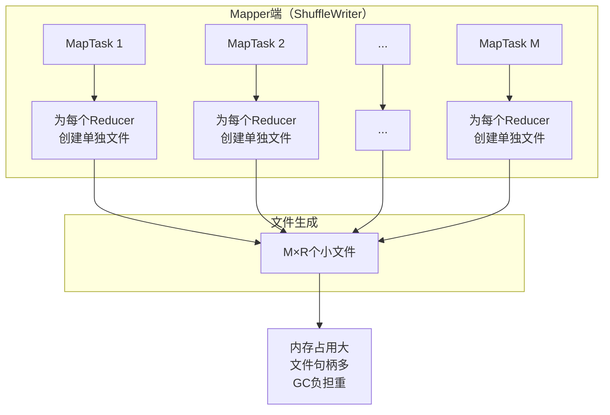
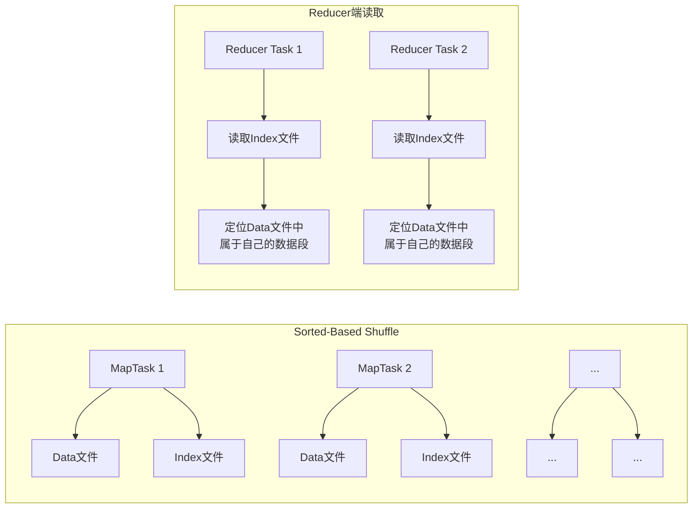
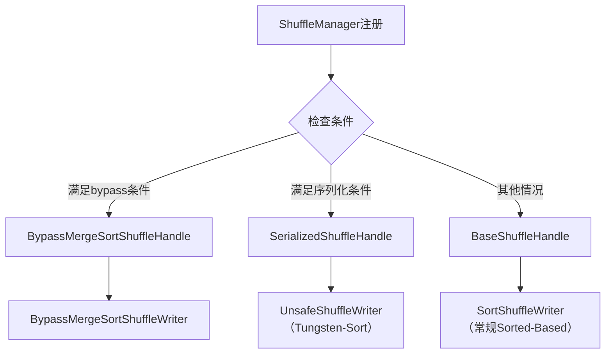
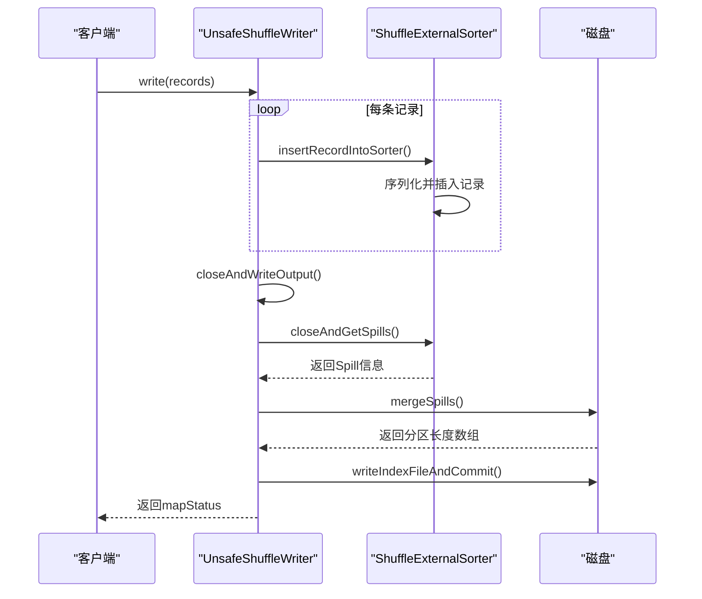

## 概述：为什么Shuffle如此重要？

在分布式计算框架中，Shuffle（混洗）是连接不同计算阶段的关键桥梁。它负责将前一个阶段（Stage）的输出数据重新分区并传输给下一个阶段。**Shuffle的性能直接影响整个Spark作业95%以上的执行效率**，因为在这个过程中涉及到：

- **内存操作**：数据在内存中的缓存和管理
- **磁盘I/O**：数据溢写到磁盘和从磁盘读取
- **网络I/O**：数据在网络中的传输
- **JVM管理**：垃圾回收（GC）和内存管理

如果程序代码本身已经优化得很好，那么性能瓶颈几乎都集中在Shuffle阶段。理解Shuffle机制的演进，就是理解Spark如何从处理中小规模数据的平台成长为支持海量数据处理的企业级框架的关键。

## 1. HashShuffle：简单但存在严重瓶颈

### 1.1 HashShuffle的工作原理

在Spark早期版本中，HashShuffle是最初采用的Shuffle机制。它的工作原理相对简单：



### 1.2 HashShuffle的核心问题

HashShuffle最致命的问题是**产生过多的小文件**。具体来说：

- **文件数量公式**：`Mapper分片数量 × Reducer分片数量 = M × R`
- **示例**：如果Mapper端有1000个数据分片，Reducer端也有1000个数据分片，那么会产生 **1,000,000个** 小文件

这种设计带来的严重后果：

1. **内存消耗巨大**
   - 每个文件都需要在内存中维护Buffer缓存
   - 需要管理大量的文件句柄
   - 极易导致OutOfMemoryError（OOM）

2. **磁盘I/O负担重**
   - 大量小文件的读写操作
   - 磁盘寻道时间成为瓶颈

3. **网络通道压力大**
   - Reducer端需要打开大量网络连接读取数据
   - 容易导致"文件找不到"的经典错误（实际是GC导致程序不响应）

4. **垃圾回收（GC）负担沉重**
   - 大量对象在内存中创建和销毁
   - GC暂停时间显著增加

### 1.3 HashShuffle的适用场景

虽然HashShuffle存在上述问题，但在某些特定场景下仍有价值：
- 数据量非常小
- Reducer数量极少
- 对性能要求不高的测试环境

## 2. Sorted-Based Shuffle：突破性改进

### 2.1 设计理念：减少文件数量

Sorted-Based Shuffle的核心创新在于**显著减少了Mapper端产生的文件数量**。它不再为每个Reducer创建一个单独的文件，而是：

1. **每个ShuffleMapTask只产生两个文件**：
   - 一个Data文件：存储当前Task的所有Shuffle输出数据
   - 一个Index文件：存储Data文件中数据的分类信息（按分区ID）

2. **文件数量公式**：`并发度 × 2`
   - 如果并发度是100，只产生200个文件（相比HashShuffle的1,000,000个）



### 2.2 Sorted-Based Shuffle的工作流程

#### 2.2.1 写入阶段（ShuffleWriter）

1. **数据排序**：在Mapper端进行"二次排序"
   - 首先按Partition ID排序
   - 然后按数据本身的Key排序（如果指定了Ordering）
   
2. **写入文件**：
   - 将排序后的数据写入Data文件
   - 同时记录每个Partition在文件中的偏移量，生成Index文件

3. **内存管理**：
   - 使用ExternalSorter进行外部排序
   - 当内存达到阈值时，将数据Spill到磁盘
   - 最后合并所有Spill文件

#### 2.2.2 读取阶段（ShuffleReader）

1. **获取元数据**：Reducer Task首先从Driver获取父Stage中每个ShuffleMapTask的输出位置信息

2. **读取索引**：根据位置信息获取Index文件，解析出自己需要的数据在Data文件中的位置

3. **读取数据**：根据索引定位，从Data文件中读取属于自己的数据段

### 2.3 Sorted-Based Shuffle的优势

| 优势 | 说明 |
|------|------|
| **内存占用减少** | 只需要维护少量文件句柄，内存压力显著降低 |
| **支持大规模数据处理** | 可以支持几千甚至几万台集群规模 |
| **网络效率提升** | Reducer端抓取数据的次数减少，网络通道句柄变少 |
| **框架运行时消耗降低** | 减少了Spark框架运行时必须消耗的内存 |

### 2.4 Sorted-Based Shuffle的局限性

尽管Sorted-Based Shuffle解决了HashShuffle的主要问题，但它仍然存在一些不足：

1. **强制排序带来的开销**
   - 即使数据本身不需要排序，也必须进行排序操作
   - 排序操作消耗CPU和内存资源

2. **两次排序问题**
   - 如果分片内也需要排序，需要进行Mapper端和Reducer端的两次排序

3. **Task数量过大时的瓶颈**
   - 如果Mapper中Task的数量过大，仍然会产生较多小文件
   - Reducer端需要同时大量反序列化记录，导致内存消耗和GC负担

4. **基于记录排序的性能消耗**
   - 这是Sort-Based Shuffle最致命的性能消耗点

## 3. Tungsten-Sorted Based Shuffle：进一步的优化

### 3.1 Tungsten项目的优化方向

Tungsten项目主要从三个方面进行优化：

1. **内存管理优化**：使用基于Page的内存管理模型，直接处理序列化数据
2. **CPU开销降低**：避免数据反序列化的处理开销
3. **缓存友好性**：优化数据布局，提高CPU缓存命中率

### 3.2 Tungsten-Sort与Sorted-Based Shuffle的关系

在Spark的实现中，**Tungsten-Sort Shuffle已经并入了Sorted-Based Shuffle**。Spark引擎会自动识别程序需要的是Sorted-Based Shuffle还是Tungsten-Sort Shuffle：



### 3.3 使用Tungsten-Sort的条件

要使用基于Tungsten Sort的Shuffle实现机制，需要满足以下严格条件：

1. **Shuffle依赖中不带聚合操作**或没有对输出进行排序的要求
2. **序列化器支持序列化值的重定位**
   - 当前仅支持KryoSerializer
   - Spark SQL子框架自定义的序列化器
3. **输出分区个数少于16,777,216个**
4. **单条记录长度不超过128MB**（受PackedRecordPointer类内存模型限制）

### 3.4 Tungsten-Sort的核心改进

#### 3.4.1 避免反序列化

常规Sorted-Based Shuffle在处理数据时：
- 数据在内存中以**反序列化形式**存放
- 存储到磁盘时进行序列化
- 反序列化后的数据远大于序列化数据

Tungsten-Sort的改进：
- 直接处理**序列化的数据**
- 避免反序列化的内存开销
- 减少CPU处理开销

#### 3.4.2 内存管理模型

Tungsten-Sort引入了新的内存管理模型：

```java
// UnsafeShuffleWriter构建时传入TaskMemoryManager
new UnsafeShuffleWriter(
    env.blockManager,
    shuffleBlockResolver.asInstanceOf[IndexShuffleBlockResolver],
    context.taskMemoryManager(),  // 专门的内存管理器
    unsafeShuffleHandle,
    mapId,
    context,
    env.conf)
```

TaskMemoryManager负责管理分配给Task的内存，与Task是一对一的关系。

### 3.5 Tungsten-Sort的写入过程

Tungsten-Sort使用UnsafeShuffleWriter进行数据写入，主要步骤：



#### 3.5.1 记录插入过程

```scala
void insertRecordIntoSorter(Product2<K, V> record) throws IOException {
    final K key = record._1();
    final int partitionId = partitioner.getPartition(key);
    
    // 序列化记录到缓冲区
    serBuffer.reset();
    serOutputStream.writeKey(key, OBJECT_CLASS_TAG);
    serOutputStream.writeValue(record._2(), OBJECT_CLASS_TAG);
    serOutputStream.flush();
    
    final int serializedRecordSize = serBuffer.size();
    
    // 将序列化记录插入排序器
    sorter.insertRecord(
        serBuffer.getBuf(), 
        Platform.BYTE_ARRAY_OFFSET,
        serializedRecordSize,
        partitionId);
}
```

#### 3.5.2 文件合并策略

Tungsten-Sort根据不同的条件采用不同的文件合并策略：

```scala
private long[] mergeSpills(SpillInfo[] spills, File outputFile) throws IOException {
    // 检查是否启用快速合并
    final boolean fastMergeEnabled = sparkConf.getBoolean(
        "spark.shuffle.unsafe.fastMergeEnabled", true);
    
    // 检查是否支持快速合并（无压缩或压缩码支持序列化流合并）
    final boolean fastMergeIsSupported = !compressionEnabled || 
        CompressionCodec$.MODULE$.supportsConcatenationOfSerializedStreams(compressionCodec);
    
    if (spills.length == 0) {
        // 创建空文件
        new FileOutputStream(outputFile).close();
        return new long[partitioner.numPartitions()];
    } else if (spills.length == 1) {
        // 直接重命名单个Spill文件
        Files.move(spills[0].file, outputFile);
        return spills[0].partitionLengths;
    } else {
        // 多个Spill文件，选择合并策略
        if (fastMergeEnabled && fastMergeIsSupported) {
            if (transferToEnabled && !encryptionEnabled) {
                // 使用NIO的transferTo进行快速合并
                logger.debug("Using transferTo-based fast merge");
                return mergeSpillsWithTransferTo(spills, outputFile);
            } else {
                // 使用文件流合并
                logger.debug("Using fileStream-based fast merge");
                return mergeSpillsWithFileStream(spills, outputFile, null);
            }
        } else {
            // 使用传统的慢速合并
            logger.debug("Using slow merge");
            return mergeSpillsWithFileStream(spills, outputFile, compressionCodec);
        }
    }
}
```

## 4. Shuffle实现机制的选择逻辑

### 4.1 SortShuffleManager的注册逻辑

Spark根据以下逻辑选择具体的Shuffle实现机制：

```scala
override def registerShuffle[K, V, C](
    shuffleId: Int,
    numMaps: Int,
    dependency: ShuffleDependency[K, V, C]): ShuffleHandle = {
    
    // 1. 检查是否满足bypass条件（回退到Hash风格）
    if (SortShuffleWriter.shouldBypassMergeSort(SparkEnv.get.conf, dependency)) {
        new BypassMergeSortShuffleHandle[K, V](shuffleId, numMaps, dependency)
    } 
    // 2. 检查是否可以使用序列化模式（Tungsten-Sort）
    else if (SortShuffleManager.canUseSerializedShuffle(dependency)) {
        new SerializedShuffleHandle[K, V](shuffleId, numMaps, dependency)
    } 
    // 3. 默认使用常规Sorted-Based Shuffle
    else {
        new BaseShuffleHandle(shuffleId, numMaps, dependency)
    }
}
```

### 4.2 BypassMergeSortShuffleWriter的使用条件

在某些情况下，Spark会回退到类似Hash风格但经过优化的写入方式：

**使用条件**：
1. **不能指定Ordering**：避免排序开销
2. **不能指定Aggregator**：不需要Map端聚合
3. **分区个数小于阈值**：`spark.shuffle.sort.bypassMergeThreshold`（默认200）

**工作原理**：
- 为每个Reducer分区创建临时文件
- 最后合并所有临时文件为一个Data文件
- 生成对应的Index文件

### 4.3 三种ShuffleWriter的比较

| 特性 | BypassMergeSortShuffleWriter | SortShuffleWriter | UnsafeShuffleWriter |
|------|-----------------------------|-------------------|---------------------|
| **适用场景** | Reducer分区少，无聚合无排序 | 通用场景 | 满足Tungsten条件 |
| **排序开销** | 无排序 | 需要排序 | 需要排序 |
| **内存使用** | 同时打开多个DiskWriter | ExternalSorter管理 | Tungsten内存模型 |
| **文件数量** | 最终2个文件 | 最终2个文件 | 最终2个文件 |
| **数据形式** | 序列化写入 | 反序列化处理 | 序列化处理 |

## 5. 源码解析关键点

### 5.1 内存溢出处理（Spill机制）

所有Sorted-Based Shuffle实现都使用Spill机制处理大数据量：

```scala
protected def maybeSpill(collection: C, currentMemory: Long): Boolean = {
    var shouldSpill = false
    
    // 检查是否需要Spill（每32条记录检查一次）
    if (elementsRead % 32 == 0 && currentMemory >= myMemoryThreshold) {
        // 尝试申请更多内存
        val amountToRequest = 2 * currentMemory - myMemoryThreshold
        val granted = acquireMemory(amountToRequest)
        myMemoryThreshold += granted
        
        // 如果内存仍然不足，需要Spill
        shouldSpill = currentMemory >= myMemoryThreshold
    }
    
    // 检查是否超过强制Spill的阈值
    shouldSpill = shouldSpill || _elementsRead > numElementsForceSpillThreshold
    
    if (shouldSpill) {
        _spillCount += 1
        spill(collection)  // 执行Spill操作
        _elementsRead = 0
        _memoryBytesSpilled += currentMemory
        releaseMemory()
    }
    
    shouldSpill
}
```

### 5.2 索引文件生成

无论哪种ShuffleWriter，最终都会生成索引文件：

```scala
// 所有ShuffleWriter最终都会调用这个方法
shuffleBlockResolver.writeIndexFileAndCommit(
    shuffleId, 
    mapId, 
    partitionLengths,  // 各分区数据长度
    tmp)  // 临时数据文件
```

索引文件格式：`"shuffle_" + shuffleId + "_" + mapId + "_" + reduceId + ".index"`

### 5.3 度量信息统计

Shuffle过程中的度量信息对于性能调优非常重要：

```scala
// 更新内存和磁盘的Spill字节数
context.taskMetrics().incMemoryBytesSpilled(memoryBytesSpilled)
context.taskMetrics().incDiskBytesSpilled(diskBytesSpilled)
```

**重要提示**：内存中Spilled的字节数（反序列化形式）通常远大于磁盘中Spilled的字节数（序列化形式），这也是Tungsten-Sort优化的重点。

## 6. 性能优化建议

### 6.1 选择合适的Shuffle机制

根据应用场景选择最佳的Shuffle机制：

| 场景 | 推荐机制 | 配置 |
|------|---------|------|
| **Reducer分区少（<200）** | BypassMergeSort | 默认启用 |
| **无聚合、支持Kryo** | Tungsten-Sort | `spark.shuffle.manager=tungsten-sort` |
| **通用大数据场景** | Sorted-Based | 默认配置 |
| **测试或小数据量** | HashShuffle | `spark.shuffle.manager=hash`（不推荐） |

### 6.2 关键配置参数

```properties
# 控制BypassMergeSort的阈值
spark.shuffle.sort.bypassMergeThreshold=200

# 选择Shuffle管理器
spark.shuffle.manager=sort  # 默认值

# 启用Tungsten-Sort的快速合并
spark.shuffle.unsafe.fastMergeEnabled=true

# 控制Spill的强制阈值
spark.shuffle.spill.numElementsForceSpillThreshold=Long.MaxValue

# Shuffle压缩
spark.shuffle.compress=true
spark.shuffle.spill.compress=true
```

### 6.3 监控和调优指标

需要重点监控的Shuffle相关指标：

1. **Shuffle写入/读取字节数**
2. **Shuffle Spill内存/磁盘字节数**
3. **Shuffle文件句柄数量**
4. **GC时间和频率**
5. **网络传输时间**

## 7. 总结与展望

### 7.1 Shuffle演进的意义

从HashShuffle到Sorted-Based Shuffle再到Tungsten-Sort的演进，体现了Spark在解决大规模数据处理挑战上的持续创新：

1. **HashShuffle**：简单直观，但无法扩展
2. **Sorted-Based Shuffle**：通过排序减少文件数量，支持大规模集群
3. **Tungsten-Sort**：优化内存管理和CPU效率，进一步提升性能

### 7.2 实际应用场景分析

**场景一：日志分析系统**
- 数据特点：数据量大，需要聚合统计
- 推荐配置：Sorted-Based Shuffle + 适当调整分区数
- 优化重点：减少Shuffle数据量，合理设置`spark.sql.shuffle.partitions`

**场景二：机器学习特征工程**
- 数据特点：特征维度高，需要复杂转换
- 推荐配置：Tungsten-Sort（如果满足条件）
- 优化重点：使用Kryo序列化，监控Spill情况

**场景三：实时数据流水线**
- 数据特点：数据流持续输入，需要低延迟
- 推荐配置：根据数据量动态选择
- 优化重点：平衡内存使用和Spill频率

### 7.3 未来发展趋势

随着Spark的持续发展，Shuffle机制仍在不断优化：

1. **Push-based Shuffle**：在Spark 3.0+中引入，进一步减少网络传输
2. **Remote Shuffle Service**：将Shuffle服务与计算节点分离
3. **更智能的自动调优**：基于运行时统计自动选择最佳Shuffle策略

Shuffle作为Spark性能的关键瓶颈，其优化永无止境。理解不同Shuffle机制的原理和适用场景，对于构建高效、稳定的Spark应用至关重要。