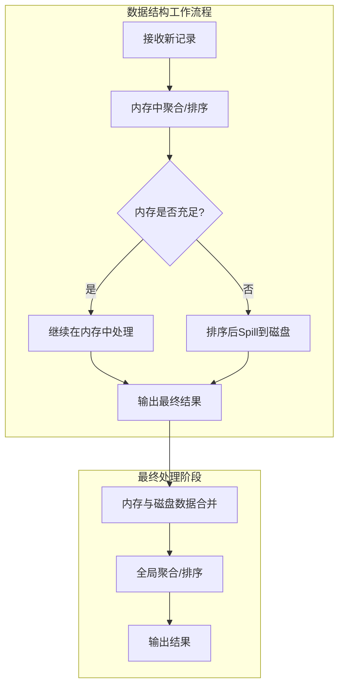
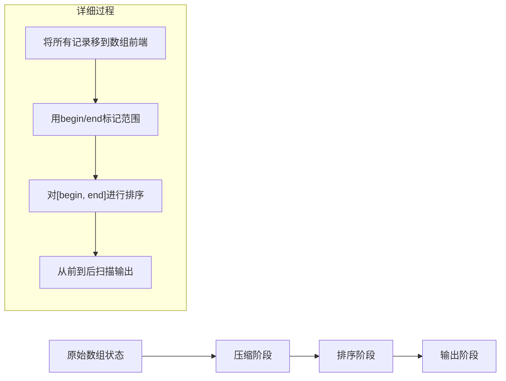
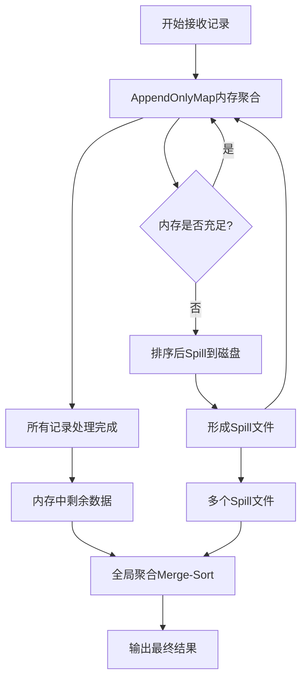
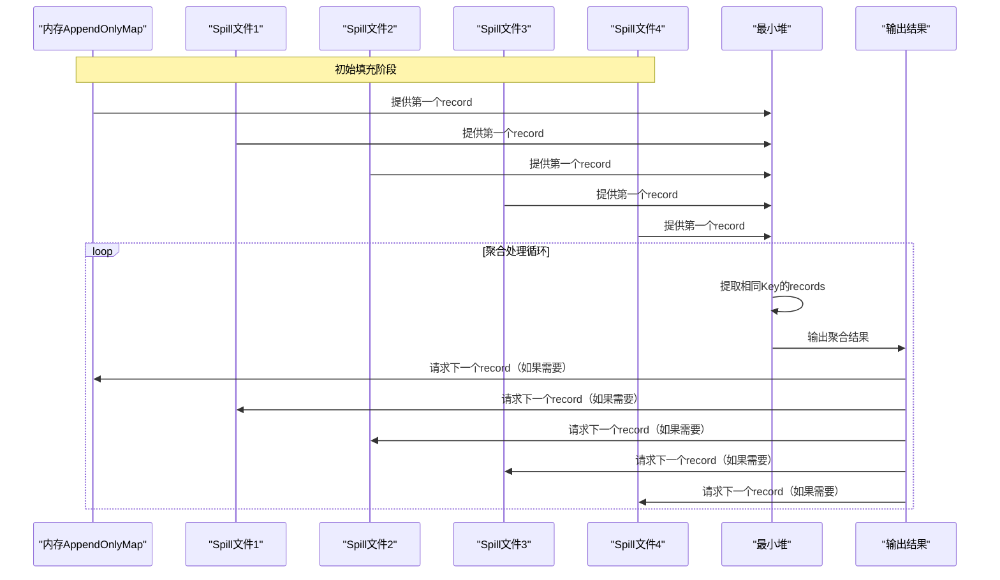

## 引言

在大数据处理中，Shuffle阶段（数据重分布）是性能瓶颈的关键所在。Spark通过设计专门的数据结构来优化这一过程，这些结构在内存和磁盘之间智能地管理数据，实现了高效的聚合和排序操作。理解这些底层机制对于优化Spark作业性能至关重要。

## 核心设计思想

Spark为Shuffle Write/Read的聚合和排序过程设计了三种数据结构，它们共享两个核心设计原则：

1. **操作特性优化**：这些数据结构只需要支持记录的插入和更新操作，不需要支持删除。这一特性允许Spark对数据结构进行深度优化，减少内存开销。

2. **内存优先设计**：以内存存储为主，磁盘存储为辅。只有当内存无法容纳所有数据时，才会将数据溢出（spill）到磁盘。

三种数据结构的基本工作流程如下图所示：



## AppendOnlyMap：纯内存HashMap实现

### 基本原理

AppendOnlyMap是一个**只支持记录添加和对Value进行更新的HashMap**。与传统的"数组+链表"实现不同，它采用纯数组存储，通过哈希值和二次探测法解决冲突。

### 关键机制

#### 1. 哈希冲突解决
- 使用二次地址探测法（Quadratic probing）解决哈希冲突
- 当位置被占用时，按指数递增方式寻找下一个空闲位置

```plaintext
示例：插入<K6, V6>
1. 计算初始位置：Hash(K6) → 位置已被K2占用
2. 第一次探测：Hash(K6) + 1² → 位置已被K3占用  
3. 第二次探测：Hash(K6) + 2² → 位置空闲，插入成功
```

#### 2. 记录更新流程
当需要聚合相同Key的记录时（如`<K6, V7>`与已有的`<K6, V6>`聚合）：
1. 按照插入时的查找方法定位Key的位置
2. 取出现有Value（V6）
3. 执行聚合函数：V' = func(V6, V7)
4. 将V'写回原位置

#### 3. 扩容机制
- 当AppendOnlyMap的利用率达到70%时自动扩容
- 容量扩大一倍
- 需要对所有Key进行rehash，重新排列位置

#### 4. 排序实现


**排序规则**：
- 对于需要按Key排序的操作（如`sortByKey()`）：按Key值排序
- 对于其他操作：按Key的Hash值排序

### 优缺点分析

**优点**：
- 聚合和排序功能紧密结合
- 内存访问效率高
- 支持快速排序算法

**缺点**：
- 只能使用内存，无法处理超大规模数据
- 内存限制成为瓶颈

## ExternalAppendOnlyMap：内存+磁盘混合存储

### 设计动机
为了解决AppendOnlyMap只能使用内存的局限性，Spark设计了ExternalAppendOnlyMap，用于Shuffle Read端的大规模数据聚合。

### 工作流程



### 三大核心问题与解决方案

#### 1. AppendOnlyMap大小估计问题

**挑战**：难以准确计算AppendOnlyMap的实际大小，因为：
- 数组存储的是Key和Value的引用，而非实际对象大小
- Value会不断更新，大小动态变化

**解决方案**：增量式高效估算算法
- **复杂度**：O(1)，开销很小
- **实现机制**：
  1. 定期抽样：精确计算抽样记录的总大小、个数、更新个数等
  2. 增量估算：根据历史统计值和平均变化量估算当前大小
  3. 定期更新：通过抽样更新统计值，提高精度

#### 2. Spill过程与排序策略

**排序依据选择**：
- **需要Key排序的操作**（如`sortByKey()`）：按Key值排序
- **不需要Key排序的操作**（如`groupByKey()`）：按Key的Hash值排序

**Hash冲突处理**：
在merge-sort阶段，同时比较：
1. Key的Hash值是否相等
2. Key的实际值是否相等

#### 3. 全局聚合（Merge-Sort）实现

**聚合方法**：建立最小堆或最大堆进行多路归并



**关键优势**：
- 每个spill文件中的record已经过排序
- 按顺序读取保证全局聚合的正确性
- 最小堆维护确保高效的多路归并

## PartitionedAppendOnlyMap：Shuffle Write端的优化

### 与ExternalAppendOnlyMap的区别

PartitionedAppendOnlyMap用于Shuffle Write端对record进行聚合（combine），其核心区别在于：

**Key结构不同**：
- PartitionedAppendOnlyMap的Key是：`PartitionId + Key`
- ExternalAppendOnlyMap的Key只是：`Key`

### 排序灵活性

这种Key结构设计提供了两种排序选项：
1. **按PartitionId排序**：适用于不需要按Key排序的操作
2. **按PartitionId + Key排序**：适用于需要按Key排序的操作

**应用场景**：在Shuffle Write阶段同时进行聚合、排序和分区操作。

## PartitionedPairBuffer：基于内存+磁盘的Array实现

### 基本特性

PartitionedPairBuffer本质上是一个**基于内存+磁盘的Array**，其主要特点：

1. **动态扩容**：随着数据添加不断扩容
2. **溢出机制**：达到内存限制时，将Array中的数据排序后spill到磁盘
3. **多次溢出**：该过程可能进行多次
4. **全局排序**：最后对内存和磁盘上的数据进行全局排序

### 工作流程
```
接收数据 → 内存Array存储 → 内存不足 → 排序后Spill到磁盘 → 
继续接收数据 → 再次Spill → ... → 全局排序 → 输出结果
```

## 性能对比与选择策略

| 数据结构 | 存储介质 | 主要应用场景 | 排序能力 | 内存要求 |
|---------|---------|-------------|---------|---------|
| **AppendOnlyMap** | 纯内存 | 小规模数据聚合 | 支持快速排序 | 高 |
| **ExternalAppendOnlyMap** | 内存+磁盘 | Shuffle Read端大规模聚合 | 支持Merge-Sort | 中等 |
| **PartitionedAppendOnlyMap** | 内存+磁盘 | Shuffle Write端聚合 | 支持按PartitionId/Key排序 | 中等 |
| **PartitionedPairBuffer** | 内存+磁盘 | 通用数据缓冲 | 支持全局排序 | 中等 |

## 实际应用建议

### 1. 内存配置优化
- 根据数据规模合理设置`spark.executor.memory`和`spark.memory.fraction`
- 监控GC情况，避免频繁的spill操作

### 2. 选择合适的聚合操作
- 对于需要排序的操作，优先使用`reduceByKey`而非`groupByKey`
- 合理使用`combineByKey`自定义聚合逻辑

### 3. 监控与调优
```scala
// 示例：监控Shuffle相关指标
val spark = SparkSession.builder()
  .appName("ShuffleMonitoring")
  .config("spark.sql.adaptive.enabled", "true")
  .config("spark.sql.adaptive.coalescePartitions.enabled", "true")
  .getOrCreate()

// 查看Shuffle统计信息
spark.sparkContext.uiWebUrl // 访问Spark UI查看详细指标
```

## 总结

Spark通过精心设计的数据结构，在Shuffle阶段实现了高效的聚合和排序：

1. **AppendOnlyMap**提供了纯内存的高效HashMap实现
2. **ExternalAppendOnlyMap**通过内存+磁盘混合存储解决了大规模数据处理问题
3. **PartitionedAppendOnlyMap**为Shuffle Write端提供了专门的优化
4. **PartitionedPairBuffer**提供了灵活的缓冲和排序能力

这些数据结构的核心创新在于：
- **增量式大小估算**：O(1)复杂度的内存使用量估算
- **智能溢出策略**：按需spill，减少磁盘I/O
- **高效全局聚合**：基于排序的merge-sort算法
- **灵活的排序支持**：适应不同操作的排序需求

理解这些底层机制，有助于开发者在实际工作中更好地优化Spark作业性能，特别是在处理大规模数据Shuffle时做出合理的技术选择和参数调优。