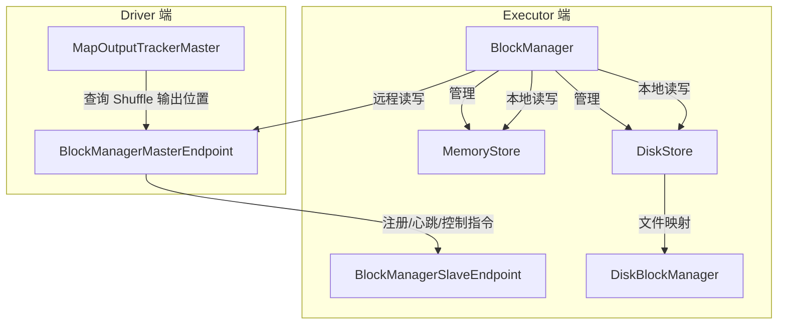
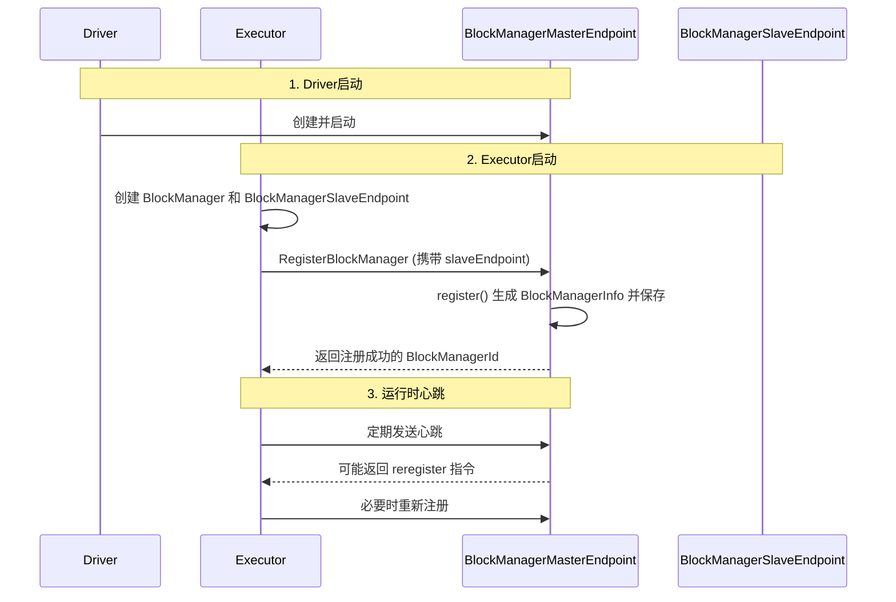

在 Spark 分布式计算框架中，**Shuffle**（数据混洗）是连接不同 Stage（阶段）的关键操作，而 **Storage**（存储模块）则是数据在集群节点间持久化和高效访问的基石。理解这两个核心模块如何协同工作，对于深入掌握 Spark 的性能调优、故障排查和架构设计至关重要。本文将深入剖析 Shuffle 与 Storage 模块间的交互原理、源码实现及运行机制。

## 1. Storage 模块概述

在 Spark 中，存储模块被抽象为 **Storage**，它负责管理和实现数据块（Block）的存放。**Block** 是存取数据的最小单元，所有操作都以 Block 为单位进行。从本质上讲，**RDD 中的 Partition 和 Storage 中的 Block 是等价的**，只是所处的模块和看待角度不同。

Storage 模块的实现分为两个层次：

### 1.1 通信层
通信层采用典型的 **Master-Slave** 结构，负责在 Master 和 Slave 之间传输控制和状态信息。主要由以下类实现：
*   `BlockManager`: 对外提供统一的存储访问接口。
*   `BlockManagerMaster`: 对内提供各节点间的指令通信服务。
*   `BlockManagerMasterEndpoint`: Driver 端的 RPC 端点，管理所有 BlockManager 的元数据。
*   `BlockManagerSlaveEndpoint`: Executor 端的 RPC 端点，接收来自 Master 的指令。

### 1.2 存储层
存储层负责将数据实际存储到内存、磁盘或堆外内存，并在必要时为数据在远程节点生成副本。Spark 2.2.0 中具体的存储层实现类包括：
*   `DiskStore`: 负责基于磁盘的数据存储和读写。
*   `MemoryStore`: 负责内存数据的存储和读写。

Shuffle 模块若要与 Storage 模块进行交互，需要通过调用统一的操作类 **`BlockManager`** 来完成。`BlockManager` 是整个存储模块对外的统一接口。

## 2. Shuffle 注册的交互

### 2.1 BlockManager 的创建与初始化
`BlockManager` 在 Driver 端的创建始于 `SparkContext` 的初始化。在 `SparkEnv.createDriverEnv` 方法中，会创建 `BlockManager`、`BlockManagerMaster` 等关键对象，完成 Storage 在 Driver 端的部署。

```scala
// SparkEnv.scala 中创建 BlockManager 的关键源码
val blockTransferService = new NettyBlockTransferService(...)
val blockManagerMaster = new BlockManagerMaster(...)
val blockManager = new BlockManager(executorId, rpcEnv, blockManagerMaster, ...)
```

**关键点**：构建 `BlockManager` 时传入了 `shuffleManager` 参数，这使得 `BlockManager` 可以调用 `shuffleManager` 的相关方法，为后续的 Shuffle 读写交互奠定基础。

### 2.2 BlockManager 的初始化流程
无论是 Driver 还是 Executor，`BlockManager` 必须调用 `initialize(appId: String)` 方法后才能正式工作。该方法主要完成以下任务：

```scala
// Spark 2.1.1 版本的 BlockManager.initialize 方法核心逻辑
def initialize(appId: String): Unit = {
  blockTransferService.init(this) // 1. 初始化数据传输服务
  shuffleClient.init(appId)      // 2. 初始化 Shuffle 客户端
  val id = BlockManagerId(...)   // 3. 创建 BlockManagerId
  // 4. 向 BlockManagerMaster 注册自己
  val idFromMaster = master.registerBlockManager(id, maxMemory, slaveEndpoint)
  blockManagerId = if (idFromMaster != null) idFromMaster else id
  // 5. 若启用外部 Shuffle 服务，则进行注册
  if (externalShuffleServiceEnabled && !blockManagerId.isDriver) {
    registerWithExternalShuffleServer()
  }
}
```

**注册过程详解**：
1.  **Driver 端**：在 `SparkContext` 创建后调用 `_env.blockManager.initialize(_applicationId)`。
2.  **Executor 端**：在 `Executor` 启动时（非本地模式）调用 `env.blockManager.initialize(conf.getAppId)`。
3.  **注册消息传递**：`initialize` 方法内部通过 `master.registerBlockManager(...)` 向 Driver 端的 `BlockManagerMasterEndpoint` 发送 `RegisterBlockManager` 消息。
4.  **Master 端处理**：`BlockManagerMasterEndpoint` 收到注册请求后，会为每个 Executor 的 `BlockManager` 生成对应的 `BlockManagerInfo`（包含 `blockManagerId`、内存信息、`slaveEndpoint` 引用等），并将其存入 `HashMap[BlockManagerId, BlockManagerInfo]` 结构中，以便后续管理和发送控制命令。

### 2.3 ShuffleManager 的可插拔接口
`ShuffleManager` 是 Shuffle 系统的可插拔接口，在 Driver 和每个 Executor 上都会创建。它定义了 Shuffle 过程的核心方法：

```scala
private[spark] trait ShuffleManager {
  def registerShuffle[K, V, C](shuffleId: Int, numMaps: Int, dependency: ShuffleDependency[K, V, C]): ShuffleHandle
  def getWriter[K, V](handle: ShuffleHandle, mapId: Int, context: TaskContext): ShuffleWriter[K, V]
  def getReader[K, C](handle: ShuffleHandle, startPartition: Int, endPartition: Int, context: TaskContext): ShuffleReader[K, C]
  def unregisterShuffle(shuffleId: Int): Boolean
  def shuffleBlockResolver: ShuffleBlockResolver
  def stop(): Unit
}
```
其中，`ShuffleBlockResolver` 负责解析逻辑块与物理文件位置之间的映射关系。在 Sort-Based Shuffle 中，由 `IndexShuffleBlockResolver` 具体实现，它创建并维护数据文件（`.data`）和索引文件（`.index`）。

## 3. Shuffle 写数据的交互

基于 Sort 的 Shuffle 有两种 `ShuffleHandle`：`BypassMergeSortShuffleHandle` 和 `BaseShuffleHandle`。在 `SortShuffleManager.getWriter` 方法中，会根据不同的 Handle 创建不同的写入器。

```scala
// SortShuffleManager.getWriter 关键代码
override def getWriter[K, V](...): ShuffleWriter[K, V] = {
  handle match {
    case bypassMergeSortHandle: BypassMergeSortShuffleHandle[K, V] =>
      new BypassMergeSortShuffleWriter(
        env.blockManager, // 传入 BlockManager
        shuffleBlockResolver.asInstanceOf[IndexShuffleBlockResolver],
        ...)
    case other: BaseShuffleHandle[K, V, _] =>
      new SortShuffleWriter(shuffleBlockResolver, other, mapId, context)
  }
}
```

**关键点**：无论是 `BypassMergeSortShuffleWriter` 还是 `SortShuffleWriter`，在它们的 `write` 方法中，最终都会通过 `shuffleBlockResolver`（其背后是 `BlockManager`）来将 Shuffle 数据（逻辑 Block）写入到具体的存储介质（物理文件）中。写入过程中可能涉及内存缓冲、磁盘溢出（Spill）等操作，这些都由 `BlockManager` 及其底层的 `MemoryStore` 和 `DiskStore` 协调完成。

## 4. Shuffle 读数据的交互

Shuffle 读数据始于 `SortShuffleManager.getReader` 方法，它创建了一个 `BlockStoreShuffleReader` 实例。

```scala
override def getReader[K, C](...): ShuffleReader[K, C] = {
  new BlockStoreShuffleReader(
    handle.asInstanceOf[BaseShuffleHandle[K, _, C]], startPartition, endPartition, context)
}
```

`BlockStoreShuffleReader.read()` 方法是读取的核心。它会实例化一个 `ShuffleBlockFetcherIterator`。这个迭代器是数据读取的关键，其内部持有一个 `blockManager` 成员变量，用于统一管理数据块的获取。

**读取流程**：
1.  **划分数据块**：在 `initialize()` 方法中，`splitLocalRemoteBlocks()` 方法会根据 Block 的位置信息，将其划分为本地块和远程块。
2.  **获取本地块**：`fetchLocalBlocks()` 方法直接通过本地的 `BlockManager` 从 `MemoryStore` 或 `DiskStore` 中读取数据。
3.  **获取远程块**：`fetchUpToMaxBytes()` 方法负责发送远程请求。它会将远程请求随机化 (`Utils.randomize(remoteRequests)`) 后添加到队列，然后通过 `BlockTransferService`（网络传输服务）从其他节点的 `BlockManager` 拉取数据。

## 5. BlockManager 架构原理与运行机制

`BlockManager` 是 Spark 运行时数据读写的统一管理器，管理范围涵盖内存、磁盘和堆外内存。它是分布式的，每个节点（Driver 和 Executors）都有自己的 `BlockManager`。

### 5.1 核心组件与交互流程



**从应用启动角度观察**：
1.  **Driver 启动**：在 `SparkEnv` 中注册 `BlockManagerMasterEndpoint` 和 `MapOutputTrackerMaster`。
2.  **Executor 启动**：每个 `ExecutorBackend` 启动时，都会实例化自己的 `BlockManager` 和 `BlockManagerSlaveEndpoint`，并通过 RPC 向 Driver 的 `BlockManagerMasterEndpoint` 注册。
3.  **组件职责**：
    *   `MemoryStore`: 负责内存数据的存储和读写。
    *   `DiskStore`: 负责磁盘数据的存储和读写。
    *   `DiskBlockManager`: 管理逻辑 Block 与磁盘上物理文件之间的映射关系，负责文件的创建和清理。

**从 Job 运行角度观察**：
1.  **数据存储**：例如广播变量 `broadcast_0_piece0` 会通过 `MemoryStore` 存入内存，同时其元数据（在哪个 Executor 的 BlockManager 中）会被汇报给 Driver 的 `BlockManagerMaster`，更新到对应的 `BlockManagerInfo` 中。
2.  **Shuffle 读取**：Reduce Task 通过 `MapOutputTrackerMaster` 获取上游 Map Task 输出数据的元数据（位置信息），然后通过这些位置信息，经由 `BlockManager` 从本地或远程节点读取具体的 Shuffle 数据块。

### 5.2 关键方法解析

#### 5.2.1 数据读取
*   `getLocalValues(blockId)`：从本地读取数据。
    1.  通过 `blockInfoManager.lockForReading(blockId)` 获取读锁和 `BlockInfo`。
    2.  根据 `StorageLevel` 判断数据在内存还是磁盘。
    3.  从 `MemoryStore` 或 `DiskStore` 中获取数据并反序列化。
*   `getRemoteValues(blockId)`：从远程节点读取数据。
    1.  调用 `getRemoteBytes(blockId)`。
    2.  通过 `blockTransferService.fetchBlockSync` 发起网络请求获取数据。
    3.  对获取的数据进行反序列化。

#### 5.2.2 数据写入
数据写入的核心是 `doPut` 方法，它处理了锁管理、存储级别判断和实际写入逻辑。

```scala
private def doPut[T](blockId: BlockId, level: StorageLevel, ...)(putBody: BlockInfo => Option[T]): Option[T] = {
  // 1. 尝试获取写锁
  val putBlockInfo = new BlockInfo(level, classTag, tellMaster)
  if (blockInfoManager.lockNewBlockForWriting(blockId, newInfo)) {
    // 2. 执行具体的写入逻辑（由 putBody 匿名函数定义）
    val res = putBody(putBlockInfo)
    // 3. 根据存储级别决定存储位置
    //    - 如果 level.useMemory，存入 MemoryStore
    //    - 如果 level.useDisk，存入 DiskStore
    //    - 如果 level.replication > 1，调用 replicate 方法在其他节点创建副本
  }
}
```
`doPutIterator` 和 `doPutBytes` 方法都会调用 `doPut`，并在 `putBody` 中实现具体的序列化和存储逻辑。

#### 5.2.3 内存管理
*   `dropFromMemory(blockId, data)`：当内存不足时被调用。
    *   如果存储级别包含磁盘（如 `MEMORY_AND_DISK`），则会将数据写入 `DiskStore`。
    *   从 `MemoryStore` 中移除该 Block。
    *   向 Master 汇报 Block 状态变更。
    *   **核心意义**：对于 `MEMORY_AND_DISK` 的数据，内存不足时会被溢出到磁盘，避免重新计算；对于纯内存级别，数据则会被丢弃，后续需要时需重新计算。

### 5.3 BlockManager 初始化与注册全流程解密



## 6. 总结与核心要点

1.  **统一接口**：`BlockManager` 是 Spark 存储系统的统一抽象和访问入口，Shuffle 读写都必须通过它来完成。
2.  **主从架构**：Storage 模块采用 Master-Slave 架构。`BlockManagerMasterEndpoint`（Driver）管理集群所有 `BlockManager`（Slave）的元数据和状态。
3.  **注册机制**：Executor 启动时，其 `BlockManager` 会向 Driver 的 `BlockManagerMasterEndpoint` 注册，形成管理关系。
4.  **读写交互**：
    *   **写**：Shuffle Writer 通过 `BlockManager` 将数据写入 `MemoryStore` 或 `DiskStore`，并可能触发副本复制。
    *   **读**：Shuffle Reader 通过 `BlockManager` 定位数据位置（本地/远程），并从本地存储或远程节点拉取数据。
5.  **内存磁盘协同**：`StorageLevel` 定义了数据的存储策略。`BlockManager` 和 `MemoryStore`/`DiskStore` 共同实现了内存溢出、缓存淘汰等复杂的数据生命周期管理。
6.  **网络传输**：跨节点的数据读写依赖于 `BlockTransferService`（默认实现为 `NettyBlockTransferService`），它封装了底层的网络通信细节。

通过对 Shuffle 与 Storage 模块交互机制的深入理解，开发者和运维人员可以更好地定位 Shuffle 性能瓶颈（如数据倾斜、磁盘IO、网络开销），并针对性地进行优化，例如调整存储级别、启用外部 Shuffle 服务、优化分区策略等，从而提升 Spark 作业的整体执行效率。