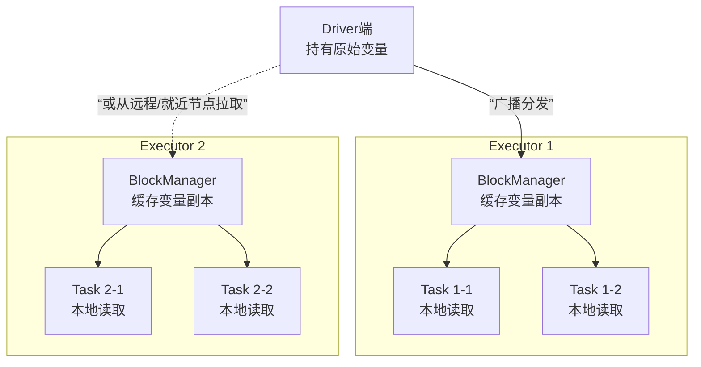

在分布式计算框架Spark的应用开发中，性能问题往往成为制约效率的瓶颈。从资源消耗到执行效率，一系列“坑”等待着开发者。本文将聚焦于Spark应用中最频繁遇到的几类性能问题，并提供经过实战检验的调优技巧与解决方案，帮助你从根源上优化Spark作业，提升集群资源利用率和任务执行速度。

## 1. 广播变量：减少网络与内存消耗的利器

在Spark作业中，当Task需要读取一个大型的只读变量（如配置表、字典数据）时，如果采用默认的变量传递机制，每个Task都会获取一份完整的变量副本，这将导致巨大的网络传输开销和内存浪费。

### 1.1 工作原理

**广播变量（Broadcast Variables）** 的核心思想是将一个只读变量缓存在每个Executor节点上，而不是分发给每个Task。这样，变量的副本数量从“Task数量级”减少到“Executor数量级”，显著降低了网络和内存压力。

其工作流程如下：



**优势对比**：
假设有一个10MB的Map，1000个Task运行在50个Executor上：
*   **默认方式**：1000个副本，网络传输10GB数据，消耗10GB内存。
*   **广播变量**：最多50个副本，网络传输最多500MB数据，消耗500MB内存。且副本可能从其他就近节点拉取，进一步减少网络开销。

### 1.2 实战应用

在代码中使用广播变量非常简单：

```scala
// 1. 在Driver端创建广播变量
val largeMap: Map[String, String] = ... // 一个大Map
val broadcastMap: Broadcast[Map[String, String]] = sc.broadcast(largeMap)

// 2. 在Task（算子函数）中获取广播变量的值
val resultRDD = someRDD.map { item =>
    // 通过 `.value` 方法获取广播变量内容
    val localMap = broadcastMap.value
    // 使用localMap进行计算...
    process(item, localMap)
}
```

## 2. 序列化优化：从Java Serialization到Kryo

序列化在分布式计算中至关重要，低效的序列化会拖慢Shuffle和数据持久化的速度。

### 2.1 为何选择Kryo

Spark默认使用Java序列化（`ObjectOutputStream`），虽然兼容性好，但速度慢且序列化后的数据体积大。

**Kryo序列化库** 是一个高效的替代方案，它：
*   **速度更快**：通常比Java序列化快1-2个数量级。
*   **体积更小**：序列化后的二进制数据更紧凑，节省网络带宽和存储空间。
*   **缺点**：需要**预先注册**需要序列化的自定义类，否则Kryo需要存储完整的类名，会略微影响性能。

### 2.2 配置与使用

在SparkConf中启用并配置Kryo：

```scala
import org.apache.spark.serializer.KryoSerializer

val conf = new SparkConf()
  .setAppName("KryoExample")
  .setMaster(...)
  // 启用Kryo序列化器
  .set("spark.serializer", classOf[KryoSerializer].getName)
  // 注册自定义类，以获得最佳性能
  .registerKryoClasses(Array(classOf[MyClass1], classOf[MyClass2]))

val sc = new SparkContext(conf)
```
**注意**：`spark.serializer` 配置项同时影响Shuffle数据和RDD持久化到磁盘的序列化格式。

## 3. 数据结构优化：使用FastUtil替代标准库

Java标准集合（如`HashMap`, `ArrayList`）在存储原始类型（如int, long）时存在“装箱/拆箱”开销，内存占用较大。**FastUtil** 提供了针对原始类型优化的集合类，能有效减少内存占用并提升访问速度。

### 3.1 适用场景

1.  **优化算子中的外部大变量**：如果算子需要引用一个外部的大集合（如Map/List），可以先用FastUtil集合重写该变量，再结合广播变量和Kryo序列化，实现三层优化（源头减负 -> 广播减副本 -> 序列化减体积）。
2.  **优化算子内部创建的集合**：在`map`、`flatMap`等算子内部，如果逻辑需要创建较大的临时集合，使用FastUtil集合可以减少Task内存占用，避免频繁GC。

### 3.2 实战示例

首先在项目中引入FastUtil依赖（以Maven为例）：
```xml
<dependency>
    <groupId>it.unimi.dsi</groupId>
    <artifactId>fastutil</artifactId>
    <version>8.5.9</version> <!-- 请使用最新稳定版 -->
</dependency>
```

代码转换示例：将 `List[Integer]` 替换为 `IntList`
```java
import it.unimi.dsi.fastutil.ints.IntArrayList;
import it.unimi.dsi.fastutil.ints.IntList;

// 传统方式
// List<Integer> list = new ArrayList<>();

// FastUtil 方式
IntList fastList = new IntArrayList();
fastList.add(1);
fastList.add(2);
// 访问元素更快，内存占用更小
```
类似的，`Map<String, Integer>` 可以替换为 `Object2IntMap<String>`，`Map<Integer, Integer>` 可以替换为 `Int2IntMap`。

## 4. RDD持久化与检查点：正确使用姿势

### 4.1 持久化（Persist/Cache）

持久化可以将中间RDD的计算结果保存下来（内存或磁盘），避免在后续Action中重复计算。

**核心存储级别**：

| 存储级别 | 含义 | 适用场景 |
| :--- | :--- | :--- |
| `MEMORY_ONLY` | 只存内存，非序列化对象 | **默认级别**。数据可全部放入内存时效率最高 |
| `MEMORY_ONLY_SER` | 只存内存，序列化对象 | 内存紧张时，可比`MEMORY_ONLY`存更多数据，但CPU开销增大 |
| `MEMORY_AND_DISK` | 内存存不下则溢写到磁盘 | 数据量较大，优先保证计算速度 |
| `MEMORY_AND_DISK_SER` | 同上，但内存中以序列化格式存储 | 比`MEMORY_AND_DISK`内存利用率更高 |
| `DISK_ONLY` | 只存磁盘 | 数据量极大，内存完全不考虑时 |
| `OFF_HEAP` | 使用堆外内存（如Alluxio） | 避免GC影响，Executor间可共享缓存 |

**使用建议**：
*   默认使用 `cache()` 或 `persist()`（即`MEMORY_ONLY`）。
*   内存紧张或对象较“碎”时，考虑使用带`_SER`的级别，并配合Kryo。
*   `persist()`是`cache()`的显式版本，可以指定存储级别。
*   **警惕过度缓存**：只缓存会被**多次使用**的RDD。缓存不必要的数据会挤占内存，导致有用的分区被移除，反而降低性能。

### 4.2 检查点（Checkpoint）

检查点将RDD物理存储到可靠的分布式文件系统（如HDFS），**完全切断其血缘关系**。用于：
*   **容错**：当血缘链路过长或计算代价高昂时，避免失败后从头计算。
*   **切断血缘**：辅助Spark的DAG调度器进行阶段划分。

**最佳实践**：
```scala
// 错误做法：直接checkpoint，会触发额外Job从头计算该RDD
rdd.checkpoint()

// 正确做法：先persist，再checkpoint
rdd.persist(StorageLevel.DISK_ONLY) // 或MEMORY_AND_DISK等
rdd.checkpoint()
rdd.count() // 触发一个Action，实际执行持久化和检查点
```
> **为什么？** `checkpoint()`会触发一个独立的Job来写入数据。如果RDD未被持久化，这个Job需要从头计算该RDD，造成重复计算。先持久化，checkpoint Job就能直接从缓存中读取数据，效率更高。

## 5. 序列化错误：“Task not serializable” 分析与解决

这是Spark开发中最常见的错误之一。

### 5.1 错误根源

当在`map`、`filter`等算子内部**引用了外部类的成员变量或成员方法**时，Spark会尝试序列化这个**完整的类实例**（通过闭包捕获机制）。如果该类中的某些字段（如`SparkContext`, `SparkConf`）不支持序列化，就会抛出 `Task not serializable` 异常。

### 5.2 解决方案与实战

**方案一：避免闭包捕获（推荐）**
将算子内部依赖的变量或函数，定义在算子内部、作为局部变量，或者放到Scala `object`（相当于Java静态工具类）中。

```scala
// 反例：在map中引用了类成员变量`rootDomain`
class BadExample(conf: String) {
  val rootDomain = conf
  def process(rdd: RDD[String]) = {
    rdd.map(item => item.contains(rootDomain)) // 错误！捕获了this
  }
}

// 正例1：将依赖值作为局部变量传入
class GoodExample {
  def process(rdd: RDD[String], rootDomain: String) = {
    rdd.map(item => item.contains(rootDomain)) // 安全
  }
}

// 正例2：工具函数放在object中
object StringUtils {
  def addWWW(str: String): String = if(str.startsWith("www.")) str else "www."+str
}
rdd.map(item => StringUtils.addWWW(item)) // 安全
```

**方案二：正确序列化类**
如果必须引用类成员，则需要确保该类可序列化，并对不可序列化的字段用`@transient`标注。

```scala
import org.apache.spark.{SparkConf, SparkContext}
import org.apache.spark.rdd.RDD

class MySparkApp(conf: String) extends Serializable { // 1. 继承Serializable
  @transient // 2. 标记不需要序列化的字段
  private val sparkConf = new SparkConf().setAppName("MyApp")
  @transient
  private val sc = new SparkContext(sparkConf)

  val rootDomain = conf // 这个字段是简单的String，可序列化

  def process(): Unit = {
    val data = List("a.com", "b.cn")
    val rdd: RDD[String] = sc.parallelize(data)
    // 3. 在算子内部引用可序列化的成员变量
    val result = rdd.filter(item => item.contains(rootDomain))
    result.collect().foreach(println)
  }
}
```

## 6. 处理算子返回NULL值的问题

在`map`等转换算子中返回`null`值，可能会导致下游操作（如`saveAsTextFile`写入HDFS、某些特定的RDD操作）报空指针异常。

**解决方案**：

**方案一：使用Option类型进行包装和模式匹配**
```scala
val rdd2 = rdd1.map { item =>
  val result = someFunction(item)
  if (result != null) Some(result) else None
}

// 下游操作时，可以使用flatMap自动过滤掉None
val cleanRDD = rdd2.flatMap(x => x) // 只保留Some里的值

// 或者进行模式匹配处理
rdd2.foreach {
  case Some(value) => println(value)
  case None => // 处理空值情况，如记录日志
}
```

**方案二：返回特殊标记值并进行过滤**
```scala
val NULL_MARKER = "##NULL##" // 定义一个业务中不可能出现的特殊值

val rdd2 = rdd1.map { item =>
  val result = someFunction(item)
  if (result != null) result else NULL_MARKER
}

// 下游操作前，过滤掉标记值
val cleanRDD = rdd2.filter(_ != NULL_MARKER)
```

## 总结与综合应用场景分析

Spark性能调优是一个系统工程，上述技巧往往需要组合使用：

1.  **开发阶段**：
    *   优先采用**避免闭包捕获**的方式设计代码，从源头上杜绝序列化错误。
    *   在算子中创建集合时，考虑使用**FastUtil**优化数据结构。

2.  **调优阶段**：
    *   遇到需要共享的大只读变量，立即使用**广播变量**。
    *   对于Shuffle频繁或RDD需要持久化的作业，启用**Kryo序列化**并注册自定义类。
    *   分析作业DAG，对重复计算的昂贵RDD进行**持久化**，存储级别根据数据量和集群内存情况选择。
    *   对于超长血缘的迭代计算（如机器学习算法），在关键步骤设置**检查点**，并遵循“先persist，后checkpoint”的原则。

3.  **问题排查**：
    *   遇到`Task not serializable`，首先检查算子中是否引用了外部类成员，并按照上述方案解决。

通过将这些调优技巧融入到Spark应用的开发和运维中，可以显著提升作业的稳定性、资源利用率和执行效率，让Spark引擎发挥出真正的威力。