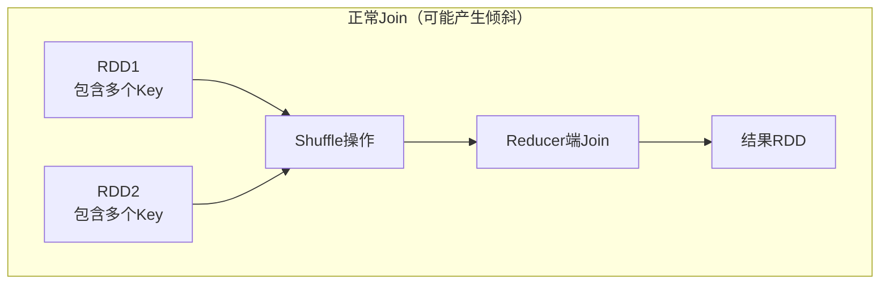
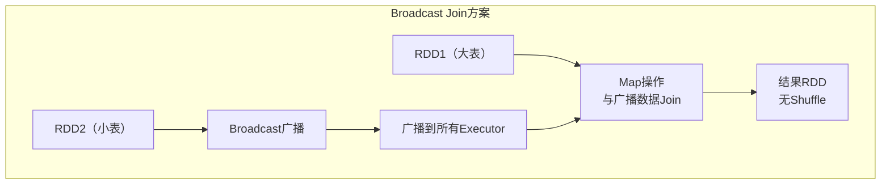
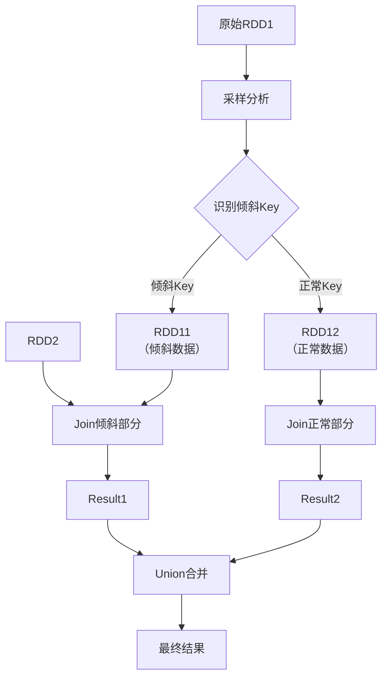
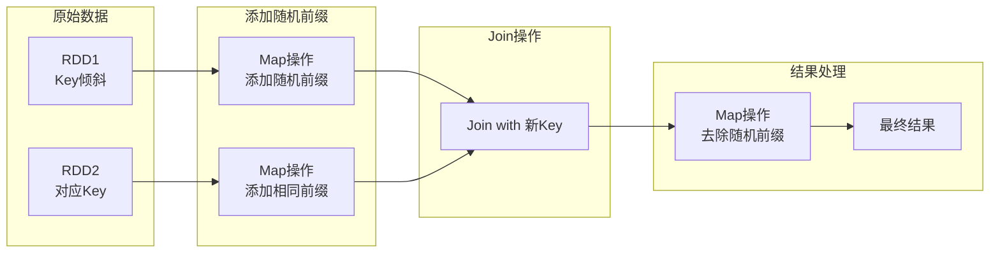
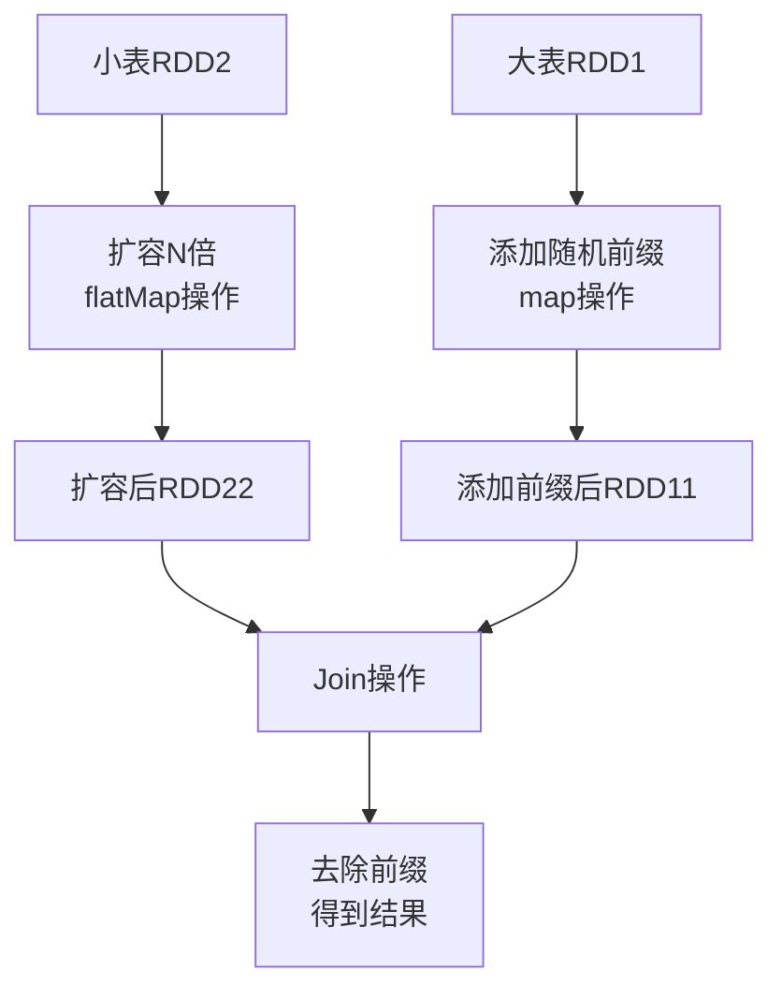
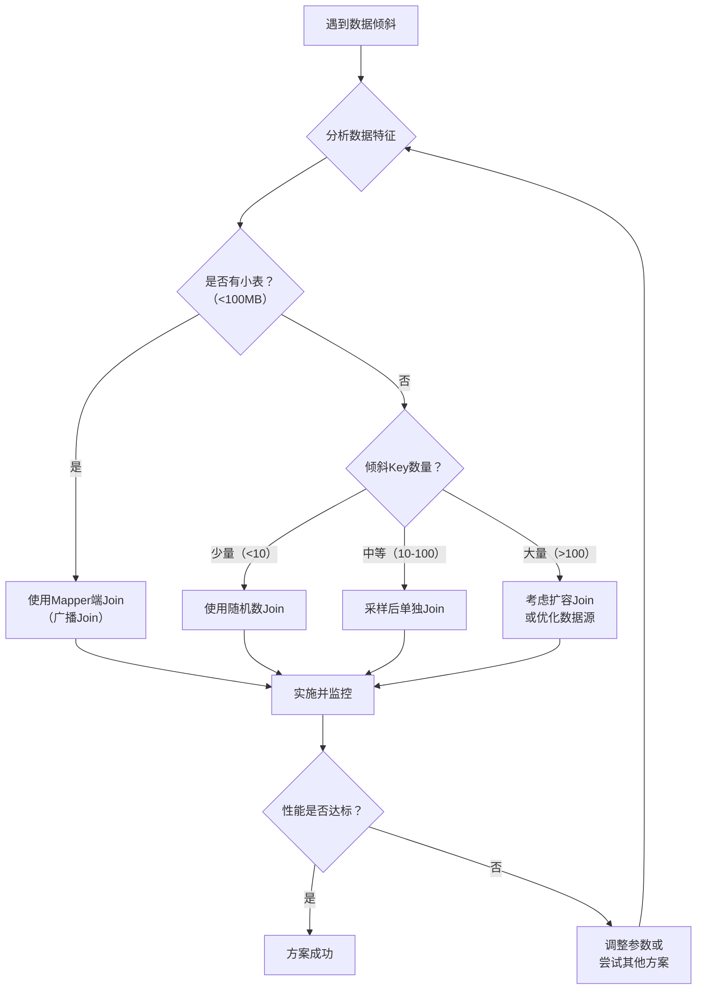

## 引言

在大数据处理中，数据倾斜是一个常见且棘手的问题。当数据分布不均匀时，某些任务处理的数据量远大于其他任务，导致整体作业性能下降甚至失败。Spark作为主流的大数据处理框架，提供了多种解决数据倾斜的策略。本文将深入探讨七种核心解决方案，从原理到实践，帮助开发者有效应对数据倾斜挑战。

## 一、Mapper端Join操作

### 1.1 为什么要在Mapper端进行Join操作

解决数据倾斜的关键技巧之一是**将Reducer端的操作转移到Mapper端**。通过这种方式可以避免Shuffle操作，从而在很大程度上化解数据倾斜问题。

Spark基于RDD的链式操作，DAGScheduler根据RDD的依赖关系（宽依赖和窄依赖）划分Stage。宽依赖算子如`reduceByKey`、`groupByKey`等会触发Shuffle。我们的目标是通过避免Shuffle来优化性能。

**核心思想**：将后续Stage的Reducer端操作提前到前序Stage的Mapper端执行。Spark 3.x版本中，Mapper端聚合功能已经相当成熟，能够在Mapper端完成大部分Shuffle业务逻辑。

### 1.2 适用场景分析

当两个RDD进行Join操作时，如果其中一个RDD的数据量较小，可以将这个小RDD以**广播变量**的形式分发到整个集群。这样，另一个RDD就可以直接通过map操作完成Join，无需Shuffle。

**适用条件**：
- 其中一个RDD数据量较小（通常建议小于几百MB）
- Join操作基于Key-Value模式
- 不需要全量数据的Shuffle

### 1.3 原理剖析

考虑广告点击案例，有两个RDD：
- RDD1: `(1,1)`, `(1,2)`, `(1,3)`, `(2,1)`, `(2,2)`, `(2,3)`
- RDD2: `(1,1)`, `(2,1)`

**正常Join流程**：


**数据倾斜场景**：
当某个Key的数据量异常大时（如Key=2只有一条记录），会导致Task负载不均衡。

**Broadcast Join解决方案**：


### 1.4 实现方式

在Spark 3.x中，可以使用以下方式实现Broadcast Join：

```scala
// Spark 3.x实现示例
import org.apache.spark.sql.functions.broadcast

val rdd1 = spark.sparkContext.parallelize(Seq(
  (1, "A"), (1, "B"), (1, "C"), (2, "D"), (2, "E")
))

val rdd2 = spark.sparkContext.parallelize(Seq(
  (1, "Info1"), (2, "Info2")
))

// 将小表转换为DataFrame并使用broadcast hint
val df1 = rdd1.toDF("key", "value")
val df2 = rdd2.toDF("key", "info")

// 使用广播提示
val result = df1.join(broadcast(df2), Seq("key"), "inner")
result.show()

// 或者使用SQL方式
df1.createOrReplaceTempView("table1")
df2.createOrReplaceTempView("table2")

spark.sql("""
  SELECT /*+ BROADCAST(t2) */ t1.*, t2.info
  FROM table1 t1
  JOIN table2 t2 ON t1.key = t2.key
""").show()
```

### 1.5 注意事项

1. **内存限制**：广播的数据会常驻内存，如果数据量过大可能导致：
   - 内存溢出（OOM）
   - GC频繁，特别是老年代GC
   - 影响其他任务的执行

2. **适用性限制**：
   - 仅适用于小表广播
   - 不适用于两个RDD都很大的情况
   - 广播的数据应该是相对静态的（如配置表、维度表）

3. **Spark 3.x优化**：
   - 自动广播阈值：`spark.sql.autoBroadcastJoinThreshold`（默认10MB）
   - 自适应查询执行（AQE）可以动态调整Join策略

## 二、对倾斜Keys采样后单独Join

### 2.1 采样解决数据倾斜的原理

当两个RDD都比较大，无法使用广播Join时，可以采用**采样分析+分而治之**的策略：

1. **采样识别**：通过采样找出导致倾斜的Key
2. **数据分离**：将原始RDD拆分为倾斜部分和非倾斜部分
3. **分别处理**：对不同部分采用不同的Join策略
4. **结果合并**：将处理结果合并

### 2.2 实施步骤



### 2.3 Spark 3.x实现示例

```scala
import org.apache.spark.sql.{SparkSession, DataFrame}
import org.apache.spark.sql.functions._

object SkewJoinSolution {
  def main(args: Array[String]): Unit = {
    val spark = SparkSession.builder()
      .appName("SkewJoinSolution")
      .master("local[*]")
      .getOrCreate()
    
    import spark.implicits._
    
    // 模拟数据
    val data1 = Seq(
      (1, "A"), (1, "B"), (1, "C"), (1, "D"), (1, "E"),
      (2, "F"), (3, "G"), (4, "H"), (5, "I")
    ).toDF("key", "value")
    
    val data2 = Seq(
      (1, "Info1"), (2, "Info2"), (3, "Info3"),
      (4, "Info4"), (5, "Info5")
    ).toDF("key", "info")
    
    // 1. 采样识别倾斜Key
    val sampleRate = 0.1  // 10%采样率
    val skewedKeys = data1
      .sample(withReplacement = false, fraction = sampleRate)
      .groupBy("key")
      .count()
      .orderBy(desc("count"))
      .limit(3)  // 假设前3个是倾斜Key
      .select("key")
      .collect()
      .map(_.getInt(0))
      .toSet
    
    println(s"识别到的倾斜Keys: ${skewedKeys.mkString(", ")}")
    
    // 2. 分离数据
    val skewedData1 = data1.filter(col("key").isin(skewedKeys.toSeq: _*))
    val normalData1 = data1.filter(!col("key").isin(skewedKeys.toSeq: _*))
    
    val skewedData2 = data2.filter(col("key").isin(skewedKeys.toSeq: _*))
    val normalData2 = data2.filter(!col("key").isin(skewedKeys.toSeq: _*))
    
    // 3. 分别处理
    // 倾斜部分使用随机前缀（后续章节介绍）
    val skewedResult = processSkewedData(skewedData1, skewedData2)
    
    // 正常部分直接Join
    val normalResult = normalData1.join(normalData2, Seq("key"), "inner")
    
    // 4. 合并结果
    val finalResult = skewedResult.union(normalResult)
    finalResult.show()
    
    spark.stop()
  }
  
  def processSkewedData(df1: DataFrame, df2: DataFrame): DataFrame = {
    // 这里先返回简单Join，实际会使用后续介绍的随机前缀方法
    df1.join(df2, Seq("key"), "inner")
  }
}
```

### 2.4 注意事项

1. **采样精度**：采样率需要根据数据规模调整，确保能准确识别倾斜Key
2. **倾斜Key数量**：如果倾斜Key过多（成千上万），此方法不适用
3. **实现复杂度**：需要多次数据扫描和转换，增加作业复杂度
4. **Spark 3.x优化**：AQE可以自动检测数据倾斜并优化执行计划

## 三、使用随机数进行Join

### 3.1 随机数Join的原理

当倾斜Key数量不多但数据量很大时，可以通过**给Key添加随机前缀**来分散数据：

1. **添加随机前缀**：为倾斜Key添加随机数前缀
2. **分散数据**：使相同Key的数据分布到不同分区
3. **Join操作**：使用新Key进行Join
4. **去除前缀**：恢复原始Key格式

### 3.2 实施流程



### 3.3 Spark 3.x实现

```scala
import org.apache.spark.sql.{SparkSession, DataFrame}
import org.apache.spark.sql.functions._
import scala.util.Random

object RandomPrefixJoin {
  def main(args: Array[String]): Unit = {
    val spark = SparkSession.builder()
      .appName("RandomPrefixJoin")
      .master("local[*]")
      .getOrCreate()
    
    import spark.implicits._
    
    // 模拟倾斜数据
    val data1 = Seq(
      (1, "A1"), (1, "A2"), (1, "A3"), (1, "A4"), (1, "A5"),
      (1, "A6"), (1, "A7"), (1, "A8"), (1, "A9"), (1, "A10"),
      (2, "B1"), (3, "C1")
    ).toDF("key", "value")
    
    val data2 = Seq(
      (1, "Info1"), (2, "Info2"), (3, "Info3")
    ).toDF("key", "info")
    
    // 识别倾斜Key（这里假设Key=1是倾斜的）
    val skewedKey = 1
    val numPartitions = 4  // 随机前缀范围
    
    // 为倾斜Key添加随机前缀
    val processedData1 = data1
      .withColumn("new_key",
        when(col("key") === skewedKey,
          concat(
            lit("prefix_"),
            floor(rand() * numPartitions).cast("int"),
            lit("_"),
            col("key")
          )
        ).otherwise(col("key").cast("string"))
      )
    
    // 为对应的Key也添加所有可能的前缀
    val expandedData2 = data2
      .filter(col("key") === skewedKey)
      .withColumn("prefix", explode(array((0 until numPartitions).map(lit(_)): _*)))
      .withColumn("new_key",
        concat(lit("prefix_"), col("prefix"), lit("_"), col("key"))
      )
      .drop("prefix")
      .union(
        data2.filter(col("key") =!= skewedKey)
          .withColumn("new_key", col("key").cast("string"))
      )
    
    // 使用新Key进行Join
    val joinedResult = processedData1
      .join(expandedData2, Seq("new_key"), "inner")
      .withColumn("original_key",
        when(col("key") === skewedKey,
          regexp_extract(col("new_key"), "_(\\d+)$", 1).cast("int")
        ).otherwise(col("key"))
      )
      .drop("new_key")
      .select("original_key", "value", "info")
      .withColumnRenamed("original_key", "key")
    
    joinedResult.show()
    
    spark.stop()
  }
}
```

### 3.4 注意事项

1. **随机数范围选择**：需要根据数据倾斜程度和集群资源确定
2. **数据膨胀**：RDD2需要为倾斜Key复制多份，可能造成数据膨胀
3. **Join条件匹配**：必须确保两个RDD的随机前缀能够匹配
4. **性能权衡**：虽然缓解了倾斜，但增加了数据复制和传输开销

## 四、通过扩容进行Join

### 4.1 扩容Join的原理

当倾斜Key数量非常多时，可以采用**数据扩容**策略：

1. **数据扩容**：将小表数据复制多份
2. **添加随机前缀**：为大表数据添加随机前缀
3. **分散Join**：使Join操作更加均匀分布
4. **结果去重**：确保结果正确性

### 4.2 实施流程



### 4.3 Spark 3.x实现

```scala
import org.apache.spark.sql.{SparkSession, DataFrame}
import org.apache.spark.sql.functions._

object ExpandJoinSolution {
  def main(args: Array[String]): Unit = {
    val spark = SparkSession.builder()
      .appName("ExpandJoinSolution")
      .master("local[*]")
      .getOrCreate()
    
    import spark.implicits._
    
    // 模拟数据
    val data1 = (1 to 1000).map(i => 
      (i % 100 + 1, s"Value$i")  // Key范围1-100，模拟倾斜
    ).toDF("key", "value")
    
    val data2 = (1 to 100).map(i => 
      (i, s"Info$i")
    ).toDF("key", "info")
    
    val expansionFactor = 10  // 扩容倍数
    
    // 1. 扩容小表
    val expandedData2 = data2
      .withColumn("expansion_id", explode(array((0 until expansionFactor).map(lit(_)): _*)))
      .withColumn("expanded_key",
        concat(col("key"), lit("_"), col("expansion_id"))
      )
      .drop("expansion_id")
    
    // 2. 为大表添加随机前缀
    val processedData1 = data1
      .withColumn("random_prefix", (rand() * expansionFactor).cast("int"))
      .withColumn("expanded_key",
        concat(col("key"), lit("_"), col("random_prefix"))
      )
      .drop("random_prefix")
    
    // 3. 执行Join
    val joinedResult = processedData1
      .join(expandedData2, Seq("expanded_key"), "inner")
      .withColumn("original_key",
        split(col("expanded_key"), "_")(0).cast("int")
      )
      .drop("expanded_key")
      .select("original_key", "value", "info")
      .withColumnRenamed("original_key", "key")
    
    // 验证结果
    println(s"原始数据量: ${data1.count()}")
    println(s"扩容后Join结果量: ${joinedResult.count()}")
    
    // 4. 结果去重（如果需要）
    val distinctResult = joinedResult.dropDuplicates("key", "value")
    println(s"去重后结果量: ${distinctResult.count()}")
    
    spark.stop()
  }
}
```

### 4.4 注意事项

1. **扩容倍数选择**：
   - 太小：可能无法完全解决倾斜
   - 太大：导致OOM和性能下降
   - 建议：根据集群资源和数据特征动态调整

2. **资源消耗**：
   - 内存消耗：扩容导致数据量增加
   - 网络传输：Shuffle数据量增大
   - CPU计算：额外的数据复制和处理

3. **结果正确性**：
   - 需要确保Join条件正确
   - 可能需要结果去重
   - 验证结果与原始Join的一致性

4. **Spark 3.x优化建议**：
   - 使用AQE自动优化Join策略
   - 监控资源使用情况
   - 考虑使用Bucket Join替代

## 五、综合解决方案对比

### 5.1 方案对比表

| 解决方案 | 适用场景 | 优点 | 缺点 | Spark 3.x支持 |
|---------|---------|------|------|--------------|
| **Mapper端Join** | 小表Join大表 | 避免Shuffle，性能最佳 | 小表必须能放入内存 | 自动广播优化 |
| **采样后单独Join** | 倾斜Key较少 | 精准处理倾斜部分 | 实现复杂，多次扫描 | AQE部分支持 |
| **随机数Join** | 少量倾斜Key | 有效分散数据 | 数据膨胀，实现复杂 | 需要手动实现 |
| **扩容Join** | 大量倾斜Key | 彻底解决倾斜 | 资源消耗大，数据膨胀 | 需要手动实现 |

### 5.2 选择策略



### 5.3 Spark 3.x最佳实践

1. **优先使用内置优化**：
   ```scala
   // 启用AQE和相关优化
   spark.conf.set("spark.sql.adaptive.enabled", "true")
   spark.conf.set("spark.sql.adaptive.coalescePartitions.enabled", "true")
   spark.conf.set("spark.sql.adaptive.skewJoin.enabled", "true")
   spark.conf.set("spark.sql.adaptive.skewJoin.skewedPartitionFactor", "5")
   spark.conf.set("spark.sql.adaptive.skewJoin.skewedPartitionThresholdInBytes", "256MB")
   ```

2. **监控与调优**：
   - 使用Spark UI监控作业执行
   - 分析Stage执行时间
   - 调整分区数和并行度

3. **数据预处理**：
   - 对频繁Join的Key进行预处理
   - 使用分区表或分桶表
   - 考虑数据归档和历史数据分离

## 六、总结与建议

数据倾斜是大数据处理中的常见挑战，Spark提供了多种解决方案。在实际应用中，需要根据具体场景选择合适的策略：

1. **预防优于治疗**：在数据接入阶段进行质量检查，避免数据倾斜
2. **监控与预警**：建立数据倾斜监控机制，及时发现和处理
3. **分层处理**：对不同严重程度的倾斜采用不同策略
4. **持续优化**：随着数据增长和业务变化，持续优化处理策略

Spark 3.x在数据倾斜处理方面有了显著改进，特别是自适应查询执行（AQE）功能，可以自动检测和优化数据倾斜。然而，对于极端的数据倾斜场景，仍然需要结合业务理解和手动优化。

**补充说明**：在实际生产环境中，建议结合具体业务场景和数据特征，综合使用多种技术手段。同时，关注Spark社区的最新发展，及时采用新的优化特性。