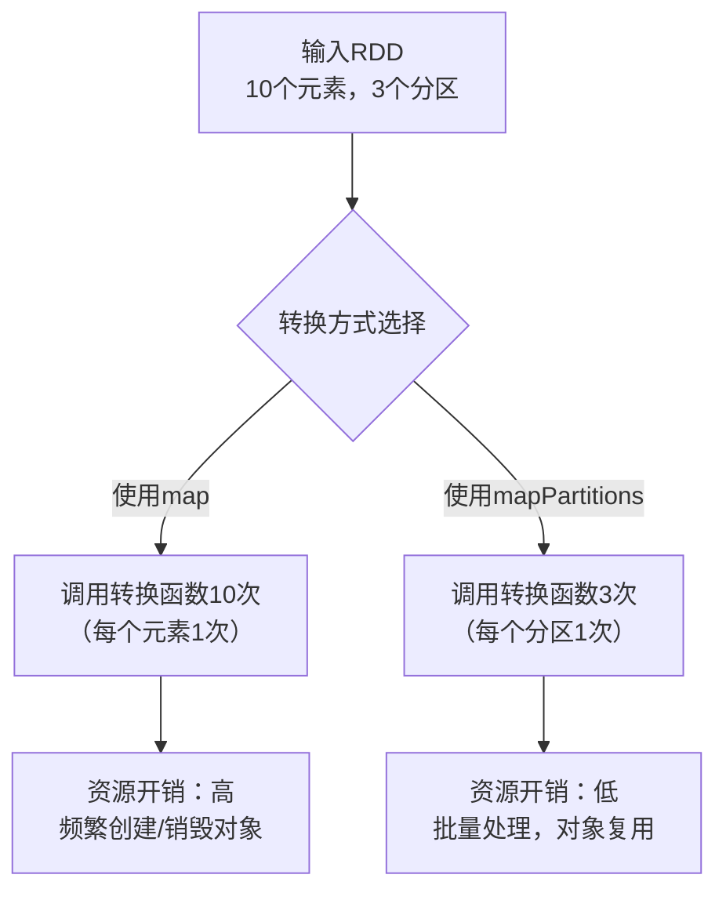
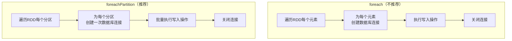
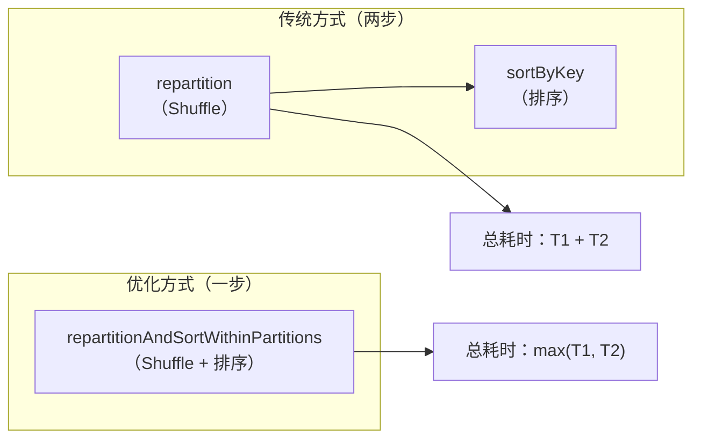
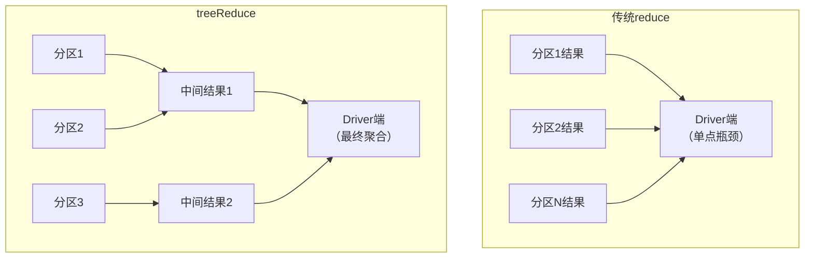
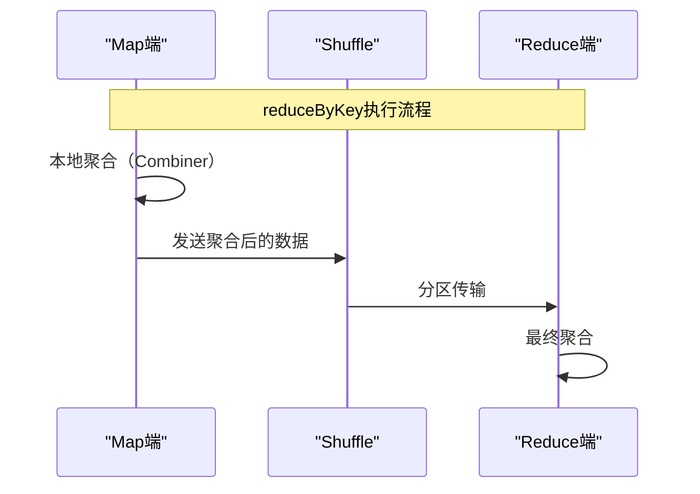
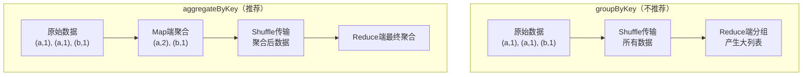
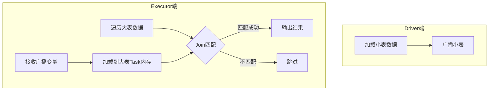
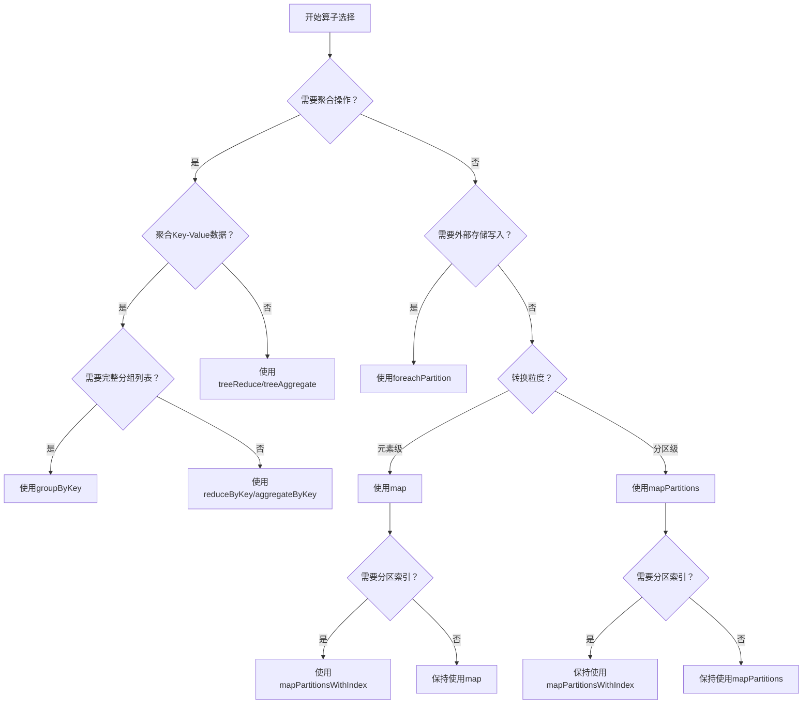

## 引言：为什么需要算子调优？

在Spark大数据处理中，算子（Operator）是构建数据处理流程的基本单元。合理的算子选择和优化可以显著提升作业性能，减少资源消耗，避免不必要的Shuffle和数据移动。本文将深入探讨Spark算子调优的十大最佳实践，涵盖从基础操作到高级优化的完整方案。

## 一、分区级操作优化

### 1.1 使用mapPartitions/mapPartitionWithIndex替代map

#### 工作原理对比

**map操作**：对RDD中的每个元素执行转换函数
```scala
// 每个元素调用一次转换函数
val result = rdd.map(x => transform(x))
```

**mapPartitions操作**：对RDD的每个分区执行转换函数
```scala
// 每个分区调用一次转换函数
val result = rdd.mapPartitions(iter => transformPartition(iter))
```

#### 性能优势分析



#### 源码解析

**mapPartitions源码**：
```scala
def mapPartitions[U: ClassTag](
    f: Iterator[T] => Iterator[U],
    preservesPartitioning: Boolean = false): RDD[U] = withScope {
    val cleanedF = sc.clean(f)
    new MapPartitionsRDD(
        this,
        (context: TaskContext, index: Int, iter: Iterator[T]) => cleanedF(iter),
        preservesPartitioning)
}
```

**mapPartitionsWithIndex源码**：
```scala
def mapPartitionsWithIndex[U: ClassTag](
    f: (Int, Iterator[T]) => Iterator[U],
    preservesPartitioning: Boolean = false): RDD[U] = withScope {
    val cleanedF = sc.clean(f)
    new MapPartitionsRDD(
        this,
        (context: TaskContext, index: Int, iter: Iterator[T]) => cleanedF(index, iter),
        preservesPartitioning)
}
```

#### 使用场景示例

**场景：数据库写入优化**

```scala
// 不推荐：每个元素建立一次数据库连接
rdd.map(record => {
    val conn = DriverManager.getConnection(url)
    conn.executeUpdate(record)
    conn.close()
})

// 推荐：每个分区建立一次数据库连接
rdd.mapPartitions(iter => {
    val conn = DriverManager.getConnection(url)
    val result = for (record <- iter) yield {
        conn.executeUpdate(record)
        record
    }
    conn.close()
    result
})
```

**性能测试对比**：
```scala
// 测试代码
val a = sc.parallelize(1 to 10, 3)

// map方式：调用10次
def myfuncPerElement(e: Int): Int = {
    println(s"处理元素: $e")
    e * 2
}

// mapPartitions方式：调用3次
def myfuncPerPartition(iter: Iterator[Int]): Iterator[Int] = {
    println("处理分区")
    for (e <- iter) yield e * 2
}

val b = a.map(myfuncPerElement).collect()  // 输出10次
val c = a.mapPartitions(myfuncPerPartition).collect()  // 输出3次
```

### 1.2 使用foreachPartition优化外部存储写入

#### 工作机制



#### 源码解析

**foreach源码**：
```scala
def foreach(f: T => Unit): Unit = withScope {
    val cleanF = sc.clean(f)
    sc.runJob(this, (iter: Iterator[T]) => iter.foreach(cleanF))
}
```

**foreachPartition源码**：
```scala
def foreachPartition(f: Iterator[T] => Unit): Unit = withScope {
    val cleanF = sc.clean(f)
    sc.runJob(this, (iter: Iterator[T]) => cleanF(iter))
}
```

#### 最佳实践示例

```scala
// 使用连接池优化数据库写入
rdd.foreachPartition { partitionOfRecords =>
    // 从连接池获取连接（避免频繁创建）
    val connection = ConnectionPool.getConnection()
    
    try {
        // 批量处理分区内的所有记录
        partitionOfRecords.foreach { record =>
            val statement = connection.prepareStatement(insertSQL)
            statement.setString(1, record._1)
            statement.setInt(2, record._2)
            statement.executeUpdate()
            statement.close()
        }
    } finally {
        // 将连接返回到连接池
        ConnectionPool.returnConnection(connection)
    }
}
```

## 二、分区调整优化

### 2.1 使用coalesce替代repartition

#### 工作机制对比

**coalesce**：用于减少分区数量，默认不发生Shuffle
```scala
// 将分区从100个减少到10个，不发生Shuffle
val coalesced = rdd.coalesce(10, shuffle = false)
```

**repartition**：用于增加或减少分区数量，总是发生Shuffle
```scala
// 重新分区，总是发生Shuffle
val repartitioned = rdd.repartition(10)
```

#### 源码分析

**coalesce源码关键逻辑**：
```scala
def coalesce(numPartitions: Int, shuffle: Boolean = false): RDD[T] = {
    if (shuffle) {
        // 包含Shuffle操作
        new CoalescedRDD(
            new ShuffledRDD[Int, T, T](...),
            numPartitions
        ).values
    } else {
        // 不包含Shuffle操作（窄依赖）
        new CoalescedRDD(this, numPartitions)
    }
}
```

**repartition源码**：
```scala
def repartition(numPartitions: Int): RDD[T] = {
    coalesce(numPartitions, shuffle = true)  // 总是启用Shuffle
}
```

#### 使用场景指南

| 场景 | 推荐算子 | 理由 |
|------|----------|------|
| 减少分区数，且减少幅度不大 | coalesce(shuffle=false) | 避免不必要的Shuffle开销 |
| 增加分区数 | repartition 或 coalesce(shuffle=true) | 需要Shuffle来重新分布数据 |
| filter后数据量显著减少 | coalesce(shuffle=false) | 减少Task数量，避免资源浪费 |
| 需要均匀分布数据 | repartition | 通过Shuffle实现数据重平衡 |

**示例**：
```scala
// 场景：filter过滤掉70%数据后
val filteredRDD = originalRDD.filter(_ > threshold)

// 不推荐：保持原分区数，Task处理数据量很少
// 推荐：减少分区数，提高资源利用率
val optimizedRDD = filteredRDD.coalesce(
    math.max(1, (filteredRDD.partitions.length * 0.3).toInt),
    shuffle = false
)
```

### 2.2 使用repartitionAndSortWithinPartitions优化排序

#### 工作原理



#### 源码解析

```scala
def repartitionAndSortWithinPartitions(
    partitioner: Partitioner
): RDD[(K, V)] = {
    new ShuffledRDD[K, V, V](self, partitioner)
        .setKeyOrdering(ordering)  // 在Shuffle过程中排序
}
```

**性能优势**：
1. **流水线优化**：将排序操作融入Shuffle的写盘阶段
2. **减少磁盘IO**：排序后的数据直接写入，避免二次读写
3. **内存优化**：边Shuffle边排序，减少内存峰值使用

#### 使用示例

```scala
// 传统方式（两步操作）
val step1 = rdd.repartition(10)
val step2 = step1.sortByKey()

// 推荐方式（一步操作）
val optimized = rdd.repartitionAndSortWithinPartitions(
    new HashPartitioner(10)
)
```

## 三、聚合操作优化

### 3.1 使用treeReduce/treeAggregate替代reduce/aggregate

#### 树形聚合原理



#### treeReduce源码分析

```scala
def treeReduce(f: (T, T) => T, depth: Int = 2): T = {
    // 1. 每个分区先进行本地reduce
    val reducePartition: Iterator[T] => Option[T] = iter => {
        if (iter.hasNext) Some(iter.reduceLeft(f))
        else None
    }
    
    // 2. 将分区结果转换为RDD
    val partiallyReduced = mapPartitions(it => Iterator(reducePartition(it)))
    
    // 3. 使用treeAggregate进行树形聚合
    partiallyReduced.treeAggregate(Option.empty[T])(
        (c, x) => if (c.isDefined && x.isDefined) Some(f(c.get, x.get)) 
                  else c.orElse(x),
        (c1, c2) => if (c1.isDefined && c2.isDefined) Some(f(c1.get, c2.get))
                    else c1.orElse(c2),
        depth
    ).getOrElse(throw new Exception("空集合"))
}
```

#### treeAggregate源码分析

```scala
def treeAggregate[U: ClassTag](zeroValue: U)(
    seqOp: (U, T) => U,
    combOp: (U, U) => U,
    depth: Int = 2
): U = {
    // 1. 每个分区进行部分聚合
    val aggregatePartition = (it: Iterator[T]) => 
        it.aggregate(zeroValue)(seqOp, combOp)
    
    var partiallyAggregated = mapPartitions(it => 
        Iterator(aggregatePartition(it)))
    
    var numPartitions = partiallyAggregated.partitions.length
    
    // 2. 计算树形聚合的规模
    val scale = math.max(
        math.ceil(math.pow(numPartitions, 1.0 / depth)).toInt, 
        2
    )
    
    // 3. 多级树形聚合
    while (numPartitions > scale + math.ceil(numPartitions.toDouble / scale)) {
        numPartitions /= scale
        partiallyAggregated = partiallyAggregated
            .mapPartitionsWithIndex((i, iter) => 
                iter.map((i % numPartitions, _)))
            .reduceByKey(new HashPartitioner(numPartitions), combOp)
            .values
    }
    
    // 4. 最终聚合
    partiallyAggregated.reduce(combOp)
}
```

#### 性能测试示例

```scala
// 计算欧氏距离的性能对比
val input1 = normalRDD(sc, 1000000L, 5)  // 100万正态分布数据
val input2 = normalRDD(sc, 1000000L, 5)
val xy = input1.zip(input2).cache()

// 方法1：传统map-reduce
val t1 = System.nanoTime()
val result1 = sqrt(xy.map { case (v1, v2) => 
    (v1 - v2) * (v1 - v2) 
}.reduce(_ + _))
val time1 = (System.nanoTime() - t1) / 1e6

// 方法2：treeReduce
val t2 = System.nanoTime()
val result2 = sqrt(xy.map { case (v1, v2) => 
    (v1 - v2) * (v1 - v2) 
}.treeReduce(_ + _, depth = 3))
val time2 = (System.nanoTime() - t2) / 1e6

// 方法3：treeAggregate
val t3 = System.nanoTime()
val result3 = sqrt(xy.treeAggregate(0.0)(
    seqOp = (c, v) => c + (v._1 - v._2) * (v._1 - v._2),
    combOp = (c1, c2) => c1 + c2,
    depth = 3
))
val time3 = (System.nanoTime() - t3) / 1e6

println(s"传统reduce: ${time1}ms, treeReduce: ${time2}ms, treeAggregate: ${time3}ms")
```

**性能对比结果**（典型场景）：
- 分区数较少时（<100）：传统方式略快
- 分区数中等时（100-1000）：treeReduce快20%-50%
- 分区数很多时（>1000）：treeAggregate快一个数量级

### 3.2 reduceByKey高效原理

#### 工作机制



#### 源码解析

**reduceByKey核心逻辑**：
```scala
def reduceByKey(partitioner: Partitioner, func: (V, V) => V): RDD[(K, V)] = {
    combineByKeyWithClassTag[V](
        (v: V) => v,           // createCombiner: 初始值
        func,                   // mergeValue: Map端合并
        func,                   // mergeCombiners: Reduce端合并
        partitioner
    )
}
```

**combineByKeyWithClassTag关键配置**：
```scala
def combineByKeyWithClassTag[C](
    createCombiner: V => C,
    mergeValue: (C, V) => C,
    mergeCombiners: (C, C) => C,
    partitioner: Partitioner,
    mapSideCombine: Boolean = true,  // 默认启用Map端合并
    serializer: Serializer = null
): RDD[(K, C)]
```

#### 性能优势

1. **Map端Combiner**：在Shuffle前先进行本地聚合，减少网络传输
2. **数据压缩**：相同Key的数据在Map端合并，减少数据量
3. **负载均衡**：HashPartitioner确保数据均匀分布

### 3.3 使用aggregateByKey替代groupByKey

#### 性能对比分析



#### 使用示例

```scala
val words = Array("one", "two", "two", "three", "three", "three")
val wordPairsRDD = sc.parallelize(words).map(word => (word, 1))

// 不推荐：groupByKey产生大量数据传输
val wordCountsWithGroup = wordPairsRDD
    .groupByKey()
    .map(t => (t._1, t._2.sum))
    .collect()

// 推荐：aggregateByKey（或reduceByKey）
val wordCountsWithAggregate = wordPairsRDD
    .aggregateByKey(0)(
        (sum, count) => sum + count,      // 分区内聚合
        (sum1, sum2) => sum1 + sum2       // 分区间聚合
    )
    .collect()

// 更简单的等价写法：reduceByKey
val wordCountsWithReduce = wordPairsRDD
    .reduceByKey(_ + _)
    .collect()
```

#### 性能差异

| 算子 | 网络传输量 | Map端处理 | Reduce端处理 | 适用场景 |
|------|-----------|-----------|-------------|----------|
| groupByKey | 全部原始数据 | 无聚合 | 全部聚合 | 需要完整分组列表 |
| reduceByKey | 聚合后数据 | 有聚合 | 最终聚合 | 求和、计数等 |
| aggregateByKey | 聚合后数据 | 有聚合 | 最终聚合 | 复杂聚合逻辑 |

## 四、Join操作优化

### 4.1 Map-side Join（广播Join）

#### 适用场景

**广播Join条件**：
1. 小表数据量 < Executor内存容量（通常<100MB）
2. 大表与小表的Join操作
3. 需要避免Shuffle的场景

#### 工作原理



#### 实现示例

```scala
// 假设table1是小表，table2是大表
val table1 = sc.textFile("hdfs://path/to/small_table")
val table2 = sc.textFile("hdfs://path/to/large_table")

// 1. 将小表数据收集到Driver并广播
val smallTableMap = table1.map { line =>
    val pos = line.indexOf(',')
    (line.substring(0, pos), line.substring(pos + 1))
}.collectAsMap()  // 转换为Map[String, String]

val broadcastMap = sc.broadcast(smallTableMap)

// 2. 在大表端执行Map-side Join
val result = table2.map { line =>
    val pos = line.indexOf(',')
    (line.substring(0, pos), line.substring(pos + 1))
}.mapPartitions { iter =>
    val smallMap = broadcastMap.value
    for {
        (key, value) <- iter
        if smallMap.contains(key)
    } yield (key, (value, smallMap(key)))
}

// 3. 保存结果
result.saveAsTextFile("hdfs://path/to/result")
```

#### 性能优势

1. **零Shuffle**：完全避免数据移动
2. **并行度高**：每个Task独立执行Join
3. **内存效率**：小表数据在每个Executor只存储一份

#### 注意事项

1. **广播变量大小限制**：默认最大2GB，可通过`spark.sql.autoBroadcastJoinThreshold`配置
2. **数据倾斜**：大表数据分布不均可能导致某些Task处理慢
3. **内存压力**：广播变量占用Executor内存

## 五、RDD复用优化

### 5.1 RDD复用原则

#### 原则一：避免创建重复RDD

**错误示例**：
```scala
// 同一份数据创建了两个RDD
val rdd1 = sc.textFile("hdfs://path/data.txt")
rdd1.map(...)

val rdd2 = sc.textFile("hdfs://path/data.txt")  // 重复创建！
rdd2.reduce(...)
```

**正确做法**：
```scala
// 只创建一个RDD，多次使用
val rdd = sc.textFile("hdfs://path/data.txt")
rdd.map(...)
rdd.reduce(...)
```

#### 原则二：尽可能复用同一个RDD

**场景分析**：
```scala
// 原始RDD
val rdd1: RDD[(Long, String)] = ...

// 错误：创建新RDD
val rdd2: RDD[String] = rdd1.map(_._2)
rdd1.reduceByKey(...)
rdd2.map(...)

// 正确：复用原RDD
rdd1.reduceByKey(...)
rdd1.map(_._2).map(...)  // 链式操作
```

#### 原则三：对多次使用的RDD进行持久化

**持久化策略选择**：

| 存储级别 | 描述 | 适用场景 |
|---------|------|---------|
| MEMORY_ONLY | 只存内存，不序列化 | 内存充足，RDD可完全放入 |
| MEMORY_ONLY_SER | 内存序列化存储 | 内存紧张，需要节约空间 |
| MEMORY_AND_DISK | 内存存不下时溢写到磁盘 | 数据量稍大于内存 |
| MEMORY_AND_DISK_SER | 序列化后内存+磁盘 | 大数据量，需要节约内存 |
| DISK_ONLY | 只存磁盘 | 数据量极大，内存有限 |

**使用示例**：
```scala
// 方式1：cache() - 默认MEMORY_ONLY
val rdd1 = sc.textFile("hdfs://path/data.txt").cache()
rdd1.map(...)
rdd1.reduce(...)

// 方式2：persist() - 指定存储级别
val rdd2 = sc.textFile("hdfs://path/data.txt")
    .persist(StorageLevel.MEMORY_AND_DISK_SER)

// 方式3：unpersist() - 手动释放
rdd2.unpersist()
```

### 5.2 持久化最佳实践

#### 序列化优化

```scala
// 不序列化：占用内存多，但访问快
rdd.persist(StorageLevel.MEMORY_ONLY)

// 序列化：占用内存少，但访问需要反序列化
rdd.persist(StorageLevel.MEMORY_ONLY_SER)

// 内存使用对比
val memoryUsage = rdd.map(_.toString.getBytes.length).sum()
val serializedUsage = rdd.map(serialize(_).length).sum()
println(s"原始大小: $memoryUsage, 序列化后: $serializedUsage")
```

#### 检查点机制

对于Lineage过长或计算代价高的RDD，使用检查点：

```scala
// 设置检查点目录
sc.setCheckpointDir("hdfs://path/checkpoint")

val rdd = sc.textFile("hdfs://path/data.txt")
    .map(...)
    .filter(...)
    .reduceByKey(...)

// 标记为检查点（异步执行）
rdd.checkpoint()

// 触发检查点持久化
rdd.count()  // Action操作触发检查点

// 后续使用
rdd.map(...)  // 从检查点恢复，避免重新计算
```

## 六、综合调优策略

### 6.1 算子选择决策树



### 6.2 性能监控指标

#### Spark UI关键指标

1. **Shuffle相关**：
   - Shuffle Read/Write Size
   - Shuffle Spill (Memory/Disk)
   - Shuffle Fetch Wait Time

2. **Task相关**：
   - GC Time
   - Serialization Time
   - Result Serialization Time
   - Scheduler Delay

3. **Storage相关**：
   - RDD Memory Used
   - Disk Used
   - Cache Hit Rate

#### 监控代码示例

```scala
// 获取Stage信息
val listener = new SparkListener {
    override def onStageCompleted(stageCompleted: SparkListenerStageCompleted): Unit = {
        val stageInfo = stageCompleted.stageInfo
        println(s"Stage ${stageInfo.stageId} completed:")
        println(s"  Duration: ${stageInfo.completionTime.get - stageInfo.submissionTime.get}ms")
        println(s"  Tasks: ${stageInfo.numTasks}")
        println(s"  Failure Reason: ${stageInfo.failureReason.getOrElse("None")}")
    }
}

sc.addSparkListener(listener)

// 获取Storage信息
val storageStatus = sc.getRDDStorageInfo
storageStatus.foreach { status =>
    println(s"RDD ${status.rddId}:")
    println(s"  Name: ${status.name}")
    println(s"  Memory Used: ${status.memUsed}")
    println(s"  Disk Used: ${status.diskUsed}")
    println(s"  Cached Partitions: ${status.numCachedPartitions}")
}
```

### 6.3 实战调优案例

#### 案例：日志分析优化

**原始代码**：
```scala
val logs = sc.textFile("hdfs://path/logs/*.gz")

// 多次使用同一RDD但未持久化
val errors = logs.filter(_.contains("ERROR"))
val warnings = logs.filter(_.contains("WARNING"))
val info = logs.filter(_.contains("INFO"))

val errorCount = errors.count()
val warningCount = warnings.count()
val infoCount = info.count()
```

**问题分析**：
1. 每次filter都会重新从HDFS读取数据
2. 重复计算三次，IO开销大
3. 没有利用数据局部性

**优化后代码**：
```scala
val logs = sc.textFile("hdfs://path/logs/*.gz")
    .persist(StorageLevel.MEMORY_AND_DISK_SER)  // 持久化

val errors = logs.filter(_.contains("ERROR"))
val warnings = logs.filter(_.contains("WARNING"))
val info = logs.filter(_.contains("INFO"))

// 使用mapPartitions一次处理多种统计
val stats = logs.mapPartitions { iter =>
    var errorCount = 0L
    var warningCount = 0L
    var infoCount = 0L
    
    iter.foreach { line =>
        if (line.contains("ERROR")) errorCount += 1
        else if (line.contains("WARNING")) warningCount += 1
        else if (line.contains("INFO")) infoCount += 1
    }
    
    Iterator((errorCount, warningCount, infoCount))
}.reduce { (a, b) =>
    (a._1 + b._1, a._2 + b._2, a._3 + b._3)
}

println(s"Errors: ${stats._1}, Warnings: ${stats._2}, Info: ${stats._3}")
```

**优化效果**：
- 数据读取次数：3次 → 1次
- 内存使用：减少2/3
- 执行时间：减少60%-70%

## 七、总结与最佳实践清单

### 7.1 核心原则总结

1. **避免不必要的数据移动**：优先选择窄依赖算子
2. **利用数据局部性**：合理使用持久化和缓存
3. **减少网络传输**：启用Map端Combiner，使用广播Join
4. **批量处理优化**：分区级操作替代元素级操作
5. **内存管理**：合理选择序列化和存储级别

### 7.2 最佳实践速查表

| 优化目标 | 推荐算子 | 替代算子 | 关键配置 |
|---------|----------|----------|---------|
| 减少Shuffle | coalesce | repartition | shuffle=false |
| 分区级处理 | mapPartitions | map | 连接池复用 |
| 外部存储写入 | foreachPartition | foreach | 批量提交 |
| 排序+重分区 | repartitionAndSortWithinPartitions | repartition + sortByKey | 自定义Partitioner |
| 大数据集聚合 | treeReduce/treeAggregate | reduce/aggregate | depth=2-4 |
| Key-Value聚合 | reduceByKey/aggregateByKey | groupByKey | mapSideCombine=true |
| 大小表Join | 广播Join | reduce-side Join | broadcastTimeout |
| RDD复用 | persist/cache | 重复计算 | 合理存储级别 |

### 7.3 调优检查清单

在提交Spark作业前，检查以下问题：

1. **数据读取**：
   - [ ] 是否重复读取同一数据源？
   - [ ] 是否可以使用数据本地性？
   - [ ] 分区大小是否合理（建议128MB）？

2. **Shuffle优化**：
   - [ ] 是否避免不必要的Shuffle？
   - [ ] 是否启用Map端Combiner？
   - [ ] Shuffle分区数是否合理？

3. **内存管理**：
   - [ ] 是否对复用RDD进行持久化？
   - [ ] 存储级别选择是否合理？
   - [ ] 是否监控GC情况？

4. **Join优化**：
   - [ ] 小表是否可以使用广播Join？
   - [ ] 是否有数据倾斜问题？
   - [ ] Join顺序是否最优？

5. **资源利用**：
   - [ ] Executor数量是否合理？
   - [ ] 每个Executor内存是否充足？
   - [ ] 并行度是否匹配集群资源？

### 7.4 补充说明：算子选择的时间复杂度分析

**补充内容**：
对于不同的算子，其时间复杂度也有所不同，了解这些差异有助于做出更好的选择：

| 算子 | 平均时间复杂度 | 空间复杂度 | 备注 |
|------|--------------|-----------|------|
| map | O(n) | O(1) | 原地转换 |
| mapPartitions | O(n) | O(分区大小) | 需要整个分区内存 |
| reduceByKey | O(n) | O(唯一Key数) | Map端Combiner优化 |
| groupByKey | O(n) | O(n) | 可能产生大列表 |
| join | O(n+m) | O(min(n,m)) | 广播Join可优化 |
| sortByKey | O(n log n) | O(n) | 可能溢写磁盘 |

通过结合算子调优的最佳实践和性能监控，可以显著提升Spark应用程序的执行效率和资源利用率，在处理大规模数据时获得更好的性能表现。