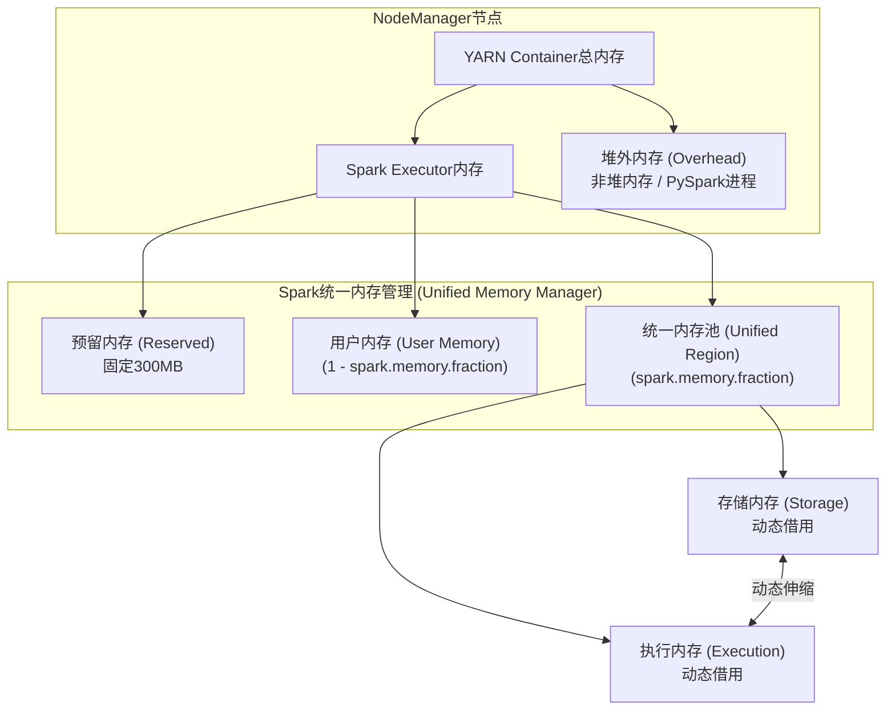
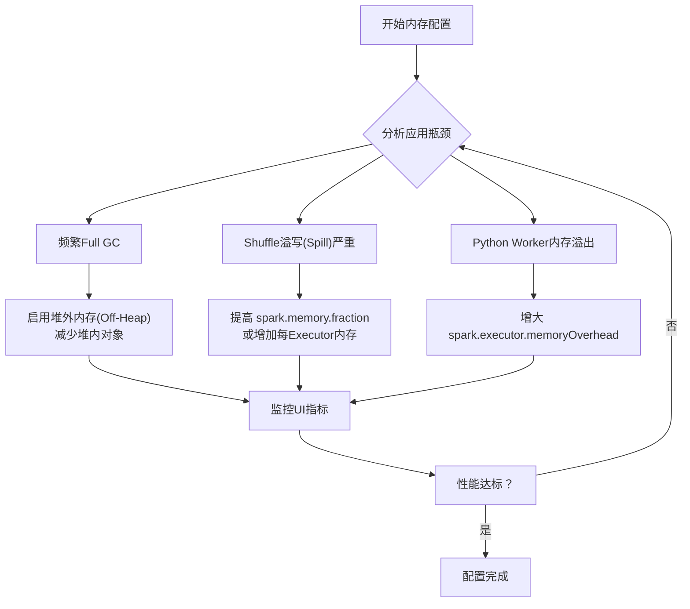
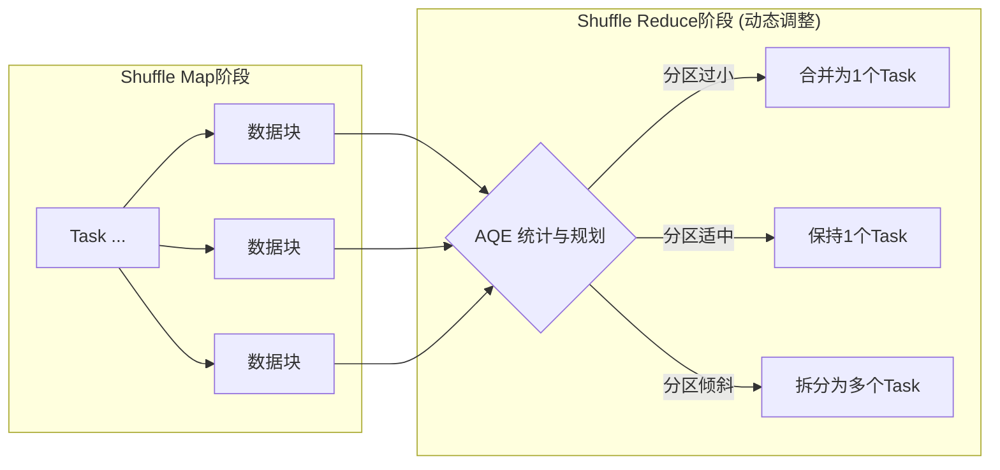
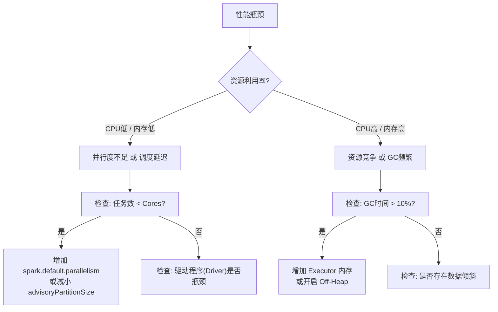

在大数据计算领域，Spark凭借其卓越的内存计算能力和灵活的编程模型，已成为企业级数据处理的核心引擎。随着Spark 3.x版本的普及，其引入的**自适应查询执行（AQE）**、**动态资源分配（DRA）以及改进的统一内存管理机制**，为性能调优带来了全新的范式。

然而，无论版本如何迭代，核心逻辑未变：**资源分配决定了应用能“用多少”计算能力，而并行度则决定了这些能力“如何被有效利用”**。本文将基于**Spark 3.x**的特性，深入探讨集群资源分配与并行度调优的最佳实践。

## 一、Executor内存与CPU配置策略

Executor作为Spark作业执行的基本单位，其资源配置直接影响作业的性能和稳定性。在Spark 3.x中，我们需要结合统一内存管理机制来平衡资源。

### 1.1 内存配置原理与优化

#### 1.1.1 YARN集群下的内存结构 (Spark 3.x 视角)

在YARN-Cluster模式下，Spark 3.x的内存结构更为规整。如下图所示：




**关键配置参数解析（Spark 3.x）：**

1. **YARN层面控制**：
    
    - `yarn.nodemanager.resource.memory-mb`：控制每个节点上Container能够使用的最大内存。
        
    - `spark.yarn.executor.memoryOverhead`：堆外内存分配。**在Spark 3.x中，默认比例调整为`spark.executor.memory`的10%**（且最小为384MB）。这对于使用PySpark或Off-Heap内存的应用尤为重要。
        
2. **Spark统一内存管理配置**：
    
    - `spark.executor.memory`：Executor堆内总内存。
        
    - `spark.memory.fraction`：统一内存池占堆内内存（扣除300MB预留后）的比例，默认为 **0.6**。
        
    - `spark.memory.storageFraction`：统一内存池中，保障给Storage内存的基准比例，默认为 **0.5**。
        
    - _注：Spark 1.6+已弃用`spark.shuffle.memoryFraction`等静态配置，Spark 3.x完全依赖统一内存管理，执行与存储内存可互相借用。_
        

#### 1.1.2 内存调优实战技巧

**基于统一内存机制的调整策略：**

1. **RDD缓存与Shuffle的动态博弈**：

    
    ```bash
    # 如果任务计算繁重（如大量Join/Agg），Shuffle内存不足导致溢写磁盘，
    # 而缓存需求较少，可适当提高 fraction，或降低 storageFraction 让出更多空间给 Execution
    spark-submit --conf spark.memory.fraction=0.7 --conf spark.memory.storageFraction=0.3
    ```
    
    _调优原理_：Execution内存（Shuffle/Sort）一旦占用无法被强制驱逐，而Storage内存（Cache）可以被驱逐。降低`storageFraction`可以让Execution更容易获得内存，减少磁盘溢写（Spill）。
    
2. **堆外内存（Off-Heap）的应用**：
    
    Spark 3.x 进一步增强了对堆外内存的支持，特别是在Tungsten引擎和PySpark中。
    
    ```bash
    # 启用堆外内存，缓解GC压力
    spark-submit \
      --conf spark.memory.offHeap.enabled=true \
      --conf spark.memory.offHeap.size=2g
    ```
    
3. **内存需求估算方法**：
    
    - 查看Spark UI的 **Storage** 标签页，观察 "Size in Memory" 与 "Size on Disk"。
        
    - 查看 **Stage** 详情页的 "Shuffle Read/Write" 和 "Peak Execution Memory"。
        
    - 经验法则：`spark.executor.memory` ≈ (Shuffle峰值需求 + 缓存数据量) × 1.2（安全余量）。
        

**内存配置决策流程：**



### 1.2 CPU核心配置策略

#### 1.2.1 核心配置原则

在Spark 3.x中，CPU核心数的配置依然遵循"多核并发"原则，但需注意与**动态资源分配（DRA）**的配合。


```bash
# 启动参数示例
spark-submit \
  --num-executors 10 \      # 初始Executor数量（若开启DRA，则为初始值）
  --executor-cores 4 \      # 每个Executor分配4个CPU核心
  --conf spark.dynamicAllocation.enabled=true # 开启动态资源分配
```

**配置要点：**

- **单Executor核心数**：建议 **3-5核**。过少（1核）会导致无法利用JVM多线程共享变量的优势；过多（>8核）会导致HDFS I/O吞吐瓶颈和严重的锁竞争。
    
- **与内存的配比**：一般 1个Core 对应 2GB-4GB 内存。
    

#### 1.2.2 生产环境推荐配置

|**应用类型**|**Executor内存**|**CPU核心数**|**适用场景**|
|---|---|---|---|
|内存密集型|16-24GB|4-5核|大规模Join、机器学习、图计算|
|CPU密集型|8-12GB|5-6核|复杂UDF计算、JSON解析、加解密|
|通用型|12-16GB|4核|标准数仓ETL|

## 二、并行度调优最佳实践 (Spark 3.x 特性篇)

Spark 3.x 引入的 **自适应查询执行 (Adaptive Query Execution, AQE)** 彻底改变了并行度调优的逻辑，从"预先静态设置"转变为"运行时动态调整"。

### 2.1 并行度原理：静态 vs 动态

#### 2.1.1 传统静态并行度的问题

在旧版本中，我们必须预设`spark.sql.shuffle.partitions`（默认200）。

- **数据量小**：200个分区导致产生大量KB级小文件，调度开销大。
    
- **数据量大**：200个分区导致单个Task处理数GB数据，发生OOM或严重的GC。
    

#### 2.1.2 Spark 3.x AQE 的解决方案

AQE 允许Spark在运行时根据Shuffle Map阶段的统计信息，动态合并（Coalesce）或拆分分区。




### 2.2 并行度设置实战指南

#### 2.2.1 启用 AQE（强烈推荐）

在Spark 3.x中，绝大多数SQL/DataFrame任务应首选AQE。


```Scala
val conf = new SparkConf()
  .set("spark.sql.adaptive.enabled", "true")  // 开启AQE (Spark 3.2+ 默认开启)
  .set("spark.sql.adaptive.coalescePartitions.enabled", "true") // 开启自动合并分区
  .set("spark.sql.adaptive.advisoryPartitionSizeInBytes", "64m") // 期望的每个Task处理数据量
  .set("spark.sql.shuffle.partitions", "2000") // 设置一个较大的初始值
```

**策略逻辑：**

1. 将 `spark.sql.shuffle.partitions` 设置得**足够大**（如1000或2000），作为并行度的上限。
    
2. AQE 会根据 `advisoryPartitionSizeInBytes`（建议64MB-128MB）自动将过小的分区合并。
    
3. **结果**：数据量大时用足2000分区，数据量小时自动降为几十个分区，无需人工干预。
    

#### 2.2.2 RDD 算子的并行度（非SQL场景）

对于原生的RDD操作（非DataFrame/Dataset），AQE 不生效，仍需手动控制。

**配置公式：**

```
RDD并行度 = 总CPU核心数 × 2 ~ 3
```

**代码示例：**

```Scala
// RDD场景仍需手动控制
val rdd = sc.textFile("hdfs://input/", minPartitions = 500)
  .map(...)
  .reduceByKey(_ + _, numPartitions = 500) // 显式指定Shuffle并行度
```

#### 2.2.3 解决数据倾斜 (Skew Join)

Spark 3.x AQE 自动处理倾斜Join是其杀手级功能。

```Bash
# 开启倾斜连接优化
spark.sql.adaptive.skewJoin.enabled=true
# 定义什么是倾斜 (默认参数通常足够)
spark.sql.adaptive.skewJoin.skewedPartitionFactor=5
spark.sql.adaptive.skewJoin.skewedPartitionThresholdInBytes=256m
```

_原理_：当AQE检测到某个Partition数据量远超中位数时，会自动将其拆分成多个子任务进行Join，避免长尾效应。

#### 2.2.4 并行度调优检查清单 (Spark 3.x版)

```mermaid
flowchart TD
    A["开始调优"] --> B{"任务类型?"}
    
    B -->|SQL / DataFrame| C["AQE 路线"]
    B -->|原生 RDD| D["传统路线"]
    
    C --> C1["设置 spark.sql.adaptive.enabled=true"]
    C1 --> C2["设置 spark.sql.shuffle.partitions = 2000 (上限)"]
    C2 --> C3["设置 advisoryPartitionSizeInBytes = 64m/128m"]
    
    D --> D1["计算总Cores"]
    D1 --> D2["设置 spark.default.parallelism = Cores * 2"]
    
    C3 & D2 --> E{"监控 Stage 执行时间"}
    E --> F["观察 Spark UI"]
    
    F --> G{是否有长尾Task?}
    G -->|是 (SQL)| H["检查 SkewJoin 是否触发<br>调整 skewJoin 阈值"]
    G -->|是 (RDD)| I["手动加盐 (Salting)"]
    G -->|否| J["调优完成"]
```

## 三、综合调优实战案例

### 3.1 典型应用场景配置 (Spark 3.2+)

**场景：海量日志ETL**

- 数据量：每日 2TB Parquet 数据
    
- 集群资源：充足，YARN环境
    

**推荐配置：**

```Bash
spark-submit \
  --master yarn \
  --deploy-mode cluster \
  --conf spark.dynamicAllocation.enabled=true \  # 开启动态资源分配
  --conf spark.dynamicAllocation.minExecutors=5 \
  --conf spark.dynamicAllocation.maxExecutors=100 \
  --executor-memory 10g \
  --executor-cores 4 \
  --conf spark.yarn.executor.memoryOverhead=2g \ # 显式给予堆外内存，防OOM
  # --- 并行度与AQE配置 ---
  --conf spark.sql.adaptive.enabled=true \
  --conf spark.sql.adaptive.coalescePartitions.enabled=true \
  --conf spark.sql.adaptive.advisoryPartitionSizeInBytes=128m \
  --conf spark.sql.shuffle.partitions=4000 \     # 给AQE足够的切分空间
  --conf spark.sql.adaptive.skewJoin.enabled=true \
  --class com.example.LogETL \
  log-etl.jar
```

**配置解析：**

1. **动态资源**：允许Spark根据负载在5到100个Executor间伸缩，空闲时释放资源。
    
2. **AQE策略**：初始Shuffle分区设为4000，但目标是每个Task处理128MB数据。AQE会自动合并小分区，处理倾斜分区。
    
3. **内存**：10GB堆内 + 2GB堆外，适应Spark 3.x的内存模型。
    

### 3.2 性能瓶颈分析图谱

当遇到性能问题时，按照以下路径排查：




## 四、总结与最佳实践汇总

### 4.1 核心原则总结 (Spark 3.x)

1. **拥抱 AQE**：在 SQL/DataFrame 任务中，AQE 是并行度调优的神器，它解决了 "Shuffle 分区数难以预估" 和 "数据倾斜" 两大痛点。
    
2. **统一内存观**：理解堆内 (Unified Memory) 和堆外 (Overhead/Off-Heap) 的关系。对于 Python 任务或高并发 Shuffle，务必关注 Overhead 内存。
    
3. **资源分配公式**：
    
    - Executor：4-5 Core, 8-16GB RAM。
        
    - Shuffle Parallelism：**AQE 开启时设大 (2000+)，AQE 关闭时设准 (Cores * 2)**。
        

### 4.2 生产环境检查清单

在部署 Spark 3.x 应用前，请确认：

- [ ] **AQE 已开启** (`spark.sql.adaptive.enabled=true`)。
    
- [ ] **Shuffle 分区上限** (`spark.sql.shuffle.partitions`) 已设置得足够大以配合 AQE。
    
- [ ] **内存 Overhead** 已检查，特别是运行 PySpark 任务时。
    
- [ ] **动态分配** (`spark.dynamicAllocation.enabled`) 已根据集群现状配置。
    
- [ ] **序列化优化**：确保使用了 KryoSerializer (Spark 3 往往默认优化，但需确认自定义类注册)。
    
- [ ] **向量化执行**：确认 Parquet/ORC 读取开启了向量化读取功能。
    

### 4.3 持续优化

Spark 3.x 的调优更多是"配置策略"而非"微调数值"。通过启用自适应特性，我们可以让 Spark 引擎自己在运行时做出最优决策，将开发者从繁琐的参数试错中解放出来，专注于业务逻辑的实现。