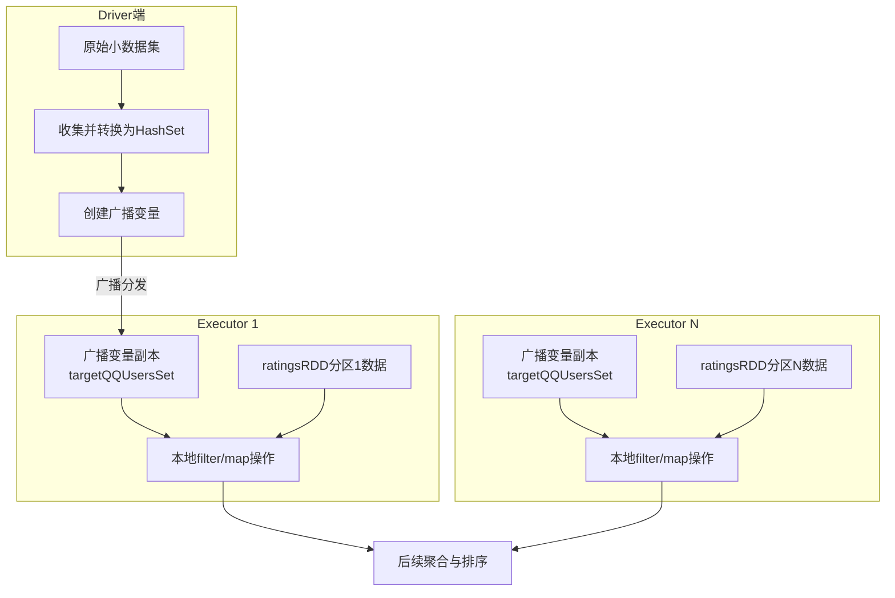

在分布式计算框架Spark中，Shuffle操作是影响性能的关键瓶颈之一。它涉及节点间大量数据的网络传输和磁盘I/O，常常成为性能优化的核心目标。本章将深入探讨两种重要的共享变量——**Broadcast（广播变量）** 和 **Accumulator（累加器）**，它们通过巧妙的数据共享机制，能够有效避免不必要的Shuffle，优化聚合逻辑，是实现高性能Spark应用不可或缺的利器。

## 一、Broadcast：实现Mapper端聚合，规避Shuffle

### 1.1 原理剖析：为何要避免Shuffle？

Shuffle过程是Spark作业中开销最大的操作，通常分为Mapper端和Reducer端两部分。其核心问题在于：
- **网络与磁盘开销**：为了将相同Key的数据汇聚到同一个节点进行处理，Spark需要在Mapper端将中间结果写入本地磁盘，然后在Reducer端通过网络抓取这些数据。这导致了大量的磁盘I/O和网络传输。
- **数据倾斜风险**：如果某个Key的数据量异常庞大，汇聚到单个节点处理时，极易引发数据倾斜，拖慢整个作业。

因此，性能调优的一个黄金法则是：**尽量不使用或减少Shuffle类的算子**，如 `reduceByKey`、`join`（非广播方式）等。

### 1.2 实战：Broadcast Join（Map端Join）

在多表关联（Join）场景中，如果其中一张表的数据量很小，我们可以利用Broadcast变量，将小表数据全量分发到每个Executor节点，从而在Mapper端完成关联操作，完全避免Shuffle。这种操作被称为 **Map Join**。

**核心思想**：将小数据集广播到集群所有节点，使每个任务都能在本地访问完整的小表数据，从而无需移动大数据集。

#### 案例：电影点评系统 - 最受特定年龄段欢迎的电影TopN

假设我们有一个用户数据集（`usersRDD`）和评分数据集（`ratingsRDD`）。目标是找出最受18岁和25岁用户欢迎的电影Top 10。

**传统Shuffle Join的弊端**：需要将 `ratingsRDD` 和过滤后的用户数据通过Shuffle进行Join，效率低下。

**Broadcast Join优化步骤**：

```scala
// 1. 过滤出目标年龄段的用户ID（假设数据量很小）
val targetQQUsers = usersRDD.map(_.split("::")).map(x => (x(0), x(2))).filter(_._2.equals("18"))
val targetTaobaoUsers = usersRDD.map(_.split("::")).map(x => (x(0), x(2))).filter(_._2.equals("25"))

// 2. 将用户ID集合收集到Driver端并转换为HashSet（小数据集）
val targetQQUsersSet = HashSet() ++ targetQQUsers.map(_._1).collect()
val targetTaobaoUsersSet = HashSet() ++ targetTaobaoUsers.map(_._1).collect()

// 3. 使用广播变量将小数据集分发到每个Executor
val targetQQUsersBroadcast = sc.broadcast(targetQQUsersSet)
val targetTaobaoUsersBroadcast = sc.broadcast(targetTaobaoUsersSet)

// 4. 加载电影ID到名称的映射（同样可以广播，如果数据量小）
val movieID2Name = moviesRDD.map(_.split("::")).map(x => (x(0), x(1))).collect().toMap
val movieID2NameBroadcast = sc.broadcast(movieID2Name) // 补充：优化电影名称查找

// 5. 核心计算：在map阶段过滤并统计，无需Shuffle
println("最受18岁用户喜爱的电影TopN分析:")
ratingsRDD.map(_.split("::"))
  .map(x => (x(0), x(1))) // (UserID, MovieID)
  .filter(x => targetQQUsersBroadcast.value.contains(x._1)) // 本地过滤，无Shuffle
  .map(x => (x._2, 1)) // (MovieID, 1)
  .reduceByKey(_ + _)    // 局部聚合，仍可能有Shuffle（不同MovieID的分布）
  .map(x => (x._2, x._1)) // (Count, MovieID) 为排序准备
  .sortByKey(false)       // 按Count降序排序
  .map(x => (x._2, x._1)) // (MovieID, Count)
  .take(10)               // 取Top10
  .map(x => (movieID2NameBroadcast.value.getOrElse(x._1, "未知电影"), x._2)) // 本地查名称
  .foreach(println)
```

**优化效果**：通过广播 `targetQQUsersSet`，`filter` 操作在每个Executor本地完成，彻底避免了因用户ID过滤而产生的Shuffle。后续的 `reduceByKey` 操作的数据范围已经大大缩小。



## 二、Accumulator：实现安全的全局聚合

### 2.1 工作原理：分布式只写变量

累加器（Accumulator）是Spark提供的一种**分布式、只写、可加**的共享变量。它主要用于在并行计算中安全地执行全局聚合操作，如计数、求和等。

**核心特性**：
- **工作节点（Worker/Executor）只能累加**：任务（Task）可以通过 `add` 或 `+=` 方法修改累加器的值，但无法读取它。
- **驱动程序（Driver）才能读取**：只有Driver程序可以通过 `.value` 方法获取累加器的最终结果。
- **Spark UI可见**：如果创建时指定了名称，可以在Spark UI上监控其值，便于调试。

```scala
// 基础使用示例
val accum = sc.accumulator(0, "MyAccumulator") // 创建初始值为0的累加器，并命名
val dataRDD = sc.parallelize(Array(1, 2, 3, 4))

// 在RDD的转换操作中累加（注意：转换操作中的累加可能被多次执行）
dataRDD.foreach(x => accum += x) // foreach是一个Action，会触发计算

// 在Driver端读取结果
println(accum.value) // 输出：10
```

### 2.2 重要特性与陷阱

1.  **惰性求值与Action**：累加器的更新**只在Action操作触发作业执行时才会实际发生**。在惰性的Transformation（如`map`）中更新累加器，如果没有后续的Action，更新不会执行。
    ```scala
    val accum = sc.accumulator(0)
    val mappedRDD = dataRDD.map { x => accum += x; x * 2 } // Transformation
    // 此时 accum.value 仍为 0，因为map操作尚未被触发执行
    mappedRDD.count() // Action触发执行
    println(accum.value) // 此时才会输出累加后的值
    ```
2.  **任务重试与精确一次**：Spark保证每个任务对累加器的更新在作业的最终结果中**只被应用一次**。即使任务因失败而重新执行，其更新也不会被重复计算。然而，在转换操作中，如果Stage需要重算，累加器可能会被更新多次，因此**最好仅在Action操作中使用累加器**。

### 2.3 自定义累加器

Spark原生支持数值型累加器。对于更复杂的类型，可以通过自定义 `AccumulatorParam[T]` 来实现。

**自定义步骤**：
1.  定义一个实现 `AccumulatorParam[T]` 特质的对象。
2.  实现两个方法：
    - `zero(initialValue: T): T`: 提供该类型的“零值”。
    - `addInPlace(v1: T, v2: T): T`: 定义如何将两个值相加。

**案例：自定义向量（Vector）累加器**

```scala
import org.apache.spark.AccumulatorParam
import breeze.linalg.Vector

object VectorAccumulatorParam extends AccumulatorParam[Vector] {
  // 提供一个“零值”向量
  def zero(initialValue: Vector): Vector = {
    Vector.zeros(initialValue.size)
  }
  // 定义两个向量如何相加
  def addInPlace(v1: Vector, v2: Vector): Vector = {
    v1 += v2
  }
}

// 使用自定义累加器
val initialVector = Vector(1.0, 2.0, 3.0)
val vecAccum = sc.accumulator(initialVector)(VectorAccumulatorParam)

val vectorsRDD = sc.parallelize(Seq(Vector(1,1,1), Vector(2,2,2)))
vectorsRDD.foreach(vec => vecAccum += vec)

println(vecAccum.value) // 输出：DenseVector(4.0, 5.0, 6.0)
```

**补充说明**：在Spark 2.0及以上版本，官方推荐使用更通用、功能更强的 `AccumulatorV2` 抽象类来自定义累加器。它允许累加的输入类型和结果类型不同，提供了更大的灵活性。

## 三、总结与应用场景分析

| 特性 | Broadcast (广播变量) | Accumulator (累加器) |
| :--- | :--- | :--- |
| **读写权限** | Executor**只读**，Driver可写可读（创建广播） | Executor**只写**，Driver可读 |
| **主要用途** | 高效分发只读数据，避免Shuffle | 全局聚合统计，安全地收集信息 |
| **数据移动** | 从Driver到所有Executor（一次） | 从所有Executor聚合到Driver（一次） |
| **典型场景** | Map-side Join，小表广播，全局配置分发 | 计数、求和、调试信息收集、监控指标 |

**实战选择建议**：
- **使用Broadcast当**：有一个较小的数据集（通常能装入单个Executor的内存）需要在多个Task中被频繁读取，特别是用于过滤或映射操作时。这是优化`join`操作的首选方案。
- **使用Accumulator当**：需要从各个Task中安全地收集一些统计信息（如记录数、异常计数、样本数据）汇总到Driver端，且不需要在Task中读取中间状态。

通过熟练掌握Broadcast和Accumulator，开发者可以显著减少不必要的Shuffle开销，实现更高效、更可控的分布式计算逻辑，从而充分发挥Spark的性能潜力。