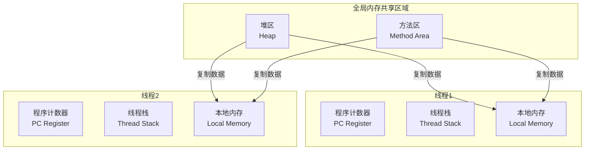
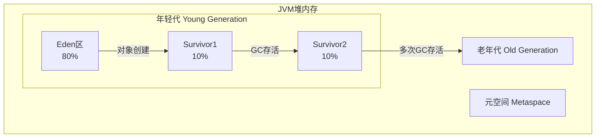
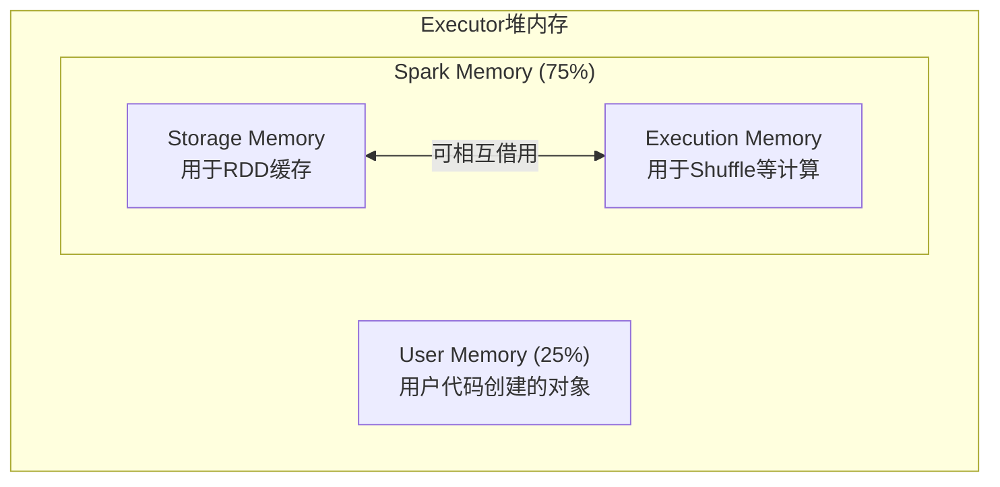
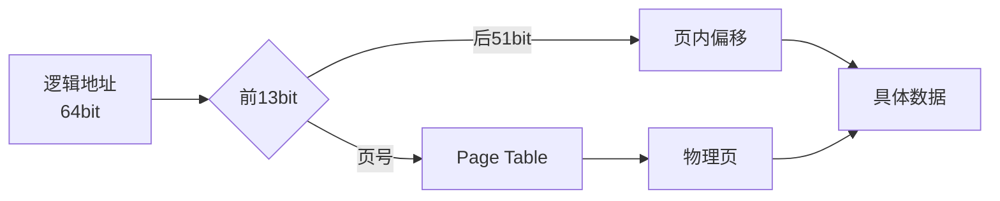
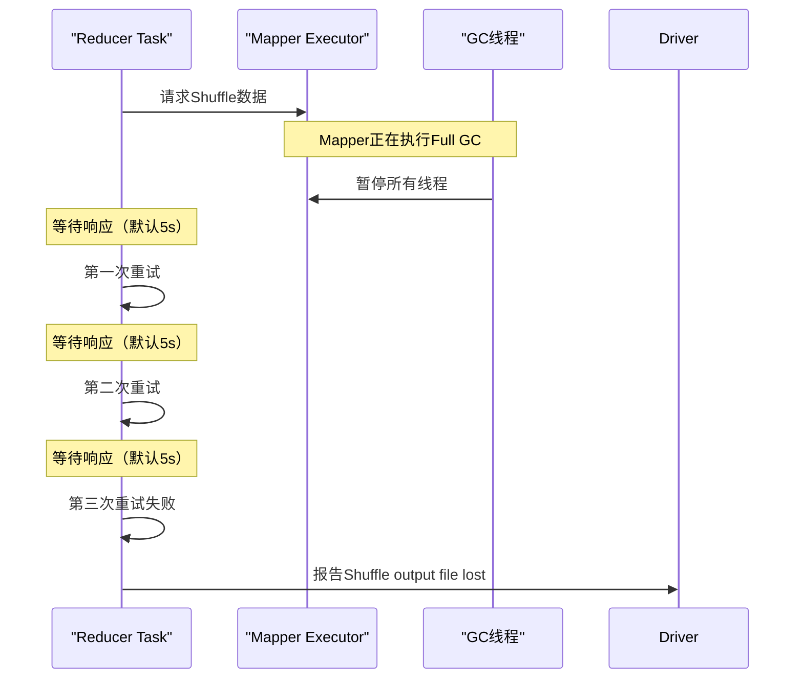
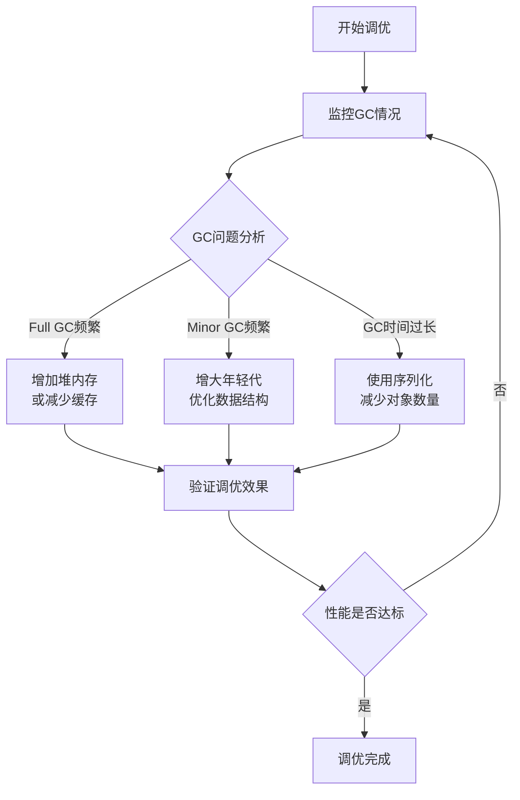

## 1. JVM内存架构详解及调优

### 1.1 JVM内存区域详解

JVM运行时数据区主要由以下几个部分组成：

#### 1.1.1 堆区（Heap）
- **存储内容**：所有对象实例和数组
- **线程共享**：被所有线程共享
- **特点**：
  - 存放对象本身，不存放基本类型和对象引用
  - 一般由程序员分配释放，若未释放则由GC回收
  - 是GC主要管理的区域

#### 1.1.2 栈区（Stack）
- **存储内容**：每个线程的局部变量、方法调用状态
- **线程私有**：每个线程有自己的栈区
- **特点**：
  - 保存基础数据类型的值和对象引用
  - 栈中的数据是私有的，其他栈不能访问
  - 由编译器自动分配释放
  - 分为三个部分：基本类型变量区、执行环境上下文、操作指令区

#### 1.1.3 方法区（Method Area）
- **存储内容**：类信息、静态变量、常量池
- **线程共享**：被所有线程共享
- **特点**：
  - 包含所有的class和static变量
  - 存储程序中永远唯一的元素
  - 全局变量和静态变量的存储区域

### 1.2 JVM线程引擎及内存共享机制



**关键机制：**
1. **程序计数器（PC Register）**：每个线程都有自己的程序计数器，用于记录下一条要执行的指令
2. **线程本地存储（ThreadLocal）**：线程私有的数据存储，其他线程不能访问
3. **内存复制机制**：线程操作数据时，先从全局内存复制到本地内存，防止状态不一致

### 1.3 JVM分代内存模型



#### 1.3.1 年轻代（Young Generation）
- **Eden区**：新创建的对象首先分配在Eden区
- **Survivor区**：经历一次GC后存活的对象移动到Survivor区
- **晋升机制**：对象在Survivor区经历多次GC后仍存活，则晋升到老年代

#### 1.3.2 老年代（Old Generation）
- 存储生命周期较长的对象
- 年轻代中经历N次GC后仍然存活的对象会进入老年代

#### 1.3.3 元空间（Metaspace）
- **存储内容**：类的元数据信息
- **特点**：
  - JDK 8开始取代永久代（PermGen）
  - 使用本地内存，大小不受JVM参数限制
  - 简化了Full GC过程

### 1.4 GC工作流程

#### 1.4.1 Minor GC（年轻代GC）
- **触发条件**：Eden区空间不足
- **过程**：
  1. 标记Eden和Survivor区中的存活对象
  2. 将存活对象复制到另一个Survivor区
  3. 清空Eden和原来的Survivor区
- **特点**：频繁但快速

#### 1.4.2 Full GC（全局GC）
- **触发条件**：
  - 老年代空间不足
  - 元空间空间不足
  - 显式调用System.gc()
  - Heap分配策略动态变化
- **特点**：耗时较长，会暂停所有应用线程

### 1.5 JVM常见调优参数

#### 1.5.1 堆内存参数
```bash
# 初始堆大小
-Xms128M
# 最大堆大小
-Xmx512M
# 年轻代大小
-Xmn256M
# 年轻代中Eden和Survivor比例
-XX:SurvivorRatio=8
# 年轻代与老年代比例
-XX:NewRatio=2
```

#### 1.5.2 元空间参数（JDK 8+）
```bash
# 初始元空间大小
-XX:MetaspaceSize=256M
# 最大元空间大小
-XX:MaxMetaspaceSize=512M
# 扩大空间的最小比率
-XX:MinMetaspaceFreeRatio=40
# 缩小空间的最小比率
-XX:MaxMetaspaceFreeRatio=70
```

#### 1.5.3 GC日志参数
```bash
# 打印GC详细信息
-XX:+PrintGCDetails
# 打印GC时间戳
-XX:+PrintGCDateStamps
# 打印GC耗时
-XX:+PrintGCTimeStamps
# 启用G1垃圾收集器
-XX:+UseG1GC
```

## 2. Spark内存管理原理及调优

### 2.1 Spark内存管理模式

#### 2.1.1 UnifiedMemoryManager（统一内存管理）


**关键参数：**
- `spark.memory.fraction`：Spark Memory占总堆内存的比例，默认0.75
- `spark.memory.storageFraction`：Storage Memory占Spark Memory的比例，默认0.5
- `spark.memory.offHeap.enabled`：是否启用堆外内存，默认false
- `spark.memory.offHeap.size`：堆外内存大小

### 2.2 Spark内存调优实践

#### 2.2.1 确定内存消耗
1. **监控工具**：
   - Spark Web UI的Storage页面
   - JVM工具：jmap、jconsole
   - GC日志分析

2. **内存消耗来源**：
   - RDD缓存
   - Shuffle中间结果
   - 用户代码创建的对象
   - 广播变量

#### 2.2.2 数据结构优化
1. **使用数组代替集合**：减少对象数量，降低GC压力
2. **避免嵌套数据结构**：减少内存碎片
3. **使用原始类型**：避免自动装箱

#### 2.2.3 序列化优化
```scala
// 使用Kryo序列化器
conf.set("spark.serializer", "org.apache.spark.serializer.KryoSerializer")
conf.registerKryoClasses(Array(classOf[MyClass1], classOf[MyClass2]))
```

**优势：**
- 序列化速度更快
- 序列化后的数据更小
- 减少内存占用和网络传输

### 2.3 GC调优步骤

#### 2.3.1 监控GC情况
```bash
# 在spark-submit中配置GC日志
--conf "spark.executor.extraJavaOptions=-XX:+PrintGCDetails -XX:+PrintGCDateStamps"
```

#### 2.3.2 分析GC问题
1. **Full GC频繁**：老年代空间不足
   - 解决方案：增加堆内存或减少缓存
   
2. **Minor GC频繁**：年轻代空间不足
   - 解决方案：增大年轻代大小

3. **GC时间过长**：对象数量过多
   - 解决方案：优化数据结构，使用序列化

#### 2.3.3 调整内存分配
```scala
// 调整Storage Memory比例
conf.set("spark.memory.storageFraction", "0.4")

// 调整Executor内存
spark-submit --executor-memory 4g
```

## 3. Spark堆内与堆外内存管理

### 3.1 堆内内存（On-Heap）

#### 3.1.1 堆内内存特点
- 由JVM管理分配和回收
- 受GC影响，可能产生停顿
- 访问速度相对较快
- 内存地址可能因GC而改变

#### 3.1.2 堆内内存寻址


### 3.2 堆外内存（Off-Heap）

#### 3.2.1 堆外内存特点
- 直接操作系统内存
- 不受GC影响，无停顿
- 需要手动管理内存
- 访问速度更快
- 内存地址固定

#### 3.2.2 堆外内存使用场景
1. **大量临时数据**：避免GC压力
2. **频繁创建销毁的对象**：减少GC频率
3. **大内存需求**：突破堆内存限制
4. **零拷贝需求**：提高IO性能

### 3.3 内存管理抽象层

Spark通过`MemoryManager`统一管理堆内和堆外内存：

```scala
// MemoryLocation封装内存地址
class MemoryLocation {
  @Nullable Object obj  // 堆内：对象引用，堆外：null
  long offset           // 堆内：对象内偏移，堆外：直接指针
}
```

### 3.4 堆外内存调优实践

#### 3.4.1 启用堆外内存
```bash
# 启用堆外内存
--conf spark.memory.offHeap.enabled=true
# 设置堆外内存大小
--conf spark.memory.offHeap.size=1g
```

#### 3.4.2 堆外内存参数调优
```bash
# YARN模式下设置堆外内存
--conf spark.yarn.executor.memoryOverhead=2048
# 连接等待超时时间
--conf spark.core.connection.ack.wait.timeout=300
```

## 4. Spark中GC导致的Shuffle问题及调优

### 4.1 GC导致Shuffle失败的原因



**失败原因分析：**
1. **GC暂停**：Mapper端执行Full GC时暂停所有线程
2. **连接超时**：Reducer端默认等待5s无响应
3. **重试机制**：默认重试3次，总共15s
4. **文件丢失**：长时间无响应导致任务失败

### 4.2 Shuffle调优参数

#### 4.2.1 缓冲区大小调整
```bash
# 增大Reducer端拉取数据的缓冲区
--conf spark.reducer.maxSizeInFlight=48m

# 增大Mapper端写磁盘的缓冲区
--conf spark.shuffle.file.buffer=64k
```

#### 4.2.2 重试机制调整
```bash
# 增加重试次数
--conf spark.shuffle.io.maxRetries=10

# 增加重试等待时间
--conf spark.shuffle.io.retryWait=30s
```

#### 4.2.3 聚合内存调整
```bash
# 增大聚合操作的内存比例
--conf spark.shuffle.memoryFraction=0.3
```

### 4.3 预防GC导致的Shuffle问题

#### 4.3.1 减少Full GC
1. **优化数据结构**：减少对象数量
2. **使用序列化**：减少内存占用
3. **合理分区**：避免数据倾斜
4. **监控GC**：及时发现GC问题

#### 4.3.2 提高系统容错性
1. **增加副本数**：`spark.shuffle.consolidateFiles=true`
2. **启用压缩**：`spark.shuffle.compress=true`
3. **使用堆外内存**：减少GC影响

## 5. Executor堆外内存连接等待调优

### 5.1 堆外内存等待问题分析

#### 5.1.1 问题现象
- `Shuffle file cannot find`
- `Executor Task lost`
- `Out Of Memory`
- `uuid not found`
- `file lost`

#### 5.1.2 根本原因
1. **Executor内存溢出**：堆外内存不足导致Executor挂掉
2. **GC暂停响应**：Executor执行GC时无法响应数据请求
3. **连接超时**：默认60s等待时间不足

### 5.2 堆外内存调优实践

#### 5.2.1 增加堆外内存
```bash
# YARN模式下的堆外内存设置
--conf spark.yarn.executor.memoryOverhead=4096  # 4GB

# Standalone模式下的堆外内存设置
--conf spark.executor.memoryOverhead=4096
```

**调优建议：**
- 小数据量：1-2GB
- 中等数据量：2-4GB  
- 大数据量：4-8GB或更高

#### 5.2.2 调整连接超时时间
```bash
# 增加连接确认等待时间
--conf spark.core.connection.ack.wait.timeout=300

# 增加网络超时时间
--conf spark.network.timeout=600s
```

### 5.3 完整提交参数示例
```bash
spark-submit \
  --class com.example.MyApp \
  --master yarn \
  --deploy-mode cluster \
  --num-executors 50 \
  --executor-memory 8g \
  --executor-cores 4 \
  --driver-memory 4g \
  --conf spark.yarn.executor.memoryOverhead=4096 \
  --conf spark.core.connection.ack.wait.timeout=300 \
  --conf spark.network.timeout=600s \
  --conf spark.shuffle.io.maxRetries=10 \
  --conf spark.shuffle.io.retryWait=30s \
  --conf spark.serializer=org.apache.spark.serializer.KryoSerializer \
  my-app.jar
```

## 6. 降低Cache内存占比调优

### 6.1 何时需要降低Cache内存

#### 6.1.1 监控指标
1. **GC频率过高**：Minor GC或Full GC频繁发生
2. **GC时间过长**：GC占用大量计算时间
3. **任务执行缓慢**：用户代码执行时间异常
4. **内存溢出**：频繁出现OOM错误

#### 6.1.2 问题诊断
通过Spark Web UI监控：
- Storage页面：查看缓存使用情况
- Stages页面：查看任务GC时间
- Executors页面：查看内存使用情况

### 6.2 降低Cache内存策略

#### 6.2.1 调整内存分配比例
```scala
// 降低Storage Memory比例
conf.set("spark.memory.storageFraction", "0.4")

// 传统模式下的调整（Spark 3.x已不推荐）
conf.set("spark.storage.memoryFraction", "0.5")
```

#### 6.2.2 优化缓存策略
1. **选择性缓存**：只缓存频繁使用的RDD
2. **序列化缓存**：使用Kryo序列化减少内存占用
3. **磁盘缓存**：将部分数据持久化到磁盘

```scala
// 使用序列化缓存
rdd.persist(StorageLevel.MEMORY_ONLY_SER)

// 使用磁盘缓存
rdd.persist(StorageLevel.DISK_ONLY)

// 混合存储级别
rdd.persist(StorageLevel.MEMORY_AND_DISK_SER)
```

#### 6.2.3 清理不必要的缓存
```scala
// 手动取消持久化
rdd.unpersist()

// 设置缓存自动清理
conf.set("spark.cleaner.ttl", "3600")  // 1小时自动清理
```

### 6.3 综合调优示例

#### 6.3.1 场景：频繁Full GC
**问题表现：**
- 任务执行过程中频繁Full GC
- 每次GC暂停时间超过10秒
- 整体作业运行时间延长

**调优方案：**
```bash
spark-submit \
  --conf spark.memory.fraction=0.6 \
  --conf spark.memory.storageFraction=0.3 \
  --conf spark.executor.extraJavaOptions="-XX:+UseG1GC -XX:InitiatingHeapOccupancyPercent=35 -XX:ConcGCThreads=12" \
  --conf spark.serializer=org.apache.spark.serializer.KryoSerializer \
  --conf spark.kryoserializer.buffer.max=256m \
  --conf spark.shuffle.spill.compress=true \
  --conf spark.shuffle.compress=true \
  # ... 其他参数
```

#### 6.3.2 监控与验证
1. **GC日志分析**：确认Full GC频率降低
2. **任务执行时间**：对比调优前后执行时间
3. **内存使用情况**：监控各内存区域使用率
4. **吞吐量提升**：计算单位时间处理数据量

## 7. Spark 3.x更新内容补充

### 7.1 内存管理改进

#### 7.1.1 动态内存分配
Spark 3.x引入了更智能的内存管理：
- **自适应查询执行**：根据运行时统计信息动态调整内存分配
- **动态分区裁剪**：减少不必要的数据读取
- **自动广播连接**：智能选择广播join策略

#### 7.1.2 统一内存管理增强
```scala
// Spark 3.x推荐配置
conf.set("spark.sql.adaptive.enabled", "true")
conf.set("spark.sql.adaptive.coalescePartitions.enabled", "true")
conf.set("spark.sql.adaptive.skewJoin.enabled", "true")
```

### 7.2 GC优化新特性

#### 7.2.1 ZGC和Shenandoah支持
```bash
# 使用ZGC（低延迟垃圾收集器）
--conf spark.executor.extraJavaOptions="-XX:+UseZGC -Xmx10g"

# 使用Shenandoah（并发垃圾收集器）  
--conf spark.executor.extraJavaOptions="-XX:+UseShenandoahGC -Xmx10g"
```

#### 7.2.2 堆外内存优化
Spark 3.x对堆外内存管理进行了优化：
- **更好的内存对齐**：提高内存访问效率
- **减少内存碎片**：优化内存分配策略
- **智能内存回收**：自动检测和回收未使用内存

### 7.3 监控和诊断增强

#### 7.3.1 结构化日志
Spark 3.x提供了更详细的GC和内存日志：
```bash
--conf spark.executor.extraJavaOptions="-Xlog:gc*,safepoint:file=gc.log:time,level,tags:filecount=5,filesize=100m"
```

#### 7.3.2 性能指标收集
```scala
// 启用详细指标收集
conf.set("spark.sql.adaptive.logLevel", "INFO")
conf.set("spark.sql.execution.metrics.enabled", "true")
```

## 总结与最佳实践

### 8.1 调优流程总结



### 8.2 关键调优参数参考

| 参数 | 默认值 | 推荐范围 | 说明 |
|------|--------|----------|------|
| `spark.memory.fraction` | 0.75 | 0.6-0.8 | Spark内存占总堆比例 |
| `spark.memory.storageFraction` | 0.5 | 0.3-0.6 | 存储内存占Spark内存比例 |
| `spark.yarn.executor.memoryOverhead` | executorMemory * 0.1 | 1-4GB | YARN堆外内存 |
| `spark.shuffle.io.maxRetries` | 3 | 5-10 | Shuffle重试次数 |
| `spark.shuffle.io.retryWait` | 5s | 10-30s | Shuffle重试等待时间 |
| `spark.network.timeout` | 120s | 300-600s | 网络超时时间 |

### 8.3 实际应用建议

1. **分阶段调优**：
   - 第一阶段：基础参数调整
   - 第二阶段：监控分析
   - 第三阶段：精细调优

2. **环境差异考虑**：
   - 开发环境：保守配置
   - 测试环境：模拟生产
   - 生产环境：稳定优先

3. **持续监控**：
   - 定期检查GC日志
   - 监控内存使用趋势
   - 建立性能基线

4. **文档记录**：
   - 记录调优过程和结果
   - 分享最佳实践
   - 建立调优知识库

通过系统的JVM调优，可以显著提升Spark作业的性能和稳定性，特别是在处理大数据量时，合理的调优可以避免很多常见问题，提高资源利用效率。