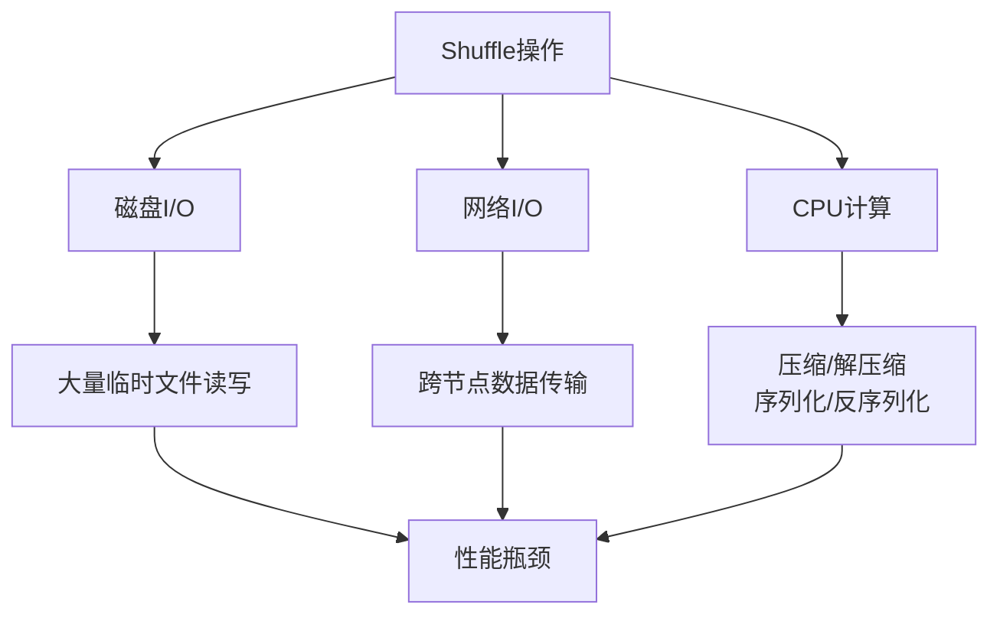
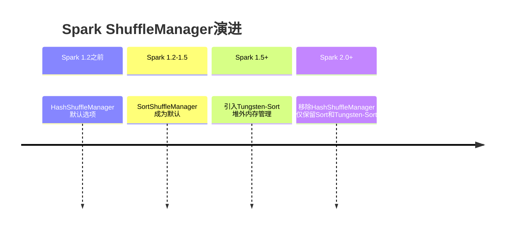
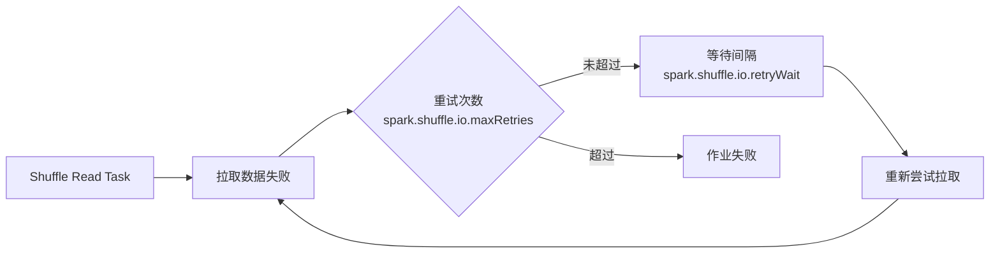
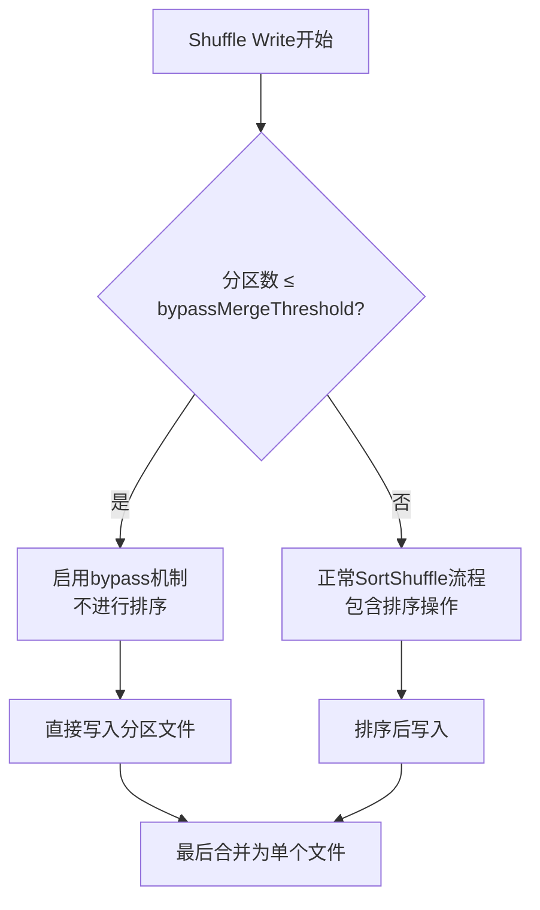
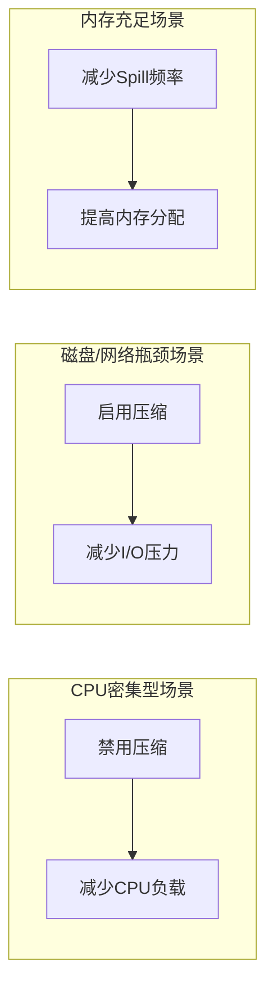

## 1. Shuffle的本质与性能挑战

在分布式计算框架中，Shuffle是一个不可避免的核心操作。当数据分布在不同的节点上时，每个节点计算一部分数据，但最终结果需要汇聚各个节点的计算结果。这个过程就产生了Shuffle——将数据重新分布和重组的过程。

### 1.1 为什么Shuffle不可避免？

1. **数据分布特性**：大数据集通常分布在多个节点上
2. **计算依赖**：后续计算需要前驱阶段的所有数据
3. **结果汇聚**：分布式计算的最终结果需要集中汇总

### 1.2 Shuffle的性能瓶颈

Shuffle操作会带来显著的性能开销，主要包括：



**主要性能消耗来源**：
- **磁盘I/O**：Shuffle过程中产生大量临时文件
- **网络I/O**：数据在不同Executor间传输
- **CPU计算**：压缩、解压缩、序列化、反序列化操作
- **内存消耗**：数据排序、聚合等操作需要大量内存

## 2. ShuffleManager类型与演进

### 2.1 ShuffleManager的发展历程



### 2.2 当前可用的ShuffleManager类型

在Spark 3.x中，`spark.shuffle.manager`参数有以下选项：

| 类型 | 说明 | 适用场景 |
|------|------|----------|
| `sort` | 默认的SortShuffleManager，会对数据进行排序 | 大多数场景，特别是需要排序的业务 |
| `tungsten-sort` | 使用Tungsten计划的堆外内存管理机制 | 内存使用效率要求高的场景 |

**源码示例**（Spark 3.x版本）：
```scala
// SparkEnv.scala中的相关配置
val shortShuffleMgrNames = Map(
  "sort" -> classOf[org.apache.spark.shuffle.sort.SortShuffleManager].getName,
  "tungsten-sort" -> classOf[org.apache.spark.shuffle.sort.SortShuffleManager].getName
)

val shuffleMgrName = conf.get("spark.shuffle.manager", "sort")
val shuffleMgrClass = shortShuffleMgrNames.getOrElse(
  shuffleMgrName.toLowerCase(Locale.ROOT), 
  shuffleMgrName
)
```

### 2.3 调优建议

1. **默认使用SortShuffleManager**：大多数情况下使用默认配置即可
2. **Tungsten-Sort慎用**：虽然内存效率更高，但需要确保环境兼容性
3. **避免不必要的排序**：如果业务逻辑不需要排序，可通过bypass机制优化

## 3. Shuffle压缩配置优化

### 3.1 压缩的重要性

在大型集群中，Shuffle过程会产生巨大的网络传输量。压缩可以显著减少网络开销，但会增加CPU负担。

**相关参数**：
- `spark.shuffle.compress`：是否压缩mapper端的输出（默认：true）
- `spark.io.compression.codec`：压缩编解码器选择

### 3.2 压缩编解码器对比

| 编解码器 | Spark 2.2+默认 | 压缩率 | 压缩速度 | CPU消耗 |
|----------|----------------|--------|----------|---------|
| `lz4` | ✅ 是 | 中等 | 非常快 | 低 |
| `lzf` | ❌ 否 | 较高 | 快 | 中等 |
| `snappy` | ❌ 否 | 较低 | 非常快 | 很低 |

**Spark 3.x默认配置**：
```scala
// CompressionCodec.scala中的配置
private val shortCompressionCodecNames = Map(
  "lz4" -> classOf[LZ4CompressionCodec].getName,
  "lzf" -> classOf[LZFCompressionCodec].getName,
  "snappy" -> classOf[SnappyCompressionCodec].getName
)

val DEFAULT_COMPRESSION_CODEC = "lz4"  // Spark 3.x默认使用lz4
```

### 3.3 调优实践

1. **网络带宽有限时**：启用压缩（`spark.shuffle.compress=true`）
2. **CPU成为瓶颈时**：考虑禁用压缩
3. **根据数据特性选择编解码器**：
   - 文本数据：使用`lzf`获得更高压缩率
   - 二进制数据：使用`lz4`平衡速度与压缩率

## 4. Shuffle文件与缓冲区优化

### 4.1 文件缓冲区配置

`spark.shuffle.file.buffer`参数控制Shuffle Write Task的缓冲区大小：

```scala
// ShuffleExternalSorter.java中的配置读取
this.fileBufferSizeBytes = (int) conf.getSizeAsKb("spark.shuffle.file.buffer", "32k") * 1024;
```

**调优建议**：
- **默认值**：32KB（考虑最小硬件部署）
- **内存充足时**：增加到64KB或128KB
- **性能提升**：合理调节可获得1%~5%的性能提升

### 4.2 内存分配优化

`spark.shuffle.memoryFraction`参数控制Executor内存中分配给Shuffle Read Task进行聚合操作的比例：

**计算公式**：
```
可用Shuffle内存 = 系统总内存 × spark.shuffle.memoryFraction × spark.shuffle.safetyFraction
```

**默认配置**：
- `spark.shuffle.memoryFraction`：0.2（20%）
- `spark.shuffle.safetyFraction`：0.8（80%）
- **实际可用**：16%的JVM堆内存

**调优建议**：
1. **内存充足时**：适当提高`spark.shuffle.memoryFraction`
2. **减少Spill频率**：增加Shuffle内存可减少磁盘溢出
3. **监控GC行为**：根据GC情况调整内存分配

## 5. 网络传输与重试机制

### 5.1 网络重试配置

Shuffle过程中网络异常是常见问题，合理的重试机制可提高作业稳定性。

**相关参数**：


**参数说明**：

| 参数 | 默认值 | 说明 | 调优建议 |
|------|--------|------|----------|
| `spark.shuffle.io.maxRetries` | 3 | 最大重试次数 | 大数据量作业建议增加到8-10次 |
| `spark.shuffle.io.retryWait` | 5s | 重试等待间隔 | 网络不稳定时可增加到30-60s |

### 5.2 连接数优化

`spark.shuffle.io.numConnectionsPerPeer`参数控制节点间的并发连接数：

**适用场景**：
- 集群主机数量少但磁盘多
- 需要提高磁盘饱和度的场景
- **默认值**：1（通常足够）

### 5.3 直接缓冲区配置

`spark.shuffle.io.preferDirectBufs`参数控制是否使用堆外内存：

**优势**：
- 减少垃圾回收压力
- 避免缓存复制开销
- **默认值**：true（启用）

**禁用场景**：堆外内存紧张时，可强制使用堆内内存

## 6. 高级调优参数

### 6.1 外部Shuffle服务

External Shuffle Service是长期运行在NodeManager中的辅助服务，可显著提升Shuffle性能。

**配置步骤**：

1. **启用服务**：
```xml
<!-- spark-defaults.conf -->
spark.shuffle.service.enabled true
spark.shuffle.service.port 7337
```

2. **YARN配置**：
```xml
<!-- yarn-site.xml -->
<property>
  <name>yarn.nodemanager.aux-services</name>
  <value>spark_shuffle</value>
</property>
<property>
  <name>yarn.nodemanager.aux-services.spark_shuffle.class</name>
  <value>org.apache.spark.network.yarn.YarnShuffleService</value>
</property>
```

**优势**：
- Executor GC时不影响其他任务
- 减少Executor压力
- 提升任务运行稳定性

### 6.2 Bypass合并阈值

`spark.shuffle.sort.bypassMergeThreshold`参数控制何时绕过排序操作：

**工作机制**：


**调优建议**：
- **默认值**：200
- **不需要排序时**：设置大于Shuffle Read Task数量
- **内存紧张时**：适当降低该值，减少同时打开的文件数

### 6.3 溢出（Spill）配置

Shuffle过程中内存不足时，数据会溢出到磁盘：

**相关参数**：
- `spark.shuffle.spill`：是否启用溢出（默认：true）
- `spark.shuffle.spill.compress`：是否压缩溢出数据

**调优考虑**：


**决策因素**：
1. **CPU vs I/O**：权衡压缩的CPU消耗与I/O节省
2. **数据特性**：根据数据压缩率决定
3. **集群资源**：根据实际硬件条件调整

## 7. 综合调优实践

### 7.1 调优原则

1. **动态调整**：根据业务数据和硬件条件不断测试优化
2. **监控导向**：基于实际运行指标进行调整
3. **平衡取舍**：在CPU、内存、I/O之间找到最佳平衡点

### 7.2 参数调优检查表

| 调优方向 | 关键参数 | 默认值 | 调优建议 |
|----------|----------|--------|----------|
| **Shuffle类型** | `spark.shuffle.manager` | `sort` | 大多数情况使用默认 |
| **压缩优化** | `spark.shuffle.compress` | `true` | 网络瓶颈时启用 |
| **内存分配** | `spark.shuffle.memoryFraction` | `0.2` | 内存充足时适当增加 |
| **文件缓冲** | `spark.shuffle.file.buffer` | `32k` | 增加到64k-128k |
| **网络重试** | `spark.shuffle.io.maxRetries` | `3` | 大数据量时增加到8-10 |
| **绕过排序** | `spark.shuffle.sort.bypassMergeThreshold` | `200` | 无排序需求时调大 |

### 7.3 性能监控指标

1. **Shuffle写入/读取大小**
2. **Spill次数和大小**
3. **GC时间和频率**
4. **网络传输时间**
5. **磁盘I/O吞吐量**

### 7.4 实际调优案例

**场景**：处理上百亿数据的Shuffle作业

**优化措施**：
1. 增加`spark.shuffle.io.maxRetries`到10次
2. 设置`spark.shuffle.io.retryWait`为60s
3. 使用External Shuffle Service
4. 根据数据特性选择合适的压缩编解码器
5. 监控并调整内存分配比例

**效果**：稳定性显著提升，失败率降低90%以上

## 8. Spark 3.x更新说明

### 8.1 已废弃的功能

1. **HashShuffleManager**：在Spark 2.0+版本中已移除
2. **过时的配置项**：部分旧版本参数不再生效

### 8.2 推荐的最佳实践

1. **使用SortShuffleManager**作为默认选择
2. **启用压缩**减少网络传输，除非CPU成为瓶颈
3. **配置External Shuffle Service**提升大型作业稳定性
4. **监控和调整**基于实际运行指标

### 8.3 补充说明：Spark 3.x的改进

Spark 3.x在Shuffle方面进行了多项优化：

1. **更好的内存管理**：Tungsten引擎的持续改进
2. **动态资源分配**：更智能的Executor管理
3. **自适应查询执行**：根据运行时统计信息优化Shuffle
4. **增强的监控**：更详细的Shuffle相关指标

**建议**：始终参考对应Spark版本的官方文档，获取最新的配置建议和最佳实践。