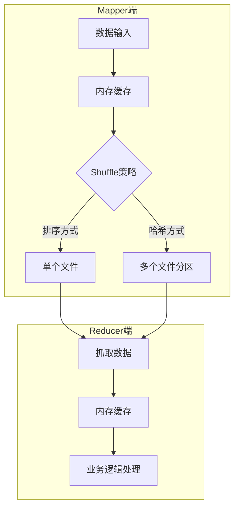
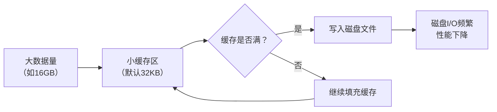
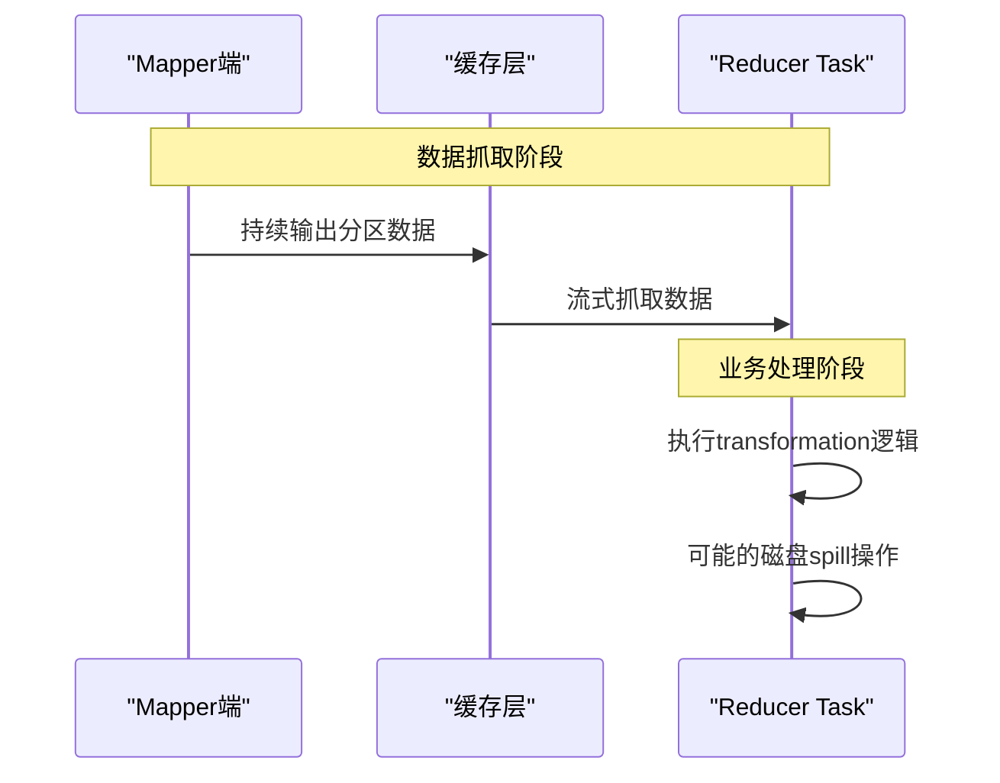
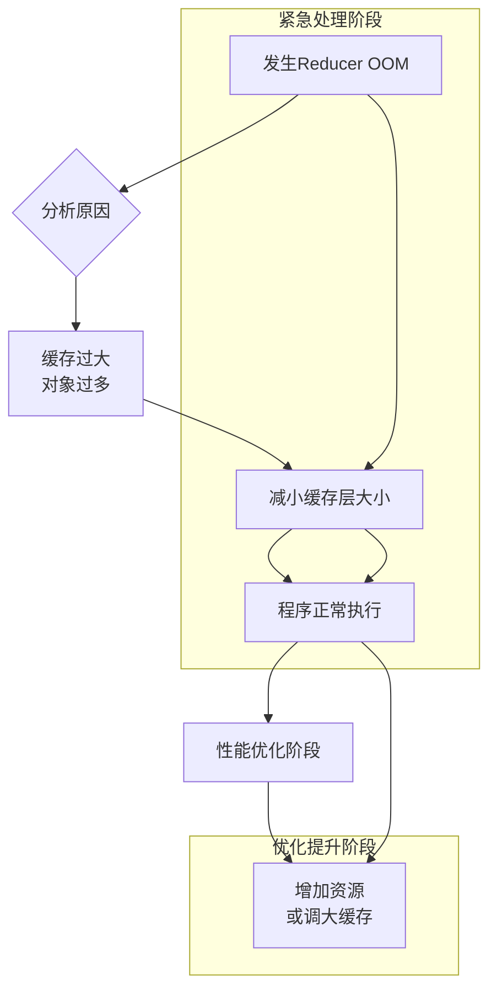
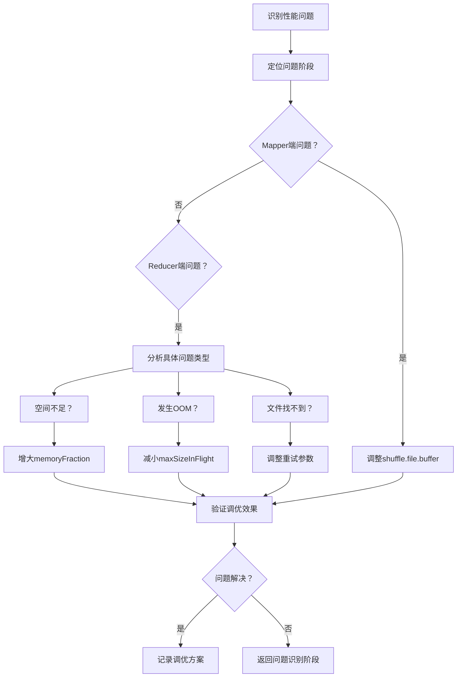

## 引言

在大规模数据处理场景中，Spark的Shuffle操作往往是性能瓶颈的关键所在。Shuffle作为连接Mapper端和Reducer端的桥梁，其内存使用效率直接影响着整个作业的执行性能。理解并优化Shuffle过程中的内存配置，是Spark性能调优的核心技能之一。本文将从Mapper端和Reducer端两个维度，深入剖析内存使用原理并提供实战调优策略。

## 一、Shuffle机制概述

### 1.1 Shuffle的本质

Spark中的Shuffle是一种特殊的依赖关系，其核心特点在于**不确定性依赖**。与普通RDD依赖不同，Shuffle RDD的每个Partition依赖于父RDD的所有Partition，而不是固定的某几个Partition。这种全依赖特性使得数据必须在节点间重新分布，从而产生了网络通信开销。

### 1.2 Shuffle处理流程

整个Shuffle过程可以分为两个主要阶段：



**关键特点**：
- Mapper端将数据按Reducer并行度分区
- 中间数据可能写入磁盘文件
- Reducer端并行抓取各自分区数据
- 采用流式处理模式，边抓取边处理

## 二、Mapper端内存调优

### 2.1 Mapper端内存使用详解

#### 2.1.1 数据处理流程

Mapper端处理数据的基本流程如下：

1. **数据缓存**：Mapper端Task将处理结果暂存在内存缓冲区
2. **文件写入**：根据Reducer端并行度将数据分区写入文件
3. **文件汇报**：向Driver汇报文件位置信息供Reducer抓取

#### 2.1.2 性能瓶颈分析

Mapper端的主要性能瓶颈在于**缓存层与磁盘的频繁交互**：



**问题根源**：
- 数据量（Task数据）与缓存容量不匹配
- 缓存过小导致频繁磁盘读写
- 磁盘I/O成为性能瓶颈

### 2.2 Mapper端内存性能调优实战

#### 2.2.1 调优判断依据

判断Mapper端是否需要调优的关键指标：

| 监控维度 | 关键指标 | 判断标准 |
|---------|---------|---------|
| **日志分析** | 磁盘写入频率 | 频繁的spill操作 |
| **Web UI** | Shuffle Write大小 | 数据量与缓存比例失衡 |
| **执行时间** | Stage持续时间 | 异常延长的Shuffle阶段 |

#### 2.2.2 核心调优参数

**参数：`spark.shuffle.file.buffer`**
- **默认值**：32KB
- **作用**：控制Mapper端写文件时的缓冲区大小
- **调优策略**：
  1. 观察当前作业的Shuffle Write数据量
  2. 按倍数递增测试：64KB → 128KB → 256KB
  3. 监控磁盘I/O变化，找到最佳平衡点

**调优示例**：
```bash
# 启动Spark作业时设置参数
spark-submit \
  --conf spark.shuffle.file.buffer=128k \
  --conf spark.shuffle.spill.compress=true \
  your_application.jar
```

#### 2.2.3 实践建议

1. **基准测试**：先用默认参数运行，记录基准性能
2. **渐进调整**：每次调整一个参数，观察效果
3. **监控验证**：通过Spark Web UI验证调优效果
4. **场景适配**：根据数据特征调整参数
   - 小数据高并发：适当减小缓冲区
   - 大数据低并发：增大缓冲区减少磁盘I/O

## 三、Reducer端内存调优

### 3.1 Reducer端内存使用详解

#### 3.1.1 数据处理流程

Reducer端采用**流式处理模式**，核心流程如下：



#### 3.1.2 潜在问题分析

Reducer端可能出现的两类主要问题：

**问题一：缓存层瓶颈**
- 缓存过小：频繁网络请求，性能下降
- 缓存过大：内存占用高，可能引发OOM

**问题二：业务逻辑空间不足**
- 默认仅分配20%Executor内存给业务逻辑
- 数据溢出到磁盘，性能和安全风险

### 3.2 Reducer端内存性能调优实战

#### 3.2.1 常见问题及解决方案

**问题1：业务逻辑空间不足导致磁盘Spill**

**现象**：
- 频繁的磁盘读写操作
- Task执行时间异常延长
- 可能的数据丢失风险

**调优参数**：`spark.shuffle.memoryFraction`
- **默认值**：0.2（20% Executor内存）
- **调优策略**：
  ```bash
  # 根据Executor配置和并行度调整
  --conf spark.shuffle.memoryFraction=0.3  # 提升到30%
  --conf spark.shuffle.memoryFraction=0.4  # 提升到40%
  ```
- **调整原则**：
  - 并行度越高，单个Task可用内存越少
  - 观察Spill次数，找到最小化溢出的配置

**问题2：Reducer端OOM（内存溢出）**

**根本原因**：
1. 缓存层占用过多内存（默认48MB/Task）
2. 业务逻辑创建大量对象
3. 两者叠加超过可用内存

**调优策略**：**先缩小缓存，让程序跑起来**



**具体操作**：
1. **紧急处理**：减小`spark.reducer.maxSizeInFlight`
   ```bash
   # 从默认48MB减小到24MB
   --conf spark.reducer.maxSizeInFlight=24m
   ```
2. **后续优化**：增加资源后调大缓存
   ```bash
   # 增加Executor内存后，可调大到96MB提升性能
   --conf spark.reducer.maxSizeInFlight=96m
   ```

**问题3：shuffle file not found错误**

**产生原因**：
- Mapper端正在进行GC暂停
- 网络传输线程停止工作
- Reducer端无法在超时时间内获取数据

**默认重试机制**：
```
spark.shuffle.io.maxRetries = 3    # 最大重试次数
spark.shuffle.io.retryWait = 5s    # 每次重试等待时间
总等待时间 = 3 × 5s = 15s
```

**调优方案**：
```bash
# 增加重试次数和等待时间
--conf spark.shuffle.io.maxRetries=30
--conf spark.shuffle.io.retryWait=30s
# 总等待时间延长到15分钟，适应GC暂停
```

#### 3.2.2 综合调优策略

**调优优先级原则**：
1. **稳定性优先**：先保证作业能正常运行
2. **资源优化**：在有限资源内寻找最佳配置
3. **性能提升**：稳定后再追求执行效率

**参数调优对照表**：

| 问题现象 | 核心参数 | 调优方向 | 监控指标 |
|---------|---------|---------|---------|
| 频繁磁盘Spill | `spark.shuffle.memoryFraction` | 增大比例 | Spill次数 |
| Reducer OOM | `spark.reducer.maxSizeInFlight` | 减小缓存 | GC时间、内存使用 |
| 文件找不到 | `spark.shuffle.io.maxRetries` | 增加重试 | Fetch失败次数 |
| 网络超时 | `spark.shuffle.io.retryWait` | 延长等待 | 网络传输时间 |

## 四、实战调优工作流

### 4.1 系统化调优步骤



### 4.2 监控与验证

**关键监控指标**：
1. **Spark Web UI**：
   - Shuffle Read/Write数据量
   - Stage执行时间分布
   - Task失败和重试情况

2. **日志分析重点**：
   - GC日志频率和时长
   - Spill到磁盘的次数和大小
   - Fetch失败和重试记录

3. **性能对比**：
   - 调优前后执行时间对比
   - 磁盘I/O和网络传输量变化
   - 内存使用模式改善情况

## 五、总结与最佳实践

### 5.1 核心调优原则

1. **理解优先于调参**：先分析问题根源，再调整参数
2. **小步快跑**：每次只调整一个参数，观察效果
3. **数据驱动**：基于监控数据做出调优决策
4. **场景适配**：不同数据特征需要不同的优化策略

### 5.2 生产环境建议

**Mapper端调优要点**：
- 大数据作业优先增大缓冲区
- 关注磁盘I/O与内存使用的平衡
- 根据数据倾斜情况调整策略

**Reducer端调优要点**：
- OOM时优先减小缓存而非增加内存
- 合理分配业务逻辑内存占比
- 配置适当的重试机制应对GC暂停

**补充说明**：在实际生产环境中，除了参数调优外，还应考虑：
- 数据分区策略优化
- 序列化方式选择
- 硬件资源配置调整
- 代码层面的优化（如减少Shuffle数据量）

### 5.3 持续优化理念

Spark内存调优不是一次性的任务，而是一个持续的过程。随着数据规模、业务逻辑和集群环境的变化，需要定期重新评估和调整配置。建立性能基准、监控关键指标、形成调优知识库，是保证Spark作业长期高效运行的关键。

---

**文档说明**：本文档基于Spark Shuffle内存调优的实战经验整理，重点关注Mapper端和Reducer端的内存使用原理和调优方法。所有调优建议均需在实际环境中验证，建议在测试环境充分验证后再应用到生产环境。