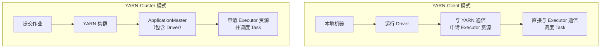
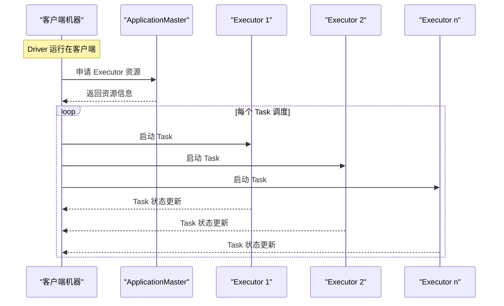

在大数据计算领域，**Spark on YARN** 是工业界广泛采用的部署模式，它结合了 Spark 强大的内存计算能力和 YARN 成熟的资源管理框架。然而，在这种混合架构下，性能调优变得尤为重要且复杂。本文将深入探讨 Spark on YARN 的性能优化策略，涵盖从基础配置到高级调优的各个方面，帮助你构建高效稳定的 Spark 应用。

## 第1章：运行环境 Jar 包管理与数据本地性优化

### 1.1 核心原理与配置

在 YARN 上运行 Spark 应用，首先需要正确配置运行环境：

#### 1.1.1 Jar 包管理优化

为了避免每次启动应用时重复上传 Spark 依赖包，建议将 Jar 包预先上传到 HDFS：

```properties
# 在 spark-defaults.conf 中配置
spark.yarn.jars hdfs://clustername/spark/spark210/jars/*
```

**配置说明**：
- 如果不配置此参数，每次启动时 Driver 会将 `SPARK_HOME` 下的 Jar 包打包上传到各个节点
- 配置后，节点会自动下载并缓存这些 Jar 包，下次启动时直接使用本地缓存
- 缓存清理间隔通过 YARN 参数配置：`yarn.nodemanager.localizer.cache.cleanup.interval-ms`

#### 1.1.2 数据本地性原理

分布式计算的核心原则是 **"移动计算而非移动数据"**。数据本地性级别直接影响计算性能：

| 本地性级别 | 描述 | 性能影响 |
|-----------|------|----------|
| **PROCESS_LOCAL** | 数据与 Task 在同一 Executor 进程中 | ⭐⭐⭐⭐⭐ 最佳 |
| **NODE_LOCAL** | 数据与 Task 在同一节点，不同进程 | ⭐⭐⭐⭐ 较好 |
| **NO_PREF** | 数据无位置偏好 | ⭐⭐⭐ 中等 |
| **RACK_LOCAL** | 数据在同一机架的不同节点 | ⭐⭐ 较差 |
| **ANY** | 数据在不同机架 | ⭐ 最差 |

**优化建议**：
1. 尽量让数据以 `PROCESS_LOCAL` 或 `NODE_LOCAL` 方式读取
2. 对于频繁使用的 RDD，使用 `cache()` 或 `persist()` 缓存到内存
3. 注意缓存是惰性的，需要通过 Action 操作触发

### 1.2 调优实践

#### 1.2.1 本地性等待时间调整

Spark 调度任务时会优先选择最近本地性级别的节点，如果资源不可用，会等待一段时间：

```scala
val sparkConf = new SparkConf()
  .set("spark.locality.wait", "3s")      // 默认所有级别等待时间
  .set("spark.locality.wait.node", "3s")  // 节点本地性等待
  .set("spark.locality.wait.process", "3s") // 进程本地性等待
  .set("spark.locality.wait.rack", "3s")   // 机架本地性等待
```

**调优步骤**：
1. 在 Client 模式下观察日志，查看 Task 的本地化级别
   ```
   17/02/11 21:59:45 INFO scheduler.TaskSetManager: 
   Starting Task 0.0 in Stage 0.0 (TID 0, sandbox, PROCESS_LOCAL, 1260 bytes)
   ```
2. 如果大部分 Task 都是 `NODE_LOCAL` 或 `ANY`，适当增加等待时间
3. 反复调节，观察本地化级别提升和作业运行时间变化
4. 避免过度等待导致作业总时间增加

## 第2章：Spark on YARN 调度模式对比与调优

### 2.1 两种调度模式深度解析

Spark on YARN 支持两种部署模式，核心区别在于 **Driver 的部署位置**：



#### 2.1.1 YARN-Client 模式
- **Driver 位置**：运行在提交应用的客户端机器上
- **ApplicationMaster 角色**：仅负责向 YARN 申请 Executor 资源
- **适用场景**：
  - 开发调试阶段
  - 需要实时查看日志输出
  - 交互式数据分析（如 Spark-Shell）
- **优势**：便于调试，可直接查看完整日志
- **劣势**：Driver 与 Executor 频繁通信可能导致客户端网卡流量激增

#### 2.1.2 YARN-Cluster 模式
- **Driver 位置**：运行在 YARN 集群的 ApplicationMaster 容器中
- **ApplicationMaster 角色**：包含 Driver，负责资源申请和任务调度
- **适用场景**：
  - 生产环境作业提交
  - 长时间运行的批处理作业
  - 不需要实时交互的作业
- **优势**：客户端可断开连接，作业继续运行
- **劣势**：调试不便，日志需要通过 History Server 查看

### 2.2 模式选择与调优建议

#### 2.2.1 资源配置示例

**YARN-Cluster 模式提交作业**：
```bash
$SPARK_HOME/bin/spark-submit \
  --master yarn-cluster \
  --num-executors 4 \
  --executor-cores 3 \
  --class main.class \
  myjar.jar
```

**YARN-Client 模式启动 Spark-Shell**：
```bash
$SPARK_HOME/bin/spark-shell \
  --master yarn-client \
  --num-executors 4 \
  --executor-cores 3
```

#### 2.2.2 常见问题与解决方案

**问题1：资源申请被挂起**
- **现象**：YARN 资源不足时，Spark 申请会等待而非立即失败
- **解决方案**：监控集群资源使用情况，合理设置资源配额

**问题2：Container 内存溢出**
- **现象**：单个 Container 内存不足导致 OOM
- **解决方案**：合理分配 Executor 内存，考虑数据倾斜情况

**问题3：长时间作业内存积累**
- **解决方案**：为 Driver 分配更多内存
  ```bash
  spark-shell --num-executors 8 --executor-cores 5 --driver-memory 2g
  ```

## 第3章：YARN 队列资源不足问题调优

### 3.1 问题原因分析

YARN 队列资源不足可能导致 Spark 应用提交失败，常见场景包括：

1. **资源总量不足**：申请的资源超过队列总配额
   - 例如：队列总资源为 Memory 1000G, Cores 800
   - 申请资源：Memory 900G, Cores 700 → 可能成功
   - 再申请：Memory 500G, Cores 300 → 资源不足，提交失败

2. **瞬时资源竞争**：多个应用同时提交导致资源紧张

### 3.2 调优方案

#### 方案一：线程池控制提交频率
```java
// 在 J2EE 中间层实现
ExecutorService executor = Executors.newFixedThreadPool(1);
// 控制同时只能提交一个 Spark 作业
```

#### 方案二：资源分类调度
- 将作业分为两类：耗时作业（>10min）和快速作业（<2min）
- 使用两个线程池分别管理
- 每个线程池大小设为1，避免资源竞争

#### 方案三：最大化资源利用
- 当只有一个程序运行时，将 Memory 和 Cores 调整到队列允许的最大值
- 优点：快速完成计算，简化集群运维
- 缺点：资源独占，可能影响其他作业

## 第4章：Executor 频繁被杀死问题调优

### 4.1 问题现象与原因

当出现以下异常时，表明 Executor 因内存超限被 YARN 杀死：

```
ExecutorLostFailure (Executor 3 exited caused by one of the running tasks)
Reason: Container killed by YARN for exceeding memory limits. 
52.6 GB of 50 GB physical memory used. 
Consider boosting spark.yarn.executor.memoryOverhead
```

**根本原因**：Executor 实际使用的内存超过了 YARN Container 分配的内存限制。

### 4.2 调优方案

#### 4.2.1 内存优化策略

1. **移除不必要的 RDD 缓存**
   - 检查代码中是否缓存了不必要的中间结果
   - 使用 `unpersist()` 及时释放不再需要的 RDD

2. **调整存储内存比例**
   ```properties
   # 增加存储内存占比（默认0.6）
   spark.storage.memoryFraction=0.7
   ```

3. **增加堆外内存开销**
   ```properties
   # 增加 Executor 的堆外内存开销
   spark.yarn.executor.memoryOverhead=2048  # 单位MB
   ```

#### 4.2.2 内存分配计算示例

假设设置 `spark.executor.memory=10g`，默认 `memoryOverhead=max(384, 0.07 * 10g)=1.07g`，则总内存为：
- 堆内内存：10g
- 堆外内存：1.07g
- **总内存需求**：约11.07g

YARN Container 内存需要设置为至少 11.07g 才能避免被杀死。

## 第5章：YARN-Client 模式网卡流量激增问题

### 5.1 问题根源分析



**问题产生原因**：
1. Driver 运行在本地机器，负责所有 Task 调度
2. 与集群中所有 Executor 频繁通信（Task 启动、状态更新、Shuffle 结果）
3. 大规模作业（如 100 Executor × 1000 Task）会产生海量网络通信
4. 本地机器网卡流量激增，可能影响公司网络

### 5.2 解决方案

#### 5.2.1 环境分离原则
- **测试环境**：使用 YARN-Client 模式
  - 便于查看详细日志
  - 方便调试和性能观察
  - 适合短时间测试

- **生产环境**：必须使用 YARN-Cluster 模式
  - Driver 运行在集群内部
  - 避免客户端网络压力
  - 支持长时间运行作业

#### 5.2.2 运维建议
1. 与 YARN 运维团队协作，监控集群网络状况
2. 考虑使用虚拟网络或专用网络带宽
3. 对于物理机集群，评估网卡流量对整体网络的影响

## 第6章：YARN-Cluster 模式 JVM 栈内存溢出调优

### 6.1 问题原因分析

**现象对比**：
- **YARN-Client 模式**：Driver 使用本地 JVM 配置（PermGen 默认 128MB）
- **YARN-Cluster 模式**：Driver 运行在集群节点，使用默认 JVM 配置（PermGen 默认 82MB）

**根本原因**：Spark SQL 等复杂操作或大量递归调用导致 PermGen 空间不足。

### 6.2 调优方案

#### 6.2.1 JVM 参数调整

在 spark-submit 脚本中增加 PermGen 配置：

```bash
$SPARK_HOME/bin/spark-submit \
  --master yarn-cluster \
  --conf spark.driver.extraJavaOptions="-XX:PermSize=128M -XX:MaxPermSize=256M" \
  --class main.class \
  myjar.jar
```

**参数说明**：
- `-XX:PermSize=128M`：初始永久代大小
- `-XX:MaxPermSize=256M`：最大永久代大小

#### 6.2.2 SQL 优化策略

对于 Spark SQL 作业，如果遇到 JVM 栈溢出：

1. **分解复杂 SQL**：
   ```sql
   -- 优化前：复杂 OR 条件
   SELECT * FROM table 
   WHERE (condition1 OR condition2 OR ... OR condition100)
   
   -- 优化后：分解为多个简单查询
   SELECT * FROM table WHERE condition1
   UNION ALL
   SELECT * FROM table WHERE condition2
   -- ... 以此类推
   ```

2. **避免深度递归**：
   - 使用迭代替代递归
   - 设置递归深度限制

3. **调整 Executor 的 JVM 参数**：
   ```properties
   spark.executor.extraJavaOptions="-XX:PermSize=64M -XX:MaxPermSize=128M"
   ```

## 第7章：综合调优最佳实践

### 7.1 配置优先级总结

Spark 配置参数优先级（从高到低）：
1. **代码中 SparkConf 设置**：最高优先级
2. **spark-submit/spark-shell 命令行参数**
3. **spark-defaults.conf 配置文件**
4. **Spark 默认配置**

### 7.2 生产环境推荐配置

```bash
# 生产环境提交脚本示例
$SPARK_HOME/bin/spark-submit \
  --master yarn-cluster \
  --deploy-mode cluster \
  --driver-memory 4g \
  --executor-memory 8g \
  --num-executors 20 \
  --executor-cores 4 \
  --conf spark.yarn.jars="hdfs://cluster/spark/jars/*" \
  --conf spark.locality.wait=10s \
  --conf spark.yarn.executor.memoryOverhead=2048 \
  --conf spark.driver.extraJavaOptions="-XX:PermSize=256M -XX:MaxPermSize=512M" \
  --queue production \
  --class com.example.MainApp \
  application.jar
```

### 7.3 监控与调优闭环

1. **监控指标**：
   - 作业运行时间
   - 各 Stage 执行时间
   - Task 本地化级别分布
   - Executor 内存使用情况
   - Shuffle 读写数据量

2. **调优流程**：
   ```mermaid
   flowchart TD
       A["识别性能瓶颈"] --> B["制定调优方案"]
       B --> C["应用配置调整"]
       C --> D["运行测试作业"]
       D --> E{"性能提升?"}
       E -->|是| F["记录优化结果"]
       E -->|否| G["分析原因调整方案"]
       G --> C
       F --> H["应用到生产环境"]
   ```

3. **持续优化**：
   - 定期回顾作业性能
   - 随着数据量增长调整资源配置
   - 关注 Spark 新版本特性
   - 建立性能基线，对比优化效果

## 总结

Spark on YARN 的性能调优是一个系统工程，需要从多个维度综合考虑：

1. **资源管理**：合理分配队列资源，避免资源竞争
2. **数据本地性**：优化数据布局，减少网络传输
3. **内存管理**：平衡堆内堆外内存，避免 OOM
4. **模式选择**：根据场景选择 Client 或 Cluster 模式
5. **JVM 调优**：针对具体作业特点调整 JVM 参数

通过系统化的调优，可以显著提升 Spark 作业的执行效率，降低集群资源消耗，构建更加稳定可靠的大数据处理平台。记住，调优不是一次性的工作，而是一个持续改进的过程，需要结合业务发展和数据规模的变化不断优化。