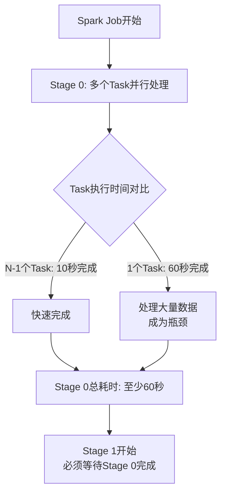
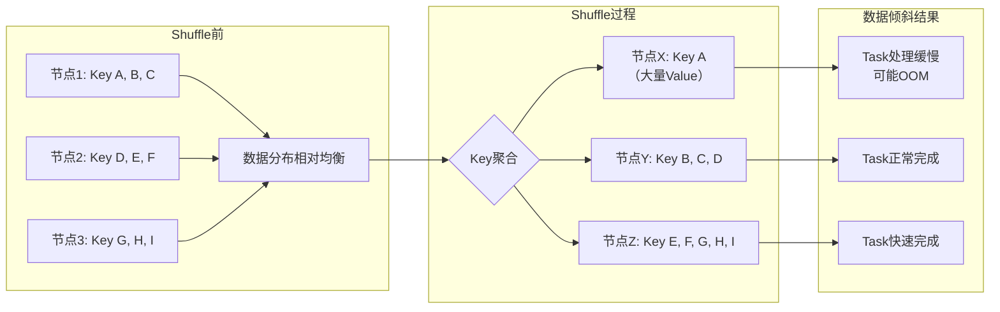
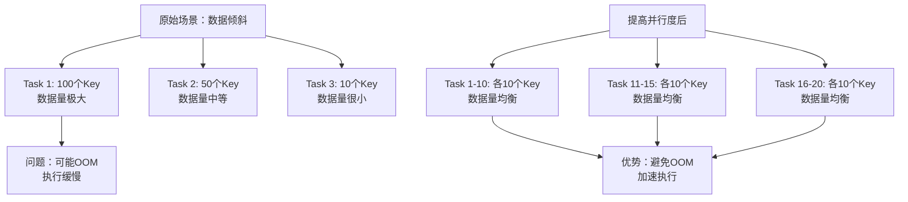
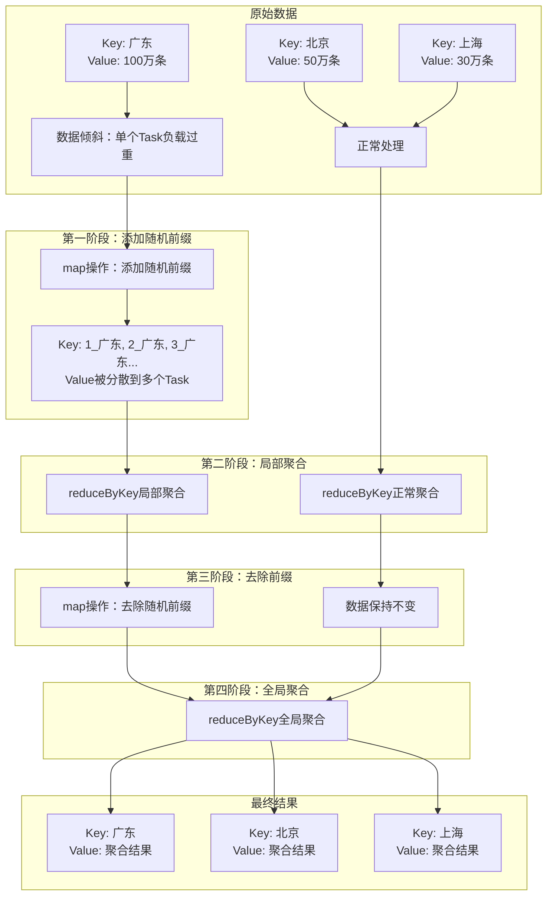

## 引言：为什么数据倾斜是性能杀手？

在分布式大数据处理系统中，数据倾斜是开发者最常遇到且最棘手的性能问题之一。它如同高速公路上的瓶颈路段，即使其他路段畅通无阻，整个系统的吞吐量也会被最拥堵的部分所限制。理解数据倾斜的本质、识别其症状并掌握有效的解决方案，是每个大数据工程师必须掌握的核心技能。

## 1. 什么是数据倾斜？

### 1.1 基本定义

**数据倾斜**是指并行处理数据集的某一部分（如Spark的一个Partition）的数据量显著多于其他部分，从而使得该部分的处理速度成为整个数据集处理的瓶颈。

### 1.2 核心特征

- **个别任务处理大量数据**：符合二八定律，约20%的任务处理80%的数据
- **业务热点问题**：数据分布不均衡通常是现实业务场景的反映
- **Shuffle过程是关键诱因**：数据分配给不同Task时，相同Key的Value过多集中在少数Task

### 1.3 运行机制示例



**关键原理**：一个Stage的耗时主要由最慢的那个Task决定。由于同一个Stage内的所有Task执行相同的计算，在排除计算节点能力差异的前提下，不同Task之间耗时的差异主要由该Task处理的数据量决定。

## 2. 数据倾斜对性能的巨大影响

### 2.1 大数据处理的三大挑战

1. **数据多样化**：结构化和非结构化数据并存
2. **庞大的数据量**：TB甚至PB级别的数据处理
3. **数据的流动性**：从批处理到流处理的演进

### 2.2 数据倾斜的致命后果

#### 2.2.1 内存溢出（OOM）
- **最常见原因**：数据倾斜导致单个Task处理数据量过大
- **后果**：任务失败，需要重试，增加整体处理时间

#### 2.2.2 性能急剧下降
- **典型场景**：原本10分钟可完成的作业，因数据倾斜延长至1小时
- **资源浪费**：大部分计算节点空闲，少数节点超负荷工作

#### 2.2.3 Shuffle过程的放大效应



**Shuffle的代价**：
- 磁盘I/O操作：相同Key写入本地磁盘文件
- 网络传输：拉取各节点上的相同Key
- 内存压力：单个节点处理过多Key可能溢写到磁盘

### 2.3 分布式系统调优的四个方向

| 调优方向 | 具体目标 | 与数据倾斜的关系 |
|---------|---------|----------------|
| **CPU利用率** | 提高并行计算效率 | 数据倾斜导致CPU负载不均衡 |
| **内存管理** | 避免OOM | 数据倾斜是OOM的主要原因 |
| **网络开销** | 减少数据传输 | Shuffle过程中的数据倾斜增加网络负载 |
| **I/O操作** | 减少磁盘读写 | 数据倾斜导致频繁的磁盘溢写 |

## 3. 如何判断和定位数据倾斜

### 3.1 判断数据倾斜的方法

#### 3.1.1 Spark Web UI监控
- **Stages页面**：查看各Stage的运行时间
- **Tasks详情**：对比不同Task的处理数据量和耗时
- **关键指标**：
  - 是否有Task运行时间显著长于其他Task
  - 是否有Task读写数据量异常大
  - 是否某些节点上的Task都运行特别慢

#### 3.1.2 日志分析
- **OOM错误定位**：日志明确显示哪一行代码导致内存溢出
- **Stage识别**：确定数据倾斜发生在哪个Stage
- **Task对比**：发现绝大多数Task很快，个别Task极慢

#### 3.1.3 代码审查
- **重点算子**：检查Join、groupByKey、reduceByKey等Shuffle操作
- **数据特征**：分析Key的分布情况
- **业务逻辑**：理解数据倾斜是否与业务特性相关

### 3.2 定位数据倾斜的步骤

1. **监控观察**：通过Spark UI发现异常Task
2. **日志分析**：确定具体错误位置和原因
3. **代码走读**：定位可能产生倾斜的Shuffle操作
4. **数据采样**：分析Key的数据分布特征

## 4. 数据倾斜解决方案之一：源数据预处理

### 4.1 适用场景分析

**核心思想**：从数据层面而非技术层面解决倾斜问题。当数据倾斜源于少数几个Key的Value过多，且这些Key不影响业务计算时，可以采用此方案。

**典型场景**：
- 无效Key数据（-1值、null值等）过多
- 业务热点Key（如特定用户、特定商品）导致倾斜
- Hive表中已存在数据分布不均衡

### 4.2 原理剖析

通过过滤掉导致倾斜的Key，使剩余Key的Value分布相对均衡，从而避免Shuffle过程中的数据倾斜。

**Spark 3.x filter算子示例**：
```scala
// 过滤掉可能导致数据倾斜的Key
val filteredRDD = originalRDD.filter {
  case (key, value) =>
    // 过滤条件：排除null、空值或特定倾斜Key
    key != null && 
    !key.toString.isEmpty && 
    !skewedKeys.contains(key)
}

// 或者使用Spark SQL的where子句
spark.sql("""
  SELECT * FROM source_table 
  WHERE key IS NOT NULL 
    AND key != '-1' 
    AND key != 'skewed_key'
""")
```

### 4.3 实施方法

#### 4.3.1 使用Hive ETL预处理
```sql
-- 在Hive中提前处理数据倾斜
CREATE TABLE cleaned_table AS
SELECT 
  key,
  value,
  COUNT(*) OVER (PARTITION BY key) as key_count
FROM source_table
WHERE key IS NOT NULL 
  AND key != 'skewed_key'
HAVING key_count < 1000000; -- 过滤掉Value过多的Key
```

**优势**：
- 将数据倾斜问题提前到上游解决
- 减少Spark作业的Shuffle压力
- 适用于周期性批处理场景

#### 4.3.2 使用Spark SQL动态过滤
```scala
// 方法1：直接过滤
val skewedKeys = spark.sql("""
  SELECT key, COUNT(*) as cnt
  FROM source_table
  GROUP BY key
  HAVING cnt > 1000000
""").collect().map(_.getString(0)).toSet

val broadcastSkewedKeys = spark.sparkContext.broadcast(skewedKeys)

val cleanedDF = sourceDF.filter(!col("key").isin(broadcastSkewedKeys.value.toSeq: _*))

// 方法2：采样分析后过滤
val sampleDF = sourceDF.sample(0.1) // 10%采样
val keyDistribution = sampleDF.groupBy("key").count().orderBy(desc("count"))

// 识别并过滤倾斜Key
val topKeys = keyDistribution.limit(10).collect().map(_.getString(0)).toSet
val finalDF = sourceDF.filter(!col("key").isin(topKeys.toSeq: _*))
```

### 4.4 注意事项

1. **业务影响评估**：确保过滤的Key不影响最终计算结果
2. **过滤阈值设定**：需要根据数据特征动态调整
3. **监控过滤效果**：验证过滤后数据分布是否均衡

## 5. 数据倾斜解决方案之二：提高并行度

### 5.1 适用场景分析

**核心思想**：通过增加并行度，将原本由单个Task处理的大量数据分散到多个Task中。

**适用条件**：
- 数据倾斜不是特别严重
- 有足够的计算资源支持更多并行任务
- Task的数据量可以通过增加分区数来均衡

### 5.2 原理剖析



**Spark 3.x中设置并行度的方法**：

```scala
// 方法1：在reduceByKey等算子中直接指定分区数
val rdd1 = inputRDD.reduceByKey(_ + _, 1000) // 设置1000个分区

// 方法2：使用repartition调整分区
val rdd2 = inputRDD.repartition(1000)

// 方法3：使用coalesce合并分区（减少Shuffle）
val filteredRDD = largeRDD.filter(...)
val coalescedRDD = filteredRDD.coalesce(100) // 减少分区数，避免过多小任务

// 方法4：配置全局默认并行度
spark.conf.set("spark.default.parallelism", 1000)
```

### 5.3 并行度控制详解

#### 5.3.1 Spark分区机制

| 操作类型 | 分区数决定方式 | 示例 |
|---------|--------------|------|
| **读取外部数据** | 根据数据源大小自动推导 | HDFS文件的每个block对应一个分区 |
| **map类操作** | 继承父RDD的分区数 | map、filter等操作不改变分区数 |
| **reduce类操作** | 可指定或使用默认值 | reduceByKey(_, 1000)指定1000个分区 |

#### 5.3.2 并行度最佳实践

1. **设置原则**：并行度 = 集群总CPU Core数 × 2～3倍
   - 例如：400个Core，设置800-1200个Task
   
2. **分区大小**：每个分区约128MB为宜
   - 过大：可能导致OOM
   - 过小：任务调度开销大

3. **动态调整**：
   ```scala
   // 根据数据量动态计算合适的分区数
   val inputSizeMB = sparkContext.getRDDStorageInfo.map(_.memSize).sum / (1024 * 1024)
   val optimalPartitions = math.max(1, (inputSizeMB / 128).toInt)
   
   val optimizedRDD = inputRDD.repartition(optimalPartitions)
   ```

### 5.4 案例实战

```scala
// 场景：电商用户行为分析，按用户ID聚合
val userActions = spark.read.parquet("hdfs://user_actions.parquet")

// 问题：少数活跃用户产生大量数据，导致数据倾斜
val skewedAggregation = userActions
  .groupBy("user_id")
  .agg(count("*").as("action_count"))
  // 默认并行度可能不足，导致倾斜

// 解决方案：增加并行度
val optimizedAggregation = userActions
  .repartition(1000, col("user_id"))  // 按user_id重分区，增加并行度
  .groupBy("user_id")
  .agg(count("*").as("action_count"))

// 写入结果
optimizedAggregation.write.parquet("hdfs://aggregation_result.parquet")
```

### 5.5 注意事项

1. **资源平衡**：并行度增加需要更多计算资源
2. **小文件问题**：分区过多可能导致输出文件过小
3. **Shuffle开销**：repartition会产生Shuffle，需要权衡利弊
4. **监控调整**：根据实际运行情况动态调整并行度

## 6. 数据倾斜解决方案之三：随机Key双重聚合

### 6.1 什么是随机Key双重聚合

**随机Key双重聚合**是一种分而治之的技术，通过对Key添加随机前缀将倾斜的Key分散到多个Task中处理，再进行全局聚合。

**两阶段过程**：
1. **第一次聚合（局部聚合）**：为每个Key添加随机前缀，执行reduceByKey
2. **第二次聚合（全局聚合）**：去掉随机前缀，再次执行reduceByKey

### 6.2 适用场景分析

**最适合的场景**：
- 单个RDD的reduceByKey、groupByKey操作
- 某些Key的Value特别多，导致数据倾斜
- 需要保留所有数据，不能过滤Key

**典型示例**：电商广告点击按省份统计
- 原始Key：省份（如"广东"、"北京"）
- 倾斜问题：某些省份点击量极大
- 解决方案：为省份添加随机前缀分散处理

### 6.3 原理剖析



### 6.4 案例实战

```scala
// 场景：统计各省份广告点击量，存在数据倾斜
val provinceClicks = spark.read.parquet("hdfs://clicks_by_province.parquet")

// 原始方法（可能产生数据倾斜）
val skewedResult = provinceClicks
  .map(row => (row.getString(0), 1L))  // (province, 1)
  .reduceByKey(_ + _)  // 按省份统计点击量

// 使用随机Key双重聚合解决数据倾斜
val optimizedResult = provinceClicks
  .map(row => (row.getString(0), 1L))  // (province, 1)
  // 第一步：添加随机前缀（0-9）
  .map { case (province, count) =>
    val randomPrefix = (math.random * 10).toInt
    (s"${randomPrefix}_$province", count)
  }
  // 第二步：第一次聚合（局部聚合）
  .reduceByKey(_ + _, 100)  // 增加并行度
  // 第三步：去除随机前缀
  .map { case (prefixedKey, count) =>
    val province = prefixedKey.split("_")(1)
    (province, count)
  }
  // 第四步：第二次聚合（全局聚合）
  .reduceByKey(_ + _)

// 优化：使用广播变量控制随机前缀范围
val numPrefixes = 10  // 使用10个随机前缀
val prefixes = spark.sparkContext.broadcast((0 until numPrefixes).toArray)

val furtherOptimized = provinceClicks
  .mapPartitions { iter =>
    val localPrefixes = prefixes.value
    iter.map { row =>
      val province = row.getString(0)
      val randomPrefix = localPrefixes((math.random * numPrefixes).toInt)
      (s"${randomPrefix}_$province", 1L)
    }
  }
  .reduceByKey(_ + _, numPrefixes * 10)  // 分区数 = 前缀数 × 10
  .map { case (prefixedKey, count) =>
    val province = prefixedKey.split("_")(1)
    (province, count)
  }
  .reduceByKey(_ + _)
```

### 6.5 详细执行流程示例

假设原始数据分布：
```
Partition 1: (广东, 1), (广东, 1), (广东, 1), (北京, 1)
Partition 2: (广东, 1), (上海, 1), (上海, 1)
```

**执行步骤**：

1. **添加随机前缀**（假设使用前缀0-2）：
   ```
   Partition 1: (0_广东, 1), (1_广东, 1), (2_广东, 1), (0_北京, 1)
   Partition 2: (1_广东, 1), (0_上海, 1), (1_上海, 1)
   ```

2. **第一次reduceByKey**（局部聚合）：
   ```
   Task 1: (0_广东, 1), (0_北京, 1), (0_上海, 1) → 聚合后: (0_广东, 1), (0_北京, 1), (0_上海, 1)
   Task 2: (1_广东, 2), (1_上海, 1) → 聚合后: (1_广东, 2), (1_上海, 1)
   Task 3: (2_广东, 1) → 聚合后: (2_广东, 1)
   ```

3. **去除随机前缀**：
   ```
   (0_广东, 1) → (广东, 1)
   (0_北京, 1) → (北京, 1)
   (0_上海, 1) → (上海, 1)
   (1_广东, 2) → (广东, 2)
   (1_上海, 1) → (上海, 1)
   (2_广东, 1) → (广东, 1)
   ```

4. **第二次reduceByKey**（全局聚合）：
   ```
   (广东, 1), (广东, 2), (广东, 1) → (广东, 4)
   (北京, 1) → (北京, 1)
   (上海, 1), (上海, 1) → (上海, 2)
   ```

### 6.6 注意事项

1. **随机前缀数量的选择**：
   ```scala
   // 根据数据倾斜程度动态决定前缀数量
   def determineNumPrefixes(skewFactor: Double): Int = {
     // skewFactor = 最大Key的Value数 / 平均Value数
     math.min(100, math.max(2, (skewFactor / 10).toInt))
   }
   ```

2. **性能权衡**：
   - 优点：有效解决严重数据倾斜
   - 缺点：需要两次Shuffle，增加计算开销

3. **适用限制**：
   - 主要适用于单个RDD的聚合操作
   - 对于两个RDD的Join操作，需要其他方案配合
   - 随机前缀可能影响数据顺序

4. **Spark 3.x优化建议**：
   ```scala
   // 使用AQE（自适应查询执行）优化
   spark.conf.set("spark.sql.adaptive.enabled", "true")
   spark.conf.set("spark.sql.adaptive.coalescePartitions.enabled", "true")
   spark.conf.set("spark.sql.adaptive.skewJoin.enabled", "true")
   
   // AQE可以自动检测和处理数据倾斜
   // 对于随机Key双重聚合，AQE可以进一步优化执行计划
   ```

## 7. 总结与最佳实践

### 7.1 数据倾斜处理策略选择

| 解决方案 | 适用场景 | 优点 | 缺点 |
|---------|---------|------|------|
| **源数据预处理** | 倾斜Key可以过滤<br>Hive ETL可提前处理 | 从根本上解决问题<br>减少Shuffle开销 | 可能丢失数据<br>需要上游配合 |
| **提高并行度** | 轻度到中度数据倾斜<br>资源充足 | 实现简单<br>可与其他方案结合 | 可能产生小文件<br>资源消耗增加 |
| **随机Key双重聚合** | 严重数据倾斜<br>不能过滤Key | 有效分散倾斜负载<br>保留所有数据 | 两次Shuffle开销<br>实现较复杂 |

### 7.2 Spark 3.x数据倾斜处理最佳实践

1. **监控先行**：始终通过Spark UI监控作业执行情况
   ```scala
   // 启用详细监控
   spark.conf.set("spark.eventLog.enabled", "true")
   spark.conf.set("spark.eventLog.dir", "hdfs://spark-events")
   ```

2. **AQE智能优化**：充分利用Spark 3.x的自适应特性
   ```scala
   // 启用所有AQE优化
   spark.conf.set("spark.sql.adaptive.enabled", "true")
   spark.conf.set("spark.sql.adaptive.coalescePartitions.enabled", "true")
   spark.conf.set("spark.sql.adaptive.coalescePartitions.minPartitionNum", "1")
   spark.conf.set("spark.sql.adaptive.advisoryPartitionSizeInBytes", "128MB")
   spark.conf.set("spark.sql.adaptive.skewJoin.enabled", "true")
   spark.conf.set("spark.sql.adaptive.skewJoin.skewedPartitionFactor", "5")
   spark.conf.set("spark.sql.adaptive.skewJoin.skewedPartitionThresholdInBytes", "256MB")
   ```

3. **分层处理策略**：
   ```scala
   def handleDataSkewness(df: DataFrame, keyColumn: String): DataFrame = {
     // 第一步：尝试提高并行度
     val repartitionedDF = df.repartition(1000, col(keyColumn))
     
     // 第二步：如果仍然倾斜，使用随机Key双重聚合
     val aggregatedDF = if (detectSkewness(repartitionedDF, keyColumn)) {
       applyTwoPhaseAggregation(repartitionedDF, keyColumn)
     } else {
       repartitionedDF.groupBy(keyColumn).agg(...)
     }
     
     aggregatedDF
   }
   ```

4. **数据采样与分析**：
   ```scala
   // 在作业开始前分析数据分布
   def analyzeKeyDistribution(df: DataFrame, keyColumn: String): Unit = {
     val sampleRate = 0.01 // 1%采样
     val sampleDF = df.sample(sampleRate)
     
     val distribution = sampleDF
       .groupBy(keyColumn)
       .count()
       .orderBy(desc("count"))
       .limit(20) // 查看前20个最多的Key
     
     distribution.show()
     
     // 计算倾斜度
     val stats = sampleDF
       .groupBy(keyColumn)
       .count()
       .select(
         avg("count").as("avg_count"),
         stddev("count").as("stddev_count"),
         max("count").as("max_count")
       )
     
     val skewFactor = stats.select(col("max_count") / col("avg_count")).first().getDouble(0)
     println(s"数据倾斜因子: $skewFactor")
   }
   ```

### 7.3 未来趋势与建议

1. **Spark 3.x新特性利用**：
   - **自适应查询执行（AQE）**：自动优化执行计划，处理数据倾斜
   - **动态分区裁剪**：减少不必要的数据读取
   - **查询编译优化**：提升代码执行效率

2. **多方案组合应用**：
   ```scala
   // 综合解决方案示例
   def comprehensiveSkewHandling(inputDF: DataFrame): DataFrame = {
     // 1. 过滤明显无效数据
     val filteredDF = inputDF.filter(col("key").isNotNull && col("key") =!= "")
     
     // 2. 采样分析数据分布
     val skewAnalysis = analyzeSkewness(filteredDF)
     
     // 3. 根据倾斜程度选择策略
     skewAnalysis.skewLevel match {
       case "low" =>
         // 轻度倾斜：提高并行度
         filteredDF.repartition(200, col("key"))
           .groupBy("key").agg(...)
       
       case "medium" =>
         // 中度倾斜：随机Key双重聚合
         applyTwoPhaseAggregation(filteredDF, "key")
       
       case "high" =>
         // 重度倾斜：多级处理
         val stage1 = filteredDF
           .filter(!isExtremeSkewKey(col("key")))  // 过滤极端倾斜Key
           .groupBy("key").agg(...)
         
         val stage2 = filteredDF
           .filter(isExtremeSkewKey(col("key")))   // 单独处理极端倾斜Key
           .transform(applyTwoPhaseAggregation(_, "key"))
         
         stage1.union(stage2)
     }
   }
   ```

3. **持续监控与调优**：
   - 建立数据倾斜预警机制
   - 定期分析作业执行历史
   - 根据业务增长调整参数配置

数据倾斜是分布式系统永恒的挑战，但随着Spark 3.x等现代计算框架的发展，我们拥有了更多强大的工具来应对这一问题。关键在于深入理解业务数据特征，结合多种技术手段，建立系统化的监控和优化流程，才能在面对海量数据时保持系统的高性能与稳定性。