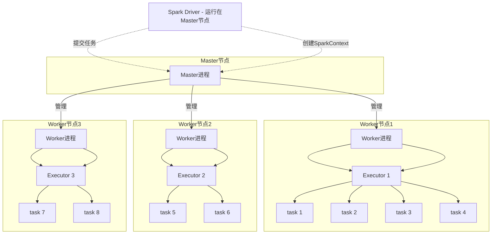

# 第2章 Spark系统部署与应用运行的基本流程

本章首先介绍Spark的安装部署与系统架构，然后通过一个简单的Spark应用例子简介Spark应用运行的基本流程，最后讨论Spark的编程模型。Spark应用运行的详细流程将在之后的章节中详细讨论。

## 2.1 Spark安装部署

在运行Spark应用之前，我们首先要在集群上安装部署Spark。Spark官网[68]上提供了多个版本，包括Standalone、Mesos、YARN和Kubernetes版本。这几个版本的主要区别在于：Standalone版本的资源管理和任务调度器由Spark系统本身负责，其他版本的资源管理和任务调度器依赖于第三方框架，如YARN可以同时管理Spark任务和Hadoop MapReduce任务。为了方便探讨和理解Spark本身的系统结构和运行原理，我们选择Standalone版本安装。这里选择Spark-2.4.3版本安装部署在9台机器上，1台机器作为Master节点，8台机器作为Worker节点。由于官网和一些博客已经提供了详细的Spark安装过程，这里不再赘述。虽然Spark的版本在不断更新中，但其设计原理变化不大，因此本书的分析具有一定的通用性。

> [!NOTE] 配置注意事项
> 在安装时需要配置很多资源信息，包括CPU、内存等，在接下来的章节中会有一些涉及。读者如果想详细了解各种配置参数的含义，可以参考官网上的配置说明。另外，如果没有集群环境，但是想运行Spark用户代码，则可以直接下载IntelliJ IDEA集成开发环境，在IDEA中通过Maven包管理工具添加Spark包（Package），然后直接编写Spark用户代码，并通过local（本地）模式运行。与集群版Spark的区别是，所有的Spark任务和main()函数等都运行在本地，没有网络交互等。

## 2.2 Spark系统架构

如第1章所介绍，与Hadoop MapReduce的结构类似，Spark也采用Master-Worker结构。如果一个Spark集群由4个节点组成，即1个Master节点和3个Worker节点，那么在部署Standalone版本后，Spark部署的系统架构图如图2.1所示。简单来说，Master节点负责管理应用和任务，Worker节点负责执行任务。

**图2.1 Spark部署的系统架构图**



我们接下来先介绍Master节点和Worker节点的具体功能，然后介绍一些Spark系统中的基本概念，以及一些实现细节。

### Master节点和Worker节点的职责

- **Master节点**上常驻Master进程。该进程负责管理全部的Worker节点，如将Spark任务分配给Worker节点，收集Worker节点上任务的运行信息，监控Worker节点的存活状态等。
- **Worker节点**上常驻Worker进程。该进程除了与Master节点通信，还负责管理Spark任务的执行，如启动Executor来执行具体的Spark任务，监控任务运行状态等。

启动Spark集群时（使用Spark部署包中`start-all.sh`脚本），Master节点上会启动Master进程，每个Worker节点上会启动Worker进程。启动Spark集群后，接下来可以提交Spark应用到集群中执行，如用户可以在Master节点上使用：

```bash
./bin/spark-submit --class org.apache.spark.examples.SparkPi --master spark://master:7077 examples/jars/spark-examples_2.11-2.4.3.jar 10
```

来提交一个名为SparkPi的应用。Master节点接收到应用后首先会通知Worker节点启动Executor，然后分配Spark计算任务（task）到Executor上执行，Executor接收到task后，为每个task启动1个线程来执行。这里有几个概念需要解释一下。

### Spark系统核心概念

- **Spark application**，即Spark应用，指的是1个可运行的Spark程序，如`WordCount.scala`，该程序包含main()函数，其数据处理流程一般先从数据源读取数据，再处理数据，最后输出结果。同时，应用程序也包含了一些配置参数，如需要占用的CPU个数，Executor内存大小等。用户可以使用Spark本身提供的数据操作来实现程序，也可以通过其他框架（如Spark SQL）来实现应用，Spark SQL框架可以将SQL语句转化成Spark程序执行。

- **Spark Driver**，也就是Spark驱动程序，指实际在运行Spark应用中main()函数的进程，官方解释是“The process running the main() function of the application and creating the SparkContext”，如运行SparkPi应用main()函数而产生的进程被称为SparkPi Driver。在图2.1中，运行在Master节点上的Spark应用进程（通常由SparkSubmit脚本产生）就是Spark Driver，Driver独立于Master进程。如果是YARN集群，那么Driver也可能被调度到Worker节点上运行。另外，也可以在自己的PC上运行Driver，通过网络与远程的Master进程连接，但一般不推荐这样做，一个原因是需要本地安装一个与集群一样的Spark版本，另一个原因是自己的PC一般和集群不在同一个网段，Driver和Worker节点之间的通信会很慢。简单来说，我们可以在自己的IntelliJ IDEA中运行Spark应用，IDEA会启动一个进程既运行应用程序的main()函数，又运行具体计算任务task，即Driver和task共用一个进程。

- **Executor**，也称为Spark执行器，是Spark计算资源的一个单位。Spark先以Executor为单位占用集群资源，然后可以将具体的计算任务分配给Executor执行。由于Spark是由Scala语言编写的，Executor在物理上是一个JVM进程，可以运行多个线程（计算任务）。在Standalone版本中，启动Executor实际上是启动了一个名叫`CoarseGrainedExecutorBackend`的JVM进程。之所以起这么长的名字，是为了不与其他版本中的Executor进程名冲突，如Mesos、YARN等版本会有不同的Executor进程名。Worker进程实际只负责启停和观察Executor的执行情况。

- **task**，即Spark应用的计算任务。Driver在运行Spark应用的main()函数时，会将应用拆分为多个计算任务，然后分配给多个Executor执行。task是Spark中最小的计算单位，不能再拆分。task以线程方式运行在Executor进程中，执行具体的计算任务，如map算子、reduce算子等。由于Executor可以配置多个CPU，而1个task一般使用1个CPU，因此当Executor具有多个CPU时，可以运行多个task。例如，在图2.1中Worker节点1有8个CPU，启动了2个Executor，每个Executor可以并行运行4个task。Executor的总内存大小由用户配置，而且Executor的内存空间由多个task共享。

### 直观类比理解Master、Worker、Driver、Executor、task的关系

如果上述解释不够清楚，那么我们可以用一个直观例子来理解Master、Worker、Driver、Executor、task的关系。例如，一个农场主（Master）有多片草场（Worker），农场主要把草场租给3个牧民来放马、牛、羊。假设现在有3个项目（application）需要农场主来运作：第1个牧民需要一片牧场来放100匹马，第2个牧民需要一片牧场来放50头牛，第3个牧民需要一片牧场来放80只羊。每个牧民可以看作是一个Driver，而马、牛、羊可以看作是task。为了保持资源合理利用、避免冲突，在放牧前，农场主需要根据项目需求为每个牧民划定可利用的草场范围，而且尽量让每个牧民在每个草场都有一小片可放牧的区域（Executor）。在放牧时，每个牧民（Driver）只负责管理自己的动物（task），而农场主（Master）负责监控草场（Worker）、牧民（Driver）等状况。

### Spark为什么让task以线程方式运行而不以进程方式运行

回到Spark技术点讨论，这里有个问题是Spark为什么让task以线程方式运行而不以进程方式运行。在Hadoop MapReduce中，每个map/reduce task以一个Java进程（命名为Child JVM）方式运行。这样的好处是task之间相互独立，每个task独享进程资源，不会相互干扰，而且监控管理比较方便，但坏处是task之间不方便共享数据。例如，当同一个机器上的多个map task需要读取同一份字典来进行数据过滤时，需要将字典加载到每个map task进程中，则会造成重复加载、浪费内存资源的问题。另外，在应用执行过程中，需要不断启停新旧task，进程的启动和停止需要做很多初始化等工作，因此采用进程方式运行task会降低执行效率。为了数据共享和提高执行效率，Spark采用了以线程为最小的执行单位，但缺点是线程间会有资源竞争，而且Executor JVM的日志会包含多个并行task的日志，较为混乱。更多关于内存资源管理和竞争的问题将在后续章节进行阐述。

### 图2.1中的实现细节

在图2.1中还有一些实现细节：

- 每个Worker进程上存在一个或者多个ExecutorRunner对象。每个ExecutorRunner对象管理一个Executor。Executor持有一个线程池，每个线程执行一个task。
- Worker进程通过持有ExecutorRunner对象来控制`CoarseGrainedExecutorBackend`进程的启停。
- 每个Spark应用启动一个Driver和多个Executor，每个Executor里面运行的task都属于同一个Spark应用。

## 2.3 Spark应用例子

了解了Spark的系统部署之后，我们接下来先给出一个Spark应用的例子，然后通过分析该应用的运行过程来学习Spark框架是如何运行应用的。

### 2.3.1 用户代码基本逻辑

我们以Spark自带的example包中的`GroupByTest.scala`为例，这个应用模拟了SQL中的GroupBy语句，也就是将具有相同Key的`<Key, Value>` record（其简化形式为`<K, V>` record）聚合在一起。输入数据由GroupByTest程序自动生成，因此需要提前设定需要生成的`<K, V>` record个数、Value长度等参数。假设在Master节点上提交运行GroupByTest，具体参数和执行命令如下：

```bash
./bin/spark-submit --class org.apache.spark.examples.GroupByTest --master spark://master:7077 --num-executors 2 --executor-cores 4 --executor-memory 512m examples/jars/spark-examples_2.11-2.4.3.jar 3 4 1000 2
```

该命令启动GroupByTest应用，该应用包括3个map task，每个task随机生成4个`<K, V>` record，record中的Key从[0,1,2,3]中随机抽取一个产生，每个Value大小为1000 byte。由于Key是随机产生的，具有重复性，所以可以通过GroupBy将具有相同Key的record聚合在一起，这个聚合过程最终使用2个reduce task并行执行。这里虽然指定生成3个map task，但需要注意的是我们一般不需要在编写应用时指定map task的个数，因为map task的个数可以通过“输入数据大小/每个分片大小”来确定。例如，HDFS上的默认文件block大小为128MB，假设我们有1GB的文件需要处理，那么系统会自动算出需要启动1GB/128MB=8个map task。reduce task的个数一般在使用算子时通过设置partition number来间接设置。更多的例子会在第3章中看到，我们这里主要关注应用的基本运行流程。

GroupByTest具体代码如下，为了方便阅读和调试进行了一些简化。

```scala
import org.apache.spark.sql.SparkSession
import scala.util.Random

object GroupByTest {
  def main(args: Array[String]) {
    val spark = SparkSession.builder.appName("GroupByTest").getOrCreate()
    val sc = spark.sparkContext

    val numMappers = if (args.length > 0) args(0).toInt else 3
    val numKVPairs = if (args.length > 1) args(1).toInt else 4
    val valSize = if (args.length > 2) args(2).toInt else 1000
    val numReducers = if (args.length > 3) args(3).toInt else 2

    val pairs1 = sc.parallelize(0 until numMappers, numMappers)
                  .flatMap { p =>
                    val ranGen = new Random
                    val arr1 = new Array[(Int, Array[Byte])](numKVPairs)
                    for (i <- 0 until numKVPairs) {
                      val byteArr = new Array[Byte](valSize)
                      ranGen.nextBytes(byteArr)
                      arr1(i) = (ranGen.nextInt(4), byteArr)
                    }
                    arr1
                  }.cache()

    println("pairs1.count() = " + pairs1.count())

    val results = pairs1.groupByKey(numReducers)

    println("results.count() = " + results.count())

    spark.stop()
  }
}
```

阅读代码后，对照GroupByTest代码和图2.2，我们分析一下代码的具体执行流程。

**图2.2 GroupByTest应用的计算逻辑图**

```mermaid
graph LR
    subgraph 阶段1: map side
        A["[0,1,2] (输入Scala数组)"] --> B["parallelize(3 partitions)"]
        B --> C["flatMap: 每个partition生成4个<K,V>"]
        C --> D["pairs1 (MapPartitionsRDD) - 3 partitions, cached"]
    end
    subgraph Stage 2: action 1
        D --> E[count()]
        E --> F["结果=12"]
    end
    subgraph Stage 3: reduce side
        D --> G["groupByKey(2 partitions)"]
        G --> H["results (ShuffledRDD) - 2 partitions"]
    end
    subgraph Stage 4: action 2
        H --> I[count()]
        I --> J["结果=4"]
    end
```

**代码执行流程分析：**

1. **初始化SparkSession**：这一步主要是初始化Spark的一些环境变量，得到Spark的一些上下文信息`sparkContext`，使得后面的一些操作函数（如`flatMap()`等）能够被编译器识别和使用，这一步同时创建GroupByTest Driver，并初始化Driver所需要的各种对象。
2. **设置参数**：`numMappers=3`，`numKVPairs=4`，`valSize=1000`，`numReducers=2`。
3. 使用`sparkContext.parallelize(0 until numMappers, numMappers)`将[0,1,2]划分为3份，也就是每一份包含一个数字`p={p=0, p=1, p=2}`。接下来`flatMap()`的计算逻辑是对于每一个数字p（如p=0），生成一个数组arr1：`Array[(Int, Byte[])]`，数组长度为`numKVPairs=4`。数组中的每个元素是一个`(Int, Byte[])`对，其中Int为[0,3]上随机生成的整数，Byte[]是一个长度为1000的数组。因为p只有3个值，所以该程序总共生成3个arr1数组，被命名为`pairs1`，`pairs1`被声明为需要缓存到内存中。
4. 接下来执行一个action()操作`pairs1.count()`，来统计`pairs1`中所有arr1中的元素个数，执行结果应该是`numMappers * numKVPairs = 3 × 4 = 12`。这一步除了计算count结果，还将每个`pairs1`中的3个arr1数组缓存到内存中，便于下一步计算。需要注意的是，缓存操作在这一步才执行，因为`pairs1`实际在执行action()操作后才会被生成，这种延迟（lazy）计算的方式与普通Java程序有所区别。action()操作的含义是触发Spark执行数据处理流程、进行计算的操作，即需要输出结果，更详细的含义将在下一章中介绍。
5. 执行完`pairs1.count()`后，在已经被缓存的`pairs1`上执行`groupByKey()`操作，`groupByKey()`操作将具有相同Key的`<Int, Byte[]>` record聚合在一起，得到`<Int, list(Byte[1000], Byte[1000], ..., Byte[1000])>`，总的结果被命名为`results`。Spark实际在执行这一步时，由多个reduce task来完成，reduce task的个数等于`numReducers`。
6. 最后执行`results.count()`，`count()`将results中所有record个数进行加和，得到结果4，这个结果也是`pairs1`中不同Key的总个数。

### Spark编程与普通语言编程的区别

在探讨GroupByTest应用如何在Spark中执行前，我们先思考一下使用Spark编程与使用普通语言（如C++/Java/Python）编写数据处理程序的不同。使用普通语言编程使用普通语言编程时，处理的数据在本地，程序也在本地进程中运行，我们可以随意定义变量、函数、控制流（分支、循环）等，编程灵活、受限较少，且程序按照既定顺序执行、输出结果。在Spark程序中，首先要声明SparkSession的环境变量才能够使用Spark提供的数据操作，然后使用Spark操作来定义数据处理流程，如`flatMap(func).groupByKey()`。此时，我们只是定义了数据处理流程，而并没有让Spark真正开始计算，就像在一个画布上画出了数据处理流程，包括哪些数据处理步骤，这些步骤如何连接，每步的输入和输出是什么（如`flatMap()`中的`=>`）。至于这些步骤和操作如何在系统中并行执行，用户并不需要关心。这有点像SQL语言，只需要声明想要得到的数据（`select`，`where`），以及如何对这些数据进行操作（`GroupBy`，`join`），至于这些操作如何实现，如何被系统执行，用户并不需要关心。在Spark中，唯一需要注意声明的数据处理流程在使用action()操作时，Spark才真正执行处理流程，如果整个程序没有action()操作，那么Spark并不会执行数据处理流程。在普通程序中，程序一步步按照顺序执行，并没有这个限制。Spark这样做与其需要分布式运行有关，更详细的内容在后续章节中介绍。

### 2.3.2 逻辑处理流程

了解了Spark应用的计算逻辑后，我们接下来研究Spark应用如何执行的问题。正如第1章介绍的，Spark的实际执行流程比用户想象的要复杂，需要先建立DAG型的逻辑处理流程（Logical plan），然后根据逻辑处理流程生成物理执行计划（Physical plan），物理执行计划中包含具体的计算任务（task），最后Spark将task分配到多台机器上执行。

为了获得GroupByTest的逻辑处理流程，我们可以使用`toDebugString()`方法来打印出`pairs1`和`results`的产生过程，进而分析GroupByTest的整个逻辑处理流程。在这之前，我们先分析GroupByTest产生的job个数。由于GroupByTest进行了两次action()操作：`pairs1.count()`和`results.count()`，所以会生成两个Spark作业（job），如图2.3所示。接下来，我们分析`pairs1`和`results`的产生过程，即这两个job是如何产生的。

**图2.3 GroupByTest应用生成的两个job**

```mermaid
graph TD
    subgraph Job 1: pairs1.count()
        A[ParallelCollectionRDD] --> B[MapPartitionsRDD (pairs1)]
        B --> C[Count action]
        C --> D[结果: 12]
    end
    subgraph Job 2: results.count()
        B --> E[ShuffledRDD (results)]
        E --> F[Count action]
        F --> G[结果: 4]
    end
```

**1. `pairs1.toDebugString()`的执行结果**

第一行的"(3) MapPartitionsRDD[1]"表示的是`pairs1`，即`pairs1`的类型是MapPartitions-RDD，编号为[1]，共有3个分区（partition），这是因为`pairs1`中包含了3个数组。由于设置了`pairs1.cache`，所以`pairs1`中的3个分区在计算时会被缓存，其类型是CachedPartitions。那么`pairs1`是怎么生成的呢？我们看到描述"MapPartitionsRDD[1] at flatMap at GroupByTest.scala:41"，即`pairs1`是由`flatMap()`函数生成的，对照程序代码，可以发现确实是`input.parallelize().flatMap()`生成的。接着出现了"ParallelCollectionRDD[0]"，根据描述是由`input.parallelize()`函数生成的，编号为[0]，因此，我们可以得到结论：`input.parallelize()`得到一个ParallelCollectionRDD，然后经过`flatMap()`得到`pairs1`：MapPartitionsRDD。

**2. `results.toDebugString()`的执行结果**

同样，第1行的"(2) ShuffledRDD[2]"表示的是`results`，即`results`的类型是ShuffledRDD，由`groupByKey()`产生，共有两个分区（partition），这是因为在`groupByKey()`中，设置了`partition number = numReducers = 2`。接着出现了"MapPartitionsRDD [1]"，这个就是之前生成的`pairs1`。接下来的ParallelCollectionRDD由`input.parallelize()`生成。

我们可以将上述过程画成逻辑处理流程图，如图2.4所示。

**图2.4 GroupByTest的逻辑处理流程图**

```mermaid
graph LR
    subgraph 数据源
        A["[0,1,2] (Scala数组)"]
    end
    subgraph RDD链
        B["ParallelCollectionRDD[0] (3 partitions)"]
        B -->|flatMap| C["MapPartitionsRDD[1] (pairs1) (3 partitions) [Cached]"]
        C -->|groupByKey(numReducers=2)| D["ShuffledRDD[2] (results) (2 partitions)"]
    end
    subgraph Action 1
        C -->|count| E["结果=12"]
    end
    subgraph Action 2
        D -->|count| F["结果=4"]
    end
```

图2.4展示了从input到最终结果的数据处理流程，即需要进行哪些操作，生成哪些中间数据，以及这些数据间的关联关系。Spark在执行到action()操作时，会根据程序中的数据操作，自动生成这样的数据流程图，这里我们根据图2.4进一步解释GroupByTest生成的两个job，并探讨其中涉及的概念。

**第1个job，即`pairs1.count()`的执行流程如下所述：**

- `input`是输入一个`[0,1,2]`的普通Scala数组。
- 执行`input.parallelize()`操作产生一个ParrallelCollectionRDD，共3个分区，每个分区包含一个整数p。这一步的重要性在于将input转化成Spark系统可以操作的数据类型ParrallelCollectionRDD。也就是说，input数组仅仅是一个普通的Scala变量，并不是Spark可以并行操作的数据类型。在对input进行划分后生成了ParrallelCollectionRDD，这个RDD是Spark可以识别和并行操作的类型。可以看到input没有分区概念，而ParrallelCollectionRDD可以有多个分区，分区的意义在于可以使不同的task并行处理这些分区。RDD（Resilient Distributed Datasets）的含义是“并行数据集的抽象表示”，实际上是Spark对数据处理流程中形成的中间数据的一个抽象表示或者叫抽象类（abstract class），这个类就像一个“分布式数组”，包含相同类型的元素，但元素可以分布在不同机器上。例如，ParrallelCollectionRDD中的每个元素是一个整数，这些元素具有3个分区，最多可以分布在3台机器上。RDD还有一些其他特性，如不可变性（immutable），这些特性会在后续章节中介绍。
- 在ParrallelCollectionRDD上执行`flatMap()`操作，生成MapPartitionsRDD，该RDD同样包含3个分区，每个分区包含一个通过`flatMap()`代码生成的arr1数组。
- 执行`pairs1.count()`操作，先在MapPartitionsRDD的每个分区上进行`count()`，得到部分结果，然后将结果汇总到Driver端，在Driver端进行加和，得到最终结果。
- 由于MapPartitionsRDD被声明要缓存到内存中，因此这里将里面的分区都换成了黄色表示。缓存的意思是将某些可以重用的输入数据或中间计算结果存放到内存中，以减少后续计算时间。

**第2个job，即`results.count()`的执行流程如下所述：**

- 在已经被缓存的MapPartitionsRDD上执行`groupByKey()`操作，产生了另外一个名为ShuffledRDD的中间数据，也就是`results`，产生这个RDD的原因会在后面章节中讨论。这里我们将ShuffledRDD换了一种颜色表示，是因为ShuffledRDD与MapPartitionsRDD具有不同的分区个数，这样MapPartitionsRDD与ShuffledRDD之间的分区关系就不是一对一的，而是多对多的了，是多对多关系的原因会在后续章节中讨论。
- ShuffledRDD中的数据是MapPartitionsRDD中数据聚合的结果，而且在不同的分区中具有不同Key的数据。
- 执行`results.count()`，首先在ShuffledRDD中每个分区上进行`count()`的运算，然后将结果汇总到Driver端进行加和，得到最终结果。

经过以上分析，我们会有很多疑问，如RDD到底是一个什么概念？为什么要引入RDD？为什么会产生各种不同的RDD，如ParrallelCollectionRDD、MapPartitionsRDD？这些RDD之间又有什么区别？为什么RDD之间的依赖关系有一对一、多对多，等等？这些问题我们将会在后续章节中详细解释。

这里我们只关心一个问题：有了这个逻辑处理流程图是不是就可以执行计算任务，算出结果了？答案是否定的，这个逻辑处理流程图只是表示输入/输出、中间数据，以及它们之间的依赖关系，并不涉及具体的计算任务。当然，我们可以简单地将每一个数据操作，如`map()`、`flatMap()`、`groupByKey()`、`count()`，都作为一个计算任务，但是执行效率太低、内存消耗大，而且可靠性低。我们在第4章会详细分析该方案的问题。接下来，我们分析一下Spark是怎么根据逻辑处理流程图生成物理执行计划，进而得到计算任务的。

### 2.3.3 物理执行计划

在分析了 GroupByTest 应用的逻辑处理流程后，我们明白该处理流程图表示的是输入/输出、中间数据及其之间的依赖关系，而不是计算任务的执行图。那么 Spark 是如何执行这个处理流程，即如何生成具体执行任务的呢？

Spark 采用的方法是根据数据依赖关系，将逻辑处理流程（Logical plan）转化为物理执行计划（Physical plan），包括执行阶段（stage）和执行任务（task）。具体包括以下 3 个步骤：

1.  **首先确定应用会产生哪些作业（job）。** 在 GroupByTest 中，有两个 `count()` 的 `action()` 操作，因此会产生两个 job。
2.  **其次根据逻辑处理流程中的数据依赖关系，将每个 job 的处理流程拆分为执行阶段（stage）。** 如图 2.4 所示，在 GroupByTest 中，job 0 中的两个 RDD 虽然是独立的，但这两个 RDD 之间的数据依赖是一对一的关系。因此，如图 2.5 所示，可以将这两个 RDD 放在一起处理，形成一个 stage，编号为 stage 0。在 job 1 中，MapPartitionsRDD 与 ShuffledRDD 之间是多对多的关系，Spark 将这两个 RDD 分别处理，形成两个执行阶段 stage 0 和 stage 1。为什么这样拆分，以及对于一般的应用怎么拆分，将在后续章节中详细介绍。
3.  **最后，对于每一个 stage，根据 RDD 的分区个数确定执行的 task 个数和种类。** 对于 GroupByTest 应用来说，job 0 中的 RDD 包含 3 个分区，因此形成 3 个计算任务（task）。如图 2.5 所示，首先，每个 task 从 input 中读取数据，进行 `flatMap()` 操作，生成一个 arr1 数组，然后，对该数组进行 `count()` 操作得到结果 4，完成计算。最后，Driver 将每个 task 的执行结果收集起来，加和计算得到结果 12。对于 job 1，其中 stage 0 只包含 MapPartitionsRDD，共 3 个分区，因此生成 3 个 task。每个 task 从内存中读取已经被缓存的数据，根据这些数据 Key 的 Hash 值将数据写到磁盘中的不同文件中，这一步是为了将数据分配到下一个阶段的不同 task 中。接下来的 stage 1 只包含 ShuffledRDD，共两个分区，也就是生成两个 task，每个 task 从上一阶段输出的数据中根据 Key 的 Hash 值得到属于自己的数据。图 2.5 中，stage 1 中的第 1 个 task 只获取并处理 Key 为 0 和 2 的数据，第 2 个 task 只获取并处理 Key 为 1 和 3 的数据。从 stage 0 到 stage 1 的数据分区和获取的过程称为 **Shuffle 机制**，也就是数据经过了混洗、重新分配，并且从一个阶段传递到了下一个阶段。关于 Shuffle 机制如何设计和实现将在后续章节中介绍。stage 1 中的 task 将相同 Key 的 record 聚合在一起，统计 Key 的个数作为 `count()` 的结果，完成计算。Driver 再将所有 task 的结果进行加和输出，完成计算。有关 task 的更多细节，如 task 的种类，将在后续章节中介绍。

> [!figure] 图 2.5 GroupByTest 的物理执行计划
> （图片占位符：展示 job 0 和 job 1 的 stage 划分与 task 执行流程，图中标注了每个 stage 包含的 RDD、分区数、task 数以及 Shuffle 数据流向。）
> [图像 128 on Page 45]

生成执行任务 task 后，我们可以将 task 调度到 Executor 上执行，在同一个 stage 中的 task 可以并行执行。

至此，我们基本明白了 Spark 是如何根据应用程序代码一步步生成逻辑处理流程和物理执行计划的。然而，物理执行计划中还有很多问题我们没有探讨，如：

*   为什么要拆分为执行阶段？
*   如何有一套通用的方法来将任意的逻辑处理流程拆分为执行阶段？
*   task 执行的时候是否会保存每一个 RDD 的中间数据？
*   Shuffle 机制如何实现？

这里我们讨论一下第 1 个问题，其他问题会在后续章节中详细讨论。

**为什么要拆分为执行阶段？**

在 2.3.2 节中我们讨论过，如果将每个操作都当作一个任务，那么效率太低，而且错误容忍比较困难。将 job 划分为执行阶段 stage 后，有以下好处：

1.  **任务大小适中且同构**：stage 中生成的 task 不会太大，也不会太小，而且是同构的，便于并行执行。
2.  **流水线处理提高效率**：可以将多个操作放在一个 task 里处理，使得操作可以进行串行、流水线式的处理，从而提高数据处理效率。
3.  **方便错误容忍**：stage 可以方便错误容忍，如一个 stage 失效，我们可以重新运行这个 stage，而不需要运行整个 job。

在后续章节中，我们将会看到，如果 stage 划分不当，则会带来性能和可靠性的问题。

### 2.3.4 可视化执行过程

我们在 2.3.2 节和 2.3.3 节中分析了 GroupByTest 应用的执行过程，手工画出了该应用的逻辑处理流程和物理执行计划。这个过程费时费力，而且对于更复杂的应用来说，自己画出的逻辑处理流程和物理执行计划不一定正确。那么如何快速获得一个 Spark 应用的逻辑处理流程和物理执行计划呢？答案是根据 Spark 提供的执行界面，即 job UI 来进行分析。

对于 GroupByTest 应用，我们通过分析用户代码可以知道有两个 `action()` 操作，会形成两个 job。我们也可以通过 Spark 的 job UI（应用运行输出提示 Spark UI 地址）看到生成的 job。接下来我们来观察这两个 job 生成的 stage。

**分析 job 0 及其包含的 stage**：单击 job UI 中的“count at GroupByTest.scala：52”进入 Details for job 0 界面。如图 2.6 所示，可以看到 job 0 包含一个 stage，该 stage 执行了两个操作 `parallelize()` 和 `flatMap()`。

> [!figure] 图 2.6 GroupByTest 中 job 0 包含的 stage
> （图片占位符：Spark UI 中 job 0 的 stage 视图，显示一个 stage，包含两个操作）
> [图像 131 on Page 46]

为了进一步分析该 stage 中的数据关联关系和生成的 task，我们可以单击图 2.6 中的“count at GroupByTest.scala：52”进入 Details for stage 0 界面。如图 2.7 所示，发现 stage 0 中包含两个 RDD，`parallelize()` 操作生成了 `ParallelCollectionRDD`，`flatMap()` 操作生成了 `MapPartitionsRDD`，并对该 RDD 进行缓存。**cached** 说明该 RDD 已经被缓存到内存中。这里没有显示这些 RDD 有几个分区，但是我们看到该 stage 有 3 个 task，可以断定分区个数为 3。task 中还有一些属性，如 Attempt、Locality Level、GC Time 等，我们在后续章节中再详细讨论。

> [!figure] 图 2.7 job 0 中 stage 0 的逻辑处理流程和生成的 task
> （图片占位符：stage 0 的 DAG 图，展示两个 RDD 节点，MapPartitionsRDD 标记为 cached；下方表格显示 3 个 task 及其属性）
> [图像 132 on Page 46]

**分析 job 1 及其包含的 stage**：单击 Spark job 页面（见图 2.3）中的“count at GroupByTest.scala：56”进入 Details for job 1 界面。如图 2.8 所示，可以看到 job 1 包含两个 stage，其中 stage 1 执行了两个操作 `parallelize()` 和 `flatMap()`，stage 2 执行了一个操作 `groupByKey()`。

> [!figure] 图 2.8 job 1 中 stage 1 包含的两个 stage
> （图片占位符：Spark UI 中 job 1 的 stage 视图，显示两个 stage）
> [图像 141 on Page 50]

对于 stage 1，单击图 2.8 中的“flatMap at GroupByTest.scala：41”进入 Details for stage 1 界面。如图 2.9 所示，发现 stage 1 中包含的两个 RDD 与上一个 job 中 stage 0 包含的 RDD 相同。与我们在 2.3.2 节中给出的 GroupByTest 的逻辑处理流程图相比，这里多了一个 `ParallelCollectionRDD`。这里多出现一个 RDD 是因为 `paris1: MapPartitionsRDD` 是由 `input.parallelize().flatMap()` 得到的，也就是先生成 `ParallelCollectionRDD`，然后再生成 `MapPartitionsRDD`。在执行 job 1 时，`MapPartitionsRDD` 是已经被缓存的。在真正计算时，`ParallelCollectionRDD` 没有参与计算，因此我们在 2.3.2 节的图 2.4 中没有再次画出 `ParallelCollectionRDD`。假设 `MapPartitionsRDD` 没有被缓存，我们就需要画出 `ParallelCollectionRDD`。

> [!question] 为什么在没有缓存的情况下，第 2 个 job 又从 `ParallelCollectionRDD` 开始计算了呢？
> 这是因为 Spark 需要用户自己设定中间数据是否被缓存，如果没有被缓存，则会利用数据依赖关系计算得到所需数据，即先计算得到 `ParallelCollectionRDD`，再计算得到 `MapPartitionsRDD`。更多的细节将在后续章节中介绍。

> [!figure] 图 2.9 job 1 中 stage 1 的逻辑处理流程和生成的 task
> （图片占位符：stage 1 的 DAG 图，展示两个 RDD 节点，MapPartitionsRDD 标记为 cached；下方表格显示 3 个 task 及其属性，包括 Input Size/Records、Write Time、Shuffle Write Size/Records）
> [图像 146 on Page 52]

对于 stage 1 生成的 task，发现相比 stage 0 和 stage 1 中的 3 个 task 多了 **Input Size/Records**、**Write Time** 和 **Shuffle Write Size/Records** 3 个属性。这是因为：

*   stage 1 中的 task 是从缓存（`MapPartitionsRDD`）中读取数据进行处理的，所以有 Input Size 属性。
*   stage 0 中的 task 是根据数字 `p` 自动生成其他数据的，没有真正的读取动作，所以没有 Input Size。
*   同样，stage 0 中的 task 的结果直接通过网络返回给 Driver 端，没有磁盘写入和 Shuffle 动作，也就没有 Write Time 和 Shuffle Write Size 等属性。
*   前面介绍过，stage 1 中的 task 需要进行 Shuffle，把具有不同 Hash 值的数据 Key 写入不同的磁盘文件中，因而有 Write Time 和 Shuffle Write Size。

对于 stage 2，单击图 2.8 中的“count at GroupByTest.scala：56”进入 Details for stage 2 界面，得到图 2.10。与我们在 2.3.2 节中给出的逻辑处理流程一致，在进行 `groupByKey()` 操作后生成了 `ShuffledRDD`。stage 2 包含两个 task，每个 task 包含一个 **Shuffle Read Size** 的属性，表示从 stage 1 的输出结果中 Shuffle Read 的数据。每个 task 获取了 6 个 record，与我们画出的物理执行计划一致。

> [!figure] 图 2.10 job 1 中 stage 2 的逻辑处理流程和生成的 task
> （图片占位符：stage 2 的 DAG 图，显示 ShuffledRDD 节点；下方表格显示 2 个 task，包含 Shuffle Read Size 属性）
> [图像 150 on Page 53]

至此，我们已经学会利用 Spark 界面给出的图示来分析 Spark 应用的逻辑处理流程和物理执行计划了。与我们在 2.3.2 节和 2.3.3 节中手工画出的图的区别是，Spark 界面给出的图不能展示出每个 RDD 产生的具体数据。为了让读者更容易理解逻辑处理流程图，我们在手工画出的图中加入了每个 RDD 应该会产生的数据，而在实际运行时 Spark 并不关心这些数据具体是什么，也不会存储每个 RDD 中的数据，所以也就无法图示出 RDD 中的数据。当然，我们可以用一些强制输出的办法输出其中我们感兴趣的 RDD 中的数据，具体方法将在后续章节中介绍。

---

### 2.4 Spark 编程模型

在 2.3.1 节中我们讨论了使用 Spark 编程与使用普通 C++/Java/Python 语言编写数据处理程序的不同。这里我们想进一步讨论一下大数据编程模型的演变过程。

2014 年 Google 发表了 [[MapReduce]] 论文，将大数据的编程模型抽象为 **map** 和 **reduce** 阶段，核心是 `map()` 和 `reduce()` 函数。通过组合这两个函数可以完成一大部分的数据处理任务（主要是可以被分治处理的粗粒度任务）。对于用户来说，给定一个数据处理任务，需要解决的问题就是如何设计这两个函数来实现任务。这样的好处是用户并不需要关心系统是怎么分布运行的，而坏处是用户需要按照固定的 map-reduce 计算流程去设计。

对于一个复杂的数据处理流程，也就是一个 workflow，用简单的 `map()`/`reduce()` 函数去实现这个 workflow 会很困难。例如：

*   需要自己设计生成多少个 job，每个 job 只包含 `map()` 函数，还是 `map()` 和 `reduce()` 函数都包含。
*   job 之间的数据如何存放、连接等。
*   例如，为了实现 `join()`，用户需要设计两种 `map()` 函数，一个处理第 1 张表，另一个处理第 2 张表，还需要精心设计 `reduce()` 函数，使得能够分辨来自不同表的数据，进行最后的 `join()`。

总而言之，编程较为困难，就像使用没有库函数的 C 语言来编程。

为了解决这个问题，研究人员的想法是，提供更高层的操作函数来屏蔽 MapReduce 的实现细节。那么如何设计这些高层函数呢？我们通过回想普通语言来研究。例如，Java 是怎么方便编程的？Java 语言通过提供常用的数据结构，如 Array、HashMap 等来方便用户组织数据，并在数据结构上提供常用函数来方便进行数据操作。

根据这个思想，Google 在 MapReduce 编程模型之上设计了 **FlumeJava**，提供了典型数据结构来表示输入/输出和中间数据，如提供的 `PCollection<T>` 类似于 Java 中 `Collection<T>`，提供的 `PTable<T>` 是 `PCollection<T>` 的子类，类似一个二维表。这些数据结构表示了分布在不同机器上的数据。在这些数据结构上提供常见的数据操作，如 `parallelDo()`、`groupByKey()`、`join()` 等。这样，用户在设计数据处理流程时，可以更关注需要多少处理步骤，每一步进行什么样的数据操作及得到什么样的数据，而不是关注怎样用两个函数 `map()` 和 `reduce()` 实现数据处理流程。

微软的研究人员也提出了类似的高层语言 [[DryadLINQ]]，提供 `IEnumerable<T>`、`DryadTable<T>` 等数据结构，以及类似 SQL 的 `select()`、`GroupBy()`、`join()` 等操作。

Spark 借鉴了这两种编程模型，并提出了 [[RDD]] 的数据结构，以及相应的数据操作。我们在下一章将详细讲述该数据结构和常用的数据操作。

---

### 2.5 本章小结

本章首先讨论了 Spark 系统的安装部署、系统架构，以及其中涉及的重要概念。然后，我们通过 Spark 应用例子概览了 Spark 运行应用的整个过程。最后，我们讨论了 Spark 的编程模型。

接下来，我们将在第 3 章中详细讨论 Spark 是如何根据用户代码生成逻辑处理流程的，在第 4 章中详细讨论 Spark 是如何根据逻辑处理流程生成物理执行计划的，其他章节将讨论 Shuffle 机制的具体实现、更复杂的应用，以及缓存与 checkpoint 机制等。