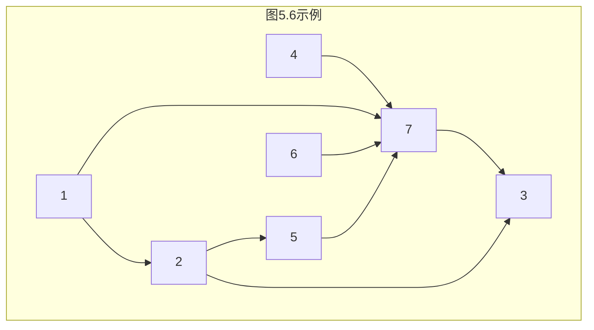
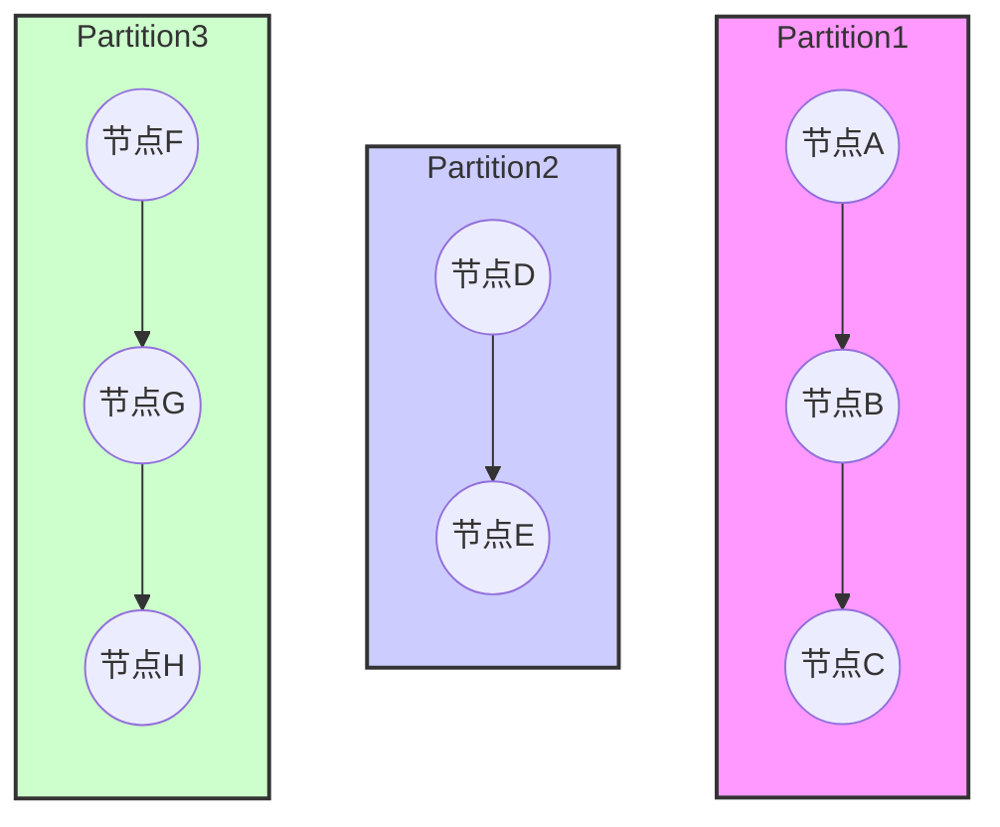
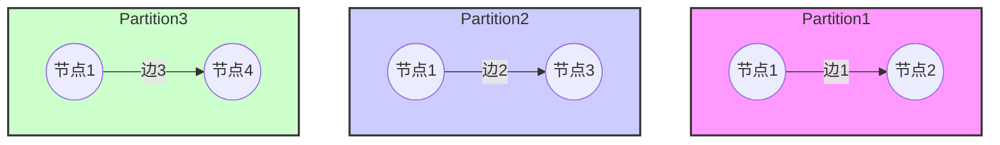
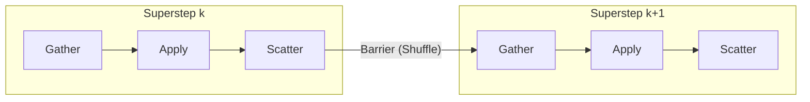

# 第5章 迭代型Spark应用

在第3章和第4章中，我们已经讨论了Spark将应用程序转化为逻辑处理流程和物理执行计划的一般过程。在本章中，将介绍更为复杂的迭代型Spark应用。首先，讨论迭代型Spark应用的分类及特点。然后，通过两个经典的机器学习例子和一个图计算的例子来详细说明迭代型Spark应用的设计和实现原理，具体分为应用描述、算法原理、并行化方法、逻辑处理流程和物理执行计划等方面。另外，我们也会讨论适用于这些应用的高层编程模型。

## 5.1 迭代型Spark应用的分类及特点

迭代型Spark应用是指运行在Spark上，需要进行不断迭代才能得到最终结果的应用。这类应用比普通Spark应用更为复杂。下面，我们将以回答关键问题的方式来介绍迭代型Spark应用的分类及特点。

### （1）迭代型Spark应用有哪些？

迭代型Spark应用主要包括机器学习应用和图计算应用。这两类应用都需要在数据上不断迭代计算、不断更新中间状态，最终达到一个收敛的结果。例如，机器学习应用在训练模型的过程中，需要在训练数据上不断迭代计算、不断更新模型参数，最终使模型的损失函数取得最小值。图计算应用需要在图数据上进行迭代计算，不断更新各个节点的状态，最终达到一个收敛状态。迭代型Spark应用需要在大数据上进行多轮迭代计算，既是数据密集型的也是计算密集型的。

### （2）迭代型应用和非迭代型应用的编程方法有什么不同？

迭代型应用通常与算法结合较为紧密，有固定的计算流程。例如，机器学习应用常常使用梯度下降法来求解目标函数的最小值；图计算应用常常使用消息传播的方法来更新节点状态。针对这些固定的计算流程，系统研究人员设计了相对于MapReduce和RDD数据操作更高层的编程模型，使得算法开发人员可以直接利用这些高层编程模型来编写程序。普通的非迭代型应用往往没有固定的处理流程，所以只能直接依赖底层的RDD、DataFrame数据操作来实现（SparkSQL应用可以使用SQL语言）。

### （3）迭代型应用的逻辑处理流程和物理执行计划与非迭代型应用有哪些不同？

因为迭代型应用包含迭代计算，所以相应的Spark job个数或stage个数一般比非迭代型应用多，而且这些job和stage中很多是重复出现的。另外，在迭代计算的过程中，有些输入数据和中间数据常常是可以重复使用的，因此迭代型应用会比非迭代型应用更多地使用数据缓存。

## 5.2 迭代型机器学习应用SparkLR

### 5.2.1 应用描述

SparkLR是经典机器学习算法[[Logistic Regression]]的Spark分布式版本，可以在Spark项目自带的例子（Spark example包）中找到。Logistic Regression是被广泛使用的分类算法，可以根据带有分类标签的训练数据，迭代训练出一个线性分类模型 $h_w(x)$，用于解决二分类问题。例如，在现实世界中，银行一般根据申请人的特征（年龄、收入、月消费额）来决定是否对其发放信用卡。如果想使审批过程自动化，银行可以根据历史的信用卡审批数据，构建一个Logistic Regression线性分类模型 $h_w(x)$。对于某个新用户，可以将该用户的特征向量 $x_i$ 代入 $h_w(x)$ 模型进行计算，并根据 $h_w(x)$ 的输出结果自动决定是否对其发放信用卡。

下面介绍一下Logistic Regression的数学原理，没有相关背景知识的读者不必担心，这些原理并不是理解SparkLR执行流程的必要基础。

### 5.2.2 算法原理

假设我们拥有一些已审批的银行信用卡数据样本 $\{ (x_1, y_1), (x_2, y_2), \dots, (x_n, y_n) \}$，其中包含 $n$ 个样例，每个样例包含特征向量 $x_i$ 和分类标签 $y_i$。特征向量 $x_i$ 描述客户基本信息，如 $x_i = (年龄,收入,月消费额)$。$y_i$ 取值为 0 或 1，分别代表不发放和发放。Logistic Regression分类模型的数学表达式为 $h_w(x) = \frac{1}{1 + e^{-w^T x}}$，其中 $w$ 是一个参数向量，其值需要对模型不断训练得到。对于每个新样例 $X_i$，将其特征向量 $x_i$ 代入 $h_w(x)$ 后，会得到 $X_i$ 对应的分类结果为 $y_i = 1$ 的概率，如下：

$$
P(y_i = 1 | x_i) = h_w(x_i) = \frac{1}{1 + e^{-w^T x_i}}
$$

当 $X_i$ 的分类类别为 1 的概率超过 50%，即 $h_w(x_i) \ge 0.5$ 时，我们认为应该为 $X_i$ 发放信用卡，反之，不应该为其发放信用卡。这里，读者可能会有两个问题：

1. **为什么 $h_w(x_i)$ 可以得到 $X_i$ 属于类别为 1 的概率？**  
   直观地说，这是因为 $h_w(x_i)$ 是一个[[Sigmoid函数]]。图5.1中 Sigmoid 的值域是 $(0, 1)$，可以用来表示概率，进而可以用于表示 $X_i$ 属于类别为1的概率。确切地说，Logistic Regression模型实际是用线性回归[72]模型逼近样例属于1与样例属于0的概率比值，并且会对这个比值取对数，即

   $$
   \ln \frac{P(y=1|x)}{P(y=0|x)} = w^T x
   $$

   用公式推导可以得到 $P(y=1|x) = \frac{1}{1+e^{-w^T x}}$。

2. **如何训练得到 $w$？**  
   下面我们介绍可以被用来求解 $w$ 的梯度下降法。

想要求解参数向量 $w$，首先需要定义什么样的 $w$ 好呢？直观上来说最能拟合样本数据的 $w$，也就是使得 $h_w(x)$ 对每个训练样例都能正确分类的 $w$ 是好的。然而，当训练样本存在噪声时，无论如何设置 $w$，都有可能产生错误的分类。因此，实际应用中 Logistic Regression 选取 $w$ 的标准是使得 $h_w(x)$ 正确预测每个样例的概率的乘积最大。如果采用形式化表示，就是使得下面的代价函数 $L(w)$ 的值最大。这种方法被称为“最大似然估计”方法。这里 $y_i$ 的取值是 0 或 1。

$$
L(w) = \prod_{i=1}^{n} h_w(x_i)^{y_i} (1 - h_w(x_i))^{1 - y_i}
$$

> **图5.1 Sigmoid函数图**  
> 因为指数形式乘积的值可能会过小，所以我们对函数 $L(w)$ 取对数：

$$
l(w) = \ln L(w) = \sum_{i=1}^{n} \left[ y_i \ln h_w(x_i) + (1 - y_i) \ln (1 - h_w(x_i)) \right]
$$

于是，$w$ 取值的优化目标是使得 $l(w)$ 的值最大。计算 $w$ 的一个直观做法是直接对 $l(w)$ 求导，使得导数等于 0 后，获得 $w$ 的解析解。然而，由于 $l(w)$ 求导后的等式是非线性的（包含指数函数），无法获得 $w$ 的解析解，因此，在实际应用中，Logistic Regression 通常采用下面所述的梯度下降法来求解 $w$。

梯度下降法是一种通过迭代计算来获得代价函数（目标函数）最小值及对应参数的方法。如图5.2所示，其核心思想是从一个随机的初始位置开始，按照函数值下降最快的方向（gradient 梯度方向），不断迭代逼近函数的最小值，从而获得相应的参数值。图5.2中的 $f(w)$ 表示代价函数。当然，梯度下降法可能陷入局部最优，求得的可能是函数的局部最小值，这与初始点的选取、函数的局部最小值的分布等有关。

一般来说，梯度下降法是按下面的两个步骤进行的：

1. 为模型参数向量 $w$ 赋初始值，初始值可以是随机值或全零值。

> **图5.2 梯度下降法图示**

2. 从初始值出发，计算当前位置的代价函数梯度。然后，不断更新 $w$ 的值，使得代价函数值按照梯度下降的方向不断减少，直至收敛。

梯度的确切含义是代价函数对其参数的偏导数，如图5.2中的 $\frac{\partial f}{\partial w}$ 所示。偏导数决定了在训练过程中参数下降的方向。

如何在Logistic Regression中应用梯度下降法呢？对于Logistic Regression来说，需要先将求解函数 $l(w)$ 最大值的问题转变为求解其代价函数 $f(w)$ 最小值的问题，如下将 $l(w)$ 加上负号：

$$
f(w) = -l(w) = - \sum_{i=1}^{n} \left[ y_i \ln h_w(x_i) + (1 - y_i) \ln (1 - h_w(x_i)) \right]
$$

然后，计算 $f(w)$ 相对于参数 $w$ 的梯度，即求 $f(w)$ 相对于 $w$ 在每一维上的梯度。例如，在第 $j$ 维度上 $f(w)$ 相对于 $w$ 的梯度：

$$
\frac{\partial f(w)}{\partial w_j} = \sum_{i=1}^{n} (h_w(x_i) - y_i) x_{ij}
$$

式中，$x_{ij}$ 表示样例 $X_i$ 的第 $j$ 维。求得梯度后，可以用下面的公式来对 $w$ 进行迭代更新：

$$
w_j := w_j - \alpha \frac{\partial f(w)}{\partial w_j}
$$

式中，$\alpha$ 表示学习率，即步长，决定每一轮迭代更新时 $w$ 的变化幅度。如果步长太大，则在模型训练时波动会比较大且容易错过最小值；如果步长太小，则模型训练的收敛速度太慢。在实际应用中，一般让步长随着迭代轮数增加而动态减小[73]，如在Spark中，$\alpha$ 的取值为 $\alpha = \frac{\text{stepSize}}{\sqrt{t}}$，其中 $\text{stepSize}$ 由用户设定，$t$ 表示当前迭代计算的轮数。

基于 $w$ 的迭代公式，我们可以按照梯度下降法对Logistic Regression模型进行迭代训练，基本过程如下：

1. 对模型参数向量 $w$ 进行赋值，可以是全零的向量，也可以是其他任意随机值。
2. 根据当前的 $w$ 值，对每个样例 $X_i = (x_i, y_i)$ 计算其梯度 $\text{gradient}_i$，并累加得到 $\text{gradient} = \sum_{i=1}^{n} \text{gradient}_i$。注意这个计算过程需要用到所有的样例 $X = \{X_1, X_2, \dots, X_n\}$。
3. 使用 $w := w - \alpha \cdot \text{gradient}$ 来更新 $w$。
4. 重复第②步和第③步，直至收敛，即更新后 $w$ 的变化幅度小于一个给定的阈值。

我们可以对照SparkLR的代码来理解上述过程。需要注意的是，SparkLR代码中使用的两个类别标签是 $\{+1, -1\}$ 而不是 $\{0, 1\}$，因此相应的 $h_w(x)$ 及 $w$ 更新公式与 $\{0, 1\}$ 时略有区别。当 $y \in \{+1, -1\}$ 时，$w$ 的更新公式如下，其中 $\alpha$ 固定为 1。

#### SparkLR的示例代码

```scala
// SparkLR示例(简化版)
val points = sc.textFile(...).map(...).cache()
var w = DenseVector.rand(d) // 随机初始化
for (i <- 1 to ITERATIONS) {
  val gradient = points.map { p =>
    val gradient = (1 / (1 + exp(-p.y * (w dot p.x))) - 1) * p.y * p.x
    gradient
  }.reduce(_ + _)
  w -= alpha * gradient
}
println("Final w: " + w)
```

> [!NOTE] 注意  
> 这里展示的SparkLR代码是Logistic Regression的简化实现版本。这里没有按照迭代轮数对步长进行衰减，没有采用任何模型优化措施（如后面将要介绍的正则化方法），也没有迭代终止条件，只是让用户设置迭代轮数。在下一个例子中，我们将详细介绍在Spark MLlib中实现的Logistic Regression完整版。

### 5.2.3 基于Spark的并行化实现

当有大量训练数据时，需要对Logistic Regression模型训练进行并行化。那么，Spark是如何实现Logistic Regression并行化训练的呢？

如5.2.2节所述，Logistic Regression模型的训练过程主要包含两个计算步骤：一是根据训练数据计算梯度，二是更新模型参数向量 $w$。计算梯度（gradient）时需要读入每个样例 $(x_i, y_i)$，代入梯度公式计算，并对计算结果进行加和。由于在计算时每个样例可以独立代入公式，互相不影响，所以我们可以采用“数据并行化”的方法，即将训练样本划分为多个部分，每个task只计算部分样例上的梯度，然后将这些梯度进行加和得到最终的梯度。在更新参数向量 $w$ 时，更新操作可以在一个节点上完成，不需要并行化。

5.2.2节已经给出SparkLR的示例代码，基于示例代码，我们可以画出SparkLR的并行化逻辑处理流程，如图5.3所示。训练数据用 `points: ParallelCollectionRDD` 来表示，参数向量用 `w` 来表示，注意参数向量 $w$ 不是RDD，而只是一个变量。初始化参数向量 $w$ 后，进入迭代计算阶段。SparkLR使用 `map()` 和 `reduce()` 两个操作来完成迭代计算。每轮迭代开始时，Spark首先将 $w$ 广播到所有的task中，每个task使用 `map()` 计算自己接收到的每个 $(x_i, y_i)$ 的梯度 $\text{gradient}_i$。然后，每个task使用 `reduce()` 操作对 $\text{gradient}_i$ 进行本地聚合。在图5.3中，第1个task（如粗箭头所示）执行 `reduce()` 操作，并在本地对3个 $\text{gradient}_i$ 进行聚合计算 $\text{gradient}_{\text{local}} = \sum_{i}\text{gradient}_i$。当每个task执行完成后，Driver端收集所有的 $\text{gradient}_{\text{local}}$ 加和后得到总的梯度 $\text{gradient}$。最后，根据 $w$ 的更新公式，对参数向量 $w$ 进行更新，用于下一轮迭代计算。

> [!INFO] 注意  
> 在本例中使用的 `reduce()` 操作与 `reduceByKey()` 操作不同，`reduce()` 是 action 操作，并不会形成 reduce stage，因此，SparkLR只包含一个不断重复运行的 map stage。

> **图5.3 迭代型机器学习应用SparkLR的并行化逻辑处理流程**

上面我们已经展开讨论了SparkLR的并行化逻辑处理流程，那么，SparkLR在实际运行时生成什么样的job和stage呢？当我们把迭代轮数设为5时，形成的job和stage如图5.4所示。可以看到在这个例子中，SparkLR一共生成了5个job，每个job只包含一个map stage。一个有趣的现象是，第1个job运行需要0.8s（800 ms），而第2个到第5个job只需要56～76 ms。发生这一现象的原因是，SparkLR在第1个job运行时对训练数据（`points: RDD`）进行了缓存，使得后续的job只需要从内存中直接读取数据进行计算即可，这大大减小了数据加载到内存中的开销，从而加速了计算过程。在第7章中我们会详细讨论Spark缓存机制的设计和实现。

> **图5.4 SparkLR产生的job和stage**  
> （图5.4 SparkLR产生的job和stage（续））

最后，我们来看一下SparkLR的输出结果：

```
Final w: [0.123, -0.456, ...]  // 示例输出,实际值取决于数据和迭代
```

在这个例子中，$w$ 是一个10维的向量，被初始化为 -1～1 的随机值，经过5轮迭代计算后，得到最终的 $w$ 值。需要注意的是，在这个例子中，SparkLR没有进行收敛条件检查，所以这里的 `Final w` 不一定是最优结果。

### 5.2.4 深入讨论

作为本章的第1个例子，SparkLR帮助我们理解了如何对迭代型机器学习应用进行并行化实现。然而，如果直接将SparkLR的实现方法应用于大规模数据训练，则还存在不少系统性能问题。

#### （1）数据聚合问题

为了将所有task计算的梯度进行加和，SparkLR使用了 `reduce()` 操作，这个操作需要将所有task的计算结果收集到Driver端进行统一聚合计算。尽管 `reduce()` 操作会提前（在task运行结束前）对每个record对应的梯度进行本地聚合，以减少数据传输量，但如果task过多且每个task本地聚合后的结果（单个gradient）过大，那么统一传递到Driver端仍然会造成单点的网络瓶颈等问题。为了解决这一问题，Spark设计了性能更好的 `treeAgg（2）参数存储问题：在SparkLR例子中，我们将w的维度设置为10，然而在大规模互联网应用中，w的维度可能是千万甚至上亿。这么大的模型参数会导致单点内存瓶颈问题，即在Driver端对w进行存储和计算可能会出现内存溢出、计算时间过长等性能和可靠性问题。为了解决这一问题，学术界和工业界提出了参数服务器[74，75，76]的解决方案。其核心思想是对参数进行划分，将其分布到多个节点上，并通过一定的同步或异步更新协议（如BSP、ASP、SSP等）来对参数进行更新[77]。遗憾的是，Spark目前还没有提供参数服务器的官方实现。如果读者感兴趣，可以通过参考相关论文、CMU的Petuum项目[75]、腾讯的Angel项目[76]等来进一步学习。

## 5.3 迭代型机器学习应用——广义线性模型

实际上，Logistic Regression只是广义线性模型中的一种，我们可以通过改进Logistic Regression的并行化方法来解决更多广义线性模型的并行化问题。什么是广义线性模型？直观上来讲，机器学习中的线性模型是指模型的输入x和输出y之间存在线性关系，如 $y = w^T x$。广义线性模型是对线性模型进行扩展，使输出y的总体均值通过一个非线性函数依赖线性预测值 $w^T x$，如在Logistic Regression中，输出y与线性预测值 $w^T x$ 之间存在非线性关系 $y = \frac{1}{1+e^{-w^T x}}$。广义线性模型的英文名称是Generalized Linear Model（GLM），更确切的定义可以参考文献[78]。

### 5.3.1 算法原理

广义线性模型（GLM）统一了多种线性分类和回归模型，包括用于分类的Logistic Regression、Linear SVM模型，以及用于回归的Linear Regression、Lasso Regression、Ridge Regression模型等。那么，为什么可以将这些模型进行统一呢？原因是这些模型要解决的问题都可以被抽象为一个凸优化问题，而且模型的计算过程基本相同，不同点只是这些模型具有不同的计算函数（代价函数和梯度计算公式）。Spark通过对这些模型的计算过程进行抽象统一，同时支持不同的计算函数，可以实现广义线性模型。在此基础上，通过实现不同的计算函数就可以构建不同的模型。这样可以避免在Spark中实现不同模型算法的重复性。

这里，我们首先介绍广义线性模型的基本数学原理。线性分类和回归问题可以被抽象为一个凸优化问题，即找到一个合适的参数向量 $w$ 来使下面的代价函数 $f(w)$ 最小化：

$$
f(w) = \lambda R(w) + \frac{1}{n} \sum_{i=1}^{n} L(w; x_i, y_i)
$$

$f(w)$ 是一个凸函数，包含两部分 $R(w)$ 和 $L(w; x, y)$。其中，$R(w)$ 是正则化项，用来控制模型的复杂度，避免模型过拟合；$L(w; x, y)$ 是损失函数，用来衡量模型的预测结果与实际结果的差距。$L(w; x, y)$ 可以看作是以 $w^T x$ 和 $y$ 为输入的函数，其中 $w$ 是需要求解的参数向量。$\lambda$ 是一个大于等于零的固定参数，用来调整 $R(w)$ 和 $L(w; x, y)$ 的比例，即决定优化目标是更强调减少模型复杂度的（结构风险最小化）还是更强调减少训练误差（经验风险最小化）的。取较大的 $\lambda$ 值将较大程度约束模型复杂度，反之，更强调减少训练误差。

与在5.2节中介绍的Logistic Regression模型参数的求解方法类似，这里需要计算 $f(w)$ 相对于 $w$ 的梯度。由于 $f(w)$ 包含正则化和损失函数两项，所以这里的梯度包含 $R(w)$ 相对于 $w$ 的梯度 $\text{gradient}_R(w)$，以及 $L(w; x, y)$ 相对于 $w$ 的梯度 $\text{gradient}_L(w)$。

需要注意的是，在计算梯度的过程中，如果 $R(w)$ 或 $L(w; x, y)$ 函数不是在每个点都对 $w$ 可导，就不能采用标准的梯度下降法来求解 $w$，只能采用子梯度下降法[79]来求解 $w$，即采用函数的子梯度来进行梯度下降。相比于标准的梯度下降法，子梯度下降法不能保证每一轮迭代都能使目标函数变小，所以其收敛速度相对较慢。关于子梯度下降法更多的理论知识可以参考Subgradient descent[80]，或者Subgradient Method[81]。这里为了简化讨论，不区分梯度和子梯度，统一使用 $\text{gradient}_R(w)$ 和 $\text{gradient}_L(w)$ 来表示。不同的线性模型使用不同的损失函数和梯度计算公式表示[82]，如表5.1所示。

**表5.1 不同线性模型的损失函数及其梯度计算公式**

| 模型 | 损失函数 $L(w; x, y)$ | 梯度 $\text{gradient}_L(w)$ |
|------|----------------------|---------------------------|
| Logistic Regression | $\log(1 + e^{-y w^T x})$ | $\frac{-y}{1 + e^{y w^T x}} x$ |
| Linear SVM | $\max(0, 1 - y w^T x)$* | $ -y x \text{ if } y w^T x < 1 \text{ else } 0$ |
| Linear Regression | $\frac{1}{2}(y - w^T x)^2$ | $(w^T x - y) x$ |
| Lasso/Ridge Regression | 同上 | 同上 |

*注意：这里采用的两种分类标签是 $y \in \{+1, -1\}$。另外，Hinge loss函数不是在每个点都可导，所以表中的公式是其子梯度计算公式。

同样，不同的线性模型使用的正则化项及其梯度计算公式如表5.2所示。

**表5.2 不同线性模型使用的正则化项及其梯度计算公式**

| 正则化类型 | 正则化项 $R(w)$ | 梯度 $\text{gradient}_R(w)$ |
|------------|----------------|-----------------------------|
| L2 | $\frac{1}{2} \|w\|^2$ | $w$ |
| L1 | $\|w\|_1$ | $\text{sign}(w)$* |
| Elastic net | $\alpha \|w\|_1 + (1-\alpha) \cdot \frac{1}{2} \|w\|^2$ | 组合形式 |

*注意：由于L1正则化项函数不是在每个点都可导，所以L1使用子梯度计算公式。

这里，正则化项是用来约束 $w$ 中所有维度值总的大小。在训练过程中，模型参数向量 $w$ 的某些维度可能趋近于0，某些维度值可能变得很大，而正则化项可以对此进行调节。直观上来说，L2正则化的作用是使得 $w$ 的各维度值变得更平滑均衡，即将某些趋近于0的维度值变得大一些，同时将较大的维度值变得小一些。而L1正则化的作用是使得参数向量 $w$ 中的维度值更加稀疏，也就是使得某些维度更趋近于0，从而避免不太重要的特征参与计算。另外，有些正则化方法可以兼顾L1正则化和L2正则化的优点，如Elastic net正则化，直观上来讲Elastic net正则化是L2和L1正则化的插值。

在得到 $f(w)$ 相对于 $w$ 的梯度后，我们可以使用 $w$ 的计算公式，对 $w$ 进行迭代更新，具体公式为

$$
w := w - \alpha \cdot (\lambda \cdot \text{gradient}_R(w) + \frac{1}{n} \sum_{i=1}^{n} \text{gradient}_L(w; x_i, y_i))
$$

式中，$\alpha$ 为步长，取值为 $\alpha = \frac{\text{stepSize}}{\sqrt{t}}$。步长随着迭代轮数 $t$ 增加而减少，总梯度 gradient 为损失函数梯度与正则化函数梯度的插值。

至此，我们已经推导出了 $w$ 的更新公式，那么接下来的问题是对于一个特定模型Linear SVM，应该选择哪种正则化方法和损失函数呢？我们在表5.1和表5.2中总结了正则化方法和损失函数会被哪些模型选择使用，这里再具体介绍一下不同线性机器学习模型的含义和为什么会这样选择。

#### （1）Logistic Regression（LR）分类模型

在5.2.1节已经介绍了基本的Logistic Regression的算法原理，这里为了约束模型的复杂度，添加了正则化项。由于Logistic Regression算法本身的目标是减少训练误差（经验风险最小化），所以可以搭配不同的结构风险最小化方法，如L2、L1和Elastic net正则化。

#### （2）Linear SVM分类模型

SVM是Support Vector Machine的缩写，中文名为支持向量机，其目标是为带标签的训练数据寻找一个分类超平面 $w^T x = 0$，使得超平面两端的训练数据被正确地分为两类。对于二维训练数据，分类超平面就是二维平面上的一条直线，直线两侧的训练数据被分为正负样例；对于三维训练数据，分类超平面就是三维空间中的一个平面，平面两侧的训练数据被分为正负样例。在默认情况下，当 $w^T x \ge 0$ 时，我们认为正例 $y=+1$，反之为负例 $y=-1$。

回到正则化项和损失函数的选择问题，SVM算法的目标是最大化样本数据到分类超平面的间隔距离，即最小化 $\frac{1}{2} \|w\|^2$，该目标函数与L2正则化的形式一致，因此SVM目标函数本身包含L2正则化，只需要考虑如何选择损失函数。因为Hinge loss损失函数可以较为精确地评价SVM模型的预测值与实际值误差，所以SVM选择使用Hinge loss损失函数，更多关于Hinge loss的介绍可以参考文献[72]。注意，如果我们强制把SVM中的L2正则化项替换为L1正则化项，就变成了线性规划问题。

#### （3）回归模型

Linear Regression、Lasso Regression和Ridge Regression等回归模型的目的都是建立 $x$ 和 $y$ 的线性映射关系 $y = w^T x$。注意，不同于分类模型中的 $y \in \{+1, -1\}$，这里 $y \in \mathbb{R}$，主要用于解决回归问题。简单来说，分类问题与回归问题的区别是，预测的是离散的还是连续的。举个例子来说明回归问题：假设一个人跳远距离 $y$ 是由其身高 $x_1$ 和体重 $x_2$ 线性决定的，身高越高跳远距离越远、体重越轻跳远距离越远，那么我们可以根据一个包含很多人跳远数据的样本（身高、体重、跳远距离），计算出 $y = w_1 x_1 + w_2 x_2$ 的线性关系，这个计算过程称为回归。

这3种回归模型都使用平方损失函数来度量预测值和实际值的误差，不同的是Linear Regression不使用正则化，Lasso Regression使用L1正则化，而Ridge Regression使用L2正则化。

理解了不同的线性模型后，我们还有最后一个问题：如何确定模型参数向量 $w$ 的迭代更新什么时候结束，即迭代计算 $w$ 的收敛条件是什么？在实际中，常常根据 $w$ 的波动程度来判断，当 $w$ 不再发生明显变化时，认为 $w$ 已经收敛。例如，可以使用下面的条件公式来判断。当 $w$ 的相对变化率小于某一阈值 $\text{convergenceThreshold}$ 时，我们认为已经收敛，且停止迭代。当然，也可以通过设置最大的迭代轮数来减少迭代训练时间。

$$
\frac{\|w_{\text{new}} - w_{\text{old}}\|}{\|w_{\text{old}}\|} < \text{convergenceThreshold}
$$

在本节中，我们主要介绍了广义线性模型基本的算法原理，如果读者感兴趣，则可以进一步参考Spark MLlib论文中关于线性模型的介绍[82]，以加深理解。

### 5.3.2 基于Spark的并行化实现

对比广义线性模型与Logistic Regression的算法原理可以发现，两者的迭代计算过程是一样的，只是代价函数和梯度计算公式有所差别。因此，我们仍然可以采用数据并行化方法在Spark上实现广义线性模型。因为SparkLR实现方案还存在性能瓶颈，所以需要进一步优化。另外，需要为不同的广义线性模型变换梯度计算公式。下面，我们以问题的形式讨论在Spark上实现广义线性模型的具体流程和这样设计背后的原理。

#### （1）如何对 $w$ 进行初始化？

在迭代开始时，在Driver端使用全零值或者任意随机值对 $w$ 向量进行初始化。

#### （2）怎么划分训练数据？

采用第3章介绍的水平划分方法，将包含 $n$ 个样例的训练数据水平切分为 $m$ 块，每一块包含的样例个数为 $n_i$。如图5.5所示，第1个分块中的样例个数为 $n_1$。如果这些输入数据存放在HDFS上，则默认每块数据大小为128MB。

> **图5.5 广义线性模型的并行化迭代处理流程**

#### （3）迭代的主要步骤是什么？

广义线性模型训练过程与Logistic Regression的训练过程类似，每轮迭代主要包含两步：第1步是计算梯度 $\text{gradient}_L(x, y; w)$ 和 $\text{gradient}_R(w)$，第2步是对 $w$ 进行如下更新。不断重复这个过程，直至收敛。

$$
w := w - \alpha \left( \lambda \cdot \text{gradient}_R(w) + \frac{1}{n} \sum_{i=1}^{n} \text{gradient}_L(x_i, y_i; w) \right)
$$

如表5.2所示，梯度 $\text{gradient}_L(x, y; w)$ 的计算公式与样本数据 $(x, y)$ 和 $w$ 相关，而 $\text{gradient}_R(w)$ 的计算公式只与 $w$ 相关，与样本数据无关。因此，我们只需要扫描样本数据来计算 $\text{gradient}_L$ 即可。具体方法是在每个训练样例 $(x_i, y_i)$ 上使用表5.1中的计算公式得到 $\text{gradient}_L(x_i, y_i; w)$，然后将其相加：

$$
\sum_{i=1}^{n} \text{gradient}_L(x_i, y_i; w)
$$

最后，根据 $\text{gradient}_R$ 和 $w$ 的计算公式对 $w$ 进行更新，并检查是否收敛。

#### （4）如何并行化迭代过程？

上述的迭代步骤中，主要耗时在计算 $\sum \text{gradient}_L$ 上，那么如何对其并行化？由于在每个样例 $(x_i, y_i)$ 上计算 $\text{gradient}_L$ 是可以独立进行的，所以可以采用数据并行化方法，也就是让每个task计算一部分样本数据上的 $\text{gradient}_L$，然后统一累加得到 $\sum \text{gradient}_L$。如图5.5所示，map task 1计算第1个分块数据上的 $\text{gradient}_L$ 和损失程度等信息。

接下来，如果采用SparkLR的方法在Driver端对所有梯度进行累加计算，容易导致5.2.3节所述的单点数据聚合瓶颈问题。为了解决这个问题，Spark在实现广义线性模型时采用了优化版本的数据聚合方法，即利用 `treeAggregate()` 操作实现了分层树形聚合。如图5.5所示，每个map task计算完并输出一个分块上训练数据的 $\text{gradient}_L$ 后，Spark启动reduce task对各个map task输出的梯度进行两两聚合，然后在聚合后的结果上再进行两两聚合，直至剩余很少的中间聚合结果时，再在Driver端进行聚合累加。这样，可以减轻Driver端的负载，缺点是聚合操作的延时会有所谓加。

#### （5）如何更新参数 $w$？

Driver端收集到所有task输出的梯度和损失等信息，将梯度进行累加得到 $\sum \text{gradient}_L$，然后根据正则化项的梯度公式 $\text{gradient}_R$ 及 $w$ 的更新公式来对 $w$ 进行更新。这里也对损失进行了累加，目的是记录损失的变化过程，即迭代过程中训练误差的波动情况，用于后续的参数调优。在代码实现中，$w$ 是一个可变的向量变量，类型为 `DenseVector`，采用Double数组实现，一直存放在Driver端的内存中。在每轮迭代开始时，Spark将向量变量 $w$ 进行序列化，并广播到每个map task中。

至此，我们讨论了广义线性模型的并行计算过程，这里，我们进一步讨论其物理执行计划的一些细节问题：

1. 在每轮迭代开始前，Spark将参数向量 $w$ 的最新值广播到每个map task（确切说是task所在的Executor）中，然后每个task将其存放在本地内存中。如果 $w$ 很大，则需要消耗大量内存空间。
2. 使用 `treeAggregate()` 虽然可以解决Driver端单点数据聚合效率低下、内存不足等问题，但是会引入更多的stage和task，而且随着stage增加，越靠下游的stage，其可并行执行的task个数越小。这样，并行化程度不断降低将影响整体执行的效率。为了解决这个问题，Spark默认将树的层数设为两层，这样可以避免太多的执行阶段。

③ 广义线性模型产生的Shuffle数据量很少。如图5.5所示，在广义线性模型的并行计算过程中，每个map/reduce task只输出一个record（梯度的累加值）。Shuffle阶段将这些task输出的record以round-robin的方式发送到下一阶段的task。为了实现round-robin的分发方式，record的Key被设计为taskId对下一阶段中task个数（p）的取模，record的Value被设计为梯度的累加值。

④ Driver端需要对 $w$ 向量和 gradient 进行运算，如果训练数据的特征维度很高的话，则需要大量内存。

### 5.3.3 深入讨论

分布式机器学习是当前热门的研究领域。目前，基于Spark对机器学习进行并行化实现还存在不少问题。

（1）在5.2.3节中提到的大规模参数存储问题。

（2）计算同步问题：目前Spark迭代更新 $w$ 参数的方法属于同步更新，即Spark需要等待所有的map/reduce task计算完成并得到最终的梯度后，再更新 $w$。当一个stage中的task运行速度不一样时，需要等待慢的task完成后才能进行下一步计算，这样会导致计算延迟。对于一些大规模机器学习应用，其模型训练过程需要迭代上百轮，甚至上千轮，这个等待延迟就会很长。当某些task失败需要重启时，带来的计算延时更长。如果采用异步更新，即允许运行快的task使用还未更新的 $w$ 进行下一轮计算，虽然可以加快计算速度，但是由于异步更新会使用旧的参数进行迭代计算，则会造成收敛速度慢等问题。为了平衡计算速度和收敛速度，一些学者提出了半异步更新协议SSP[75]，该方法的核心思想是允许在一定时限内使用旧的参数进行计算，即参数“旧”的程度不能超过 $m$ 轮。此方法可以在一定程度上缓解同步更新等待时延长和异步更新收敛速度慢的问题，然而还不能从根本上解决问题，更具体的细节可以参考相关论文[74，75]。

（3）task的频繁启停问题：每轮迭代都需要启动和停止task，如果迭代轮数太多，则也会带来比较长的延迟。一个可能的解决方案是采用task重用技术，即task一直运行，每接收到新的数据和请求，就立即开始计算来降低延迟。

## 5.4 迭代型图计算应用——PageRank

除了机器学习，另一种重要的迭代型Spark应用是图计算应用。图是计算机科学中常用的一种数据结构，能够有效地表达数据之间的复杂关联。现实世界中有很多数据都可以被抽象成图数据。例如，Web网页链接、社交关系和商品交易中的商品、买家、卖家等都可以抽象成图中的顶点或边。在把现实问题抽象为图模型后，我们可以使用图算法来分析和挖掘图数据中包含的有用信息，如[[顶点度分布算法]]（Degree Distribution）能够计算各个顶点的度信息，可以用于分析哪些顶点与邻居顶点的联系多，哪些顶点与邻居顶点的联系少；[[三角形计数算法]]（Triangle Count）能够统计图中顶点所组成的三角形数目，可以用于检测图中的社区并衡量这些社区的凝聚力等；[[单源点最短路径]]（Single Source Shortest Path）算法能够求解每个顶点到图中其他顶点的最短路径，可以用于路径规划、物流、GPS导航等；[[PageRank]]（PR）算法是重要的链接分析算法，可以用于评估图中哪些顶点比较重要，其最常见的应用是网页排序。在本节中，我们将以PageRank为例，分析如何设计和实现迭代型图计算应用，以及对其并行化。

### 5.4.1 应用描述

PageRank可以被用于度量节点重要性，是网页排序的经典算法。在基于PageRank的网页排序中，一个节点（网站）被链接的次数越多，说明该节点越重要。例如，在图5.6中，节点3和节点7的入度比其他节点高，因此这两个节点的rank值比其他节点高。另外，被重要节点链接的次数越多，说明节点越重要。例如，在图5.6中，虽然节点7的入度比节点3的入度高，但节点7链接了节点3，而节点3并没有链接节点7。那么，节点7的一些流量会进入节点3，导致节点3比节点7更重要。

**图5.6 PageRank算法示例，节点的rank（r）值越大节点越重要**



> [!INFO] 图5.6描述：图中共有7个节点，箭头表示链接关系（从源节点指向目标节点）。节点3和节点7的入度较高，rank值较大。节点7链接了节点3，因此部分流量传递给节点3，使节点3更重要。

以上示例是对于PageRank问题的直观描述，那么，从数学角度如何求解每个节点的rank值呢？这里，我们首先对PageRank问题进行数学建模。模型假定每个节点都有一个初始的rank值，如1.0，如同每个网页当前都有100人在访问。然后，rank值开始在每个节点沿着出边自由流动。例如，在第一轮迭代时，原本在节点1的100人可以自由选择访问节点2和节点7，假定这两者比例分别为50%和50%，那么节点2和节点7会接收到1.0×50%=0.5的rank值。对于节点7，还可能接收到节点4、节点5、节点6发来的rank值，此时节点7将接收到的所有rank值相加得到自己当前的rank值。同样的过程作用到所有节点，不断迭代下去，直至达到动态平衡，此时得到的每个节点的动态平衡值即rank值。

读者可能会注意到一个问题，在图5.6中有一些节点只有入边没有出边，如节点3有三条入边，但没有出边，代表不能从节点3跳转到其他节点。没有出边的节点被称为“悬挂节点”，因为没有出边，所以这样的“悬挂节点”最终会吸收所有的流量，导致动态平衡的破坏。解决这一问题的一种方法是在进入“悬挂节点”后，有一定概率是能随机跳转到其他节点，就像用户在浏览完某个页面之后，通过搜索引擎随机搜索和跳转到任意其他页面一样。例如，到达节点3后，可以假设有15%的概率能跳转到其他任意节点，有85%的概率按照出边进入邻居节点。

从数学角度来看，PageRank模型可以用一个状态转移矩阵 $A$ 和一个rank向量 $R$ 来表示。假设一张图中一共有4个节点，那么根据出边和入边情况，我们可以建立一个状态转移矩阵 $A$，其中 $A_{ij}$ 表示从节点 $i$ 跳转到节点 $j$ 的概率。注意，该矩阵有一个特殊的性质是每一列加和为1，表示从一个节点出发，跳转到本节点及其他节点的总概率为1。

另外，我们用向量 $R^{(j)}$ 表示第 $j$ 轮迭代后每个节点的rank值。那么可以根据矩阵 $A$ 和 $R^{(j)}$ 来计算第 $j+1$ 轮迭代后的rank值：

$$ R^{(j+1)} = A R^{(j)} $$

在上述公式中，$R^{(j)}_i$ 表示节点 $i$ 在第 $j$ 轮迭代后的rank值。上述公式从直观上理解就是在第 $j+1$ 轮时，每个节点根据所收到的其他节点发送来的第 $j$ 轮的rank值，以计算其新的rank值，即 $R^{(j+1)}_i = \sum_{k} A_{ki} R^{(j)}_k$。如果把 $R^{(j)}$ 看作随迭代轮数不断变化的随机变量，那么这个rank值的计算过程可以被看作是一条[[马尔可夫链]]。由于状态转移矩阵 $A$ 的特征值为1，所以根据马尔可夫链的性质，随着迭代轮数不断增加，每个节点的rank值最终会收敛，即当 $j$ 足够大时，$R^{(j+1)} \approx R^{(j)}$，且收敛结果与初始的rank值无关。更详细介绍可以参考论文PageRank[83]和论文解读[84]。

从编程角度来说，PageRank计算主要包含以下3个步骤：
1. 初始化每个节点的rank值（如1.0）。
2. 将每个节点的rank值传递给其邻居节点。
3. 每个节点根据所有邻居发送来的rank值计算和更新自身的rank值。

不断重复和迭代上述后两个步骤，直至每个节点的rank值不再改变或者改变的值很小。

当图的规模很大时，图的存储和迭代计算代价将会很高，因此基于集群的并行化处理变得非常必要。接下来我们将讨论如何在Spark上实现PageRank算法的并行化。

### 5.4.2 基于Spark的并行化实现

如何对大规模图算法进行并行化处理是一个重要的研究问题，目前并行化的主要思想是将大图切分为多个子图，然后将这些子图分布到不同机器上进行并行计算，在必要时进行跨机器通信同步计算得出结果。学术界和工业界提出了多种将大图切分为子图的[[图划分方法]][85]，主要包含两种：边划分（Edge Cut）和点划分（Vertex Cut）。

#### 1. 边划分

如图5.7所示，边划分是对图中某些边进行切分的，得到多个图分区，每个分区包含一部分节点、节点的入边和出边、节点的邻居（虚线表示）。具体在Pregel图计算框架[86]中，每个分区包含一些节点和节点的出边；在GraphLab图计算框架[87]中，每个分区包含一些节点、节点的出边和入边，以及这些节点的邻居节点。边划分的优点是可以保留节点的邻居信息，缺点是容易出现划分不均衡，如对于度很高的节点，其关联的边都被分到一个分区中，造成其他分区中的边可能很少。另外，如图5.7中最右边的图所示，边划分可能存在边冗余。

**图5.7 基于边划分的并行化方法，该图被划分为三个分区**



> [!INFO] 图5.7描述：三个分区分别包含不同节点和边，实线表示原始边，虚线表示跨分区的边（被切割的边）。边划分可能产生边冗余（如最右边图中虚线所示）。

#### 2. 点划分

如图5.8所示，点划分是对图中某些点进行切分的，得到多个图分区，每个分区包含一部分边，以及与边相关联的节点。具体地，PowerGraph[88]、GraphX[15]等框架采用点划分，被划分的节点存在多个分区中。点划分的优缺点与边划分的优缺点正好相反，可以将边较为平均地分配到不同机器中，但没有保留节点的邻居关系。

**图5.8 基于点划分的并行化方法，该图被划分为三个分区**



> [!INFO] 图5.8描述：每个分区包含若干条边以及与边关联的节点。节点1被复制到多个分区中（虚线表示），使得边可以均匀分布，但失去了节点1的邻居关系。

总的来说，边划分将节点分布到不同机器中，而点划分将边分布到不同机器中。接下来要介绍的Spark example包中的PageRank使用的是类似Pregel的划分方式，而GraphX中的PageRank使用的方式是基于点划分的，实现更加复杂，读者可以参考相关代码进行理解。

PageRank在Spark的简化版上被实现（SparkPageRank），简化版没有处理悬挂节点的问题。

> [!NOTE] 以下代码和示意图基于Spark简化版的PageRank实现，省略了悬挂节点处理。

通过上边的代码和示意图，我们介绍了基于Spark实现PageRank的基本过程，下面我们通过对关键问题进行分析来详细讨论具体的实现流程和原理。

#### （1）如何对图数据进行表示、存储及访问？

我们知道图的表示方式有多种：邻接矩阵、邻接表、边集合等。邻接矩阵主要在数学运算中使用，如PageRank计算公式中使用的状态转移矩阵 $A$。直接使用邻接矩阵方式存储图需要 $O(n^2)$ 的存储空间，其中 $n$ 为图中顶点的个数。这种表示和存储方式的缺点是当图很大时，需要消耗大量存储空间，而且容易出现稀疏问题，即邻接矩阵中大量元素为空。邻接表只存储边信息，可以降低图的存储空间，而且保存了每个顶点的邻居信息。很多图算法，如PageRank，是基于邻居间的消息传播来进行迭代计算的，因此可以选择邻接表来存储图数据。具体方法是将边集合，也就是源节点和目标节点的record `<sourceId, destId>` 集合，转化成邻接表 `<sourceId, list(destId)>`，实现过程中采用 `groupByKey(sourceId)` 对 `<sourceId, destId>` 集合进行聚合即可。如图5.9所示，在初始化（Initialization）阶段，对Graph edges进行 `map()` 和 `groupByKey()` 操作，得到邻接表 `links: <sourceId, list(destId)>`，同时将links缓存到内存中，便于后续每轮迭代计算使用。

**图5.9 SparkPageRank的逻辑处理流程，包含两轮迭代**

```mermaid
flowchart TD
    subgraph Initialization
        A[Graph edges: <src,dest>] --> B[map to (src, dest)]
        B --> C[groupByKey → links: <src, list(dest)>]
        C --> D[cache links]
        C --> E[keys from links → vertices]
        E --> F[map to (v, 1.0) → ranks: <v, 1.0>]
    end
    subgraph First iteration
        D --> G[join links with ranks]
        G --> H[flatMap: for each (src, (list(dest), rank)) emit (dest, rank/len(list))]
        H --> I[reduceByKey sum → newRanksPartial]
        I --> J[map: newRank = 0.15 + 0.85*value]
    end
    subgraph Second iteration
        J --> K[join links with newRanks]
        K --> L[flatMap: emit (dest, rank/len)...]
        L --> M[reduceByKey sum]
    end
```

> [!INFO] 图5.9描述：展示了初始化阶段（生成邻接表和初始rank）以及两轮迭代的流程。每轮迭代包含join、flatMap分发、reduceByKey收集、map更新。

本例中没有涉及边的权重信息，假如给定的图数据包含边的权重（weight）等信息，可以将 `<sourceId, destId>` 改为 `<sourceId, (destId, weight)>`，更多的表示方法可以参考GraphX中的图表示方法[89]。

需要注意的是，虽然示例代码中直接包含了图的边数据#### （2）如何对节点的rank值进行初始化？

在迭代计算之前，我们还需要对节点的rank值进行初始化。初始化过程可以分两步执行：第1步是获取输入图中包含的所有节点信息，如图5.9所示，可以执行对邻接表 `<sourceId, list(destId)>` 提取Key的操作来实现；第2步将每个Key对应的Value设置为1.0，从而得到初始化的 `ranks: <sourceId, rank=1.0>`。

#### （3）如何进行迭代计算？

PageRank算法的迭代过程（逻辑处理流程）包含以下3个步骤，注意这里我们讨论PageRank简化版（SparkPageRank）的计算步骤，没有考虑悬挂节点的处理问题。

- **第1步是分发消息**：将每个节点的rank值均分到其邻居节点。我们已经有邻接表 `links: <sourceId, list(destId)>` 和rank表 `ranks: <sourceId, rank=1.0>`，接下来将两者进行 `join()`，得到 `<sourceId, [list(destId), rank]>`，然后算出邻居个数 `n`，直接输出 `<destId, rank/n>` 即可。直观上来说，就是节点向每个邻居节点发送了 `rank/n` 的权重信息。

- **第2步是收集消息**：通过Spark的Shuffle阶段来收集每个节点接收到的邻居消息。具体地，通过 `reduceByKey(sum)` 操作，每个节点可以将其收到的rank权重信息聚合在一起。如在图5.9中（注意图5.9使用的输入图与图5.6不同），节点7收到节点6发来的rank信息 `<7, 0.5>` 和节点3发来的rank信息 `<7, 1.0>`，经过 `reduceByKey()` 后，得到 `<7, 0.5+1.0=1.5>` 的rank信息，然而这个结果并不是节点7当前的rank值，还需要执行第3步。

- **第3步是对消息进行聚合计算**：在第2步中已经计算了每个节点收到的rank权重之和，我们还需要进一步处理。这里使用PageRank论文中的计算公式 `new rank = 0.15 + 0.85 × rank`，目的是保证每个节点至少有0.15的rank值。由于本例是PageRank的简化版，所以并没有处理悬挂点问题，更标准的计算公式参考文献[90]，也可以参考GraphX中PageRank的实现代码。

之后，不断重复迭代，也就是不断重复以上3个步骤，直至达到最大迭代轮数或收敛（每个节点的rank值变化很小）。本例是简化的PageRank，只使用迭代轮数来控制。

#### （4）PageRank形成的物理执行计划是什么样的？

我们需要结合图5.9和图5.10来分析。在初始化阶段，SparkPageRank使用 `groupByKey()` 对图中的边进行聚合，该操作会形成一个map stage（图5.10中的stage 0）和一个reduce stage（图5.10中的stage 1）。在第一轮迭代（First iteration）时，我们首先对邻接表links和初始化的ranks进行 `join()` 操作。注意这里的 `join()` 不需要Shuffle阶段，因为links和ranks两个RDD都已经过相同的Hash划分且分区个数相同。在 `join()` 操作之后使用了 `flatMap()` 将rank值分发给邻居节点，这些操作由于不产生Shuffle阶段，因此和初始化阶段的reduce stage共用stage 1。之后，SparkPageRank使用 `reduceByKey()` 操作来收集rank值，因为 `reduceByKey()` 会产生Shuffle阶段，所以会产生一个新的stage 2。在第二轮迭代（Second iteration）时，计算流程与第一轮一样，唯一需要注意的是迭代开始和结束的边界与图5.10中stage的边界并不相同，因为每次 `join()` 读取的是上一轮迭代的输出结果，所以这个读取过程与上一轮迭代的输出过程共用一个stage。因为程序的整个计算过程中没有执行 `action()` 操作，只有程序的结尾处执行了 `foreach()` 操作，所以所有的stage都属于同一个job。

**并行化讨论**：在SparkPageRank例子中先将边的集合聚合成邻接表，然后根据邻接表将rank值分发给邻居节点。该邻接表（links：Shuffled RDD）中的每个分区包含一部分节点及其出边到达的邻居节点，这种划分方式类似图5.7中Pregel的边划分方式。该方式存在的问题是如果某些节点包含的邻居过多，则会出现划分不平衡的问题，导致某些任务计算延迟。采用点划分方式的PageRank可以参考GraphX或者PowerGraph中的PageRank实现代码。

**图5.10 SparkPageRank形成的物理执行计划，包含两轮迭代**

```mermaid
flowchart LR
    subgraph Stage0_map
        A[Read edges from HDFS] --> B[map to (src, dest)]
    end
    B -- Shuffle --> C[groupByKey → links: <src, list(dest)>] 
    subgraph Stage1_reduce+firstIter
        C --> D[cache links]
        D --> E[join with ranks]
        E --> F[flatMap to (dest, rank/len)]
    end
    F -- Shuffle --> G[reduceByKey sum]
    subgraph Stage2_reduceByKey
        G --> H[map: newRank = 0.15+0.85*sum]
    end
    H -- 下一轮迭代 --> I[join with links]
    I -- ... --> J[Second reduceByKey]
```

> [!INFO] 图5.10描述：stage0是map阶段，stage1包含reduce（groupByKey）以及第一轮迭代中的join和flatMap，stage2是第一次reduceByKey。第二轮迭代重复类似流程，但stage边界与迭代边界不同（由join操作跨stage）。

### 5.4.3 深入讨论

**图计算的编程模型**：对于图算法开发者来说，如何将单机的图算法进行并行化以支持大规模图的实现是一个难题。为了解决这个问题，系统研究人员设计了多种编程模型来辅助图算法的并行化实现，包括以顶点为中心（Vertex-Centric）和以边为中心（Edge-Centric）[91]的编程模型等，而最为常用的是以顶点为中心的（Vertex-Centric）编程模型，如PowerGraph系统[88，92]中采用的[[Gather-Apply-Scatter]]（GAS）编程模型等。

在介绍GAS模型前，我们先回顾一下PageRank在Spark上实现时每轮迭代需要执行的3个步骤：第1步是分发消息（Scatter）阶段，即将节点状态分发给邻居节点；第2步是收集消息（Gather），即通过Shuffle阶段来收集每个节点需要接收到的邻居消息；第3步是对消息进行聚合计算（Apply），根据收到的邻居消息来更新各个节点状态。如果从物理执行计划（stage的角度）来看，如图5.9和图5.10所示，每个stage都执行了3个步骤：收集消息（Gather）→分发消息（Scatter）→对消息进行聚合计算（Apply），这就是GAS模型的计算步骤。当然，在PowerGraph中的GAS模型的具体执行过程要比这个更复杂，采用了异步执行等机制。

更进一步，如图5.11所示，假设我们将stage命名为超步（superstep），并将stage与stage之间的Shuffle阶段定义为barrier，那么GAS的执行流程符合并行计算领域经典的[[Bulk Synchronous Parallel]]（BSP）模型[93]，也就是每执行完一个超步（这里是Gather→Apply→Scatter 3个步骤）后同步一次，即所有节点收到邻居节点传播来的消息后，再执行下一个超步。之所以将Shuffle阶段抽象为barrier，是因为Shuffle阶段是stage的分界线，而且只有当上游stage中的所有task完成时才能开始执行下游stage。算法开发人员可以使用Vertex-Centric/GAS编程模型和BSP并行执行模型去实现并行化的图算法，而不用直接去接触MapReduce/Spark的基本操作。实现了Vertex-Centric的图计算框架包括Pregel、PowerGraph、Spark GraphX、Flink Gelly[94]等，其中PowerGraph采用了异步执行机制，效率更高。

**图5.11 以顶点为中心的编程模型[95]**



> [!INFO] 图5.11描述：以顶点为中心的GAS模型将一个超步分解为Gather（收集邻居消息）、Apply（更新顶点状态）、Scatter（分发新状态）三个阶段。超步之间通过Barrier（对应Spark的Shuffle阶段）进行同步，符合BSP模型。

## 5.5 本章小结

分布式机器学习和分布式图计算是两个非常热门的研究方向，在现实世界中也有非常广泛的应用。本章主要从算法和系统层面讨论了典型的迭代型机器学习应用和迭代型图计算应用在Spark上的设计与实现。迭代型应用非常复杂，为了深入探讨这些应用，我们不仅讨论了算法原理，也讨论了并行计算模型、逻辑处理流程、物理执行计划、性能调优等。在讨论中涉及了Spark的一些特性，如数据缓存，主要关于应该对哪些数据进行数据缓存、如何进行缓存等。在本书的第7章中，我们将详细介绍Spark的数据缓存机制。