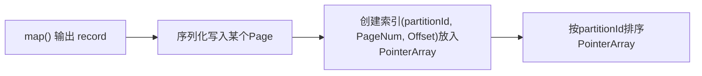
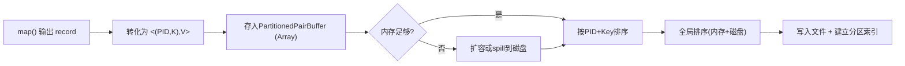
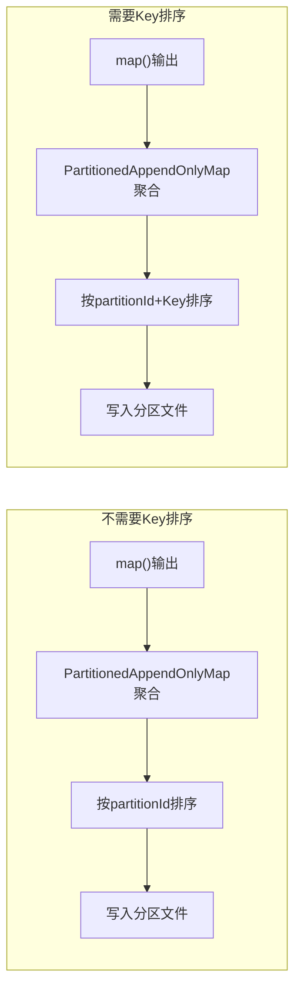
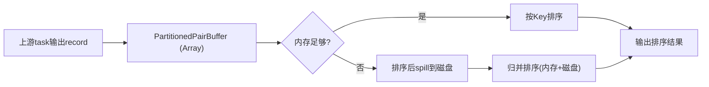
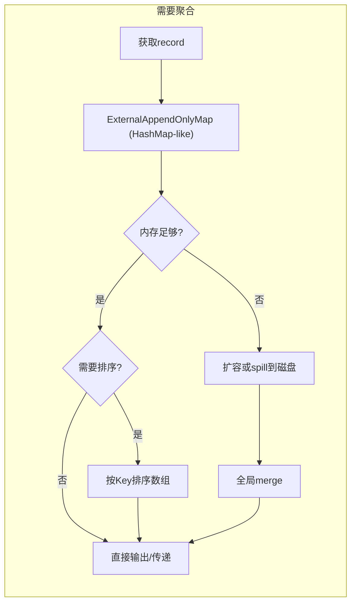

# 第9章 内存管理机制

本章首先分析大数据框架内存管理机制问题及挑战，再分析应用内存消耗来源及影响因素，然后，详细探讨Spark框架内存管理模型和Spark框架执行内存消耗与管理，最后，讨论数据缓存空间管理，并进行总结和优化。

## 9.1 内存管理机制问题及挑战

大数据处理框架如MapReduce、Spark等，需要在内存中处理大量数据，内存消耗要比一般的软件系统高。由于内存空间有限，如何高效地管理和使用内存成为重要问题。除了在内存中处理大量数据，Spark还在内存中缓存大量数据来避免重复计算，所以Spark内存管理机制面临更多挑战，下面具体分析这些挑战。

1. **内存消耗来源多种多样，难以统一管理。** Spark在运行时内存消耗主要包括3个方面：第1个方面是框架本身在处理数据时需要消耗内存，如Spark在Shuffle Write/Read过程中使用类似HashMap和Array的数据结构对数据进行聚合和排序。第2个方面是数据缓存，如将需要重复使用的数据缓存到内存中避免重复计算。第3个方面是用户代码消耗的内存，如用户可以在`reduceByKey(func)`、`mapPartitions(func)`的func中自己定义数据结构，暂存中间处理结果。由于内存空间有限，如何对这些缓存数据和计算过程中的数据进行统一管理呢，如何平衡数据计算与缓存的内存消耗呢？这些解决内存空间不足的问题都具有挑战性。

2. **内存消耗动态变化、难以预估，为内存分配和回收带来困难。** Spark运行时的内存消耗与多种因素相关，如Shuffle机制中的内存用量与Shuffle数据量、分区个数、用户自定义的聚合函数等相关，并且难以预估。用户代码的内存用量与func的计算逻辑、输入数据量有关，也难以预估。而且这些内存消耗来源产生的内存对象的生命周期不同，如何分配大小合适的内存空间，何时对这些对象进行回收的问题也具有挑战性。

3. **task之间共享内存，导致内存竞争。** 在Hadoop MapReduce中，框架为每个task启动一个单独的JVM运行，task之间没有内存竞争。在Spark中，多个task以线程方式运行在同一个Executor JVM中，task之间还存在内存共享和内存竞争，如何平衡内存共享和内存竞争的问题也具有挑战性。

为了应对这些问题，Spark不断改进内存管理机制，最终目的是构建一个高效、可靠的内存管理机制。接下来，我们首先分析内存消耗的来源及影响因素，然后详细介绍Spark框架内存管理模型，最后总结讨论Spark内存管理机制的优化。

## 9.2 应用内存消耗来源及影响因素

为了方便后续讨论，我们首先定义内存消耗是什么？在Hadoop MapReduce中，map/reduce task以JVM进程方式运行，因此Hadoop MapReduce应用内存消耗指的是map/reduce task进程的内存消耗。对于Spark应用来说，其task（名为ShuffleMapTask或ResultTask）以线程方式运行在Executor JVM中。因此，Spark应用内存消耗在微观上指的是task线程的内存消耗，在宏观上指的是Executor JVM的内存消耗。由于Executor JVM中可以同时运行多个task，存在内存竞争，为了简化分析，我们主要关注单个task的内存消耗，必要时再分析Executor JVM的内存消耗。

如图9.1所示，单个task的内存消耗来源主要包含3个方面：用户代码（User code）、框架执行（如Shuffle Write/Read中间数据）和数据存储（如cached RDD）。下面，我们对这些内存消耗来源进行深入分析。

> **图9.1 Spark应用内存消耗来源**  
> （图中包含三个圆形分区，分别标注为：用户代码、框架执行、数据存储，三者共同组成单个task内存消耗）

### 9.2.1 内存消耗来源1：用户代码

在Spark中，用户代码指的是用户采用的数据操作和其中的func，如`map(func)`，`reduceByKey(func)`等。这些操作的内存使用模式大致有两种：一种是每读入一条数据，立即调用func进行处理并输出结果，产生的中间计算结果并不进行存储，如在`filter(record => record > 10)`计算过程中，读入的record如果大于10就输出，否则直接丢弃，内存消耗可以忽略不计。另一种是对中间计算结果进行一定程度的存储，如下面的GroupByTest代码（在第2章中介绍过）所示，用户在`flatMap()`操作中定义了名为arr1的数组，并在该数组存放了中间计算结果，这些中间计算结果会造成内存消耗。

用户代码造成内存消耗的GroupByTest示例如下所示。

```scala
// GroupByTest示例代码片段(仅用于说明用户代码内存消耗)
val pairs = data.flatMap { record =>
  val arr1 = new Array[(Int, Int)](1000) // 用户在flatMap内定义数组,占用内存
  for (i <- 0 until 1000) {
    arr1(i) = (i, i * 2)
  }
  arr1
}
```

**用户代码内存消耗影响因素：** 影响因素包括数据操作的输入数据大小，以及func的空间复杂度。输入数据大小决定用户代码会产生多少中间计算结果，空间复杂度决定有多少中间计算结果会被保存在内存中。Spark在运行时可以获得数据操作的输入数据信息，如`map()`读入了多少个record，`groupByKey()`通过Shuffle Read读取了多少个record等。至于这些record会产生多大的中间计算结果，中间计算结果又有多少会被存放在内存中由用户代码的空间复杂度决定，难以预先估计。

### 9.2.2 内存消耗来源2：Shuffle机制中产生的中间数据

除了执行用户定义的数据操作，Spark还需要执行Shuffle Write/Read阶段，将上游stage中的数据传递给下游stage。根据第6章内容，在Shuffle Write/Read过程中，Spark需要对数据进行分区、聚合、排序等操作，而这些操作需要在内存中存储和处理大量中间数据。Shuffle机制具体包括Shuffle Write和Shuffle Read这两个阶段，这两个阶段的内存消耗如下。

- **Shuffle Write阶段：** 如图9.2所示，该阶段首先对map task输出的Output records进行分区，以便后续分配给不同的reduce task，在这个过程中只需要计算每个record的partitionId，因此内存消耗可以忽略不计。然后，如果需要进行`combine()`聚合，那么Spark会将record存放到类似HashMap的数据结构中进行聚合，这个过程中HashMap会占用大量内存空间。最后，Spark会按照partitionId或者Key对record进行排序，这个过程中可能会使用数组保存record，也会消耗一定的内存空间。

> **图9.2 Shuffle Write过程中的分区（partition）、聚合（aggregate）和排序（sort）过程**  
> （流程图显示：map输出记录 -> 分区 -> 聚合（若需要） -> 排序 -> 输出分区文件）

- **Shuffle Read阶段：** 该阶段将来自不同map task的分区数据进行聚合、排序，得到结果后进行下一步计算。如图9.3所示，首先分配一个缓冲区（buffer）暂存从不同map task获取的record，这个buffer需要消耗一些内存。然后，如果需要对数据进行聚合，那么Spark将采用类似HashMap的数据结构对这些record进行聚合，会占用大量内存空间。最后，如果需要对Key进行排序，那么可能会建立数组来进行排序，需要消耗一定的内存空间。

> **图9.3 Shuffle Read过程中数据获取（Fetch records）、聚合（aggregate）和排序（sort）过程**  
> （流程图显示：从各个map拉取分区数据 -> 缓冲区 -> 聚合（若需要） -> 排序 -> 输出结果）

**Shuffle机制中内存消耗影响因素：** 首先，Shuffle方式影响内存消耗，根据第6章的介绍，不同类型的操作会使用不同类型的Shuffle方式，如`sortByKey()`不需要聚合（Aggregate）过程，而`reduceByKey(func)`需要。其次，Shuffle Write/Read的数据量影响中间数据大小，进而影响内存消耗。最后，用户定义的聚合函数的空间复杂度影响中间计算结果大小，进而影响内存消耗。

这些内存消耗也难以在task运行前进行估计，因此Spark采用动态监测的方法，在Shuffle机制中动态监测HashMap等数据结构大小，动态调整数据结构长度，并在内存不足时将数据spill到磁盘中。

### 9.2.3 内存消耗来源3：缓存数据

在第7章中介绍过，一些复杂应用，特别是迭代型应用会生成多个job，当前job在运行中产生的数据可能被后续job重用。因此，Spark会将一些重用数据缓存到内存中，提升应用性能。回顾第7章中的例子，如图9.4所示，mappedRDD、reducedRDD和groupedRDD都被缓存到内存中以减少下一个job的计算开销。例如，在PageRank应用中，可以将输入图进行缓存，这样在每轮迭代时可以直接从缓存的输入图中进行计算。在机器学习应用中，将训练数据进行缓存，也提高迭代读取和训练效率。

> **图9.4 一个复杂应用中的缓存数据**  
> （图中展示多个RDD之间的依赖关系，其中mappedRDD、reducedRDD、groupedRDD被标记为缓存）

**缓存数据的内存消耗影响因素：** 需要缓存的RDD的大小、缓存级别、是否序列化等。当某个RDD需要缓存时，Spark需要在计算该RDD的过程中将其record写入内存或磁盘。Spark无法提前预测缓存数据大小，只能在写入过程中动态监控当前缓存数据的大小。另外，缓存数据还存在替换和回收机制，因此缓存数据在运行过程中大小也是动态变化的。

## 9.3 Spark框架内存管理模型

分析了内存消耗来源后，我们接下来讨论在Spark中如何对内存空间进行管理，以平衡各种来源的内存消耗。与Hadoop MapReduce不同，Spark中的task是Executor JVM中的一个线程，多个task共享Executor JVM的进程空间，因此Spark内存管理不仅要平衡各种来源的内存消耗，也要解决task的内存共享与竞争。下面，我们详细讨论Spark解决这些问题的方法及其内存管理模型。

### 9.3.1 静态内存管理模型

由于内存消耗包含3种来源且内存空间是连续的，所以，一个简单的解决方法是将内存空间划分为3个分区，每个分区负责存储3种内存消耗来源中的一种，并根据经验确定三者的空间比例。

Spark早期版本（Spark 1.6之前的版本）采用了这个方法，用静态内存管理模型（[[StaticMemoryManager]]）将内存空间划分为如下3个分区。

1. **数据缓存空间（Storage memory）：** 约占60%的内存空间，用于存储RDD缓存数据、广播数据（如第5章中的参数w）、task的一些计算结果等。
2. **框架执行空间（Execution memory）：** 约占20%的内存空间，用于存储Shuffle机制中的中间数据。
3. **用户代码空间（User memory）：** 约占20%的内存空间，用于存储用户代码的中间计算结果、Spark框架本身产生的内部对象，以及Executor JVM自身的一些内存对象等。

这种静态划分方式的优点是各个分区的角色分明、实现简单，缺点是分区之间存在“硬”界限，难以平衡三者的内存消耗。例如，`GroupBy()`、`join()`等应用需要较大的框架执行空间，用于存放Shuffle机制中的中间数据，并不需要太多的数据缓存空间。再例如，某个应用不需要缓存数据，但用户代码空间复杂度很高，因此需要较大的用户代码空间。然而，当前的静态内存管理模型只为用户代码分配了20%的用户代码内存空间，容易出现诸如内存不足、内存溢出之类的错误。为了缓解这个问题，Spark允许用户自己设定三者的空间比例，但对于普通用户来说很难确定一个合适的比例，而且内存用量在运行过程中不断变化，并不存在一个最优的静态比例，也就容易造成内存资源浪费、内存溢出等问题。

### 9.3.2 统一内存管理模型

为了能够平衡用户代码、Shuffle机制中的中间数据，以及数据缓存的内存空间需求，最理想的方法是为三者分配一定的内存配额，并且在运行时根据三者的实际内存用量，动态调整配额比例。然而，在9.2节中介绍过，Shuffle机制中的中间数据、缓存数据的内存消耗可以被监控，但用户代码的内存消耗很难被监控和估计。所以，优化后的内存管理主要是根据监控得到的内存用量信息，来动态调节用于Shuffle机制和用于缓存数据内存空间的。另外，当三者的内存消耗量超过实际内存大小时怎么办？因此，除了内存动态调整还需要进行一定的内存配额限制。一个解决方案是为每个内存消耗来源设定一个上下界，其内存配额在上下界范围内动态可调。

根据以上思想，Spark从1.6版本开始，设计实现了更高效的统一内存管理模型（[[UnifiedMemoryManager]]），仍然将内存划分为3个分区：数据缓存空间、框架执行空间和用户代码空间，与静态内存管理模型不同的是，统一内存管理模型使用“软”界限来调整分区的占用比例。

在这3个分区中，数据缓存空间和框架执行空间组成（共享）了一个大的空间，称为**Framework memory**。Framework memory大小固定，且为数据缓存空间和框架执行空间设置了初始比例，但这个比例可以在应用执行过程中动态调整，如框架执行空间不足时可以借用数据存储空间来“Shuffle”中间数据。同时，两者之间比例也有上下界，使得一方不能完全“侵占”另一方的空间，从而避免因为某一方空间占满导致后续的数据缓存操作或Shuffle操作无法执行。对于用户代码空间，Spark将其设定为固定大小，原因是难以在运行时获取用户代码的真实内存消耗，也就难以动态设定用户代码空间的比例。

另外，当框架执行空间不足时，会将Shuffle数据spill到磁盘上；当数据缓存空间不足时，Spark会进行缓存替换、移除缓存数据等操作。最后，为了限制每个task的内存使用，也会对每个task的内存使用进行限额。下面将详细介绍Spark统一内存管理模型。

如图9.5所示，Spark统一内存管理模型将Executor JVM的内存空间划分如下。该内存管理模型可以使用Executor JVM的堆内内存和堆外内存。

> **图9.5 Spark统一内存管理模型对Executor JVM内存空间划分与使用**  
> （图示：堆内内存分为：Reserved Memory（固定300MB）、User Memory（默认40%剩余内存）、Framework Memory（默认60%剩余内存，再细分为Execution Memory和Storage Memory，两者共享且比例可调）；堆外内存也分为Execution Memory和Storage Memory）

Executor JVM的整个内存空间划分为以下3个部分。

1. **系统保留内存（Reserved Memory）。**  
   系统保留内存使用较小的空间存储Spark框架产生的内部对象（如Spark Executor对象、TaskMemoryManager对象等Spark内部对象），系统保留内存大小通过`spark.testing.ReservedMemory`默认设置为300MB。

2. **用户代码空间（User Memory）。**  
   用户代码空间被用于存储用户代码生成的对象，如`map()`中用户自定义的数据结构。用户代码空间默认约为40%的内存空间。

3. **框架内存空间（Framework Memory）。**  
   框架内存空间包括框架执行空间（Execution Memory）和数据缓存空间（Storage Memory）。总大小为 `spark.memory.fraction (default 0.6) × (heap - Reserved memory)`，约等于60%的内存空间。两者共享这个空间，其中一方空间不足时可以动态向另一方借用。具体地，当数据缓存空间不足时，可以向框架执行空间借用其空闲空间，后续当框架执行需要更多空间时，数据缓存空间需要“归还”借用的空间，这时候Spark可能将部分缓存数据移除内存来归还空间。同样，当框架执行空间不足时，可以向数据缓存空间借用空间，但至少要保证数据缓存空间具有约50%左右（`spark.memory.storageFraction (default 0.5) × Framework memory`大小）的空间。在框架执行时借走的空间不会归还给数据缓存空间，原因是难以代码实现。

**Framework Memory的堆外内存空间：** 为了减少垃圾回收（GC）开销，Spark的统一内存管理机制也允许使用堆外内存。堆外内存类似使用C/C++语言分配的malloc空间，该空间不受JVM垃圾回收机制管理，在结束使用时需要手动释放空间。因为堆外内存主要存储序列化对象数据，而用户代码处理的是普通Java对象，因此堆外内存只用于框架执行空间和数据缓存空间，而不用于用户代码空间。如图9.5所示，如果用户定义了堆外内存，其大小通过`spark.memory.offHeap.size`设置，那么Spark仍然会按照堆内内存使用的`spark.memory.storageFraction`比例将堆外内存分为框架执行空间和数据缓存空间，而且堆外内存的管理方式和功能与堆内内存的Framework Memory一样。在运行应用时，Spark会根据应用的Shuffle方式及用户设定的数据缓存级别来决定使用堆内内存还是堆外内存，如后面介绍的SerializedShuffle方式可以利用堆外内存来进行Shuffle Write，再如用户使用`rdd.persist(OFF_HEAP)`后可以将rdd存储到堆外内存。

虽然Spark内存模型可以限制框架使用的空间大小，但无法控制用户代码的内存消耗量。用户代码运行时的实际内存消耗量可能超过用户代码空间的界限，侵占框架使用的空间，此时如果框架也使用了大量内存空间，则可能造成内存溢出。

了解了内存分区模型之后，我们进一步研究每个分区空间内具体的内存使用和回收机制，以及task之间竞争情况，其中由于系统保存内存与计算无关，不在讨论之内，所以我们主要讨论框架执行空间、数据缓存空间和用户代码空间。

## 9.4 Spark框架执行内存消耗与管理

### 1. 内存共享与竞争

由于Executor中存在多个task，因此框架执行空间实际上是由多个task（ShuffleMapTask或ResultTask）共享的。在运行过程中，Executor中活跃的task数目在 `[0, #ExecutorCores]` 内变化，`#ExecutorCores` 表示为每个### 2. 内存使用

前面提到过，框架执行空间主要用于Shuffle阶段，Shuffle阶段的主要工作是对上游stage的输出数据进行划分，并将其传递到下游stage进行聚合等进一步处理。在这个过程中需要对数据进行partition、sort、merge、fetch、aggregate等操作，执行这些操作需要buffer、HashMap之类的数据结构。由于中间数据量很大，这些数据结构会消耗大量内存。当框架执行内存不足时，Spark会像MapReduce一样将部分数据spill到磁盘中，然后通过排序等方式来merge内存和磁盘上的数据，并用于下一步数据操作。

> **图9.6 框架执行内存空间（Execution Memory），包括堆内空间和堆外空间，由多个task共享**  
> （示意图：多个task线程共享Execution Memory的堆内和堆外区域）

我们在第6章（Shuffle机制）中研究过Shuffle Write和Shuffle Read的过程，但是没有讨论其内存消耗。下面我们详细分析Shuffle Write/Read过程中内存消耗变化及消耗位置（堆内还是堆外）。这部分的内容会与第6章有一些重复，重复是为了完整地展示和分析内存消耗，同时这部分也会探讨第6章中没有涉及的、内存效率更高的Shuffle方式。

### 9.4.1 Shuffle Write阶段内存消耗及管理

在第6章中，我们根据Spark应用是否需要map()端聚合（combine），是否需要按Key进行排序，将Shuffle Write方式分为4种，如表9.1所示。

1. 无map()端聚合、无排序且partition个数不超过200的情况：采用基于buffer的BypassMergeSortShuffleWriter方式。
2. 无map()端聚合、无排序且partition个数大于200的情况：采用Serialized ShuffleWriter。
3. 无map()端聚合但需要排序的情况：采用基于数组的SortShuffleWriter（KeyOrdering=true）方式。
4. 有map()端聚合的情况：采用基于HashMap的SortShuffleWriter（mapSideCombine=true）方式。

**表9.1 不同的Shuffle Write方式及特点**

| Shuffle Write方式 | map()端聚合 | 排序 | partition个数 | 内存数据结构 | 序列化方式 |
|-------------------|-------------|------|---------------|--------------|------------|
| BypassMergeSortShuffleWriter | 否 | 否 | ≤200 | buffer | Unserialized |
| SerializedShuffleWriter | 否 | 否 | >200 | 分页数组 | Serialized |
| SortShuffleWriter（KeyOrdering=true） | 否 | 是 | 任意 | 数组 | Unserialized |
| SortShuffleWriter（mapSideCombine=true） | 是 | 可选 | 任意 | HashMap | Unserialized |

第1、2、4这三种方式都是利用堆内内存来聚合、排序record对象的，属于Unserialized Shuffle方式。这种方式处理的record对象是普通Java对象，有较大的内存消耗，也会造成较大的JVM垃圾回收开销。Spark为了提高Shuffle效率，在2.0版本中引入了Serialized Shuffle方式，核心思想是直接在内存中操作序列化后的record对象（二进制数据），降低内存消耗和GC开销，同时也可以利用堆外内存。然而，由于Serialized Shuffle方式处理的是序列化后的数据，也有一些适用性上的不足，如在Shuffle Write中，只用于无map()端聚合且无排序的情况。如表9.1所示，Serialized Shuffle方式被命名为SerializedShuffleWriter。下面我们详细讨论这4种Shuffle方式的内存消耗。

**（1）不需要map()端聚合，不需要按Key进行排序，且分区个数较小（≤200）。**

在这种情况下，Shuffle Write只需要实现数据分区功能即可。Spark采用的shuffle方式为buffer-based Shuffle，具体实现为BypassMergeSortShuffleWriter。如图9.7所示，map()依次输出<K,V> record，并根据record的partitionId，将其输出到不同的buffer中，每当buffer填满就将record溢写到磁盘上的分区文件中。分配buffer的原因是map()输出record的速度很快，需要进行缓冲来减少磁盘I/O。

> **图9.7 不需要map()端聚合、不需要按Key进行排序的Shuffle Write流程（BypassMergeSortShuffleWriter）**  
> （流程图：map输出 -> 多个buffer（每个分区一个） -> 溢写到磁盘分区文件）

**内存消耗：** 整个Shuffle Write过程中只有buffer消耗内存，buffer被分配在堆内内存（On-heap）中，buffer的个数与分区个数相等，并且生命周期直至Shuffle Write结束。因此，每个task的内存消耗为 `BufferSize (默认32KB) × partition number`。如果partition个数较多，task数目也较多，那么总的内存消耗会很大。所以，该Shuffle方式只适用于分区个数较小（如小于200）的情况。

**（2）不需要map()端聚合，不需要按Key进行排序，且分区个数较大（>200）。**

BypassMergeSortShuffleWriter的缺点是，在分区个数太多时buffer内存消耗过大，那么有没有办法降低内存消耗呢？有，可以采用基于数组排序的方法，核心思想是分配一个大的数组，将map()输出的<K,V> record不断放进数组，然后将数组里的record按照partitionId排序，最后输出即可。这样可行，然而普通的record对象是Java对象，占用空间较大，需要大的数组，而太大的数组容易造成内存不足。另外，大量record对象存放到内存中也会造成频繁GC。前面提到过，为了提升内存利用率，Spark设计了Serialized Shuffle方式（SerializedShuffleWriter），将record对象序列化后再存放到可分页存储的数组中，序列化可以减少存储开销，分页可以利用不连续的空间。

更具体地，使用Serialized Shuffle的优点包括：

- 序列化后的record占用的内存空间小。

# 第9章 内存管理机制（续）

## 9.4.1 Shuffle Write阶段内存消耗及管理（续）

> [!INFO] 普通record对象的问题
> 普通的record对象是Java对象，占用空间较大，需要大的数组，而太大的数组容易造成内存不足。另外，大量record对象存放到内存中也会造成频繁GC。

为了提升内存利用率，Spark设计了[[Serialized Shuffle]]方式（`SerializedShuffleWriter`），将record对象序列化后再存放到可分页存储的数组中。序列化可以减少存储开销，分页可以利用不连续的空间。

### Serialized Shuffle 的优点

- **序列化后的record占用的内存空间小**。
- **不需要连续的内存空间**。如图9.8所示，Serialized Shuffle将存储record的数组进行分页，分页可以利用内存碎片，不需要连续的内存空间，而普通数组需要连续的内存空间。
- **排序效率高**。对序列化后的record按partitionId进行排序时，排序的不是record本身，而是record序列化后字节数组的指针（元数据）。由于直接基于二进制数据进行操作，这里面没有序列化和反序列化的过程，内存和GC开销降低。
- 可以使用cache-efficient sort等优化技术，提高排序性能。
- 可以使用堆外内存，分页也可以方便统一管理堆内内存和堆外内存。

### 使用Serialized Shuffle的条件

需要满足4个条件：

1. 不需要map()端聚合，也不需要按Key进行排序。
2. 使用的序列化类（serializer）支持序列化Value的位置互换功能（relocation of serialized Value），目前[[KryoSerializer]]和Spark SQL的custom serializers都支持该功能。
3. 分区个数小于16,777,216。
4. 单个Serialized record小于128MB。

### 实现方式

Serialized Shuffle采用了分页技术，像操作系统一样将内存空间划分为[[Page]]，每个Page大小在1MB～64MB，既可以在堆内内存上分配，也可以在堆外内存上分配。Page由Executor中的[[TaskMemoryManager]]对象来管理，TaskMemoryManager包含一个[[PageTable]]，可以最多寻址8192个Page。

如图9.8所示，对于map()输出的每个`<K,V>`record，Spark将其序列化后写入某个Page中，再将该record的索引（包括partitionId、所在的PageNum、以及在该Page中的Offset）放到[[PointerArray]]中，然后通过排序partitionId来对record进行排序。



**图9.8 不需要聚合、不需要排序的序列化Shuffle Write流程（SerializedShuffleWriter）**

当Page总大小达到了task的内存限制时（如Task 1中的Page 0+Page 1+Page 2大小超过Task 1的内存界限），将这些Page中的record按照partitionId进行排序，并spill到磁盘上。这样，在Shuffle Write过程中可能会形成多个spill文件。最后，task将这些spill文件归并即可。

#### 更具体的实现细节
1. 首先将新来的`<K,V>`record，序列化写入一个1MB的缓冲区（`serBuffer`）。
2. 然后将`serBuffer`中序列化的record放到[[ShuffleExternalSorter]]的Page中进行排序。
3. 插入和排序方法：首先分配一个[[LongArray]]来保存record的指针，指针为64位：
   - 前24位存储record的partitionId
   - 中间13位存储record所在的Page Num
   - 后27位存储record在该Page中的偏移量
   - 也就是说LongArray最多可以管理 $2^{(13+27)} = 8192 \times 128\text{MB} = 1\text{TB}$ 的内存。
4. 随着record不断地插入Page中，如果LongArray不够用或Page不够用，则会通过`allocatePage()`向TaskMemoryManager申请；如果申请不到，就启动`spill()`程序，将中间结果spill到磁盘上。
5. 最后再由[[UnsafeShuffleWriter]]进行统一的merge。
6. Page由TaskMemoryManager管理和分配，可以存放在堆内内存或者堆外内存。

#### 内存消耗
PointerArray、存储record的Page、sort算法所需的额外空间，总大小不超过task的内存限制。需要注意的是，单个数据结构（如PointerArray、serialized record）不能同时使用堆内内存和堆外内存，因此Serialized Shuffle使用堆外内存最大的问题是：在Shuffle Write时不能同时利用堆内内存和堆外内存，可能会造成更多的spill次数。

---

### （3）不需要map()端combine，但需要排序

在这种情况下需要按照partitionId+Key进行排序。如图9.9所示，Spark采用了基于数组的排序方法，名为[[SortShuffleWriter]]（`KeyOrdering=true`）。

具体方法是：
- 建立一个Array（即[[PartitionedPairBuffer]]）来存放map()输出的record。
- 对Array中元素的Key进行精心设计：将每个`<K,V>`record转化为`<(PID, K), V>`record存储。
- 然后按照PID+Key对record进行排序。
- 最后将所有record写入一个文件中，通过建立索引来标示每个分区。

如果Array存放不下，就会先扩容；如果还存放不下，就将Array中的元素排序后spill到磁盘上。等待map()输出完以后，再将Array中的元素与磁盘上已排序的record进行全局排序，得到最终有序的record，并写入文件中。



**图9.9 不需要map()端combine，需要排序的Shuffle Write流程 - SortShuffleWriter（KeyOrdering=true）**

**内存消耗**：最大的内存消耗是存储record的数组PartitionedPairBuffer，占用堆内内存，具有扩容能力，但大小不超过task的内存限制。

---

### （4）需要map()端聚合，需要或不需要按Key进行排序

在这种情况下，如图9.10的上图所示，Spark采用基于[[HashMap]]的聚合方法。具体实现方法是建立一个类似HashMap的数据结构[[PartitionedAppendOnlyMap]]对map()输出的record进行聚合：
- HashMap中的Key是“partitionId+Key”
- HashMap中的Value是经过相同`combine()`的聚合结果

如果不需要按Key进行排序，则只根据partitionId进行排序（图9.10上图）；如果需要按Key进行排序，那么根据partitionId+Key进行排序（图9.10下图）。最后，将排序后的record写入一个分区文件中。



**图9.10 需要map()端聚合，需要或不需要排序的Shuffle Write流程 - SortShuffleWriter（mapSideCombine=true）**

**内存消耗**：HashMap在堆内分配，需要消耗大量内存。如果HashMap存放不下，则会先扩容为两倍大小；如果还存放不下，就将HashMap中的record排序后spill到磁盘上。放入堆内HashMap或buffer中的record大小，如果超过task的内存限制，那么会spill到磁盘上。

> [!NOTE] 该Shuffle方式的优缺点
> 优点：通用性强、对分区个数也无限制。
> 缺点：内存消耗高（record是普通Java对象）、不能使用堆外内存。

---

## 9.4.2 Shuffle Read阶段内存消耗及管理

在Shuffle Read阶段，数据操作需要跨节点数据获取、聚合和排序3个功能，每个数据操作需要其中的部分功能。Spark为了支持所有的情况，设计了一个通用的Shuffle Read框架，框架的计算顺序为“**数据获取 → 聚合 → 排序**”。

在第6章中，根据Shuffle Read端是否需要聚合（Aggregate），是否需要按Key进行排序，将Shuffle Read方式分为3种，如表9.2所示。

| 方式 | 聚合 | 排序 | 典型操作 | 实现方式 |
|:---|:---:|:---:|:---|:---|
| 1 | 无 | 无 | `partitionBy()` | 基于buffer获取数据并直接处理 |
| 2 | 无 | 需要 | `sortByKey()` | 基于数组排序 |
| 3 | 有 | 可选 | `reduceByKey()` | 基于HashMap聚合 |

**表9.2 不同的Shuffle Read方式及特点**

这3种方式都是利用堆内内存来完成数据处理的，属于[[UnSerialized Shuffle]]方式。

由于第一种情况“无聚合且无排序”的内存消耗非常简单，只包含一个大小为`spark.reducer.maxSizeInFlight=48MB`的缓冲区，我们主要讨论后两种情况的内存消耗。

---

### （1）无聚合但需要排序的情况

这种情况只需要实现数据获取和按Key进行排序的功能。Spark采用了基于数组的排序方式，如图9.11所示：
- 下游的task不断获取上游task输出的record，经过缓冲后，将record依次输出到一个Array结构（[[PartitionedPairBuffer]]）中。
- 然后，对Array中的record按照Key进行排序，并将排序结果输出或者传递给下一步操作。

当内存无法存下所有的record时，PartitionedPairBuffer会将record排序后spill到磁盘上，最后将内存中和磁盘上的record进行归并排序，得到最终排序后的record。



**图9.11 无聚合但需要排序的Shuffle Read流程**

**内存消耗**：由于Shuffle Read端获取的是各个上游task的输出数据，因此需要较大的Array（PartitionedPairBuffer）来存储和排序这些数据。Array大小可控，具有扩容和spill到磁盘上的功能，并在堆内分配。

---

### （2）有聚合的情况

在这种情况下，需要实现数据聚合功能，同时提供按Key进行排序的功能。Spark采用基于HashMap的聚合方法和基于数组的排序方法。

如图9.12的上图所示：
- 获取record后，Spark建立一个类似HashMap的数据结构（[[ExternalAppendOnlyMap]]）对buffer中的record进行聚合。
- HashMap中的Key是record中的Key，HashMap中的Value是具有相同Key的record经过聚合函数（func）计算后的结果。
- 由于ExternalAppendOnlyMap底层实现是基于数组来存放`<K,V>`record的，因此，如果需要排序（如图9.12的下图所示），则可以直接对数组中的record按Key进行排序，排序完成后，将结果输出或者传递给下一步操作。

如果HashMap存放不下，则会先扩容为两倍大小；如果还存放不下，就将HashMap中的record排序后spill到磁盘上，最后将磁盘文件和内存中的record进行全局merge。



**图9.12 需要聚合，不需要或需要按Key进行排序的Shuffle Read流程**

**内存消耗**：由于Shuffle Read端获取的是各个上游task的输出数据，用于数据聚合的HashMap结构会消耗大量内存，而且只能使用堆内内存。当然，HashMap的内存消耗量也与record中不同Key的个数及聚合函数的复杂度相关。HashMap具有扩容和spill到磁盘上的功能，支持小规模到大规模数据的聚合。

至此，我们讨论了Shuffle Write/Read阶段的内存消耗，以及在内存不足时的应对方法。下面先讨论数据缓存空间的管理方法。

---

## 9.5 数据缓存空间管理

如图9.13所示，数据缓存空间主要用于存放3种数据：
- [[RDD]]缓存数据（RDD partition）
- [[Broadcast]]数据（Broadcast data）
- task的计算结果（[[TaskResult]]）

另外，还有几种临时空间，如用于反序列化（展开iterator为Array[]）的临时空间、用于存放Netty网络数据传输的临时空间等。

**图9.13 Storage Memory模型及可以缓存的数据**

与框架执行内存空间一样，数据缓存空间也可以同时存放在堆内和堆外，而且由task共享。不同的是，每个task的存储空间并没有被限制为1/N。在缓存时如果发现数据缓存空间不够，且不能从框架执行内存空间借用空间时，就只能采取缓存替换或者直接丢掉数据的方式。缓存替换方式在第7章中已经详细介绍，这里主要讨论缓存数据的内存消耗问题。

下面具体介绍3种缓存数据的存储与管理。

### 9.5.1 RDD缓存数据

数据缓存空间最主要存储的是RDD缓存数据。在第5章中介绍过一些应用，如迭代型机器学习应用，需要将训练数据及在迭代时需要多次用到的数据缓存到内存中，缓存方法是调用`rdd.persist(Storage_Level)`。不同的`Storage_Level`代表不同的存储模式，Spark中的数据缓存级别如表9.3所示。

| 缓存级别 | 存储位置 | 序列化 | 副本 |
|:---|:---|:---:|:---:|
| MEMORY_ONLY | 堆内内存 | 否 | 1 |
| MEMORY_AND_DISK | 堆内内存+磁盘 | 否 | 1 |
| MEMORY_ONLY_SER | 堆内内存 | 是 | 1 |
| MEMORY_AND_DISK_SER | 堆内内存+磁盘 | 是 | 1 |
| OFF_HEAP | 堆外内存 | 是 | 1 |

**表9.3 Spark中的数据缓存级别**

另外，还有`MEMORY_ONLY_2`、`MEMORY_AND_DISK_2`等模式，可以将缓存数据复制到多台机器上。下面分析表9.3中几种方式的实现及内存消耗。

---

#### （1）MEMORY_ONLY / MEMORY_AND_DISK模式

**实现方式**：如图9.14所示，蓝色的MapPartitionsRDD是需要被缓存的数据，task在计算该RDD partition的过程中会将该partition缓存到Executor的[[memoryStore]]中。可以认为memoryStore代表了堆内的数据缓存空间。在第7章中介绍过，memoryStore持有一个链表（[[LinkedHashMap]]）来存储和管理缓存的RDD partition。

如图9.14所示，在链表中：
- Key的形式是`(rddId=m，partitionId=n)`，表示其Value存储的数据来自RDD m的第n个分区；
- Value是该partition的引用，引用指向一个名为[[DeserializedMemoryEntry]]的对象。该对象包含一个Vector，里面存放了partition中的record。

由于缓存级别没有被设置为序列化存储，这些record以普通Java对象的方式存放在Vector中。需要注意的是，一个Executor中可能同时运行多个task，因此，链表被多个task共用，即数据缓存空间由多个task共享。

**内存消耗**：数据缓存空间的内存消耗由存放到其中的RDD record大小决定，即等于所有task缓存的RDD partition的record总大小。

---

#### （2）MEMORY_ONLY_SER / MEMORY_AND_DISK_SER模式

**实现方式**：与MEMORY_ONLY的实现方式基本相同，唯一不同的是，这里的partition中的record以序列化的方式存储在一个[[ChunkedByteBuffer]]（不连续的ByteBuffer数组）中，如图9.15所示。

使用不连续的ByteBuffer数组的目的是方便分配和回收，因为如果record非常多，序列化后就需要一个非常大的数组来存储，而此时的内存空间如果没有连续的一大块空间，就无法存储。在之前的MEMORY_ONLY模式中不存在这个问题，因为单个普通Java对象可以存放在内存中的任意位置。

**内存消耗**：由存储的record总大小决定，即等于所有task缓存的RDD partition的record序列化后的总大小。

---

#### （3）OFF_HEAP模式

**实现方式**：如图9.16所示，该缓存模式的存储方式与MEMORY_ONLY_SER / MEMORY_AND_DISK_SER模式基本相同，需要缓存的partition中的record也是以序列化的方式存储在一个ChunkedByteBuffer（不连续的ByteBuffer数组）中的，只是存放位置是堆外内存。

**内存消耗**：存放到OFF_HEAP中的partition的原始大小。

> [!NOTE] 当前限制
通过以上分析可以看到，目前堆内内存和堆外内存还是独立使用的，并没有可以同时存放到堆内内存和堆外内存的缓存级别，即堆内内存和堆外内存并没有协作。

**图9.16 OFF-HEAP序列化缓存模式**

---

### 9.5.2 广播数据

有些应用在运行前，需要将多个task的公用数据广播到每个节点，如当map stage中的task都需要一部词典时，可以先将该词典广播给各个Executor，然后每个task从Executor中读取词典，因此广播数据的存储位置是Executor的数据缓存空间。

**实现方式**：Broadcast默认使用类似BT下载的[[TorrentBroadcast]]方式。如图9.17所示，需要广播的数据一般预先存储在Driver端，Spark在Driver端将要广播的数据划分大小为`spark.Broadcast.blockSize=4MB`的数据块（block），然后赋予每个数据块一个blockId为`BroadcastblockId(id, "piece"+i)`，id表示block的编号，piece表示被划分后的第几个block。之后，使用类似BT的方式将每个block广播到每个Executor中。Executor接收到每个block数据块后，将其放到堆内的数据缓存空间的ChunkedByteBuffer里面，缓存模式为`MEMORY_AND_DISK_SER`，因此，这里的ChunkedByteBuffer构造与`MEMORY_ONLY_SER`模式中的一样，都是用不连续的空间来存储序列化数据的。

**图9.17 对广播数据进行缓存**

**内存消耗**：序列化后的Broadcast block总大小。

**内存不足**：Broadcast data的存放方式是内存+磁盘，内存不足时放入磁盘。

---

### 9.5.3 task的计算结果

许多应用需要在Driver端收集task的计算结果并进行处理，如调用了`rdd.collect()`的应用。当task的输出结果大小超过`spark.task.maxDirectResultSize=1MB`且小于1GB时，需要先将每个task的输出结果缓存到执行该task的Executor中，存放模式是`MEMORY_AND_DISK_SER`，然后Executor将task的输出结果发送到Driver端进一步处理。

如图9.18所示，Driver端需要收集task1和task2的计算结果，那么task1和task2计算得到结果Result1和Result2后，先将其缓存到Executor的数据缓存空间中，缓存级别为`MEMORY_AND_DISK_SER`，缓存结构仍然采用ChunkedByteBuffer。然后，Executor将Result1和Result2发送到Driver端进行进一步处理。

**图9.18 对task的计算结果进行缓存**

**内存消耗**：序列化后的task输出结果大小，不超过1GB。在Executor中一般运行多个task，如果每个task都占用了1GB以上的话，则会引起Executor的数据缓存空间不足。

**内存不足**：因为缓存方式是内存+磁盘，所以在内存不足时放入磁盘。

---

## 9.6 本章小结

### 1. 内存管理方法总结

介绍完Spark的内存管理模型后，我们再回到本章开头提到的挑战性问题，总结一下解决这些问题的主要方法。

#### （1）内存消耗来源多种多样，难以统一管理。

Spark在运行时的内存消耗主要包括3个方面：Shuffle数据、数据缓存、用户代码运行。由于内存空间有限，如何对这些缓存数据和计算过程中的数据进行统一管理呢？Spark采用的主要方法是将内存划分为3个区域，每个区域分别负责存储和管理一项内存消耗来源。如何平衡数据计算与缓存的内存消耗？Spark采用的统一内存管理模型通过“硬界限+软界限”的方法来限制每个区域的内存消耗，并通过内存共享达到平衡。硬界限指的是Spark将内存分为固定大小的用户代码空间（User memory）和框架内存空间（Framework memory）。软界限指的是框架内存空间（Framework memory）由框架执行空间（Execution memory）和数据缓存空间（Storage memory）共享。如何解决内存空间不足的问题？框架执行空间或者数据缓存空间不足时可以向对方借用，如果还不够，则会采取spill到磁盘上、缓存数据替换、丢弃等方法。

#### （2）内存消耗动态变化难以预估，为内存分配和回收带来困难。

Spark在运行时的内存消耗与多种因素相关，难以预估。用户代码的内存用量与func的计算逻辑、输入数据量有关，也难以预估。而且这些内存消耗来源产生的内存对象的生命周期不同，如何分配大小合适的内存空间，何时对这些对象进行回收？由于内存消耗难以提前估计，Spark采取的方法是边监控边调整，如通过监控Shuffle Write/Read过程中数据结构大小来观察是否达到框架执行空间界限、监控缓存数据大小观察是否达到数据缓存空间界限，如果达到界限，则进行数据结构扩容、空间借用或者将缓存数据移出内存。

#### （3）task之间共享内存，导致内存竞争。

在Spark中，多个task以线程方式运行在同一个Executor JVM中，task之间还存在内存共享和内存竞争的问题...